# InterPose 人-物-人数据构建与 SPIDER 适配方案

_全局方案 v0.1 · 基于 R001 审计结论 · 2026-07-25_

---

## 📋 决策摘要

InterPose 发布包不能直接适配为 SPIDER 人-物-人数据。发布包只有逐 track
SMPL-X 人体运动，论文明确说明不提取物体运动；`frame_ids` 虽在官方中间
结果中参与分段和视频裁剪，但没有写入最终 NPZ。[^1][^2]

推荐路线是：复用官方开源代码的检索、下载、shot split、人体估计和 caption
能力，从可合法使用的原始互联网视频重新构建同步的“两人 + 同一物体”
几何数据，再进入 SPIDER S0–S6。[^3]

首个 production 目标只做：

```text
interaction_type = simultaneous_joint_support
object type = rigid, initially box-like
role routes = person_a_as_robot + person_b_as_robot
retarget/target = omnirt_v1/ref_fk
```

`handoff` 另建 interaction type 和时序 gate，不与“同时共同承力”混在同一
positive 定义中。球类对抗、两人各用一个同类物体、共享桌椅背景等只作为
negative/review，不进入首批 production。

## 🎯 目标与非目标

### 目标数据定义

一个可进入 SPIDER 的 H-O-H case 必须同时满足：

1. 两个可区分的人在同一原始 shot 和统一时间轴
2. 两套 SMPL-X 处于同一 metric world frame
3. 一个稳定 `object_track_id` 对应同一物理物体实例
4. 有该物体的 mesh、metric scale 和逐帧 SE(3)
5. 两个人到同一 object mesh 的接触证据可独立计算
6. 原视频、许可、frame map、模型和参数 provenance 完整

### 非目标

- 只因 caption 都出现 `box`、`ball` 或 `table` 就判正
- 把 tracker ID 当作永久人物身份
- 把单人 NPZ 的相同 clip prefix 当作同步证明
- 用静态类别 proxy 代替动态 object trajectory
- 直接训练双机器人策略；首阶段先验证单机器人 + 同步 partner 表达
- 把 CEM pass 写成 RL success

## 🏠 工作区与结果布局

所有实验计划、脚本、配置、日志、registry 和结果索引统一放在
`workspace/InterPose/`。大体量原视频可放外部数据盘，但每个输入必须由
workspace 内 manifest 记录绝对路径、URL/video ID、许可、sha256 和缓存状态。

```text
workspace/InterPose/
├── EXPERIMENT_TRACKER.md
├── data_stat.md
├── adaptation_plan.md
├── plan/
├── log/
├── progress.md
├── configs/
├── docs/
├── scripts/
│   ├── data/
│   ├── reconstruction/
│   ├── convert/
│   ├── eval/
│   └── launch/active/
└── results/
    ├── R001/                         # 当前发布包审计
    └── E###/                         # 后续正式构建实验
        ├── w0_provenance/
        ├── w1_video_intake/
        ├── w2_hoh_annotation/
        ├── w3_multi_human/
        ├── w4_object_reconstruction/
        ├── w5_joint_bundle/
        ├── s0_environment/
        ├── registries/
        ├── s1_raw_contact/
        ├── s2_templates/
        ├── s3_retarget/
        ├── s4_gate_visual_qc/
        ├── s5_handoff/
        └── s6_downstream/
```

正式 run 使用 `workspace/InterPose/results/E###/`；smoke 可用临时目录，但任何
要保留或引用的 evidence 必须回写正式 run root。二进制视频、mesh、NPZ 和
渲染不进 git，文档、schema、脚本、小型 manifest 和验证摘要进 git。

## 🔄 总体阶段

```mermaid
flowchart LR
    accTitle: InterPose H-O-H Adaptation Pipeline
    accDescr: Web-video reconstruction stages create synchronized two-human and object geometry before the existing SPIDER S0 through S6 gates are allowed to run.

    subgraph web_rebuild ["🌐 Web video reconstruction"]
        w0[🔐 W0 provenance] --> w1[📥 W1 video intake]
        w1 --> w2[🔍 W2 H-O-H labels]
        w2 --> w3[👥 W3 multi-human fit]
        w3 --> w4[📦 W4 object SE3]
        w4 --> w5[🔗 W5 joint bundle]
    end

    subgraph spider_build ["⚙️ SPIDER data construction"]
        s0[⚙️ S0 environment] --> s1[📊 S1 dual contact]
        s1 --> s2[📦 S2 templates]
        s2 --> s3[🔄 S3 role retarget]
        s3 --> s4[✅ S4 gate and QC]
        s4 --> s5[📤 S5 handoff]
        s5 --> s6[🧪 S6 CEM and RL]
    end

    w5 -->|Canonical raw pass| s0

    classDef rebuild fill:#dbeafe,stroke:#2563eb,stroke-width:2px,color:#1e3a5f
    classDef spider fill:#ede9fe,stroke:#7c3aed,stroke-width:2px,color:#3b0764
    classDef success fill:#dcfce7,stroke:#16a34a,stroke-width:2px,color:#14532d

    class w0,w1,w2,w3,w4 rebuild
    class s0,s1,s2,s3,s4,s5,s6 spider
    class w5 success
```



硬边界：

> ⚠️ **Block:** 没有原始 frame sync 或 object trajectory 的 case 不得进入
> SPIDER S1。文本候选只能停在 W2 review queue。

## 🌐 W0–W5：从视频重建 H-O-H

### W0：provenance 与许可

**输入：** R001 候选、官方查询词、用户明确提供的视频源。

**动作：**

- 为 YouTube/Online、Charades、HD-VILA、Kinetics 分开核验获取方式和许可
- 记录 source URL/video ID、数据集 split、下载时间、sha256、用途限制
- 固化官方代码 commit、模型权重版本、环境和配置
- 对无法确认研究使用权或无法重分发的视频标记 `LICENSE_REVIEW`

**输出：**

- `w0_provenance/source_manifest.tsv`
- `w0_provenance/license_review.tsv`
- `w0_provenance/repo_manifest.json`

**Gate：** `provenance_status=pass` 且 `license_status` 明确；否则不下载或只做
本地隔离审查，不进入可发布数据。

### W1：query、下载与 shot 切分

复用官方数据构建仓库的检索/下载、metadata VLM 筛选、PySceneDetect 和视频
预过滤框架。官方 pipeline 已覆盖 interaction-rich 视频查询、shot split、
full-body/interaction 过滤、WHAM + HaMeR 人体估计与 VLM caption。[^1][^2]

必须新增：

- 原始视频不在中途删除，至少保留受控缓存与 sha256
- 维护 `source_frame_id`、PTS timestamp、shot-local frame index 的双向 map
- 不把所有视频隐式重写为 30 FPS；重采样必须输出 mapping
- 保留全帧视频和 camera metadata，不只保留单人 crop

**输出：**

- `w1_video_intake/video_manifest.tsv`
- `w1_video_intake/shot_manifest.tsv`
- `w1_video_intake/frame_map/*.parquet`
- 受控 `videos/` 与 `shots/` 缓存路径

**Gate：** shot 边界、FPS/PTS、分辨率、sha256 和帧数相互一致。

### W2：clip-level H-O-H 与共享 object identity

R001 的 `725 pairs / 263 groups` 高优先级文本队列先用于回查；同时新增定向
query，例如“两人共同搬箱/抬箱/搬长板”，避免候选被球类对抗淹没。

每个 shot 先由 VLM 预标，再由人工审查以下字段：

| 字段 | 要求 |
| --- | --- |
| `person_pair_id` | shot 内稳定的两人 pair，不复用裸 tracker ID |
| `person_a_track_ids` / `person_b_track_ids` | 允许记录并合并身份碎片 |
| `object_track_id` | 同一物理物体实例，不只是类别 |
| `object_category` | 规范类别 |
| `interaction_type` | `simultaneous_joint_support` / `handoff` / reject |
| `role_hint` | supporter/receiver 等可选语义，不决定后续 robot route |
| `visible_interval` | 两人和物体均可验证的 frame interval |
| `review_decision` | pass/reject/review + reason |

首批 positive 必须在可见区间内两人共同作用于同一个刚性物体。仅同框、对抗、
轮流碰同类别物体、坐同一张桌旁或 caption 误报都 reject。

**输出：**

- `w2_hoh_annotation/clip_hoh_manifest.tsv`
- `w2_hoh_annotation/object_instance_review.tsv`
- review keyframe/contact sheets

**Gate：** `review_decision=pass`、pair/object identity 明确、目标区间无歧义。

### W3：同步多人重建

复用 WHAM + HaMeR/SMPL-X，但改变发布 contract：

1. 在完整 shot 上检测和跟踪全部人
2. 对 track fragments 做身份 stitching 和人工复核
3. 两套人体共享 camera/world 坐标、metric scale 和 frame map
4. 保留原始 `frame_ids`、缺失/插值 mask、bbox、置信度和 crop transform
5. 只保留两人都能可靠重建的同步区间；不得各自独立 trim 后再猜对齐

官方 `post_process()` 已使用 `frame_ids` 检测 gap，说明中间数据具备恢复同步
所需的原料；需要修改的是最终 export，不能再次丢弃这些字段。[^2]

**输出：**

```text
w3_multi_human/<case_id>/
├── human_a_smplx.npz
├── human_b_smplx.npz
├── frame_map.npz
├── camera_world.npz
├── track_stitch_manifest.json
└── overlay_review.mp4
```

**Gate：**

- `T_a = T_b = T_frame_map`
- 每个 retained frame 对应唯一原始 frame/PTS
- 两人坐标系和 scale provenance 相同
- 无 NaN/Inf、无未解释的大幅 teleport
- track stitching 通过可视化复核

### W4：物体 mask、track、geometry、SE(3) 与 scale

这是当前官方 pipeline 缺失、风险最高的新子系统。对 W2 的
`object_track_id`：

1. 逐帧分割并跨帧保持同一 object instance
2. 获取或重建 object mesh/CAD proxy
3. 估计 metric scale 和 mesh local frame
4. 估计每帧 `world_T_object`
5. 对遮挡、对称物体和 pose ambiguity 保存置信度/多解状态
6. 用 mask/edge/mesh overlay 做人工审查

首批只选刚性、近 box、纹理/轮廓足够且没有严重遮挡的物体。布料、绳、液体、
可形变包和无法确定尺度的物体进入 backlog。

**输出：**

```text
w4_object_reconstruction/<case_id>/
├── object_mesh.obj
├── object_pose.npz               # world_T_object: (T, 4, 4)
├── object_masks/
├── object_calibration.json
├── pose_confidence.npz
└── mesh_pose_overlay.mp4
```

**Gate：**

- `object_track_id` 在全区间对应同一实例
- mesh、scale、local frame 和 `world_T_object` 均有 provenance
- 每个 retained frame 有 finite pose 或显式 reject
- overlay 不出现系统性漂移、翻转、尺度错配或身份切换

### W5：joint bundle、contact fit 与 canonical raw export

将两个人、camera 和 object pose 放入同一优化问题，使用 reprojection、时序
平滑、人体/物体 penetration 和候选接触约束联合校正。优化不能凭文本强行
制造接触；文本只用于选择可能的 contact window。

canonical raw contract：

| 字段 | shape / 语义 |
| --- | --- |
| `frame_ids` / `timestamps` | `(T,)`，原视频可逆映射 |
| `human_a.poses/trans/betas` | `(T,165)` / `(T,3)` / `(10,)` |
| `human_b.poses/trans/betas` | 同上 |
| `world_T_object` | `(T,4,4)` |
| `object_mesh` / `object_scale` | 唯一 mesh 和 metric scale |
| `person_pair_id` | 稳定 pair ID |
| `object_track_id` | 稳定 instance ID |
| `interaction_type` | joint-support 或 handoff |
| `source_provenance` | video、frame、license、代码/模型版本 |

**Gate：** schema、坐标、时间、scale、overlay 和 provenance 全 pass 后，才写
`canonical_raw_status=pass` 并允许进入 SPIDER。

## ⚙️ S0–S6：适配 SPIDER

### S0：环境与配置

在现有 `data_construction_v3` S0 基础上新增检查：

- InterPose-HOH canonical raw schema/version
- 两套 SMPL-X 与 object mesh/pose 路径
- object reconstruction 依赖与模型权重
- partner actor 的 MuJoCo/SPIDER adapter
- 所有输入 sha256 和坐标约定

输出 `s0_environment/environment_check.{json,md}` 和 resolved config。

### S0b：registry 初始化

S0–S2 主键至少为：

```text
(case_id, person_pair_id, object_track_id)
```

S3 后扩展为：

```text
(case_id, person_pair_id, object_track_id, role_variant_id,
 retarget_variant_id, target_variant_id)
```

S5/CEM 后再加入 `hand_collision_variant_id`。必须新增或保留：

- `person_a_id` / `person_b_id`
- `person_pair_id`
- `object_track_id`
- `interaction_type`
- `role_variant_id`
- `partner_representation`
- `frame_sync_status`
- `object_pose_status`
- `canonical_raw_evidence_root`

所有状态通过更新脚本写 registry，不手改 TSV。

### S1：两个人到同一 object mesh 的 raw contact

对同一个 `world_T_object` 和 mesh，分别计算：

```text
person_a_contact_mask_3cm / 5cm
person_b_contact_mask_3cm / 5cm
both_people_active_3cm / 5cm
```

每个人还应保留左右手/掌/指尖来源、active fraction、longest run 和
object-local contact centroid。3 cm 与 5 cm 两档并行输出，不能互相覆盖。

interaction gate 分开：

| 类型 | 首版 gate |
| --- | --- |
| `simultaneous_joint_support` | 两人对同一 object instance 有重叠 contact window；初始 smoke 可用 `min_joint_contact_overlap=0.25s`，pilot 后锁定阈值 |
| `handoff` | A-contact → overlap/transfer → B-contact，object pose 连续；单独 manifest 与阈值 |

raw contact 是几何 proxy，不是物理成功。没有 object pose、frame sync 或共同
object instance 的 row 必须 `REJECT_CANONICAL_RAW_CONTRACT`，不能计算伪 mask。

### S2：source scene template

复用现有 template policy：

- box-like 刚体可从 clean base 构建并审计 mesh AABB/collision/mass/inertia
- source scene missing 进入 backlog，不等于数据 reject
- 非 box 可生成 reviewable proxy，但必须保持 `manual_review_required`
- 非 box 只有显式 `approve_clean → clean_reviewed` 才能进入 S3

对新物体必须生成 object-only mesh/collision overlay。禁止把 generic table、
chair 或单 AABB proxy 自动当作真实物体几何。

### S3：retarget 与双 role route

默认先使用：

```text
retarget_variant_id = omnirt_v1
target_variant_id = ref_fk
```

同一 pair 必须生成两个互不覆盖的 role route：

```text
role_variant_id = person_a_as_robot
role_variant_id = person_b_as_robot
```

每条 route 中，被选的人重定向为 G1；另一人作为同步 kinematic partner/reference
保留，object trajectory 不变。输出目录必须带完整 axes：

```text
s3_retarget/<role_variant>/<retarget_variant>/<target_variant>/
```

首版不把两个人都独立重定向后拼成无同步保证的双机器人场景。
`dual_robot_future` 只能作为后续新 role variant。partner actor adapter 未实现或
未验证时，S3 只能生成 manifest/dry-run，不能冒充 execute pass。

`fingertip_aware` 仍需 E099–E101 route diagnostics；它不是首批默认路线。

### S4：target gate 与 visual QC

机器 gate 除现有 trajectory/scene/contact/replay 检查外，新增：

- robot、partner、object 的 frame 数和时间严格一致
- partner reference 跟踪误差
- robot–partner 与 partner–object penetration
- 两个人对同一 object 的 contact window 是否在 retarget 后保持
- object tracking error、ground contact、pelvis/fall 指标
- role route 的输入/output/provenance 是否完整

visual QC 每个 role route 都要渲染：

- robot + partner + object mesh
- object local frame 与 trajectory
- A/B 的 3 cm / 5 cm contact overlay
- 原视频关键帧对照

`target_gate_status=pass` 后仍为 `visual_qc_status=review`；人工/LLM 明确 pass
之前不能进入 release handoff。

### S5：candidate bank 与 handoff

handoff manifest 必须携带：

```text
case_id, person_pair_id, object_track_id, interaction_type,
role_variant_id, retarget_variant_id, target_variant_id,
hand_collision_variant_id, partner_representation,
scene_act, trajectory, partner_trajectory, object_trajectory,
contact_mask_a, contact_mask_b, source_exp_id
```

两个 role route 都保留，禁止后运行的 route 覆盖先运行的 route。
机器人手部碰撞体继续用独立 `hand_collision_variant_id` 轴；物体 collision
proxy 仍由 S2 `collision_policy` 管理，两者不能混用。

### S6：CEM/RL 下游证据

首个 CEM smoke 要先证明 partner actor 能在 scene 中同步 replay，且不会因
错误 collision/body 配置造成伪 contact。随后分别记录：

- `cem_status`
- `rl_status`
- `downstream_decision`
- `spider_method_id`
- `source_exp_id`
- evidence path

只有 S5 ready、S4 gate/QC pass、CEM pass 且所有 scene/trajectory 文件存在的
row，才进入 `rl_export_decision=RL_EXPORT_READY`。CEM pass 不等于 RL 收敛。

## 📊 验证矩阵

| 阶段 | 必验事实 | 失败去向 |
| --- | --- | --- |
| W0 | 来源、许可、sha、代码/模型版本 | `LICENSE/PROVENANCE_REVIEW` |
| W1 | PTS/frame map 可逆、shot 边界一致 | `REJECT_VIDEO_INTAKE` |
| W2 | 两人 + 同一 object instance + 类型明确 | `REJECT_NOT_HOH` / review |
| W3 | 两人同步、同坐标/尺度、身份连续 | `REJECT_MULTI_HUMAN_FIT` |
| W4 | mesh/scale/SE(3) 完整且 overlay 合理 | `REJECT_OBJECT_RECON` |
| W5 | canonical raw schema/provenance 全 pass | `REJECT_CANONICAL_RAW_CONTRACT` |
| S1 | A/B 到同一 mesh 的 3 cm/5 cm contact | `REJECT_RAW_CONTACT` |
| S2 | template load/geometry/inertia/review | template backlog |
| S3 | 两 role route 隔离且输出完整 | Stage2b reject/not-run |
| S4 | machine gate + visual QC | gate/QC reject |
| S5 | 完整 axes 与 handoff paths | rejected manifest |
| S6 | CEM 与 RL 证据分离 | downstream-only status |

## ⚠️ 可行性与主要风险

### 总体判断

| 子问题 | 可行性 | 依据与缺口 |
| --- | --- | --- |
| 发布 NPZ 直接适配 | 不可行 | 无 object SE(3)、frame sync、共享 instance |
| 原视频双人 SMPL-X 重建 | 中高 | 官方 WHAM + HaMeR 链路和中间 `frame_ids` 可复用 |
| pair/object 文本筛选 | 中 | 可降检索成本，但误报高，必须人工/几何复核 |
| object mesh/scale/SE(3) | 中低 | 官方明确未实现，是最大技术风险 |
| canonical raw → SPIDER S1/S2 | 中高 | 几何 contract 齐备后可复用 v3 gate |
| 单机器人 + partner runtime | 中 | 需要新 scene/partner adapter 和碰撞审计 |
| 双机器人 joint control | 低至中 | 超出首批范围，需新 runtime/policy 设计 |

从工程上是“条件可行”：官方代码已解决视频入口和人体估计的大部分工作，
但 object reconstruction、统一尺度/坐标和 SPIDER partner actor 是三项实质性
新开发。不能把它描述为简单格式转换。

### 风险预演

| 风险 | 影响 | 缓解 |
| --- | --- | --- |
| 原视频失效或许可不清 | 无法复现/发布 | W0 先行，保存 video ID/sha/许可决定 |
| tracker 身份碎片 | 伪双人或错配 | pair ID 独立于 tracker ID，stitch + visual review |
| 单目 scale 漂移 | contact/template 全错 | 人/物/camera 联合尺度，metric reference 与 overlay |
| 物体遮挡/对称 | SE(3) 翻转和跳变 | 多解置信度、时序优化、人工 reject |
| 文本共享类别误报 | 假 H-O-H | 只作 W2 queue，不进入 S1 |
| 非刚性物体 | mesh/pose contract 不成立 | 首批排除，单独 deformable backlog |
| partner scene 配置错误 | 伪碰撞/伪 contact | adapter canary、维度/碰撞/回放 gate |
| role route 覆盖 | 丢失对照和 provenance | `role_variant_id` 加入主键和路径 |
| 非 box proxy 自动放行 | 物理污染 | 强制 manual review / `clean_reviewed` |

## 🧪 建议的实施顺序

### Pilot 0：来源与候选

- 从 `725/263` 高优先级队列和定向 query 中选 `20–50` 个原视频 shot
- 只选刚性、box-like、同时共同承力的案例
- 完成 W0–W2，验证视频可恢复率、许可和人工 precision

**Go：** 至少形成一批明确的同一 object instance、两人同步可见案例。

### Pilot 1：几何重建

- 对约 `10` 个最佳 shot 完成 W3–W4
- 重点验证身份 stitching、world scale、object pose overlay
- 保留所有失败样本和 failure taxonomy

**Go：** 至少 `3` 个 case 的两人体和物体 SE(3) 可稳定同步回放。

### Pilot 2：canonical raw 与 SPIDER smoke

- 对 `3` 个 case 完成 W5、S0–S2
- 计算 A/B 到同一 object mesh 的 3 cm/5 cm mask
- 完成 box template 和非 box review policy smoke

**Go：** 至少 `1–3` 个 case 通过 canonical raw、raw contact 和 template gate。

### Pilot 3：role route 与下游

- 为每个 case 同时跑 `person_a_as_robot` 和 `person_b_as_robot`
- 先实现单机器人 + kinematic partner replay
- 通过 S3/S4 后再做 S5/CEM smoke；RL 另立实验

**Go：** 两个 role route 都有隔离产物、可视化和可解释 gate 结果。

### 扩量前的停线条件

出现以下任一情况，不进入批量构建：

- 原视频合法可用率或可恢复率过低
- object SE(3) 在 box pilot 上仍无法稳定
- two-human world scale 无法统一
- partner actor 不能在 SPIDER 中稳定 replay
- contact positive 主要依赖人工猜测而非几何

## ✍️ 首批需要实现的代码

1. `scripts/data/build_web_candidate_manifest.py`
2. `scripts/data/review_hoh_instances.py`
3. `scripts/reconstruction/export_synchronized_humans.py`
4. `scripts/reconstruction/reconstruct_object_track.py`
5. `scripts/reconstruction/fit_joint_hoh_bundle.py`
6. `scripts/convert/export_interpose_hoh_canonical.py`
7. InterPose-HOH inventory/raw-contact adapter
8. registry schema 与 `role_variant_id` 更新工具
9. SPIDER kinematic partner scene adapter
10. dual-contact/role-route target gate 与 visual QC

每项先写 plan/claim/test，再从最小 synthetic fixture 和单 case canary 开始；
不直接启动批量下载、重建或训练。

## 🔗 参考资料

[^1]: Zhang, Y., Butt, A. A., Varol, G., & Laptev, I. (2025). “InterPose: Learning to Generate Human-Object Interactions from Large-Scale Web Videos.” _arXiv:2509.00767_. https://arxiv.org/abs/2509.00767

[^2]: Zhang, Y. et al. (2025). “InterPose data collection framework.” _GitHub, commit a8a8934_. https://github.com/Mael-zys/InterPose-data-collection

[^3]: Zhang, Y. et al. (2025). “InterPose official implementation.” _GitHub, commit 5ee3733_. https://github.com/Mael-zys/InterPose
