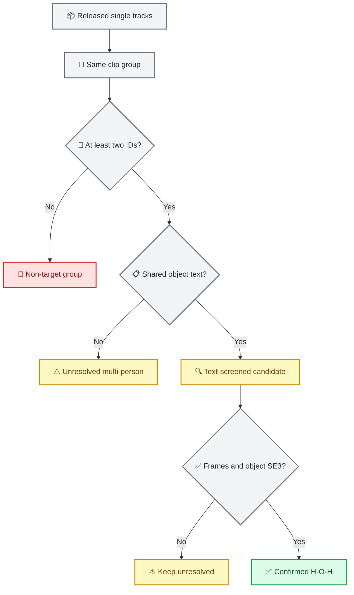

# InterPose 双人协作数据统计

_R001 · 本地发布包全量审计 · 2026-07-25_

---

## 📋 结论

本地 InterPose 发布包包含 `73,818` 条单人 SMPL-X 轨迹，但没有可直接确认
为“两个同步的人 + 同一物体轨迹”的人-物-人数据。正式口径为：

```text
confirmed_target_hoh_count = 0
decision = NO_CONFIRMED_HOH_IN_RELEASE
```

原因不是“没有多人视频”，而是发布 schema 只保存每个 track 的人体轨迹，
且缺少原始 `frame_ids`、共享物体 identity/mesh、物体 SE(3) 轨迹和跨 track
同步证明。论文也明确说明 InterPose 只提取人体运动，不提取物体运动；
论文展示的 multi-person collaboration 是 HOI-Agent 的生成应用，不是发布
数据标注。[^1]

发布包仍有 `17,278` 个“同 clip group、文本提到相同物体”的 pair，可作为
重新获取原视频后的筛选队列；这些 row 全部保持 `UNRESOLVED`，不能作为
SPIDER 的接触真值或训练正例。

## 🔍 统计口径与证据层级

本报告严格区分四类信息：

| 层级 | 定义 | 本报告用法 |
| --- | --- | --- |
| 论文声明 | 论文表格、方法和限制 | 只用于解释设计与论文规模 |
| 本地观测 | 对本地全部 NPZ/TXT 的实际扫描 | 数量、schema、帧数、时长的权威口径 |
| 代码推断 | 官方 exporter/后处理代码可证明的语义 | 解释文件名中的 person/segment suffix |
| 尚未验证 | 需要原视频、几何或人工复核才能成立 | 所有双人共享物体候选 |

候选判定采用逐级收紧但不升级真值的证据梯：



## 📊 本地发布包总览

### 总量

| 指标 | 本地实测 |
| --- | ---: |
| NPZ 序列 | 73,818 |
| TXT 文件 | 73,817 严格匹配 + 1 缺失 |
| clip groups | 29,673 |
| 总帧数 | 15,623,848 |
| 总时长 | 531,003.0802 s / 147.5009 h |
| 平均时长 | 7.1934 s |
| 单序列帧数范围 | 15–1,394 |
| NPZ 总大小 | 21,206,081,784 bytes / 19.7497 GiB |
| schema 合格 | 73,818 / 73,818 |

唯一缺失 TXT 的序列是：

```text
kinetics/kinetics_lb8oht6c1rE_part_106_20_0.npz
```

另有 `34` 条 NPZ 与 TXT 都存在但 caption 为空，因此非空 caption 为
`73,783/73,818`。这不会破坏 NPZ schema，但这些 row 没有文本筛选能力。

### 按来源拆分

| 来源 | 序列 | 帧数 | 时长（h） | NPZ bytes |
| --- | ---: | ---: | ---: | ---: |
| Charades | 6,974 | 2,096,187 | 22.0429 | 2,837,765,904 |
| HD-VILA | 10,044 | 1,676,689 | 15.8436 | 2,280,992,152 |
| Kinetics | 39,466 | 7,442,647 | 69.5880 | 10,110,195,868 |
| Online video | 17,334 | 4,408,325 | 40.0263 | 5,977,127,860 |
| **总计** | **73,818** | **15,623,848** | **147.5009** | **21,206,081,784** |

### 与论文 Table 1 对比

论文报告 `73,814` sequences、约 `15.7M` frames 和 `148.74 h`。[^1]
本地包比论文多 `4` 条：

| 来源 | 论文序列 | 本地序列 | 差值 |
| --- | ---: | ---: | ---: |
| Charades | 6,974 | 6,974 | 0 |
| HD-VILA | 10,042 | 10,044 | +2 |
| Kinetics | 39,464 | 39,466 | +2 |
| Online video | 17,334 | 17,334 | 0 |
| **总计** | **73,814** | **73,818** | **+4** |

论文时长为表格口径，本地时长按每条 `frames / mocap_frame_rate` 精确求和。
本地版本差异没有 provenance 文件可以进一步解释，因此这里只记录差异，
不把它强行归因于某次官方更新。

### FPS 分布

| FPS | 序列数 |
| ---: | ---: |
| 30 | 62,522 |
| 25 | 5,022 |
| 24 | 2,673 |
| 60 | 1,008 |
| 15 | 565 |
| 29 | 562 |
| 其他 23 档 | 1,466 |

`30 FPS` 占 `84.70%`，其余为 `6–60 FPS`。因此下游不得把全部序列硬编码
为 30 FPS；若重建原视频，必须保留原始 timestamp/frame map，再显式重采样。

## 📦 发布 schema

所有 `73,818` 个 NPZ 都有以下 7 个键：

| 字段 | 本地 shape / dtype | 语义 |
| --- | --- | --- |
| `poses` | `(T, 165)`, `float64` | 一套 SMPL-X pose |
| `trans` | `(T, 3)`, `float64` | 该人体的 world translation |
| `betas` | `(10,)` | 单套 shape 参数 |
| `num_betas` | scalar `10` | shape 维数 |
| `gender` | scalar `neutral` | 全部 neutral |
| `mocap_frame_rate` | scalar | 每条序列 FPS |
| `text` | scalar string | 该人体 track 的 caption |

官方后处理先按 person track 分段，并把 key 写成
`<person_idx>_<segment_idx>`；AMASS 导出文件名保留该 suffix。[^2]
因此同一前缀可恢复为一个 clip group，但 `person_idx` 是 tracker/exporter ID，
不是已经验证的物理人物身份。身份碎片、换 ID 或跨段误关联仍需原视频确认。

更关键的是，后处理阶段会使用 `frame_ids` 检测 gap，但最终 `np.savez()` 只写
上表 7 个字段，没有导出 `frame_ids`。[^2] 即使两个 NPZ 来自相同 group，
发布包也无法证明它们在同一原始帧上同步。

## 🎯 动作序列统计

动作是官方 action vocabulary 对 caption/POS lemma 的多标签文本匹配，
不是逐帧动作真值。一条序列可计入多个动作，因此各行不能相加为总序列数。

- 至少命中一个动作标签：`68,707/73,818`（`93.08%`）
- 官方 action vocabulary：`156` 项，去重后本地命中 `143` 项
- 零命中标签包括 `poke`、`slap`、`unzip`、`sprinkle`、`detach`、
  `disconnect`、`unplug`、`switch off`、`try on`、`click`、`pinch`

| 排名 | 动作 | 序列数 | 排名 | 动作 | 序列数 |
| ---: | --- | ---: | ---: | --- | ---: |
| 1 | move | 38,929 | 13 | hand to | 2,635 |
| 2 | hold | 29,944 | 14 | close | 2,366 |
| 3 | bend | 21,252 | 15 | use | 2,280 |
| 4 | position | 15,043 | 16 | push | 1,629 |
| 5 | adjust | 13,168 | 17 | kick | 1,620 |
| 6 | turn | 8,130 | 18 | pull | 1,500 |
| 7 | place | 6,912 | 19 | open | 1,392 |
| 8 | pick up | 6,126 | 20 | straighten | 1,312 |
| 9 | lift | 3,999 | 21 | throw | 1,173 |
| 10 | control | 3,769 | 22 | pass | 1,125 |
| 11 | hit | 3,678 | 23 | rotate | 746 |
| 12 | play | 2,744 | 24 | carry | 737 |

完整排名见
[`results/R001/action_counts.tsv`](results/R001/action_counts.tsv)；原始 verb lemma
排名见 [`results/R001/verb_counts.tsv`](results/R001/verb_counts.tsv)。

## 📚 物体种类统计

物体同样是 caption/POS lemma 的多标签文本匹配，不是 object instance
annotation。同名词不表示同一物理实例，例如两个人都提到 `table` 不能证明
他们接触同一张桌子。

- 至少命中一个物体标签：`29,170/73,818`（`39.52%`）
- 官方 object vocabulary：`73` 项
- 去除 `human`、`unknown`、`None` 后，有效 `70` 类全部至少命中一次

| 排名 | 物体 | 序列数 | 排名 | 物体 | 序列数 |
| ---: | --- | ---: | ---: | --- | ---: |
| 1 | ball | 9,983 | 11 | shirt | 835 |
| 2 | table | 3,691 | 12 | camera | 735 |
| 3 | racket | 3,595 | 13 | bed | 695 |
| 4 | box | 3,163 | 14 | screen | 680 |
| 5 | chair | 1,952 | 15 | broom | 596 |
| 6 | bag | 1,288 | 16 | paper | 546 |
| 7 | door | 1,225 | 17 | cloth | 534 |
| 8 | tool | 1,135 | 18 | phone | 530 |
| 9 | bat | 991 | 19 | tree | 501 |
| 10 | instrument | 845 | 20 | bottle | 447 |

完整 70 类排名见
[`results/R001/object_counts.tsv`](results/R001/object_counts.tsv)。

## 👥 多 track 与人-物-人筛选

### clip group 组成

| 指标 | 数量 |
| --- | ---: |
| 单 person-ID groups | 16,995 |
| 多 person-ID groups | 12,678 |
| 多 group 中的序列 | 54,919 |
| 恰好两个 person-ID groups | 5,450 |
| 单 group 最大 person-ID 数 | 48 |
| 所有可能 person pairs | 181,434 |

较大的 person-ID 数很可能混合了真实多人、长视频分段和 tracker 身份碎片；
它不是“48 人同步动作”的证据。

### pair 分层

| 层级 | pair | groups | 解释 |
| --- | ---: | ---: | --- |
| 无共享物体文本 | 164,156 | — | 多 track，但 caption 未命中相同物体类 |
| 仅共享物体 | 11,388 | 4,383 内 | 同 group、两人文本命中同物体类 |
| strict 文本候选 | 5,890 | 1,376 | 共享物体 + 任一 relation cue |
| 高优先级文本候选 | 725 | 263 | 显式第二人 cue + transfer/joint cue |
| **确认 H-O-H** | **0** | **0** | 缺少同步人体与物体几何 |

高优先级规则要求：

```text
shared object label
AND explicit second-human cue
AND (transfer cue OR joint-action cue)
```

它仍是文本筛选。例如 `pass` 会误命中 “passing by a table”，`together` 也可
只描述身体姿态；相同类别还可能是两个不同物体实例。`725` 不是新的真值数，
只是比 `5,890` 更适合优先回查原视频的队列。

候选明细见
[`results/R001/hoh_pair_candidates.tsv`](results/R001/hoh_pair_candidates.tsv)，
多 group 汇总见
[`results/R001/multi_person_groups.tsv`](results/R001/multi_person_groups.tsv)。

## ⚠️ 为什么不能直接进入 SPIDER

SPIDER S1 raw contact 至少需要“人体关节/表面”和“同一物体 mesh + pose”处于
同一时间轴、同一坐标系、同一尺度。当前发布包缺少：

1. 第二个人体与当前人体的原始 frame 对齐
2. 可验证的稳定 `person_pair_id`
3. 稳定 `object_track_id` 和共享 object instance identity
4. object mesh、metric scale 和每帧 SE(3)
5. 两个人分别到同一 object mesh 的 3 cm / 5 cm contact 证据
6. 同时协作与 handoff 的时序类型标注

因此发布数据可以用于 human-motion model 或原视频候选检索，但不能直接生成
SPIDER scene template、raw-contact mask、target route 或 CEM/RL handoff。
重建路线见 [`adaptation_plan.md`](adaptation_plan.md)。

## 🔧 可复现产物

审计命令：

```bash
python workspace/InterPose/scripts/data/audit_interpose.py \
  --data-root /mnt/a0ccc676-9496-49f8-a861-f8a1797dec52/mocap_data/InterPose \
  --official-code-root /home/ubuntu/Workspace/Human_related_projects/InterPose \
  --collection-code-root /home/ubuntu/Workspace/Human_related_projects/InterPose-data-collection \
  --output-root workspace/InterPose/results/R001 \
  --workers 8
```

机器可读权威：

- [`results/R001/summary.json`](results/R001/summary.json)
- [`results/R001/scan_manifest.json`](results/R001/scan_manifest.json)
- [`results/R001/sequence_inventory.tsv`](results/R001/sequence_inventory.tsv)
- [`scripts/data/audit_interpose.py`](scripts/data/audit_interpose.py)
- [`scripts/data/test_audit_interpose.py`](scripts/data/test_audit_interpose.py)

最终扫描完成时间为 `2026-07-25T13:06:34.984789+08:00`，五模块联合
`auditor_sha256` 为
`6c1ec35a89d6da776002925396c4d0700678ce5abea50fedb4dff25c4d019b93`。

## 🔗 参考资料

[^1]: Zhang, Y., Butt, A. A., Varol, G., & Laptev, I. (2025). “InterPose: Learning to Generate Human-Object Interactions from Large-Scale Web Videos.” _arXiv:2509.00767_. https://arxiv.org/abs/2509.00767

[^2]: Zhang, Y. et al. (2025). “InterPose data collection — `post_process` and AMASS export.” _GitHub, commit a8a8934_. https://github.com/Mael-zys/InterPose-data-collection/blob/a8a8934211dc340f7369797d9195de142699956c/filter_videos.py#L372-L518 and https://github.com/Mael-zys/InterPose-data-collection/blob/a8a8934211dc340f7369797d9195de142699956c/filter_videos.py#L724-L751
