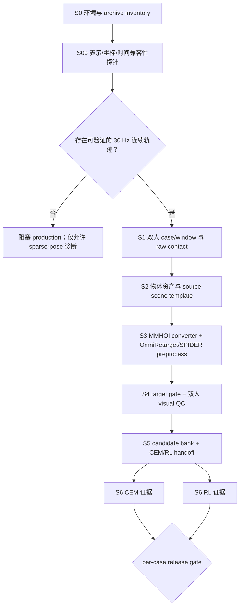

# MMHOI → Core4D v3 全局适配方案（v0）

> 已被
> [`03_v1_c2_c8_box_global_adaptation_plan.md`](03_v1_c2_c8_box_global_adaptation_plan.md)
> 取代。v0 的 `C_9/C_10` production scope 不再生效；本文仅保留为审计历史。

> 日期：2026-07-25
>
> 范围：MMHOI `Collaborative work` 中的严格双人数据
>
> 当前阶段：完成 S0 inventory 与适配设计，尚未宣称 S1–S6 通过

## 1. 总体决策

适配采用“复用 Core4D v3 阶段 contract，新增 MMHOI source adapters”的方式，不把现有脚本中的 `CORE4D_RAW_ROOT` 简单替换为 MMHOI 路径。

首版 production scope：

```text
C_2   Moving heavy stuffs 1
C_8   Moving heavy stuffs 2
C_9   Meeting 1
C_10  Moving stuffs
```

`C_9_r2 / Meeting 2` 实际为三人场景，631 个 sample 单列为多人扩展 backlog。

当前最先要解决的是时间轴，而不是重定向算法。发布包的相邻标注全部间隔 30 个源帧，约为 1 Hz；在取得 30 Hz 连续标注，或时间重建方案有独立 dense ground truth 并通过 gate 前，S3 production 保持 `blocked_temporal_density`。稀疏数据可以做格式、坐标和单姿态求解探针，但不得进入 S5/S6。

## 2. Git 与数据边界

| 项目 | 固定值 |
|---|---|
| 基线分支 | `experiment/E161-surface-release-ablation` |
| 基线 commit | `67cef0b84d81107128a082f36804caa16a15251c` |
| 当前工作分支 | `experiment/MMHOI-data-adaptation` |
| 用户给出的解压目录 | `/mnt/a0ccc676-9496-49f8-a861-f8a1797dec52/mocap_data/MMHOI` |
| 完整 archive authority | `/mnt/a0ccc676-9496-49f8-a861-f8a1797dec52/mocap_data/MMHOI_release.zip` |
| 实验工作区 | `workspace/MMHOI/` |

原始数据只读；任何解压缓存、转换结果、注册表、视频和评测证据都写入 `workspace/MMHOI/`。启动前已有的其他工作树改动不纳入本适配，不覆盖、不清理。

## 3. 工作区结构

```text
workspace/MMHOI/
├── data_stat.md
├── EXPERIMENT_TRACKER.md
├── progress.md
├── plan/
│   ├── 01_v0_dataset_adaptation_plan.md
│   ├── 02_v0_global_adaptation_plan.md
│   └── E###_<topic>_plan.md
├── log/
│   └── <NN>_E###_<topic>.md
├── references/
│   └── mmhoi_paper.txt
├── configs/
│   ├── inventory.yaml
│   ├── source_adapter.yaml
│   ├── retarget_variants.yaml
│   └── release_gates.yaml
├── scripts/
│   ├── data_inventory/
│   ├── source_adapter/
│   ├── raw_contact/
│   ├── scene_templates/
│   ├── retarget/
│   ├── gate_visual_qc/
│   └── handoff/
├── registries/
│   ├── source_capture_registry.tsv
│   ├── case_state_registry.tsv
│   └── variant_registry.tsv
└── results/
    └── E###/
        ├── run_manifest.json
        ├── s0_inventory/
        ├── s0b_source_probe/
        ├── s1_raw_contact/
        ├── s2_templates/
        ├── s3_retarget/
        ├── s4_gate_visual_qc/
        ├── s5_handoff/
        └── s6_downstream/
```

规则：

- `plan/` 只写假设、阶段设计和成功标准。
- `log/` 记录实际命令、失败、修复和结论。
- `results/E###/` 是该实验唯一正式产物根；不从临时目录补写“已通过”。
- registry 只引用带 provenance/hash 的结果，不用文件是否存在代替状态。
- 每个 E### 至少保存 `run_manifest.json`、resolved config、git SHA、command line、输入 archive signature 和 stage decisions。

## 4. 总体流程



S0–S2 的可信 source 证据可共享；S3 开始按 retarget/target variant 隔离，S5/CEM 再增加 hand-collision 轴。CEM 与 RL 是两个并列的 S6 事实，任何一方不能替代另一方。

## 5. 统一数据 contract

### 5.1 Source capture contract

每个原始 sample 至少记录：

| 字段 | 含义 |
|---|---|
| `dataset_id` | 固定 `MMHOI` |
| `archive_path/signature` | archive 绝对路径、size、mtime signature；正式冻结时补 content hash 或 release checksum |
| `sequence_id` | 例如 `20240412_personA_personB` |
| `scenario_code/folder` | `C_2` 与实际目录名 |
| `source_frame_id` | 数字 frame folder |
| `source_fps` | 论文/采集 30 fps |
| `annotation_stride` | 当前发布包为 30 |
| `effective_annotation_fps` | 当前约 1 Hz |
| `split/split_authority` | train/val/test/unspecified 与 split audit 引用 |
| `actor_slots` | person1/person2；身份来自 sequence name |
| `active_object_slots` | sample 中 active object 列表 |
| `human_param_paths` | camera-0/PARAM/final mesh 路径 |
| `object_template/final_paths` | 原始模板与逐帧 final mesh |
| `coordinate_frame` | camera-0、MMHOI final Y-up、OmniRetarget Z-up |

### 5.2 Case contract

一个 v0 case 表示“一个连续双人 window、一个主要动态物体、一个被重定向 actor”。建议 ID：

```text
mmhoi::<sequence>::<scenario>::<window_id>::<object>::<person_slot>
```

两个 actor case 用相同 `pair_id`、`window_id` 和 `object_track_id` 关联。这样可继续复用当前“每次重定向一个人”的 adapter，同时保留双人同步证据。

MMHOI 一个场景可同时出现多个物体，而当前 SPIDER Core4D task 的 qpos 只容纳一个动态物体。v0 采用：

- 每个 window 只选择一个主要动态物体；
- 其他必要桌椅作为固定 scene context；
- 同一 window 中若两个动态物体同时运动，状态为 `multi_dynamic_object_backlog`，不强行压入单物体 contract；
- C2/C10 先按 action/contact 切出 object-specific windows，禁止把多个箱包轨迹混成一个 object pose。

### 5.3 Variant 与 provenance

完整主键：

```text
case_id
× source_temporal_variant_id
× retarget_variant_id
× target_variant_id
× hand_collision_variant_id
```

`source_temporal_variant_id` 是 MMHOI 新增的上游 provenance 轴：

| 值 | 用途 | 是否可 release |
|---|---|---|
| `sparse_1hz_pose_only` | 格式/单姿态/坐标探针 | 否 |
| `dense_gt_30hz` | 官方或可验证连续 GT | 是 |
| `reconstructed_30hz_vN` | 明确版本化的时间重建 | 仅在独立 dense GT gate 通过后 |

原 Core4D 三个正交轴保持不变：

- `retarget_variant_id`：`omnirt_v1`、条件式 `omnirt_v2` rescue 等；
- `target_variant_id`：默认 `ref_fk`，其他 route 必须有独立 diagnostic；
- `hand_collision_variant_id`：`sphere5cm`、`rubber_hull` 等，仅改变机器人手碰撞几何。

## 6. 阶段设计与验证

## S0：环境、数据冻结与 inventory

目标：证明输入是什么、范围是什么、能否复跑。

任务：

1. 检查 archive 可读性、entry 数、README、split JSON 和 object templates。
2. 枚举全部 `PARAM/action.csv`，生成 sample/capture/action/object TSV。
3. 输出严格双人与 Collaborative work 全类别两套汇总。
4. 对 archive/split 不一致采用 archive authority + `unspecified`，不静默丢样本。
5. 固化 spider/Holosoma/SMPL-X 环境和 git 状态。

产物：

```text
s0_inventory/inventory_summary.json
s0_inventory/collaborative_*.tsv
s0_inventory/split_mismatches.tsv
s0_environment/environment_report.json
```

Hard gate：

- 8,071/8,071 个 action CSV 可解析；
- 严格双人 sample 恰为 2,821，场景为 `C_2/C_8/C_9/C_10`；
- 86 个 `unspecified` 可追溯且不进入 train/test；
- raw 数据无写入；
- 统计脚本测试和 archive signature 通过。

当前状态：inventory 部分已通过 E001；environment freeze 留到首次执行型实验。

## S0b：Source compatibility probe

目标：在写 converter 之前关闭时间、坐标、人体和物体四个基础风险。

### S0b-T：时间可行性

执行顺序：

1. 先确认 release 是否还有未 `30skip` 的 GT、原始 SMPL-X/object track 或官方补充下载。
2. 若取得 dense GT，验证连续 frame id、同步和 30 fps。
3. 若只有 1 Hz 标注，允许建立 `sparse_1hz_pose_only` canary；不得用普通线性/样条插值直接标记 production。
4. 任何 `reconstructed_30hz_vN` 必须用未参与重建的 dense GT 做 held-out 评测。

Hard gate：

- dense window 内人/物使用同一 frame id，gap=1、无重复、无缺帧；
- `fps=30` 来自 source metadata，不靠输出脚本硬编码；
- 重建路线必须同时通过 joint/object position、速度/加速度、接触 onset/duration、foot slide 和可视化 gate；
- 没有独立 dense GT 时，重建路线保持 `temporal_validation_unavailable`。

### S0b-H：人体世界坐标与 SMPL-X

已知路径：

```text
PARAM/j3d_127 (camera-0)
  + Kabsch(0.personN.ply -> final/personN.ply)
  -> final Y-up world joints
  -> Core4D converter 的前 22 joints
  -> OmniRetarget Z-up global_joint_positions
```

全量 gate：

- camera-0/final mesh vertex count 与拓扑一致；
- `det(R)>0`、scale deviation ≤ `1e-4`、rigid RMS ≤ `1e-4 m`；
- 变换后的 `j3d_127` 与 final person mesh/joints overlay 通过；
- 人体朝向、左右手、地面高度和单位为米；
- `betas` 与 `betas_new` 分别重建 camera-0 SMPL-X，按 V2V 与 visual overlay 选择，选择结果写入 variant/config；
- person1/person2 同一 sample 的世界系一致，不能各自重心归一化后丢掉相对关系。

### S0b-O：物体 6DoF

已知路径：

```text
object/<id>_<name>.ply
  + Kabsch(template vertices -> final/<name>.ply vertices)
  -> MMHOI final Y-up 4x4 pose
  -> Y-up 到 Z-up
  -> object_poses(T, 7) = [qw, qx, qy, qz, x, y, z]
```

全量 gate：

- 同拓扑、vertex count 一致；
- `det(R)>0`、scale deviation ≤ `1e-4`、RMS ≤ `1e-4 m`；
- 四元数归一化并做符号连续化；
- transformed template 与 final mesh 的 Chamfer/overlay 通过；
- 每个 object track 不发生身份切换；
- 任何 topology mismatch、反射或非刚体残差进入 `object_pose_registration_fail`。

产物：

```text
s0b_source_probe/human_transform_manifest.tsv
s0b_source_probe/object_pose_manifest.tsv
s0b_source_probe/temporal_density_report.json
s0b_source_probe/beta_selection_report.json
s0b_source_probe/overlay_review/
```

## S1：双人 window、raw contact 与 source registry

目标：把 sample folder 变成可重定向 case，而不是把整段场景无差别送下游。

任务：

1. 按 capture、active object、verb 和接触几何切出连续 windows。
2. 为 person1/person2 生成共享 `pair_id`、同步 frame index 和独立 actor rows。
3. 用 final-world 人体手部 vertices/joints 与物体 template+pose 计算 3 cm/5 cm raw contact。
4. 同时保留 left/right/both hand mask、contact centroid、object-local target 和 source-frame provenance。
5. `no-interaction` 用于负段/trim 参考，不计为 active window。
6. 1 Hz 数据只输出 spatial diagnostic；持续接触 run、速度和 trim 必须等待 dense gate。

产物：

```text
s1_raw_contact/source_capture_registry.tsv
s1_raw_contact/case_inventory.tsv
s1_raw_contact/raw_contact_candidates_3cm.tsv
s1_raw_contact/raw_contact_candidates_5cm.tsv
s1_raw_contact/per_sequence/*/raw_contact_proxy.npz
s1_raw_contact/window_segmentation_audit.tsv
```

Hard gate：

- 双人和物体 frame index 完全对齐；
- object-specific window 只有一个主要动态 object；
- contact 距离在 world/object-local 两个坐标系互相可逆；
- 3 cm/5 cm 两档证据同时保存，不互相覆盖；
- spatial contact 不能冒充 CEM 物理接触；
- `unspecified` split 只能进入 diagnostic 队列。

## S2：物体资产与 source scene templates

目标：把 10 类 MMHOI 物体变成可信的 OmniRetarget/MuJoCo 资产。

任务：

1. 将 PLY 转为版本化 OBJ/mesh asset，保留米制尺度、坐标轴、源文件 hash 和 license。
2. 分离 visual mesh 与 collision mesh；记录 `collision_policy`、质量和惯量来源。
3. 为每个 object/person slot 构建 source template；必要的桌/地面作为固定 context。
4. box 可使用经过 audit 的 box collision；其余 chair/table/desk/stool/monitor/keyboard/backpack/suitcase 必须走 non-box visual review。
5. backpack/箱包在数据中按刚体 6DoF 标注，但物理上可能软体；v0 明确采用刚体近似并单列局限。

产物：

```text
s2_templates/object_asset_registry.tsv
s2_templates/template_backlog.tsv
s2_templates/template_audit.tsv
s2_templates/template_visual_review/
s2_templates/template_summary.json
```

Hard gate：

- MuJoCo load 通过，无缺 mesh/材质/惯量；
- visual/collision scale 与 MMHOI final mesh 一致；
- 非 box 不使用未经审查的 AABB proxy 自动放行；
- ground、up-axis、object origin 与 source pose overlay 通过；
- 固定 context 与动态 object 的 freejoint/qpos layout 不冲突。

## S3：MMHOI converter、OmniRetarget 与 SPIDER preprocess

### Converter 输入映射

| OmniRetarget contract | MMHOI 来源 | Adapter |
|---|---|---|
| `global_joint_positions(T,22,3)` | `j3d_127` | camera-0→final rigid transform，取前 22 joints，Y-up→Z-up |
| `height` | `betas` 或 `betas_new` | S0b beta V2V 胜者，经 SMPL-X T-pose 计算 |
| `object_poses(T,7)` | template PLY + per-frame final PLY | Kabsch 4×4，Y-up→Z-up，转 wxyz+xyz |
| `obj_name` | action/object registry | 规范化为版本化 asset key |
| `fps/timestamps` | source temporal manifest | 必须为真实 dense 30 Hz；不得由 converter 猜测 |

实现上新增 `convert_mmhoi_to_omniretarget.py` 或 `MMHOISourceAdapter`，不伪造 Core4D 的 `person*_poses.npz/smooth_objposes.npy` 目录结构。共享的 Y-up→Z-up 与 OmniRetarget 输出 contract 可复用；MMHOI reader、world transform 和 object registration 是新代码。

### Retarget 策略

1. `omnirt_v1 + ref_fk` 作为首个 canary 基线。
2. 只对明确的 solver infeasible/reach-risk case 启用 `omnirt_v2` rescue。
3. `replace_wrist_with_fingertip` 仍属于 retarget/input rewrite variant，不和 target route 混写。
4. `ref_fk` 是默认 target route；`adaptive/fingertip_aware` 只有在 route diagnostics 通过后进入。
5. 首轮同时保留 `sphere5cm` control 和 `rubber_hull` hand-collision 候选，但 hand collision 不反向改变 retarget result。
6. 分别重定向 person1/person2，再用 pair manifest 验证共同时间轴、共同物体轨迹和相对空间关系。

E161 的 surface-release aggregate 结果不能直接设为 MMHOI production reward 默认：后续 E162 已发现 per-case raw-contact regression。工程参考应以 E170–E179 已冻结的
`omnirt_v1 → conditional omnirt_v2 rescue + ref_fk + rubber_hull + PRG`
为候选起点，但必须由 MMHOI canary 重新给证据。

产物：

```text
s3_retarget/<source_temporal>/<retarget>/<target>/
├── converted/
├── retargeted/
├── trimmed/
├── stage2b_manifest.tsv
├── pair_sync_manifest.tsv
├── params.json
└── run_stage2b.sh
```

Hard gate：

- 输入/输出帧数、fps、timestamps 一致；
- joints/object pose 有限、单位和 up-axis 正确；
- pair 两行引用相同 object trajectory hash；
- qpos 维度、object quaternion、机器人脚底和根高度有效；
- pelvis tilt/foot slide/constraint relaxation 是显式 diagnostic；
- sparse 1 Hz variant 即使 solver 成功也只能标 `diagnostic_pass`，不能标 Stage2b production pass。

## S4：Target gate 与双人 visual QC

机器 gate：

- `scene.xml/scene_act.xml` 可加载；
- `trajectory_kinematic.npz` 的 qpos/qvel/ctrl/contact 帧数一致；
- trimmed qpos 与 SPIDER trajectory 对齐；
- object pose 与 source/retarget frame 对齐；
- 双 actor pair 的 frame count、fps、物体 hash、window hash 一致；
- per-person hand-object contact、foot slide、ground penetration、object penetration 和 quaternion audit 通过；
- pair-level 检查机器人-机器人异常穿透、双手在共享物体上的相对接触和明显 actor swap。

Visual QC 包：

- source human+object overlay；
- 两个 actor 的 OmniRetarget 同步 replay；
- SPIDER target replay；
- start/contact/peak/end keyframes；
- object-local contact target、手部碰撞体和地面视图；
- 机器指标与视频使用同一 manifest row/hash。

状态严格分离：

```text
target_gate_status = pass/review/reject/not_run
visual_qc_status   = pass/review/reject/not_run
```

机器 pass 不自动等于 visual pass。

## S5：候选库与 handoff

输出：

```text
s5_handoff/candidate_bank.tsv
s5_handoff/handoff_manifest.tsv
s5_handoff/rejected_manifest.tsv
s5_handoff/cem_overrides/
s5_handoff/reproducibility/
```

进入 handoff 的必要条件：

- `source_temporal_variant_id` 已允许 release；
- S1 raw inventory/contact provenance 完整；
- S2 template 为 `clean/clean_reviewed`；
- S3 Stage2b pass；
- S4 machine gate 与 visual QC 均 pass；
- split 不是 `unspecified`；
- variant 四轴完整且结果目录互相隔离；
- pair 两个 actor 均满足 gate；单边通过不能冒充双人 case 通过。

## S6：CEM/RL 下游证据

CEM 与 RL 分开记录：

| 证据 | 最小内容 |
|---|---|
| CEM | run id、variant、result NPZ、视频、per-case metrics、contact/penetration、失败模式 |
| RL | run id、config/checkpoint、eval metrics、视频、成功率、contact/penetration、失败模式 |

规则：

- `cem_status=pass` 不推出 `rl_status=pass`；
- aggregate improvement 不覆盖 per-case raw-contact regression；
- 下游失败写入 `downstream_failure_mode`，不反向把可信 raw/template 标成失败；
- 只有 source→S6 的 manifest/hash 链闭合，才可标记 release-ready。

## 7. Canary 顺序

| 顺序 | 场景 | 原因 | 首个验证重点 |
|---:|---|---|---|
| 1 | `C_2` | 最接近 Core4D 双人搬箱；有显式 together | 双手接触、共享重物、箱/行李物体 pose |
| 2 | `C_8` | 大型非 box 家具 | chair/table collision、双人空间协调 |
| 3 | `C_10` | pass/push/hold，多个箱包 | object-specific window、动作切换 |
| 4 | `C_9` | 多 context 物体、较多静态动作 | 固定桌面 context、键盘/显示器小物体 |
| backlog | `C_9_r2` | 三人，不属于首版双人 contract | 三 actor task/state 扩展 |

每个场景先选 1 个 capture × 1 个 active object × 2 actor，完成 source overlay、S3 同步 replay、S4 gate 后再扩大。不得一次把 2,821 个 sparse samples 全量送入下游。

## 8. 建议实验编排

| Run | 目标 | 关键产物 | Go/No-Go |
|---|---|---|---|
| E001 | inventory + 全局方案 | 本文、`data_stat.md`、统计 TSV/JSON | 已完成规划交付 |
| E002 | 全量 representation audit | human/object transform manifest、beta selection、overlay | 全量坐标/刚体 gate |
| E003 | temporal source feasibility | dense source inventory 或 reconstruction benchmark | 无独立 dense 证据则 No-Go |
| E004 | `C_2` 双人单物体 canary | S1–S4 完整 evidence | pair gate + visual pass |
| E005 | `C_8/C_10/C_9` 分层 canary | non-box/multi-object/context 证据 | 每类至少一例 pass |
| E006 | variant ablation + release candidate | v1/v2、ref_fk、hand collision 对照 | per-case 无回归 |
| E007 | CEM/RL handoff | 独立 CEM/RL manifests | 两类证据分别闭环 |

每个 E### 在执行前新增 plan，执行后新增 log、更新 tracker/progress；失败实验也保留命令与证据，不覆盖旧结果。

## 9. Release gate 总表

| Gate | Pass 条件 | Fail/blocked 状态 |
|---|---|---|
| G0 Scope | 严格双人、合法 split、archive provenance 完整 | `scope_or_split_invalid` |
| G1 Temporal | 可验证 30 Hz dense human+object 同步轨迹 | `blocked_temporal_density` |
| G2 Human | world transform、betas、joint/mesh overlay 通过 | `human_world_transform_fail` |
| G3 Object | 模板→final 刚体 pose 全量通过 | `object_pose_registration_fail` |
| G4 Contact | 3/5 cm raw evidence、时间轴、object-local target 可追溯 | `raw_contact_invalid` |
| G5 Template | scene load、scale/inertia/collision/non-box review 通过 | `template_backlog` |
| G6 Retarget | variant、pair sync、qpos/fps/foot diagnostics 通过 | `stage2b_fail` |
| G7 Target/QC | machine gate + visual QC 双 pass | `target_or_visual_reject` |
| G8 Handoff | variant 四轴、hash、reproducibility 闭环 | `handoff_incomplete` |
| G9 Downstream | CEM 与 RL 各自有可信 per-case 结论 | `downstream_not_complete` |

G1 是当前 hard blocker。后续阶段的代码原型可以并行准备，但不能把 prototype 输出升级为 release pass。

## 10. 主要风险与处理

| 风险 | 级别 | 处理 |
|---|---|---|
| 发布 GT 约 1 Hz，缺连续控制轨迹 | P0 | 优先寻找 dense source；无独立 dense GT 不发布重建轨迹 |
| `PARAM/j3d_127` 在 camera-0 而非 final world | P0 | 用 camera-0/final 同拓扑 mesh 恢复逐人刚体变换，全量残差/overlay gate |
| 没有显式 object pose JSON | 已降为 P1 | template/final 同序顶点 Kabsch 精确恢复 6DoF，全量审计 |
| 多物体场景与单动态物体 qpos contract 冲突 | P1 | object-specific windows；其他物体固定 context；多动态窗口 backlog |
| non-box collision 与惯量未知 | P1 | visual/collision 分离、manual review、参数化 mass/inertia |
| split 少 key/少样本 | P1 | archive authority + `unspecified`；训练/正式 test 排除 |
| `betas` 与 `betas_new` 语义未冻结 | P1 | SMPL-X V2V/overlay ablation 后写入 config |
| 三人 `C_9_r2` 混入双人生产 | P1 | scope gate 直接隔离 |
| 直接继承 E161 reward 造成 per-case 回归 | P1 | 以 E170–E179 为工程参考，MMHOI canary 重新评测 |

## 11. Definition of Done

本适配只有同时满足以下条件才算完成：

- [ ] 严格双人范围、split 和 archive provenance 冻结；
- [ ] 可验证的 30 Hz dense source 或通过独立 dense GT 的时间重建 variant；
- [ ] 人体 camera-0→final world、SMPL-X beta 选择和左右手语义通过全量 gate；
- [ ] 10 类物体的逐帧 6DoF、scale、quaternion continuity 通过；
- [ ] 双人 object-specific windows 与 3/5 cm raw contact 可复跑；
- [ ] non-box templates 完成机器与可视化审查；
- [ ] `C_2→C_8→C_10→C_9` canary 依次通过 S3/S4；
- [ ] source temporal、retarget、target、hand collision 四轴结果隔离；
- [ ] S5 reproducibility report 无 error；
- [ ] CEM/RL 分别有 per-case manifest、指标和视频；
- [ ] release registry 能从任一 row 追溯到 source frame、输入 hash、代码 SHA、参数和所有 gate。

当前 E001 只完成第一项中的 inventory/范围证据和本全局设计；其余均明确为计划状态。
