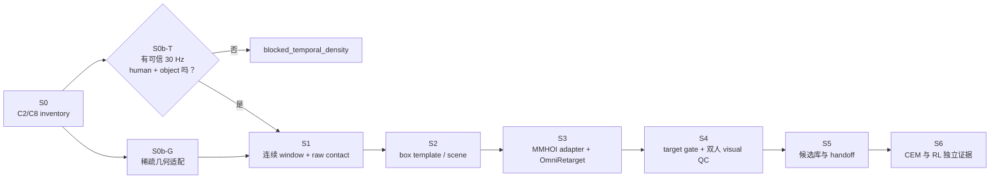

# MMHOI `C_2/C_8` → Core4D v3 全局适配方案（v1）

> 生效日期：2026-07-25
>
> 当前主范围：仅 `C_2/C_8`（Moving heavy stuffs）
>
> 首批实验：`C_2 + box`
>
> 时间状态：`blocked_temporal_density`

本方案取代
[`02_v0_global_adaptation_plan.md`](02_v0_global_adaptation_plan.md)
中的旧 production scope。旧文档保留为审计历史，不再作为执行依据。

## 1. 决策摘要

1. Production scope 只保留 `C_2` 和 `C_8`；`C_9/C_10/C_9_r2` 不进入本轮
   inventory、canary、release 或下游实验。
2. 第一批只做 `C_2` 的 box。统计上的候选集合是 460 个 active-box
   annotation samples，实际轨迹必须从其所属完整 capture 中切连续 window。
3. MMHOI 论文的 30 fps 是采集频率；公开 release 的 SMPL-X/object GT 是
   30skip，约 1 Hz。不得把 `source_fps=30` 混写成 `released_gt_fps=30`。
4. 在找到独立 30 Hz source 或时间重建 variant 通过独立 dense 证据前，
   S1 连续 contact、S3 production retarget、S4 target gate 和 S5/S6 handoff
   保持阻塞。
5. 稀疏 GT 可以先完成坐标、SMPL-X、box template→pose 和单帧 contact 的
   representation adapter，减少 dense source 到位后的集成风险；这些结果
   必须标为 sparse probe，不能作为连续动作成功证据。

## 2. Git、数据与写入边界

```text
base branch: experiment/E161-surface-release-ablation
base commit: 67cef0b84d81107128a082f36804caa16a15251c
work branch: experiment/MMHOI-data-adaptation
workspace: /home/ubuntu/Workspace/spider/workspace/MMHOI
```

原始数据只读：

```text
/mnt/a0ccc676-9496-49f8-a861-f8a1797dec52/mocap_data/MMHOI
/mnt/a0ccc676-9496-49f8-a861-f8a1797dec52/mocap_data/MMHOI_release.zip
```

约束：

- 所有脚本、config、计划、日志、统计、manifest、指标和可视化都写入
  `workspace/MMHOI/`。
- 正式实验产物只写入 `workspace/MMHOI/results/E###/`。
- 原始 ZIP/解压目录不原地修改，不把 173 GB 数据复制进 Git 工作区。
- 后续临时解压使用 `workspace/MMHOI/tmp/E###/`；任务结束后仅保留
  inventory、hash 和审计日志。
- 启动前已有的 `workspace/core4d/` 用户改动不属于本任务，不覆盖。

## 3. 工作区设计

```text
workspace/MMHOI/
├── EXPERIMENT_TRACKER.md
├── progress.md
├── data_stat.md
├── plan/
│   ├── 01_v0_dataset_adaptation_plan.md
│   ├── 02_v0_global_adaptation_plan.md
│   └── 03_v1_c2_c8_box_global_adaptation_plan.md
├── log/
│   ├── 01_v0_dataset_adaptation.md
│   └── 02_v1_scope_and_temporal_audit.md
├── references/
│   └── mmhoi_paper.txt
├── configs/
│   ├── source_temporal/
│   ├── source_adapter/
│   ├── retarget/
│   └── target/
├── scripts/
│   ├── data_inventory/
│   └── data_construction_v3/
│       └── stages/
│           ├── s0_source/
│           ├── s1_contact/
│           ├── s2_templates/
│           ├── s3_retarget/
│           ├── s4_target/
│           ├── s5_handoff/
│           └── s6_downstream/
├── results/
│   └── E###/
│       ├── s0_inventory/
│       ├── s0b_source_probe/
│       ├── s1_raw_contact/
│       ├── s2_templates/
│       ├── s3_retarget/
│       ├── s4_target_gate/
│       ├── s5_handoff/
│       └── s6_downstream/
└── tmp/
    └── E###/
```

只在对应实验真正开始时创建新目录，避免空目录被误认为阶段已执行。

每个 `results/E###/` 至少包含：

```text
run_manifest.json
command.txt
config_snapshot/
metrics.json
case_state_registry.tsv
artifacts_manifest.tsv
```

`run_manifest.json` 固定记录 Git SHA、源 archive identity、输入 case、split、
场景/物体筛选、fps/stride、坐标约定、单位、各 variant id 和父实验。

## 4. 总体流程



`S0b-T` 和 `S0b-G` 是两个独立 gate：稀疏几何通过不代表时间通过，时间源
存在也不代表坐标/人体/物体表示正确。S1 必须等待两者同时 pass。

## 5. 统一数据 contract

### 5.1 Source capture

每个 capture 一行：

```text
dataset_id                 MMHOI
sequence_id                原始 sequence root
scenario_code              C_2 | C_8
scenario_capture_id        sequence/scenario_folder
actor_ids                  [person1, person2]
subject_ids                目录中可恢复的真实身份
object_types               capture 中的物体集合
split_policy               官方 split + unspecified
capture_fps                30
released_annotation_stride 30
released_annotation_fps    1
source_archive_identity    size + mtime signature
```

`capture_fps`、`released_annotation_stride` 和
`released_annotation_fps` 必须是三个独立字段，禁止只写一个 `fps`。

### 5.2 Dense trajectory

只有满足以下 contract 的数据才能进入 S1：

```text
frame_id_source       (T,), 严格递增
timestamp_seconds     (T,), 单调且约 1/30 s 间隔
valid_person1         (T,)
valid_person2         (T,)
valid_object          (T,)
joints_world          (2,T,127,3), meters, final world
smplx_pose            (2,T,53,3)
smplx_betas           (2,T,10) 或 per-identity 常量
object_transform      (T,4,4), template -> final world
object_pose           (T,7), wxyz + xyz
source_temporal_kind  official_gt | reconstructed
source_temporal_variant_id
```

同一 T 上两个人、物体和时间戳必须逐帧对齐。缺失帧用 validity mask 表达，
不得通过删帧让各模态“看起来等长”。

### 5.3 Case/window

一个 case 只含一个主动态物体：

```text
case_id
scenario_capture_id
target_object
start_source_frame
end_source_frame
pre_context_frames
post_context_frames
actor_order
split
contact_threshold_variant
source_temporal_variant_id
retarget_variant_id
target_variant_id
hand_collision_variant_id
```

首批 `target_object=box`。同场的 stool/suitcase 保留为固定 context 或显式
忽略，并在 manifest 中记录；不能在同一单物体 qpos contract 中悄悄加入多
个动态物体。

### 5.4 Variant 与 provenance

| 轴 | 例子 | 何时产生 |
|---|---|---|
| `source_temporal_variant_id` | `official_dense_v1`, `recon_rgbd_v1` | S0b-T |
| `human_world_variant_id` | `cam0_to_final_kabsch_v1` | S0b-G |
| `object_pose_variant_id` | `template_final_kabsch_v1` | S0b-G |
| `contact_variant_id` | `contact_3cm`, `contact_5cm` | S1 |
| `retarget_variant_id` | `omnirt_v1`, `omnirt_v2_rescue` | S3 |
| `target_variant_id` | `ref_fk`, 其他 target 构造 | S4 |
| `hand_collision_variant_id` | `rubber_hull`, `prg` | S5/S6 |

不同 variant 写不同目录和 registry row，禁止覆盖式迭代。

## 6. 阶段与验证

## S0：范围冻结与 inventory

状态：**已完成**。

输入：

- 完整 `MMHOI_release.zip`；
- 官方 split JSON；
- `PARAM/action.csv`；
- 用户确认范围 `C_2/C_8`、首批 `C_2+box`。

动作：

1. 只读枚举 ZIP；
2. 固定 `C_2/C_8` 主范围；
3. 用 active box 规则生成首批样本清单；
4. 保留 split mismatch 为 `unspecified`；
5. 输出人、物体、verb、capture、sample 和时间 stride 统计。

产物：

- [`../data_stat.md`](../data_stat.md)
- `results/E002/s0_scope_inventory/inventory_summary.json`
- 主范围和 box pilot TSV。

Pass gate：

- 主范围 24 captures / 1,289 samples；
- pilot 12 captures / 460 active-box samples；
- 所有 sample 可追溯到 archive path；
- 65 个 unspecified 没有混入 train/test。

## S0b-T：30 Hz source feasibility

状态：**阻塞，是当前 P0**。

已知事实：

- 24/24 capture 目录带 `30skip/30_skip`；
- 1,265/1,265 相邻 released frame-id gap 为 30；
- 1,289 个 released sample 各有 SMPL-X JSON 和 final object mesh；
- archive 中未发现未 skip trajectory、视频或 mocap 文件。

按优先级接受以下 source：

1. **官方未 skip GT**：逐源帧 SMPL-X + object 6DoF，首选。
2. **官方 30 Hz RGB-D/视频 + calibration**：重新估计 human/object track，
   输出必须标为 `reconstructed`。
3. **仅从 1 Hz GT 重建**：只作为研究 variant；没有独立 dense GT 时不得
   production release。

明确拒绝：

- 把 1 Hz 的 `pose_53`、joints 或 object transform 直接 linear/SLERP 到
  30 Hz 后标成 GT；
- 仅凭论文写 30 fps 就设置 `released_gt_fps=30`；
- 用渲染平滑或“看起来连续”代替时间和接触验证。

Pass gate：

- 每个模态都有源 frame id 或 timestamp；
- 目标时间网格为真实 30 Hz，人物/物体逐帧对齐；
- 覆盖率、缺失区间和重建置信度有 per-frame manifest；
- 用独立 dense 证据验证速度、加速度、物体 SE(3)、足滑和接触时序；
- 能区分 official GT 与 reconstructed variant；
- 至少一个 `C_2+box` 完整动作 window 通过 visual/metric temporal QC。

Fail state：

```text
blocked_temporal_density
```

如果只有当前 ZIP，保持 blocker，不进入 production S1。

## S0b-G：稀疏 representation probe

状态：**技术路径已验证，待全量 gate**。可以在 S0b-T 阻塞期间推进。

### 人体

动作：

1. 读取 `PARAM/person*.json`；
2. 通过 `0.person*.ply → final/person*.ply` 同拓扑 Kabsch 恢复
   camera-0→final-world 刚体变换；
3. 将 `j3d_127` 映射到统一 Y-up world；
4. 用 SMPL-X 重建对比 `betas` 与 `betas_new`；
5. 检查 person1/person2 身份、左右手、朝向和地面。

Gate：

- Kabsch `det(R)>0`、scale≈1、残差稳定；
- joint/mesh overlay 对齐；
- identity 不跨帧交换；
- betas 选择有 V2V/overlay 证据；
- 输出单位、轴向和 transform chain 写入 manifest。

### 物体

动作：

1. 用 `object/03_box.ply` 作为 box template；
2. 与每个 `final/box.ply` 做同序顶点刚体配准；
3. 输出 template→world 的 `(R,t)` 和 `wxyz+xyz`；
4. 做 residual、reflection、scale 和 quaternion sign continuity 审计。

Gate：

- template/final vertex count 和顺序匹配；
- `det(R)>0`、scale≈1；
- 配准残差在数值噪声量级；
- box 朝向、地面和尺寸在四相机 overlay 中正确。

这里的通过只覆盖 released sparse frames。

## S1：连续 window 与 raw contact

前置：S0b-T、S0b-G 同时 pass。

动作：

1. 在完整 dense capture 上识别 box active interval；
2. 加入固定的 pre/post context；
3. 禁止跨 split 或跨 capture 拼接；
4. 分别计算两个人到 box 的 3 cm / 5 cm raw contact；
5. 保存每人每 hand/body part 的 contact run、no-contact trim 和 pair 状态；
6. 建立 MMHOI `case_state_registry.tsv`。

产物：

```text
s1_raw_contact/
├── case_manifest.tsv
├── contact_3cm/
├── contact_5cm/
├── contact_diagnostics.tsv
└── case_state_registry.tsv
```

Gate：

- window 为真实连续 30 Hz；
- 两人和 box 的 T 完全一致；
- active interval 与 action label/visual 一致；
- 3/5 cm 变体隔离；
- 不把单帧触碰误写成稳定双人搬运接触；
- trim 后仍保留动作前后必要上下文。

## S2：box template 与 scene

前置：至少一个 S1 canary pass。

动作：

1. 冻结 `03_box.ply` 的视觉 mesh、collision mesh、尺度和原点；
2. 生成 source scene template；
3. 明确 mass/inertia 的来源或参数化策略；
4. 保留 Core4D v3 的 visual/collision 分离；
5. 非 box 资产不进入首批。

Gate：

- mesh 尺寸与 final box 一致；
- collision 不自交、不过度膨胀；
- template origin 与 object pose transform 一致；
- 静态重放无 scale/axis/ground 错误；
- template manifest 可追溯到 source mesh hash。

## S3：MMHOI adapter 与 OmniRetarget

前置：S1/S2 pass。

动作：

1. 实现 MMHOI reader，不修改 Core4D raw reader 的语义；
2. 对 person1/person2 分别生成 `(T,127,3)` world joints 和 betas；
3. 在同一时间轴上生成 box `(T,4,4)`；
4. 复用 Holosoma 的输出 contract：

   ```text
   global_joint_positions (T,22,3), Z-up
   height
   object_poses (T,7), wxyz + xyz
   ```

5. 两个人分别 retarget，但共享 case/timeline/object provenance；
6. 先跑 `omnirt_v1`，仅对失败 case 生成 `omnirt_v2_rescue`。

Gate：

- Y-up source→Z-up target 变换显式且只应用一次；
- 两人 root 与 box 相对关系保持；
- 无 person swap、左右手交换或时间漂移；
- retarget 输出 T 与 source 完全相等；
- source/retarget variant 不互相覆盖；
- 速度、足滑、手-箱距离和 box pose 误差均按真实 30 Hz 计算。

## S4：target gate 与双人 visual QC

动作：

1. 生成双人 + box target scene；
2. 分别执行 schema、shape、NaN、quaternion、root、joint-limit gate；
3. 执行 pair distance、穿透、手-箱接触和 box-world gate；
4. 生成 source/retarget/target 三联画与同步视频；
5. 记录 per-actor 与 pair-level pass/fail。

Gate：

- 数值 gate 全部通过；
- 两人均无明显 foot slide/root jump；
- box 无瞬移、翻转或尺度变化；
- 双人相对站位、共同搬运方向和接触相位正确；
- visual QC 由独立 evidence 路径记录，不能只靠 aggregate 指标。

## S5：候选库与 handoff

动作：

1. 只收录 S0–S4 全 pass 的 case；
2. 生成 immutable candidate manifest；
3. 执行可复现性检查；
4. 固定 retarget/target/hand-collision variant；
5. 输出 CEM 与 RL 各自所需的输入 manifest。

Gate：

- 从任一 candidate row 可回溯 source frame、代码 SHA、config 和全部 gate；
- 重跑 hash/shape/length 一致；
- train/val/test/unspecified 边界未破坏；
- 不用稀疏 probe 代替 dense candidate；
- CEM 与 RL handoff 清单分离。

## S6：CEM/RL 下游证据

动作：

1. 先做单 case CEM screening；
2. 对通过者做独立 RL 训练/评估；
3. 保存 per-case reward、接触、穿透、成功率和视频；
4. 对失败 case 回写 registry，不覆盖上游 source evidence。

Gate：

- CEM pass 不等于 RL pass；
- aggregate 指标不能掩盖单 case 回归；
- 两个人与 box 的成功条件分别和联合报告；
- hand collision variant 独立；
- 失败可定位到 temporal/source、retarget、target 或 downstream 阶段。

## 7. 首批 canary 选择

已临时解压的
`20240412_personA_personB/20240412__C_2__30skip` 只有 1 个 active-box
稀疏 sample，定位为 **layout canary**，不作为 motion canary。

Motion canary 的选择规则：

1. `C_2 + box`；
2. 优先 train split；
3. 有连续的双人 `move together` 或 `stack together` 区间；
4. 两人、box 和四相机有效率高；
5. 动作前后有足够 context；
6. 无 split mismatch；
7. box 运动包含平移和方向变化，能检验 6DoF continuity。

选择时保留完整 capture，然后在 dense source 上切 window。不得从 460 个
active annotation rows 中挑帧拼成轨迹。

Canary 顺序：

```text
layout case
  -> single dense C_2+box window
  -> same capture second window
  -> second subject pair
  -> C_2 box batch
  -> C_8 chair_wood
  -> C_8 table_wood
```

`C_8` 没有 box；它是首批 box 路径稳定后的 non-box 扩展，不与首批混跑。

## 8. 实验编排

| Run | 目标 | 关键产物 | 状态/依赖 |
|---|---|---|---|
| E001 | 旧 Collaborative 全量 inventory 与 v0 方案 | v0 统计/方案 | 完成，范围已被 v1 取代 |
| E002 | 冻结 `C_2/C_8`、box pilot、release temporal audit | v1 统计、TSV、本文 | 完成 |
| E003 | 获取并审计 30 Hz source | dense source manifest、coverage、时间 QC | 当前阻塞，需新 source |
| E004 | 稀疏 human/object representation 全量 gate | sparse RGB visual QC、world transform、box 6DoF、overlay | 进行中：24/24 case RGB QC 完成 |
| E005 | 单个 dense `C_2+box` temporal canary | 30 Hz aligned trajectory | 依赖 E003/E004 |
| E006 | `C_2+box` S1–S4 canary | contact/template/retarget/target evidence | 依赖 E005 |
| E007 | `C_2+box` batch 与 release candidate | batch registry、S5 handoff | 依赖 E006 |
| E008 | `C_8` chair/table 扩展 | non-box templates 与 canary | 依赖 E007 |
| E009 | CEM/RL | 独立 CEM/RL manifests、指标、视频 | 依赖 S5 |

E003 与 E004 可独立推进，但 E005 必须同时依赖两者。

## 9. Release gate 总表

| Gate | 必须回答的问题 | 当前状态 |
|---|---|---|
| Scope | 是否仅 `C_2/C_8`，首批是否仅 box？ | Pass |
| Inventory | sample/capture/split 是否可复跑？ | Pass |
| Temporal source | 是否有可信逐帧 30 Hz human + object？ | **Blocked** |
| Human world | j3d/SMPL-X 是否在统一 world 且身份稳定？ | Probe pass，待全量 |
| Object pose | box template→world 6DoF 是否连续可信？ | 稀疏 probe pass，dense 未做 |
| Contact | 双人接触是否来自真实连续时间轴？ | 未开始 |
| Template | box visual/collision/scale/origin 是否冻结？ | 未开始 |
| Retarget | 两人轨迹与 box 时空关系是否保持？ | 未开始 |
| Target | 数值 gate 与双人 visual QC 是否通过？ | 未开始 |
| Handoff | 是否可追溯、可复跑、variant 隔离？ | 未开始 |
| Downstream | CEM/RL 是否有独立 per-case 证据？ | 未开始 |

## 10. 主要风险

| 风险 | 等级 | 处理 |
|---|---:|---|
| 把 capture 30 fps 误当 release GT 30 fps | P0 | 三字段 fps contract + temporal hard gate |
| 公开 ZIP 没有 dense source | P0 | 优先取得官方未 skip GT/原始 30 Hz RGB-D |
| 1 Hz 插值丢失接触与加速度 | P0 | 仅 debug；无独立 dense 验证不得 release |
| `j3d_127` 不是 final world | P0 | camera-0→final 同拓扑 Kabsch + overlay |
| 没有 object pose JSON | P1 | template/final 同序顶点恢复 6DoF |
| Active box 帧被误拼成轨迹 | P0 | 按完整 capture 切连续 dense window |
| 同场其他物体污染单物体 contract | P1 | 主物体 box；其他物体显式 fixed/ignored |
| `betas`/`betas_new` 未冻结 | P1 | SMPL-X V2V/overlay ablation |
| 65 个 unspecified 混入训练 | P1 | 默认排除，registry 明示 |
| E161 aggregate 结论被当作 MMHOI 默认 | P1 | MMHOI per-case 重新做 S4/S6 gate |

## 11. Definition of Done

- [x] Git 分支与 `workspace/MMHOI/` 建立；
- [x] `C_2/C_8`、box pilot 和 split 范围冻结；
- [x] 完整 ZIP temporal audit 与临时 case 实证完成；
- [ ] 获得可信 30 Hz human/object source，或有独立 dense GT 验证的重建源；
- [ ] 两个人体 world transform、identity、betas 和手部语义通过全量 gate；
- [ ] box dense 6DoF、scale、quaternion continuity 通过；
- [ ] `C_2+box` 连续 window 和 3/5 cm raw contact 可复跑；
- [ ] box template 的 visual/collision/mass/inertia provenance 冻结；
- [ ] 单 case 和第二 subject pair 依次通过 S3/S4；
- [ ] `C_2+box` batch registry 无 silent skip 或 variant 覆盖；
- [ ] `C_8` chair/table 作为独立 non-box 阶段通过；
- [ ] S5 reproducibility report 无 error；
- [ ] CEM/RL 分别有 per-case manifest、指标和视频；
- [ ] 任一 release row 可追溯到 source frame、timestamp、输入 hash、代码 SHA、
  config 和所有 gate。

当前只完成前三项。30 Hz source 是进入连续数据构建链路的下一硬条件。
