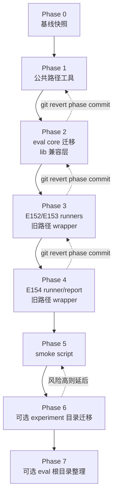

# CORE4D Scripts 目录迁移计划

当前分支：`refactor/core4d-scripts-layout`

目的：整理 `workspace/core4d/scripts` 和 `workspace/core4d/scripts/eval`
的文件结构，同时不破坏当前实验复现、remote 脚本、历史命令和已有结果目录。

## 目标

- 迁移过程中旧命令仍然可用。
- E154 及后续实验使用稳定、统一的新脚本结构。
- 区分 active runner、report 生成、共享评测核心、audit/diagnose、shell wrapper 和历史脚本。
- 每一步都有明确可回退路径。
- 默认不改变 `workspace/core4d/results/E###` 结果目录结构。

## 当前问题

- `scripts/` 里混在一起的东西太多：实验 manifest、一次性工具、训练/评测 wrapper、分析脚本、转换脚本、debug 工具、data construction。
- `scripts/eval/` 里也混了正式 evaluator、shell wrapper、probe、audit、diagnose、keyframe extraction 和共享库。
- 活跃的 E152/E153/E154 链路分散在 `scripts/eval/` 和 `scripts/E154/`。
- 许多脚本依赖硬编码路径、`Path(__file__).parents[...]` 和 `sys.path.insert(...)`。
- 如果直接移动文件，不加兼容 wrapper，会破坏历史 notes、remote launch 脚本和已有本地命令。

## 目标目录结构

```text
workspace/core4d/scripts/
  common/
    paths.py
    tsv.py
    manifests.py

  eval/
    core/
      core_metrics.py
      metric_standard.py
      aggregation.py
      writers.py
      METRICS_STANDARD.md
    runners/
      eval_E152_axis1_hand_object_physics_gate.py
      eval_E153_gate_threshold_sweep.py
      eval_E154_omniretarget_reference.py
    reports/
      gen_E154_compare_table.py
    audits/
      audit_*.py
      diagnose_*.py
      verify_*.py
    extract/
      extract_*keyframes.sh
      extract_*contact_sheets.sh
    wrappers/
      eval_E*.sh
    legacy/

  experiments/
    E152/
    E153/
    E154/
    legacy/

  train/
  retarget/
  convert/
  analyze/
  export/
  debug/
  data_construction_v3/
```

## 迁移原则

1. 迁移窗口内不删除旧入口。
2. 先移动真实实现，再把旧路径改成 thin wrapper。
3. 结果输出路径保持不变。
4. 旧命令和新命令都必须能跑。
5. 每个可回退 checkpoint 单独 commit。
6. 每迁移一步都跑同一套 smoke validation。
7. 评测 summary 里尽量写入 `metric_standard_id`，方便以后确认结果对应的指标版本。

## 分支和 commit 策略

使用单独分支：

```bash
git switch -c refactor/core4d-scripts-layout
```

建议小步 commit：

```text
commit 1: 添加迁移计划和 smoke 验证脚本
commit 2: 添加 scripts/common 路径工具
commit 3: 迁移 eval core 实现，保留 eval/lib 兼容层
commit 4: 迁移 E152/E153 runners，旧 eval/*.py 保留 wrapper
commit 5: 迁移 E154 report 和 omniretarget runner，旧 E154 路径保留 wrapper
commit 6: 更新文档和新实验生成默认路径
commit 7: 可选整理历史 eval/audit/extract 脚本
```

单步回退用：

```bash
git revert <commit>
```

如果迁移分支已经 merge，再回退 merge commit。

## Phase 0：基线快照

移动代码前先记录当前行为，并备份关键结果。

命令：

```bash
python3 -m py_compile \
  workspace/core4d/scripts/eval/lib/core_metrics.py \
  workspace/core4d/scripts/eval/eval_E152_axis1_hand_object_physics_gate.py \
  workspace/core4d/scripts/eval/eval_E153_gate_threshold_sweep.py \
  workspace/core4d/scripts/E154/eval_omniretarget_reference.py \
  workspace/core4d/scripts/E154/gen_compare_table.py

tar -czf workspace/core4d/results/E154/pre_layout_refactor_metrics.tgz \
  workspace/core4d/results/E152/axis1_hand_object_physics_gate/eval/full \
  workspace/core4d/results/E153/gate_threshold_sweep/eval/full \
  workspace/core4d/results/E154/omniretarget_eval \
  workspace/core4d/results/E154/e154_masked_tracking_compare.xlsx
```

预期：

- `py_compile` 返回 0。
- 备份包生成在 `workspace/core4d/results/E154/`。

回退：

- 这一步没有代码改动；如果不需要备份包，删除即可。

## Phase 1：添加公共路径工具

新增：

```text
workspace/core4d/scripts/common/
  __init__.py
  paths.py
```

`paths.py` 提供：

- `REPO`
- `CORE4D`
- `SCRIPTS`
- `RESULTS`
- `repo_path(...)`
- `rel_repo(...)`

不要马上批量改所有旧脚本。先给迁移后的新脚本使用。

验证：

```bash
python3 -m py_compile workspace/core4d/scripts/common/paths.py
```

回退：

```bash
git revert <phase-1-commit>
```

## Phase 2：迁移评测核心代码

移动真实实现：

```text
workspace/core4d/scripts/eval/lib/core_metrics.py
-> workspace/core4d/scripts/eval/core/core_metrics.py

workspace/core4d/scripts/eval/METRICS_STANDARD.md
-> workspace/core4d/scripts/eval/core/METRICS_STANDARD.md
```

旧路径保留兼容模块：

```text
workspace/core4d/scripts/eval/lib/core_metrics.py
```

兼容模块只 re-export 新实现。等所有旧脚本迁移完之后，再考虑删除它。

验证：

```bash
python3 -m py_compile \
  workspace/core4d/scripts/eval/core/core_metrics.py \
  workspace/core4d/scripts/eval/lib/core_metrics.py

python3 - <<'PY'
import sys
sys.path.insert(0, "workspace/core4d/scripts/eval")
from lib.core_metrics import EVAL_METRIC_STANDARD_ID
print(EVAL_METRIC_STANDARD_ID)
PY
```

预期输出：

```text
core4d-e154-physics-contact-v1
```

回退：

```bash
git revert <phase-2-commit>
```

## Phase 3：迁移活跃的 E152/E153 runners

移动真实实现：

```text
workspace/core4d/scripts/eval/eval_E152_axis1_hand_object_physics_gate.py
-> workspace/core4d/scripts/eval/runners/eval_E152_axis1_hand_object_physics_gate.py

workspace/core4d/scripts/eval/eval_E153_gate_threshold_sweep.py
-> workspace/core4d/scripts/eval/runners/eval_E153_gate_threshold_sweep.py
```

旧路径改成 wrapper：

```text
workspace/core4d/scripts/eval/eval_E152_axis1_hand_object_physics_gate.py
workspace/core4d/scripts/eval/eval_E153_gate_threshold_sweep.py
```

wrapper 逻辑：

```python
from pathlib import Path
import runpy

HERE = Path(__file__).resolve()
TARGET = HERE.parent / "runners" / HERE.name
runpy.run_path(str(TARGET), run_name="__main__")
```

验证：

```bash
python3 -m py_compile \
  workspace/core4d/scripts/eval/eval_E152_axis1_hand_object_physics_gate.py \
  workspace/core4d/scripts/eval/runners/eval_E152_axis1_hand_object_physics_gate.py \
  workspace/core4d/scripts/eval/eval_E153_gate_threshold_sweep.py \
  workspace/core4d/scripts/eval/runners/eval_E153_gate_threshold_sweep.py

python3 workspace/core4d/scripts/eval/eval_E152_axis1_hand_object_physics_gate.py full --skip-visual
python3 workspace/core4d/scripts/eval/runners/eval_E152_axis1_hand_object_physics_gate.py full --skip-visual
python3 workspace/core4d/scripts/eval/eval_E153_gate_threshold_sweep.py full
python3 workspace/core4d/scripts/eval/runners/eval_E153_gate_threshold_sweep.py full
```

回退：

```bash
git revert <phase-3-commit>
```

## Phase 4：迁移 E154 runner 和 report

移动真实实现：

```text
workspace/core4d/scripts/E154/eval_omniretarget_reference.py
-> workspace/core4d/scripts/eval/runners/eval_E154_omniretarget_reference.py

workspace/core4d/scripts/E154/gen_compare_table.py
-> workspace/core4d/scripts/eval/reports/gen_E154_compare_table.py
```

旧路径保留 wrapper：

```text
workspace/core4d/scripts/E154/eval_omniretarget_reference.py
workspace/core4d/scripts/E154/gen_compare_table.py
```

验证：

```bash
python3 -m py_compile \
  workspace/core4d/scripts/E154/eval_omniretarget_reference.py \
  workspace/core4d/scripts/eval/runners/eval_E154_omniretarget_reference.py \
  workspace/core4d/scripts/E154/gen_compare_table.py \
  workspace/core4d/scripts/eval/reports/gen_E154_compare_table.py

python3 workspace/core4d/scripts/E154/eval_omniretarget_reference.py
python3 workspace/core4d/scripts/eval/runners/eval_E154_omniretarget_reference.py
python3 workspace/core4d/scripts/E154/gen_compare_table.py
python3 workspace/core4d/scripts/eval/reports/gen_E154_compare_table.py
```

回退：

```bash
git revert <phase-4-commit>
```

## Phase 5：添加 smoke 脚本

新增：

```text
workspace/core4d/scripts/eval/wrappers/smoke_E154_metrics_stack.sh
```

脚本跑旧稳定入口：

```bash
python3 workspace/core4d/scripts/E154/eval_omniretarget_reference.py
python3 workspace/core4d/scripts/eval/eval_E152_axis1_hand_object_physics_gate.py full --skip-visual
python3 workspace/core4d/scripts/eval/eval_E153_gate_threshold_sweep.py full
python3 workspace/core4d/scripts/E154/gen_compare_table.py
```

验证：

```bash
bash workspace/core4d/scripts/eval/wrappers/smoke_E154_metrics_stack.sh
```

回退：

```bash
git revert <phase-5-commit>
```

## Phase 6：迁移 experiment 目录

执行策略：

- `E001-E081` 视为历史实验，归档到 `workspace/core4d/scripts/experiments/legacy/`；原 `workspace/core4d/scripts/E###` 路径删除。
- `E082+` 复制到 `workspace/core4d/scripts/experiments/`，旧真实目录暂时保留。
- 这样历史命令、hardcoded manifest path、remote 脚本和 `Path(__file__).resolve().parents[...]`
  仍按旧目录深度工作。
- 活跃/较新的 `E082+` 不使用 symlink，旧真实目录继续保留。

迁移规则：

```text
workspace/core4d/scripts/E055
-> workspace/core4d/scripts/experiments/legacy/E055
删除 workspace/core4d/scripts/E055

workspace/core4d/scripts/E081
-> workspace/core4d/scripts/experiments/legacy/E081
删除 workspace/core4d/scripts/E081

workspace/core4d/scripts/E082
保留原目录，并复制到 workspace/core4d/scripts/experiments/E082

workspace/core4d/scripts/E154
保留原目录，并复制到 workspace/core4d/scripts/experiments/E154
```

这一步风险较高，因为很多脚本和实验记录直接引用 `scripts/E###`。
因此本阶段对 `E082+` 不删除旧路径，也不把旧路径变成 symlink；只新增新结构副本。
`E001-E081` 作为历史归档，旧路径删除，只保留 `experiments/legacy/E###`。

验证：

- 跑 Phase 5 smoke script。
- 检查 `E001-E081` 旧路径已删除，真实归档目录存在。
- 检查关键旧路径和新路径都能访问同一批文件。
- 检查 E082+ 关键脚本通过旧真实路径执行时，`Path(__file__).resolve()` 的目录深度不变。
- 检查所有引用旧 manifest 的 remote launch 脚本仍能访问旧真实路径。

回退：

```bash
git revert <phase-6-commit>
```

## Phase 7：可选整理 eval 根目录

按类别移动：

```text
eval/audit_*.py       -> eval/audits/
eval/diagnose_*.py    -> eval/audits/
eval/verify_*.py      -> eval/audits/
eval/extract_*.sh     -> eval/extract/
eval/eval_E*.sh       -> eval/wrappers/
old frozen eval_E*.py -> eval/legacy/
```

这一步只在 E154+ 活跃链路稳定之后做。只要 remote 脚本、README 或结果记录
还引用旧路径，就保留旧路径 wrapper。

回退：

```bash
git revert <phase-7-commit>
```

## 兼容窗口

建议策略：

- 第 1 周：旧路径和新路径同时支持。
- 第 2 周：新实验只使用新路径，旧路径继续作为 wrapper。
- 等活跃实验不再依赖旧路径后，在单独 cleanup 分支删除 wrapper。

## 迁移流程图



## 最终验收清单

- 旧命令仍然可用。
- 新命令可用。
- 迁移文件 `python3 -m py_compile` 通过。
- E152/E153 eval summary 含 `metric_standard_id`。
- E154 workbook 能重新生成。
- E154 workbook 无公式错误或错误字符串。
- 结果目录结构没有变化。
- remote 脚本要么仍指向旧 wrapper，要么已经被显式更新并测试通过。
