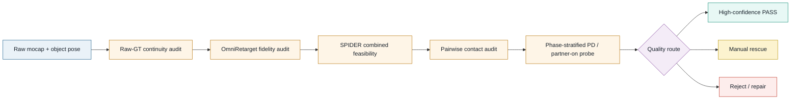

# CORE4D E168–E178 可用率与下游 RL 诊断报告

> 日期：2026-07-26
>
> 范围：E168–E178 的 raw/contact、template、OmniRetarget、SPIDER/PRG、人工审核与
> Box001/004/021/023/024 下游 RL
>
> 任务来源：[exp_analysis_0726.md](../exp_analysis_0726.md)
>
> 结论性质：存量证据诊断；本报告未启动新训练

## 📋 执行摘要

E168–E178 的低可用率不是一个单点算法故障，而是四类损失叠加：

1. **SPIDER 的联合可行域与 gate contract 是最高置信的共性瓶颈。**
   E170–E178 每批内部 candidate gate-health 都是 `0/N`；PRG 虽能降低腿部穿透，
   却在未恢复组中造成 `10/10` 的 3 mm 手接触下降。当前
   `least_violation` fallback 能给出轨迹，但不能保证 body、hand、leg、support
   等约束同时成立。
2. **非 box 的低率主要含有 template/collision proxy 误差，而非都来自 mocap。**
   E174 凹几何只有 `5/39=13%`；修正接触对齐 proxy 后，E178 同一来源子集的
   physics 六门恢复到 `16/27=59%`，人工可用为 `12/23=52%`。
3. **旧六门 gate 与 RL 可训练性明显错位。** 用户给出的 38 条下游 case 中，
   `32` 条成功、`6` 条失败；可与现有指标直接对齐的 36 条里，六门 PASS 仍有
   5 条 RL 失败，六门 FAIL 反而有 10 条 RL 成功。其 precision=`80.0%`，
   低于样本成功基率 `83.3%`；旧六门既非充分条件，也非必要条件。
4. **存在高价值的序列级 reference 动态异常。** Box004 `082_p1/p2` 的对象轨迹
   在 OmniRetarget 之前就出现 `94.236 rad/s` 的四元数测地角速度峰值；Box024
   `028` 的 pre-Omni 对象线速度峰值也显著高于成功对照。它们都在 RL rollout
   的后 15%–30% 同步失稳，值得列为 P0 修复对象。
5. **Box023 暴露了不同的闭环缺口。** 7 条人工批准且六门 PASS 的导出中，
   `040_p2`、`042_p2` 训练失败；两者连 E173 十二门也通过，pre-Omni 对象动态
   又不能与成功对照分离。rollout 从前段直立交互转为约中段多环境同步倒地，
   说明 tracking 均值和离线/CEM gate 仍未覆盖 phase-localized policy
   trackability。
6. **目前不能据此判定“OmniRetarget 整体不好”。** v1 的 solver infeasible
   确实随大箱增加，v2 也只解决可解性、不保证质量；但历史 tracking 多为
   self-reference/method-reference，尚缺相对 raw GT 的统一精度评测。
7. **推荐把单一 pass/fail 改成分层路由。** 先做 raw/converted 连续性审计，
   再做 OmniRetarget raw-GT fidelity、SPIDER 联合可行域、双人 pairwise
   检查和早/中/末 phase 的短时 PD/partner-on 鲁棒性 probe；最后分为高置信
   自动通过、边界人工 rescue、拒绝/返修三路。

## 🎯 诊断问题与口径

本报告回答三个问题：

- 可用率损失发生在 raw、OmniRetarget、SPIDER 还是 gate/RL 接口的哪一层？
- 人工可用、SPIDER 数值通过和 RL 可训练三种标签为什么不一致？
- 哪些修改应优先验证，才能提高最终 RL yield，而不是只提高中间 pass rate？

三种口径不能互相替代：

| 口径 | 回答的问题 | 本报告中的用法 |
|---|---|---|
| SPIDER numeric gate | 轨迹是否满足当前已实现的离线阈值 | 定位 physics/tracking 失败轴 |
| 人工审核 | 动作是否视觉可接受、可进入业务数据集 | 识别数值误伤与漏检 |
| 下游 RL | 给定训练与 rollout 条件下是否能学会并稳定跟踪 | 最终但高成本的后验标签 |

为避免把相关性写成因果性，后文统一使用：

- **观测证据**：日志、NPZ、人工表或 rollout 直接支持的事实；
- **原因推断**：对事实的机制解释，标明置信度和待验证项。

## 🔬 证据与方法

### 数据来源

| 证据层 | Authority |
|---|---|
| 漏斗与 Stage2b | E168–E174 inventory/raw-contact/Stage2b manifests 与完成日志 |
| SPIDER/PRG | full CEM NPZ、case metrics、E168 failure analysis、E170 paired analysis |
| 人工审核 | E168、E170、E172、E173、E178 的 frozen review/snapshot |
| RL | 用户给出的 box021/004/001/024/023 训练结论和 rollout；同 checkpoint 成功对照 |
| 视频复核 | 失败与对照 rollout 的 `10/50/80/92/98%` contact sheets |
| 上游轨迹审计 | `converted.object_poses`、retargeted/trimmed `qpos`、RL target NPZ |

### 轨迹动态审计

对象线速度按相邻帧位移乘 `30 Hz` 计算。对象角速度先归一化四元数，再使用
符号不变的测地距离
`2·acos(|q_t·q_{t+1}|)·30`；因此 Box004 `082` 的角速度峰值不是简单的
`q/-q` 表示歧义。`converted` 使用“quat + xyz”，retargeted/trimmed 使用
“xyz + quat”，比较时已按字段语义重排。

### 归因边界

本地 raw CORE4D root 当前未挂载，因此可以确定异常已存在于
`converted/*-object.npz`、并被 OmniRetarget 继承，但还不能区分它来自原始
对象标注还是 converter。历史 E109 也已确认 self-ref/method-ref tracking
不适合做方法胜负判断；本报告不把缺少 raw-GT 对照的现象写成
“OmniRetarget 已被证明整体失真”。

## 📊 结果总览

### E168–E178 漏斗

| 实验 | 主要对象/目的 | 可比较漏斗 | 最终观测 |
|---|---|---|---|
| E168 | box004/box021/bucket004 扩展 | `102 source-person → 72 move → 66 candidate → 41 raw-contact pass → 40 S4 pass` | Box021 人工 `13/28=46.4%`；strict numeric `7/28` |
| E170 | Box021 PRG | 同一 28 条 paired rerun | 人工 `18/28=64.3%`；strict numeric `12/28` |
| E171 | Box022/Box026 | `60 raw → 17 raw-contact pass → 5 scene reject → 12 CEM` | numeric `5/12`；Box022 `8/8` raw-contact fail |
| E172 | Box004 | `20 raw → 14 move → 6 raw-contact → 6 CEM` | numeric `5/6`；人工批准 `4/6` |
| E173 | Box023/024/001 | `194 raw → 86 move → 56 raw-contact → 53 CEM` | numeric `26/53`；人工 `23 USE / 30 DNU` |
| E174 | bucket/desk 凹 proxy | `330 raw → 92 move2 → 44 raw-contact → 39 CEM` | numeric `5/39=13%` |
| E178 | 修正 bucket proxy 的 27 条 | `27 CEM` | physics `16/27`；12 门 `10/27`；已审人工 `12/23` |

这里至少有三种不同损失：raw/action/contact 过滤、retarget/scene 可解性、以及
CEM 后的 quality/gate 过滤。把 `5/39` 直接解释为“原始数据只有 13% 可用”
会混淆这些层次。

### 尺寸与拓扑

同一 E173 评测口径下，小型凸箱 Box023 为 `13/16=81%`，大型 Box024 和
Box001 分别只有 `3/9=33%`、`10/28=36%`；E172 的小型 Box004 为
`5/6=83%`。这支持尺寸/可达性影响，但 E174–E178 给出了更强的拓扑反证：

| 对照 | 体积或几何 | 结果 | 可支持的判断 |
|---|---:|---:|---|
| Box004 | `0.041 m³`，凸 | `5/6=83%` | 小型凸体相对容易 |
| Bucket004（E174） | `0.045 m³`，凹 proxy | `0/4` | 同尺寸不能解释全败 |
| E174 非 box 合计 | 凹/多部件旧 proxy | `5/39=13%` | proxy/contact-surface 是强嫌疑 |
| E178 修正子集 | contact-aligned proxy | physics `16/27=59%` | proxy 修订可因果性恢复大量 case |

因此“尺寸越大越差”只是一阶趋势；碰撞拓扑、接触面定义、初始姿态和动作难度
共同决定 yield。

### PRG 改善与代价

E170 对同一 28 条 Box021 的 paired 结果显示：

- 人工可用率 `13/28→18/28`，净增 5 条；
- leg penetration `0.235→0.120`（`-48.7%`），near-2cm
  `0.310→0.182`（`-41.2%`）；
- 20 项 paired 指标经 Holm 校正后，只有上述两项仍稳定改善；
- 10 条未恢复 case 的 leg penetration `10/10` 改善，但 3 mm hand contact
  `10/10` 下降。

所以 PRG 对 lower-body 有真实增益，但当前 objective 没有守住
clearance–contact–support 的联合关系，不适合无条件升级为所有对象的统一默认。

### Gate、人工与 RL 的错位

用户给出的下游集合共有 38 条：Box021 `11/11` 成功，Box004 `2/4` 成功，
Box001 `12/13` 成功，Box024 `2/3` 成功，Box023 `5/7` 成功，合计
`32/38` 成功。

Box023 export audit 的 frozen denominator 为 `16 reviewed → 7 approved/exported`；
7 条均为六门 PASS、paired RL ready，人工标签为 `2 CLEAN +
5 MINOR_ACCEPTABLE`。因此新增 RL 结果与导出、人工和 numeric authority 可逐例
对齐，不含事后补选 case。

36 条可直接对齐当前 SPIDER 六门的 case 为：

| SPIDER 六门 | RL 成功 | RL 失败 | 合计 |
|---|---:|---:|---:|
| PASS | 20 | 5 | 25 |
| FAIL | 10 | 1 | 11 |
| 合计 | 30 | 6 | 36 |

若把六门 PASS 当 RL 成功预测器，其 precision 为 `20/25=80.0%`，低于该集合
本身的成功基率 `30/36=83.3%`；recall 为 `20/30=66.7%`，对 6 个失败也只
拒绝 1 个（failure rejection=`16.7%`）。这个小样本不能训练可靠分类器，但
足以否定“六门 PASS 即可训练”和“六门 FAIL 即不可训练”两个强命题。

人工批准也不是充分条件：Box004 `082_p1/p2` 在审核中为 `CLEAN`，
Box001 `014_p2` 与 Box024 `028_p2` 为 `MINOR_ACCEPTABLE`，四条仍全部
RL 失败；Box023 `040_p2`、`042_p2` 同为 `MINOR_ACCEPTABLE`，也训练失败。
人工审核擅长排除肉眼明显错误，却不直接测 policy trackability、phase/terminal
stability 或 partner-on 耦合鲁棒性。

Box023 还提供了同一对象、同一 E173 frozen baseline 的十二门对照：

| E173 physics + tracking 十二门 | RL 成功 | RL 失败 | 合计 |
|---|---:|---:|---:|
| PASS | 4 | 2 | 6 |
| FAIL | 1 | 0 | 1 |
| 合计 | 5 | 2 | 7 |

两条 RL 失败均通过十二门；唯一十二门 FAIL 的 `021_p1` 只失败于 `hand_ori`，
却能训练成功。新增 tracking mean gates 因而仍非闭环可训练性的充分或必要条件。
这不否定十二门作为高置信人工路由的价值，而是说明它不能替代闭环 probe。

E178 的 12 门提供了更合适的操作模式：已审核 23 条中，自动 PASS
precision=`100%`、人工 DNU recall=`100%`，但人工 USE recall=`66.7%`。
这更适合“高置信 PASS + 人工 rescue”，不适合继续追求单阈值覆盖全部可用 case。

## 🔍 分层根因诊断

### 原始数据与动作分布

**观测证据**

- E171 的 Box022 `8/8` 在 raw-contact 阶段失败，是明确的数据层负例。
- E168 中 `20231018` cohort 为 `12/12 DNU`；E170 PRG 后也只恢复到
  `2/12 USE`，而另外两个日期 cohort 均达到 `8/8 USE`。
- E168 人工 DNU 的 `14/15` 命中 lower-body numeric fail，trackbody jerk
  与 ankle jerk 的 DNU AUC 都为 `0.918`，EEF position/orientation AUC 为
  `0.892/0.882`。

**原因推断（中高置信）**

部分日期/动作本身包含更高动态、更差支撑或接触质量，确实提高了机器人化难度；
但 cohort 与采集条件、动作类型、物体姿态共变，不能把日期直接当因果变量。
raw gate 应增加对象 SE(3) 连续性、接触时序和人体高频动态审计，而不只使用
3/5 cm 几何 proxy。

### OmniRetarget 与 reference fidelity

**观测证据**

- OmniRetarget v1 solver infeasible 随大箱上升：Box023 约 `6%`、
  Box001 `30%`、Box024 `40%`。
- v2 能救回求解，但不保证下游质量：E171 `3/3` S3 rescue 的净下游 yield
  为 0；E173 `14/14` rescue 中，进入 CEM 的 v2 只有 `4/12` numeric pass。
- Box004 `082` 和 Box024 `028` 的对象动态异常已存在于 pre-Omni
  `converted.object_poses`。对 Box004，converted quaternion 与 retargeted
  qpos 中对象 quaternion 的逐帧最大绝对差为 `0`。
- Box023 两条 RL 失败的 pre-Omni converted 线速度峰值为
  `5.039/4.941 m/s`，trim 后为 `3.607/3.538 m/s`；成功样本分别可达
  `4.697/3.620 m/s`。两条失败角速度不超成功样本，且七条均无 quaternion
  sign flip，现有对象动态统计不能分离 Box023 成败。
- 当前尚无统一 raw-GT root/joint/EEF/object/contact 对齐表；E109 已将
  历史 self-ref/method-ref 指标标为只能诊断、不能判方法胜负。

**原因推断（分项置信）**

- **高置信**：v1 的可解性对物体尺度/初始条件敏感，v2 rescue 只能视为
  solver fallback。
- **中高置信**：个别失败 reference 在进入 OmniRetarget 前已有对象 pose
  病态；这些 case 不应通过后续算法“硬修”后直接交给 RL。
- **高置信反证**：pre-Omni 对象 pose 病态只解释失败集合的一个子类，不能解释
  Box023 `040_p2/042_p2`；不可把单一对象速度阈值包装成通用 RL gate。
- **待验证**：人体动作是否被 OmniRetarget 系统性失真或增加抖动。必须相对
  raw GT 评测，不能用方法自身 reference 证明自身准确。

`fingertip_aware` 当前没有生产 Stage2b adapter，因此不能作为立即替换默认路线
的方案；近期应先完成 raw-GT benchmark 和现有 v1/v2 的同口径审计。

### SPIDER/PRG 联合可行域

**观测证据**

| 批次 | candidate gate-health |
|---|---:|
| E170 | `0/28` |
| E171 | `0/12` |
| E172 | `0/6` |
| E173 | `0/53` |
| E174 | `0/39` |
| E178 | `0/27` |

该诊断与最终 numeric pass 是两个字段，但连续六批 `0/N` 表明“选中样本满足
完整 candidate gate”从未成为稳定机制。E168 的 CEM fallback mean 对人工 DNU
仅有 AUC `0.549`；明显非法支撑也可能以很低 fallback 比例产出。

**原因推断（高置信）**

当前 body、hand、leg 有效集经常没有足够交集；在空交集或低样本交集时使用
`least_violation` 只能最小化某种聚合违例，不能保持每个 gate 的不变量。
同时，现有六门没有覆盖完整 3D 跟踪峰值、足底滑移、非手部支撑、对象/人体
末端速度以及 terminal support。优化目标与 release gate 之间也缺少统一的
contact-preserving contract。

修复方向不是简单提高惩罚权重，而是：

1. 将 combined-valid 设为选择前置条件；
2. 空交集时显式标记 `REPAIR_OR_REJECT`，并触发定向重采样；
3. 让 contact、clearance、support、terminal stability 共用同一组约束语义；
4. 对每项约束保存 selected candidate 的可审计证据。

### Template/collision proxy

**观测证据**

E174 同体积的 Bucket004 `0/4`，而 Box004 为 `5/6`；旧 bucket proxy 的薄壁、
开口和接触表面定义同时影响 leg penetration 与 hand contact。E178 接触对齐
proxy 后，从 E174 fail 到 E178 pass 的 case 有 16 条，反向只有 1 条。

**原因推断（高置信）**

E174 的大部分损失是场景表示误差被 gate 当作动作误差。非 box template 必须
先通过 mesh↔proxy 双向距离、真实接触点覆盖、开口/薄壁拓扑和 visual overlay，
再运行昂贵 CEM；否则下游只能优化一个错误几何。

### Gate 到 partner-on RL 的接口

**观测证据**

- 上游 gate 验证的是 source trajectory 的离线/CEM 表现；RL rollout 使用
  `partner_on`。
- Box004 `082_p1/p2` 与 Box024 `028_p2` 的多个并行环境在相近 phase
  同步崩溃，而同 checkpoint、同对象的成功对照保持直立。
- Box023 `040_p2/042_p2` 在 10% 帧多数环境仍直立交互，到 50% 帧已出现
  多环境同步倒地并与物体分离；同一 checkpoint 的 `041_p1/021_p2` 可完成序列。
- 五条失败均可通过旧六门；Box023 两条连十二门也通过。六门还拒绝了 10 条
  实际 RL 成功 case。
- 现有 gate 没有 paired-person contact timing、partner collision/wrench、
  phase-stratified survival 或短时闭环扰动测试。

**原因推断（中高置信）**

离线物理可接受不等于闭环 policy 可跟踪。当前接口至少遗漏 reference 的
高频/相位难度、阶段性稳定裕度以及 partner-on 耦合。失败形态并不单一：
Box023 是早/中段成片倒地，Box004 `082` 主要在末段崩溃，Box024 `028`
偏后段失稳，Box001 `014` 则以弱交互为主、没有同样的全局倒地。同步失败更像
共享 reference phase 的系统性事件，不像独立 rollout 噪声；但 partner
耦合是否放大这些事件仍需 `partner_off/on` 配对消融。

## 🎬 下游失败 case 复盘

### 数值对齐

| 失败 case | 人工 / 六门 | 关键异常 | 成功对照 |
|---|---|---|---|
| Box004 `082_p1` | CLEAN / PASS | obj ori `19.43°`；qpos accel p95 `218`；jerk p95 `8754`；obj speed max `1.99 m/s` | `083_p1`：`6.23° / 97 / 2164 / 1.21` |
| Box004 `082_p2` | CLEAN / PASS | obj ori `19.49°`；qpos accel p95 `213`；jerk p95 `7864`；foot slip `1.58 m`；obj speed `2.05` | `083_p2`：`5.44° / 121 / 2484 / 1.15` |
| Box024 `028_p2` | MINOR_ACCEPTABLE / PASS | root pos `17.0 cm`；EEF pos `15.36 cm`；obj pos `14.05 cm`；jerk `571`；foot slip `1.425 m`；obj speed `2.09` | `027_p2`：jerk `309`；slip `1.059 m`；obj speed `1.05` |
| Box001 `014_p2` | MINOR_ACCEPTABLE / FAIL | lower-body fail；leg penetration `0.154`，但其余 tracking/contact 相对可接受 | `011_p1`：同 checkpoint 可学 |
| Box023 `040_p2` | MINOR_ACCEPTABLE / PASS（十二门 PASS） | root/EEF/obj pos `9.79/9.42/9.06 cm`；qpos jerk `2827`；obj speed `1.27`；slip `0.742 m` | `041_p1`：同 checkpoint 可学 |
| Box023 `042_p2` | MINOR_ACCEPTABLE / PASS（十二门 PASS） | root/EEF/obj pos `13.01/12.03/12.81 cm`；qpos jerk `3111`；obj speed `1.95`；slip `0.687 m` | `021_p2`：同 checkpoint 可学 |

Box023 五条成功与两条失败的均值对比中，qpos jerk 为 `2712 vs 2969`，
object speed 为 `1.471 vs 1.614 m/s`，但多数 tracking/physics 指标在失败组
反而更好，且 `040_p2` 数值并不激进。因此 Box023 至多支持“动态可能增加
`042_p2` 难度”，不支持一个现有离线阈值同时解释两条失败。Box004/Box024
是“六门漏检 + reference 动态/闭环失稳”，Box001 更像六门已识别的
lower-body 困难动作；六条失败不应强行归为同一个根因。

### Pre-Omni 对象轨迹

| 序列 | converted 线速度 max | retargeted/trimmed 线速度 max | 对象角速度 max | quaternion sign flips | RL |
|---|---:|---:|---:|---:|---|
| Box004 `082_p1` | `7.801 m/s` | `5.698 m/s` | `94.236 rad/s` | 4 | 失败 |
| Box004 `082_p2` | `7.801 m/s` | `5.734 m/s` | `94.236 rad/s` | 4 | 失败 |
| Box004 `083_p1` | `3.289 m/s` | `2.403 m/s` | `3.083 rad/s` | 0 | 成功 |
| Box004 `083_p2` | `3.289 m/s` | `2.418 m/s` | `3.083 rad/s` | 0 | 成功 |
| Box024 `026_p2` | `1.847 m/s` | `1.424 m/s` | `0.731 rad/s` | 0 | 成功对照 |
| Box024 `027_p2` | `2.009 m/s` | `1.549 m/s` | `1.406 rad/s` | 0 | 成功对照 |
| Box024 `028_p2` | `6.146 m/s` | `4.737 m/s` | `1.758 rad/s` | 0 | 失败 |
| Box023 `045_p1` | `2.836 m/s` | `2.143 m/s` | `2.750 rad/s` | 0 | 成功 |
| Box023 `046_p1` | `2.479 m/s` | `1.873 m/s` | `1.797 rad/s` | 0 | 成功 |
| Box023 `021_p1` | `4.697 m/s` | `3.562 m/s` | `2.911 rad/s` | 0 | 成功 |
| Box023 `021_p2` | `4.697 m/s` | `3.620 m/s` | `2.911 rad/s` | 0 | 成功 |
| Box023 `040_p2` | `5.039 m/s` | `3.607 m/s` | `3.367 rad/s` | 0 | 失败 |
| Box023 `041_p1` | `3.808 m/s` | `2.987 m/s` | `3.770 rad/s` | 0 | 成功 |
| Box023 `042_p2` | `4.941 m/s` | `3.538 m/s` | `2.174 rad/s` | 0 | 失败 |

线速度在 converted 与 retargeted 坐标系中数值不同，但异常帧事件持续存在；
Box004 `082` 的最大角速度出现在原序列 frame `101→102`，trim 后约
`71→72`，最大线速度约在 trim frame `74→75`。p1/v1 与 p2/v2 共享几乎
相同对象异常，进一步支持序列级对象 pose 问题，而非某个人的 solver 特例。
与之相反，Box023 两条失败没有 `082` 式角速度/符号异常，trim 线速度也落在
成功样本范围内。pre-Omni 连续性 gate 仍可拦截明确病态，但不能替代闭环诊断。

### Rollout 视觉证据

| 失败 | 同对象成功对照 |
|---|---|
|  |  |
|  |  |
|  |  |
|  |  |
|  |  |
|  |  |

视频只支持“何时、以什么形态失败”。没有训练曲线、reference overlay 和
partner-off 对照时，不把 Box001 的弱交互、Box004 的末段倒地或 Box023 的
中段倒地进一步解释成唯一确定的控制器原因。

## 💡 改进优先级

### 推荐的数据路由

### 优先级清单

| 优先级 | 修改 | 直接解决的证据 | 注意事项 |
|---|---|---|---|
| P0 | pre-Omni 对象 SE(3) 连续性 gate；保留原值、禁止静默平滑 | Box004 `082`、Box024 `028` | 阈值按动作速度分层；异常先返修/复核 |
| P0 | 修复 combined-valid 选择 contract；空交集定向重采样或拒绝 | 六批 gate-health `0/N` | 先保证不变量，再比较 reward |
| P0 | 增加早/中/末 phase 的低成本 PD survival probe，并配对 `partner_off/on` | 六门/十二门与 RL confusion、Box023 中段及 Box004 末段倒地 | 分段短 horizon，不需直接全量 RL |
| P1 | 加入 full-3D peak、root/EEF/object 动态、foot slip、support、terminal velocity | E168 jerk AUC、E178 12 门收益 | 用 held-out 数据校准，避免追着 6 个失败过拟合 |
| P1 | 建立 OmniRetarget raw-GT benchmark | E109 归因缺口 | v1/v2 分开报告 solver feasibility 与 fidelity |
| P1 | template/proxy 进入 CEM 前做 contact-surface fidelity gate | E174→E178 恢复 | 非 box 按拓扑族维护 proxy contract |
| P1 | 两级发布：高置信自动 PASS + 人工 rescue | E178 precision 100%、USE recall 66.7% | 需冻结人工口径和 object/date split |

不建议把“放宽所有阈值”作为首要方案：它会提高中间 pass rate，却不能修复对象
pose 跃变、联合约束失效或 partner-on 闭环失稳。

## 🧪 验证实验矩阵

以下是建议实验，不代表本报告已执行新训练。

| ID / 优先级 | 假设 | 最小对照设计 | 主指标 | 晋级条件 |
|---|---|---|---|---|
| V0 / P0 | 现有库存在可自动发现的 pre-Omni pose 病态子类 | 扫描 E168–E178 converted；6 个 RL fail 对 matched success | object SE(3) vmax/amax/jerk、sign-invariant angular speed、异常帧比例 | 命中 `082/028` 类且成功对照不过度误伤；允许 Box023 进入其他路由 |
| V1 / P0 | 异常来自 raw 标注或 converter，而非 Omni solver | raw object pose → converted → retargeted 逐帧配准；先做 `082/083/028/026/027` | SE(3) 残差、峰值帧一致性、p1/p2 consistency | 能把每个峰值唯一定位到 raw 或 converter 边界 |
| V2 / P0 | combined gate 空交集是 fallback 失效主因 | 旧 `least_violation` vs combined-valid + targeted resampling；同 seed/budget | gate-health、各 gate selected-valid、contact、CEM yield | gate-health 不再 `0/N`，且 contact/lower-body 无显著倒退 |
| V3 / P0 | phase-localized 闭环失稳解释离线 gate 的漏检 | 6 fail + 每条 2 个 matched controls；同 reference 做早/中/末 phase restart、partner off/on 与扰动 probe | 分 phase survival、root/object error、support/contact timing、wrench/collision | 失败与对照可重复分离，定位首个失稳 phase，并明确 partner 增量 |
| V4 / P1 | OmniRetarget fidelity 随尺寸/动作难度退化 | 按 object size、date、action 分层抽样；v1/v2 对同一 raw GT | root/joint/EEF error、object SE(3)、contact IoU/F1、jerk、foot slide、spectrum | 报告 raw-GT CI；不再用 self-ref 指标判方法胜负 |
| V5 / P1 | 12 门可形成高精度自动 PASS 层 | object/date/sequence group split；训练集定阈值、held-out 评估 | 人工/RL precision、USE recall、DNU recall、coverage、校准曲线 | held-out precision 保持目标值，同时提高自动 coverage |
| V6 / P1 | proxy fidelity 能在 CEM 前预测非 box 失败 | E174 旧 proxy vs E178 contact-aligned proxy，按同 case 配对 | mesh↔proxy 双向距离、contact coverage、下游 gate transition | proxy 指标解释 fail→pass，且跨 bucket/desk 拓扑复现 |

实验顺序应为 `V0→V1/V2→V3→V4/V5/V6`。V0–V2 先修数据与可行性
contract，V3 才给出下游接口证据；否则直接扩大全量 RL 只会重复消耗计算。

## ⚠️ 局限

- RL 样本只有 38 条、失败只有 6 条，且不同对象的 checkpoint/训练进度并非
  完全同构；confusion table 用于否定强命题，不足以拟合稳定预测器。
- Box023 七条使用 `ckpt_9000/seed_42_local_v3`，Box004/024 使用
  `ckpt_28000/seed_42`；同对象成败可作控制，跨对象的失败率不能作严格训练条件
  对比。
- Box001 `014_p2` 的可用视频来自较早 checkpoint，不能与 Box004/024 的后段
  倒地或 Box023 的中段倒地做严格同条件因果比较。
- raw CORE4D root 未挂载，所以对象异常只定位到“raw/转换边界”，还未区分
  原始标注与 converter。
- 当前没有 raw-GT OmniRetarget 评测，也没有 partner-off、reference overlay、
  contact wrench 或训练曲线；相应原因保留为假设。
- E168–E178 的 strict gate 版本和对象范围不同；跨实验百分比只做分层诊断，
  不当作同一总体上的无偏统计估计。
- 人工标签衡量视觉/业务接受度，不是物理真值；`MINOR_ACCEPTABLE` 也不应被解释
  为保证 RL 可训练。

## ✅ 结论

整体可用率不高的首要解释不是“CORE4D 原始数据普遍差”或
“OmniRetarget 普遍差”，而是流水线在不同层混用了不完整的质量 contract：

1. raw 层缺对象动态连续性和真实接触时序审计；
2. OmniRetarget 层把 solver 可解性与 raw-GT fidelity 混在一起；
3. SPIDER 层的 joint feasibility 没有真正成为选样硬约束；
4. template 层曾用错误 proxy 放大非 box 失败；
5. release gate 没有测 phase-localized survival、paired-person 和闭环
   trackability；即使 Box023 十二门 PASS 也不能保证可训练。

短期最有收益的动作是先拦截 `082/028` 类 pre-Omni reference 病态、修复
combined-valid contract，并用小规模 `partner_off/on` 早/中/末 phase probe
填补六门/十二门到 RL 的接口。中期再用 raw-GT benchmark 和 held-out
calibration 建立可解释的两级发布系统。成功标准应从“CEM pass rate 上升”改成
“高精度自动通过率与最终 RL yield 同时上升，且人工 rescue 保留边界好样本”。

## 🔗 证据索引

- E168 数据管线：[Log 220](../log/220_E168_phase0_s4_data_results.md)；
  [人工 gate 复核](../log/223_E168_gate_recalibration_manual_review.md)；
  [失败分析](../log/227_E168_box021_failure_analysis.md)
- E170 PRG：[paired 结果与人工终审](../log/230_E170_box021_prg_final_rl_export.md)
- E171：[Box022/Box026 完整结果](../log/231_E171_box022_box026_screening_full_cem.md)
- E172：[Box004 完整结果](../log/232_E172_box004_screening_full_cem.md)；
  [case metrics](../results/E172/s6_downstream/eval/full/e171_case_metrics.tsv)；
  [人工表](../results/E172/s6_downstream/eval/full/user_manual_review_filled.tsv)
- E173：[Box023/024/001 完整结果](../log/233_E173_box024_box023_box001_screening_full_cem.md)；
  [case metrics](../results/E173/s6_downstream/eval/full/e173_case_metrics.tsv)；
  [人工表](../results/E173/s6_downstream/eval/full/user_manual_review_filled.tsv)；
  [Box023 RL export audit](../results/E173/s6_downstream/rl_export/box023_user_approved/box023_rl_export_audit.json)；
  [Box023 frozen review](../results/E173/s6_downstream/rl_export/box023_user_approved/box023_manual_review_snapshot.tsv)
- E179 Box023 no-PRG 对照：
  [paired E173 baseline](../results/E179/s6_downstream/eval/full/e179_vs_e173_paired.tsv)；
  [结果日志](../log/242_E179_box023_e167a_no_prg_vs_e173_results.md)
- E174–E178 proxy：[E174](../log/234_E174_bucket_desk_move2_nonbox_results.md)；
  [E178 proxy contract](../log/237_E178_bucket_contact_aligned_proxy_gates.md)；
  [E178 physics](../log/239_E178_local_5090_hybrid_rebalance.md)
- E178 12 门与人工：[tracking gate](../log/240_E178_tracking_error_numeric_gates.md)；
  [人工终审](../log/241_E178_bucket_user_manual_review_results.md)
- 方法归因边界：[E109 fair evaluation](../log/139_E109_spider_vs_omniretarget_fair_eval_results.md)
- 本报告视频帧：
  [assets/exp_analysis_0726/video_frames](assets/exp_analysis_0726/video_frames/)
