# E192 baseline replay 漂移诊断

_Core4D 内部分析 · 2026-08-09 · A0 单 box SDF 修正后的 sentinel_

---

## 📋 结论摘要

这次 E192 三 case sentinel 不能直接视为历史结果的 replay。单 box SDF 已恢复为
历史 `_geom_box_sdf_min`，三条 case 的输入文件也都与 E172/E173 authority
一致；但当前 GPU rollout 即使在相同 seed 和配置下重复运行，也无法做到
bitwise identical。

目前最强的解释是三件事共同作用：

- 运行时和硬件发生变化：历史为 Torch `2.8.0+cu128`、L20Y；当前为
  Torch `2.11.0+cu130`、RTX 5090/A100；
- batched MJWarp/CUDA rollout 本身存在数值非确定性；
- CEM 的硬 gate 和 top-k elite 离散选择放大了早期微小差异。

因此，现有证据不支持把 E192 漂移归因于 hand-gate 阈值或单 box SDF 实现。
A2 canary 和 Full 继续暂停。

## 📊 Sentinel 结果

正式 replay 对比见
[e192_sentinel_comparison.tsv](../results/E192/s6_downstream/eval/baseline_sentinel/e192_sentinel_comparison.tsv)，
判定记录见 [log269](../log/269_E192_corrected_box_sdf_sentinel_results.md)。

| Case | 主要漂移 | 结果 |
| --- | --- | --- |
| `box024_20231011_026_p1` | 连续 gate 指标均在容差内 | 本 case 与历史 replay 兼容 |
| `box004_20231003_2_082_p1` | penetration `+0.0826`、contact `−0.0492`、orientation `+17.33°` | 存在漂移 |
| `box004_20231003_2_086_p2` | leg `+0.0822`、position `+3.26 cm`、orientation `−1.78°` | 存在漂移 |

这种 mixed result 符合 CEM 优化器的分支敏感性：某条轨迹虽然早期已经偏离，
末端仍可能偶然回到接近历史的指标；另一条则会停留在不同的 CEM 解分支。

## 🔍 证据链

下面的链路区分了输入、代码、运行时和优化器的影响：

```mermaid
flowchart LR
    accTitle: E192 漂移证据链
    accDescr: 该图展示输入和单 box SDF 代码均匹配历史版本，但当前 GPU rollout 仍出现数值漂移，并被 CEM 的离散选择放大。

    matched_inputs[📥 scene、trajectory、mask、override SHA 一致] --> matched_sdf[✅ 使用历史单 box SDF helper]
    matched_sdf --> runtime_change[⚠️ Torch/GPU runtime 发生变化]
    runtime_change --> gpu_variation[⚠️ batched MJWarp/CUDA 出现数值变化]
    gpu_variation --> cem_branch[🧠 gate 和 top-k elite 分支改变]
    cem_branch --> case_drift[❌ case 级 replay 漂移]

    classDef success fill:#dcfce7,stroke:#16a34a,stroke-width:2px,color:#14532d
    classDef warning fill:#fef9c3,stroke:#ca8a04,stroke-width:2px,color:#713f12
    classDef danger fill:#fee2e2,stroke:#dc2626,stroke-width:2px,color:#7f1d1d
    class matched_inputs,matched_sdf success
    class runtime_change,gpu_variation warning
    class cem_branch,case_drift danger
```

### 输入与代码检查

- 三条 case 的历史与当前 scene、scene-act、trajectory、contact mask、override
  SHA 均一致；
- AST 对比显示 E172/E173 与当前 source 的 `_geom_box_sdf_min` 没有变化；
- E192 实际生效配置为 `object_distance_backend=legacy_box`、
  `object_collision_sdf_mode=primary`、
  `object_collision_sdf_batch_groups=false`；
- `query_tape_enabled=false`；`surface_band_score_mode=symmetric_abs`，即历史
  公式，continuation 字段没有参与优化。

### 运行时 provenance

| 来源 | Python | Torch | CUDA | 设备 |
| --- | --- | --- | --- | --- |
| E172/E173 authority | `3.12.3` | `2.8.0+cu128` | 12.8 build | 8× L20Y |
| 当前 local | `3.12.13` | `2.11.0+cu130` | 13.0 build | RTX 5090 |
| 当前 remote | `3.12.4` | `2.11.0+cu130` | 13.0 build | A100-SXM4 |

历史 provenance 记录在
[E172 environment_check.json](../results/E172/s0_environment/environment_check.json)
和 [E173 environment_check.json](../results/E173/s0_environment/environment_check.json)。

### 同一 runtime 的重复运行

在同一张 RTX 5090 上，使用相同 seed、override、current source，执行两次
`64 samples × 1 iteration`。两份 rollout archive 不是 bitwise identical：

| 量 | 差异 |
| --- | ---: |
| `qpos` 最大绝对差 | `1.2821` |
| `trace_cost` 最大绝对差 | `0.6660` |
| 首次可见 qpos 分叉 | control tick 4 |
| 首次明显 trace/gate 分叉 | CEM tick 6 |

历史与当前的完整 rollout 也呈现同样模式：前几个 control tick 先出现很小的
qpos/qvel/ctrl 差异，然后在第一次有效 CEM 选择处形成明显分支。因此漂移不是
末端 evaluator 造成的。

## 🚫 已排除的解释

| 候选原因 | 检查结果 | 判定 |
| --- | --- | --- |
| 输入文件缺失或发生变化 | SHA 检查一致 | 排除 |
| 单 box SDF helper 错误 | AST 一致，dispatch 已直接回退历史 helper | 排除 |
| query tape / continuation 字段影响 | 实际配置关闭 | 排除 |
| evaluator 脚本不一致 | rollout 内的 `qpos`/`trace_cost` 已经漂移 | 排除 |
| hand-gate 阈值策略导致漂移 | baseline authority 本身尚未可复现 | 暂时无法识别 |

CPU 对照没有跑通：当前 MJWP setup 依赖 CUDA graph capture，使用 `device=cpu`
会在 `wp.ScopedCapture()` 处失败。这只是当前 CPU backend 不可用，不代表 CPU
一定确定或一定不确定。

## seed解释
seed 是统一的全局 seed，不只是 NumPy。process_config() 会同时设置：
  - np.random.seed(config.seed)：NumPy
  - torch.manual_seed(config.seed)：PyTorch CPU
  - torch.cuda.manual_seed(config.seed) 和 manual_seed_all()：PyTorch CUDA
  - random.seed(config.seed)：Python 标准库

## 🎯 结论与边界

当前证据支持判定 `INCONCLUSIVE_BASELINE_DRIFT`：

> E192 的单 box SDF 修正不是当前已证实的漂移来源。历史与当前 GPU/runtime
> stack 之间的 replay contract 无效，而且当前 batched CEM path 自身也存在
> run-to-run 数值非确定性。

因此，不能把历史 E172/E173 结果直接作为当前 runtime 下的 A2 严格 control。
在新的 replay authority 冻结前，不应把后续 canary 或 Full 解释为阈值实验结果。

## 🧭 建议的下一步

继续 E192 前需要先选定一种复现 contract：

1. 恢复历史 runtime 和 GPU 类别，然后重新跑三条 A0 sentinel；或
2. 将当前 Torch/Warp/GPU stack 声明为新的 authority，先跑同 stack baseline repeat，
   再仅以新 baseline 作为 A2 对照。

无论采用哪种 contract，都应固定相同 seed 和 case 集，记录完整 runtime
provenance，并在应用 CEM 阈值决策前先测量同 stack 的重复运行方差。

## 🔗 证据索引

- [修正后的 sentinel 对比表](../results/E192/s6_downstream/eval/baseline_sentinel/e192_sentinel_comparison.tsv)
- [修正后的 sentinel metrics](../results/E192/s6_downstream/eval/baseline_sentinel/e192_case_metrics.tsv)
- [E192 corrected sentinel 日志](../log/269_E192_corrected_box_sdf_sentinel_results.md)
- [E172 runtime provenance](../results/E172/s0_environment/environment_check.json)
- [E173 runtime provenance](../results/E173/s0_environment/environment_check.json)
