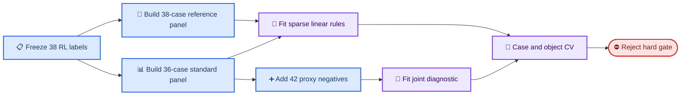

# 38 条 RL case 的指标线性可分性审计

_CORE4D E180 · 2026-07-26 · failure 为正类 · eval-only_

---

## 🧾 摘要

- 对“32 条 RL success 与 6 条 RL fail 能否线性分开”，答案是：
  **训练内可以，单指标不可以，泛化意义上尚不可以**。
- 覆盖全部 38 条实际 RL 输入的 67 维 reference-input 面板中，没有任何单
  指标完美分离；beam search 找到一个 3 指标超平面，训练内 `38/38` 正确。
- 覆盖 36 条同口径 SPIDER/CEM metrics 的面板中，一个 2 指标超平面训练内
  `36/36` 正确；但按 object 留出时只检出 `1/6` 个 RL failure。
- 将 42 条未进 RL 的 case 作为 proxy negative 后，冻结的 2 指标 RL
  separator 只拒绝 `4/42=9.5%`。把 proxy 加入拟合后，5 指标模型仍接受
  `6/48` 条 failure-like case，其中包括两个真实 RL failure。
- 111 指标高维模型能在训练内分开可比的
  `30 success / 48 failure-like`，但 object-held-out 只检出
  `22/48` failure-like；这是高维表观可分，不是可部署 gate。
- 最终裁决为 **B：只可作探索性 soft risk score，不建立 hard gate**。
  独立新 object/date 的 RL held-out 标签是升级 gate 的必要条件。

## 🎯 问题与裁决

| 问题 | 观察结果 | 裁决 |
|---|---|---|
| 单指标能否分开 32/6 | 两个主面板均为 `0` 个 exact metric | 否 |
| 少量指标能否分开 32/6 | 38 条上 3 指标训练内 exact；36 条上 2 指标训练内 exact | 仅训练内可以 |
| 少量指标能否同时拒绝未进 RL case | 5 指标 joint fit 仍错 `6/78`；frozen RL rule 只拒绝 proxy `4/42` | 否 |
| 任意数量指标能否训练内分开 | 111 指标在可比的 78 条上 exact | 是，但属于高维 apparent fit |
| 是否可作为跨 object hard gate | object-held-out 表现不稳，proxy stress 失败 | 否 |

这里的“线性分开”严格区分两种含义：

1. **apparent separation**：在参与选特征和拟合的同一批样本上零错误；
2. **generalizable gate**：对未参与拟合的新 case、新 object 仍保持低漏检和
   低误拒。

E180 只证明了第一种存在，没有证明第二种存在。

## 🧱 数据与标签

### RL-observed authority

| Object | RL success | RL fail | 合计 |
|---|---:|---:|---:|
| Box001 | 12 | 1 | 13 |
| Box004 | 2 | 2 | 4 |
| Box021 | 11 | 0 | 11 |
| Box023 | 5 | 2 | 7 |
| Box024 | 2 | 1 | 3 |
| **合计** | **32** | **6** | **38** |

六条 failure 为 Box004 `082_p1/p2`、Box001 `014_p2`、Box024 `028_p2`
和 Box023 `040_p2/042_p2`。完整逐 case authority 见
[frozen_rl_labels.tsv](../results/E180/rl_metric_separability/frozen_rl_labels.tsv)。

### 三个分析面板

| 面板 | 样本 | 连续特征 | 主要用途 |
|---|---:|---:|---|
| `reference_rl38` | 32 success + 6 RL fail | 67 | 覆盖全部 38 条实际 RL release |
| `standardized_rl36` | 30 success + 6 RL fail | 111 | 同口径 SPIDER/CEM 指标审计 |
| `standardized_rl_plus_proxy78` | 30 success + 6 RL fail + 42 proxy | 111 | 联合 failure-like 压力测试 |

两个 Box021 bridge（`029_p2`、`035_p1`）有实际 R018 release，故进入
reference 面板，但没有 E170/E172/E173 同口径表，不能进入 standardized
面板。因此目前不存在一个同时覆盖“32 success + 6 RL fail + 42 proxy”的
统一特征矩阵；联合面板的 success denominator 是 30，不是 32。

42 条 proxy negative 的组成是：

- E170 人工 `DO_NOT_USE`：10 条；
- E172 未进入 RL export：2 条；
- E173 未进入 RL export：30 条。

后两类没有 RL outcome，不能冒充真实 RL failure。它们只回答“这个规则能否
拒绝当前未晋级数据”，不能估计 RL failure recall。



## 🔬 方法

### 特征边界

允许输入的是有物理含义的连续值，包括 target/partner/object 的速度、加速度、
jerk、接触、穿透、tracking error、foot slip、alignment 和 CEM health
原始量。以下字段显式排除：

- case/object/date/experiment ID 及任何 one-hot 身份编码；
- 人工标签、`manual_use_decision`、`expected_quality`；
- `numeric_release_pass`、既有 gate pass/fail、`fall_flag`；
- E170 delta/improvement 列、路径、状态和 reviewer 字段。

完整纳入/排除原因见
[standard_feature_dictionary.tsv](../results/E180/rl_metric_separability/standard_feature_dictionary.tsv)。

### 模型与验证

1. 对每个指标穷举全部相邻值中点和两个方向，failure 固定为正类。
2. 用标准化 linear SVM 做 1–5 特征 beam search：
   单指标排名取前 18，beam width 为 30，`C=1e5`。
3. 用 L1 logistic path 作为不同归纳偏置的对照，最多保留 5 个非零特征。
4. 用全部可用特征的 linear SVM 判断“高维空间是否表观线性可分”；该模型
   只作诊断，不作为可解释候选。
5. 对 RL-only 面板做 LOOCV 和 leave-one-object-out；联合面板做
   stratified 5-fold 和 leave-one-object-out。
6. 每个外层 fold 内重新过滤常数、标准化、选特征和拟合，不共享全数据统计量。
7. 做 100 次分层 bootstrap 特征稳定性和 200 次 label permutation baseline。
8. 将只在 36 条 RL-observed 上拟合的 standardized 模型冻结，再应用到 42
   条 proxy negative。

Beam search 是受约束启发式搜索。因此“未找到 1–5 维 exact separator”表示在
本搜索空间中未找到，不是对所有可能 5 特征子集的数学不可行性证明。

## 📊 结果

### 单指标没有完美分离

| 面板 | 最佳单指标 | 方向/阈值 | 错误 | Failure recall | Success recall |
|---|---|---|---:|---:|---:|
| reference 38 | `joint_acc_l2_mean` | `>=86.6750` | 1/38 | 5/6 | 32/32 |
| standardized 36 | `obj_err_max_m` | `>=0.03221` | 2/36 | 4/6 | 30/30 |
| RL + proxy 78 | `sugar_3d_over_frac` | `>=0.21951` | 15/78 | 35/48 | 28/30 |

最佳单指标已经显示 failure 的异质性：reference 面板最接近的是关节加速度，
standardized 面板则是 object error；没有一个共同标量形成零重叠区间。

### RL-only 训练内可构造稀疏完美超平面

失败判定统一为 `score >= 0`。

Reference-input 38 条的 3 指标公式为：

```text
score_ref =
  -87.50178614
  + 0.004147183827 * joint_jerk_l2_p95
  + 36.13989131  * object_lin_speed_p95
  - 0.005249266208 * object_lin_jerk_p95
```

Standardized 36 条的 2 指标公式为：

```text
score_std =
  -6.153407590
  - 2784.555096 * track_root_quat_err_terminal
  + 15.94531470 * trackbody_speed_max
```

| 面板 | 特征数 | 训练 success | 训练 failure | 标准化几何 margin |
|---|---:|---:|---:|---:|
| reference 38 | 3 | 32/32 | 6/6 | 0.04883 |
| standardized 36 | 2 | 30/30 | 6/6 | 0.00345 |

这两个公式是本批样本的表观边界。Standardized 公式的 margin 尤其小，且
`track_root_quat_err_terminal` 的负系数不应作机制解释；它是相关特征在小样本
上的条件系数，不表示“tracking error 越大越成功”。

### 严格交叉验证不支持 hard gate

| 面板/模型 | 验证 | Balanced acc. | Failure recall | Success recall |
|---|---|---:|---:|---:|
| reference / 最佳单指标 | LOOCV | 0.719 | 3/6 | 30/32 |
| reference / sparse SVM | LOOCV | 0.771 | 4/6 | 28/32 |
| reference / sparse SVM | object-held-out | 0.760 | 5/6 | 22/32 |
| reference / all 67 | object-held-out | 0.589 | 2/6 | 27/32 |
| standardized / 最佳单指标 | LOOCV | 0.600 | 2/6 | 26/30 |
| standardized / sparse SVM | LOOCV | 0.867 | 5/6 | 27/30 |
| standardized / sparse SVM | object-held-out | 0.583 | 1/6 | 30/30 |
| standardized / all 111 | object-held-out | 0.900 | 5/6 | 29/30 |

Standardized sparse SVM 在 object-held-out 中只识别 Box024 `028_p2`；
Box001 `014_p2`、Box004 `082_p1/p2`、Box023 `040_p2/042_p2` 全部漏过。
Reference sparse SVM 虽识别 `5/6` failure，却误拒 `10/32` success，其中
9 条来自 held-out Box001。两个面板的“最佳”行为不一致，不能互相视为复现。

111 指标 standardized 模型的 object-held-out 数字较高，但其条件是
`p=111, n=36`，且只有 5 个 object fold。该模型冻结后仍只拒绝 `16/42`
proxy，加入 proxy 后的跨 object 表现也明显下降，因此不能从这一格单独升级
hard gate。

### Proxy stress 和联合拟合失败

将 standardized RL-only 模型冻结后：

| Frozen 模型 | Proxy coverage | 拒绝 proxy | 接受 proxy |
|---|---:|---:|---:|
| 2 指标 sparse SVM | 42/42 | 4/42 | 38/42 |
| L1 logistic | 42/42 | 17/42 | 25/42 |
| 全 111 指标 SVM | 42/42 | 16/42 | 26/42 |

2 指标 sparse rule 接受了全部 10 条 E170 人工 `DO_NOT_USE`，也接受 E172
两条未晋级 case。说明 RL-only exact separator 没有学习到“人工不可用/未晋级”
这类边界。

把 42 条 proxy 加入联合拟合后：

| 模型 | 训练内 success | 训练内 failure-like | 交叉验证 | Failure recall | Success recall |
|---|---:|---:|---|---:|---:|
| 5 指标 sparse SVM | 30/30 | 42/48 | 5-fold | 36/48 | 24/30 |
| 5 指标 sparse SVM | — | — | object-held-out | 36/48 | 20/30 |
| 全 111 指标 SVM | 30/30 | 48/48 | 5-fold | 35/48 | 22/30 |
| 全 111 指标 SVM | — | — | object-held-out | 22/48 | 26/30 |

5 指标 apparent model 的 6 个 overlap case 是：

- RL failure：Box001 `014_p2`、Box023 `040_p2`；
- proxy：Box001 `109_p1`、`039_p2`、`038_p2`、`011_p2`。

111 指标在训练内 `78/78` exact，但跨 object 只检出 `22/48` failure-like。
这是“维度足够高所以能切开样本点”的证据，不是统一 failure mechanism 的证据。

### 特征与系数不稳定

100 次分层 bootstrap 中，最终 reference 公式的三个特征被重新选中的频率为：

| 特征 | 选择频率 | 条件系数符号 |
|---|---:|---|
| `object_lin_speed_p95` | 40% | 40/40 为正 |
| `joint_jerk_l2_p95` | 4% | 4/4 为正 |
| `object_lin_jerk_p95` | 3% | 2/3 为正 |

Standardized 2 指标公式中：

| 特征 | 选择频率 | 条件系数符号 |
|---|---:|---|
| `track_root_quat_err_terminal` | 44% | 44/44 为负 |
| `trackbody_speed_max` | 15% | 15/15 为正 |

虽然 bootstrap 样本几乎总能被某个稀疏超平面切开，但具体特征组合频繁变化。
这正是“小样本容易表观 exact，公式本身却不稳定”的模式。

L1 logistic 的 5-fold balanced accuracy 相对 200 次 label permutation 为：

| 面板 | 实际 | Permutation mean | Permutation p95 | 探索性 p |
|---|---:|---:|---:|---:|
| reference 38 | 0.745 | 0.503 | 0.714 | 0.0398 |
| standardized 36 | 0.733 | 0.492 | 0.700 | 0.0448 |

这支持“指标中有高于随机的风险信号”，但不支持零容错 gate；这里还没有为多个
模型/特征搜索做 confirmatory multiple-testing 校正。

## 🧭 如何读表

- `failure recall` 是六条已观测 RL failure 中被拒绝的比例，是本审计的首要
  redline 指标。
- `success recall` 是 RL success 中被保留的比例；低值意味着 gate 浪费可训
  case。
- `balanced accuracy` 对 success/failure 两类 recall 等权，避免 `32:6`
  不平衡让“全部预测成功”看起来有高 accuracy。
- `object-held-out` 比 LOOCV 更接近跨物体部署：一个 object 的全部样本同时
  不参与标准化、选特征和拟合。
- Proxy 表中的“failure-like”只表示未晋级或人工 DNU，不表示真实 RL 失败。

## 💡 解释

### 存在风险信号，但没有单一 failure axis

Reference 面板反复出现 joint acceleration/jerk 和 object speed，说明输入运动
动态确实含有 RL 可恢复性信号。Standardized 面板还出现 tracking terminal、
leg penetration 和 foot-ground 指标。Permutation 结果也表明信号不完全等同
随机噪声。

但是六条 RL failure 至少包含不同机制：

- Box004/Box024 的病态 object dynamics；
- Box023 中段多环境同步倒地；
- Box001 交互学习失败但未呈现同类倒地。

一个线性平面要同时包住这些 failure，又不误拒相邻 success，只能依赖多个相关
指标间很薄的样本边界。

### Object shift 是主要反例

Standardized sparse model 在 LOOCV 达到 `5/6` failure recall，却在按 object
留出后降为 `1/6`。这表明相邻 case 带来的 object-specific 数值范围帮助了
拟合；去掉整个 object 后，边界不能迁移。Reference 模型的 Box001 大量误拒是
同一问题的另一面。

### Proxy 与 RL failure 不是同一标签

RL failure 是闭环训练后验，proxy negative 混合了人工视觉质量、数值 gate、
动作/contact/template 可用性等更早阶段的原因。要求一个线性平面同时分开二者，
隐含了“所有失败共享同一连续方向”的假设；E180 的联合结果不支持这个假设。

## ✅ 结论与讨论

对用户问题的最短回答是：

> 可以构造训练内线性公式分开当前 32/6；但目前找不到一个同时稳定拒绝真实
> RL failure 和未进 RL case、并能跨 object 泛化的线性 hard gate。

建议保留两个层次：

1. 3 指标 reference 公式只作为 **audit score**，用于排序需要额外短 probe
   的 case，不自动拒绝；
2. 当前发布 gate 继续使用分病因的物理/人工 authority，不用 E180 公式覆盖。

这与历史 E166 的经验一致：训练内 exact 很容易出现，真正决定是否可用的是
leave-one 与新对象证据。

## ⚠️ 局限

- RL failure 只有 6 条，且只有 5 个 object，置信区间很宽。
- 两个 Box021 bridge 缺同口径 standardized metrics；联合分析只能使用
  30/32 条 success。
- 42 条 proxy 没有 RL outcome，不能计算真实 RL false negative。
- 1–5 特征 beam search 不是所有组合的穷举证明。
- 同一 object/date/sequence 的 case 并非独立同分布样本。
- 高维模型的 `p` 大于 `n`，训练内 exact 是预期风险，不是强证据。
- 指标来自当前 SPIDER/CEM/R018 pipeline；更换 retarget、RL recipe 或
  checkpoint 后分布可能变化。
- 本轮没有新的独立 RL run，只分析冻结证据。

## 🛠️ 下一步

1. 冻结而不再调整 3 指标 audit score，在至少 10–20 条新 date/object 的 RL
   label 上做一次真正 held-out 验证。
2. 对六条 failure 与成功对照补 early/mid/late phase 的短闭环 probe，建立
   fall、object pathology、contact/interaction learning 的分病因标签。
3. 将“未进 RL”拆为人工视觉 DNU、numeric fail、contact fail、template fail，
   分别训练/标定 redline，不再合成单一 proxy failure。
4. 只有当 frozen rule 在新 object 上同时满足高 failure recall 和低 success
   rejection，才讨论 hard threshold；否则维持 soft ranking。

## 📦 复现说明

代码版本：`4ca0c42` 加本次未提交 E180 工作区改动。

运行命令：

```bash
.venv/bin/python \
  workspace/core4d/scripts/eval/runners/eval_E180_rl_metric_separability.py \
  --bootstrap 100 \
  --permutations 200
```

关键产物：

| 内容 | 路径 |
|---|---|
| Runner | [eval_E180_rl_metric_separability.py](../scripts/eval/runners/eval_E180_rl_metric_separability.py) |
| Tests | [test_eval_E180_rl_metric_separability.py](../scripts/eval/runners/test_eval_E180_rl_metric_separability.py) |
| Plan | [E180 plan](../plan/198_E180_rl38_metric_linear_separability_audit_plan.md) |
| Frozen labels | [frozen_rl_labels.tsv](../results/E180/rl_metric_separability/frozen_rl_labels.tsv) |
| Release lineage | [reference_release_lineage.tsv](../results/E180/rl_metric_separability/reference_release_lineage.tsv) |
| Single metrics | [single_metric_sweep.tsv](../results/E180/rl_metric_separability/single_metric_sweep.tsv) |
| Models/formulas | [apparent_linear_models.tsv](../results/E180/rl_metric_separability/apparent_linear_models.tsv) |
| Coefficients | [model_coefficients.tsv](../results/E180/rl_metric_separability/model_coefficients.tsv) |
| CV summary | [cross_validation_summary.tsv](../results/E180/rl_metric_separability/cross_validation_summary.tsv) |
| CV predictions | [cross_validation_predictions.tsv](../results/E180/rl_metric_separability/cross_validation_predictions.tsv) |
| Bootstrap | [bootstrap_feature_stability.tsv](../results/E180/rl_metric_separability/bootstrap_feature_stability.tsv) |
| Permutation | [permutation_summary.tsv](../results/E180/rl_metric_separability/permutation_summary.tsv) |
| Proxy stress | [proxy_negative_stress_test.tsv](../results/E180/rl_metric_separability/proxy_negative_stress_test.tsv) |
| Machine summary | [audit_summary.json](../results/E180/rl_metric_separability/audit_summary.json) |

`.venv` 和系统 Python 当前均未安装 pytest；因此验证使用同一 `.venv` 直接导入
并执行 4 个 `test_*` 函数，全部通过。`py_compile` 同样通过。
