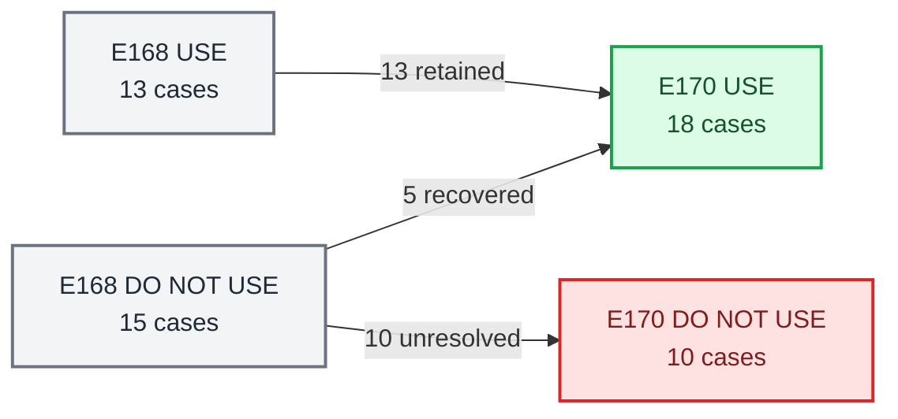

# E170 Box021 PRG 全量对比分析与 RL-ready 导出

_CORE4D Phase 33 · E168 baseline → E170 PRG · 2026-07-20_

---

## 📋 结论摘要

E170 回答的不是“PRG 有没有让某个均值变好”，而是：PRG 能否修复 E168 的不可用轨迹，同时不破坏已有可用轨迹。

- **人工结果有明确净增益**：E168 的 `13 USE / 15 DO_NOT_USE` 变为 E170 的 `18 USE / 10 DO_NOT_USE`，可用率从 `46.4%` 提升到 `64.3%`，净恢复 5 条、提升 `+17.9pp`，且 `13/13` 原可用 case 全部保留。
- **严格数值结果同步净增 5 条**：numeric pass 从 `7/28` 提升到 `12/28`；5 条 `fail→pass`、7 条 `pass→pass`，没有 `pass→fail`。
- **真正稳定的指标增益只集中在 lower body**：`leg_penetration_frac` 均值从 `0.235` 降到 `0.120`（`-48.7%`），`leg_near_2cm_frac` 从 `0.310` 降到 `0.182`（`-41.2%`）。对 20 项 paired 指标做 Holm 校正后，只有这两项仍呈稳健改善。
- **PRG 没有带来全栈质量提升**：raw hand contact 均值下降 `2.8%`，3mm hand contact 下降 `1.2%`，object position error 上升 `7.1%`；jerk、object speed、foot slip 都是 mixed 或轻微退化。
- **10 条未恢复 case 暴露出明确 trade-off**：它们的 lower-body penetration `10/10` 都改善，但 3mm hand contact `10/10` 都下降；PRG 部分消除了踩箱/穿箱，却把一部分失败转移成接触丢失、支撑不稳或困难 reference 无法跟随。
- **最终判断**：PRG 是有效的 lower-body 定向修复，也是有价值的 per-case rescue，但不是 Box021 的统一默认解。机器 strict 结论仍为 `FAIL`；18 条人工认可轨迹按 allowlist 导出 RL-ready，不代表 28 条全量推广通过。

## 🎯 实验问题与对照口径

### 对照关系

| 项目 | E168 baseline | E170 candidate |
|---|---|---|
| 方法 | `E167A_zOnlyBody` | frozen `PRG` |
| P | 无 lower-body/object physics pair | 16 个 lower-body/object pair |
| R | 无 lower-body SDF penalty | 2cm margin soft penalty |
| G | 无 lower-body candidate gate | min-SDF/violation candidate gate |
| Case | 28 条 Box021 person-case | 同一 28 条 |
| Retarget/route | 每 case 冻结 | 不变 |
| 人工 authority | E168 逐视频标签 | E170 fresh paired review |

本报告使用同 case paired comparison。正 delta 的含义随指标方向而异，因此表格统一直接展示 E168→E170：contact 越高越好，error/penetration/jerk 越低越好。

`leg_object_physics_contact_frac` 不用于 E168→E170 直接优劣比较：E168 的 P-off scene 没有 lower-body/object physics pair，该值结构性为 0；E170 P-on 后才会真实产生该接触。它只能在 E170 内解释“剩余 overlap 已变成物理干涉”，不能把 `0→正值` 简单写成回归。

### 证据范围

- 28/28 unified metrics，零 error/not-ready
- 28/28 E168-vs-E170 paired video
- 28×5 关键事件帧，共 140 条视觉证据
- 28/28 用户终审标签
- 20 项 paired metric 的 mean、median、逐 case 方向和 Wilcoxon 检验

## 📊 E168→E170 状态转移



### 人工 operational 转移

| E168 | E170 USE | E170 DO_NOT_USE | 结论 |
|---|---:|---:|---|
| USE（13） | 13 | 0 | `100%` 保留，无人工回归 |
| DO_NOT_USE（15） | 5 | 10 | 恢复 `33.3%` |
| 合计 | 18 | 10 | 可用率 `46.4%→64.3%` |

5 条从不可用恢复为可用：

- `box021_20231011_036_p1`
- `box021_20231018_028_p1`
- `box021_20231018_032_p1`
- `box021_20231020_019_p1`
- `box021_20231020_020_p2`

### Strict numeric 转移

| E168 numeric | E170 pass | E170 fail | 结论 |
|---|---:|---:|---|
| pass（7） | 7 | 0 | 没有 strict pass 回归 |
| fail（21） | 5 | 16 | 新增 5 条 numeric pass |
| 合计 | 12 | 16 | `25.0%→42.9%`，提升 `+17.9pp` |

numeric `fail→pass` 的 5 条是 `box021_20231011_034_p2`、`box021_20231018_028_p1`、`box021_20231020_019_p1`、`box021_20231020_020_p2`、`box021_20231020_022_p1`，与人工恢复的 5 条并不完全相同。这说明人工 operational 增益不是简单复制 numeric gate：`box021_20231011_036_p1`、`box021_20231018_032_p1` 仍有数值告警但经视觉接受，而 `box021_20231011_034_p2`、`box021_20231020_022_p1` 本来人工可用、现在数值也转为 pass。

### Capture cohort

| Capture date | E168 USE | E170 USE | 增量 | 解释 |
|---|---:|---:|---:|---|
| `20231011` | 7/8 | 8/8 | +1 | 唯一失败 `box021_20231011_036_p1` 被恢复 |
| `20231018` | 0/12 | 2/12 | +2 | 仍是主要 hard cohort |
| `20231020` | 6/8 | 8/8 | +2 | `box021_20231020_019_p1`、`box021_20231020_020_p2` 被恢复 |

PRG 的收益不是均匀分布：它补齐了 20231011/20231020，但对 20231018 只从 `0/12` 提高到 `2/12`。因此剩余失败主要不是随机坏样本，而是该动作 cohort 中仍存在系统性缺口。

## 📈 28 条整体指标是否有明显增益

### Paired mean 与方向一致性

`改善/持平/下降` 是逐 case paired 计数，不是把不可比量纲相加后的总分。

| 指标 | E168 mean | E170 mean | 相对变化 | 改善/平/下降 | 判断 |
|---|---:|---:|---:|---:|---|
| Lower-body penetration | 0.235 | 0.120 | `-48.7%` | 21/2/5 | 明确、广泛改善 |
| Lower-body near 2cm | 0.310 | 0.182 | `-41.2%` | 22/2/4 | 明确、广泛改善 |
| Body-z p95 | 0.163m | 0.142m | `-13.0%` | 16/0/12 | mixed，受大失败修复驱动 |
| Pelvis-z terminal | 0.031m | 0.020m | `-36.5%` | 19/0/9 | 方向较好，但 median 仅改善 1.8mm |
| Root position error | 22.76cm | 21.07cm | `-7.4%` | 18/0/10 | 次级改善 |
| Root orientation error | 23.24° | 15.59° | `-32.9%` | 21/0/7 | 方向明显，受少数大角度 case 影响 |
| EEF position error | 21.00cm | 19.99cm | `-4.8%` | 19/0/9 | 小幅改善 |
| EEF orientation error | 31.06° | 23.80° | `-23.4%` | 16/0/12 | mixed，非全局一致 |
| Raw hand contact | 0.690 | 0.671 | `-2.8%` | 10/2/16 | 轻微退化 |
| 3mm hand contact | 0.431 | 0.426 | `-1.2%` | 9/1/18 | 退化 case 更多 |
| Hand penetration >3mm | 0.185 | 0.176 | `-5.0%` | 15/1/12 | 小幅 mixed 改善 |
| Object position error | 14.64cm | 15.67cm | `+7.1%` | 10/0/18 | 轻微退化 |
| Trackbody jerk p95 | 718.4 | 699.3 | `-2.7%` | 12/0/16 | mean 降但多数 case 未改善 |
| Ankle jerk p95 | 882.6 | 861.9 | `-2.3%` | 16/0/12 | 小幅 mixed 改善 |
| Object speed max | 1.748m/s | 1.792m/s | `+2.5%` | 12/0/16 | 轻微退化 |
| Foot slip max | 0.872m | 0.886m | `+1.6%` | 10/0/18 | 无改善证据 |

### 统计解释

对 20 项指标做 paired Wilcoxon，并对 20 项同时检验做 Holm 校正后：

- `leg_penetration_frac`：校正后 `p=0.017`
- `leg_near_2cm_frac`：校正后 `p=0.0049`
- 其余 18 项：校正后均未达到 `0.05`

这不表示其余指标“完全没变化”，而是它们的改善方向不够一致，或均值由少数极端 case 主导。这里的检验把 28 个 person-case 当作 paired observations；实验没有多 seed 重复，且同 sequence 的 p1/p2 并非完全独立，因此 p-value 只说明跨 case 方向一致性，不代表优化器随机性已经被统计估计。

> 📌 **整体回答：** 有明显增益，但它是 lower-body 定向增益，不是全指标共同增益。人工可用率净增 5 条是真实工程收益；hand contact、object tracking 和 motion health 没有同步提高，阻止了 PRG 成为全量默认方案。

## 💡 为什么 5 条从不可用变成可用

恢复组的共同特征非常强：lower-body penetration 均值从 `0.386` 降到 `0.050`，5/5 改善；raw contact 均值反而从 `0.772` 升到 `0.806`。也就是说，这 5 条没有用“脱手”换取腿部 clearance，PRG 在它们上真正缓解了主要 blocker。

| Case | E168 主失败 | PRG 后关键改善 | 剩余代价 | E170 结论 |
|---|---|---|---|---|
| `box021_20231011_036_p1` | 腿穿箱、窄/交叉支撑 | leg `0.378→0.154`；raw contact `0.811→0.820`；root pos `21.6→19.7cm` | leg 仍高于 0.10；ankle jerk 略升 | `USE`，numeric lower-body warning |
| `box021_20231018_028_p1` | 高动态 reference + 支撑不稳 | leg `0.284→0.095`；raw contact `0.684→0.816`；body-z `0.195→0.180m` | trackbody jerk `1359→1469`，reference 仍很难 | `USE`，strict pass |
| `box021_20231018_032_p1` | 下肢非法支撑 + 激烈恢复 | leg `0.427→0.000`；root ori `36.2→17.4°`；body jerk `1329→981` | hand penetration `0.366→0.354`，仍超门 | `USE`，hand-penetration warning |
| `box021_20231020_019_p1` | 单支撑/root collapse | leg `0.423→0.000`；root ori `59.7→42.9°`；body jerk `917→491` | raw contact略降，object speed `1.90→2.54m/s` | `USE`，strict pass |
| `box021_20231020_020_p2` | 脚踩/进入箱体 | leg `0.419→0.000`；raw contact `0.814→0.900`；3mm contact `0.514→0.657`；root ori `17.5→10.4°` | 无新的硬门失败 | `USE`，最干净的恢复 |

三个 insight：

1. `box021_20231020_020_p2`、`box021_20231018_032_p1` 是最强机制证据：原 lower-body blocker 被直接清零，且多数 tracking/contact 指标同步改善。
2. `box021_20231018_028_p1` 说明困难 reference 不必然无法恢复；只要 PRG 能找到不依赖非法支撑的路径，即使 jerk 仍高，轨迹也可能 operationally usable。
3. `box021_20231011_036_p1`、`box021_20231018_032_p1` 说明当前 strict threshold 比用户视觉 authority 更保守；它们是可用但有残余告警的 allowlist，不应被写成“指标全通过”。

## 🔍 为什么 10 条仍然不可用

未恢复组并不是 PRG 完全无效：leg penetration 均值从 `0.314` 降到 `0.163`，10/10 改善；body-z 也有 7/10 改善。真正的问题是 hand contact：raw contact 均值从 `0.508` 降到 `0.440`，3mm contact 从 `0.378` 降到 `0.268`，后者 10/10 下降。

最终失败 taxonomy 会重叠：`contact_loss=8/10`、`lower_body=6/10`、`body_z=2/10`。contact loss 已从 E168 的次生症状变成 E170 的主导 blocker。

| Case | PRG 确实改善了什么 | E170 blocker | 为什么 PRG 没解决 |
|---|---|---|---|
| `box021_20231018_028_p2` | leg `0.301→0.215` | body-z、contact、lower-body | 极端 lateral reach 仍超出支撑 envelope；body-z `0.225→0.228m`，3mm contact `0.077→0.038`，jerk 明显上升；需要 reference retiming/stance constraint |
| `box021_20231018_029_p1` | leg `0.155→0.014`；root/EEF 略好 | body-z | 下肢穿箱已解决，但 body-z `0.236→0.234m` 基本不变；PRG 没有 terminal upright、root roll/pitch 或 support-polygon gate |
| `box021_20231018_030_p1` | leg `0.398→0.330`；root pos/EEF pos 改善 | lower-body | penetration 仍很高；root ori `10.1→29.5°`、hand penetration `0.045→0.193`、3mm contact `0.600→0.433`，说明优化仍在用错误支撑/姿态换 tracking |
| `box021_20231018_030_p2` | body-z `0.619→0.158m`；leg `0.057→0`；原 fall 被修复 | contact loss | 最典型的“修好平衡但脱手”：raw contact `0.467→0.350`；PRG 没有 contact-preserving feasibility |
| `box021_20231018_031_p2` | leg `0.477→0.159`；root ori `47.4→10.2°` | contact + lower-body | leg 仍超门，raw contact 仅 `0.327`；P 只让接触进入物理，未禁止 non-hand support，G 也未保持 hard invariant |
| `box021_20231018_032_p2` | leg `0.197→0.000`；hand penetration下降 | contact loss | lower-body 已彻底解决，但 raw contact `0.432→0.341`；需要 hand-contact preservation，而不是继续加 leg penalty |
| `box021_20231018_033_p1` | leg `0.302→0.256`；root tracking略好 | contact + lower-body | 原站箱 loophole 仍在；3mm contact `0.222→0.074`、hand penetration `0→0.105`、jerk上升；缺 non-hand support hard rejection |
| `box021_20231018_033_p2` | leg `0.598→0.309`；root ori `66.6→12.3°` | contact + lower-body | 大幅改善但仍远未合法；raw/3mm contact继续下降，hand penetration增加，说明姿态改善没有转成稳定抓持 |
| `box021_20231018_034_p2` | leg `0.144→0`；body jerk `785→594`；ankle jerk `1093→740` | contact loss | PRG 同时修好 lower-body 和 chatter，但 raw contact `0.543→0.413`；这是最清楚的 contact trade-off case |
| `box021_20231018_035_p2` | root ori `97.8→29.9°`；leg `0.511→0.351` | contact + lower-body | 仍有严重 lower-body/root support 问题，raw contact `0.621→0.439`，object speed `2.08→3.22m/s`；缺 stance/root/terminal hard constraint |

### PRG 的机制边界

1. **P 只改变碰撞物理，不保证避碰**：E168 中被忽略的腿/箱 overlap 在 P-on 后会产生反力；如果优化仍选择该路径，它会变成真实物理干涉或借箱支撑。
2. **R 是 soft preference**：hand/object reward 足够大时，优化器仍可“购买”lower-body violation；它不能表达“绝对不能踩箱/借箱”。
3. **G 当前不是可靠 hard gate**：28/28 gate-health fail。leg-valid pool 与 body/hand gate 组合后可能不足，`least_violation` fallback 仍会选择 invalid candidate，selected-valid invariant 没有维持。
4. **PRG 没有 contact-preserving 项**：未恢复组中 lower-body 10/10 改善、3mm contact 10/10 下降，说明现有 objective 存在清晰的 clearance-contact trade-off。
5. **PRG 没有 stance/root/reference 模型**：极端 reach、单支撑、terminal upright、root roll/pitch、support polygon、adaptive horizon/retiming 均不在 P/R/G 中，因而 `box021_20231018_028_p2`、`box021_20231018_029_p1`、`box021_20231018_035_p2` 这类失败不可能只靠 leg SDF 完整解决。

## ⚠️ 13 条原可用 case：全部保住，但并非全部指标提升

E168 的 13 条 USE 在 E170 仍全部 USE，这是 PRG 最重要的安全结果。但“人工没有回归”不等于“所有指标都变好”。下表的 W/T/L 是 12 项核心方向指标的逐 case 导航计数，每项一票、不加权，不作为 release rule。

| Case | W/T/L | 主要变化 | 解读 |
|---|---:|---|---|
| `box021_20231011_034_p1` | 9/1/2 | leg `0.266→0.140`；3mm contact `0.517→0.707`；hand pen `0.280→0.126` | 广泛改善，但 leg 仍有 warning |
| `box021_20231011_034_p2` | 6/0/6 | 3mm contact `0.352→0.664`；hand pen `0.517→0.248`；leg `0→0.054` | E168 penetration fail 转为 strict pass |
| `box021_20231011_036_p2` | 4/1/7 | raw contact `0.891→0.941`；hand pen `0.208→0.285`；ankle jerk `594→727` | 仍 strict pass，但动态指标下降 |
| `box021_20231011_037_p1` | 7/0/5 | leg `0.028→0`；root/EEF improve；raw contact略降 | 小幅净改善 |
| `box021_20231011_037_p2` | 8/0/4 | leg `0.056→0`；root/EEF improve；3mm contact `0.412→0.333` | tracking改善、contact有代价 |
| `box021_20231011_038_p1` | 7/1/4 | body-z、EEF、hand penetration改善 | 稳定保留 |
| `box021_20231011_038_p2` | 3/0/9 | leg `0.521→0.632`；root pos `+6.58cm`；EEF pos `+6.39cm`；body jerk `+141` | 最明显的 retained regression；用户仍接受，但不能称为质量提升 |
| `box021_20231020_019_p2` | 10/0/2 | raw contact `0.682→0.879`；3mm `0.258→0.500`；leg `0.310→0.180` | 广泛改善，leg warning仍在 |
| `box021_20231020_020_p1` | 7/0/5 | leg `0.023→0`；body/ankle jerk明显下降；contact略降 | 小幅净改善 |
| `box021_20231020_022_p1` | 7/1/4 | leg `0.173→0.019`；body-z改善 | E168 lower-body fail 转为 strict pass |
| `box021_20231020_022_p2` | 7/1/4 | contact/hand penetration改善，但 leg `0.048→0.314` | lower-body 明显回归；用户接受但需保留 warning |
| `box021_20231020_023_p1` | 1/0/11 | raw contact `0.750→0.827`，其余多数方向轻微下降 | 阈值内且视觉可用，但不是 metric improvement case |
| `box021_20231020_023_p2` | 3/0/9 | hand penetration `0.164→0.091`；raw contact `0.788→0.577`；leg `0.055→0.100` | 仍 strict pass，但 margin 明显变小 |

三个 retained warning case 应在下游保留额外关注：`box021_20231011_038_p2` 是多指标明显回归，`box021_20231020_022_p2` 是 lower-body 大幅回归，`box021_20231020_023_p1` 是 12 项中 11 项方向下降但尚未越门。它们证明 PRG 不适合无条件覆盖 E168 baseline；当前按最终 allowlist 使用是合理边界。

## 💡 核心 insight

### Insight 1：PRG 修复的是 lower-body geometry，不是完整 carry feasibility

两个 lower-body 指标是唯一通过多指标校正的稳健增益，说明 P/R/G 的实现方向有效。恢复的 5 条中，leg penetration 5/5 下降，且平均下降约 `87%`。但 carry feasibility 还包含手部持续接触、stance foot、root upright、non-hand support 和 reference reachability；这些轴没有进入当前 PRG。

### Insight 2：剩余失败已从单纯“穿箱”转为 clearance-contact trade-off

10 条未恢复 case 的腿部指标全部改善，3mm hand contact 却全部下降。这是最重要的新诊断：继续单纯增大 R 或收紧 G，可能会让腿离箱更远，但进一步增加脱手。下一步必须联合优化合法支撑与 contact preservation，而不是继续做单轴 lower-body tuning。

### Insight 3：mean tracking 改善不等于全局泛化

Root orientation mean 下降 `32.9%`、EEF orientation mean 下降 `23.4%`，看起来很强；但多数指标在 Holm 校正后不稳健，且 `box021_20231011_038_p2`、`box021_20231020_023_p1`、`box021_20231020_023_p2` 等 retained case 出现广泛方向下降。大均值收益部分来自修复 `box021_20231018_030_p2`、`box021_20231018_033_p2`、`box021_20231018_035_p2` 等极端 outlier，不能推断每条轨迹都更好。

### Insight 4：G 的问题不是没有 leg-valid candidate，而是组合 gate 没守住 invariant

E169/E170 diagnostics 表明 leg-valid pool 并非全空，但 body∧hand∧leg combined-valid 不足时仍会 fallback；`gate-health=0/28` 表明 selected candidates 没有持续保持 leg-valid。要把 G 称为 hard gate，必须修改 selection contract，而不是只调阈值。

### Insight 5：20231018 是下一步最有价值的 hard split

PRG 后 20231011 和 20231020 都达到 8/8 USE，20231018 仍只有 2/12。下一轮无需再平均铺满 28 条：应围绕这 10 条 unresolved case，按 contact-loss、residual lower-body、body-z/reference 三类做有针对性的机制实验，并用 `box021_20231011_038_p2`、`box021_20231020_022_p2`、`box021_20231020_023_p1` 做 regression controls。

## 🎯 实验结论与下一步

### Claims 裁决

| Claim | 结果 | 证据与解释 |
|---|---|---|
| C0 provenance 完整 | PASS | 28 条 source/route/artifact SHA 完整 |
| C1 无重复计算 | PASS | 24 E170 new + 4 E169 reuse |
| C2 失败集恢复 | strict FAIL / operational gain | strict `3/15` 未达 `9/15`；人工恢复 `5/15` |
| C3 可用集保留 | strict FAIL / operational PASS | strict `9/13` 未达 `12/13`；人工 `13/13` 保留 |
| C4 核心量化质量 | PARTIAL | lower-body 稳健改善，contact/object/motion mixed |
| C5 视觉证据 | PASS | 28 paired、140 keyframes、用户 28 labels |
| C6 gate 可诊断 | 证据 PASS / 机制 FAIL | diagnostics 完整，gate-health `0/28` |
| C7 分层覆盖 | PASS | person/route/date/E168 label/sequence 均有汇总 |
| C8 可复现 | PASS | config、manifest、review、comparison/export SHA 齐全 |

### 推荐下一步

1. **Contact-preserving combined gate**：在 lower-body clearance 可行集内，增加 hand-contact minimum/in-mask preservation，首先验证 `box021_20231018_030_p2`、`box021_20231018_032_p2`、`box021_20231018_034_p2`。
2. **Non-hand support + stance/root hard feasibility**：禁止脚/腿/骨盆/躯干借箱支撑，并加入 stance-foot、root roll/pitch、terminal upright，验证 `box021_20231018_030_p1`、`box021_20231018_031_p2`、`box021_20231018_033_p1`、`box021_20231018_033_p2`、`box021_20231018_035_p2`。
3. **Reference feasibility arm**：对 `box021_20231018_028_p2`、`box021_20231018_029_p1` 做 reachability/retiming/adaptive horizon，避免把超出支撑 envelope 的 reference 强塞给局部 CEM。
4. **Regression controls**：固定 `box021_20231011_038_p2`、`box021_20231020_022_p2`、`box021_20231020_023_p1`，任何新方案必须同时保住接触、lower-body 与 tracking，不再只看 overall mean。

机器建议仍为 `FAIL`：PRG 不成为 Box021 统一默认配置。工程上保留 18 条最终人工 allowlist；算法上进入“PRG + contact/support/reference”定向修复，而不是继续对 P/R/G 权重做无结构 sweep。

## 📦 RL-ready 与复现资产

18 条人工 USE 已完成正式 source+partner 导出：

| 导出层 | 结果 |
|---|---:|
| Standard source | 18/18 `RL_EXPORT_READY` |
| Partner Stage2b | 18/18 pass |
| Paired input | 18/18 `PAIR_COMPLETE + RL_EXPORT_READY` |
| DO_NOT_USE 混入 | 0/10 |
| Independent export audit | 8/8 pass |

关键资产：

- 逐 case E168→E170 分析：`results/E170/s6_downstream/eval/full/comparison_analysis/e170_vs_e168_case_summary.tsv`
- 20 项总体指标分析：`results/E170/s6_downstream/eval/full/comparison_analysis/e170_vs_e168_metric_summary.tsv`
- 机器可读结论：`results/E170/s6_downstream/eval/full/comparison_analysis/e170_vs_e168_analysis.json`
- 原始 paired delta：`results/E170/s6_downstream/eval/full/e170_paired_deltas.tsv`
- 人工 authority：`results/E170/s6_downstream/eval/full/user_manual_review_template.tsv`
- 标准 RL 输入：`results/E170/s6_downstream/rl_export/rl_export_input.tsv`
- Paired RL 输入：`results/E170/s6_downstream/rl_export/paired_rl_export_input.tsv`
- Partner manifest：`results/E170/s6_downstream/rl_export/partner_omnirt/rl_partner_omnirt_manifest.tsv`
- Review audit：`results/E170/s6_downstream/evidence/completion/review_package_audit_final.json`
- Export audit：`results/E170/s6_downstream/evidence/completion/rl_export_audit_final.json`

分析入口：

```bash
workspace/core4d/scripts/launch/active/analyze_E170_vs_E168.sh
```

导出入口：

```bash
workspace/core4d/scripts/launch/active/export_E170_box021_user_approved_rl.sh
```

验证：comparison analyzer `py_compile`、wrapper `bash -n`、真实运行、28-case set equality、20-metric paired summary、`git diff --check` 均通过。
