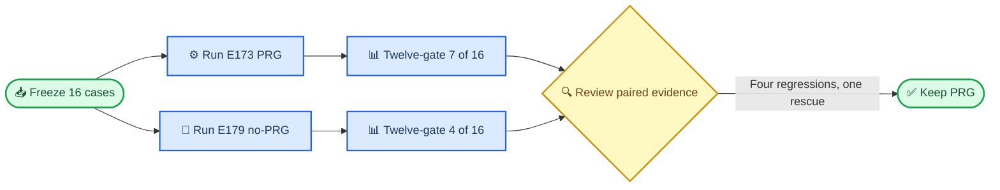

# E179 结果：box023 E167A no-PRG 与 E173 PRG 配对对比

_Core4D Phase 42 · 2026-07-25 · 16-case single-seed Full CEM ablation ·
[实验计划](../plan/197_E179_box023_e167a_no_prg_full_cem_plan.md)_

---

## 📋 Summary

- 问题：在 E173 box023 的同一 `16` 条 CEM-eligible authority 上，只移除
  E170 lower-body PRG，是否能保持或改善 Full CEM 结果。
- 执行：E179 使用 E167A base、关闭 PRG，固定 `seed=0`、
  `1024 samples × 32 iterations`；本地 RTX 5090 GPU0 跑 `4` 条，
  远程 A100 GPU `2/3/6/7` 各跑 `3` 条，最终 `16/16` 完成。
- 主结果：E173 PRG → E179 no-PRG 的 physics 六门为
  `13/16 → 9/16`，加入 root/EEF/object tracking 后的十二门为
  `7/16 → 4/16`。
- 配对迁移：`PASS→FAIL=4`、`FAIL→PASS=1`；四条新退化中三条包含
  lower-body fail，唯一救回为 `box023_20231011_021_p1`。
- 决策：数值结论为 `PRG_BETTER`，视频关键帧结论为
  `SUPPORTS_PRG_BETTER`。box023 默认保留 PRG，不晋级 no-PRG。

## 🎯 1. Experiment motivation

E173 在 box023 上报告的 `13/16` 是 physics 六门通过率，不包含 tracking。
本实验把用户要求的 root、EEF、object position/orientation 六门加入同一
scoring contract 后，E173 十二门基线为 `7/16`。因此本轮同时保留两个口径：

| 口径 | 回答的问题 |
|---|---|
| Physics 六门 | 动作是否满足基础物理与接触约束 |
| Physics + tracking 十二门 | 物理约束与目标动作跟踪是否同时满足 |

E179 的决策问题不是“no-PRG 能否偶尔救回个别 case”，而是它能否在同一
16 条 paired population 上替代 E173 PRG。成功标准允许负结论；C0–C6
要求的是实验闭合与证据完整，不预设 no-PRG 必须获胜。

## ⚙️ 2. Experiment setup

### Paired authority

| 项目 | 冻结值 |
|---|---|
| Dataset/object | CORE4D box023 |
| Raw move-only authority | `46` rows |
| Full CEM population | E173 全部 `16` 条 CEM-eligible rows |
| Retarget variants | OmniRetarget v1=`15`，v2 rescue=`1` |
| Paired denominator | `16`，不使用完成子集 |
| Target/contact | 同 case target、`ref_fk`、raw 3 cm contact mask |
| Hand collision | 两侧均为 rubber hull |
| E173 baseline | E167A base + E170 PRG |
| E179 treatment | E167A base，no-PRG |

### CEM and execution

| 参数 | 值 |
|---|---|
| Random seed | `0` |
| Full samples | `1024` |
| Optimization iterations | `32` |
| Local worker | RTX 5090 GPU0，`4` rows |
| Remote workers | A100 GPU `2/3/6/7`，各 `3` rows |
| Remote policy | 用户授权固定四卡叠加运行 |
| Full completion | `16/16`，terminal failure=`0` |
| Launch code HEAD | `64f9a33f4bce0edce66fb7108b6055448ab03f9c` |

三个 `64×4` canary 仅验证 runtime/config/artifact contract，Full 对这些
case 重新 fresh 运行，没有复用低预算结果。Full 的五个 worker 分片为
`4+3+3+3+3`，并集和 unique case 均为 `16/16`。

## 🔧 3. Core algorithm or method

E179 保留 E167A 的 z-only body tracking、ground-z、hand gate、posture gate
和 symmetric surface band，只关闭 E170 PRG 的 lower-body physics pair、
leg penalty、leg candidate gate、fallback 与相关 runtime diagnostics。
因此它是“E167A no-PRG vs E173 PRG”的完整方法包消融，不能把结果单独归因
到 PRG 的某一个子组件。



Method audit 在最终 Full manifest 上得到：

| 审计项 | 结果 |
|---|---:|
| E167A profile parity | `16/16` |
| no-PRG negative contract | `16/16` |
| Unexpected PRG runtime diagnostics | `0` |
| Audit failures | `0` |

## 📊 4. Metrics

主 contract 为 `core4d-e179-12gate-tracking-v1`，每条 case 产生 `12`
个明确 gate cell，合计 `16×12=192`。任何缺失或非有限值都按 FAIL 处理。

| 分组 | Gates | 阈值/方向 |
|---|---|---|
| Physics | fall、body-z、contact、release、hand penetration、lower-body | 沿用公共 Core4D gate |
| Root tracking | position、orientation | `≤20 cm`、`≤20°` |
| EEF tracking | position、orientation | `≤20 cm`、`≤20°` |
| Object tracking | position、orientation | `≤20 cm`、`≤10°` |

连续指标使用 paired delta `Δ=E179−E173`。误差和 penetration 指标越低越好，
contact fraction 越高越好。统计补充包括 median、IQR、固定 seed `0` 的
`10,000` 次 paired bootstrap mean 95% CI，以及 exact two-sided McNemar。

## 📈 5. Results

### Headline pass rates

| 口径 | E173 PRG | E179 no-PRG | Delta |
|---|---:|---:|---:|
| Physics 六门 | `13/16` | `9/16` | `-4` |
| Physics + tracking 十二门 | `7/16` | `4/16` | `-3` |

### Twelve-gate pass counts

| Gate | E173 | E179 | Delta |
|---|---:|---:|---:|
| fall | `15/16` | `15/16` | `0` |
| body-z | `16/16` | `16/16` | `0` |
| contact | `16/16` | `16/16` | `0` |
| release | `16/16` | `16/16` | `0` |
| hand penetration | `16/16` | `16/16` | `0` |
| lower-body | `14/16` | `10/16` | `-4` |
| root position | `10/16` | `11/16` | `+1` |
| root orientation | `14/16` | `14/16` | `0` |
| EEF position | `11/16` | `13/16` | `+2` |
| EEF orientation | `8/16` | `7/16` | `-1` |
| object position | `15/16` | `16/16` | `+1` |
| object orientation | `16/16` | `16/16` | `0` |

### Paired migration

| Migration | Count | Cases |
|---|---:|---|
| `PASS_TO_PASS` | 3 | `045_p1`、`046_p1`、`042_p2` |
| `PASS_TO_FAIL` | 4 | `041_p1`、`021_p2`、`040_p2`、`041_p2` |
| `FAIL_TO_PASS` | 1 | `021_p1` |
| `FAIL_TO_FAIL` | 8 | 其余八条 |

五个 discordant case 的具体变化：

| Case | Migration | E179 新状态 |
|---|---|---|
| `box023_20231011_021_p1` | `FAIL_TO_PASS` | E173 `hand_ori` fail 被救回 |
| `box023_20231020_041_p1` | `PASS_TO_FAIL` | 新增 `hand_ori` fail |
| `box023_20231011_021_p2` | `PASS_TO_FAIL` | 新增 `lower_body` fail |
| `box023_20231020_040_p2` | `PASS_TO_FAIL` | 新增 `lower_body, hand_ori` fail |
| `box023_20231020_041_p2` | `PASS_TO_FAIL` | 新增 `lower_body` fail |

十二门总体 McNemar 为 `PASS_TO_FAIL=4`、`FAIL_TO_PASS=1`、
exact `p=0.375`。lower-body 单门为 `4/0`，exact `p=0.125`。

### Continuous paired statistics

| Metric | Mean Δ | IQR Δ | Bootstrap mean Δ 95% CI | Observed direction |
|---|---:|---:|---:|---|
| Leg penetration fraction | `+0.0736` | `0.1178` | `[+0.0370,+0.1143]` | no-PRG 更差 |
| Object position error | `-0.752 cm` | `1.422 cm` | `[-1.540,-0.108] cm` | no-PRG 更好 |
| Root position error | `+2.628 cm` | `2.593 cm` | `[-1.183,+8.971] cm` | CI 跨 0 |
| EEF position error | `+2.707 cm` | `2.409 cm` | `[-1.165,+9.249] cm` | CI 跨 0 |
| EEF orientation error | `+3.055°` | `3.976°` | `[-0.631,+8.744]°` | CI 跨 0 |
| In-mask physics contact | `+0.022` | `0.065` | `[-0.005,+0.056]` | CI 跨 0 |

除 leg penetration 与 object position error 外，主要 tracking/contact
paired mean CI 均跨 `0`。完整连续指标见
[paired comparison report](../results/E179/s6_downstream/eval/full/E179_vs_E173_report.md)。

### Video review observations

EGL 渲染得到 E179 treatment、E173 baseline 和 paired 视频各 `16/16`；
ffprobe failures=`0`。对每个 paired MP4 抽取 `10/30/50/70/90%`
五个时刻，共复核 `80` 张关键帧和 `16` 张 contact sheet。

- `021_p2`、`040_p2`、`041_p2` 的 no-PRG 深蹲/搬运阶段均显示更小腿箱
  间距或下肢跨在箱体上方，支持三个 lower-body 新退化。
- `041_p1` 的差异集中在 hand orientation；稀疏关键帧未显示整体动作崩坏，
  因此以连续指标和 hand-orientation gate 为准。
- 唯一救回 `021_p1` 完成完整搬运并恢复站立，未见新增下肢碰箱或姿态异常。
- 三条 `PASS_TO_PASS` 的整体阶段、末段站立与腿箱分离均保持一致。

视觉 reviewer 记录为 `codex_video_frames`，这是对已生成视频的证据复核，
不冒充用户人工可用性标签。逐 case 观察见
[visual review authority](../results/E179/s6_downstream/render/full/visual_review.tsv)。

## 🔍 6. How to read the tables and videos

- `13/16` 与 `9/16` 只表示六个 physics gates 的交集；不能与十二门的
  `7/16`、`4/16` 混为同一指标。
- 十二门表的单门 pass 数可能改善，但最终交集仍下降。例如 E179 的
  EEF position pass 增加两条，不足以抵消四条整体 `PASS_TO_FAIL`。
- `Δ=E179−E173`：对 error/penetration，正值表示恶化；对 contact fraction，
  正值表示改善。
- Bootstrap CI 描述这 `16` 个 paired case 的重采样不确定性，不等同于
  多 seed 泛化区间。
- Paired MP4 左右画面分别显示 E173 PRG 与 E179 no-PRG；关键帧只用于定位
  明显姿态/碰撞差异，细微 orientation 结论仍以数值时间序列为主。

## 🔬 7. Interpretation

### Observed evidence

1. no-PRG 的十二门整体 pass 少 `3` 条，discordant migration 为 `4:1`
   倾向 PRG。
2. lower-body 单门净损失 `4` 条，且没有任何 `FAIL_TO_PASS`。
3. leg penetration paired mean 明确增加，bootstrap CI 不跨 `0`。
4. 三条 lower-body 新退化均有方向一致的视频证据。
5. no-PRG 同时带来 object position error 的平均改善，且 CI 不跨 `0`。

### Inference

最符合证据的解释是：PRG 在 box023 上主要保护 lower-body 可行域；移除后，
CEM 有时能换取更好的物体位置或个别 tracking gate，但代价是更频繁的
腿箱接近/侵入。由于本轮比较的是 PRG 完整方法包，不能进一步区分收益来自
physics pairs、soft penalty 还是 candidate gate。

十二门 McNemar `p=0.375`、lower-body `p=0.125` 均未达到传统显著性阈值，
因此不把小样本离散检验写成“统计显著”。决策依据是 effect direction、
leg penetration CI、逐 case 迁移和视频证据的一致性，而不是单独依赖 p 值。

## ✅ 8. Conclusion and discussion

E179 完成了计划中的完整 16-case paired ablation。no-PRG 没有达到替代 E173
PRG 的要求，正式结论为：

> `PRG_BETTER`；box023 保留 E170 PRG，不晋级
> `E167A_zOnlyBody_noPRG` 为默认方法。

这不否定 no-PRG 的局部收益：`021_p1` 被救回，object position error 也平均
改善 `0.752 cm`。但在当前面向可用率的交集 gate 下，三条有视觉支持的
lower-body 新退化比这些收益更关键。若要继续研究，应拆分 PRG 子组件，而
不是重复同一 no-PRG Full。

### Claims verification

| Claim | Result | Evidence |
|---|---|---|
| C0 authority | PASS | 同一 `16` 条 case/input hash authority |
| C1 method fidelity | PASS | E167A parity=`16/16` |
| C2 no-PRG | PASS | negative audit=`16/16`，runtime leak=`0` |
| C3 Full closure | PASS | completed=`16/16`，terminal failure=`0` |
| C4 paired metrics | PASS | metrics=`16`、paired=`16`、gate cells=`192` |
| C5 visual | PASS | E173/E179/paired=`16/16/16`，review=`16/16` |
| C6 reproducibility | PASS | config/scene/manifest/GPU/command/SHA evidence complete |

最终
[completion audit](../results/E179/completion_audit/completion_audit.md)
为 `11/11 PASS`、failures=`[]`。

## ⚠️ 9. Limitations and caveats

- 只有一个 seed 和 `16` 个 box023 case；不能外推到其它箱体尺寸或全部
  CORE4D object。
- no-PRG vs PRG 是方法包级消融，不能单独识别 P/R/G 中哪个组件负责收益。
- 视频复核基于五个固定百分比关键帧与完整 paired MP4；细微 hand orientation
  仍主要依赖 numeric gate。
- `codex_video_frames` 视觉结论不是用户人工 USE/DO_NOT_USE 终审。
- Bootstrap 对 case 维度重采样，不能替代多 seed CEM 方差估计。
- E179 results 目录按项目惯例为本地 artifact authority；可复现核心由 tracked
  scene/config/scripts、scene snapshot manifest 与日志索引共同保证。

## ✍️ 10. Next steps

1. box023 默认继续使用 E173 PRG，不启动同配置 no-PRG 重跑。
2. 若要解释机制，优先做小规模 `P/R/G` 单组件或二组件 ablation，并预注册
   lower-body penetration 与 object tracking 的 trade-off。
3. 将 `021_p1` 作为 no-PRG rescue diagnostic，将
   `021_p2/040_p2/041_p2` 作为 PRG lower-body protection diagnostic。
4. 后续跨 box 尺寸比较继续同时报告 physics 六门和完整十二门，避免再次把
   `13/16` 与 `7/16` 混读。

## 📦 Reproducibility notes

### Canonical artifacts

| Artifact | Path/status |
|---|---|
| Input authority | [`input_authority.tsv`](../results/E179/input_authority/input_authority.tsv), `16/16` |
| Full manifest | [`cem_full_manifest.tsv`](../results/E179/s6_downstream/manifests/cem_full_manifest.tsv), `16` rows |
| Method audit | [`e167a_no_prg_audit_summary.json`](../results/E179/s5_handoff/config_scene_audit/e167a_no_prg_audit_summary.json), PASS |
| Metrics summary | [`e179_eval_summary.json`](../results/E179/s6_downstream/eval/full/e179_eval_summary.json), PASS |
| Paired report | [`E179_vs_E173_report.md`](../results/E179/s6_downstream/eval/full/E179_vs_E173_report.md) |
| Per-case comparison | [`e179_vs_e173_paired.tsv`](../results/E179/s6_downstream/eval/full/e179_vs_e173_paired.tsv), `16` rows |
| Render summary | [`render_summary.json`](../results/E179/s6_downstream/render/full/render_summary.json), `16+16` rendered |
| Visual review | [`visual_review.tsv`](../results/E179/s6_downstream/render/full/visual_review.tsv), `16/16` |
| Completion audit | [`completion_audit.json`](../results/E179/completion_audit/completion_audit.json), `11/11 PASS` |
| Scene snapshot | `workspace/core4d/results/E179/scene_snapshot/manifest.txt` |
| Runtime logs | `logs/E179/cem/` |

### Canonical commands

```bash
.venv/bin/python \
  workspace/core4d/scripts/experiments/E179/audit_e167a_no_prg.py \
  --require-all

LOCAL_GPU_ID=0 MODE=full \
  bash workspace/core4d/scripts/launch/active/run_E179_local.sh

A100_POLICY_GPUS=2,3,6,7 \
E179_ALLOW_COMPUTE_OVERLAP=1 \
  bash workspace/core4d/scripts/launch/active/run_E179_remote_a100.sh \
  full

E179_PULL_FILE_TRANSPORT=scp \
  bash workspace/core4d/scripts/launch/active/pull_E179_remote_a100_results.sh \
  full

MUJOCO_GL=egl \
  bash workspace/core4d/scripts/eval/wrappers/eval_E179_box023_12gate.sh \
  full

MUJOCO_GL=egl \
  bash workspace/core4d/scripts/launch/active/run_E179_render_all.sh

.venv/bin/python \
  workspace/core4d/scripts/experiments/E179/audit_completion.py \
  --require-all
```

### Execution issues and resolutions

| Issue | Attempts | Resolution |
|---|---:|---|
| Inactive PRG diagnostics were still serialized | 1 canary batch | Runtime keys now emit only when the corresponding PRG component is active; fresh canary `3/3` PASS |
| Local OSMesa initialization failed | 1 | Re-ran evaluator/render with verified `egl` backend |
| Remote sync inventory was omitted | 1 launch | Copied inventory after bulk sync and resumed the same run root |
| `rsync` pull timed out | 8 (`6×30s + 2×180s`) | Switched canonical pull to `scp`; remote runtime `12/12`, merge `16/16` |
| Initial ffprobe glob targeted the wrong directory | 1 | Rechecked from manifest canonical video paths; failures=`0` |

回收期间没有重跑 Full CEM。用于验证 `scp` 的临时 NPZ 与 canonical NPZ
SHA256 完全一致后已精确删除；正式 canonical result 保留。
