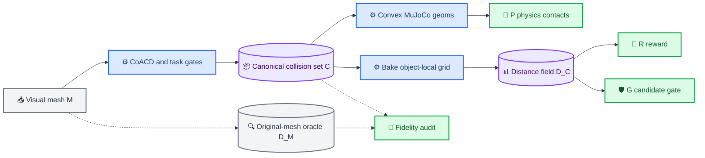

# E178 调研：MuJoCo 非凸物体碰撞体构建

_Core4D · 2026-07-30 · 范围：论文、开源项目、MuJoCo/MJWarp 官方实现与
SPIDER E178 本地证据_

## 0. 结论先行

### 对问题 1 的回答

这个问题需要拆成两个层次，结论不同：

1. **“MuJoCo 能否表示非凸刚体并做碰撞”已经解决。** 可选表示包括：
   - 多个 primitive/convex mesh 组成的 compound convex；
   - rigid flex 的三角面片碰撞；
   - analytic 或 mesh-backed SDF。
2. **“从任意 mesh 自动生成少量、精确、保空腔、接触稳定、且能在
   1024-world MJWarp 中高吞吐运行的碰撞体”没有被完全解决。**
   最小精确凸分解是 NP-hard；近似方法始终在误差、组件数、碰撞稳定性和
   运行时间之间取舍。更关键的是，通用 Hausdorff/concavity 误差不等价于
   SPIDER 轨迹可用率。

所以不能把 E178 归类为“行业已有一键标准答案，只是还没调用”。它有成熟的
默认路线，但仍需要任务约束和本项目实测。

### 对问题 2 的回答

截至 2026-07-30，**MuJoCo 中最佳的开源 production baseline 是
CoACD 生成 compound-convex collision geoms**。理由是：

- MuJoCo 官方文档明确推荐离线 convex decomposition，并点名 CoACD；
- CoACD 有 TOG/SIGGRAPH 2022 同行评审、完整开源实现和 Python/C++ 接口；
- 它的 collision-aware concavity 专门惩罚凸包填洞/填空腔；
- V-HACD 已停止维护并建议迁移 CoACD；
- `obj2mjcf` 已集成 CoACD，且该工具用于 MuJoCo Menagerie 资产处理。

但对 **E178 的最佳落地方案**不是“把 visual OBJ 改成一个 mesh geom”，也不是
不加约束地运行一次 CoACD，而是：

> **CoACD real-metric compound convex + bucket navigable/free-space 与
> contact-aware gates + 从同一 collision union 烘焙的 GPU grid-SDF；原始
> mesh-backed SDF 只作高保真 oracle。**

在通用 object-distance backend 完成前，可先用 CoACD 的 box approximation
作为兼容现有 box-union PRG 的过渡方案。是否能在 E178 取代 `5/1/5`，必须由
固定输入、固定 seed 的 paired ablation 决定，不能仅看离线 mesh 距离。

## 1. 为什么这个问题容易被表述错

“非凸物体碰撞体”至少包含三件不同的事：

| 层次 | 问题 | 当前状态 |
|---|---|---|
| 引擎表示 | 非凸形状能否进入接触求解器 | 已解决 |
| 离线构建 | 如何从 mesh 自动得到低复杂度代理 | 有成熟近似，未全局解决 |
| 任务有效性 | 代理是否保持 bucket 抓取、桶沿、内外壁和下游轨迹可用性 | 未解决，必须任务化验证 |

普通 MuJoCo `geom type="mesh"` 不保留输入 mesh 的凹性。它可以按原 mesh
渲染，但碰撞使用 QHull 计算的凸包。因此一个 bucket OBJ 直接作为 mesh geom，
其桶口和桶腔会在碰撞意义上被填平。

MuJoCo 官方给出的主路线是：把非凸物体离线分解成多个 convex primitive 或
convex mesh，并把它们挂在同一个 body 上。官方说明这种预处理虽然需要工作，
但运行时更快且更稳定。

## 2. MuJoCo 的三类可行表示

### 2.1 Compound convex：推荐的 production 路线

表示：

```text
one rigid body
  ├─ convex geom 0
  ├─ convex geom 1
  ├─ ...
  └─ convex geom K-1
```

每个 mesh part 本身是凸的；MuJoCo 对各 part 使用 GJK/EPA 等 convex collider，
整体非凸性由各 part 的并集得到。

优点：

- MuJoCo 官方推荐；
- convex collider 成熟、稳定，有 broad/mid-phase pruning；
- 可控制 hull 数和每 hull 顶点数；
- 可同时用于 CPU MuJoCo 和 MJWarp；
- 资产构建发生在离线，不把三角面片复杂度带进每个 simulation step。

局限：

- hull 越少，越容易填洞、外扩或抹平薄壁；
- hull 越多，geom/pair 数、contact 数和 SPIDER union-SDF 成本越高；
- 全局几何误差不能保证关键 contact region 正确。

### 2.2 Rigid flex：三角面片非凸碰撞

MuJoCo 3.7 的 `flexcomp type="mesh" rigid="true"`，或所有 flex 顶点固定在
同一 body 的等价写法，可以使 flex 像刚性非凸三角 mesh 一样参与碰撞。
这保留了高分辨率三角表面，适合高保真对照。

它不适合直接替换 E178 3.7 主线，原因是版本和现有场景共同构成硬约束：

- E178 固定 `mujoco-warp==3.7.0.1`；
- 该版本 `collision_flex.py` 明确留下 `TODO: Add a broadphase`，每个 flex
  triangle 遍历全部 model geoms；
- 三个 bucket visual mesh 均为约 `5000` triangles，bucket007 场景有
  `67` geoms。仅循环规模就接近
  `1024 worlds × 5000 triangles × 67 geoms`/collision call；
- 3.7 的 geom-flex narrow phase 只处理 plane、sphere、capsule、box 和
  cylinder，不处理 E178 的 `lh/rh` rubber-hand mesh geoms。因此它连最关键
  的手—桶接触合同都不能原样覆盖。

需要区分旧版本缺陷与方法本身：MJWarp v3.11 已加入 flex AABB/broadphase，
并扩展碰撞路径；但官方仍把 flex 标为 experimental、未完全实现或优化。
升级 MJWarp 是独立的大轴，不能与 collision asset ablation 混在一个实验中。

结论：在 CPU MuJoCo 或升级后的独立 probe 中，rigid flex 可以作 oracle；
在 E178 当前 3.7 环境中不应直接进入 `1024×32` production。

### 2.3 SDF：高保真 oracle，通常不是高吞吐默认项

MuJoCo 支持 analytic SDF，也支持以 mesh 作为 SDF geometry 的
`<geom type="sdf" mesh="...">`。本地对锁定的 MuJoCo/MJWarp 3.7 做了最小
编译检查：

```text
MuJoCo CPU compile: PASS
MJWarp put_model:   PASS
```

SDF 接触算法对两个 SDF 的组合目标做 gradient descent。由于 SDF 非凸，
官方使用 AABB 交集内的 Halton 多起点；成本受
`sdf_initpoints × sdf_iterations` 控制，默认分别为 `40 × 10`。
MJWarp 3.7 的实现也按 `sdf_initpoints` 展开 kernel。

优点：

- 可保留 bucket 空腔、桶沿和内外壁；
- 单个 SDF geom，不产生几十个 compound pairs；
- mesh-backed SDF 可直接以原始/清理后的 mesh 作几何真值。

局限：

- 多起点迭代比 convex narrow phase 昂贵；
- 局部极小值、mesh 拓扑/法向和初始化数会影响漏接触风险；
- SPIDER 当前 reward/gate 并不读取 MuJoCo SDF，而是自有 box-union SDF；
- 不能因 XML 能编译，就推断 `1024×32` CEM 吞吐可接受。

结论：E178 当前最适合把 mesh-backed SDF 用作低 world-count 的物理/距离
oracle，而不是直接假定它是 production winner。

## 3. 自动碰撞体构建算法

### 3.1 CoACD：当前最佳开源基线

CoACD 的核心不是“更快的 V-HACD”，而是改变 concavity 的定义。它同时检查
输入形状与凸包的外部和内部边界距离，因此会显式惩罚：

- 把孔洞堵住；
- 把空腔填实；
- 抹去把手、壶嘴和窄槽等碰撞相关结构。

论文的 PartNet-Mobility 对比中：

| 方法 | 平均 components | concavity |
|---|---:|---:|
| V-HACD | 44.6 | 0.055 |
| CoACD | 20.1 | 0.052 |

在 49 个 drawer 的下游 RL 实验中，V-HACD collision shape 的开抽屉成功率
为 `49%`，CoACD 为 `80%`。这条结果尤其重要：它证明较好的
collision-aware decomposition 可以改善下游 interaction，而不仅是离线图形
更好看。

2026-04 的开源版本增加 real-metric mode，可把 threshold 直接解释为米。
这比 E178 当前 object-specific `XZ scale` 更可解释、也更容易跨对象校准。

需要避免两个误用：

1. CoACD 仍是近似算法，不保证所有任务关键空腔都被保护；
2. README 明确说明：启用 merge 后强制 `max_convex_hull` 上限，可能产生
   concavity 超过 threshold 的 hull。不能一边硬压到 5/8 个 hull，一边把
   threshold 当作仍然成立的误差保证。

建议用 threshold-driven sweep 找 Pareto front，再把 hull/vertex budget 作为
runtime gate；不要只运行一个拍脑袋参数点。

### 3.2 V-HACD：历史基线，不应作为新默认

V-HACD 曾被游戏引擎和物理 SDK 广泛采用。MuJoCo scanned objects 项目也用
它生成每个物体最多约 32 个 collision submeshes。

但它的 volume-based concavity 容易把小体积孔洞和薄壁空腔填掉，正好击中
bucket 的失败模式。其仓库已声明停止维护，并建议使用 CoACD。除做历史对照
外，没有理由把它作为 E178 新 production 默认。

### 3.3 Navigation-Driven ACD：最贴近 bucket 的研究方向

SIGGRAPH 2024 的 Navigation-Driven ACD 先定义“其它对象必须能通过的
navigable space”，然后要求凸分解不得侵入该空间。它解决了两个普通几何
metric 的盲点：

- 不可达的内部表面可以忽略；
- 桶腔、把手孔、通道等任务关键 free space 可以硬保护。

这比单纯压低全局 Hausdorff 更符合 E178：需要保护的不是 mesh 上每一点，而是
raw-contact/swept-volume 会用到的桶沿、内外壁和可通行区域。

截至本次调研未定位到作者官方开源实现，论文也不是开放全文，因此它更适合作为
CoACD 后处理/gate 的设计依据，暂不适合作为可复现 production 依赖。

### 3.4 RL-ACD：性能前沿，尚非可落地默认

TOG 2025 的 RL-ACD 把切割建模为 MDP。论文摘要报告：

- 相比 multi-step tree search，计算速度提高 `15×`；
- 相比当前 greedy SOTA，结果 components 减少 `16%`。

截至本次调研未定位到官方代码或开放全文。它说明“用学习策略减少搜索成本和
组件数”是活跃方向，但不能据摘要就替换已有可复现流水线。

### 3.5 Convex Primitive Decomposition：很有希望，但证据还不够

CGF 2026 的 Convex Primitive Decomposition（CPD）用 box、sphere、
capsule、cylinder 和 prism 等 primitive 拟合输入。它与 E178 的低 geom
目标高度一致。

论文在 60+ Sketchfab 模型上的报告包括：

- collider→input 的单向 mean/median Hausdorff、Chamfer 优于 CoACD/V-HACD；
- 平均内存约 `22.5 KB`，CoACD 约 `93.8 KB`；
- 24 个 CPU Rapier 模型的 wall-clock simulation 均改善。

但当前不能把它称为 E178 的现成最佳方案：

- 作者对每个模型人工决定 target primitive 数；
- 论文提供 supplemental executable，未定位到可审计的正式源代码仓库；
- 运行时证据来自 CPU Rapier，不是 MJWarp；
- 只报告 collider→input 单向距离，会弱化欠覆盖问题；
- 高频曲面可能需要大量 primitives。

它适合启发一个 automatic primitive baseline，不适合直接作 production
依赖。

## 4. 开源生态给出的实际信号

| 项目 | 采用方式 | 对结论的意义 |
|---|---|---|
| MuJoCo 官方文档 | 推荐 convex decomposition，点名 CoACD | 官方默认路线 |
| `obj2mjcf` | 可选 CoACD collision mesh；用于 Menagerie 资产处理 | MuJoCo 资产链已集成 |
| MuJoCo scanned objects | 每物体 V-HACD compound collision submeshes | compound convex 已规模化使用 |
| MJWarp ALOHA | 同时保留多 convex collision assets 和 SDF benchmark | 两类表示都受支持，但用途不同 |
| SPIDER upstream | `decompose.py` 使用 CoACD；README 称其为高质量路径 | 项目已有原型能力 |

SPIDER 本地有一个重要落差：

- `spider/preprocess/decompose.py` 已调用 CoACD，默认
  `threshold=0.07, max_convex_hull=16, max_ch_vertex=32`；
- `decompose_fast.py` 是 voxel cluster + convex hull 的 heuristic；
- 但 `coacd` 不在当前 `pyproject.toml` 依赖中，本地环境也未安装；
- 这套入口面向 `task_info.json`、`visual.obj` 和 mano/bimanual 数据组织，
  没有接入 Core4D E178 scene builder；
- 更关键的是，它输出的 convex meshes 不能被当前 PRG object-distance
  backend 读取。

因此“SPIDER 上游已经有 CoACD”不等于“E178 已经能切过去”。

## 5. E178 的具体诊断

### 5.1 碰撞代理问题是真问题

本地历史形成了强关联、且与碰撞机制一致的证据：

- E174 旧 nonbox proxy 的 numeric pass 为 `5/39=13%`；
- 修复 multi-geom coverage 并重做 contact-aligned proxy 后，E178 六个物理门
  为 `16/27=59%`；
- 用户已审 23 条中 `USE=12 / DNU=11`。

因此“碰撞体不好”不是无依据猜测。不过 E174 与 E178 的 authority、对象范围
和接入修复并不相同，上述数字不是严格 paired 因果估计，只能说明 collider
假设值得优先做受控消融。

### 5.2 当前 `5/1/5` 为什么仍然 handcraft

E178 的 bucket003/007 都是 local-Y 五段实心 boxes，且：

- 端段由 ref-contact 分布定位；
- bucket007 顶段采用 object-specific `X/Z=0.97/0.885`；
- bucket003 顶段采用 `0.95/0.95`；
- bucket004 由用户授权为单个实心 AABB；
- 三者都刻意填充真实 bucket cavity。

这套设计能通过注册的 p90 geometry/contact gates，但其理论对象是“若干采样
点到 box union 的距离”，不是“保持真实碰撞条件”。尤其是：

- p90 允许最差 10% 的关键区域继续偏离；
- 实心 cavity 会制造 false-positive collision；
- 圆形/曲面桶壁的 box 角点产生 phantom volume；
- 使用了训练/评测 case 的 contact target 调端段，存在 dataset-specific
  overfit；
- `10/27` 十二门与 `12/23` 人工 USE 说明离线 gate 远未充分。

### 5.3 更换资产前必须先拆掉的接口耦合

当前 `spider/config.py` 在 union mode 遇到非 box 会 fail-closed。
`mjwp.py` 中以下路径都调用 `_geom_box_union_sdf_*`：

- robot-object penetration penalty；
- leg/hand penalty；
- hand support 与 surface band；
- CEM body/hand/leg candidate gates；
- carry corridor gate。

因此直接把五个 boxes 换成 CoACD mesh、rigid flex 或 SDF 会产生三种坏结果
之一：

1. 配置层直接拒绝；
2. physics 用新几何，reward/gate 仍按旧 box，形成双重几何真值；
3. 为跑通而关闭 PRG/gate，改变了实验问题。

正确做法是先抽象 object-distance backend，并使 physics collision asset 与
optimization distance field 来自同一个 canonical collision representation。

### 5.4 碰撞体不是唯一瓶颈

E168–E178 的联合分析还发现，candidate combined-valid 长期为 `0/N`，
最终依赖 `least_violation` fallback。tracking gate 也把 E178 从六门
`16/27` 收紧为十二门 `10/27`。

所以更好的 collider 很可能改善 penetration/contact，但不能单独证明会解决
root/hand tracking、候选选择和下游 RL。需要 paired ablation，不能把全部
DNU 都归因于 geometry。

## 6. 从 PRG 三个维度重新定义问题

P、R、G 都与物体几何有关，但它们消费的接口并不相同。这里需要区分三个
概念：

- **visual mesh `M`**：希望逼近的真实/扫描表面；
- **production collision set `C`**：实际允许进入仿真的碰撞集合；
- **distance/query representation `D_C`**：对 `C` 做快速距离、占据和语义
  查询的数据结构。

“三者共享几何”指 P、R、G 对同一个数学集合 `C` 有一致理解，不是要求三者
读取同一种 XML geom 或同一个文件。



### 6.1 P：Physics 需要碰撞表示

P 回答的是：

> 给定当前 robot/object pose，MuJoCo 是否生成接触、法向、约束和冲量，
> 从而改变下一时刻状态？

因此 P 必须有引擎认识的 collision representation，但不一定是传统意义上的
“若干 box 碰撞体”：

| P 表示 | 是否可表达非凸 | E178 适用性 |
|---|---|---|
| 一个普通 mesh geom | 否，碰撞是单凸包 | 不适用 |
| compound convex geoms | 是，凸体并集 | production 首选 |
| rigid flex | 是，三角面片 | 3.7 有功能/吞吐缺口 |
| mesh-backed SDF geom | 是，隐式曲面 | oracle 候选 |

P 的输出不是距离场，而是 simulator state transition 和 contacts。对 E178，
P 主要影响：

- 手是否能在真实桶壁/桶沿形成支撑接触；
- 腿是否能穿过桶壁；
- bucket cavity 是否保持物理可通行；
- 接触法向、摩擦和冲量是否稳定；
- 多个 contact pair 是否导致性能或接触冗余问题。

所以“P 是否需要碰撞体”的准确回答是：

> **需要碰撞表示，但不限定为 MuJoCo box geom。**

### 6.2 R：Reward 需要几何查询，不需要 MuJoCo collision geom

R 回答的是：

> 某条 candidate trajectory 有多好，应该得到多少连续分数？

R 可以读取 P 产生的 contact，但如果只依赖离散 contact，通常会遇到：

- 尚未接触时 reward 为零，缺乏 approach shaping；
- contact 出现/消失不连续；
- 不能稳定表示“离表面 1 cm”“穿入 5 mm”等程度；
- contact filtering、buffer 和 solver 状态会污染纯几何含义。

因此 SPIDER 的 contact、surface-band、penetration reward 更适合查询一个
连续的 `D_C(x)`。它不要求 `D_C` 是 MuJoCo geom；只要能对 1024 worlds 的
robot sample points 快速返回距离即可。

设 production collision set 是：

```text
C = H_0 ∪ H_1 ∪ ... ∪ H_(K-1)
```

其中 `H_i` 是 CoACD convex parts。把 `C` 烘焙为 object-local signed distance
grid 后，运行时对任意 robot world point `p_w`：

```text
p_o = R_object^T · (p_w - t_object)
d = trilinear_query(D_C, p_o)
```

然后不同 reward 只是在同一个 `d` 上使用不同连续函数，例如：

```text
penetration penalty = relu(-d - tolerance)
surface reward      = exp(-abs(d - margin) / sigma)
approach reward     = exp(-max(d, 0) / sigma)
```

对 sphere/capsule/采样 mesh point，还要减去 robot primitive 半径或对多个采样
点取最小值。

Bucket 的 R 最好不是永远只返回一个无语义的最近表面。为了防止“本来要求贴
outer wall，却被 inner wall 的更小距离抢走”，可从同一 `C` 派生多通道：

- `D_outer`：外壁；
- `D_inner`：内壁；
- `D_rim`：桶沿；
- `D_all`：完整实体，用于 penetration。

这些通道不是四套互相矛盾的 collision body，而是同一 canonical geometry
上的 semantic face/component labels。

所以“R 是否需要碰撞体”的准确回答是：

> **不需要 MuJoCo collision geom；需要与 P 几何语义一致、连续且高吞吐的
> distance/query field。**

### 6.3 G：Gate 需要保守判据，也不需要 MuJoCo collision geom

G 回答的是：

> 这条 candidate 是否满足安全/质量下限，可以进入 elite 或最终选择？

G 可以组合两类证据：

1. **P-derived evidence**：实际 contact、状态、稳定性、跌倒等；
2. **geometry-derived evidence**：最小 SDF、穿透比例、指定表面接触比例等。

例如：

```text
body_safe =
    min_t,geom D_all >= -5 mm
    and fraction(D_all < +5 mm) <= 2%

hand_contact_valid =
    active-mask frames 中 D_requested_surface <= contact_margin

candidate_valid =
    body_safe and hand_contact_valid and stability_valid
```

Gate 与 Reward 可以读同一个 `D_C`，但聚合方式和阈值不同：

- R 应连续、平滑，用于排序；
- G 应 fail-closed、可解释，用于拒绝；
- G 的阈值必须包含 grid 分辨率和插值误差裕量；
- 安全 gate 可以比 P 的几何更保守，但这种 conservatism 必须显式登记，不能
  偷偷换一套 shape。

只使用 MuJoCo contact 做 G 也可以，但它不能可靠覆盖“距离表面还有 2 mm”或
“虽无 contact 但已越过离线安全 margin”等判据。因此几何 field 通常仍有
必要。

所以“G 是否需要碰撞体”的准确回答是：

> **不需要 MuJoCo collision geom；需要可复现、带误差预算的 hard predicate，
> 其几何输入应与 P 的 production shape 一致。**

### 6.4 三者是否都必须使用同一个碰撞体

按“碰撞体”的不同含义，答案如下：

| 问法 | P | R | G |
|---|---|---|---|
| 需要 MuJoCo collision geom 吗 | 是 | 否 | 否 |
| 需要物体几何信息吗 | 是 | 是 | 是 |
| 需要连续 SDF 吗 | 否 | 通常需要 | 通常需要 |
| 应共享 canonical shape `C` 吗 | 是 | 是 | 是 |
| 可以使用不同 runtime representation 吗 | 可以 | 可以 | 可以 |

这里真正必须避免的是：

```text
P 使用 shape C_P
R 使用 shape C_R
G 使用 shape C_G
且 C_P ≠ C_R ≠ C_G
```

当前 E178 的 boxes 同时被 physics 和 box-union SDF 使用，优点正是
`C_P=C_R=C_G`；问题是这个共同的 `C` 本身过于 handcraft、实心填腔且精度
有限。

新的架构不是拆散一致性，而是把“一致性对象”从 box 列表提升为
CoACD collision union：

```text
C_P = convex geoms interpreted by MuJoCo
C_R = zero level-set and distances in D_C
C_G = zero level-set and distances in D_C
```

三者底层数据结构不同，但只要 `D_C` 确实从 P 加载的同一组 hull assets
生成，就有：

```text
occupied(C_P) ≈ {x | D_C(x) <= 0}
```

偏差只来自可测量的 voxel/interpolation error，而不是三套人工定义。

### 6.5 为什么 R/G 不直接使用 original mesh SDF

原始 mesh `M` 更接近视觉真值，但 production physics 实际使用的是近似集合
`C`。如果 P 用 `C`、R/G 用 `M`，会产生 simulation-optimization gap。

以 bucket cavity 为例：

- original mesh `M` 认为某点位于空腔，是 free space；
- 某个粗 CoACD hull 若填住该区域，P 会在那里产生碰撞；
- 若 R 仍按 `D_M` 奖励手进入该点，optimizer 会持续追逐物理上不可达的 target；
- 若 G 按 `D_M` 判断无穿透，它还会错误放行这条 candidate。

反过来也可能发生：`C` 欠覆盖真实桶壁，P 不产生接触，而 `D_M` 却认为手已经
贴住并给高 reward。

因此推荐：

- `D_C`：供 R/G 使用，保证与 production physics 一致；
- `D_M`：只供 fidelity audit，负责判断 `C` 是否足够接近真实物体；
- 如果 `C` 与 `M` 偏差过大，应在资产 gate 拒绝 `C`，而不是让 optimizer
  跨两套几何工作。

### 6.6 canonical grid-SDF 到底是什么

`canonical grid-SDF` 四个词分别表示：

- **canonical**：它对应被版本化、带 SHA 的 production collision set `C`；
- **object-local**：grid 固定在物体坐标系，物体运动时只变换查询点；
- **grid**：在规则 voxel lattice 保存距离/占据，可在 GPU 批量查询；
- **SDF**：零等值面表示 collider 表面，符号表示实体内外，数值近似最近距离。

离线构建过程是：

1. 读取最终 CoACD hull assets，而不是重新读取一份参数可能不同的 visual mesh；
2. 在覆盖 `C` 且包含安全 margin 的 object-local AABB 内建立 grid；
3. 对每个 voxel 计算 union 的 inside/outside 与到 union boundary 的距离；
4. 保存 grid resolution、origin、voxel size、sign convention、hull SHA；
5. 用随机点和关键 bucket 截面核验 grid sign/zero-surface 与 MuJoCo hull union；
6. 为 G 冻结最大误差或保守 margin。

运行时复杂度主要取决于 robot sample point 数，而不再线性依赖 CoACD hull 数。
这对 E178 很重要：P 仍可能有 8–32 个 hull，但 R/G 不再为每个 reward tick
循环这些 hull。

grid-SDF 也有误差。若 voxel 边长为 `h`，仅采样位置的不确定尺度就与 voxel
对角线同阶；还要叠加距离烘焙和 trilinear interpolation 误差。因此：

- reward 可以容忍并平滑该误差；
- gate 不能把阈值设得比 field 精度还小；
- 需要以实测 error bound 调整 `epsilon_gate`；
- 若要求毫米级桶沿接触，应使用局部高分辨率、稀疏/多分辨率 grid，或单独的
  semantic rim field。

### 6.7 必须冻结的同源合同

要使上图不是概念口号，至少冻结以下 contract：

| Contract | 必须相同/可审计的内容 |
|---|---|
| Asset identity | P hull 文件 SHA = grid manifest 中 hull SHA |
| Coordinate frame | mesh scale、object-local origin、quat/axis convention |
| Occupancy | MuJoCo hull union 与 `D_C<=0` 的抽样一致率 |
| Surface | P collider surface 与 `D_C=0` 的双向误差 |
| Semantics | outer/inner/rim label 来源与版本 |
| Error budget | voxel、bake、interpolation error 和 G safety margin |
| Runtime config | P geom 集合、R field ID、G field ID 同时写入 effective config |

如果任一项缺失，就仍可能出现“文件名一样但物理和优化不是同一几何”的隐性
漂移。

## 7. 推荐的 E178 实施路线

### 7.1 P0：建立高保真 oracle，不进入 Full CEM

对 bucket003/004/007 的清理后 visual mesh：

- 首选 mesh-backed SDF；
- 在少量 worlds、固定姿态和短 rollout 上验证实际 contact；
- 如升级到 MJWarp v3.11，再把 decimated rigid flex 作为第二 oracle；
- 3.7 rigid flex 不用于 rubber-hand mesh 的正式比较。

oracle 用于回答“真实 mesh 在该姿态下是否应碰撞”，不是作为 production
吞吐目标。

### 7.2 P1：CoACD 参数化资产构建

按米制 threshold 扫描，不按 object 手调 scale：

```text
threshold_m × hull_budget × max_vertices
```

建议至少覆盖：

```text
threshold_m: 0.005 / 0.010 / 0.020
hull budget: 8 / 16 / 32
max vertices: 32 / 64
```

这不是预设最终参数，而是用来建立 accuracy-runtime Pareto front。每个输出需
冻结：

- 输入 mesh SHA；
- CoACD 版本、seed 和完整参数；
- part mesh SHA；
- hull/vertex/face 数；
- 是否因 max-hull merge 超出 threshold。

### 7.3 P1 bridge：先使用 CoACD box approximation

在 general backend 完成前，先评估 CoACD Python API 的 `apx_mode="box"`
（CLI 为 `--approximate-mode box`）：

- 将每个 box part 转为带 local `pos/quat/size` 的 MuJoCo box geom；
- 继续复用 E176 已验证的 physics pair 和 exact box-union SDF；
- 不再手工决定五段、端段和分轴 scale；
- 仍执行 cavity/contact gates，失败就拒绝，不人工改 box 到过线。

它是最小代码改动的 automatic baseline，不应被误称为最终最高保真方案。

### 7.4 P1 target：convex hull physics + canonical grid-SDF

目标架构：

```text
visual mesh
   ├─ CoACD → convex hull union → MuJoCo/MJWarp physics
   ├─ same hull union → object-local grid SDF → PRG/reward/CEM gates
   └─ original mesh → oracle SDF → fidelity evaluation only
```

grid-SDF 的好处：

- PRG 查询成本不随 hull 数线性增长；
- 对运动物体只需把 robot sample points 变换到 object-local frame；
- GPU 上可批量 trilinear query；
- physics 与 optimization 不再持有互相矛盾的几何；
- 原始 mesh oracle 和 production collision union 的误差可以独立度量。

### 7.5 P2：加入 bucket task constraints

至少定义三类空间：

1. **must-cover surface**：raw-contact/ref-FK 命中的 outer wall、rim、inner wall；
2. **must-stay-free space**：桶腔、把手孔、手/物体可能通过的 swept volume；
3. **irrelevant/unreachable region**：不应为了全局误差浪费 hull 的区域。

这相当于把 Navigation-Driven ACD 的思想作为 CoACD 输出 gate，而不是继续
靠人观察后改第 5 段。

## 8. 最小 paired 验证矩阵

### 8.1 候选

| Variant | Physics | PRG/gate distance | 用途 |
|---|---|---|---|
| A | E178 `5/1/5` boxes | box union | 现有基线 |
| B | CoACD box mode | box union | 最小改动 automatic baseline |
| C | CoACD convex hulls | canonical grid-SDF | 推荐 production candidate |
| D | original/decimated mesh SDF | mesh SDF | 高保真 oracle |
| E | CPD-inspired primitives | primitive/grid union | 研究候选 |

### 8.2 离线几何指标

- original mesh ↔ collider 的双向 signed distance：p50/p90/p99/max；
- collider false-positive volume，特别是 navigable cavity；
- must-cover surface recall；
- rim、inner wall、outer wall 分层误差；
- raw-contact/swept-volume 点的 false-positive/false-negative；
- geom、hull、vertex、face、pair 数与内存。

只报单向 collider→mesh 或全局 p90 不足以放行。

### 8.3 物理与运行时指标

- 相对 mesh-SDF oracle 的 contact precision/recall、normal error；
- hand/lower-body penetration、contact duration、impulse 和 object stability；
- compile time、step time、plan time、显存；
- `64×4` canary 与 `1024×32` Full 分开报告；
- candidate combined-valid、selected-valid 和 fallback fraction。

### 8.4 下游指标

- 固定同一 trajectory、mask、reward、seed 和 CEM budget；
- 六个 physics gates、十二门 numeric gates；
- 用户盲审 `USE/DNU`；
- 后续 RL success；
- 按 object/date/sequence 做 held-out，避免用同一批 contact target 设计又评估。

判定顺序应为：

```text
geometry/free-space
  → oracle contact agreement
  → canary throughput
  → paired 27-case CEM
  → blind visual review
  → RL
```

## 9. 最终裁决

### 已解决的部分

- 非凸刚体在 MuJoCo 中如何表示；
- 如何用 convex union 获得成熟、稳定的 production collision；
- 如何用 CoACD 自动获得强于 V-HACD 的 collision-aware 分解；
- 如何用 flex/SDF 获得更高保真的非凸对照。

### 尚未解决的部分

- 自动得到“最少组件 + 高保真 + 保任务空腔 + 高吞吐”的全局最优代理；
- 用通用离线几何指标预测 SPIDER 轨迹和 RL 可用率；
- 在 E178 当前 box-only PRG 接口下无缝替换为任意 convex/SDF；
- 在不 overfit 当前 27 cases 的前提下学习 bucket-specific task constraints。

### 对 E178 的建议

1. 停止继续以 object-specific 分段/scale 微调作为主研究路线；
2. 把 CoACD 作为自动基线和 production 首选，而不是把 V-HACD 或单 mesh
   convex hull 作为新基线；
3. 先用 CoACD box mode 做低风险 bridge，再实现 convex-union grid-SDF；
4. 使用 mesh-backed SDF 作 oracle，不直接晋级 1024-world production；
5. 只有 paired ablation 同时改善 geometry、contact、throughput 和人工
   USE，才能认定碰撞体假设成立。

## 10. 证据与来源

访问日期均为 2026-07-30。

### 官方文档与源码

1. MuJoCo 3.7 Computation, Collision detection / Convex decomposition
   <https://mujoco.readthedocs.io/en/3.7.0/computation/index.html#collision-detection>
2. MuJoCo 3.7 XML Reference, rigid flex / SDF options
   <https://mujoco.readthedocs.io/en/3.7.0/XMLreference.html#body-flexcomp-rigid>
3. MuJoCo 3.7 Extensions, SDF collision algorithm
   <https://mujoco.readthedocs.io/en/3.7.0/programming/extension.html#sdf>
4. MJWarp v3.7.0.1 `collision_flex.py`
   <https://github.com/google-deepmind/mujoco_warp/blob/v3.7.0.1/mujoco_warp/_src/collision_flex.py>
5. MJWarp v3.11.0 flex source and compatibility statement
   <https://github.com/google-deepmind/mujoco_warp/tree/v3.11.0>

### 论文

6. Wei et al. 2022, *Approximate Convex Decomposition for 3D Meshes with
   Collision-Aware Concavity and Tree Search*, TOG/SIGGRAPH
   <https://doi.org/10.1145/3528223.3530103> ·
   <https://arxiv.org/abs/2205.02961>
7. Andrews 2024, *Navigation-Driven Approximate Convex Decomposition*,
   SIGGRAPH
   <https://doi.org/10.1145/3641519.3657479> ·
   <https://openalex.org/W4400573505>
8. Chen et al. 2025, *RL-ACD: Reinforcement Learning-based Approximate
   Convex Decomposition*, TOG
   <https://doi.org/10.1145/3763270>
9. Knodt and Gao 2026, *Convex Primitive Decomposition for Collision
   Detection*, Computer Graphics Forum
   <https://doi.org/10.1111/cgf.70411> ·
   <https://arxiv.org/abs/2602.07369>

### 开源项目

10. CoACD
    <https://github.com/SarahWeiii/CoACD>
11. V-HACD（EOL notice）
    <https://github.com/kmammou/v-hacd>
12. `obj2mjcf`
    <https://github.com/kevinzakka/obj2mjcf>
13. MuJoCo scanned objects
    <https://github.com/kevinzakka/mujoco_scanned_objects>
14. MuJoCo Menagerie
    <https://github.com/google-deepmind/mujoco_menagerie>

### 本地 E178/SPIDER 证据

- [E174 nonbox results](234_E174_bucket_desk_move2_nonbox_results.md)
- [E176 low-geom canary](235_E176_lowgeom_proxy_canary_results.md)
- [E177 five-step proxy](236_E177_five_step_no_lid_bucket_proxy_results.md)
- [E178 proxy gates](237_E178_bucket_contact_aligned_proxy_gates.md)
- [E178 tracking gates](240_E178_tracking_error_numeric_gates.md)
- [E178 user review](241_E178_bucket_user_manual_review_results.md)
- [SPIDER CoACD entry](../../../spider/preprocess/decompose.py)
- [SPIDER fast heuristic](../../../spider/preprocess/decompose_fast.py)
- [SPIDER object resolver](../../../spider/config.py)
- [SPIDER MJWarp object distance](../../../spider/simulators/mjwp.py)
