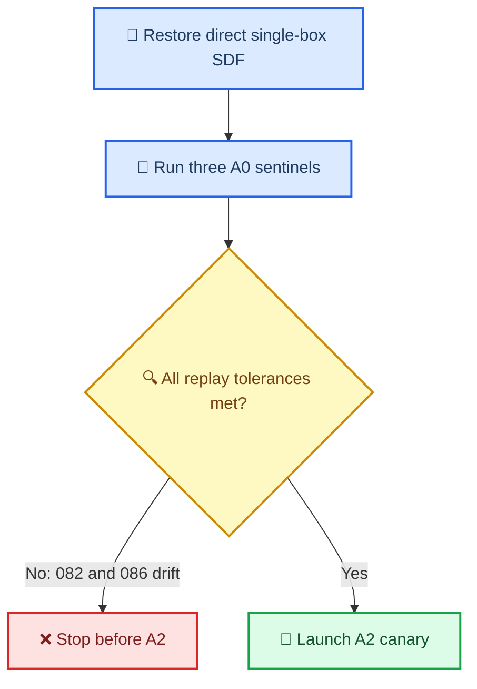

# E192 结果：单 box SDF 回退后 A0 sentinel 仍存在基线漂移

_Core4D · Phase 55 · 2026-08-09 · 计划 [plan218](../plan/218_E192_gate_threshold_size_dependence_plan.md)_

---

## 📋 判决

本轮将单一 MuJoCo box 的 reward 与 terminal carry gate SDF 恢复为历史
`_geom_box_sdf_min`，同时保留复合 box proxy 与非 box 的 cached-distance
路径。三条 A0 sentinel 均以 `1024 samples × 32 iterations × seed 0` 完成，
资源为本地 GPU0、远端 A100 GPU4/GPU5。

判决为 `INCONCLUSIVE_BASELINE_DRIFT`：`box024_20231011_026_p1` 在连续
指标上复现，但两个 box004 sentinel 均越过计划的复现容差。因此不启动 A2
canary 或 A2 Full；本轮不能把后续差异归因于 hand-gate 阈值策略。

## 📊 复现门证据

E192 的 A0 gate 要求每条 sentinel 的 penetration/contact/leg fraction 绝对差
均不超过 `0.03`，object position/orientation 误差分别不超过 `1.0 cm` / `1.0°`，
且 hand-gate-valid 与 fallback 差均不超过 `0.05`。下表是 current minus
history；`PASS` 表示该连续指标满足相应容差。

| Case | Penetration Δ | Contact Δ | Leg Δ | Position Δ cm | Orientation Δ ° | Gate valid Δ | Fallback Δ | 判定 |
|---|---:|---:|---:|---:|---:|---:|---:|---|
| box024 `026_p1` | +0.0000 | +0.0217 | +0.0000 | −0.1024 | +0.4662 | +0.0000 | +0.0000 | 连续指标 PASS |
| box004 `082_p1` | **+0.0826** | **−0.0492** | +0.0000 | −0.9290 | **+17.3278** | +0.0055 | −0.0183 | **FAIL** |
| box004 `086_p2` | +0.0000 | −0.0256 | **+0.0822** | **+3.2618** | **−1.7750** | −0.0002 | +0.0274 | **FAIL** |

`082_p1` 还从历史 `numeric_release_pass=true` 变为当前 `false`，失败项为
`object_ori`。`086_p2` 的最终 binary release 都为 false，但 failure modes 已从
历史的 `fall/body_z/release/lower_body` 改为当前的
`fall/lower_body/root_pos/root_ori/hand_pos/hand_ori`。历史 metrics 文件没有
完整保存全部 12 个 binary gate 字段，因而不能对未保存字段宣称逐项一致；但上表
已有超过预注册容差的连续指标，足以触发 stop-loss。

## 🔧 执行与产物

| 项目 | 证据 |
|---|---|
| 单 box 分派 | `spider/simulators/mjwp.py` 的 `_uses_single_box_sdf()`；reward 和 terminal carry gate 均直接调用 `_geom_box_sdf_min` |
| 3-case manifest | `results/E192/s6_downstream/manifests/cem_baseline_sentinel_manifest.tsv` |
| 本地 A0 | `results/E192/s6_downstream/cem/baseline_sentinel/E192_box024_20231011_026_p1_A0.npz` |
| 远端回收 A0 | `results/E192/s6_downstream/cem/baseline_sentinel/E192_box004_20231003_2_{082_p1,086_p2}_A0.npz` |
| 评测表 | `results/E192/s6_downstream/eval/baseline_sentinel/e192_sentinel_comparison.tsv` |
| 评测状态 | `e192_eval_summary.json`: `evaluated=3/3`, `errors=[]`, `status=pass` |

远端的 `save_video=false` 合同没有生成 MP4；本阶段是 A0 replay gate，不将其表述为
视觉质量验证。

## 🛑 后续边界

- 不启动 A2 canary 或 A2 Full，不修改 A2 阈值、case 集或预注册 C1–C7。
- 三卡资源合同已固定为 local GPU0、A100 GPU4/GPU5；它只在未来出现可解释的
  baseline authority 后才可用于 A2。
- 若要继续 E192，下一步应先解释 `082_p1` 的 object-orientation drift 与
  `086_p2` 的 leg/tracking drift，并把复现 authority 固定在当前 runtime 后重做
  gate 决策；不得把本轮历史 A0 直接当作 A2 的对照。

## 🔬 后续只读诊断：漂移来源

历史 E172/E173 的环境记录在 `s0_environment/environment_check.json`：
Python `3.12.3`、Torch `2.8.0+cu128`，CEM 在 8×L20Y 上执行。当前 local
为 Python `3.12.13`、Torch `2.11.0+cu130`、Warp `1.12.1`、RTX 5090；
remote A100 为 Python `3.12.4`，其 Torch/Warp/MuJoCo 版本与当前 local 相同。

代码侧已排除主要候选：输入 scene/scene_act/trajectory/contact/override 的
SHA 与历史一致，单-box `_geom_box_sdf_min` AST 与 E172/E173 一致，实际配置
仍是 `legacy_box + primary + batch_groups=false`，query-tape 关闭，surface-band
仍使用历史 `symmetric_abs` 公式。因此新增 compound/cache/query-tape/
continuation 逻辑没有参与这三条 sentinel 的优化。

更强的证据来自同一 current local runtime 的重复实验：同一 GPU、seed=0、
同一 override，`64 samples × 1 iteration` 连跑两次，输出并非 bitwise identical；
qpos 最大差 `1.2821`，trace_cost 最大差 `0.6660`，且第 4 个 control tick 已
分叉。历史对 current 的大 run 也在前 0–6 tick 开始出现同类微小差异，随后在
第 6 个 CEM tick 的 gate/elite 选择处分叉放大。

因此当前最强结论是：MJWarp/CUDA 的 batched GPU rollout 存在 run-to-run
数值非确定性，旧 Torch/GPU 与当前 Torch/GPU 的差异进一步改变了数值轨迹；
CEM 的硬 gate 与 top-k elite 选择把微小差异放大成 case-level 漂移。该证据不能
支持把本轮失败归因于 hand-gate 阈值或单-box SDF。曾尝试把同一 smoke 改为
`device=cpu`，但当前 `mjwp.py` 的 CUDA graph capture 不支持 CPU（直接在
`wp.ScopedCapture` 处失败），未将其作为对照结果。
