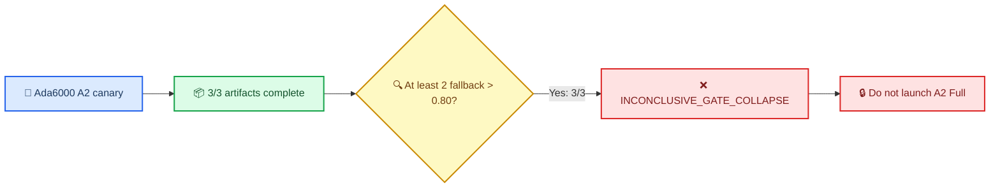

# E192 A2：Ada6000 canary 触发 gate-collapse stop-loss

_Core4D · Phase 55 · 2026-08-09 · 计划 [plan218](../plan/218_E192_gate_threshold_size_dependence_plan.md)_

---

## 📋 判决

用户要求跳过 A0 并继续 A2；随后将资源改为远程 `a6000-2gpu`（RTX 6000 Ada，GPU0/1）。A100 上已启动的 E192 canary 仅被终止了 E192 自有 session，外部任务未触碰。Ada canary 三条均完成 artifact 校验，但预注册的 canary stop-loss 被触发：三条中的三条 `cem_gate_fallback_used > 0.80`。因此本阶段判定为 **`INCONCLUSIVE_GATE_COLLAPSE`**，不启动 A2 Full，也不对 C1–C7 下正式效果结论。

## 📊 Canary evidence

| Case | Ada worker | hand-gate valid | selected valid | gate valid | gate fallback | selected min SDF (m) | floor violation (<−15 mm) |
|---|---|---:|---:|---:|---:|---:|---:|
| box024 `026_p1` | `ada-gpu0` | 0.9295 | 0.9335 | 0.0000 | **0.9496** | −0.01484 | 0.0000 |
| box024 `027_p2` | `ada-gpu1` | 0.2177 | 0.2177 | 0.1181 | **0.8306** | −0.05871 | 0.3911 |
| box004 `082_p1` | `ada-gpu0` | 0.8044 | 0.8073 | 0.1347 | **0.8073** | −0.02704 | 0.2569 |

The machine-readable stop-loss evidence is [`e192_canary_stop_loss.json`](../results/E192/s6_downstream/eval/canary/e192_canary_stop_loss.json). All three rows are `run_complete_pending_eval`; the runner validated finite `qpos`, the A2 override values, the no-gravcomp model, and all required gate diagnostic keys.

## 🔧 Execution provenance

| Item | Evidence |
|---|---|
| A0 | Skipped per user instruction; historical/corrected A0 artifacts remain unchanged |
| A2 canary manifest | `results/E192/s6_downstream/manifests/cem_canary_manifest.tsv` |
| Ada execution session | `E192_canary_ada6000_20260809_185451` on `spider-remote`, GPU0/1 |
| Pull contract | `scripts/launch/active/pull_E192_remote_Ada6000_results.sh` |
| Quantitative evaluation | `results/E192/s6_downstream/eval/canary/` (`evaluated=3/3`, `errors=0`) |
| Video | Not generated (`save_video=false`, compute-only canary) |

## 🛡️ Scope boundary

The canary stop-loss is a plumbing/health decision, not a claim that the A2 threshold policy is ineffective. The high fallback rate and selected SDF breaches make a Full comparison non-interpretable under plan218. Proceeding requires an explicit user-approved change to the canary stop-loss or a revised gate-health intervention; changing resources alone does not waive it.

