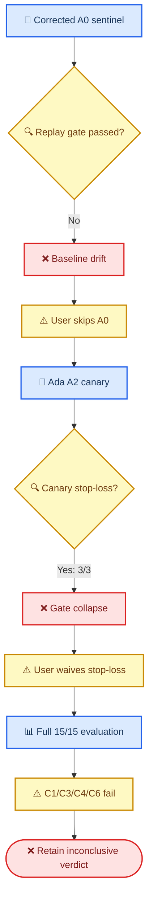

# E192 A2 Full 诊断结果：局部降穿透不足以支持阈值特异效应

_Core4D · Phase 55 · 2026-08-10 · 对应 [plan218](../plan/218_E192_gate_threshold_size_dependence_plan.md)_

---

## 📋 摘要

- A2 Full 已在本机 GPU0 与远程 RTX 6000 Ada GPU0/1 上完成 `15/15`；artifact、配置、有限值与 gate diagnostic 审计均通过
- box024 的 3 mm 穿透均值由 `0.3776` 降至 `0.3082`（`−6.94pp`），但仅 `5/9` case 改善且未达到 `≤0.20`，C1 FAIL
- signed DiD 为 `+0.0295`，10,000 次 bootstrap 95% CI `[-0.0572, 0.1172]`，不能证明 box024 特异效应，C3 FAIL
- 数值与视觉证据支持接触未靠“把手拿开”换取，C2 PASS；但 lower-body、contact 与姿态门发生回退，C4/C6 FAIL
- Full 聚合 gate health 的 C7 PASS，但 canary 预注册 stop-loss 仍为 `3/3` collapse；用户 waiver 只授权 Full 执行，最终治理判决保持 `INCONCLUSIVE_GATE_COLLAPSE`

> 📌 **决策：** 不将 A2 阈值策略升级为 production 默认。若暂时忽略 canary 治理链，Full-only 诊断模式是 `THRESHOLD_POLICY_NOT_EFFECTIVE`；这不是干净的因果 PASS/FAIL 结论。

## 🎯 实验问题与决策边界

E192 检验冻结策略包是否能对 box024 降低手物穿透，同时保留接触与跨门安全：

```yaml
cem_hand_gate_min_sdf_m: -0.010
cem_hand_gate_max_violation_pct: 0.05
cem_hand_gate_hard_floor_m: -0.015
```

本实验不拆分两个收紧参数的独立贡献，不检验尺寸因果，不叠加 E194 gravcomp，也不改变抓握目标。可允许的最大结论是 box024-specific threshold effect。

执行前存在两层治理异常：corrected A0 sentinel 为 `INCONCLUSIVE_BASELINE_DRIFT`，Ada canary 为 `INCONCLUSIVE_GATE_COLLAPSE`。用户先授权跳过 A0，后明确 waiver canary stop-loss 并要求启动 Full。因此 Full 是诊断性执行，不能恢复原预注册因果链。



## ⚙️ 实验设置与复现信息

| 项目 | 冻结值 |
|---|---|
| Case | box024×9 + box004×6 |
| 基线 | E173/E172 历史 A0 PRG rollout |
| 干预 | A2 hand-gate 策略包 |
| CEM | `1024 samples × 32 iterations`, seed 0 |
| 其余配置 | PRG on、`rubber_hull`、no-gravcomp、kp `500/50` |
| 硬件 | 本机 GPU0 + 远程 RTX 6000 Ada GPU0/1 |
| Full manifest | `results/E192/s6_downstream/manifests/cem_full_manifest.tsv` |
| 代码版本 | 启动时工作树上下文；收尾时 HEAD `4f86326` |

调度经过两次用户授权的重平衡，最终完成归属为 local `7`、Ada GPU0 `4`、Ada GPU1 `4`。Full 未使用 A100。远程最后两例为 `030_p1` 与 `083_p2`，均自然完成并通过 canonical pull 回收。

### 执行入口

```bash
# 回收远程 Full 结果
MODE=full bash workspace/core4d/scripts/launch/active/pull_E192_remote_Ada6000_results.sh

# 统一评测与 C1-C7 报告
bash workspace/core4d/scripts/eval/wrappers/eval_E192_hand_gate_arm.sh full

# 离线生成 15 条 A2 self 与 15 条 A0/A2 paired 视频
bash workspace/core4d/scripts/launch/active/run_E192_render_all.sh
```

### Artifact closure

逐行调用 E192 runner 的 `validate_runtime_outputs`，并额外核对 root NPZ 与 outdir NPZ SHA：

| 检查 | 结果 |
|---|---:|
| Manifest 状态 | `15/15 run_complete_pending_eval` |
| Root/outdir NPZ SHA 相同 | `15/15` |
| Finite `qpos` | `15/15` |
| A2 gate 参数 | `15/15` |
| PRG on / no-gravcomp | `15/15` |
| Required diagnostics | `15/15` |
| Evaluator | `15/15`, errors `0` |
| Self / paired video | `15/15` / `15/15` |

## 📊 指标与结果

所有连续指标按 case 聚合。穿透、leg penetration 与 tracking error 越低越好；contact 指标越高越好。signed DiD 定义为 `reduction(box024) − reduction(box004)`，其中 `reduction=A0−A2`。

### box024 汇总

| 指标 | A0 | A2 | Δ A2−A0 |
|---|---:|---:|---:|
| 3 mm physics penetration | 0.3776 | 0.3082 | −0.0694 |
| 3 mm in-mask contact | 0.3079 | 0.3864 | +0.0785 |
| In-mask physics contact | 0.8188 | 0.8037 | −0.0151 |
| Leg penetration | 0.0386 | 0.1050 | +0.0664 |
| Object position error (cm) | 13.6421 | 13.4520 | −0.1901 |
| Object orientation error (°) | 6.2508 | 6.2471 | −0.0038 |
| Fixed 15 mm depth | 0.0306 | 0.0162 | −0.0144 |

### box004 汇总

| 指标 | A0 | A2 | Δ A2−A0 |
|---|---:|---:|---:|
| 3 mm physics penetration | 0.1469 | 0.1070 | −0.0399 |
| 3 mm in-mask contact | 0.4507 | 0.4403 | −0.0104 |
| In-mask physics contact | 0.6944 | 0.6199 | −0.0745 |
| Leg penetration | 0.0565 | 0.0771 | +0.0206 |
| Object position error (cm) | 12.0105 | 11.5446 | −0.4659 |
| Object orientation error (°) | 11.5344 | 15.1787 | +3.6442 |
| Fixed 15 mm depth | 0.0077 | 0.0031 | −0.0046 |

### Case 级证据

| Case | Penetration Δ | A2 contact 3 mm | Leg Δ | 12-gate |
|---|---:|---:|---:|---|
| 024 `026_p1` | −0.2437 | 0.4130 | +0.3025 | FAIL→FAIL |
| 024 `026_p2` | −0.1478 | 0.4831 | +0.0000 | FAIL→FAIL |
| 024 `027_p1` | +0.0152 | 0.5851 | +0.0682 | FAIL→FAIL |
| 024 `027_p2` | +0.0000 | 0.7073 | +0.0000 | PASS→PASS |
| 024 `028_p1` | +0.0764 | 0.1500 | −0.1250 | FAIL→FAIL |
| 024 `028_p2` | +0.0296 | 0.5161 | +0.1852 | PASS→FAIL |
| 024 `030_p1` | −0.1667 | 0.2222 | +0.1667 | FAIL→FAIL |
| 024 `031_p1` | −0.1471 | 0.2157 | +0.0000 | FAIL→FAIL |
| 024 `031_p2` | −0.0405 | 0.1852 | +0.0000 | FAIL→FAIL |
| 004 `082_p1` | −0.1101 | 0.3279 | +0.0000 | FAIL→FAIL |
| 004 `082_p2` | −0.0463 | 0.5397 | +0.0278 | FAIL→FAIL |
| 004 `083_p1` | −0.1471 | 0.5873 | +0.0000 | PASS→FAIL |
| 004 `083_p2` | +0.0381 | 0.5972 | +0.0000 | FAIL→FAIL |
| 004 `086_p1` | +0.0260 | 0.2564 | +0.0000 | PASS→FAIL |
| 004 `086_p2` | +0.0000 | 0.3333 | +0.0959 | FAIL→FAIL |

### Signed DiD 与 bootstrap

box024 的平均 penetration reduction 为 `0.0694`，box004 为 `0.0399`，因此 signed DiD 为 `0.0295`。按物体内 case 重采样、seed 0、10,000 次 bootstrap 后，95% CI 为 `[-0.0572, 0.1172]`。

该区间跨过 0，且点估计低于预注册的 `0.10`。观察上 A2 对两个物体都有一定平均降穿透，不支持“box024 特异且幅度足够大”的解释。

## 🔍 C1–C7 判定

| Claim | 状态 | 主要证据 | 判读 |
|---|---|---|---|
| C1 | FAIL | box024 A2=0.3082；5/9 改善 | 未达 `≤0.20` 与 7/9 |
| C2 | PASS | contact 0.3864 / 0.8037；视觉无确认断联 | 未靠明显 hand-away 换穿透 |
| C3 | FAIL | DiD 0.0295；CI 跨 0 | 无 box024 特异效应证据 |
| C4 | FAIL | box004 4 个 PASS→FAIL；box024 max leg Δ=+0.3025 | 跨门安全回退 |
| C5 | PASS | 15/15 hand/overall/leg/posture diagnostics 完整 | 诊断覆盖闭合 |
| C6 | FAIL | fixed15 仅 4/9 改善；hard-floor violation=0 | gate 执行正确但物理一致性不足 |
| C7 | PASS | 两物体聚合 hand-valid/fallback 均过线 | 仅 Full gate health 通过 |

### C4 回退明细

box004 的 4 个 case×gate PASS→FAIL 分布在 3 个 case：

- `082_p1`: contact
- `083_p1`: root orientation、hand orientation
- `086_p1`: contact

box024 有 4 个 case 的 leg penetration 增量超过 `0.05`：`026_p1 +0.3025`、`027_p1 +0.0682`、`028_p2 +0.1852`、`030_p1 +0.1667`。

### C6 gate 内外一致性

观测上，所有 `1152` 个 non-fallback control ticks 都满足新 `−0.015 m` hard floor，最差 selected min SDF 为 `−0.01483 m`，说明 gate 本身按配置执行。

但 fixed 15 mm 物理深度只有 `4/9` box024 case 严格改善，`3/9` 不变、`2/9` 恶化。也就是说，候选层 hard floor 合规没有稳定转化为最终 rollout 的逐 case 物理改善。

### C7 Full gate health 与 canary 的关系

| Object | A2 hand-valid | A0 fallback | A2 fallback | A0+0.15 limit |
|---|---:|---:|---:|---:|
| box024 | 0.9456 | 0.1522 | 0.2987 | 0.3022 |
| box004 | 0.8954 | 0.1651 | 0.1949 | 0.3151 |

Full C7 逐物体通过，但 box024 fallback 只比上限低 `0.0034`，裕度很窄。Canary 的 `0.9496/0.8306/0.8073` 仍是有效的预注册 stop-loss 证据；Full 的较大采样预算改善了 gate 可行性，不等于 canary 被重分类为 PASS。

## 👁️ 可视化与实际观察

离线 renderer 对每个 case 生成 A2 self MP4，并把历史 A0 放左、A2 放右形成 paired MP4。四阶段图的顺序为：左上 grasp、右上 lift、左下 carry、右下 place；每个阶段内部仍是 A0 左、A2 右。


_Figure 1: `026_p1` 强制极端 case。A2 保持近侧手接触，但长箱在 lift/carry 仍明显倾斜，并出现下肢贴近。_


_Figure 2: `027_p2` 强制低端 case。A2 在 lift/carry 保持近侧接触，并在 place 阶段释放；未见明显 hand-away。_


_Figure 3: `028_p2` 是 PASS→FAIL migration。A2 保持可见手接触，但 lift/carry 的身体朝向改变更明显，对应 lower-body/root/hand orientation 回退。_


_Figure 4: `083_p1` 是 PASS→FAIL migration。A2 在 carry 更前倾并改变根部与手部方向，对应两个 orientation gate 回退。_

八条人工复核记录见 [`visual_review.tsv`](../results/E192/s6_downstream/render/keyframes/visual_review.tsv)。具体观察：

- `028_p1` 的 A2 箱体倾斜与下肢贴近更强，支持 compensation 而非纯 hand-gate 改善
- `031_p2` 的 A2 仍深蹲贴近箱体，未观察到简单的“手移开”机制
- `082_p1` 的 A2 在 lift/carry/place 更倾斜，静态帧提示接触稳定性下降
- `086_p1` 的四阶段静态帧没有定位到清晰断联瞬间；contact 数值回退保留，视觉机制标为不确定

因此 C2 的数值 PASS 被视觉复核保留，但视觉同时强化 C4 的姿态与下肢副作用结论。

## 📚 深度分析

### 观测事实

1. A2 对 box024 和 box004 都降低了平均 3 mm 穿透，差异只有 `2.95pp`
2. box024 的接触均值没有塌缩，但 case 级收益高度不均：`028_p1/028_p2/027_p1` 穿透反而上升
3. hard floor 在 non-fallback tick 上严格执行，却没有带来 7/9 的 fixed-depth 改善
4. box024 lower-body 均值上升 `6.64pp`，4 条越过预注册 case 级容差
5. Full 聚合 fallback 刚好过门，但个别 case 仍很高：`086_p2=0.7761`、`026_p1=0.6814`、`031_p2=0.6765`

### 机制推断

最符合现有证据的解释不是“阈值完全没生效”，而是“候选层 gate 生效，但优化器通过其他自由度重新分配代价”：部分 case 用 lower-body 接近、姿态改变或箱体倾斜维持任务与接触，从而削弱 hand hard-floor 对最终物理 rollout 的稳定传导。

这个解释得到三类证据共同支持：non-fallback hard floor 零违规、fixed15 case-level 不一致、C4/视觉出现姿态与下肢代偿。它仍是机制推断，不是新的受控因果实验；E192 没有单独干预 lower-body 或抓握拓扑。

### 替代解释

- 历史 A0 与当前 Full 运行时存在已确认的 GPU/CUDA 数值非确定性，可能放大 case-level migration
- A2 同时修改 max-violation 与 hard-floor，无法识别是哪一项引发 fallback 或代偿
- 单 seed、9/6 case 的 bootstrap 区间较宽，不能排除小幅真实差异
- box024 的长力臂、无 partner 支撑与 no-gravcomp 共同存在；E192 不能区分这些共线机制

## ✅ 结论与讨论

Full 数据不支持把 A2 升级为默认 hand-gate 策略。它能在均值上降低部分穿透，并保持总体接触，但收益不够强、不够一致，也不是 box024 特异；同时出现 lower-body/contact/orientation 回退。

判决必须分两层陈述：

- **Full-only 诊断：** `THRESHOLD_POLICY_NOT_EFFECTIVE`
- **正式治理判决：** `INCONCLUSIVE_GATE_COLLAPSE`

后一判决优先，因为 canary stop-loss 从未被改判，Full 是用户 waiver 后的诊断性运行。corrected A0 的 `INCONCLUSIVE_BASELINE_DRIFT` 也继续限制历史配对的因果解释。

## ⚠️ 限制与注意事项

- A0 sentinel 未复现，A0/A2 差值可能包含 runtime drift
- Canary stop-loss 被显式 waiver，不构成 PASS
- 单 seed，box024 `n=9`、box004 `n=6`
- A2 是两参数策略包，无法拆分参数贡献
- 只覆盖 box024/box004，不能推出尺寸因果或跨物体泛化
- 视觉关键帧能确认宏观接触/姿态，但不能替代逐帧接触力或法向分析
- Full 在本机与 Ada6000 混合硬件执行，artifact 合同一致但数值非确定性仍可能存在

## ✍️ 下一步

1. 不继续在同一 A2 配置上重复 seed；本轮已满足“不要重复失败”的停止条件
2. 优先执行 E193 Stage 1 的离线抓取法向对置审计，以检验 hand-gate 之外的抓握拓扑机制
3. 若未来重开阈值研究，先建立当前 runtime 的完整 A0 authority，再设计单参数、同硬件、至少多 seed 的受控实验
4. 组合 E192/E194/E193 前另写新 plan；不得把 gravcomp、阈值与抓握目标直接叠加后声称单机制归因

## 💾 结果路径与哈希

| 产物 | 路径 / SHA256 |
|---|---|
| Full manifest | `results/E192/s6_downstream/manifests/cem_full_manifest.tsv` · `6ee5298c...e1c9a4` |
| Case metrics | `results/E192/s6_downstream/eval/full/e192_case_metrics.tsv` · `7eb535b4...77863` |
| Paired deltas | `results/E192/s6_downstream/eval/full/e192_paired_deltas.tsv` · `22c17d4f...344bc` |
| Claims JSON | `results/E192/s6_downstream/eval/full/e192_claims.json` · `70df8e33...2fddf` |
| Machine report | `results/E192/s6_downstream/eval/full/E192_arm_comparison.md` |
| Render summary | `results/E192/s6_downstream/render/full/render_summary.json` · `84c31c41...5a0ae` |
| Visual review | `results/E192/s6_downstream/render/keyframes/visual_review.tsv` · `2b750cc4...1ddb` |
| Sentinel record | [log269](269_E192_corrected_box_sdf_sentinel_results.md) |
| Canary record | [log270](270_E192_A2_Ada6000_canary_stop_loss_results.md) |

## 🔧 评测实现修正

收尾时发现并修正三类只影响报告口径的问题：

- `opt_steps=0` padding 以前被当作有效最后一步，现已过滤
- C4/C6/C7 的代码实现与 plan218 文字不完全一致，现按全 12 门、7/9 fixed-depth 与逐物体 gate health 执行
- A0-history 原表只有 6 个 physics gate，现与 A2 一样通过 frozen E189 `apply_12gate_scoring` 生成完整 12 门

这些修正不改 CEM 结果、原始 qpos、A2 阈值、case 集或连续物理指标；最终 evaluator 仍为 `15/15, errors=0`。
