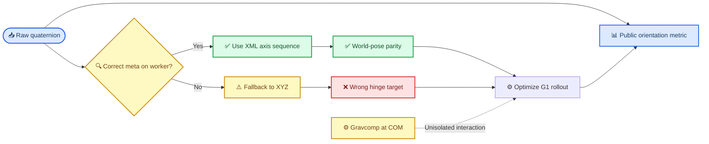

# E194 G1 object orientation 长尾诊断：Euler reference mismatch 主导回退

_Core4D · Phase 57 diagnosis · 2026-08-12 · 对应 [plan223](../plan/223_E194_G1_object_orientation_outlier_diagnosis_plan.md)_

---

## 📋 Summary

- `track_obj_ori_err_deg_mean` 是越低越好的 quaternion geodesic mean error。全 72 case 的 `G1−PRG` mean 为 `+1.570°`，但 median 为 `−0.065°`；去掉 box001 三条与 box023 四条 session cluster 后，mean 只剩 `+0.125°`。这不是整体错误率同步增加，而是少数长尾主导。
- box001 主 27 的三条指定 case 贡献净回退的 `87.23%`；去掉后 mean/median/10% trimmed mean 为 `+0.361/−0.207/+0.107°`。box023 也有相同结构：`040/042 p1/p2` 四条移除后 mean 为 `−0.00048°`；box021 原始 mean 就是 `−0.218°`。
- 七条 cluster case 正好是 wrong-target conversion error 最大的 top-7。72 case 中，runtime Euler convention 与 XML hinge axis sequence 匹配 `43` 条、错配 `29` 条；所有 `delta>5°` 的 `8/8` case 均属于错配组，conversion error 与 `G1−PRG` delta 的 Pearson 为 `0.9366`。
- 直接根因是 G1 expansion 的 reference 完整性漏洞：`scene_act_meta.json` 未被 completeness check 强制要求、Ada launcher 也未同步它；worker 缺 meta 时 `run_mjwp.py` fallback 到 `XYZ`，把 `XYZ` Euler 数值写入实际 `XZY/ZYX` hinge slots。G1 rollout 随后更接近这个错误内部 target，而不是 raw quaternion authority。
- object `gravcomp=1` 在质心施加 `49.05 N` 向上补偿力，对质心的直接 torque 为 `0`。当前证据不支持“G 在偏心作用点直接把物体拧转”；gravcomp 是否会放大对错误 target 的跟随，必须在 reference parity 修复后受控复跑。

## 🎯 1. Experiment motivation

E194 G1 在 box001 的 object z/3D tracking 与 penetration 指标上明显改善，但 object orientation mean 回退。用户指出以下三条 box001 case 的 orientation error 增加超过 `18°`，且 G1 error 超过 PRG 的三倍：

- `box001_20231003_2_041_p1`
- `box001_20231020_014_p2`
- `box001_20231020_014_p1`

本诊断回答三个决策问题：

1. 回退是整体分布平移，还是个别 case/session 长尾；
2. box023、box021 是否存在相同模式；
3. 长尾是否来自 G1/gravcomp 的物理作用方式，还是 reference/evaluation pipeline 的其他因素。

单一主假设 H1 为：G1 runtime 的 **Euler convention mismatch** 生成错误 world-orientation target；错误严重度由每条 raw quaternion 轨迹中的复合旋转决定。

## ⚙️ 2. Experiment setup

| 项目 | 设置 |
|---|---|
| 数据范围 | E194 G1 expansion，box001/box023/box021 = `28/16/28`，共 `72` case |
| 对照 | 同 case E173 PRG rollout |
| 主口径 | 全 72；box001 同时报 all-28 与排除 `box001_20231023_110_p1` 的 primary-27 |
| 公共 reference | `trajectory_kinematic.npz` 中 raw freejoint world position + quaternion |
| Runtime authority | 每条 E194 G1 Full stdout 实际打印的 quaternion→Euler convention |
| Scene authority | compiled MuJoCo model 中 object 三个 hinge 的 axis sequence |
| 代码版本 | git `dce760e`，branch `experiment/E161-surface-release-ablation` |

本轮不训练、不重跑 CEM、不修改 XML/NPZ/人工标签。新增分析仅对冻结结果做 case-level、逐帧和 MuJoCo FK replay。

## 🔧 3. Core algorithm or method

本轮没有新训练算法，诊断由四层证据组成：

1. **稳健统计**：计算 mean、median、10% trimmed mean、去 top-k 后 mean、正负 case 数与长尾净贡献。
2. **公共指标复现**：逐帧计算 `abs(dot(q_run,q_ref))` 对应的 sign-invariant quaternion geodesic angle，再跨帧取 mean。
3. **Reference replay**：从 G1 Full log 读取实际 runtime convention；从 compiled XML 读取 hinge axis sequence；分别将 raw quaternion 转成 runtime Euler target 和 axis-correct Euler target，再用 MuJoCo FK 恢复 world quaternion。
4. **逐帧与可视化**：定位持续 `delta>5°` 的首次时刻，检查 carry peak、hand-object contact、相对手轨迹和同时间 PRG/G1 帧。

Reference conversion 的关键闭环是：

- G1 public orientation metric 重算最大偏差 `2.10e-12°`；
- axis-correct target 对 raw quaternion 的最大 world error `2.96e-6°`；
- direct-world-quaternion full-substep 敏感性在 `72/72` case 上保持与公共 evaluator 相同的 delta 符号。

因此 quaternion `q/−q`、只取第 0 substep、错帧和 Euler replay 自身精度都不是长尾来源。

## 📊 4. Metrics

| 指标 | 方向 | 单位 | 聚合 | 用途 |
|---|---|---|---|---|
| Object orientation error | 越低越好 | degree | per-frame geodesic mean | 主诊断指标 |
| `G1−PRG` orientation delta | 越低越好 | degree | paired case | 版本回退量 |
| Runtime target vs raw | 越低越好 | degree | per-frame mean | Reference conversion 污染 |
| G1 vs runtime target | 越低越好 | degree | per-frame mean | Rollout 是否跟随内部 target |
| Contact fraction | 越高越好 | fraction | frame fraction | 下游行为诊断，不作根因证明 |

`delta>5°` 用于识别实质性长尾；`delta>18°` 与 `G1/PRG>3×` 用于复现用户指定的强异常口径。

## 🔍 5. Results

### Distribution is long-tail dominated

| Scope | n | Mean Δ | Median Δ | 去指定 cluster 后 mean Δ |
|---|---:|---:|---:|---:|
| All objects | 72 | +1.570° | −0.065° | +0.125°（去 7 条） |
| box001 primary | 27 | +2.516° | −0.123° | +0.361°（去 3 条） |
| box023 | 16 | +2.855° | +0.223° | −0.00048°（去 4 条） |
| box021 | 28 | −0.218° | −0.065° | 无长尾 cluster |

box001 primary-27 的三条 focal delta 总和为 `59.247°`，占该组净 delta sum 的 `87.23%`。去掉三条后的 10% trimmed mean 为 `+0.107°`，与用户“约 `+0.29°`、可接受”的定性判断一致；冻结数据上普通 mean 的精确复现值是 `+0.361°`，口径差异不能混写。

全 72 为 `33` 条正 delta、`39` 条负 delta；若是整体 shift，应同时看到正值占多数和 median 明显为正，实际均未发生。

### Other cases with the same pattern

所有 `delta>5°` case 如下：

| Case | PRG | G1 | G1−PRG | G1/PRG |
|---|---:|---:|---:|---:|
| `box001_20231003_2_041_p1` | 7.646° | 29.522° | +21.876° | 3.86× |
| `box001_20231020_014_p2` | 6.299° | 25.397° | +19.098° | 4.03× |
| `box001_20231020_014_p1` | 7.048° | 25.321° | +18.273° | 3.59× |
| `box023_20231020_042_p1` | 4.635° | 19.699° | +15.064° | 4.25× |
| `box023_20231020_042_p2` | 5.317° | 18.674° | +13.357° | 3.51× |
| `box023_20231020_040_p1` | 6.013° | 14.970° | +8.957° | 2.49× |
| `box023_20231020_040_p2` | 5.373° | 13.677° | +8.304° | 2.55× |
| `box001_20231023_110_p1` | 5.451° | 11.006° | +5.555° | 2.02× |

最后一条是先前明确排除的 box001 case，不属于 primary-27，但它仍是同一种 `XYZ`→`XZY` mismatch。因此跨全部 72 个 case，`delta>5°` 的 `8/8` 都属于同一 reference mismatch family；其中最重的前七条构成本报告的 cluster7。

box023 的 `040` 与 `042` 各自 p1/p2 同时异常，且四条移除后 object mean 变为 `−0.00048°`，比“零附近”更强地支持 session cluster。box021 的 `28/28` case runtime convention 全部与 XML axes 匹配，没有同类长尾。

### Reference conversion closes the root cause

| Group | n | Mean Δ | Median Δ | Δ>5° |
|---|---:|---:|---:|---:|
| Convention match | 43 | −0.338° | −0.480° | 0 |
| Convention mismatch | 29 | +4.399° | +1.726° | 8 |
| Mismatch 去 cluster7 | 22 | +1.030° | +0.348° | 1 |
| Cluster7 | 7 | +14.990° | +15.064° | 7 |

Runtime convention 分布是 `XYZ=30、XZY=20、ZYX=22`。按物体分解后：

| Object | Match / mismatch | Match mean Δ | Mismatch mean Δ | Δ>5° |
|---|---:|---:|---:|---:|
| box001 | 7 / 21 | −1.138° | +3.878° | 4 |
| box023 | 8 / 8 | −0.058° | +5.768° | 4 |
| box021 | 28 / 0 | −0.218° | 不适用 | 0 |

wrong-target conversion error 与 public `G1−PRG` delta 的 Pearson 为 `0.9366`。七条长尾同时是 conversion error 最大的 top-7：

| Case | Runtime / XML | Wrong target error | G1→wrong target | Worker |
|---|---|---:|---:|---|
| `box001_20231003_2_041_p1` | XYZ / XZY | 30.298° | 8.280° | Ada GPU0 |
| `box001_20231020_014_p2` | XYZ / XZY | 26.827° | 4.656° | Ada GPU1 |
| `box001_20231020_014_p1` | XYZ / XZY | 27.321° | 5.551° | Ada GPU0 |
| `box023_20231020_042_p1` | XYZ / XZY | 19.658° | 7.311° | Ada GPU0 |
| `box023_20231020_042_p2` | XYZ / XZY | 19.305° | 6.803° | Ada GPU1 |
| `box023_20231020_040_p1` | XYZ / XZY | 14.853° | 6.526° | Ada GPU0 |
| `box023_20231020_040_p2` | XYZ / XZY | 14.458° | 5.005° | Ada GPU1 |

G1 rollout 相对错误内部 target 只有约 `4.66–8.28°`，但相对 raw authority 达 `13.68–29.52°`。这说明 rollout 不是随机旋转，而是在系统性跟随错误 reference。

Worker 分布也与同步漏洞一致：

| Worker | Cases | Mismatch | All mean Δ | Mismatch mean Δ |
|---|---:|---:|---:|---:|
| Ada GPU0 | 18 | 11 | +4.007° | +6.416° |
| Ada GPU1 | 18 | 11 | +2.853° | +5.076° |
| Local GPU0 | 36 | 7 | −0.290° | +0.167° |

### The three focal cases are persistent failures

| Case | 持续 Δ>5° onset | Peak frame Δ | Raw contact PRG→G1 | Hand local shift L/R |
|---|---|---:|---:|---:|
| `041_p1` | 2.317 s，lift | 60.23° | 0.745→0.713 | 7.0 / 23.4 cm |
| `014_p1` | 1.150 s，grasp 末 | 38.55° | 0.600→0.322 | 35.0 / 35.0 cm |
| `014_p2` | 1.283 s，lift | 42.01° | 0.538→0.333 | 9.6 / 17.4 cm |

三条在 carry 阶段的 mean delta 分别为 `+52.27/+30.62/+36.61°`，不是末帧尖峰。实际抽帧观察显示：

- `041_p1` 的 G1 物体在 lift 后出现多轴倾斜，并持续到 carry/place；
- `014_p1/p2` 的 G1 在 lift/carry 中有明显前倾，PRG 同时间物体更接近固定 reference；
- `014_p1/p2` 在 onset 附近均出现 PRG 有接触、G1 无接触；`041_p1` 则仍有单手接触但右手作用位置明显改变。

这些 contact/hand 分叉是错误 target 下的真实 rollout 响应，不是评测伪影；但它们不是独立的 gravcomp 根因证明。反例 `box023_20231020_040_p2` 的 raw contact 反而 `+0.129`，orientation 仍回退 `+8.304°`，因此不能把现象简化为“接触减少导致旋转”。

### Why these sessions are especially severe

已测量事实是这些 case 的 wrong-target world error 最大。其解释是：Euler rotations 不可交换，`XYZ` 数值写入 `XZY` hinge chain 时，单轴或小角度段可能误差较小，包含多轴复合旋转的 session 会产生很大的 world-pose 偏差。`014 p1/p2` 跨 `omnirt_v1/v2` 都异常，box023 的异常也按 `040/042` source session 成对出现，说明严重度更接近 source motion 的旋转轨迹，而不是某个 OmniRetarget variant 的普遍失效。

### How the expansion introduced the mismatch

代码审计发现两个完整性漏洞和一个显式 fallback：

1. `build_g1_expansion_manifest.py::restore_e173_missing()` 虽把 `scene_act_meta.json` 列为 primary artifact，但 `runtime_complete` 只检查 `scene.xml + trajectory_kinematic.npz`；meta 缺失仍被判 complete。
2. `run_E194_G1_expansion_remote_Ada6000.sh` 的 rsync file allowlist 同步 scene、trajectory、contact、override 和 sidecar，却没有同步同目录 `scene_act_meta.json`。
3. `examples/run_mjwp.py` 在 runtime meta 不存在时显式 fallback 为 `XYZ`。

当前本地 72 task 中仍有 `13` 个缺 meta；更关键的是每次 G1 Full log 直接记录了当时 worker 实际 convention，因此本报告不拿“当前文件是否存在”反推历史 runtime。

### Relationship to G1 gravcomp

| 已审物理项 | PRG | G1 | 结论 |
|---|---:|---:|---|
| Object `gravcomp` | 0 | 1 | 72/72 compiled model 唯一物理差异 |
| Object mass | 5 kg | 5 kg | 不变 |
| Compensation force | 0 | 49.05 N | G1 在 object COM 向上补偿 |
| Direct torque about COM | 0 | 0 N·m | 无偏心力矩 |
| Rotation actuator gain | 50 | 50 | 不变 |
| Object rotation reward scale | 0.3 | 0.3 | 不变，soft bounded term |
| Carry rotation hard gate | disabled | disabled | 不变 |

因此：

- **已排除**：G 在某个偏心作用点直接产生旋转 torque；
- **已证实**：G1 expansion 的部分 rollout 使用了错误 orientation target；
- **可能但未隔离**：gravcomp 去除承重后，系统可能更容易跟随错误 servo target；
- **不能从当前数据回答**：在 reference 完全一致时，gravcomp 单独会让 orientation 改善、持平还是回退。

### 6. How to read the tables and evidence

所有 orientation delta 都定义为 `G1−PRG`，所以负值为改善、正值为回退。“Wrong target error”是 runtime Euler target 经 MuJoCo FK 后与 raw quaternion authority 的 world-angle 差；“G1→wrong target”越小，表示 rollout 越贴近内部错误 target。Contact 只作为行为共变项，不作为 reference mismatch 的判定条件。

## 💡 7. Interpretation

下图将已证实的数据路径与未隔离的 gravcomp 交互分开：



证据等级如下：

| 等级 | 结论 | Evidence |
|---|---|---|
| Measured | 长尾由少数 session cluster 主导 | Robust/case/session TSV |
| Measured | 29 case runtime convention 与 XML axes 不一致 | Full log + compiled model |
| Measured | 错误 target error 与 public delta 强相关 | Pearson `0.9366` |
| Measured | G1 rollout 更接近错误内部 target | 72-case MuJoCo replay |
| Inferred | 复合旋转越强，错误 Euler 顺序越致命 | Top-7 trajectory-conditioned error |
| Unresolved | Gravcomp 是否放大错误 target 跟随 | 缺 same-reference controlled rerun |
| Unresolved | E173 PRG 当时使用的 runtime convention | E173 Full stdout 已缺失 |

PRG 的 `config_act.yaml::euler_convention=XYZ` 只是默认配置字段；实际 conversion 在 `setup_env()` 前读取邻接 meta，因此该字段不能替代缺失的 E173 Full stdout。即便 PRG runtime convention 最终也被证明相同，当前结论仍成立：G1 的绝对 orientation 长尾是对错误 internal target 的跟随；但 PRG→G1 的“gravcomp 独立因果效应”仍然需要受控复跑。

## ✅ 8. Conclusion and discussion

最终判定：`REFERENCE_PIPELINE_CONTAMINATED`。

H1 得到强支持：G1 orientation mean 回退不是整体退化，而是 reference convention mismatch 在少数多轴旋转 session 上形成的长尾。box001 三条指定 case 不是孤立现象；box023 `040/042` 是同类复现，已排除的 box001 `110_p1` 是较弱的第八条。box021 没有同类异常，恰好对应其 `28/28` convention parity。

因此不应继续把 E194 原始 object orientation 回退归因于“gravcomp 改变接触拓扑”或“G 在作用点施加旋转力矩”。接触与手轨迹确实分叉，但它们是错误 target 下的下游行为。当前 G1 对 z/3D 的收益仍是已测量事实；orientation 维度必须在 reference 修复重跑后重新评价，原 72-case orientation 对比不再具备单变量 gravcomp 解释资格。

Claims 验证：

| Claim | Verdict | 证据 |
|---|---|---|
| C1 box001 是否由少数 case 主导 | PASS | top3 占 primary-27 净回退 `87.23%` |
| C2 其他物体是否同类 | PASS | box023 有 pair4；box021 无 cluster |
| C3 是否评测伪影 | PASS | public/full-substep/FK replay 全闭合 |
| C4 与 G 的机制边界 | PASS | COM force、零直接 torque；残余交互标为 unresolved |

## ⚠️ 9. Limitations and caveats

- E173 PRG Full stdout 已不在本机/远端现存 evidence 中，无法直接证明 PRG 当时读取了哪个 convention。
- 本轮没有 corrected-meta G1 rerun，因此不能估计修复后的 orientation delta，也不能识别 gravcomp 与正确 reference 的独立交互。
- Pearson `0.9366`、match/mismatch 分组和 target-following replay 构成强机制证据，但不是替代受控 intervention 的最终因果估计。
- 逐帧深诊断覆盖 16 个代表 case，focal 可视化覆盖用户三条；case-level reference audit 与 public metric 则覆盖完整 `72/72`。
- 物体近似对称可能让某些视觉姿态差异不等于任务语义失败，但本轮使用的是既有 raw quaternion authority 与公共 metric，不修改对称性定义。

## ✍️ 10. Next steps

1. 修复 `restore_e173_missing()`：runtime completeness 必须要求 `scene_act_meta.json`，并校验 meta convention 与 compiled object hinge axis sequence 一致。
2. 修复 Ada rsync input set：同步每个 task 的 `scene_act_meta.json`，在远端启动前 fail-close 检查其 SHA 与 convention。
3. 在 `run_mjwp.py` 的生产入口移除静默 `XYZ` fallback，或至少将 fallback 设为 hard error；增加 raw quaternion→scene hinge→world quaternion parity preflight。
4. 先用修复后的 convention 重跑 cluster7 与 convention-matched controls，确认错误 target 消失；随后重跑全部 29 个 mismatch case，重新生成 PRG/G1 workbook 和 E194 promotion 结论。
5. 受控复跑必须保持 scene、raw trajectory、reward、seed、CEM budget 与 worker profile 不变，只修复 reference convention；这样才能估计 gravcomp 的独立 orientation effect。

### Reproducibility notes

```bash
.venv/bin/python -m py_compile \
  workspace/core4d/scripts/eval/reports/analyze_E194_G1_object_orientation_outliers.py \
  workspace/core4d/scripts/eval/reports/e194_orientation_reference_conversion.py \
  workspace/core4d/scripts/eval/reports/test_e194_orientation_reference_conversion.py

.venv/bin/python \
  workspace/core4d/scripts/eval/reports/test_e194_orientation_reference_conversion.py

.venv/bin/python \
  workspace/core4d/scripts/eval/reports/analyze_E194_G1_object_orientation_outliers.py \
  --eval-root workspace/core4d/results/E194/s6_downstream/eval/full_g1_expansion
```

结果路径：

| Artifact | Rows | SHA256 |
|---|---:|---|
| `e194_g1_object_orientation_outlier_cases.tsv` | 72 | `63e336ed…a92ae` |
| `e194_g1_object_orientation_robust_summary.tsv` | 9 | `e0c590a6…b9a7` |
| `e194_g1_object_orientation_frame_diagnostics.tsv` | 16 | `28cfa0e2…c40` |
| `e194_g1_object_orientation_reference_conversion_audit.tsv` | 72 | `12c12d3a…307` |
| `e194_g1_object_orientation_reference_conversion_summary.tsv` | 14 | `118333d9…cd7` |
| `e194_g1_object_orientation_full_substep_sensitivity.tsv` | 72 | `26ea097f…262` |
| `e194_g1_object_orientation_outlier_summary.json` | 1 | `649486e6…9ab` |

Canonical eval directory:

`workspace/core4d/results/E194/s6_downstream/eval/full_g1_expansion/`

关键帧：

`workspace/core4d/results/E194/s6_downstream/eval/full_g1_expansion/object_orientation_outlier_visual/`

本日志不修改历史 log273–275，不修改既有 rollout。当前 worktree 含本任务之前的未提交改动，因此本轮不执行自动 commit/push。
