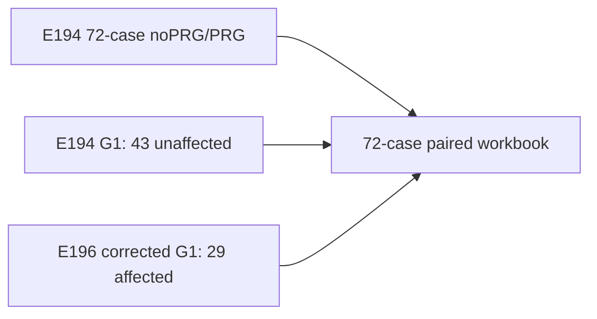

# E194 72-case corrected-G1 overlay workbook

_Core4D · Phase 57 follow-up · 2026-08-12_

## 目的

E196 的 workbook 只覆盖 29 个 Euler metadata mismatch case，不能作为 E194
完整扩展的总表。本次保留 E194 冻结的 72-case noPRG/PRG authority 和 case
universe，只把受影响的 29 条 G1 行替换为 E196 `G1_corrected`；其余 43 条
沿用 E194 Full G1。E194 原始 TSV 不被覆盖。

## 结果

| 项目 | 结果 |
|---|---:|
| noPRG arm rows | 72 |
| PRG arm rows | 72 |
| G1 arm rows | 72 |
| E196 corrected G1 overlay | 29 |
| paired comparisons | 144 |
| gate migrations | 1,728 |
| workbook formulas | 11,512 |
| formula errors | 0 |

方向感知渐变色保持与原 E194 workbook 一致：误差类指标 `↓ better`，接触率类
指标 `↑ better`。示例的完整 72-case `PRG→G1` 结果为：object z MAE 平均
delta `−1.2928 cm`，object 3D position 平均 delta `−1.3984 cm`，object
orientation 平均 delta `−0.4920°`，3mm contact fraction 平均 delta `+0.0149`。

## 产物与复现

- Workbook：`workspace/core4d/results/E194/s6_downstream/eval/full_g1_expansion/E194_noPRG_PRG_G1_comparison.xlsx`
- Overlay manifest：`workspace/core4d/results/E194/s6_downstream/eval/full_g1_expansion/e194_corrected_g1_overlay_manifest.json`
- Builder：`workspace/core4d/scripts/eval/reports/build_E194_corrected_overlay_workbook.py`
- Rebuild command：
  `.venv/bin/python workspace/core4d/scripts/eval/reports/build_E194_corrected_overlay_workbook.py`
- Recalculation：
  `python /home/ubuntu/.codex/skills/xlsx/scripts/recalc.py <workbook> 120`

该 overlay 只更新 E194 的展示 workbook，不改变 E194/E196 的原始评测 authority。
