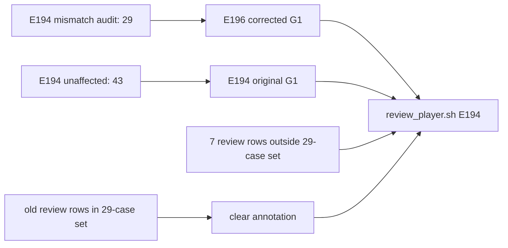

# E194 review player：29-case corrected G1 overlay

_Core4D · Phase 57 follow-up · 2026-08-12_

## 变更范围

`review_player.sh E194` 现在使用 72-case G1 review index：

- 29 个 Euler reference mismatch case：切换到 E196 `G1_corrected` metrics、scene、outdir 和 MP4；
- 43 个 unaffected case：继续使用 E194 原始 G1 metrics、scene、outdir 和 MP4；
- E194 原有 `user_manual_review_filled.tsv` 中属于这 29 个 case 的旧人审结果全部清空；
- 其余 case 的人审结果不变。

## 审计结果

| 检查 | 结果 |
|---|---:|
| Euler mismatch case set | 29 |
| Corrected MP4 missing | 0 |
| E194 player records | 72 |
| Corrected overlay records | 29 |
| Unaffected E194 records | 43 |
| Corrected records already reviewed | 0 |
| Preserved review rows | 7 |
| `review_player.sh E194 --check` | PASS; 72/72 playable |

被保留的人审 case 为：
`box001_20231003_1_039_p2`、`box001_20231003_1_041_p2`、
`box001_20231003_1_043_p2`、`box001_20231003_2_038_p2`、
`box001_20231020_011_p2`、`box001_20231023_107_p1`、
`box001_20231023_109_p1`。

## 产物

- Wrapper：`workspace/core4d/scripts/eval/wrappers/review_player.sh`
- Index：`workspace/core4d/scripts/eval/review/review_index.py`
- Review source：`workspace/core4d/results/E194/s6_downstream/eval/full_g1_expansion/user_manual_review_filled.tsv`
- Euler case authority：`e194_g1_object_orientation_reference_conversion_audit.tsv`

Review source SHA256：`e15c8f2795e1f83d9f3839f4e8ec3f65de407e13e6eaadc322fd3b1432c62271`。
