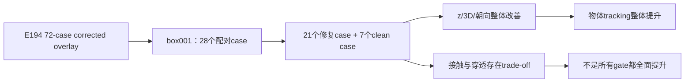

# E194 box001：修复 Euler bug 后 G1 与 PRG 的专项比较

_Core4D · Phase 57 follow-up · 2026-08-12 · box001 28-case 配对分析_

## 摘要

- 本分析基于完整 E194 72-case corrected overlay workbook，单独抽取 box001 的
  28 个同 case 配对。其中 21 个是 E196 重跑的 Euler mismatch case，7 个是
  原 E194 中 convention-match、未重跑的 G1 case。
- 修复后的 G1 相比 PRG，物体 z MAE 从 `4.8456` 降至 `3.2332 cm`，改善
  `1.6124 cm`；物体 3D 位置误差从 `11.2572` 降至 `9.6452 cm`，改善
  `1.6121 cm`；物体朝向误差从 `5.9269°` 降至 `5.0070°`，改善 `0.9199°`。
- 这不是少数 case 拉动的结果：z MAE 在 `28/28` 个 case 改善；3D position 和
  orientation 各有 `23/28` 个 case 改善。21 个修复 case 和 7 个未受影响 case
  的方向一致。
- 因此，box001 上修复后的 G1 对 PRG 的物体 tracking 优势具有整体性；但不能
  宣称所有物理和手部 gate 全面提升。3mm contact 增加，手物/腿穿透下降，raw
  contact 基本持平且略降，仍有局部 gate trade-off。

## 1. 实验问题与数据口径

### 1.1 研究问题

修复 29 个 Euler reference metadata bug 后，G1 相比 PRG 在 box001 上的优势
是否仍然存在？如果存在，它是整体 case 分布的稳定趋势，还是由少数异常 case
贡献出来的？

### 1.2 case 组成

| 子集 | 数量 | G1 数据来源 | 含义 |
|---|---:|---|---|
| Euler mismatch | 21 | E196 `G1_corrected` Full | 原 E194 G1 受到错误 reference metadata 影响 |
| convention-match | 7 | E194 原始 G1 Full | reference contract 已匹配，因此未重跑 |
| 合计 | 28 | corrected overlay | box001 完整比较集合 |

PRG 使用 E194 冻结 authority。所有结果均为同 case 配对比较，没有新启动
CEM；评测标准为公共 `core4d-e154-physics-contact-v1`。

## 2. 指标定义与方向

所有 delta 均定义为 `G1 − PRG`。

| 指标 | 趋势方向 | 解释 |
|---|---|---|
| Object z MAE | 越低越好 | 物体竖直方向 tracking 误差 |
| Object 3D position MAE | 越低越好 | 物体三维平移误差 |
| Object orientation error | 越低越好 | 物体朝向 tracking 误差 |
| 3mm contact fraction | 越高越好 | mask 内干净近接触/接触比例 |
| Raw contact fraction | 越高越好，但不能单独判断 | 总接触比例，可能混入深穿透接触 |
| Hand penetration fraction | 越低越好 | 手物穿透比例 |
| Leg penetration fraction | 越低越好 | 腿部穿透比例 |

因此，误差/穿透类指标的负 delta 是改善，contact 类指标的正 delta 是改善。

## 3. box001 总体结果

| 指标 | PRG 均值 | 修复后 G1 均值 | Delta（G1−PRG） | 判断 |
|---|---:|---:|---:|---|
| Object z MAE (cm) | 4.8456 | 3.2332 | **−1.6124** | 改善 |
| Object 3D position MAE (cm) | 11.2572 | 9.6452 | **−1.6121** | 改善 |
| Object orientation error (°) | 5.9269 | 5.0070 | **−0.9199** | 改善 |
| 3mm contact fraction | 0.4877 | 0.5399 | **+0.0523** | 改善 |
| Raw contact fraction | 0.7886 | 0.7841 | −0.0045 | 基本持平、略降 |
| Hand penetration fraction | 0.2120 | 0.1777 | **−0.0343** | 改善 |
| Leg penetration fraction | 0.0731 | 0.0213 | **−0.0519** | 改善 |

最核心的结果是：物体 z、3D position、orientation 同时改善，且 3D position
的改善量几乎与 z MAE 相同（`−1.6121` vs `−1.6124 cm`）。这说明 box001 的
主要收益集中在物体竖直控制和整体物体 tracking，而不是某个不明确的单一 XY
偏移。

## 4. 是否由少数 case 驱动？

### 4.1 case 级方向一致性

| 指标 | 全部 28 | 修复的 21 个 mismatch | 未受影响的 7 个 clean |
|---|---:|---:|---:|
| z MAE 改善 | **28/28** | **21/21** | **7/7** |
| 3D position 改善 | 23/28 | 16/21 | **7/7** |
| orientation 改善 | 23/28 | 16/21 | **7/7** |
| 3mm contact 改善 | 19/28 | 15/21 | 4/7 |
| Hand penetration 改善 | 18/28 | 14/21 | 4/7 |
| Leg penetration 改善 | 11/28 | 7/21 | 4/7 |

结论很明确：z MAE 并非被少数极端 case 拉低，而是 28 个 case 全部改善。
3D position 和 orientation 的均值改善也不是单一长尾造成的，因为 7 个
clean case 同样全部改善。这支持“修复 reference contract 后，G1 的物体
tracking 改善具有整体性”的判断。不过 clean 子集只有 7 个 case，证据强度
仍低于完整 28-case 统计。

### 4.2 均值与中位数是否一致

| 指标 | 中位数 delta（G1−PRG） |
|---|---:|
| Object z MAE | `−1.5766 cm` |
| Object 3D position MAE | `−1.5531 cm` |
| Object orientation error | `−0.8460°` |

均值和中位数方向一致、量级接近，因此总体结论不依赖单个极端 outlier。
z MAE 改善最大的两个 case 是 `box001_20231020_014_p1`（`−3.1464 cm`）
和 `box001_20231003_2_041_p1`（`−3.1175 cm`）；它们强化了结果，但不能
解释全部改善，因为其余 case 也整体向好。

## 5. Gate 层面的逻辑

box001 strict 12-gate 通过数从 PRG 的 `5/28` 上升到修复后 G1 的 `9/28`，
净增加 4 个 case：

| 迁移 | 数量 |
|---|---:|
| PASS→PASS | 2 |
| FAIL→PASS | 7 |
| PASS→FAIL | 3 |
| FAIL→FAIL | 16 |

gate 迁移说明收益主要来自下肢与手穿透，而不是所有 gate 同时改善：

| Gate | FAIL→PASS | PASS→FAIL | 解读 |
|---|---:|---:|---|
| lower-body | 7 | 0 | 最强的安全性改善 |
| hand penetration | 4 | 2 | 净改善，但不是每个 case 都改善 |
| hand orientation | 4 | 3 | 小幅净改善并伴随 churn |
| release | 0 | 2 | 两个 case 出现释放 gate 回退 |
| root position | 2 | 2 | 通过数无净变化 |
| hand position | 2 | 2 | 通过数无净变化 |
| object position | 0 | 0 | 28 个 case 两个版本都通过 |
| object orientation | 0 | 0 | 28 个 case 两个版本都通过 |

3 个 strict PASS→FAIL case 如下：

| Case | z delta (cm) | 3D delta (cm) | 朝向 delta (°) | 3mm contact delta | 手穿透 delta |
|---|---:|---:|---:|---:|---:|
| `box001_20231003_2_038_p1` | −1.3315 | −0.5274 | −0.4149 | +0.0164 | −0.0367 |
| `box001_20231003_2_039_p1` | −0.4914 | −1.8018 | −0.7557 | +0.1587 | −0.1200 |
| `box001_20231023_107_p2` | −1.8528 | +0.2559 | +2.0756 | −0.0694 | +0.0309 |

这三个回退 case 并没有出现共同的 object tracking 崩溃：三个 case 的 z MAE
都改善，其中两个 orientation 也改善。回退主要来自 hand/release 相关 gate，
说明后续应优先看抓握时序和释放阶段，而不是重新怀疑 Euler 修复本身。

## 6. 关键 insight

### Insight 1：bug 修复首先恢复了 G1 结果的可信度

21 个 mismatch row 原本使用了错误 reference-target contract。E196 替换后，
这 21 个结果才与 compiled XML 的 Euler convention 对齐。更重要的是，修复后
box001 的 7 个 clean case 也呈现相同 tracking 改善，因此合理结论不是“只要
修复 21 个异常点就会得到均值收益”，而是“在 corrected reference contract
下，G1 相比 PRG 的 object tracking 优势具有跨 case 稳定性”。

### Insight 2：收益核心是物体控制和竖直稳定性

z MAE 全部 28 个 case 改善，3D position 也显著改善；同时 leg penetration
下降 `5.19` 个百分点。这个组合更像是物体支撑/竖直控制更稳定，而不是简单
地增加接触数量。当前证据支持该机制解释，但不能仅凭这次结果把收益完全归因
于 gravcomp；G1 仍包含既定的 reward、gain 和 reference contract 组合。

### Insight 3：3mm contact 上升不等于 raw contact 上升

3mm contact 增加 `5.23` 个百分点，但 raw contact 下降仅 `0.45` 个百分点，
同时 hand penetration 下降 `3.43` 个百分点。这说明 G1 更可能把部分深穿透或
不理想接触转换为较浅、有效的近接触。只看 raw contact 会把这个变化误判为
“接触没有改善”。

### Insight 4：剩余风险集中在 hand/release，而不是 object tracking

object position/orientation gate 在 28 个 case 上均未发生迁移；strict gate 的
回退集中在 release、hand penetration、hand orientation 等局部行为。换句话说，
G1 对物体 tracking 的技术优势已经比较清楚，但距离“端到端人审全面胜出”仍有
一段距离。

## 7. 结论与决策

对 box001，修复 Euler bug 后的 corrected G1 在 28-case aggregate 上优于 PRG：

1. 物体 z MAE、3D position 和 orientation 均显著改善；
2. z MAE `28/28` case 改善，说明不是少数异常 case 驱动；
3. hand/leg penetration 改善，3mm contact 改善；
4. strict 12-gate 从 `5/28` 提升到 `9/28`。

因此可以把 corrected G1 作为 box001 的技术比较主 arm。结论边界必须保留：
raw contact 基本持平、release 有 2 个 PASS→FAIL、hand gate 仍有双向 churn，
所以暂不表述为“G1 在所有 gate 和人审维度全面优于 PRG”。29 个修复 case 的新
视频应重新做人审，不能复用旧污染结果的人审结论。

## 8. 局限与下一步

- 每个 case 只有一个 Full seed（`seed=0`），没有多 seed 统计不确定性。
- clean 分层只有 7 个 case，方向一致但样本量较小。
- E196 已做 midpoint screening，但它不能替代完整时序人审。
- 下一步：在 Viser 中重新审阅 29 个 corrected 视频；box001 中原本未受影响
  的 7 条人审结果保持不变。

## 可复现信息

- Workbook：`workspace/core4d/results/E194/s6_downstream/eval/full_g1_expansion/E194_noPRG_PRG_G1_comparison.xlsx`
- Euler mismatch authority：`e194_g1_object_orientation_reference_conversion_audit.tsv`
- Review player：`workspace/core4d/scripts/eval/wrappers/review_player.sh E194`
- 检查命令：`bash workspace/core4d/scripts/eval/wrappers/review_player.sh E194 --check`
- Workbook 重算：`11,512` 个公式，`0` 个错误。
