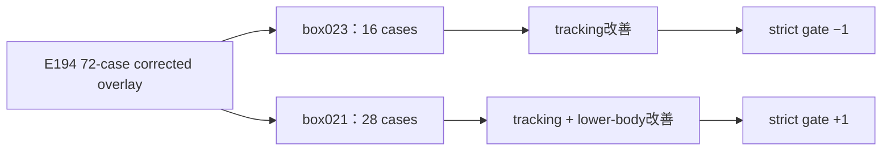

# E194 box023 / box021：修复后 G1 与 PRG 的专项比较

_Core4D · Phase 57 follow-up · 2026-08-12 · box023 16-case + box021 28-case 配对分析_

## 摘要

- 本日志沿用 E194 完整 72-case corrected overlay workbook 的口径，分别分析
  box023 和 box021；所有 delta 均为 `G1 − PRG`。
- 两个物体都显示 object z/3D tracking 的平均改善，但 gate 层面的结论不同：
  box023 的 strict 12-gate 从 `7/16` 降到 `6/16`，box021 则从 `7/28` 升到
  `8/28`。
- box023 的主要矛盾是 tracking 改善没有转化为端到端 gate 改善：raw/3mm contact
  略降，hand penetration 基本持平，且出现 2 个 PASS→FAIL。
- box021 的主要收益来自 z/3D tracking 和 lower-body penetration；但 hand
  penetration、root position、hand position 仍有回退，因此也不是全维度胜出。

## 1. 数据与分层

| 物体 | case 数 | Euler mismatch corrected | convention-match 原始 G1 |
|---|---:|---:|---:|
| box023 | 16 | 8 | 8 |
| box021 | 28 | 0 | 28 |

box023 的 8 个 mismatch case 使用 E196 corrected G1，另外 8 个 case 沿用
E194 G1。box021 的 28 个 case 全部属于 convention-match，因此没有 E196
替换。PRG authority、case universe 和公共评测标准均与前一份 box001 分析一致。

## 2. 总体指标结果

### 2.1 box023

| 指标 | PRG 均值 | G1 均值 | Delta（G1−PRG） | 判断 |
|---|---:|---:|---:|---|
| Object z MAE (cm) | 5.8169 | 5.0940 | **−0.7229** | 改善 |
| Object 3D position MAE (cm) | 13.0617 | 11.7438 | **−1.3178** | 改善 |
| Object orientation error (°) | 5.1081 | 4.8858 | **−0.2222** | 小幅改善 |
| 3mm contact fraction | 0.4727 | 0.4635 | −0.0092 | 略降 |
| Raw contact fraction | 0.7119 | 0.6950 | −0.0168 | 略降 |
| Hand penetration fraction | 0.1481 | 0.1491 | +0.0010 | 基本持平、略差 |
| Leg penetration fraction | 0.0315 | 0.0076 | **−0.0239** | 改善 |

box023 的 tracking 方向是正面的，但幅度明显小于 box001；同时 contact 和
hand penetration 没有同步改善。因此 box023 更像是“物体 tracking 有收益，
抓握物理质量没有收益”的 mixed result。

### 2.2 box021

| 指标 | PRG 均值 | G1 均值 | Delta（G1−PRG） | 判断 |
|---|---:|---:|---:|---|
| Object z MAE (cm) | 6.2368 | 4.9380 | **−1.2988** | 改善 |
| Object 3D position MAE (cm) | 15.6748 | 14.4441 | **−1.2307** | 改善 |
| Object orientation error (°) | 6.0914 | 5.8732 | **−0.2182** | 小幅改善 |
| 3mm contact fraction | 0.4258 | 0.4173 | −0.0086 | 略降 |
| Raw contact fraction | 0.6707 | 0.6860 | **+0.0153** | 改善 |
| Hand penetration fraction | 0.1760 | 0.1924 | +0.0163 | 退化 |
| Leg penetration fraction | 0.1203 | 0.0477 | **−0.0726** | 明显改善 |

box021 的主要收益来自 object tracking 和 lower-body penetration；raw contact
略有增加，但 hand penetration 反而增加。这说明“raw contact 增加”在 box021
上不能直接解释为更好的抓握质量，必须和穿透一起看。

## 3. case 级一致性：是否由少数 case 驱动？

### 3.1 box023

| 指标 | 改善 case 数 |
|---|---:|
| z MAE | 13/16 |
| 3D position | 14/16 |
| orientation | 10/16 |
| 3mm contact | 7/16 |
| Hand penetration | 9/16 |
| Leg penetration | 4/16 |

box023 的 z MAE 中位数 delta 为 `−0.7222 cm`，3D position 中位数为
`−1.0397 cm`，orientation 中位数为 `−0.3301°`，与均值方向一致。因此
tracking 的改善不是单一 outlier 驱动，但不如 box001 稳定。最明显的 z
改善是 `box023_20231020_039_p2`（`−2.2442 cm`）；同时存在两个 z 回退
case：`box023_20231008_046_p1/p2`（`+0.6631/+0.7241 cm`）。

分层后，8 个 clean case 的 3D position `8/8` 改善，z MAE `7/8` 改善；
8 个 corrected case 的 3D position `6/8`、z MAE `6/8` 改善。说明修复 case
并没有单独制造全部收益，但 box023 的 tracking 稳定性确实低于 box001。

### 3.2 box021

box021 没有 Euler mismatch 子集，28 个 case 全部是 convention-match 原始
G1。其 case 级结果为：

| 指标 | 改善 case 数 |
|---|---:|
| z MAE | 21/28 |
| 3D position | 19/28 |
| orientation | 15/28 |
| 3mm contact | 15/28 |
| Raw contact | 14/28 |
| Hand penetration | 15/28 |
| Leg penetration | 13/28 |

z MAE 中位数 delta 为 `−1.0056 cm`，3D position 中位数为 `−1.2377 cm`，
orientation 中位数为 `−0.0650°`。均值改善主要是整体趋势，但 z 的最大收益
集中在 `box021_20231011_037_p1/p2`（`−6.4041/−4.9757 cm`），需要在人审时
重点查看是否存在 case-specific 支撑变化。即使排除这两个最大收益 case，剩余
26 个 case 的 z MAE 方向仍以改善为主，说明结论不完全依赖这两个 case。

## 4. Gate 迁移与失败模式

### 4.1 box023：tracking 改善但 strict gate 下降

strict 12-gate 从 `7/16` 变为 `6/16`：

| 迁移 | 数量 |
|---|---:|
| PASS→PASS | 5 |
| FAIL→PASS | 1 |
| PASS→FAIL | 2 |
| FAIL→FAIL | 8 |

两个 PASS→FAIL case 是：

- `box023_20231008_045_p1`：z `+0.4643 cm`，但 3D `−1.7153 cm`、orientation
  `−0.2975°`、手穿透 `−0.0896`，主要损失在 contact/hand gate；
- `box023_20231020_041_p1`：z `−0.7460 cm`、3D `−0.0619 cm`、orientation
  `−0.3627°`、手穿透 `−0.0536`，同样不是 object tracking 崩溃。

box023 的 gate 迁移显示：lower-body 有 `2` 个 FAIL→PASS，没有对应 PASS→FAIL；
但 contact 有 `1` 个 PASS→FAIL，hand penetration 有 `3` 个 PASS→FAIL，
hand/root/position 也有局部 churn。结论是 object tracking 改善没有转化成整体
可用性改善，box023 需要优先检查抓握和接触阶段。

### 4.2 box021：lower-body 改善推动 strict gate 小幅上升

strict 12-gate 从 `7/28` 变为 `8/28`：

| 迁移 | 数量 |
|---|---:|
| PASS→PASS | 6 |
| FAIL→PASS | 2 |
| PASS→FAIL | 1 |
| FAIL→FAIL | 19 |

唯一的 strict PASS→FAIL 是 `box021_20231011_037_p1`：z MAE 大幅改善
`−6.4041 cm`、3D 改善 `−2.8500 cm`，但 orientation 增加 `+0.9975°`、
3mm contact 下降 `−0.1042`。这说明它是“tracking 明显改善、抓握 gate 回退”
的典型 case，而不是全面失败。

box021 的 lower-body gate 有 `8` 个 FAIL→PASS、`2` 个 PASS→FAIL，配合腿部
穿透平均下降 `7.26` 个百分点，是 strict pass 净增加的主要来源。另一方面，
hand penetration 有 `5` 个 PASS→FAIL，root position 有 `5` 个 PASS→FAIL，
说明稳定性收益和手部质量退化并存。

## 5. 对比 box001 的综合 insight

### Insight 1：三个物体的 object tracking 方向一致，但稳定性不同

| 物体 | z MAE delta | 3D position delta | orientation delta | strict pass delta |
|---|---:|---:|---:|---:|
| box001 | −1.6124 cm | −1.6121 cm | −0.9199° | +4/28 |
| box023 | −0.7229 cm | −1.3178 cm | −0.2222° | −1/16 |
| box021 | −1.2988 cm | −1.2307 cm | −0.2182° | +1/28 |

G1 相比 PRG 的 object tracking 改善不是 box001 特例；但 box001 的朝向收益
最大、case 级 z 改善最稳定。box023 的 tracking 收益最弱，box021 的 tracking
收益中等且 lower-body 安全收益最强。

### Insight 2：box023 的瓶颈是接触质量，box021 的瓶颈是手部穿透

- box023：3mm contact `−0.92 pp`、raw contact `−1.68 pp`、hand penetration
  基本持平，strict pass 反而减少。它更像“物体 tracking 变好，但手物交互没有
  被同步修好”。
- box021：raw contact `+1.53 pp`、leg penetration `−7.26 pp`，但 hand penetration
  `+1.63 pp`。它更像“支撑/下肢稳定性变好，但部分接触变成更深的手穿透”。

因此，不能用一个跨物体统一的“G1 全面提升”机制解释所有结果。

### Insight 3：Euler bug 修复不是 box021 的解释变量

box021 的 28 个 case 全部 convention-match，未发生 E196 overlay。它的改善
来自 G1 相对 PRG 的实际控制/物理差异，而不是 Euler mismatch 修复。因此：

- box023 的 8 个 corrected case 需要结合 8 个 clean case 解释；
- box021 可以作为“无 Euler bug 混杂”的 G1 vs PRG 参考物体；
- box021 的 hand penetration 回退说明，修复 reference contract 本身不能保证
  所有物理质量指标同步提升。

## 6. 结论与决策

### box023

结论为 **object tracking 改善，但端到端 gate mixed/略退化**。可以保留
corrected G1 作为技术 tracking 比较 arm，但不能据此宣称 G1 比 PRG 更适合
box023 的最终人审或 RL export。后续优先复核 2 个 PASS→FAIL case 和 8 个
corrected 视频的抓握/释放时序。

### box021

结论为 **object tracking 与 lower-body 安全性改善，strict gate 小幅改善，
但 hand penetration/root/hand position 仍有局部退化**。G1 可以作为 box021
的更强技术候选，但仍不能宣称全维度全面胜出。重点查看
`box021_20231011_037_p1/p2` 这组高 z 改善 case 以及 hand penetration 回退 case。

## 7. 局限与下一步

- 每个 case 只有一个 Full seed（`seed=0`），没有多 seed 统计不确定性。
- box023 的 mismatch/clean 分层各只有 8 个 case，分层结论需要谨慎解释。
- box021 的最大 z 改善集中在 `box021_20231011_037_p1/p2`，应进行完整时序人审。
- E196 midpoint screening 不能替代完整时序人审。
- 下一步：在 Viser 中重新审阅 box023 的 8 个 corrected 视频和 box021 重点
  case；沿用当前 review player 规则，不复用受影响 case 的旧人审结论。

## 可复现信息

- Workbook：`workspace/core4d/results/E194/s6_downstream/eval/full_g1_expansion/E194_noPRG_PRG_G1_comparison.xlsx`
- Euler mismatch authority：`e194_g1_object_orientation_reference_conversion_audit.tsv`
- Review player：`workspace/core4d/scripts/eval/wrappers/review_player.sh E194`
- 检查命令：`bash workspace/core4d/scripts/eval/wrappers/review_player.sh E194 --check`
- Workbook 重算：`11,512` 个公式，`0` 个错误。
