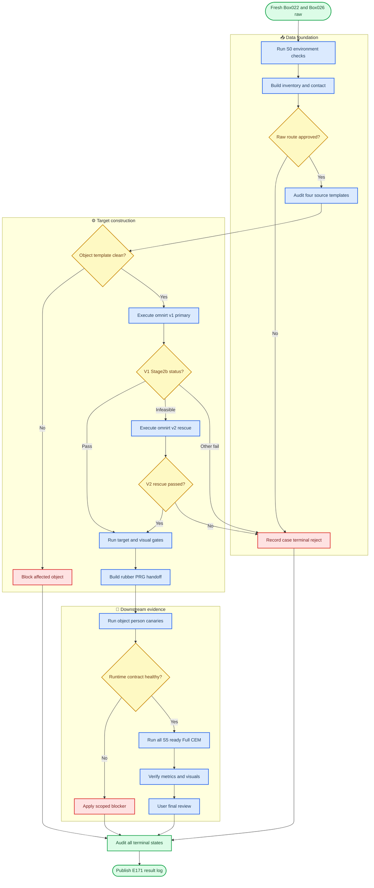

# E171 实验计划：Box022 与 Box026 全流程筛选及 Full CEM

_Core4D Phase 34 · 2026-07-20 · production screening plan_

---

## 📋 1. 决策摘要

E171 对 `Box022` 和 `Box026` 从 CORE4D raw authority 重新执行 data_construction_v3 的 `S0–S6` 主链路，并对本轮真正通过 S5 handoff gate 的全部 person-case 运行 Full CEM。实验不是旧结果搬运，也不是 reward/route sweep。

固定决策如下：

- raw 入口覆盖两种物体的完整 `60 person-case / 30 sequence` 预期集合；最终 authority 以 E171 fresh inventory 为准
- S1 同时重算 3cm/5cm raw contact；3cm 是 production 主入口，5cm-only row 进入 recall review，不自动放行
- S2 对 `box022_person1/2`、`box026_person1/2` 四个 source template 做 fresh audit 和 SHA snapshot
- S3 与 E168 一致：所有 eligible row 先跑 `omnirt_v1/ref_fk`；只有 fresh `stage2b_status=omniretarget_infeasible` 才进入 `omnirt_v2/ref_fk` rescue
- S4 运行 target gate、kinematic replay 和 visual QC；Codex 负责指标核验与视觉抽查
- S5 固定 `hand_collision_variant_id=rubber_hull`，使用 E171-scoped sidecar scene，不覆盖 source `scene_act.xml`
- S6 采用 E170 PRG 的冻结配置作为跨物体候选配置，先做条件式 canary，再对全部 S5-ready rows 做 Full CEM
- 用户负责最终人工标签和是否进入后续 RL/partner export 的拍板；E171 本轮不启动 RL，也不自动导出 partner

> ⚠️ **解释边界：** “对两种物体做全流程”表示两种物体的所有 raw rows 都必须得到可追溯的终态，不表示绕过数据 gate 强制让两种物体都产生 CEM row。若 Box022 fresh S1–S5 后为 0 ready，这是一项有效的数据层负结果。

## 🔍 2. 历史证据与边界

### 2.1 Raw inventory prior

历史 inventory 给出的预期入口如下；这些数字用于 S0 authority 漂移检查，不代替 E171 fresh inventory。

| 对象 | Person-case | Sequence | 日期 | 历史 Stage0 prior |
|---|---:|---:|---|---|
| `Box022` | 8 | 4 | `20231023` | 6 条 move 类 review，2 条 strike 非首选动作 |
| `Box026` | 52 | 26 | `20231018/20/23` | 12 pass、22 review、18 非首选动作 reject |
| 合计 | 60 | 30 | 3 个日期 | 所有 row 均须保留终态 |

E168 的 raw-contact 表未覆盖 Box022/Box026，因此不能作为 E171 S1 authority。E171 必须从 `CORE4D_Real` fresh 运行 inventory 和 raw contact。

### 2.2 E103–E106 可复用与不可复用证据

| 历史实验 | 可复用的 contract/evidence | E171 不得继承的结论 |
|---|---|---|
| E103 | 四个 Box022/026 source template 曾 clean/PASS；可作 audit 对照 | 不能用旧 audit 代替 E171 fresh template audit |
| E104 | Box022 在 3cm/5cm 均为 `8 raw_contact_fail`；Box026 两档均为 `31 pass/5 review/16 fail` | 不能把旧分布直接写成 E171 结果，也不能用 Box022 fingertip preflight 阻断 `ref_fk` |
| E106 | Box026 30 candidate 中 28 Stage2b runnable、28 Full CEM 完成、4 strict positive | 不能复用旧 trajectory/CEM 作为 E171 完成证据；旧 scene/method 与 E171 不同 |

E106 的两条历史 Stage2b infeasible row 只作为 warning prior：

- `box026_20231020_137_p2`
- `box026_20231018_043_p2`

它们不能直接跳过 v1。只有 E171 fresh v1 再次归一化为 `omniretarget_infeasible` 时才具备 v2 rescue 资格；若 E171 v1 pass，则固定使用 v1；若被 S1/S2 提前拒绝，则记录 `not_eligible_for_v2_rescue`。所有尝试必须保存 fresh solver error、输入 SHA 和 terminal state，不得复制旧 failure label。

### 2.3 Box022 fingertip 负证据的正确解释

E104 的 Box022 3cm/5cm fingertip close-contact 为 0，说明旧 `fingertip_aware`/fingertip preflight 路线没有数据支持。它不构成 `omnirt_v1/ref_fk` primary 或限定 `omnirt_v2/ref_fk` rescue 的 route blocker。

因此 E171 采用以下规则：

- fresh surface-distance raw contact 仍是 S1 case gate
- `fingertip_aware` route diagnostic 仅作为 retained warning，不参与 `ref_fk` 放行
- 如果 Box022 fresh surface-distance 仍不通过，则按 `REJECT_RAW_CONTACT` 终止对应 row
- 不允许为了让 Box022 进入 CEM 而降低阈值、切换 route 或复用旧 target

### 2.4 E170 PRG 的复用边界

E170 在 Box021 上证明 PRG 对 lower-body 指标有显著定向收益，但存在 contact trade-off，且 gate-health 为 `0/28`。因此 E171 将 PRG 定义为跨物体候选配置，而不是已验证的 Box022/026 production default。

E171 不做 P/R/G 消融，也不根据 canary 质量临时调参。所有 S5-ready rows 使用同一冻结配置，实验结束后再按对象报告是否具备跨物体可迁移性。

## 🎯 3. Scope、authority 与固定配置

### 3.1 In scope

- Box022/Box026 全量 raw inventory 与 action/inventory 筛选
- 3cm/5cm raw-contact 重算、summary、timeline 和 reject taxonomy
- 四个 clean source template 的 fresh audit、visual package 与 SHA snapshot
- `omnirt_v1/ref_fk` primary Stage2b、限定 `omnirt_v2/ref_fk` rescue 及其 terminal failures
- target gate、kinematic replay、visual QC 和 S5 handoff
- rubber-hull + E170 PRG cross-object candidate 的 canary 与 Full CEM
- 全量 metrics、分组分析、视觉抽查、用户最终人工标签准备
- S0–S6 registry、completion audit、结果日志和 tracker 更新

### 3.2 Out of scope

- `fingertip_aware`、`adaptive`、`omnirt_original`、`omnirt_v2_replace` 或任何 wrist-to-fingertip replacement
- raw-contact threshold、reward、gate、CEM budget 或 scene physics sweep
- 为增加 positive 数量而改变 action policy、target route，或对非 `omniretarget_infeasible` row 使用 v2
- RL 训练、RL-ready export、partner export 和默认配置升级
- 把 E106 或 E170 的历史结果直接计入 E171 fresh completion count

### 3.3 Authority 定义

| Authority | 唯一来源 | 必须断言 |
|---|---|---|
| Raw authority | E171 `s1_raw_contact/inventory/inventory.tsv` | object 仅 Box022/026；case_id 唯一；预期 60 person-case/30 sequence |
| S1 authority | E171 fresh 3cm/5cm manifests | 每个 raw row 在两档均有状态，不能静默缺失 |
| Stage2b authority | E171 v1 primary + v2 rescue manifests | 每个 eligible row 有 v1 终态；每个 v1 infeasible row 有 v2 终态和唯一 selected production variant |
| S5 authority | E171 registry + handoff manifest | 只含通过 template/Stage2b/target/visual gate 的 row |
| Full CEM authority | `S5_READY_SET` 的精确快照 | `full_expected = count(S5_READY_SET)`，不预先硬编码 |
| 人工 authority | E171 user review TSV | Codex 不写或覆盖 `manual_*` 字段 |

`S5_READY_SET` 定义为：

```text
inventory/action eligible
AND selected raw-contact route approved
AND template audit pass
AND selected Stage2b variant pass
AND target gate pass
AND visual QC pass
AND rubber-hull/PRG sidecar contract pass
```

### 3.4 Raw-contact promotion policy

同一 case 只选择一个 contact label，禁止 3cm/5cm 双份 target 覆盖：

1. `3cm pass`：直接进入 production Stage2b 候选
2. `3cm review`：经 raw-contact evidence review 后决定 pass/reject
3. `3cm fail + 5cm pass/review`：进入 `5cm_recall_review`，只有明确双手/目标人物接触证据时才可晋级
4. `5cm fail`：终态 `REJECT_RAW_CONTACT`
5. 已晋级 3cm 的 row 不再生成 5cm duplicate

被晋级的 5cm-only row 必须在 manifest 记录 `stage2b_contact_label=5cm`、reviewer、review notes 和 evidence path；不得隐式混入 3cm 主集合。

### 3.5 固定 retarget fallback 与 CEM 配置

| 轴 | E171 冻结值 | 说明 |
|---|---|---|
| Retarget primary | `omnirt_v1` | 所有 S3 eligible row 必须先运行 |
| Retarget rescue | `omnirt_v2` | 仅 v1 `omniretarget_infeasible` 时运行；不是 A/B sweep |
| Target route | `ref_fk` | E098 公共 contract；不读 E099–E101 作为硬门 |
| Base reward/method | `E167A_zOnlyBody` | 与 E170 PRG 基座一致 |
| Hand collision | `rubber_hull` | mesh-aware SDF；E171 sidecar |
| Lower-body physics | 16 geoms ↔ object pair | 沿用 E169/E170 P 配置 |
| Lower-body penalty | scale `2.0`、margin `0.02m` | 沿用 E169/E170 R 配置 |
| Candidate gate | min SDF `0.005m`、max violation `0.02`、hard floor `-0.005m` | fallback=`least_violation` |
| CEM budget | seed `0`、samples `1024`、opt steps `32` | canary smoke 仅把 opt steps 降为 `4` |
| Source config ID | `E170_PRG_lowerbodyPhysics_softPenalty_candidateGate` | 记录冻结来源 |
| E171 method ID | `E171_E170PRG_crossObject_candidate_r1` | 不写入 `target_variant_id` |

`omnirt_v2` 必须与 E168 使用同一 Phase4 rescue contract：

```text
enable_constraint_relaxation = true
enable_foot_z_constraint = true
foot_slide_penalty_weight = 1.0
enable_contact_preservation = true
object_penetration_tolerance_scale = 0.8
replace_wrist_with_fingertip = false
include_fingertip_centers = false
```

`omnirt_v1` 保持 E168 primary contract：上述 Phase4 flags 全关，`replace_wrist_with_fingertip=false`、`include_fingertip_centers=false`。

v1/v2 选择规则固定为：

```text
v1 pass
  -> selected_retarget_variant_id = omnirt_v1
  -> v2 not_run_not_eligible

v1 omniretarget_infeasible
  -> run omnirt_v2 rescue in an isolated path
  -> v2 pass: selected_retarget_variant_id = omnirt_v2
  -> v2 infeasible: REJECT_DUAL_OMNIRT_INFEASIBLE

v1 any other failure
  -> no v2 rescue
  -> preserve the original terminal failure
```

v1/v2 必须使用独立输出目录和 registry row，并记录 `rescue_of`/`retry_of`、solver/converter SHA、params JSON 与全部中间产物。v2 不能覆盖 v1，也不能启用 `REPLACE_WRIST_WITH_FINGERTIP=1`。除 selected retarget variant 产生的 case-specific trajectory、mask、scene 和输出路径外，Full CEM effective config 必须字段级一致。任何临时改参都必须另立实验，不能覆盖 E171。

## 📊 4. Claims

| Claim | 最低证据 |
|---|---|
| C0：raw authority 完整 | fresh inventory 覆盖预期 60 person-case/30 sequence；任何差异有 raw path/hash 解释 |
| C1：两档 raw contact 可复现 | 60 rows 均有 3cm/5cm 状态、proxy path、metrics 和 terminal route；5cm 不覆盖 3cm |
| C2：template 基础可信 | 四个 source template 均完成 MuJoCo、inertial、mass/inertia、collision、contact-site、visual 和 SHA audit |
| C3：route/variant 语义未污染 | target route 始终为 `ref_fk`；v1 primary 与 v2 rescue provenance 分离；Box022 旧 fingertip negative 只记 warning |
| C4：v1→v2 fallback 完整 | 所有 S3 eligible row 有 v1 终态；所有 fresh v1 infeasible row 有 v2 终态；非该状态的 v2 attempts 为 0 |
| C5：S3–S5 无静默缺失 | 每个 selected v1/v2 row 在 target gate、visual QC 和 handoff 均有 pass 或明确 terminal failure |
| C6：Full CEM 覆盖精确 | 每个 `S5_READY_SET` row 均有完整 Full CEM artifact 或明确 terminal runtime failure；expected/completed/failed 相等闭合 |
| C7：质量证据完整 | 每个 CEM-complete row 均有统一 metrics、gate-health、MP4、关键帧和 Codex verification |
| C8：跨物体结论可解释 | 分 Box022/Box026、person、action、date、contact label、selected retarget variant 报告 funnel、yield、failure taxonomy 和指标分布 |
| C9：历史比较不越界 | 对 E106 overlap 只作同 case 历史参考，明确 scene/method 差异，不声称严格因果 A/B |
| C10：用户 authority 独立 | Codex 只写核验列；用户完成全部 CEM-complete row 的最终 `USE/DO_NOT_USE` 拍板 |
| C11：结果可复现 | config/git/SHA、scene snapshot、registry、commands、root/outdir NPZ、metrics、video 和 audit 均在 `results/E171/` |

## 🔄 5. S0–S6 工作流



### 5.1 S0：环境、配置与 authority preflight

S0 必须保存：

- SPIDER/Holosoma repo path、git SHA、dirty diff summary
- raw root、SMPL-X path、Python/MuJoCo/ffmpeg/GPU contract
- resolved config 和 run ID
- 60-row expected identity 与 fresh inventory identity diff
- code/config/schema SHA

任何 raw root 误指、case set 漂移、公共 config 不一致或结果目录覆盖风险，在运行 S1 前作为 global blocker 处理。

### 5.2 S1：fresh inventory 与 3cm/5cm raw contact

对 `object_keys=box022,box026` 运行完整 inventory，不使用 `max-case-persons` 截断。所有 row 包含 object/date/sequence/person/action/source path/hash。

Stage0 非首选动作 reject 是合法筛选结果，但必须保存在 registry；不能从总数中消失。S1 同次 surface-distance 计算输出 3cm/5cm mask、候选、summary、timeline 和 per-sequence NPZ。

### 5.3 S2：四个 source template fresh audit

无论某个对象 S1 是否产生 pass，以下四个 template 都要完成 object-level audit：

- `box022_person1/scene.xml`
- `box022_person2/scene.xml`
- `box026_person1/scene.xml`
- `box026_person2/scene.xml`

四个文件当前均已 git tracked。E171 启动时仍需把实际文件、git HEAD 和 SHA256 保存到 `results/E171/scene_snapshot/source_templates/`。若两个人的 scene 内容相同，也保留两个 provenance row。

### 5.4 S3：v1 primary 与 v2 rescue 真执行

只对 approved raw-contact rows 执行 Stage2b。第一轮必须全部使用 `omnirt_v1/ref_fk`：

```text
convert -> OmniRetarget -> trim -> contact mask
-> target scene pose patch -> SPIDER preprocess -> scene_act -> verify
```

每行必须保存 converted、retargeted、trimmed、trajectory、contact mask、target scene、scene_act、verify summary 和 SHA。v1 manifest 必须把 CVXPY solver infeasible 精确归一化为 `stage2b_status=omniretarget_infeasible`，不能把一般 `preprocess_fail`、missing input、environment failure 或 shape mismatch 混入 rescue 队列。

v1 完成后构建确定性 rescue manifest：

- 输入只能是 v1 manifest 中 `stage2b_status=omniretarget_infeasible` 的 rows
- 若 rescue set 非空，先选一个已知 v1-pass row 运行 v2 adapter canary；该 canary 不改变 production variant，也不计入 yield
- production rescue 使用 E168 同款 `omnirt_v2/ref_fk` Phase4 参数并写入独立目录
- v2 pass row 以 `selected_retarget_variant_id=omnirt_v2` 重新进入完整 S4/S5
- v2 再次 infeasible 时标记 `REJECT_DUAL_OMNIRT_INFEASIBLE`
- v1 其他 failure 不运行 v2，只保留原始 terminal state

v1/v2 两条 registry row 必须并存。历史 E106 infeasible、文件名匹配或人工猜测都不能代替本轮 fresh v1 failure evidence。

### 5.5 S4：target gate 与 visual QC

机器 gate 分别消费 selected v1 或 rescued v2 产物，检查 target/source scene、qpos layout、object pose patch、inertial、penetration、lower-body interference 和 replay contract。v2 rescue 成功不等于自动 S4 pass。

Codex 审查策略：

- 查看所有 target-gate-pass row 的 keyframe sheet
- 完整查看所有 warning/boundary row 的 replay MP4
- 对其余 row 按 object × person × action × contact-label 分层抽查
- 发现疑似穿箱、趴箱、错误接触人、物体瞬移或爆姿时扩查完整视频

只有 visual QC `pass` 才进入 S5；Codex 结论保存在独立 verification 字段，不写用户 `manual_*`。

### 5.6 S5：rubber-hull 与 PRG sidecar handoff

先从通过 S4 的 target `scene_act.xml` 生成 rubber-hull sidecar，再添加 E169/E170 冻结的 16 个 lower-body/object collision pair。sidecar 使用 E171 专属名称，例如：

```text
scene_act_E171_rubberHull_PRG.xml
```

禁止覆盖 target 的原始 `scene_act.xml`。semantic diff 只能包含预期的 hand mesh collision 和 16 个 lower-body/object pair；object mass、friction、actuator、world、source trajectory 不得改变。

S5 保存 frozen `S5_READY_SET`、每行实际 `selected_retarget_variant_id`、v1→v2 provenance、CEM override、effective scene SHA、hand-collision audit 和 candidate/reject manifest。进入 canary 前，所有 S5-ready target 的 `scene.xml`、原始 `scene_act.xml` 和 E171 sidecar XML 必须用 `git add -f` 纳入主 git；同时复制到实验 snapshot 并记录 SHA，形成 active XML + experiment snapshot 双重保障。

### 5.7 S6：conditional canary 与 Full CEM

Canary 从 S5-ready 中确定性选择，每个存在 ready row 的 `(object, person)` 至少 1 条；若存在 v2-rescued S5-ready row，还必须至少覆盖 1 条 v2。通常最多 5 条，允许同一 row 同时满足 object/person 与 v2 覆盖。若某个分组没有 S5-ready row，记录 `NO_CANARY_NO_S5_READY`，不伪造替代 case。

Canary 只验证 runtime/scene/config/artifact contract，使用 `opt_steps=4`。Canary 数值质量差或 0 positive 不阻断 production screening；只有公共 runtime contract 不健康时才按分级方案暂停。

Canary 健康后，对 frozen `S5_READY_SET` 全部运行 production `opt_steps=32` Full CEM。Canary smoke 不能冒充 Full 结果，入选 canary 的 row 仍须完成正式 Full CEM。

## 🛡️ 6. 分级阻断与 stop-loss

### 6.1 分级阻断

| 级别 | 典型条件 | 阻断范围 | 解除条件 |
|---|---|---|---|
| Global blocker | raw authority 漂移、公共代码/config/schema SHA 不一致、路径覆盖、环境契约失败、跨物体公共 runtime 失败 | 暂停 E171 全批 | 修复公共 contract 并重跑 S0/canary |
| Object blocker | Box022 或 Box026 template audit、sidecar semantic diff、object-level scene load 失败 | 只暂停对应物体 | 对象 contract 修复并重审 |
| Case blocker | action/raw contact fail、v1 非 rescue 类失败、v1/v2 dual-infeasible、target gate fail、visual reject、单 case artifact fail | 只淘汰该 person-case | 保留 terminal evidence；其余 row 继续 |
| Warning | 旧 fingertip negative、E106 legacy failure、5cm-only、历史污染标签 | 不自动阻断 | 在 report 中保留 warning/provenance |

“任一 preflight 失败即阻断全批”不适用于 E171。全批只由 global contract 失败阻断；object/case 失败必须隔离，不能拖停健康 rows。

### 6.2 Canary stop-loss

- 同一对象两个 person canary 出现相同 scene/config/runtime signature：升级为 object blocker
- Box022/Box026 均出现相同公共 signature：升级为 global blocker
- 单 case v1 `omniretarget_infeasible`：进入 v2 rescue，不是 blocker；v2 仍 infeasible 才成为 case blocker
- 异常初始姿态、输入损坏或非 solver-infeasible 的 v1 failure：case blocker，不尝试 v2
- OOM/资源争用：降低并发或重新分 shard，不改变算法配置，不 kill 其他任务
- canary 质量差、数值 fail 或视觉不理想：不作为执行 stop-loss；继续 full 以测量真实 yield

同一失败遵循三次失败协议：第一次诊断修复，第二次更换恢复方案，第三次停止重复尝试并请求用户决策。每次失败的输入、signature、尝试和结果写入 `progress.md` 与 E171 evidence。

### 6.3 Full completeness contract

实验结束必须满足：

```text
full_expected
= full_completed
+ full_terminal_failed
```

其中每个 completed row 必须具备 root/outdir NPZ 一致、qpos finite、effective config、scene SHA、PRG diagnostics、metrics 和 video；每个 terminal failed row 必须具备 error log、failure mode 和最后一次尝试记录。目录里没有文件且 registry 没有终态属于实验未完成。

## 🔧 7. 实现与固化入口

### 7.1 计划阶段修改文件

| 文件 | 本次改动 |
|---|---|
| `plan/187_E171_box022_box026_full_pipeline_plan.md` | 新建 E171 正式计划 |
| `EXPERIMENT_TRACKER.md` | 新增 E171 Phase 34 计划入口 |
| `progress.md` | 记录 authority、历史边界和计划验收 |

### 7.2 执行前拟新增文件

| 文件 | 作用 |
|---|---|
| `scripts/experiments/E171/e171_common.py` | 路径、schema、case ID、SHA 与状态公共 contract |
| `scripts/experiments/E171/build_pipeline_authority.py` | 从 E171 S1–S5 生成 frozen authority、funnel 和 terminal state audit |
| `scripts/experiments/E171/build_omnirt_rescue_manifest.py` | 只从 fresh v1 `omniretarget_infeasible` 构建 v2 canary/rescue queue |
| `scripts/experiments/E171/run_stage2b_queue.py` | 执行 v1 primary 与 v2 rescue，保存 variant-specific 中间产物和终态 |
| `scripts/experiments/E171/build_prg_cem_manifest.py` | 生成 E171 rubber-hull/PRG sidecar、override、canary/full manifest |
| `scripts/experiments/E171/run_cem_queue.py` | 按 manifest 执行 canary/full，写 effective config 与 diagnostics |
| `scripts/experiments/E171/render_cem_results.py` | 生成 Full CEM MP4、关键帧和 review package |
| `scripts/experiments/E171/audit_completion.py` | 审计 S0–S6、Full completeness、Codex/user authority |
| `scripts/launch/active/run_E171_box022_box026_data_pipeline.sh` | fresh S0–S5 固化入口 |
| `scripts/launch/active/run_E171_remote_a100.sh` | 可配置 GPU shard 的 canary/full 远程入口 |
| `scripts/launch/active/pull_E171_remote_a100_results.sh` | manifest-scoped 严格增量回收 |
| `scripts/launch/active/watch_E171_remote_a100.sh` | 监控、增量回收和 terminal completion |
| `scripts/launch/active/postprocess_E171_after_full.sh` | strict completion 后运行 render/eval/report/audit |
| `scripts/eval/runners/eval_E171_box022_box026.py` | 直接使用 `eval.core.core_metrics` 的统一 evaluator |
| `scripts/eval/wrappers/eval_E171_box022_box026.sh` | 固化评测入口 |
| `scripts/eval/reports/gen_E171_box022_box026_report.py` | 生成精炼 Markdown 主报告和详细 TSV/JSON；XLSX 仅作附表 |
| `docs/data_construction_v3/08_retarget_variants.md` | 补齐已实现的 `omnirt_v2` Phase4 rescue 语义与限定触发规则 |

如果现有 data_construction_v3 入口已完整提供某项能力，E171 wrapper 只负责冻结参数和路径，不复制管线实现。实验特有逻辑放在 `scripts/experiments/E171/`，真实 launch/pull 放在 `scripts/launch/active/`。

### 7.3 固化执行入口

执行前先实现并 code review 下列命令；实验日志只引用这些脚本，不记录不可复现的裸命令。

```bash
bash workspace/core4d/scripts/launch/active/run_E171_box022_box026_data_pipeline.sh

MODE=canary GPU_IDS=0,1,2,3 \
  bash workspace/core4d/scripts/launch/active/run_E171_remote_a100.sh

MODE=full GPU_IDS=0,1,2,3 \
  bash workspace/core4d/scripts/launch/active/run_E171_remote_a100.sh

bash workspace/core4d/scripts/launch/active/watch_E171_remote_a100.sh
bash workspace/core4d/scripts/eval/wrappers/eval_E171_box022_box026.sh
```

GPU ID 只表示计划默认 shard；启动前必须只读检查实际占用并保存快照。GPU 不可用时等待或调整 E171 shard，不暂停、kill 或重排其他任务。

## 📈 8. Full CEM、评测与人工审查

### 8.1 Artifact 硬契约

每个 Full CEM row 必须验证：

- root NPZ 与 outdir `trajectory_mjwp_act.npz` 的 qpos shape、数值和 SHA 一致
- qpos、reward/gate diagnostics 全部 finite
- effective config 与 frozen E171 config 精确一致
- scene name、scene path、scene SHA 与 manifest 精确一致
- trajectory、contact mask、source/target scene、override 均有 SHA
- MP4 可解码、非零帧、帧数与 qpos 时间轴可解释
- case_id、object、person、contact label、selected retarget/target/hand variant 无错配
- v1 failure、v2 eligibility、`rescue_of` 和最终 selected variant 精确闭合

### 8.2 指标核验

Evaluator 直接 import `eval.core.core_metrics`，不动态加载 E106/E170 evaluator。阈值在 launch 前冻结，不允许看完结果后调阈值。

| 维度 | 核心指标 |
|---|---|
| Tracking | body-z/root、EEF、object position/rotation mean/max |
| Contact | raw-mask contact、3/5/8/10cm band、3mm release、physics contact |
| Hand safety | rubber mesh-aware penetration、deep penetration、near-band |
| Body safety | leg penetration/near-2cm、upper/body/head penetration |
| Dynamics | pelvis/fall、object floor/contact、speed/acceleration、foot slip |
| Gate health | valid/selected/fallback fraction、min SDF、violation fraction |
| Completeness | expected/completed/failed/missing、artifact contract status |

报告至少按以下维度分组：

- `Box022` vs `Box026`
- `person1` vs `person2`
- action、date、sequence
- 3cm primary vs 5cm recall
- `omnirt_v1` primary vs `omnirt_v2` rescued
- S1/S3/S4/S5 failure taxonomy
- E106 overlap vs E106 non-overlap

对 E106 overlap 只报告同 case 历史差值和方向，不做严格 paired causal claim，因为 E171 同时改变了 pipeline provenance、rubber hand scene 和 PRG method。

### 8.3 视觉抽查与用户终审

Full CEM 后 Codex：

- 查看所有 case 的关键帧 sheet
- 完整查看所有 numeric fail、gate fallback、阈值边界和 worst-case MP4
- 从剩余 numeric pass 中分层抽查 object/person/action/date/contact label
- 记录穿透、非法支撑、趴箱、fall、object kick、爆姿、接触丢失和 reference infeasible 等具体观察
- 独立填写 `codex_verification.tsv`，不包含 `manual_*` 列

随后生成供用户审核的精炼 Markdown 主报告，重点回答：

1. 60 条 raw row 最终分别停在哪一层
2. 两个对象各有多少 S5-ready、Full complete、numeric pass
3. 哪些 case 可用、不可用，具体原因是什么
4. Box026 相比 E106 的历史 funnel/yield 是否变化
5. v1 infeasible 有多少、v2 救回多少、dual-infeasible 是哪些 case
6. PRG 的 lower-body 收益是否跨物体成立，是否伴随 contact 回退

用户对所有 CEM-complete rows 给出 fresh `USE/DO_NOT_USE`。在用户完成拍板前，machine recommendation 固定为 `PENDING_USER_REVIEW`，不生成 RL-ready/partner export。

## ✅ 9. 成功标准与结果分级

### 9.1 Pipeline completion 成功标准

| 检查项 | 通过标准 |
|---|---|
| Raw coverage | 预期 60 rows 全部有 inventory 与 3cm/5cm 终态，或 authority drift 已解释并经用户确认 |
| Template coverage | 4/4 source template fresh audit + visual + SHA snapshot 完成 |
| Eligible Stage2b | 100% 有 v1 终态；每个 v1 infeasible row 100% 有 v2 终态；非 eligible v2 attempts=0 |
| S4/S5 coverage | 所有 selected v1/v2 pass row 均有 target/visual/handoff 终态 |
| Full CEM coverage | `full_expected = completed + terminal_failed`，missing=0 |
| Metrics/visual | 所有 CEM-complete row 有 metrics、video、关键帧和 Codex verification |
| User authority | 所有 CEM-complete row 有用户最终标签后才形成 final 结论 |
| Reproducibility | release checks、completion audit、SHA/scene/config contract 全 pass |

### 9.2 Scientific yield 与执行成功分离

E171 不设置“至少 N 条 positive”作为执行完成门槛。`0 positive`、甚至某个对象 `0 S5-ready`，都可能是正确的筛选结果。

| 结果类型 | 定义 | 含义 |
|---|---|---|
| `PIPELINE_INCOMPLETE` | authority、terminal state、Full 或 evidence 有缺失 | 执行失败，不能下科学结论 |
| `DATA_NEGATIVE` | 某对象 0 S5-ready，且 S0–S5 完整 | 数据/target gate 未发现可下游 row |
| `CEM_NEGATIVE` | 有 S5-ready，但 0 strict/user USE | downstream method 对该对象无产出 |
| `PARTIAL_YIELD` | 至少 1 条 user USE，但不能覆盖全部对象/分层 | 可保留 case-level positives，不升级统一默认 |
| `CROSS_OBJECT_YIELD` | Box022/026 均出现用户 USE，且安全/接触 trade-off 可解释 | 支持继续评估跨物体 PRG，但仍需用户批准后续 RL |

无论属于哪类，都必须同时报告 funnel denominator；不能只报 positive 数量而隐藏 raw/S5/CEM 总数。

### 9.3 配置晋级边界

E171 只决定是否产生可保留的 case-level CEM 结果。即使达到 `CROSS_OBJECT_YIELD`，也不能自动宣称 PRG 为全物体默认配置。默认升级需要另一个包含跨对象对照、gate-health 修复和 RL evidence 的实验。

## 💾 10. 结果路径与复现

### 10.1 标准结果树

```text
workspace/core4d/results/E171/
├── s0_environment/
├── s1_raw_contact/
│   ├── inventory/
│   └── raw_contact/
├── s2_templates/
├── scene_snapshot/
│   ├── source_templates/
│   └── cem_sidecars/
├── s3_retarget/
│   ├── omnirt_v1/ref_fk/
│   ├── omnirt_v2/ref_fk/
│   └── rescue/
├── s4_gate_visual_qc/
│   ├── omnirt_v1/ref_fk/
│   └── omnirt_v2/ref_fk/
├── s5_handoff/
│   ├── hand_collision/
│   └── cem_overrides/
├── s6_downstream/
│   ├── cem/canary/
│   ├── cem/full/
│   ├── eval/
│   └── evidence/
├── registries/
└── completion_audit/
```

`results/E171/` 不进 git。代码、计划、log、tracker，以及 S5-ready 的 active `example_datasets/.../*.xml` 进入 git；`results/E171/scene_snapshot/` 与大体积 NPZ/MP4 由外部结果同步管理，其 manifest 摘要和 SHA 写入最终 log。正式文档不得指向 `/tmp` 或 legacy `workspace/v3/data_construction*` 作为 authority。

### 10.2 启动前验证

```bash
find workspace/core4d/scripts/data_construction_v3 -name '*.py' -print0 | \
  xargs -0 python3 -m py_compile

workspace/core4d/scripts/data_construction_v3/orchestration/run_release_checks.sh \
  --run-root workspace/core4d/results/E171_release_check \
  --no-smoke

git diff --check
```

有 raw data 和 SMPL-X 时追加 `--with-smoke` compact smoke。smoke 结果放在 E171 release-check 持久目录，不能用 `/tmp` 结果替代正式 S0–S6 run。

### 10.3 最终 completion audit

最终 audit 至少验证：

- raw/S1/S2/S3/S4/S5/S6 row-set 闭合
- 3cm/5cm promotion 无 duplicate/overwrite
- 每个 S3 eligible row 有 v1 终态；v2 rescue set 与 fresh v1 infeasible set 精确相等
- v1/v2 registry/output 并存，所有 v2 row 都有 `rescue_of`，不存在 v2 覆盖 v1 或非 eligible v2 attempt
- 四个 template 与全部 CEM sidecar SHA 可恢复
- S5-ready 与 Full expected set 精确相等
- completed + terminal failed = expected，missing=0
- metrics、MP4、keyframes、Codex/user review 对 CEM-complete set 覆盖完整
- `retarget_variant_id`、`selected_retarget_variant_id`、`target_variant_id`、`hand_collision_variant_id`、`spider_method_id` 语义未混用
- S6 failure 没有反向改写 S1–S5 事实
- 未经用户批准没有 RL-ready 或 partner export

只有 completion audit 通过且用户标签齐全后，E171 才从“执行完成待终审”更新为最终结果状态，并新建分析型实验日志；tracker 只保留一句话摘要和 log 链接。
