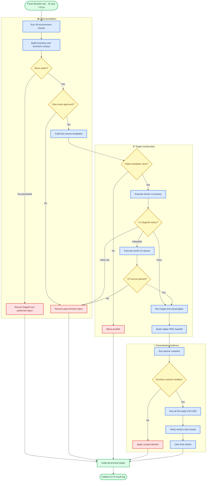

# E172 实验计划：Box004 全流程筛选及 Full CEM

_Core4D Phase 35 · 2026-07-21 · production screening plan（planning-only，待用户确认后执行）_

计划前身：E170 [plan/186](186_E170_box021_prg_full_validation_plan.md) · E171 [plan/187](187_E171_box022_box026_full_pipeline_plan.md)

---

## 📋 1. 决策摘要

E172 对 `Box004` 从 CORE4D raw authority 重新执行 data_construction_v3 的 `S0–S6` 主链路，并对本轮真正通过 S5 handoff gate 的全部 person-case 运行 Full CEM。算法与冻结配置**完全沿用 E170/E171**（`omnirt_v1→v2 rescue` + `ref_fk` + `rubber_hull` + `E170 PRG` 跨物体候选），不做 reward/route sweep，也不是旧结果搬运。

固定决策如下：

- **动作策略（move-only，与 E168 一致）**：只有 `move1/move2`（7 seq/14 pc）进入 production 全流程；`pass2`（2 seq/4 pc）与 `strike`（1 seq/2 pc）在 S1 即作为 Stage0 非首选动作 reject，**保留终态在 registry** 但不进入 S2–S6，不为其设计 gate
- raw 入口仍覆盖 Box004 的**完整 10 sequence / 20 person-case** 以做 authority 闭合；production expected = **14 move pc**；最终 authority 以 E172 fresh inventory 为准
- S1 同时重算 3cm/5cm raw contact；3cm 是 production 主入口，5cm-only row 进入 recall review，不自动放行
- **不导出 RL / partner**：E172 只产 case-level Full CEM 结果与用户标签，本轮明确不做 RL-ready/partner export（与 E168 RL-export 目标解耦）
- S2 对 `box004_person1/2` 两个 source template 做 fresh audit 和 SHA snapshot
- S3 与 E171 一致：所有 eligible row 先跑 `omnirt_v1/ref_fk`；只有 fresh `stage2b_status=omniretarget_infeasible` 才进入 `omnirt_v2/ref_fk` rescue
- S4 运行 target gate、kinematic replay 和 visual QC；Codex 负责指标核验与视觉抽查
- S5 固定 `hand_collision_variant_id=rubber_hull`，使用 E172-scoped sidecar scene，不覆盖 source `scene_act.xml`
- S6 采用 E170 PRG 冻结配置作为跨物体候选配置，先做条件式 canary，再对全部 S5-ready rows 做 Full CEM
- 用户负责最终人工标签和是否进入后续 RL/partner export 的拍板；E172 本轮不启动 RL，也不自动导出 partner

> ⚠️ **解释边界：** “对 box004 做全流程”表示所有 20 raw rows 都必须得到可追溯的终态，不表示绕过数据 gate 强制产生 CEM row。若 fresh S1–S5 后某分层为 0 ready，这是有效的数据层负结果（`DATA_NEGATIVE`）。

## 🔍 2. 历史证据与边界

### 2.1 Raw inventory prior（fresh 盘点，2026-07-21）

从 live raw root `.../CORE4D/CORE4D_Real/human_object_motions` 按 `object_metadata.json` 精确召回，`box004_m.obj` mesh 在 raw + processed 均存在。这些数字用于 S0 authority 漂移检查，不代替 E172 fresh inventory。

| Sequence | 动作 label | 类别 | person-case |
|---|---|---|---|
| `20231002/048` | `move2_obs1` | move | p1,p2 |
| `20231002/055` | `pass2_obs0` | pass（非首选） | p1,p2 |
| `20231003_2/082` | `move2_obs0` | move | p1,p2 |
| `20231003_2/083` | `move1_obs0` | move | p1,p2 |
| `20231003_2/084` | `move2_obs1` | move | p1,p2 |
| `20231003_2/085` | `move1_obs1` | move | p1,p2 |
| `20231003_2/086` | `move2_obs3` | move | p1,p2 |
| `20231003_2/087` | `move1_obs3` | move | p1,p2 |
| `20231003_2/089` | `pass2_obs3` | pass（非首选） | p1,p2 |
| `20231018/116` | `strike` | strike（非首选） | p1,p2 |

汇总：**10 seq / 20 person-case**；3 个日期（`20231002` / `20231003_2` / `20231018`）；**move = 7 seq/14 pc**（production 候选）、**非首选 = 3 seq/6 pc**（pass×4 + strike×2，Stage0 reject 保留终态）。

E168 raw-contact 表未覆盖 box004 全量（E168 只做 move 子集且未执行）；因此 E172 必须从 `CORE4D_Real` fresh 运行 inventory 和 raw contact，不复用 E168 accounting 作为 S1 authority。

### 2.2 历史 overlap：仅作 warning prior，不作 completion 证据

| 历史来源 | 可复用的 contract/evidence | E172 不得继承的结论 |
|---|---|---|
| E091/E095/E096 | box004 曾生成 processed template/scene（`e091_box004_20231003_2_082_p1/083_p*`） | 不能用旧 scene/CEM 代替 E172 fresh 结果 |
| E167 | `box004_082_p1` 已有 `E167A_zOnlyBody` `RL_EXPORT_READY` 产物 | 只作同 case 历史参考；E172 用 PRG+rubber 冻结配置 fresh 重跑，不 import E167 CEM |
| E166 | `082_p1`(jerk≈2956,“脚坏且抖”)、`083_p2`(jerk≈907,“脚坏不抖”) 曾作平滑度诊断 case | 不作 gate；仅解释潜在下游风险 |
| E168 | box004 move 子集的召回/版本口径（v1→v2、ref_fk） | E168 为 planning-only 且 RL-export 导向、move-only、无 PRG/rubber；E172 scope 与算法不同，不继承其 yield |

已知 partner 风险（warning prior）：`box004_082_p2` 历史上 OmniRetarget CVXPY infeasible/missing。它**不能**直接跳过 v1；只有 E172 fresh v1 再次归一化为 `omniretarget_infeasible` 时才具备 v2 rescue 资格。所有尝试必须保存 fresh solver error、输入 SHA 和 terminal state，不得复制旧 failure label。

### 2.3 E170 PRG 的复用边界

E170 在 Box021 上证明 PRG 对 lower-body 指标有显著定向收益，但存在 contact trade-off，gate-health 为 `0/28`；E171 在 Box026 上复现了“lower-body 收益成立但 contact trade-off 显著 + gate-health 0/12”。因此 E172 将 PRG 定义为**跨物体候选配置**，而非已验证的 box004 production default。E172 不做 P/R/G 消融，也不根据 canary 质量临时调参；所有 S5-ready rows 使用同一冻结配置，实验结束后再按分层报告可迁移性。

## 🎯 3. Scope、authority 与固定配置

### 3.1 In scope

- box004 全量 raw inventory（10 seq/20 pc）与 action/inventory 筛选
- 3cm/5cm raw-contact 重算、summary、timeline 和 reject taxonomy
- `box004_person1/2` 两个 clean source template 的 fresh audit、visual package 与 SHA snapshot
- `omnirt_v1/ref_fk` primary Stage2b、限定 `omnirt_v2/ref_fk` rescue 及其 terminal failures
- target gate、kinematic replay、visual QC 和 S5 handoff
- rubber-hull + E170 PRG cross-object candidate 的 canary 与 Full CEM
- 全量 metrics、分组分析、视觉抽查、用户最终人工标签准备
- S0–S6 registry、completion audit、结果日志和 tracker 更新

### 3.2 Out of scope

- `fingertip_aware`、`adaptive`、`omnirt_original`、`omnirt_v2_replace` 或任何 wrist-to-fingertip replacement
- raw-contact threshold、reward、gate、CEM budget 或 scene physics sweep
- 为增加 positive 数量而改变 action policy、target route，或对非 `omniretarget_infeasible` row 使用 v2
- RL 训练、RL-ready export、partner export 和默认配置升级
- 把 E091/E167 或 E170/E171 的历史结果直接计入 E172 fresh completion count
- E168 的 RL-export / paired-partner 目标（E172 只产 case-level CEM 结果，不做 RL 导出）

### 3.3 Authority 定义

| Authority | 唯一来源 | 必须断言 |
|---|---|---|
| Raw authority | E172 `s1_raw_contact/inventory/inventory.tsv` | object 仅 box004；case_id 唯一；预期 10 seq/20 person-case |
| S1 authority | E172 fresh 3cm/5cm manifests | 每个 raw row 在两档均有状态，不能静默缺失 |
| Stage2b authority | E172 v1 primary + v2 rescue manifests | 每个 eligible row 有 v1 终态；每个 v1 infeasible row 有 v2 终态和唯一 selected production variant |
| S5 authority | E172 registry + handoff manifest | 只含通过 template/Stage2b/target/visual gate 的 row |
| Full CEM authority | `S5_READY_SET` 的精确快照 | `full_expected = count(S5_READY_SET)`，不预先硬编码 |
| 人工 authority | E172 user review TSV | Codex 不写或覆盖 `manual_*` 字段 |

`S5_READY_SET` 定义：

```text
inventory/action eligible (move1/move2)
AND selected raw-contact route approved
AND template audit pass
AND selected Stage2b variant pass
AND target gate pass
AND visual QC pass
AND rubber-hull/PRG sidecar contract pass
```

### 3.4 Raw-contact promotion policy

同一 case 只选择一个 contact label，禁止 3cm/5cm 双份 target 覆盖：

1. `3cm pass`：直接进入 production Stage2b 候选
2. `3cm review`：经 raw-contact evidence review 后决定 pass/reject
3. `3cm fail + 5cm pass/review`：进入 `5cm_recall_review`，只有明确双手/目标人物接触证据时才可晋级
4. `5cm fail`：终态 `REJECT_RAW_CONTACT`
5. 已晋级 3cm 的 row 不再生成 5cm duplicate

被晋级的 5cm-only row 必须在 manifest 记录 `stage2b_contact_label=5cm`、reviewer、review notes 和 evidence path；不得隐式混入 3cm 主集合。

### 3.5 固定 retarget fallback 与 CEM 配置（与 E171 字段级一致）

| 轴 | E172 冻结值 | 说明 |
|---|---|---|
| Retarget primary | `omnirt_v1` | 所有 S3 eligible row 必须先运行 |
| Retarget rescue | `omnirt_v2` | 仅 v1 `omniretarget_infeasible` 时运行；不是 A/B sweep |
| Target route | `ref_fk` | E098 公共 contract；不读 E099–E101 作为硬门 |
| Base reward/method | `E167A_zOnlyBody`（`core4d_E167_box004_082_p1_E167A`） | 与 E170/E171 PRG 基座一致 |
| Hand collision | `rubber_hull` | mesh-aware SDF，maxhullvert=64；E172 sidecar |
| Lower-body physics | 16 geoms ↔ object pair | 沿用 E169/E170 P 配置 |
| Lower-body penalty | scale `2.0`、margin `0.02m` | 沿用 E169/E170 R 配置 |
| Candidate gate | min SDF `0.005m`、max violation `0.02`、hard floor `-0.005m` | fallback=`least_violation` |
| CEM budget | seed `0`、samples `1024`、opt steps `32` | canary smoke `samples=64, opt_steps=4`（E170/E171 口径） |
| Source config ID | `E170_PRG_lowerbodyPhysics_softPenalty_candidateGate` | 记录冻结来源 |
| E172 method ID | `E172_E170PRG_crossObject_candidate_r1` | 不写入 `target_variant_id` |

`omnirt_v2` 使用 E168/E171 同款 Phase4 rescue contract：

```text
enable_constraint_relaxation = true
enable_foot_z_constraint = true
foot_slide_penalty_weight = 1.0
enable_contact_preservation = true
object_penetration_tolerance_scale = 0.8
replace_wrist_with_fingertip = false
include_fingertip_centers = false
```

`omnirt_v1` 保持 primary contract：上述 Phase4 flags 全关，`replace_wrist_with_fingertip=false`、`include_fingertip_centers=false`。

v1/v2 选择规则固定：

```text
v1 pass                 -> selected=omnirt_v1 ; v2 not_run_not_eligible
v1 omniretarget_infeasible -> run omnirt_v2 rescue（隔离路径）
    v2 pass             -> selected=omnirt_v2
    v2 infeasible       -> REJECT_DUAL_OMNIRT_INFEASIBLE
v1 any other failure    -> no v2 ; preserve original terminal failure
```

v1/v2 必须使用独立输出目录和 registry row，记录 `rescue_of`/`retry_of`、solver/converter SHA、params JSON 与全部中间产物。v2 不覆盖 v1，不启用 `REPLACE_WRIST_WITH_FINGERTIP=1`。除 selected retarget variant 产生的 case-specific trajectory/mask/scene/输出路径外，Full CEM effective config 必须字段级一致；任何临时改参必须另立实验。

## 📊 4. Claims

| Claim | 最低证据 |
|---|---|
| C0：raw authority 完整 | fresh inventory 覆盖 10 seq/20 person-case；任何差异有 raw path/hash 解释 |
| C1：两档 raw contact 可复现 | 20 rows 均有 3cm/5cm 状态、proxy path、metrics 和 terminal route；5cm 不覆盖 3cm |
| C2：template 基础可信 | `box004_person1/2` 均完成 MuJoCo、inertial、mass/inertia、collision、contact-site、visual 和 SHA audit |
| C3：route/variant 语义未污染 | target route 始终为 `ref_fk`；v1 primary 与 v2 rescue provenance 分离；历史 fingertip/E167 证据只记 warning |
| C4：v1→v2 fallback 完整 | 所有 S3 eligible row 有 v1 终态；所有 fresh v1 infeasible row 有 v2 终态；非该状态 v2 attempts=0 |
| C5：S3–S5 无静默缺失 | 每个 selected v1/v2 row 在 target gate、visual QC 和 handoff 均有 pass 或明确 terminal failure |
| C6：Full CEM 覆盖精确 | 每个 `S5_READY_SET` row 均有完整 Full CEM artifact 或明确 terminal runtime failure；expected/completed/failed 相等闭合 |
| C7：质量证据完整 | 每个 CEM-complete row 均有统一 metrics、gate-health、MP4、关键帧和 Codex verification |
| C8：分层结论可解释 | 分 person、action、date、sequence、contact label、selected retarget variant 报告 funnel、yield、failure taxonomy 和指标分布 |
| C9：历史比较不越界 | 对 E091/E167 overlap 只作同 case 历史参考，明确 scene/method 差异，不声称严格因果 A/B |
| C10：用户 authority 独立 | Codex 只写核验列；用户完成全部 CEM-complete row 的最终 `USE/DO_NOT_USE` 拍板 |
| C11：结果可复现 | config/git/SHA、scene snapshot、registry、commands、root/outdir NPZ、metrics、video 和 audit 均在 `results/E172/` |
| C12：PRG 跨物体可解释 | 明确报告 box004 上 PRG 的 lower-body 收益与 contact/gate-health trade-off，与 E170(box021)/E171(box026) 对照 |

## 🔄 5. S0–S6 工作流



### 5.1 S0：环境、配置与 authority preflight

保存：SPIDER/Holosoma repo path、git SHA、dirty diff summary；raw root、SMPL-X path、Python/MuJoCo/ffmpeg/GPU contract；resolved config 和 run ID；20-row expected identity 与 fresh inventory identity diff；code/config/schema SHA。任何 raw root 误指、case set 漂移、公共 config 不一致或结果目录覆盖风险，在运行 S1 前作为 global blocker 处理。

**环境（复用 E171 verified，见 memory `e171-data-paths-and-env`）：**
- CORE4D raw root = `/mnt/ali-sh-1/usr/xiayibo/xyb_data_tidal_alsh/other-datasets/mocap_data/CORE4D/CORE4D_Real`（**不用** dead mount `/mnt/a0ccc676-...`）
- SMPLX_MODEL_DIR = `.../mocap_data/human_model_files`（converter 内部追加 `smplx/`）
- S3 retarget env = conda `hsretargeting`（`/mnt/ali-sh-1/dataset/zeus/xiayb/.holosoma_deps/miniconda3/envs/hsretargeting/bin/python`）
- S6 CEM 跑本机 8×L20Y（`MUJOCO_GL=osmesa`）；如遇 `.cache/run.py` GPU-filler 占卡，按 E171 已授权先释放

### 5.2 S1：fresh inventory 与 3cm/5cm raw contact

对 `object_keys=box004` 运行完整 inventory，不使用 `max-case-persons` 截断。所有 row 含 object/date/sequence/person/action/source path/hash。Stage0 非首选动作（pass2/strike，6 pc）reject 是合法结果，但必须保存在 registry，不能从总数消失。S1 同次 surface-distance 计算输出 3cm/5cm mask、候选、summary、timeline 和 per-sequence NPZ。

### 5.3 S2：两个 source template fresh audit

对 `box004_person1/scene.xml`、`box004_person2/scene.xml` 完成 object-level audit（两文件已 git-tracked，含 `task_info.json`，无 `scene_act.xml` — 由 S3 生成）。启动时把实际文件、git HEAD 和 SHA256 保存到 `results/E172/scene_snapshot/source_templates/`；若两人 scene 内容相同也保留两个 provenance row。检查 MuJoCo load、robot inertial、object mass/inertia、collision policy、contact-site。

### 5.4 S3：v1 primary 与 v2 rescue 真执行

只对 approved raw-contact + move rows 执行 Stage2b。第一轮全部 `omnirt_v1/ref_fk`：

```text
convert -> OmniRetarget -> trim -> contact mask
-> target scene pose patch -> SPIDER preprocess -> scene_act -> verify
```

每行保存 converted/retargeted/trimmed/trajectory/contact mask/target scene/scene_act/verify summary 和 SHA。v1 manifest 必须把 CVXPY solver infeasible 精确归一化为 `stage2b_status=omniretarget_infeasible`，不把一般 `preprocess_fail`、missing input、environment failure 或 shape mismatch 混入 rescue 队列。v1 完成后构建确定性 rescue manifest：输入只能是 v1 `omniretarget_infeasible` rows；若非空先用一个已知 v1-pass row 跑 v2 adapter canary（不改 production variant、不计 yield）；production rescue 用 Phase4 参数写入独立目录；v2 pass 以 `selected_retarget_variant_id=omnirt_v2` 重新进入完整 S4/S5；v2 再次 infeasible 标 `REJECT_DUAL_OMNIRT_INFEASIBLE`。`box004_082_p2` 的历史 infeasible 只作 warning prior，须由 fresh v1 evidence 重新确认。

### 5.5 S4：target gate 与 visual QC

机器 gate 分别消费 selected v1 或 rescued v2 产物，检查 target/source scene、qpos layout、object pose patch、inertial、penetration、lower-body interference 和 replay contract。v2 rescue 成功不等于自动 S4 pass。Codex 审查：查看所有 target-gate-pass row 的 keyframe sheet；完整查看所有 warning/boundary row 的 replay MP4；其余按 person × action × contact-label 分层抽查；发现疑似穿箱、趴箱、错误接触人、物体瞬移或爆姿时扩查完整视频。只有 visual QC `pass` 进入 S5；Codex 结论存独立 verification 字段，不写用户 `manual_*`。

### 5.6 S5：rubber-hull 与 PRG sidecar handoff

从 S4-pass 的 target `scene_act.xml` 生成 rubber-hull sidecar，再加 E169/E170 冻结的 16 个 lower-body/object collision pair。sidecar 用 E172 专属名，例如 `scene_act_E172_rubberHull_PRG.xml`；禁止覆盖 target 原始 `scene_act.xml`。semantic diff 只能含预期的 hand mesh collision 和 16 个 pair；object mass/friction/actuator/world/source trajectory 不变。S5 保存 frozen `S5_READY_SET`、每行 `selected_retarget_variant_id`、v1→v2 provenance、CEM override、effective scene SHA、hand-collision audit 和 candidate/reject manifest。进入 canary 前所有 S5-ready target 的 `scene.xml`、原始 `scene_act.xml` 和 E172 sidecar XML 必须 `git add -f` 纳入主 git，并复制到实验 snapshot 记录 SHA（active XML + experiment snapshot 双重保障）。

### 5.7 S6：conditional canary 与 Full CEM

Canary 从 S5-ready 确定性选择：每个存在 ready row 的 `person` 至少 1 条；若存在 v2-rescued S5-ready row，还须至少覆盖 1 条 v2；通常最多 5 条。某分组无 S5-ready row 时记 `NO_CANARY_NO_S5_READY`。Canary 只验证 runtime/scene/config/artifact contract（`samples=64, opt_steps=4`）；数值差或 0 positive 不阻断 production screening，只有公共 runtime contract 不健康才按分级方案暂停。Canary 健康后对 frozen `S5_READY_SET` 全部跑 production `samples=1024, opt_steps=32` Full CEM；入选 canary 的 row 仍须完成正式 Full CEM。

## 🛡️ 6. 分级阻断与 stop-loss

### 6.1 分级阻断

| 级别 | 典型条件 | 阻断范围 | 解除条件 |
|---|---|---|---|
| Global blocker | raw authority 漂移、公共 code/config/schema SHA 不一致、路径覆盖、环境契约失败、公共 runtime 失败 | 暂停 E172 全批 | 修复公共 contract 并重跑 S0/canary |
| Object blocker | box004 template audit、sidecar semantic diff、object-level scene load 失败 | 暂停 box004 | 对象 contract 修复并重审 |
| Case blocker | action/raw contact fail、v1 非 rescue 类失败、v1/v2 dual-infeasible、target gate fail、visual reject、单 case artifact fail | 只淘汰该 person-case | 保留 terminal evidence；其余继续 |
| Warning | 历史 fingertip negative、E091/E167 legacy、5cm-only、`082_p2` 历史 infeasible prior | 不自动阻断 | report 中保留 warning/provenance |

“任一 preflight 失败即阻断全批”不适用于 E172。全批只由 global contract 失败阻断；object/case 失败必须隔离。

### 6.2 Canary stop-loss

- 两个 person canary 出现相同 scene/config/runtime signature：升级为 object blocker
- 单 case v1 `omniretarget_infeasible`：进入 v2 rescue，不是 blocker；v2 仍 infeasible 才成为 case blocker
- 异常初始姿态、输入损坏或非 solver-infeasible 的 v1 failure：case blocker，不尝试 v2
- OOM/资源争用：降低并发或重分 shard，不改算法配置，不 kill 其他任务
- canary 质量差/数值 fail/视觉不理想：不作执行 stop-loss；继续 full 以测真实 yield

同一失败遵循三次失败协议（诊断修复 → 换恢复方案 → 停止重复并请求用户决策），每次失败的输入/signature/尝试/结果写入 `progress.md` 与 E172 evidence。

### 6.3 Full completeness contract

```text
full_expected = full_completed + full_terminal_failed
```

每个 completed row 须具备 root/outdir NPZ 一致、qpos finite、effective config、scene SHA、PRG diagnostics、metrics 和 video；每个 terminal failed row 须具备 error log、failure mode 和最后一次尝试记录。目录无文件且 registry 无终态属于实验未完成。

## 🔧 7. 实现与固化入口

### 7.1 计划阶段修改文件

| 文件 | 本次改动 |
|---|---|
| `plan/188_E172_box004_full_pipeline_plan.md` | 新建 E172 正式计划 |
| `EXPERIMENT_TRACKER.md` | 新增 E172 Phase 35 计划入口 |
| `progress.md` | 记录 authority、历史边界和计划验收 |

### 7.2 执行前拟新增文件（优先复用 E171 脚本，仅换 object scope/路径）

| 文件 | 作用 |
|---|---|
| `scripts/experiments/E172/e172_common.py` | 路径、schema、case ID、SHA 与状态公共 contract（fork E171） |
| `scripts/experiments/E172/build_pipeline_authority.py` | 从 S1–S5 生成 frozen authority、funnel 和 terminal state audit |
| `scripts/experiments/E172/build_omnirt_rescue_manifest.py` | 只从 fresh v1 `omniretarget_infeasible` 构建 v2 canary/rescue queue |
| `scripts/experiments/E172/run_stage2b_queue.py` | 执行 v1 primary 与 v2 rescue |
| `scripts/experiments/E172/build_prg_cem_manifest.py` | 生成 rubber-hull/PRG sidecar、override、canary/full manifest |
| `scripts/experiments/E172/run_cem_queue.py` | 按 manifest 执行 canary/full |
| `scripts/experiments/E172/render_cem_results.py` | Full CEM MP4、关键帧和 review package |
| `scripts/experiments/E172/audit_completion.py` | 审计 S0–S6、Full completeness、Codex/user authority |
| `scripts/launch/active/run_E172_box004_data_pipeline.sh` | fresh S0–S5 固化入口 |
| `scripts/launch/active/run_E172_local_cem.sh` | 本机 8×L20Y canary/full 入口（沿用 E171 local runner，不用 dead-mount 远程脚本） |
| `scripts/launch/active/watch_E172_cem.sh` | 监控、增量回收和 terminal completion |
| `scripts/launch/active/postprocess_E172_after_full.sh` | strict completion 后 render/eval/report/audit |
| `scripts/eval/runners/eval_E172_box004.py` | 直接 import `eval.core.core_metrics` 的统一 evaluator |
| `scripts/eval/wrappers/eval_E172_box004.sh` | 固化评测入口 |
| `scripts/eval/reports/gen_E172_box004_report.py` | 精炼 Markdown 主报告 + 详细 TSV/JSON |

若现有 data_construction_v3 / E171 入口已提供某能力，E172 wrapper 只冻结参数和路径，不复制管线实现。实验特有逻辑放 `scripts/experiments/E172/`，真实 launch 放 `scripts/launch/active/`。

### 7.3 固化执行入口（执行前先实现并 code review）

```bash
bash workspace/core4d/scripts/launch/active/run_E172_box004_data_pipeline.sh

MODE=canary bash workspace/core4d/scripts/launch/active/run_E172_local_cem.sh
MODE=full   bash workspace/core4d/scripts/launch/active/run_E172_local_cem.sh

bash workspace/core4d/scripts/launch/active/watch_E172_cem.sh
bash workspace/core4d/scripts/eval/wrappers/eval_E172_box004.sh
```

GPU ID 只表示计划默认 shard；启动前只读检查实际占用并保存快照。GPU 不可用时等待或调整 E172 shard，不暂停/kill/重排其他任务。

## 📈 8. Full CEM、评测与人工审查

### 8.1 Artifact 硬契约

每个 Full CEM row 必须验证：root NPZ 与 outdir `trajectory_mjwp_act.npz` 的 qpos shape/数值/SHA 一致；qpos、reward/gate diagnostics 全 finite；effective config 与 frozen E172 config 精确一致；scene name/path/SHA 与 manifest 一致；trajectory/contact mask/source/target scene/override 均有 SHA；MP4 可解码、非零帧、帧数与 qpos 时间轴可解释；case_id/person/contact label/selected variant 无错配；v1 failure/v2 eligibility/`rescue_of`/最终 selected variant 精确闭合。

### 8.2 指标核验

Evaluator 直接 import `eval.core.core_metrics`，不动态加载 E106/E170/E171 evaluator。阈值 launch 前冻结。

| 维度 | 核心指标 |
|---|---|
| Tracking | body-z/root、EEF、object position/rotation mean/max |
| Contact | raw-mask contact、3/5/8/10cm band、3mm release、physics contact |
| Hand safety | rubber mesh-aware penetration、deep penetration、near-band |
| Body safety | leg penetration/near-2cm、upper/body/head penetration |
| Dynamics | pelvis/fall、object floor/contact、speed/acceleration、foot slip |
| Gate health | valid/selected/fallback fraction、min SDF、violation fraction |
| Completeness | expected/completed/failed/missing、artifact contract status |

报告至少按以下维度分组：`person1` vs `person2`；action；date；sequence；3cm primary vs 5cm recall；`omnirt_v1` vs `omnirt_v2`；S1/S3/S4/S5 failure taxonomy；E091/E167 overlap vs non-overlap；以及与 E170(box021)/E171(box026) 的 PRG 跨物体对照。对 overlap 只报同 case 历史差值和方向，不做严格 paired causal claim。

### 8.3 视觉抽查与用户终审

Full CEM 后 Codex：查看所有 case 关键帧 sheet；完整查看所有 numeric fail、gate fallback、阈值边界和 worst-case MP4；从 numeric pass 分层抽查；记录穿透/非法支撑/趴箱/fall/object kick/爆姿/接触丢失/reference infeasible；独立填 `codex_verification.tsv`（无 `manual_*`）。随后生成供用户审核的精炼 Markdown 主报告，回答：

1. 20 条 raw row 最终分别停在哪一层（含 6 条非首选动作）
2. box004 有多少 S5-ready、Full complete、numeric pass
3. 哪些 case 可用/不可用及原因
4. v1 infeasible 多少、v2 救回多少、dual-infeasible 是哪些
5. PRG 的 lower-body 收益是否在 box004 成立、是否伴随 contact 回退，与 box021/box026 对照
6. `082_p1`(E167) 等 overlap case 的 fresh 结果与历史方向差异

用户对所有 CEM-complete rows 给出 fresh `USE/DO_NOT_USE`。用户拍板前 machine recommendation 固定 `PENDING_USER_REVIEW`，不生成 RL-ready/partner export。

## ✅ 9. 成功标准与结果分级

### 9.1 Pipeline completion 成功标准

| 检查项 | 通过标准 |
|---|---|
| Raw coverage | 预期 20 rows 全部有 inventory 与 3cm/5cm 终态，或 authority drift 已解释并经用户确认 |
| Template coverage | 2/2 source template fresh audit + visual + SHA snapshot 完成 |
| Eligible Stage2b | 100% 有 v1 终态；每个 v1 infeasible row 100% 有 v2 终态；非 eligible v2 attempts=0 |
| S4/S5 coverage | 所有 selected v1/v2 pass row 均有 target/visual/handoff 终态 |
| Full CEM coverage | `full_expected = completed + terminal_failed`，missing=0 |
| Metrics/visual | 所有 CEM-complete row 有 metrics、video、关键帧和 Codex verification |
| User authority | 所有 CEM-complete row 有用户最终标签后才形成 final 结论 |
| Reproducibility | release checks、completion audit、SHA/scene/config contract 全 pass |

### 9.2 Scientific yield 与执行成功分离

E172 不设“至少 N 条 positive”作为执行完成门槛。`0 positive`、甚至 `0 S5-ready`，都可能是正确的筛选结果。

| 结果类型 | 定义 | 含义 |
|---|---|---|
| `PIPELINE_INCOMPLETE` | authority/terminal state/Full/证据有缺失 | 执行失败，不能下科学结论 |
| `DATA_NEGATIVE` | 0 S5-ready，且 S0–S5 完整 | 数据/target gate 未发现可下游 row |
| `CEM_NEGATIVE` | 有 S5-ready，但 0 strict/user USE | downstream method 对 box004 无产出 |
| `PARTIAL_YIELD` | 至少 1 条 user USE，但未覆盖全分层 | 可保留 case-level positives，不升级默认 |
| `OBJECT_YIELD` | box004 出现用户 USE，且安全/接触 trade-off 可解释 | 支持继续评估跨物体 PRG，仍需用户批准后续 RL |

无论哪类，都必须同时报告 funnel denominator，不能只报 positive 而隐藏 raw/S5/CEM 总数。

### 9.3 配置晋级边界

E172 只决定是否产生可保留的 case-level CEM 结果。即使达到 `OBJECT_YIELD`，也不能自动宣称 PRG 为全物体默认配置。默认升级需要另一个含跨对象对照、gate-health 修复和 RL evidence 的实验。

## 💾 10. 结果路径与复现

### 10.1 标准结果树

```text
workspace/core4d/results/E172/
├── s0_environment/
├── s1_raw_contact/{inventory/,raw_contact/}
├── s2_templates/
├── scene_snapshot/{source_templates/,cem_sidecars/}
├── s3_retarget/{omnirt_v1/ref_fk/,omnirt_v2/ref_fk/,rescue/}
├── s4_gate_visual_qc/{omnirt_v1/ref_fk/,omnirt_v2/ref_fk/}
├── s5_handoff/{hand_collision/,cem_overrides/}
├── s6_downstream/{cem/canary/,cem/full/,eval/,evidence/}
├── registries/
└── completion_audit/
```

`results/E172/` 不进 git。代码、计划、log、tracker，以及 S5-ready 的 active `example_datasets/.../*.xml` 进入 git；`scene_snapshot/` 与大体积 NPZ/MP4 由外部结果同步管理，manifest 摘要和 SHA 写入最终 log。正式文档不指向 `/tmp` 或 legacy `workspace/v3/data_construction*`。

### 10.2 启动前验证

```bash
find workspace/core4d/scripts/data_construction_v3 -name '*.py' -print0 | xargs -0 python3 -m py_compile
workspace/core4d/scripts/data_construction_v3/orchestration/run_release_checks.sh \
  --run-root workspace/core4d/results/E172_release_check --no-smoke
git diff --check
```

有 raw data 和 SMPL-X 时追加 `--with-smoke` compact smoke，结果放 E172 release-check 持久目录。

### 10.3 最终 completion audit

至少验证：raw/S1/S2/S3/S4/S5/S6 row-set 闭合；3cm/5cm promotion 无 duplicate/overwrite；每个 S3 eligible row 有 v1 终态、v2 rescue set 与 fresh v1 infeasible set 精确相等；v1/v2 registry/output 并存、所有 v2 row 有 `rescue_of`、无 v2 覆盖 v1 或非 eligible v2 attempt；2 个 template 与全部 CEM sidecar SHA 可恢复；S5-ready 与 Full expected set 精确相等；completed + terminal failed = expected，missing=0；metrics/MP4/keyframes/Codex/user review 对 CEM-complete set 覆盖完整；`retarget_variant_id`/`selected_retarget_variant_id`/`target_variant_id`/`hand_collision_variant_id`/`spider_method_id` 语义未混用；S6 failure 未反向改写 S1–S5；未经用户批准无 RL-ready/partner export。

只有 completion audit 通过且用户标签齐全后，E172 才从“执行完成待终审”更新为最终结果状态，并新建分析型实验日志；tracker 只保留一句话摘要和 log 链接。

## 🔗 11. 与 E168 的关系（需用户确认）

E168（`plan/184`，planning-only 未执行）也覆盖 box004。E172 与 E168 共享 **move-only** scope，但算法/产出不同：E168 = 单配置 `E167A` 无 PRG/rubber、RL-export/paired-partner 导向；E172 = **PRG+rubber_hull（E170/E171 算法）、只产 case-level CEM 结果、本轮不做 RL 导出**。二者的 box004 move 子集在 raw/S1/S3 层可共享 fresh authority，但 S5/S6 因 hand-collision 与 reward 不同不可互相覆盖。**E172 独立推进**；E168 的 box004 RL-export 目标留待 E172 case-level yield 与用户裁决后再决定是否重启。
