# E175 实验计划：非 box multi-geom 修复与 39-case A100 Full CEM

_Core4D Phase 38 · 2026-07-23 · E174 物理/PRG 接入修复与 bucket surface-voxel 重建_

前置证据：[E174 计划](190_E174_bucket_desk_move2_full_pipeline_plan.md) · [E174 结果](../log/234_E174_bucket_desk_move2_nonbox_results.md)

---

## 📋 决策摘要

E174 对 39 条非 box case 完成了 Full CEM，但 numeric pass 仅 `5/39 = 13%`。E175 的 mesh-aware 离线诊断证明，E174 不能被解释为“proxy 几何保真度单因失败”，因为实际链路同时存在两个确定的软件接入缺陷：

1. MuJoCo robot–object 显式 collision pair 只连接精确名 `object_collision`
2. PRG lower-body penalty、candidate gate 和 carry gate 的 SDF 也只读取 `object_collision`

这使 bucket 的四面墙、desk 的其余 surface voxel 对机器人碰撞和 PRG 均不可见。与此同时，bucket 的旧 `bucket_wall_proxy_aabb` 仅用底板与四个 AABB 外壁表达圆形/异形空心桶，不能提供足够精细的桶沿、内壁和曲面覆盖。

本轮执行一套 production 修复配置，不再以 bucket004 五臂消融作为正式目标：

| 轴 | E174 | E175 production |
|---|---|---|
| Bucket object proxy | 底板 + 四外壁 AABB | 与 desk 同算法的 mesh-surface voxel multi-box |
| Desk object proxy | surface voxel multi-box | 保持几何，重新接入全部 geom |
| Robot–object physics | 仅首 geom | `lh/rh + 16 lower-body` × 全部 object proxy geoms |
| PRG object SDF | 仅首 geom | 全部 `object_collision*` box 的 union SDF |
| Case authority | 39 E174 CEM-ready rows | 精确同一 39 rows |
| CEM budget | seed 0、1024×32 | 完全不变 |
| 计算资源 | 本地 L20Y | `A100-8gpu`，本轮 Full 按用户指令固定 `2,3,6,7` 四卡 |

E175 的主要科学比较是 E175 production 与 E174 的逐 case paired 对照。E174 结果、scene 和日志保持只读；所有新 scene、manifest、NPZ、视频与证据进入 `workspace/core4d/results/E175/`。

```mermaid
flowchart LR
    accTitle: E175 Production Repair Flow
    accDescr: E175 rebuilds bucket and desk collision coverage, validates physics and PRG multi-geom contracts, then runs the same 39 E174 cases on an A100 worker pool before paired evaluation.

    e174_authority([📥 Freeze E174 39 rows]) --> rebuild_proxy[🔧 Rebuild object proxy]
    rebuild_proxy --> pair_union[🔗 Connect all physics pairs]
    pair_union --> sdf_union[⚙️ Enable PRG union SDF]
    sdf_union --> local_gate{🔍 Local contracts pass?}
    local_gate -->|No| repair[✏️ Repair implementation]
    repair --> local_gate
    local_gate -->|Yes| remote_canary[🧪 Run A100 canary]
    remote_canary --> canary_gate{🔍 Canary healthy?}
    canary_gate -->|No| diagnose[🔧 Diagnose runtime]
    diagnose --> remote_canary
    canary_gate -->|Yes| remote_full[🚀 Run A100 Full 39]
    remote_full --> paired_eval[📊 Compare with E174]
    paired_eval --> visual_review([✅ Complete visual review])

    classDef input_style fill:#ede9fe,stroke:#7c3aed,stroke-width:2px,color:#3b0764
    classDef process_style fill:#dbeafe,stroke:#2563eb,stroke-width:2px,color:#1e3a5f
    classDef decision_style fill:#fef9c3,stroke:#ca8a04,stroke-width:2px,color:#713f12
    classDef success_style fill:#dcfce7,stroke:#16a34a,stroke-width:2px,color:#14532d

    class e174_authority input_style
    class rebuild_proxy,pair_union,sdf_union,repair,remote_canary,diagnose,remote_full,paired_eval process_style
    class local_gate,canary_gate decision_style
    class visual_review success_style
```



## 🔍 根因与已有证据

### 两个独立接入缺陷

E174 的 robot collision geoms 使用显式 `<pair>` 形成 robot–object contact。builder 只为 `object_collision` 建 pair；PRG resolver 也只解析该精确名称。因此 scene 中存在 `object_collision_*` 不等于这些 geom 已参与 robot physics 或 PRG。

| 层 | E174 实际输入 | 直接后果 |
|---|---|---|
| MuJoCo physics | 首个 object geom | 手/腿可穿过未配对的桶壁或 desk voxel |
| PRG penalty/gate | 首个 object geom SDF | 穿过其他 geom 的候选不被扣分或拦截 |
| S4 visual replay | visual mesh | 视觉干净不能证明 collision/PRG contract 完整 |

### Mesh-aware 离线诊断

39-case 诊断已完成，`39/39 evaluated`、`errors=0`。关键校准与结果：

- active ref-FK target 是 wrist 加 palm offset，不要求自身位于 visual mesh 的 `3 cm` 表面带
- fidelity 应使用同一点的 `proxy_distance - mesh_distance`，不能只看 target 到 proxy 的绝对距离
- bucket004 相对 mesh 的 proxy 欠覆盖 `>3 cm` 约 `4.9%`，desk007 为 `0%`
- desk007 的失败不能归因于局部 voxel 缺面，主要接入问题是其余 voxel 未进入 physics/PRG
- lower-body materiality 分解为 `23` 条 ref 已穿透且 rollout 延续、`3` 条 rollout 新引入、其余为被纠正或可忽略

因此 E175 不再把“补一个桶沿”视为充分修复，而是同时修正 geometry、physics coverage 和 PRG coverage。

## 🎯 Scope 与 authority

### In scope

- 精确复用 E174 `cem_full_manifest.tsv` 的 39 个 case
- 5 个 bucket 的 mesh-surface voxel multi-box proxy 重建
- desk007 现有 surface voxel proxy 的 multi-geom physics/PRG 完整接入
- rubber-hull `lh/rh` 与 16 lower-body geoms 的全 object-geom pair 矩阵
- PRG object SDF union
- A100 canary、Full 39、严格回收、统一 evaluator、全量视频和视觉复核
- E174→E175 逐 case paired metrics 与 failure-mode 转移

### Out of scope

- 新增或删除 E174 authority case
- 重跑 OmniRetarget、修改 `ref_fk` target 或 contact mask
- 修改 reward 权重、PRG 阈值、rubber-hull、seed 或 CEM budget
- chair、desk005 或其它未进入 E174 39-row Full authority 的 case
- 以旧 bucket004 五臂结果替代 production 39-case 结论
- 自动导出 RL 或 partner 数据

### Authority closure

唯一输入 authority：

```text
workspace/core4d/results/E174/s6_downstream/manifests/cem_full_manifest.tsv
```

必须断言：

- row 数精确为 `39`
- `case_id` 唯一
- object 分布与 E174 一致：bucket `30`、desk007 `9`
- trajectory、contact mask、target scene SHA 与 E174 一致
- E175 Full manifest case set 与 E174 case set 精确相等
- 不因新的 union penetration diagnostic 删除 case；所有 39 条均进入 terminal run status

## ⚙️ 实现设计

### Bucket surface-voxel proxy

Bucket 使用与 desk/chair canonical adapter 相同的 mesh-surface voxel算法：

```text
trimesh.voxelized(max_extent / 16)
→ occupied surface voxels
→ greedy merge
→ local AABB box geoms
→ 12% pitch inward shrink
→ object_collision + object_collision_voxel_*
```

固定参数：

| 参数 | 值 |
|---|---:|
| `target_cells` | 16 |
| `max_boxes` | 180 |
| shrink | `min(pitch×0.12, half_size×0.25)` |
| geom type | box only |
| collision policy | `bucket_surface_voxel_multibox_proxy_draft` |

分辨率由 E175 五个 bucket 的 `12/14/16/26` 离线扫描冻结，不照搬
desk 的 26-cell 参数。16-cell 下 box 数为 `44–167`，mesh→proxy p90
为 `0.0098–0.0148 m`，proxy→mesh p90 为 `0.0243–0.0367 m`，
采样 phantom-fill AABB fraction 为 0；它在几何覆盖与
`18×N_object_geoms` pair/runtime 成本之间满足 production canary 的
候选上限。

E175 只生成 sidecar，不覆盖 E174/source `scene_act.xml`。每个 bucket object 至少生成 object-only mesh/collision overlay，并显式记录 review decision。机器硬门包括：

- MuJoCo load
- box-only geom contract
- geom 名唯一且集合非空
- proxy AABB 与 visual mesh AABB 对齐
- mesh→proxy、proxy→mesh surface-distance summary
- 无大面积填实桶腔、无跨空腔桥接
- scene/mesh/proxy SHA 可恢复

Desk007 不重新选择 voxel 参数；复用 E174 几何定义，只修 physics/PRG 接入，并重新做 compiled coverage 与 overlay 审计。

### Robot–object physics pair

机器人集合固定为：

```text
lh, rh
+ 16 E170 lower-body collision geoms
```

builder 必须先删除该机器人集合与任意 `object_collision*` 之间的 legacy pair，再生成笛卡尔积：

```text
expected_pairs = 18 × count(object_collision*)
```

验证必须基于编译后的 `MjModel`，而非 XML 行数：

- 每个 robot geom 对每个 object geom 恰有一个 pair
- 缺失 pair = hard fail
- duplicate pair = hard fail
- hand pair 参数继承 E174 rubber-hull hand–object contact contract
- lower-body pair 参数保持 E170 PRG physics contract
- 非 robot–object pair 与 E174 保持不变

### PRG union SDF

配置新增兼容轴：

```yaml
object_collision_sdf_mode: union
```

`union` 解析精确名 `object_collision` 与前缀 `object_collision_*`，对每个 robot sample 返回所有 box SDF 的逐点最小值。约束：

- 默认 `primary` 保持 legacy 行为
- union 遇到非 box geom必须 fail-closed
- geom local `pos/quat/size` 均参与计算
- reward penalty、candidate gate、terminal carry gate 使用同一 resolver
- effective config 记录实际 geom 名称与 SHA

单元测试覆盖：

- 单 geom legacy regression
- 多 geom union 等于逐 geom SDF 最小值
- translated/rotated box
- 非 box hard failure
- empty/missing object contract

### Manifest 与结果隔离

E175 production sidecar：

```text
scene_act_E175_surfaceVoxel_multiGeom.xml
```

E175 override 只允许相对 E174 base 改变：

- `scene_name`
- `object_collision_sdf_mode=union`

所有其它 resolved config 字段必须与 E174 对应 case 相同。每行记录：

- E174 source row 与 source artifact SHA
- proxy geom manifest
- compiled pair coverage
- ref first-five/full union SDF diagnostic
- E175 scene/override SHA
- canary/full output paths

## 🧪 运行与远程执行

### Local preflight

正式同步前必须满足：

| Gate | 通过标准 |
|---|---:|
| Stage2b input authority | 39/39 trajectory SHA exact 命中 E174 Full manifest |
| Authority | 39/39 exact |
| Sidecar build | 39/39 |
| MuJoCo compile | 39/39 |
| Override parity | 39/39 |
| Pair coverage | 39/39 exact |
| PRG resolved geom set | 39/39 exact |
| Required input SHA | 39/39 |
| Unit/compile/bash tests | 0 error |
| Bucket overlay review | 5/5 objects |

Ref 对新 proxy 的 initial penetration 只作 diagnostic，不从 39-row authority 中删 case。

E174 39 条中若 target task primary artifacts 缺失或被旧实验同名输入覆盖，
只能从 E174 persisted Stage2b `trimmed_npz + source_scene_xml` 重放
SPIDER adapter；禁止使用 CEM outdir rollout 冒充 ref。重放必须先在仍保留
原输入的 case 上证明 trajectory 文件 SHA、五数组以及
`load_data + 43→42 DoF` reference tensor 全部 exact，再补齐/修复 authority。
被替换的旧 primary artifacts 必须先备份到 E175 并保存逐文件 SHA。

### A100 canary

Canary 从 39-row authority 中固定选 6 条：每个实际 object 一条，即 5 bucket + desk007，覆盖 person/variant 与 ref penetration 分层。预算保持 `64 samples × 4 opt steps`。

Canary 硬门：

- `6/6 run_complete_pending_eval`
- root/outdir NPZ qpos 完全一致且 finite
- required penalty/gate arrays 存在且 finite
- effective config 为 union
- effective scene SHA 与 manifest 一致
- compiled pair count/coverage 与 manifest 一致
- 无 OOM、import、MuJoCo compile 或 device-routing error

硬门由
`workspace/core4d/scripts/experiments/E175/validate_cem_runtime.py canary`
写入
`results/E175/s6_downstream/cem/canary/canary_runtime_gate.json`。
Full launcher 必须读取该 JSON，并要求 `status=pass, passed_rows=6`。
Canary 只验证 runtime contract，不以小预算质量决定 proxy 是否有效。任一硬门失败时不启动 Full。

### A100 Full 39

遵循 `experiment-planning-zh/remote-execution.md` 的 `A100-8gpu` profile：

- remote：`tianyiyun-A100`
- canonical remote repo：`/home/dataset-assist-0/xiayb/workspace/spider`
- 每个 session 使用隔离 run root：
  `/home/dataset-assist-0/xiayb/workspace/e175_spider_runs/<session>`
- canonical repo 只提供 `.venv`，不得覆盖其 dirty worktree
- 查询 0–7 GPU 的 memory、utilization 与 compute process
- 低显存候选必须 `<5000 MB`
- 与预约/所有者允许集合取交集，按 index 最多选 4 张
- tmux 启动前再次检查并在状态变化时重建 worker pool
- 每张 GPU 内串行，不同 GPU 并行
- 不 kill、pause 或抢占任何其它任务

39 rows 按 trajectory length 做均衡 shard。远程 execution manifest 固化：

- selection 时间、GPU snapshot、compute snapshot、允许集合来源
- code/input/scene/override SHA
- isolated snapshot 逐文件 path/size/SHA 与 remote verification
- 每张 GPU queue
- tmux session
- 唯一 NPZ/outdir/config/log/video 路径

Full 预算与 E174 一致：

```text
seed=0
samples=1024
opt_steps=32
```

Full completion 硬门为 `39 = completed + terminal_runtime_failed` 且 missing=`0`。只有 `39/39 run_complete_pending_eval` 才进入统一质量评测；存在 terminal runtime failure 时先完成 failure closure，再决定是否只重跑失败 row。

### Pull、watch 与本地后处理

新建 E175 专用：

```text
run_E175_remote_a100.sh
pull_E175_remote_a100_results.sh
watch_E175_remote_a100.sh
```

Pull 只读取本次 execution manifest，逐 row 回收并验证：

- root NPZ
- outdir NPZ
- `config_act.yaml`
- worker/run log
- scene与 override provenance

远程运行结束需连续两次 session absent 确认后执行 final strict pull。随后本地运行 evaluator、离线渲染 39 个 MP4，并使用 `video-frames` skill 提取关键帧完成视觉审查。

## 📊 Claims

| Claim | 最低证据 |
|---|---|
| C0：E174 不可变 | 不改 `results/E174` 与 `log/234` |
| C1：case authority 不漂移 | E175 Full case set 与 E174 39 rows 精确相等 |
| C2：bucket proxy 精细重建 | 5/5 bucket object surface-voxel overlay review 通过，mesh/proxy coverage 与 SHA 完整 |
| C3：physics multi-geom 完整 | 39/39 compiled pair matrix=`18×N_object_geoms`，missing/duplicate=0 |
| C4：PRG multi-geom 正确 | union SDF 单元测试通过，39/39 effective config/geom set 正确 |
| C5：非目标轴无漂移 | 每 case resolved config 除 scene/SDF mode 外与 E174 相同 |
| C6：canary runtime 健康 | 6/6 artifact/config/diagnostic hard gate 通过 |
| C7：A100 Full 闭合 | 39/39 terminal，missing=0；正常目标为39 complete |
| C8：paired 结论可解释 | 39-case E174→E175 逐 case delta 与 failure transition 全覆盖 |
| C9：视觉证据闭合 | 39/39 MP4/keyframe；全部 fail、边界和代表 pass 有具体观察 |
| C10：可复现 | execution manifest、GPU snapshot、SHA、scene/override、pull audit 完整 |

## 📈 评测与决策规则

Evaluator 必须直接 import `eval.core.core_metrics`。主要 paired estimands：

```text
Delta_contact = E175 - E174
Delta_lowerbody_penetration = E175 - E174
Delta_hand_penetration = E175 - E174
Delta_tracking = E175 - E174
Delta_numeric_pass = E175 - E174
```

按 object、bucket/desk、person、retarget variant、E174 failure mode、ref union penetration 分层报告：

- pass→pass
- fail→pass
- pass→fail
- fail→fail

Production 修复成立至少要求：

- numeric pass 高于 E174 `5/39`
- hand contact 改善不是由 hand/lower-body penetration 增加换取
- bucket 与 desk 至少各有非退化证据
- 无系统性 tracking collapse、phantom support 或 runtime instability
- 视觉与数值方向一致

即使通过，也只证明 E175 这套非 box multi-geom 配置在该 39-case authority 上优于 E174；不自动升级为 chair 或所有非 box 默认。

## 🔧 文件与固化入口

| 文件 | 作用 |
|---|---|
| `spider/config.py` | multi-geom resolver 与显式 mode |
| `spider/simulators/mjwp.py` | reward/gate/carry union SDF |
| `workspace/core4d/scripts/experiments/E175/restore_stage2b_inputs.py` | Stage2b 输入等价性验证、缺失恢复与 authority drift 可恢复修复 |
| `workspace/core4d/scripts/experiments/E175/build_nonbox_multigeom_production.py` | 39-case voxel sidecar、pair、override、manifest |
| `workspace/core4d/scripts/experiments/E175/run_cem_queue.py` | manifest-driven queue |
| `workspace/core4d/scripts/experiments/E175/validate_cem_runtime.py` | 6/39 runtime artifact/config/physics/PRG 硬门 |
| `workspace/core4d/scripts/experiments/E175/verify_sync_inventory.py` | isolated remote snapshot 逐文件 SHA 硬门 |
| `workspace/core4d/scripts/eval/runners/eval_E175_nonbox_multigeom.py` | paired evaluator |
| `workspace/core4d/scripts/eval/wrappers/eval_E175_nonbox_multigeom.sh` | 固化 eval 入口 |
| `workspace/core4d/scripts/launch/active/run_E175_remote_a100.sh` | A100 canary/full |
| `workspace/core4d/scripts/launch/active/pull_E175_remote_a100_results.sh` | 严格回收 |
| `workspace/core4d/scripts/launch/active/watch_E175_remote_a100.sh` | 监控与增量回收 |
| `workspace/core4d/results/E175/` | 正式 scene/CEM/eval/visual evidence |
| `workspace/core4d/log/235_E175_nonbox_proxy_fidelity_diagnostic_results.md` | 最终修正结论 |

固化命令：

```bash
.venv/bin/python workspace/core4d/scripts/experiments/E175/restore_stage2b_inputs.py --inspect
.venv/bin/python workspace/core4d/scripts/experiments/E175/restore_stage2b_inputs.py --equivalence-canary
.venv/bin/python workspace/core4d/scripts/experiments/E175/restore_stage2b_inputs.py --restore-missing
.venv/bin/python workspace/core4d/scripts/experiments/E175/restore_stage2b_inputs.py --repair-authority-drift
.venv/bin/python workspace/core4d/scripts/experiments/E175/build_nonbox_multigeom_production.py --preflight
SESSION=e175_snapshot_validation E175_SNAPSHOT_ONLY=1 \
  bash workspace/core4d/scripts/launch/active/run_E175_remote_a100.sh canary
A100_POLICY_GPUS="2,3,6,7" E175_FIXED_GPUS=1 E175_PREP_ONLY=1 \
  bash workspace/core4d/scripts/launch/active/run_E175_remote_a100.sh canary
A100_POLICY_GPUS="2,3,6,7" E175_FIXED_GPUS=1 \
  bash workspace/core4d/scripts/launch/active/run_E175_remote_a100.sh canary
bash workspace/core4d/scripts/launch/active/watch_E175_remote_a100.sh canary
.venv/bin/python workspace/core4d/scripts/experiments/E175/validate_cem_runtime.py canary
bash workspace/core4d/scripts/eval/wrappers/eval_E175_nonbox_multigeom.sh canary --require-all
A100_POLICY_GPUS="2,3,6,7" E175_FIXED_GPUS=1 E175_PREP_ONLY=1 \
  bash workspace/core4d/scripts/launch/active/run_E175_remote_a100.sh full
A100_POLICY_GPUS="2,3,6,7" E175_FIXED_GPUS=1 \
  bash workspace/core4d/scripts/launch/active/run_E175_remote_a100.sh full
bash workspace/core4d/scripts/launch/active/watch_E175_remote_a100.sh full
bash workspace/core4d/scripts/eval/wrappers/eval_E175_nonbox_multigeom.sh full
```

## ⚠️ 风险与阻断条件

- Surface voxel 可能产生大量 box/pair，导致 MuJoCo compile 或 MJWarp 成本上升；geom/pair 数与 canary 性能必须记录
- Voxel shell 可能填实细小空腔或跨接桶把手/薄壁；overlay 与双向 surface-distance 必须联合审查
- 更完整的 physics 可能暴露 ref 已有穿透并降低短期 numeric pass；这不是软件回归，必须与 E174 的错误漏碰撞区分
- PRG union 的 Python/Torch geom loop 可能放大 runtime；必要优化不能改变 union 数学定义
- A100 低显存不等于可使用；缺少预约/所有者允许集合时不启动
- Canary 未通过、39-row authority 不闭合、scene/override SHA 漂移或 pair coverage 不完整时不得启动 Full
- 旧 bucket004 五臂 sidecar/override 不得混入 production manifest或远程同步集合

## 💾 结果路径

```text
workspace/core4d/results/E175/
├── diagnostics/
├── s0_environment/
├── scene_snapshot/nonbox_multigeom/
├── s6_downstream/
│   ├── manifests/
│   ├── cem/{canary,full}/
│   ├── artifacts/{canary,full}/
│   ├── eval/full/
│   └── render/{canary,full}/
└── completion_audit/
```

`results/E175/` 不进 git，由外部结果同步管理。代码、计划、log、tracker、39 个 active sidecar XML 和对应 overrides 按复现规则进入版本控制；任何用户已有无关改动保持不变。
