# E179 实验计划：box023 E167A no-PRG Full CEM 与 E173 配对对比

_Core4D Phase 42 · 2026-07-24 · planning only ·
本地 RTX 5090 单卡 + 远程 A100 GPU 2/3/6/7_

---

## 📋 Context

E173 对 `box024/box023/box001` 跑完 move-only 全流程，其中 box023 从
`46` 条 raw person-row 经 S1–S5 数据门得到 `16` 条 CEM-eligible row，
Full CEM `16/16` 完成，使用
`rubber_hull + E170 PRG + E167A base`。其历史六门 numeric pass 为
`13/16`；按本计划新增 tracking 六门只读重算后，十二门基线为 `7/16`。

本实验只回答一个问题：

> 在完全相同的 box023 target、contact mask、retarget variant、rubber hand
> 和 Full CEM budget 下，移除 E170 PRG，改用纯
> `E167A_zOnlyBody` 后，逐 case 指标和可用率相对 E173 如何变化？

### 历史事实

| 事实 | 冻结值 |
|---|---|
| E173 box023 raw authority | `46` move-only raw rows |
| E173 box023 CEM set | `16` rows，v1=`15`、v2 rescue=`1` |
| E173 box023 Full | `16/16` complete |
| E173 历史六门 | `13/16` pass |
| E173 正式十二门基线 | `7/16` pass |
| Tracking 阈值 | root `20cm/20°`、EEF `20cm/20°`、object `20cm/10°` |
| E173 metric standard | `core4d-e154-physics-contact-v1` |
| E173 baseline manifest SHA | `2128deb8403a0efddb7578a46b2ef466811f91ba183d955b0230776de2ae889d` |
| E167A profile SHA | `666c302dcf549e517ff02b50c139551cf98635b7b951872284d6a39766548c17` |

### “全量 box023”的定义

本轮不绕过数据质量门把 46 条 raw row 全部强送入 CEM。

- 数据漏斗分母保持 E173 的 `46` 条 raw move-only authority
- Full CEM population 冻结为 E173 的完整 `16` 条 `CEM_ELIGIBLE` row
- E179 必须对这 16 条全部 fresh 跑 Full CEM
- E179 与 E173 的 paired denominator 固定为 `16`
- 任何缺行都记为 pipeline incomplete，不能只比较完成子集

这样既保留“全量 box023”的数据闭合，也保证 E179/E173 是同 case
配对对比。

### 实验边界

| 项目 | E173 box023 | E179 |
|---|---|---|
| Case set | 16 条 S5-ready | 同一 16 条 |
| Retarget | `omnirt_v1=15`、`omnirt_v2=1` | 逐 case 相同 |
| Target route | `ref_fk` | 相同 |
| Contact mask | raw 3cm | 路径与 SHA 相同 |
| Hand collision | `rubber_hull` | 相同 patch 逻辑 |
| Base method | `E167A_zOnlyBody` | `E167A_zOnlyBody` |
| Lower-body PRG | 开启 | 关闭 |
| CEM budget | seed `0`、`1024×32` | 相同 |

这是对完整方法包的 paired comparison。由于 E173 PRG 同时包含 lower-body
physics pair、soft penalty 与 candidate gate，E179 结果只能解释为
“E167A no-PRG vs E173 PRG”的系统级差异，不能把因果单独归给某一个
PRG 子组件。

## 🎯 Claims

| Claim | 最低证据 |
|---|---|
| C0-authority | E179 case set 精确等于 E173 box023 16 行；case/retarget/trajectory/contact-mask SHA 一一相等 |
| C1-method-fidelity | 16/16 effective config 匹配 E167A immutable profile；B1/B2 未启用 |
| C2-no-prg | `p/r/g=false`；无 PRG 16-pair scene patch、leg penalty、leg candidate gate 或 PRG fallback |
| C3-full-closure | `expected=16=completed+terminal_failed`，missing=`0`；正常目标为 `16/16` complete |
| C4-paired-metrics | 16/16 case 均有 E179/E173 同口径十二门、`16×12=192` 个明确 gate cells、pass 迁移与连续指标 delta |
| C5-visual | 16/16 有 E179 Full 视频与 E173 paired 对照；所有 fail/边界行完整复核 |
| C6-reproducibility | config、scene、trajectory、mask、manifest、GPU、命令与 SHA 可恢复 |

C0–C6 是执行完成标准，不要求 E179 必须优于 E173。科学结论允许
`NO_PRG_BETTER`、`NO_PRG_NONINFERIOR`、`PRG_BETTER` 或 `MIXED`。

## ⚙️ 冻结配置

### E167A method contract

E179 使用 E168 保存的 immutable E167A profile，不启用
`E167A+B1` 或 `E167A+B2`：

| 字段 | 值 |
|---|---:|
| `spider_method_id` | `E179_E167A_zOnlyBody_noPRG` |
| `e167_body_z_enabled` | `true` |
| `e167_body_z_weight` | `2.0` |
| `e167_body_z_threshold_m` | `0.25` |
| `e167_ground_z_enabled` | `true` |
| `e167_ground_z_weight` | `2.0` |
| `foot_slip_enabled` | `false` |
| `foot_ground_enabled` | `false` |
| `local_frame_ankle_weight` | `1.0` |
| `cem_smooth_enabled` | `false` |
| `cem_hand_gate_enabled` | `true` |
| `cem_hand_gate_min_sdf_m` | `-0.01` |
| `cem_hand_gate_max_violation_pct` | `0.10` |
| `cem_hand_gate_hard_floor_m` | `-0.02` |
| `surface_band_rew_scale` | `1.5` |
| `surface_band_width_m` | `0.003` |
| `surface_band_min_sdf_m` | `-0.001` |
| `surface_band_sigma` | `0.0015` |
| `surface_band_score_mode` | `symmetric_abs` |
| `cem_posture_gate_enabled` | `true` |

“不要 PRG”只关闭 E170 的 P/R/G 组件，不关闭 E167A 原生的 hand gate、
posture gate、surface band 或 z-only body tracking。

### no-PRG 负向审计

每条 resolved config 和 scene 必须同时满足：

```text
cell_id                    = E167A_noPRG
p_enabled                  = false
r_enabled                  = false
g_enabled                  = false
leg_object_penalty_scale   = 0.0 or absent
cem_leg_gate_enabled       = false or absent
cem_leg_gate_geom_names    = empty or absent
cem_leg_gate_fallback      = absent
PRG lower-body pair count  = 0 newly added pairs
```

禁止直接复用
`scene_act_E173_rubberHull_PRG.xml`。E179 从同一 target task 的原始
`scene_act.xml` fresh 生成
`scene_act_E179_rubberHull_E167A.xml`，semantic diff 只允许 rubber-hand
mesh collision patch。E179 hand geom fingerprint 还需与 E173 的中间
`scene_act_E173_rubberHull.xml` 一致。

### CEM budget

| 模式 | Samples | Opt steps | Seed | 用途 |
|---|---:|---:|---:|---|
| Canary | 64 | 4 | 0 | runtime/config/artifact contract |
| Full | 1024 | 32 | 0 | 正式 paired comparison |

Canary 质量差不阻断 Full；只有配置污染、scene load、输入错配、非有限值、
产物覆盖或公共 runtime contract 失败才阻断。

## 🔄 工作流

```mermaid
flowchart LR
    accTitle: E179 Paired Experiment Workflow
    accDescr: E179 freezes the sixteen E173 box023 inputs, rebuilds rubber-hull scenes without PRG, runs full CEM on one local GPU and four A100 GPUs, then performs paired twelve-gate metrics and visual review.

    freeze_inputs[📥 Freeze 16 inputs] --> audit_hashes[🔍 Audit input hashes]
    audit_hashes --> build_scenes[🔧 Build no-PRG scenes]
    build_scenes --> audit_method{🛡️ Method audit passes?}
    audit_method -->|No| stop_run[❌ Stop launch]
    audit_method -->|Yes| run_canary[🧪 Run local canary]
    run_canary --> run_full[⚙️ Run five-card Full]
    run_full --> pair_metrics[📊 Pair E173 metrics]
    pair_metrics --> review_video[🔍 Review paired videos]
    review_video --> close_audit([✅ Close completion audit])

    classDef process fill:#dbeafe,stroke:#2563eb,stroke-width:2px,color:#1e3a5f
    classDef decision fill:#fef9c3,stroke:#ca8a04,stroke-width:2px,color:#713f12
    classDef danger fill:#fee2e2,stroke:#dc2626,stroke-width:2px,color:#7f1d1d
    classDef success fill:#dcfce7,stroke:#16a34a,stroke-width:2px,color:#14532d

    class freeze_inputs,audit_hashes,build_scenes,run_canary,run_full,pair_metrics,review_video process
    class audit_method decision
    class stop_run danger
    class close_audit success
```



### Phase 0：冻结 paired authority

1. 从 E173 `cem_full_manifest.tsv` 过滤 `object_key=box023`
2. 断言行数为 16、case ID 唯一、状态均为 completed
3. 复制必要字段到 E179 `input_authority.tsv/json`
4. 记录 E173 manifest、metrics、trajectory、mask、scene 的 SHA
5. 断言 v1/v2 分布为 `15/1`
6. 保留 E173 历史六门 `13/16` 作为 secondary baseline
7. 用同一 scoring adapter 对 E173 16 条只读重算十二门，冻结 `7/16`
8. 写出 `e173_box023_baseline_12gate.tsv`，不回写 E173 结果目录

E173 结果、registry、metrics 和人工字段全部只读，不回写。

### Phase 1：生成 E167A no-PRG handoff

1. 复用 E168 rubber-hull builder 的 hand mesh patch
2. 从 pristine `scene_act.xml` 生成 E179 sidecar
3. 生成逐 case Hydra override，绑定 E167A profile
4. 执行 E167A parity/axis audit
5. 执行 PRG negative audit
6. 保存 scene/config semantic diff 与 SHA snapshot

所有 16 个 target task 的 source scene、原始 `scene_act.xml` 和 E179
sidecar 在启动前复制到
`workspace/core4d/results/E179/scene_snapshot/`。真实 launch 的第一步调用
`snapshot_scenes.sh`，不能依赖 mtime。

### Phase 2：本地 canary

本地 RTX 5090 GPU0 跑 3 条 deterministic canary：

| Case | Retarget | E173 状态 | 覆盖目的 |
|---|---|---|---|
| `box023_20231008_045_p1` | v1 | pass | 普通成功行 |
| `box023_20231011_019_p2` | v1 | lower-body fail | no-PRG 关键诊断 |
| `box023_20231011_018_p2` | v2 | pass | 唯一 v2 rescue |

Canary 只要求 root NPZ、outdir NPZ、`config_act.yaml`、finite qpos、
scene/config SHA 与日志完整。Full 阶段 fresh 重跑这三条，不复用
64×4 结果。

### Phase 3：五卡 Full CEM

资源固定为：

| Worker | GPU | Full rows | 执行方式 |
|---|---|---:|---|
| `local-gpu0` | RTX 5090 GPU0 | 4 | 本地 tmux，保存视频 |
| `a100-gpu2` | A100 GPU2 | 3 | 远程串行 queue |
| `a100-gpu3` | A100 GPU3 | 3 | 远程串行 queue |
| `a100-gpu6` | A100 GPU6 | 3 | 远程串行 queue |
| `a100-gpu7` | A100 GPU7 | 3 | 远程串行 queue |

初始 frozen queue：

| Worker | Cases |
|---|---|
| `local-gpu0` | `045_p1`、`018_p2`、`019_p2`、`046_p1` |
| `a100-gpu2` | `045_p2`、`040_p1`、`042_p2` |
| `a100-gpu3` | `018_p1`、`041_p2`、`039_p2` |
| `a100-gpu6` | `021_p1`、`041_p1`、`042_p1` |
| `a100-gpu7` | `021_p2`、`040_p2`、`046_p2` |

表中短 case 名均带原完整日期前缀，以最终 manifest 为准。builder 必须断言：

```text
unique cases = 16
local rows = 4
remote rows = 12
per-A100 rows = 3,3,3,3
missing = 0
duplicate = 0
```

A100 requested allowlist 精确为 `2,3,6,7`。远程 launch 前两次检查：

1. 四卡显存占用均 `<5000MB`
2. 四卡无冲突 compute process
3. 四卡均属于预约/所有者允许集合
4. selection 与 tmux 启动间再次确认

任一卡不满足时，不换用其它 A100 卡、不 kill 其它任务；保持远程 Full
未启动并等待四卡恢复。本地 canary 可独立完成，但不能据此宣称 E179 Full
已开始。

A100 若无法 EGL/OSMesa 渲染，按 E168 已验证做 compute-only，保留 NPZ、
config 和 log。回收后在本地统一补渲染，视频缺失不能豁免最终 visual
coverage。

### Phase 4：统一评测与 paired comparison

Evaluator 必须直接导入：

```python
from eval.core.core_metrics import EvalConfig, METRIC_FIELDS, evaluate_sequence
```

不动态加载 E173 evaluator。E179 自己读取 E173 baseline TSV，并对
`case_id` 做一对一 join。E173 与 E179 的 raw metric values 必须通过同一
E179 scoring adapter 生成十二门；不能直接拿 E173 历史六门
`numeric_release_pass` 与 E179 十二门结果比较。

每条 row 必须写出以下十二个独立 gate columns：

```text
fall_gate_pass
body_z_gate_pass
contact_gate_pass
release_gate_pass
hand_penetration_gate_pass
lower_body_gate_pass
root_pos_gate_pass
root_ori_gate_pass
hand_pos_gate_pass
hand_ori_gate_pass
object_pos_gate_pass
object_ori_gate_pass
```

Canonical `numeric_release_pass` 必须精确等于十二列交集；
`numeric_release_pass_12gate` 可作为同值显式别名，
`legacy_physics6_pass` 仅作为 secondary result。summary 必须记录：

```text
scoring_contract_id = core4d-e179-12gate-tracking-v1
tracking_gates_enabled = true
paired_expected = 16
paired_evaluated = 16
```

若 wrapper 未启用 tracking gates，评测 hard fail，不能回退到六门报告。

### Phase 5：可视化与 completion audit

1. 渲染 E179 `16/16` Full MP4
2. 生成 E179 vs E173 左右对照视频
3. 全量检查 16 条时间序列
4. 对所有 numeric fail、pass 迁移与边界值提取关键帧
5. 写 `codex_verification.tsv`
6. 保留用户 review template，但本轮不代填用户标签
7. 执行 artifact、row-set、SHA 与 paired coverage audit

如产出 MP4，视觉分析阶段使用 `video-frames` 提取关键帧，并将实际观察写入
E179 结果 log。

## 📊 指标与对比

### 十二门 numeric gate contract

E179 与 E173 使用同一阈值：

| Failure mode | Metric | Unit | Pass |
|---|---|---:|---:|
| `fall` | `fall_flag` | bool | `false` |
| `body_z` | `body_z_err_p95_m` | m | `≤0.20` |
| `contact` | `hand_object_physics_contact_in_mask_frac` | fraction | `≥0.50` |
| `release` | `hand_object_release_false_contact_3mm_frac` | fraction | `≤0.30` |
| `hand_penetration` | `hand_object_physics_penetration_3mm_frame_frac` | fraction | `≤0.30` |
| `lower_body` | `leg_penetration_frac` | fraction | `≤0.10` |
| `root_pos` | `track_root_pos_err_cm_mean` | cm | `≤20` |
| `root_ori` | `track_root_ori_err_deg_mean` | degree | `≤20` |
| `hand_pos` | `track_eef_pos_err_cm_mean` | cm | `≤20` |
| `hand_ori` | `track_eef_ori_err_deg_mean` | degree | `≤20` |
| `object_pos` | `track_obj_pos_err_cm_mean` | cm | `≤20` |
| `object_ori` | `track_obj_ori_err_deg_mean` | degree | `≤10` |

六个 tracking failure mode 命名沿用 E178 contract，其中 `hand_*` 表示
EEF tracking。等于阈值时 PASS；指标缺失或非有限值时 FAIL。

### E173 十二门 baseline audit

E173 的 16 条 Full 结果已包含六个 tracking raw metrics。本计划采用上述阈值
只读重算，结果为：

| Gate | Pass / 16 |
|---|---:|
| 原六门交集 | `13` |
| Root position | `10` |
| Root orientation | `14` |
| EEF position | `11` |
| EEF orientation | `8` |
| Object position | `15` |
| Object orientation | `16` |
| 十二门交集 | `7` |

新增 tracking 门额外拒绝 6 条原六门 PASS：

| Case | Tracking failures |
|---|---|
| `box023_20231011_021_p1` | `hand_ori` |
| `box023_20231020_040_p1` | `root_pos, hand_pos, hand_ori` |
| `box023_20231020_042_p1` | `root_pos, hand_pos, hand_ori` |
| `box023_20231008_045_p2` | `root_ori, hand_ori` |
| `box023_20231008_046_p2` | `hand_ori` |
| `box023_20231011_018_p2` | `root_pos, root_ori, hand_pos, hand_ori` |

E173 的 `leg_gate_health` 是 PRG 专属诊断；E179 标记为
`NOT_APPLICABLE_NO_PRG`，不把缺失值当成 numeric fail，也不与 E173
做伪数值比较。

### 必报指标

| 维度 | 指标 |
|---|---|
| Primary | 十二门 numeric pass、十二个单门 pass、failure taxonomy |
| Secondary | 历史六门 pass，便于与 E173 原 `13/16` 对照 |
| Tracking | root/EEF/object pos+ori mean、六个 tracking gate、body-z p95、terminal pelvis-z |
| Contact | raw in-mask contact、3mm contact、release false contact |
| Hand safety | 3mm/5mm penetration、deep penetration |
| Body safety | leg penetration、leg near/contact、fall |
| Dynamics | qpos accel/jerk、trackbody/ankle jerk、foot slip |
| Completeness | expected/completed/failed/missing、artifact errors |

### Paired 统计

对每个指标输出：

- E179 与 E173 原值
- `delta = E179 - E173`
- 改善方向归一化后的 `signed_improvement`
- mean、median、IQR
- 固定 seed `0` 的 paired bootstrap 95% CI
- 十二门 numeric pass 的 `pass→pass / pass→fail / fail→pass / fail→fail`
- 十二个单门各自的 paired transition table
- 十二门 binary pass 的 exact McNemar 结果

样本只有 16 条，结论以 effect size、逐 case 迁移和 failure mode 为主，
不以单个 p-value 代替工程判断。

### 结果分级

| 结论 | 预注册判定 |
|---|---|
| `NO_PRG_BETTER` | E179 十二门 pass 至少 `8/16`，比 E173 的 `7/16` 至少多 1；无新 fall，物理安全与 tracking 无系统性净回归 |
| `NO_PRG_NONINFERIOR` | E179 十二门 pass 至少 `6/16`，较 E173 最多少 1；无新 fall，十二门净回归不超过净改善 1 条 |
| `PRG_BETTER` | E179 十二门 pass 至多 `5/16`，或出现新 fall、至少 2 条净 pass→fail、系统性 lower-body/tracking 回归 |
| `MIXED` | 其余情况；逐 case 保留 positives，不升级默认 |

即使 `NO_PRG_BETTER`，也只支持 box023 小箱范围内继续采用 E167A no-PRG，
不能自动推广到其它物体或进入 RL export。

## 🛡️ 成功标准与 stop-loss

### Pipeline completion

| 检查 | 通过标准 |
|---|---|
| Authority | 46-row funnel 有闭合说明；paired CEM set=`16` |
| Input parity | 16/16 trajectory、mask、retarget、target route 与 E173 相同 |
| Method parity | 16/16 E167A profile audit pass |
| no-PRG | 16/16 config/scene negative audit pass |
| Full | `16=completed+terminal_failed`、missing=`0` |
| Metrics | paired join=`16/16`；E173/E179 各有 `16×12=192` 个明确 gate cells；E173 baseline=`7/16` |
| Visual | E179 MP4=`16/16`、paired review=`16/16` |
| Reproducibility | manifest/config/scene/input/GPU/log SHA 完整 |

### Stop-loss

| 问题 | 动作 |
|---|---|
| Authority 或 hash mismatch | 全局停止，修复 paired input contract |
| E167A profile mismatch | 全局停止，不允许带污染配置开跑 |
| 任一 PRG 字段/pair 泄漏 | 全局停止，重建 sidecar/override |
| 单 case scene/runtime fail | 记录 terminal failure，其余继续；修复后仅重跑该 case |
| A100 2/3/6/7 任一卡不可用 | 远程 Full 等待，不替换卡 |
| CUDA OOM | 先诊断并降低并发；不改 Full `1024×32` budget |
| 远程无法渲染 | compute-only，回收后本地补视频 |
| 同 signature 连续失败 | 按三次失败协议改变策略并记录，不原样重复 |

## 🔧 拟新增文件

### 计划阶段

| 文件 | 改动 |
|---|---|
| `plan/197_E179_box023_e167a_no_prg_full_cem_plan.md` | 新建本计划 |
| `EXPERIMENT_TRACKER.md` | 新增 E179 Phase 42 planning-only 索引 |
| `progress.md` | 记录范围、配置、对照和资源合同 |

### 执行前

| 文件 | 作用 |
|---|---|
| `scripts/experiments/E179/e179_common.py` | 路径、schema、hash、16-row authority |
| `scripts/experiments/E179/build_paired_authority.py` | 冻结 E173 box023 输入与 baseline |
| `scripts/experiments/E179/build_e167a_no_prg_manifest.py` | 生成 rubber sidecar、override、canary/full manifest |
| `scripts/experiments/E179/audit_e167a_no_prg.py` | E167A parity + PRG negative audit |
| `scripts/experiments/E179/run_cem_queue.py` | 单 worker 串行执行与 resume |
| `scripts/experiments/E179/render_paired_results.py` | E179 Full 与 E173 paired 视频 |
| `scripts/experiments/E179/audit_completion.py` | 16-row Full/metrics/video/SHA 闭合 |
| `scripts/launch/active/run_E179_local.sh` | 本地 canary/full 四行 queue |
| `scripts/launch/active/run_E179_remote_a100.sh` | A100 2/3/6/7 四 worker |
| `scripts/launch/active/pull_E179_remote_a100_results.sh` | 按 execution manifest 回收 |
| `scripts/launch/active/watch_E179_full.sh` | 双端监控、pull、补渲染、eval |
| `scripts/eval/runners/eval_E179_box023_e167a_vs_e173.py` | 公共指标与 paired delta |
| `scripts/eval/wrappers/eval_E179_box023_e167a_vs_e173.sh` | 固化评测入口 |
| `scripts/eval/reports/gen_E179_box023_comparison.py` | TSV/JSON/Markdown/XLSX-ready report |

真实 launch/pull 实现只放 `scripts/launch/active/`，不在
`scripts/` 根目录新增实现。

## 🚀 执行入口与结果路径

以下命令是执行阶段拟固化入口，本轮 planning-only 不运行。

### 构建与审计

```bash
python3 workspace/core4d/scripts/experiments/E179/build_paired_authority.py

python3 workspace/core4d/scripts/experiments/E179/build_e167a_no_prg_manifest.py \
  --dry-run

python3 workspace/core4d/scripts/experiments/E179/build_e167a_no_prg_manifest.py \
  --apply --snapshot

python3 workspace/core4d/scripts/experiments/E179/audit_e167a_no_prg.py \
  --require-all
```

### Canary 与 Full

```bash
LOCAL_GPU_ID=0 MODE=canary \
  bash workspace/core4d/scripts/launch/active/run_E179_local.sh

LOCAL_GPU_ID=0 MODE=full \
  bash workspace/core4d/scripts/launch/active/run_E179_local.sh

A100_HOST=tianyiyun-A100 \
A100_EXPECTED_GPUS="2 3 6 7" \
A100_GPU_MEM_USED_LIMIT_MB=5000 \
MODE=full \
  bash workspace/core4d/scripts/launch/active/run_E179_remote_a100.sh
```

`run_E179_remote_a100.sh` 还必须要求
`A100_AVAILABILITY_CMD`，保存显存、compute process、预约允许集合、最终卡集与
确认时间。最终集合必须精确为 `2,3,6,7`。

### 回收、渲染与评测

```bash
bash workspace/core4d/scripts/launch/active/pull_E179_remote_a100_results.sh \
  full

bash workspace/core4d/scripts/launch/active/watch_E179_full.sh

bash workspace/core4d/scripts/eval/wrappers/eval_E179_box023_e167a_vs_e173.sh \
  full --require-all --baseline-e173 --enable-tracking-gates

python3 workspace/core4d/scripts/eval/reports/gen_E179_box023_comparison.py

python3 workspace/core4d/scripts/experiments/E179/audit_completion.py \
  --require-all
```

### 结果路径

```text
workspace/core4d/results/E179/
├── s0_environment/
│   ├── environment_manifest.json
│   └── a100_gpu_selection.tsv
├── input_authority/
│   ├── input_authority.tsv
│   ├── e173_box023_baseline.tsv
│   └── hash_audit.json
├── scene_snapshot/
│   ├── source_scenes/
│   └── e179_rubber_hull_sidecars/
├── s5_handoff/
│   ├── overrides/
│   └── config_scene_audit/
├── s6_downstream/
│   ├── manifests/
│   ├── cem/canary/
│   ├── cem/full/
│   ├── render/full/
│   ├── render/paired_e173/
│   └── eval/full/
└── completion_audit/
```

CEM NPZ、config、视频和指标归入 `results/E179/`；执行日志归入
`logs/E179/`。结果 log 使用执行时下一个可用编号，当前预期为
`log/242_E179_box023_e167a_no_prg_vs_e173_results.md`。

## 🚫 Non-goals

- 不重跑 raw contact、template 或 OmniRetarget
- 不改变 E173 的任何结果、指标或人工标签
- 不启用 E167A+B1/B2
- 不做 reward、hand gate、surface band 或 CEM budget sweep
- 不把 E179 失败行换 seed 重跑后挑最好结果
- 不启动 RL、SUGAR、Holosoma 或 partner export
- 不修改 E167A/E173 历史 log
- 不因单一 p-value 宣称全物体算法优劣

## ✅ 执行前 checklist

- [ ] E173 manifest SHA 与计划记录一致
- [ ] box023 paired set 为 16，v1/v2=`15/1`
- [ ] E173 十二门只读 baseline 为 `7/16`，原 `13/16` 仅作 secondary
- [ ] E167A profile SHA 与计划记录一致
- [ ] E179 sidecar 无 PRG 16-pair patch
- [ ] 16/16 resolved config 通过 E167A/no-PRG 审计
- [ ] 本地 GPU0 launch 前空闲
- [ ] A100 `2,3,6,7` 二次检查与预约允许均通过
- [ ] 五个 worker queue 无重复、无漏项
- [ ] scene snapshot 与 manifest SHA 已生成
- [ ] canary contract 通过
- [ ] Full、pull、render、eval、audit 入口均已 code review

本文件完成后，E179 状态为 `📋 计划完成`。只有用户确认执行后，才进入脚本
实现、canary 与 Full CEM。
