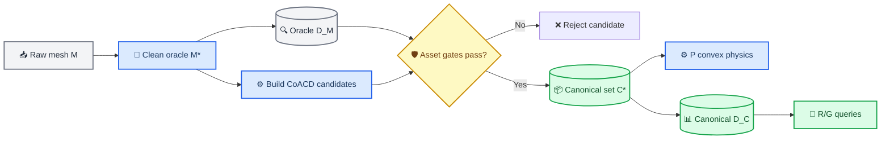

# E181 实验计划：CoACD canonical geometry 与 PRG 同源验证

_CORE4D Phase 44 · 2026-07-31 · E178 bucket003/004/007 ·
Plan → Implement → Evaluate → Log；本计划不启动 RL_

---

## 📋 Context 与实验问题

E178 通过 handcraft 的 `5/1/5` box proxy 同时服务 physics 与
box-union SDF，保持了 `P=R=G` 的几何一致性，但共同几何本身会填充真实
bucket cavity，并包含 object-specific 分段与缩放。E178 Full 的六个物理门
通过 `16/27`，加入 tracking 后十二门通过 `10/27`；已人工审查的 23 条中
`USE=12 / DO_NOT_USE=11`。这些结果说明 collider 是值得验证的瓶颈，但不是
tracking、candidate selection 和下游可用率的唯一原因。

前置调研已经裁决：MuJoCo 中 production 首选是多个 convex geoms 组成的
compound convex；普通单 mesh geom 的碰撞不保留 bucket 凹性。CoACD 是当前
最成熟的开源自动基线，但仍需要 cavity、contact 与 runtime 的任务化
约束。[^1][^2][^3]

本实验冻结如下主路线：

```text
raw visual mesh M
  → minimal-cleaned oracle mesh M*
  → original-mesh oracle D_M
  → CoACD candidates C_i
  → D_M + task-aware asset gates
  → selected canonical collision set C*
  → P: compound-convex MuJoCo/MJWarp physics
  → R/G: object-local canonical grid-SDF D_C
```

### 根因假设

E178 当前问题由四层耦合组成：

1. `C` 由 case contact 手工反推，缺少自动构建和 held-out 约束；
2. 现有 `object_collision_sdf_mode=union` 只允许 box，无法读取 convex mesh；
3. `mjwp.py` 的 reward、penalty 和 CEM gate 全部绑定 box-union SDF；
4. E170–E178 的 `combined-valid=0/N` 表明 G 可能继续依赖
   `least_violation` fallback，不能用 collider 改进掩盖 candidate-health
   问题。

### 核心 insight

实验的 source of truth 不是 visual mesh 文件名，也不是某一种 runtime
数据结构，而是通过 asset gates 后冻结的数学集合 `C*`：

```text
occupied(P collider) ≈ {x | D_C(x) <= 0}
```

`D_M` 只回答“`C*` 是否足够接近真实 bucket”；`D_C` 只回答“R/G 是否准确
查询 P 实际使用的 `C*`”。两种验证不能合并成一个距离指标。

## 🎯 Claims

### 资产、距离场与兼容性 Claims

| Claim | 最低证据 |
|---|---|
| C0 authority | E181 Full 是 E178 canonical Full manifest 的不可变投影：27 条 case、物理行序、输入路径与输入 SHA 逐行一致，分布 `9/4/14`；dev3 与 heldout24 无交集；E178 原资产和结果 SHA 不变 |
| C1 oracle | 三个 `M*` 均可复现、watertight、winding-consistent、无零体积碎片；保留主组件顶点不移动；`D_M` 无非有限值和符号歧义 |
| C2 CoACD reproducibility | 版本、commit/release、seed、real-metric 参数、输入/输出 SHA 全冻结；重复构建 hull 数、顶点与抽样 occupancy 一致 |
| C3 asset fidelity | `C_i↔D_M` 双向 surface、cavity free-space、must-cover、normal 与 dev3 contact-excess 全过硬门；最终按最小 hull 数词典序选择 `C*` |
| C4 canonical SDF | `D_C` manifest 引用 `C*` hull SHA；sign、zero-surface、距离误差和 CPU/CUDA parity 全过门；grid error budget 进入 G |
| C5 legacy compatibility | E178 box backend 默认行为逐值不变；旧配置不需要新增字段；non-box 只在显式 `grid_sdf` backend 下放行 |

### Physics、候选与 downstream Claims

| Claim | 最低证据 |
|---|---|
| C6 physics contract | CPU MuJoCo 与 MJWarp 3.7 均编译；robot–object pair 精确覆盖 `18×K`；object mass/inertia、friction、joint、solver 参数与 E178 一致 |
| C7 oracle contact | 固定姿态与短 rollout 中，`C*` 相对 original-mesh oracle 的 contact precision/recall、normal error 和 must-stay-free false contact 全过门 |
| C8 throughput | 同设备交错 A/B 的 dev3 `64×4` runtime 3/3 PASS；strict median `≤3.0s`，且 E181/E178 ratio 不退化 |
| C9 G health | dev3 每条均产生真实 combined-valid candidates，post-hoc gate 重算与 selected-valid 一致，fallback 不再成为默认选择路径 |
| C10 downstream | 27 条 `1024×32` 完整产出；六门与十二门不低于 E178，各 object 不退化，几何相关 failure 与盲审净偏好支持 E181 |

> ⚠️ **归因边界：** C1–C8 通过但 C9/C10 失败时，只能声明资产或 backend
> 可用，不能声明 E181 collider 提高了轨迹可用率。

## 📚 Authority、变量与冻结范围

### 实验集合

| 集合 | Case | 用途 |
|---|---|---|
| dev3 | `bucket003_20231018_001_p1` | bucket003 asset/contact/canary |
| dev3 | `bucket004_20231002_021_p1` | bucket004 asset/contact/canary |
| dev3 | `bucket007_20231020_055_p1` | bucket007 asset/contact/canary |
| heldout24 | E178 Full 除 dev3 外的 24 条 | contact fidelity、CEM 泛化 |
| full27 | E178 `semantic_bucket_full_manifest.tsv` 的同序 27 条 | 最终 paired authority |

E178 canonical source 固定为：

```text
workspace/core4d/results/E178/s6_downstream/manifests/
  semantic_bucket_full_manifest.tsv
sha256 =
  de9a3d165301318049da208aad52b1f5bc4d3ed671631f0097958734a0f022a8
```

E181 Full manifest 必须由上述文件生成，不允许手写另一份 case list。以下字段
逐行 exact match：

- `ordinal/case_id/object_key/date/seq/person`；
- `retarget_variant_id/selected_retarget_variant_id/rescue_of`；
- `target_variant_id/hand_collision_variant_id/contact_mask_label`；
- `target_task/target_scene/trajectory/contact_mask`；
- `base_scene_sha256/trajectory_sha256/contact_mask_sha256`；
- `cem_samples/cem_opt_steps/cem_seed`。

只允许 E181 的 method、override、effective scene、collision asset、输出路径、
worker owner、状态和时间戳不同。禁止增删、替换、rescue 或重排任一 Full row。
E178 的 `ordinal` 有跳号，仅用于来源追溯；所有 E181 分片都使用 canonical
文件物理行序生成的连续 `authority_row_index=1..27`。

CoACD 参数和 `C*` 只能使用：

- `M*` 的全局与分层几何指标；
- 由 `D_M` 定义的通用 cavity free-space；
- dev3 的 raw-contact 与 swept-volume 证据。

heldout24 在 `C*` 冻结后才能解封。heldout24 指标失败时不得回头修改同一个
E181 的 hull、阈值或语义 mask；任何第二轮资产设计必须新开实验号。

### 实验变体

| Variant | Physics P | Reward/Gate R/G | 角色 |
|---|---|---|---|
| A | E178 `5/1/5` boxes | exact box-union SDF | frozen baseline |
| B | CoACD selected `C*` | canonical grid-SDF `D_C` | production candidate |
| O | cleaned original-mesh SDF | oracle query only | low-batch fidelity oracle |

Variant O 不进入 Full CEM，不与 B 竞争 throughput winner。

### 必须冻结的控制变量

| 类别 | 冻结值或合同 |
|---|---|
| CEM | `seed=0, 1024 samples × 32 opt steps` |
| Canary | dev3，`64 samples × 4 opt steps` |
| Input | Full case/order、trajectory、contact mask、target、retarget variant 与 E178 逐行一致 |
| R/G | reward 公式、权重、名义 gate threshold、时间 mask 与 E178 一致 |
| P | MuJoCo/MJWarp 版本、timestep、friction、`solref`、`condim` 一致 |
| Object dynamics | compiled `body_mass/body_inertia`、joint damping/armature 一致 |
| Robot geometry | rubber-hand mesh、18 个 robot collision geoms 与采样规则一致 |
| Full compute | 本地 1 GPU + `spider-remote` 的 RTX 6000 Ada GPU `0/1`；三个 worker 各 9 条 |
| Viewer/eval | 同一 renderer、十二门 evaluator 与 review player |

### E181 v1 明确不改变的内容

- 不新增 `D_inner/D_outer/D_rim` runtime reward；
- 不调整 hand/leg/body gate 的名义阈值；
- 不升级 MJWarp 3.7；
- 不修改 `least_violation` 算法，只把 fallback 使用率升级为 release gate；
- 不启动 RL；
- 不人工编辑某个 hull 使其过门。

inner、outer、rim 只作为离线 audit strata；它们不是 E181 v1 的新 reward
channel。

## 🔗 Canonical architecture 与同源合同



### 几何对象定义

| 符号 | 定义 | Runtime 消费者 |
|---|---|---|
| `M` | 原始 visual OBJ | 不直接消费 |
| `M*` | 删除退化碎片后的最小清洗 mesh | oracle 构建 |
| `D_M` | exact nearest-triangle distance +可靠 inside/outside sign | asset audit |
| `C_i` | 一组 CoACD convex hull union | candidate audit |
| `C*` | 通过硬门后 hull 数最小的 `C_i` | P 与 `D_C` source |
| `D_C` | 从 `C*` 烘焙的 object-local solid grid-SDF | R 与 G |

bucket004/007 已知含少量零体积退化组件。清洗只能：

- 删除零面积面、未引用顶点和零体积 disconnected fragments；
- 统一 winding；
- 保留主组件的顶点坐标与三角面不变。

禁止 smoothing、remesh、scale correction 或人工补洞。若最小清洗后主组件
仍无法定义可靠 sign，Gate A 失败，先修复 oracle 计划，不运行 CoACD。

### Source-of-truth manifest

每个 object 的 production manifest 至少包含：

```json
{
  "object_key": "bucket003",
  "raw_mesh_sha256": "...",
  "clean_mesh_sha256": "...",
  "coacd_version": "...",
  "coacd_seed": 1,
  "coacd_params": {},
  "hull_sha256": ["..."],
  "canonical_set_sha256": "...",
  "grid_sha256": "...",
  "grid_origin_object": [0.0, 0.0, 0.0],
  "voxel_size_m": 0.005,
  "sign_convention": "negative_inside",
  "epsilon_grid_m": 0.0,
  "semantic_version": "solid_v1"
}
```

启动时必须同时核对：

```text
scene loaded hull SHA
  = canonical_set manifest hull SHA
  = D_C manifest source hull SHA
  = effective config expected hull SHA
```

任一 mismatch 直接 fail-closed。

### G 的误差预算

若离线验证得到：

```text
|D_C(x) - D_exact_C(x)| <= epsilon_grid
```

则安全 gate 使用保守下界：

```text
D_lower(x) = D_C(x) - epsilon_grid
```

名义 threshold 不变；effective config 同时记录名义 threshold、
`epsilon_grid` 和实际比较 threshold。Reward 使用连续 `D_C`，不对其做
离散 hard clipping。

## ⚙️ 分阶段实验与 stop/go gates

### S0：Authority 与环境 preflight

执行：

1. 校验 E178 Full manifest SHA，并以不可变投影生成 frozen
   full27、dev3、heldout24；
2. 记录当前 Git HEAD、dirty scope、MuJoCo/MJWarp/CUDA/GPU 信息；
3. 在 `pyproject.toml` 明确 pin CoACD 与 trimesh，更新 `uv.lock`；
4. 运行 CoACD import、real-metric 参数、MuJoCo convex mesh 与 SDF compile
   probe；
5. 冻结 E178 baseline file SHA，不修改历史 log/result。

Gate 0：

- full/dev/heldout 精确为 `27/3/24`；
- full27 ordered `case_id`、authority fields 和输入 SHA 与 E178 逐行一致；
- E181/E178 manifest 差异只出现在显式 allowlist 字段；
- dev 与 heldout 交集为 0；
- 三个 raw OBJ 和 27 条输入路径存在；
- dependency version 可追溯；
- CPU MuJoCo 与 MJWarp 3.7 probe 均通过。

失败即停止，不创建 production candidate。

### S1：构建 `M*` 与 `D_M`

对 bucket003/004/007：

1. 输出 raw component inventory；
2. 删除已识别的零体积 fragments；
3. 检查 watertight、winding、volume、AABB、scale 和 component 数；
4. 建立 exact triangle-distance + winding/contains sign query；
5. 用已知 inside/outside、near-surface 与随机点验证 sign；
6. 输出主轴切片、component overlay 和清洗前后差异图。

Gate A：

| 指标 | 硬门 |
|---|---:|
| retained vertex displacement | `0` |
| retained face change | `0` |
| zero-volume components after clean | `0` |
| watertight / winding-consistent | `true / true` |
| finite distance queries | `100%` |
| sign agreement outside 1mm band | `≥99.99%` |
| visual review | 3/3 approved |

若需要 remesh 或形状修补，必须新版本化 `M*` 并重新经过 Gate A；不允许静默
修复。

### S2：CoACD sweep 与 asset selection

固定参数网格：

| 参数 | 候选 |
|---|---|
| `threshold_m` | `0.005 / 0.010 / 0.020` |
| `max_convex_hull` | `8 / 16 / 32` |
| `max_ch_vertex` | `32 / 64` |
| seed | `1` |
| input scale | scene real meters |

总计 `3 objects × 18 configs = 54` 个候选。每个候选冻结：

- 完整 CoACD 参数与 merge/decimate 标记；
- hull/vertex/face 数；
- 每个 part OBJ SHA；
- measured concavity/fidelity；
- 是否因 max-hull merge 超出 threshold；
- build wall time 与 peak memory。

选择规则不用加权总分：

1. 拒绝所有未通过 hard fidelity/task gates 的候选；
2. 在剩余候选中选择 hull 数最少者；
3. hull 数相同时选 must-free false-positive 更低者；
4. 仍相同时选双向 surface p99 更低者；
5. 仍相同时选 `threshold_m` 更严格者。

Gate B：

| 指标 | dev/select 硬门 | heldout 解封门 |
|---|---:|---:|
| `M*→C` surface p90 / p99 | `≤15mm / ≤30mm` | 同左 |
| `C→M*` surface p90 / p99 | `≤15mm / ≤30mm` | 同左 |
| must-cover recall within 15mm | `≥98%` | `≥98%` |
| must-stay-free core false occupied | `0` | `0` |
| broader cavity false occupied | `≤0.1%` | `≤0.1%` |
| surface normal error p90 | `≤20°` | `≤20°` |
| contact excess over `D_M` p90 | `≤10mm` | `≤15mm` |
| max hulls / vertices per hull | `≤32 / ≤64` | frozen |

其中 contact excess 定义为：

```text
max(0, distance(target, C) - distance(target, M*))
```

这样不会把 ref-FK target 自身相对 visual mesh 的偏差误算成 collider 误差。

如果三个 object 任一在 `K≤32` 下无候选通过，E181 标记
`ASSET_REJECTED`，不临时放宽 cavity 或 contact gate。

### S3：烘焙 `D_C` 与 object-distance backend

对冻结的 `C*` 按从粗到细顺序测试：

```text
voxel_size_m = 10mm → 5mm → 2.5mm
grid_margin_m = 50mm
storage dtype = float32 authority
sign = negative_inside
```

选择满足所有门的最粗 grid，以减少显存和 trilinear-query 成本。
float16 只能作为额外 benchmark，未通过独立 parity 前不能成为 authority。

Grid exactness 使用每个 object 至少 `1,000,000` 个 deterministic stratified
points：

- uniform AABB；
- `C*` zero-surface 两侧；
- inner/outer/rim audit strata；
- cavity free-space；
- dev3/heldout contact 与 robot swept points。

Gate C：

| 指标 | 硬门 |
|---|---:|
| sign disagreement outside `2h` band | `0` |
| `|D_C-D_exact_C|` p99 | `≤h` |
| `|D_C-D_exact_C|` max | `≤2h` |
| zero-surface symmetric p99 | `≤1.5h` |
| CPU/CUDA float32 max abs diff | `≤1e-5m` |
| non-finite query | `0` |
| out-of-grid behavior | explicit fail，不 clamp |
| grid payload | `≤64MiB/object` |
| hull SHA contract | 3/3 exact |

Backend 必须复用 E178 的 robot geometry sampling contract：

- sphere：center query 后减 radius；
- capsule：沿轴 `-half/0/+half` 三点取最小值后减 radius；
- mesh：沿用 `MESH_SDF_SAMPLE_COUNT` 和 deterministic vertex indices；
- geom group：沿用 tick-local cache 与 group batching；
- consumer：robot/leg/hand penalty、hand support、surface band、body/hand/leg
  CEM gate、carry corridor、terminal carry gate 全部走同一 backend。

Legacy `box_union` 回归必须 `atol=rtol=0`；不能以 grid 误差容忍旧路径漂移。

### S4：Compound-convex physics 与 oracle contact

每个 hull 作为一个 convex mesh geom 挂在同一 `object` body：

- 命名 `object_collision_000...K-1`；
- 18 个 robot collision geoms 与每个 hull 显式配对；
- hand pair 保持 `friction="2 1", condim="4", solref="0.008 1"`；
- non-hand pair 保持 E178 margin/gap/condim；
- object-floor contact 对全部 hull 生效；
- visual geom 保持 `contype=0/conaffinity=0`。

Gate D 分三层：

1. **编译合同**
   - CPU MuJoCo 与 MJWarp `put_model` 3/3；
   - object geom 数=`K`，robot–object explicit pair=`18×K`；
   - pair coverage 无 missing/duplicate；
   - compiled body mass/inertia、joint damping/armature 与 E178 exact match。
2. **静态 contact oracle**
   - 每 object 至少 300 个 inner/outer/rim/free-space probe；
   - contact precision 与 recall 均 `≥0.95`；
   - normal angular error p90 `≤20°`；
   - must-stay-free core false contact=`0`。
3. **短 rollout**
   - dev3 固定输入、低 world-count；
   - 无 NaN、contact overflow、missing rubber-hand collision；
   - drop/slide/support probes 3/3 object stable；
   - object state transition 可复现。

若 CPU mesh-SDF oracle 对某类 robot geom 不产生有效 contact evidence，不以
“编译成功”替代；该 probe 改用几何 overlap/normal oracle，并在结果日志明确
标记 evidence type。

### S5：dev3 A/B canary 与 G health

每个 dev3 case 在它被分配的设备上按 `A-B-B-A` 顺序交错运行，至少三轮，
避免把 GPU warm-up 和系统波动误当 backend 差异。部署映射固定为：

| dev3 case | 设备 |
|---|---|
| `bucket007_20231020_055_p1` | 本地单卡 |
| `bucket003_20231018_001_p1` | 远程 RTX 6000 Ada GPU 0 |
| `bucket004_20231002_021_p1` | 远程 RTX 6000 Ada GPU 1 |

E181/E178 ratio 始终在同一 case、同一设备内计算；不同 GPU 的绝对耗时不直接
混为一个总体均值。

执行层级：

1. `1 world × short rollout` runtime correctness；
2. dev3 `64×4` canary；
3. `1024×2` production-density probe；
4. post-hoc 重算每个 optimization step 的 body/hand/leg/combined gate；
5. 校验三台 worker 读取相同 Git HEAD、dependency lock、full manifest、
   `C*` 与 `D_C` SHA。

Gate E：

| 指标 | 硬门 |
|---|---:|
| runtime correctness | 3/3 PASS |
| canary median plan time | 每条 `≤3.0s` |
| E181/E178 median ratio | 每条 `≤1.05` |
| E181/E178 p90 ratio | 每条 `≤1.10` |
| density probe ratio | `≤1.10` |
| peak VRAM 增量 | `≤1GiB` |
| three-worker deployment | 本地/Ada0/Ada1=`3/3 PASS` |
| code/input/asset SHA parity | `3/3 exact` |
| combined-valid availability | 每条 `≥90%` opt steps |
| fallback fraction | 每条 `≤10%` opt steps |
| selected-valid post-hoc mismatch | `0` |

`3.0s` 以上只能保留为 strict FAIL。若用户认为轻微超门可接受，必须使用
默认关闭、带理由且写入 execution manifest 的显式 waiver；不能修改 gate
JSON 或把 waiver 写成 strict PASS。

如果 G health 仍为 `0/N`，E181 停在 `GATE_HEALTH_BLOCKED`：保留已经通过的
asset/backend/physics 结果，但不启动 Full，并新开独立的 candidate
feasibility 计划。

### S6：Full 27 paired CEM、评测与盲审

只有 Gate 0–E 全部通过或用户对 throughput 做了显式 waiver，才能：

1. 校验 E178 source manifest SHA，生成同 case、同序、同输入的 E181
   full27 authority；
2. snapshot 27 条 base scene、E181 sidecar、override、`C*` 与 `D_C`；
3. 为 authority row 增加连续 `authority_row_index=1..27`；
4. 生成固定三卡 allocation 与三个互斥 worker queues；
5. 同时启动本地单卡和远程两张 RTX 6000 Ada，共 3 个串行 worker；
6. 执行 27 条 `1024×32`，逐条验证 result/outdir/config/log/runtime；
7. 回收远程结果并进行 27-row merge/completion audit；
8. 用公共 `eval.core.core_metrics` 和 E178 十二门口径评测；
9. 渲染 27 条 ref/physics 双画面；
10. 使用 `video-frames` 提取固定时间比例关键帧；
11. 将 A/B 隐去 variant 名称后进行完整时间序列人工盲审；
12. 分别报告 full27 与 heldout24。

三卡 allocation 不使用 E178 的稀疏 `ordinal` 取模，而对 manifest 物理行序
取模：

```text
worker_slot = (authority_row_index - 1) mod 3
0 → local-gpu
1 → remote-ada0
2 → remote-ada1
```

| Worker | Host/device | `authority_row_index` | Rows |
|---|---|---|---:|
| `local-gpu` | 本地 `${LOCAL_GPU}` | `1,4,7,...,25` | 9 |
| `remote-ada0` | `spider-remote`, GPU 0 | `2,5,8,...,26` | 9 |
| `remote-ada1` | `spider-remote`, GPU 1 | `3,6,9,...,27` | 9 |

每张 GPU 内严格串行，三张 GPU 之间并行。每条 row 的 result、outdir、config
和 log 路径必须唯一；不允许 work stealing 或同一 row 双写。三卡 launch
前必须重新检查本地选定 GPU、远程 GPU `0/1` 的显存、compute process 与
任务归属；任一 worker 不可用时不以两卡或单卡静默启动正式 Full。

三台 worker 必须使用同一 Git HEAD、`uv.lock`、authority manifest、
production asset manifest、`C*` hull SHA 和 `D_C` SHA。设备型号、GPU UUID、
driver/CUDA、启动时间和 worker PID 写入 execution manifest。远程 pull
只回收 `remote-ada0/1` 登记的 18 条；最终 merge 要求三个 queue 的并集
恰为 27、两两交集为空。

Gate F：

| 指标 | E178 baseline | E181 硬门 |
|---|---:|---:|
| Full completion | `27/27` | `27/27` |
| 六个物理门 | `16/27` | `≥16/27` |
| 十二门 | `10/27` | `≥10/27` |
| bucket003 十二门 | `3/9` | `≥3/9` |
| bucket004 十二门 | `2/4` | `≥2/4` |
| bucket007 十二门 | `5/14` | `≥5/14` |
| hand penetration failures | `6` | `≤6` |
| contact failures | `3` | `≤3` |
| lower-body failures | `3` | `≤3` |
| geometry failure improvement | — | 至少一类减少 `≥2 cases` |
| blind manual net preference | — | `B wins - B losses ≥3` |
| object-level manual regression | — | 三对象均不得负净偏好 |

连续指标同时报告 paired delta、bootstrap 95% CI；pass/fail 迁移报告
McNemar exact，不用单一总分替代逐门结果。

若十二门非劣但盲审无净偏好，结论为 `CEM_MIXED`，不默认替换 E178。

## 🔧 实现改动与文件清单

### 公共代码

| 文件 | 计划改动 |
|---|---|
| `pyproject.toml` | 显式 pin CoACD 与 trimesh |
| `uv.lock` | 冻结依赖与 transitive hashes |
| `spider/geometry/__init__.py` | 新 geometry package |
| `spider/geometry/grid_sdf.py` | manifest、grid loader、object-local trilinear query、OOB fail |
| `spider/simulators/mjwp_object_distance.py` | `BoxUnionBackend` 与 `GridSDFBackend`、robot geom reductions |
| `spider/config.py` | 解耦 collision geom resolver 与 distance backend；新增 manifest/SHA/error fields |
| `spider/simulators/mjwp.py` | 所有 R/G consumer 改读统一 backend；保留 legacy wrapper |
| `spider/simulators/mjwp_test.py` | backend config、CPU/CUDA 与 legacy regression |

建议配置合同：

```yaml
object_collision_geom_mode: union
object_distance_backend: grid_sdf
object_distance_manifest: workspace/core4d/results/E181/s3_canonical_sdf/bucket003/manifest.json
object_distance_expected_asset_sha256: "<C-star-sha>"
object_distance_error_bound_m: "<measured>"
object_collision_sdf_mode: union  # legacy-only；旧配置继续可读
```

`resolve_object_collision_geom_ids()` 可以为 physics 接受 convex mesh union；
只有 `BoxUnionBackend` 自身继续对 non-box fail-closed。禁止简单删除当前
non-box 检查后让旧 box query 误读 mesh。

### 实验构建与测试

| 文件 | 计划职责 |
|---|---|
| `scripts/experiments/E181/build_oracle_meshes.py` | `M→M*`、component manifest、D_M query |
| `scripts/experiments/E181/build_coacd_candidates.py` | 54 个候选、参数/SHA manifest |
| `scripts/experiments/E181/evaluate_asset_fidelity.py` | 双向、cavity、contact-excess、normal gates |
| `scripts/experiments/E181/select_canonical_set.py` | hard-gate 后词典序冻结 `C*` |
| `scripts/experiments/E181/bake_canonical_sdf.py` | multi-resolution grid、error manifest |
| `scripts/experiments/E181/build_e181_production.py` | E178 authority 投影、27 sidecar/override/manifest 与 pair matrix |
| `scripts/experiments/E181/build_full_allocation.py` | 连续 row index、固定 `9/9/9` queue 与 disjoint audit |
| `scripts/experiments/E181/run_cem_queue.py` | 单 GPU 串行 queue、runtime resume、row status、skip-complete |
| `scripts/experiments/E181/test_oracle_mesh.py` | cleanup 与 sign fixtures |
| `scripts/experiments/E181/test_coacd_assets.py` | determinism、convexity、SHA、budget |
| `scripts/experiments/E181/test_grid_sdf.py` | exactness、OOB、CPU/CUDA parity |
| `scripts/experiments/E181/test_distance_backend.py` | sphere/capsule/mesh、consumer、legacy exact |
| `scripts/experiments/E181/test_scene_contract.py` | mass/inertia、pairs、contacts、compile |

所有测试脚本遵循现有 direct-main 风格，可通过 `uv run python <script>` 单独
执行；不依赖当前环境中缺失的 pytest。

### Eval、render 与报告

| 文件 | 计划职责 |
|---|---|
| `scripts/eval/runners/eval_E181_asset_fidelity.py` | Gate A/B |
| `scripts/eval/runners/eval_E181_sdf_consistency.py` | Gate C |
| `scripts/eval/runners/eval_E181_contact_oracle.py` | Gate D |
| `scripts/eval/runners/eval_E181_canonical_geometry.py` | Gate E/F 与 paired metrics |
| `scripts/eval/wrappers/eval_E181_asset_fidelity.sh` | 资产评测入口 |
| `scripts/eval/wrappers/eval_E181_sdf_consistency.sh` | grid 评测入口 |
| `scripts/eval/wrappers/eval_E181_contact_oracle.sh` | contact 评测入口 |
| `scripts/eval/wrappers/eval_E181_canonical_geometry.sh` | canary/full 评测入口 |
| `scripts/eval/reports/gen_E181_canonical_geometry_report.py` | Markdown/TSV/JSON 汇总 |

新公共连续指标如需进入 `core_metrics.py`，必须通过 `EvalConfig` 参数化并更新
`METRIC_FIELDS`；实验特有的 asset/grid 字段保留在 E181 evaluator，不污染
所有历史实验。

### Launch、pull 与 snapshot

| 文件 | 计划职责 |
|---|---|
| `scripts/launch/active/run_E181_local.sh` | S0–S4、本地 canary 与 9-row Full queue |
| `scripts/launch/active/run_E181_remote_a6000.sh` | RTX 6000 Ada GPU `0/1` canary 与两个 9-row queues |
| `scripts/launch/active/run_E181_full_3gpu.sh` | 冻结 allocation，并发启动本地 1 卡与远程 2 卡 |
| `scripts/launch/active/pull_E181_remote_a6000_results.sh` | execution-manifest scoped 18-row pull |
| `scripts/launch/active/watch_E181.sh` | 同时监控本地与远程 session，不修改 authority |
| `scripts/launch/active/run_E181_render_all.sh` | 27 条视频和 keyframes |

Generic `snapshot_scenes.sh` 只覆盖 base `scene.xml/scene_act.xml`。E181 launcher
还必须把生成的 E181 sidecars、convex parts、`D_C`、override 和 manifest
复制到 `results/E181/scene_snapshot/production/`，并记录 Git HEAD 与 SHA。

## 📊 指标、产物与成功标准

### 结果目录

```text
workspace/core4d/results/E181/
├── s0_environment/
│   ├── dependency_manifest.json
│   └── authority_manifest.json
├── s1_oracle/
│   └── {bucket003,bucket004,bucket007}/
│       ├── cleaned.obj
│       ├── oracle_manifest.json
│       └── visual_evidence/
├── s2_coacd/
│   └── {object}/{candidate_id}/
│       ├── parts/
│       ├── manifest.json
│       └── fidelity.json
├── s2_asset_eval/
│   ├── candidate_metrics.tsv
│   ├── pareto_summary.json
│   └── selected_canonical_sets.json
├── s3_canonical_sdf/
│   └── {object}/
│       ├── solid_sdf.npz
│       ├── manifest.json
│       └── consistency_metrics.json
├── s4_physics_oracle/
├── scene_snapshot/
│   └── production/
├── s6_downstream/
│   ├── manifests/
│   │   ├── {dev3,heldout24,full27}.tsv
│   │   ├── e178_source_manifest.sha256
│   │   ├── full27_worker_allocation.tsv
│   │   └── worker_queues/{local_gpu,remote_ada0,remote_ada1}.tsv
│   ├── benchmark/
│   ├── cem/{canary,full}/
│   ├── eval/{canary,full}/
│   └── render/full/
└── completion_audit/
```

Runtime logs：

```text
logs/E181/
├── build/
├── canary/
├── full/{local_gpu,remote_ada0,remote_ada1}/
└── render/
```

### 必须生成的可视化

Gate A/B/C/D 至少生成：

- raw vs cleaned component overlay；
- `M*`、E178 boxes、`C*` 三方四视角 overlay；
- bucket 主轴 XY/XZ/YZ cross-sections；
- cavity false-positive heatmap；
- must-cover/contact-excess heatmap；
- `D_exact_C=0` 与 `D_C=0` overlay；
- static contact normals overlay。

54 个候选只需为 hard-pass/Pareto survivors 生成完整 montage；最终 `C*`
必须 3/3 人工批准。Full 视频必须抽取 `10/30/50/70/90%` 五个时间点并实际
观察，不能只验证编码可播放。

### Completion audit

最终 audit 至少验证：

| 范围 | 条件 |
|---|---|
| Authority | E178 source SHA exact；ordered full27 fields/SHA exact；dev3/heldout24/full27=`3/24/27` |
| Assets | raw/clean/hull/grid SHA 链闭合 |
| Scene | 27 sidecar compile、pair、mass/inertia parity |
| Allocation | local/Ada0/Ada1=`9/9/9`；queue union=`27`、pairwise overlap=`0` |
| Environment | 三 worker 的 Git/lock/authority/asset SHA=`3/3 exact` |
| Runtime | result/outdir/config/log=`27/27` |
| Eval | full/heldout 表完整、0 missing/error |
| Render | MP4 与五帧证据=`27/27` |
| Decision | C0–C10 均有 PASS/FAIL 与 evidence path |

## 🚀 固化执行入口

实现完成后只允许通过本地脚本运行，不在日志里保存不可复现的裸命令。

### 本地资产与 backend

```bash
bash workspace/core4d/scripts/launch/active/run_E181_local.sh preflight
bash workspace/core4d/scripts/launch/active/run_E181_local.sh oracle
bash workspace/core4d/scripts/launch/active/run_E181_local.sh coacd
bash workspace/core4d/scripts/launch/active/run_E181_local.sh grid
bash workspace/core4d/scripts/launch/active/run_E181_local.sh physics
```

### 评测

```bash
bash workspace/core4d/scripts/eval/wrappers/eval_E181_asset_fidelity.sh
bash workspace/core4d/scripts/eval/wrappers/eval_E181_sdf_consistency.sh
bash workspace/core4d/scripts/eval/wrappers/eval_E181_contact_oracle.sh
bash workspace/core4d/scripts/eval/wrappers/eval_E181_canonical_geometry.sh canary --require-all
```

### Canary 与 Full

```bash
bash workspace/core4d/scripts/launch/active/run_E181_local.sh canary
bash workspace/core4d/scripts/launch/active/run_E181_remote_a6000.sh canary
bash workspace/core4d/scripts/launch/active/pull_E181_remote_a6000_results.sh canary

# 仅 Gate E 通过后
bash workspace/core4d/scripts/launch/active/run_E181_full_3gpu.sh full
bash workspace/core4d/scripts/launch/active/watch_E181.sh full
bash workspace/core4d/scripts/launch/active/pull_E181_remote_a6000_results.sh full
bash workspace/core4d/scripts/eval/wrappers/eval_E181_canonical_geometry.sh full --require-all
bash workspace/core4d/scripts/launch/active/run_E181_render_all.sh
```

Canary 的三个独立 case 分别覆盖本地单卡、远程 Ada GPU 0 和 GPU 1；本地卡
保留 bucket007 关键 case 用于快速诊断。正式 Full 只允许由
`run_E181_full_3gpu.sh` 从冻结 allocation 启动，不能分别手工拼接三个 queue。
GPU 分配必须在 launch 前重新记录可用性和 process snapshot，不继承 E178
当日的设备状态。

## ⚠️ 风险、失败协议与非目标

### 风险与预案

| 风险 | 观测 | 预案 |
|---|---|---|
| Oracle sign 不可靠 | watertight/sign gate fail | 停在 S1，版本化修复 `M*` |
| CoACD 填 cavity | must-free false occupied | 拒绝候选，不人工削 hull |
| `K≤32` 无解 | Gate B 无候选 | `ASSET_REJECTED`，请求新预算/方法 |
| Grid 精度不足 | 2.5mm 仍 fail | 转 sparse/multi-resolution 新实验 |
| Grid OOB 被隐藏 | border clamp/finite 假值 | runtime hard error |
| Pair 漏覆盖 | pair count/active contact mismatch | 停在 S4 修 builder |
| Dynamics 漂移 | mass/inertia/friction mismatch | 停止，不跑 contact |
| Hull 过多拖慢 P | A/B ratio 或 3s fail | 依据 profiling 降 complexity，不降 fidelity gate |
| G 仍空交集 | combined-valid `0/N` | `GATE_HEALTH_BLOCKED`，新开 G 实验 |
| heldout24 退化 | contact/CEM heldout fail | 不回调 E181 参数，不晋级 |
| 本地或 Ada worker 不可用 | 三卡 preflight/handshake fail | 不静默降为两卡；等待资源后原 allocation 启动 |
| 跨主机环境漂移 | Git/lock/asset SHA mismatch | fail-closed，同步后重做 preflight |
| Tracking 未改善 | 十二门无增益 | 如实判 mixed，不归罪/归功 collider |

### 三次失败协议

同一 blocking condition：

1. 第一次：保存完整 evidence，诊断 oracle/backend/pair/runtime 层；
2. 第二次：改变针对性方法，不重复同一参数；
3. 第三次：停止该阶段，回顾 Claims 与基础假设，向用户汇报。

禁止三轮后继续靠放宽阈值、提高 hull budget 或增加 GPU 掩盖失败。

### 本计划不做

- 不把 `D_M` 接入 production reward 或 CEM gate；
- 不把一个普通 mesh geom 当 non-convex collider；
- 不以 CoACD threshold 代替 measured fidelity；
- 不复用同一 27 条 contact target 一边调参一边宣称泛化；
- 不把 throughput waiver 写成 strict PASS；
- 不在 combined-valid 空集时静默完成 Full；
- 不修改 E178 已完成日志和结果；
- 不在 E181 内加入 semantic surface reward、MJWarp upgrade 或 RL training。

## ✅ 决策、记录与参考

### 最终状态枚举

| 状态 | 含义 |
|---|---|
| `ORACLE_BLOCKED` | `M* / D_M` 不可靠 |
| `ASSET_REJECTED` | `K≤32` 无 CoACD candidate 过 Gate B |
| `BACKEND_BLOCKED` | `D_C` 或 legacy regression 未过 Gate C |
| `PHYSICS_BLOCKED` | pair/dynamics/contact oracle 未过 Gate D |
| `CANARY_BLOCKED` | runtime/throughput 未过 Gate E |
| `GATE_HEALTH_BLOCKED` | combined-valid/fallback 未过 Gate E |
| `CEM_MIXED` | Full 完成但 numeric/visual 无明确净收益 |
| `PROMOTE_CANDIDATE` | C0–C10 全过，可提议替换 E178 bucket collider |

即使 `PROMOTE_CANDIDATE`，也只允许成为 bucket003/004/007 的 production
candidate；跨新 bucket 的泛化需要独立 held-out object 实验。

### 记录合同

- 计划：`plan/199_E181_coacd_canonical_geometry_plan.md`
- 执行中：持续更新 `progress.md`
- 结果日志预留：`log/245_E181_coacd_canonical_geometry_results.md`
- 结果完成后：更新 `EXPERIMENT_TRACKER.md` 与 `log/INDEX.md`
- Claims 全通过后才执行项目规定的 commit/push；失败或 mixed 时先记录并
  等待下一步决策

### 前置本地证据

- [E176 low-geom throughput](../log/235_E176_lowgeom_proxy_canary_results.md)
- [E178 geometry/contact gates](../log/237_E178_bucket_contact_aligned_proxy_gates.md)
- [E178 Full runtime](../log/239_E178_local_5090_hybrid_rebalance.md)
- [E178 tracking gates](../log/240_E178_tracking_error_numeric_gates.md)
- [E178 manual review](../log/241_E178_bucket_user_manual_review_results.md)
- [E178 non-convex review](../log/244_E178_nonconvex_mujoco_collision_review.md)

[^1]: MuJoCo. “Computation: Collision detection and convex decomposition.”
    https://mujoco.readthedocs.io/en/3.7.0/computation/index.html#collision-detection

[^2]: Wei, X. et al. (2022). “Approximate Convex Decomposition for 3D Meshes
    with Collision-Aware Concavity and Tree Search.” _ACM Transactions on
    Graphics_. https://doi.org/10.1145/3528223.3530103

[^3]: Wei, X. et al. “CoACD: Collision-aware Approximate Convex Decomposition.”
    https://github.com/SarahWeiii/CoACD
