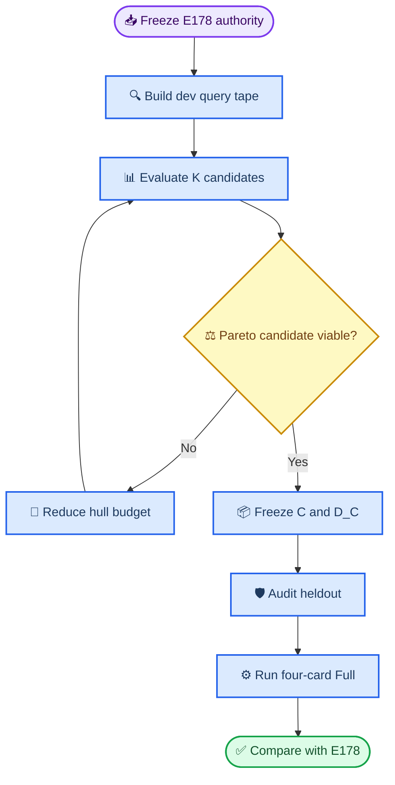

# E182 实验计划：Task-conditioned CoACD 与 E178 paired Full CEM

_Core4D Phase 45 · 2026-07-31 · planning only ·
本地单卡 + 远程 A100 GPU 3/6/7_

---

> 📌 **2026-08-01 口径修订：** hull budget 只测试 `K=8/16/32`，不新增
> `K=4`。heldout24 的含义改为“冻结前不用于选型，冻结后只用于评估”，不是
> 隐藏 case 名或跳过 Full。

## 📋 需求理解与实验问题

### 需求确认

本计划对后续需求的理解置信度为 `97%`。冻结目标是：

1. 不再使用 E181 的 `broader cavity false occupied≤0.1%` 作为一票否决；
2. 用 E178 真实 P/R/G 查询点验证 `C` 与 `D_C` 是否在任务分布上可用；
3. 在 `K=8/16/32` 间联合考虑 task accuracy 与 CEM throughput，必要时降低
   `max hulls`，不把最高几何精度默认等同于最佳 production 方案；
4. 只冻结一套 object-specific production geometry，随后 fresh 跑 E178 同一
   27 case、同 `seed=0, 1024×32` 的 E182 Full CEM；
5. 与 E178 做逐 case paired 指标、效率和盲审对比；
6. Full 使用本地一张 GPU 与 A100 `3/6/7` 四 worker 并行；远程允许和已有
   任务叠加，但不 kill、暂停或抢占其他任务。

剩余 `3%` 是必须在执行时测量、而非需要用户补充的状态：本地实际 GPU ID、
A100 三卡启动时的显存/负载，以及哪个 `K` 位于 task-accuracy–throughput
Pareto 前沿。

### 背景事实

| 项目 | 冻结事实 |
|---|---|
| E178 authority | 27 rows，bucket003/004/007=`9/4/14` |
| E178 manifest SHA | `de9a3d...f022a8` |
| E178 CEM | seed=`0`，samples=`1024`，steps=`32` |
| E178 六门 | `16/27` |
| E178 十二门 | `10/27` |
| E178 十二门分物体 | bucket003/004/007=`3/9, 2/4, 5/14` |
| E178 historical runtime | local≈`10.97s/record`；A100≈`25.61–30.15s/record` |
| E181 CoACD build | `54/54 BUILD_PASS` |
| E181 Gate B | 三物体均 `0/18`，未启动 Full |

E181 证明了当前 CoACD 候选不是构建失败，但全局 cavity gate 与 thin-wall
bucket 的实际任务需求错位。现在的问题不再是：

> `C` 是否在任意 cavity sample 上近似 `M*`？

而是：

> 在真实优化查询、真实接触和真实轨迹分布上，哪套最小 hull union 足以让
> P/R/G 保持可用，并在 Full CEM 中相对 E178 获得更好的质量–效率平衡？

### 核心假设

- **H1 task concentration**：E181 的全局 phantom 区域不一定落在 E178 实际
  P/R/G 查询密集区，因此全局 cavity error 不能直接代表任务误差；
- **H2 object-specific K**：三个 bucket 不需要统一 `K`，production set 可以
  是 bucket003/004/007 各自不同的实际 hull 数；
- **H3 diminishing returns**：从 `K=16` 增加到 `K=32` 的 task-query 收益可能
  小于 physics contact-pair 和 scene-step 的 throughput 成本；
- **H4 downstream authority**：只有同 27 case Full CEM 的 paired 结果，才能
  判断新碰撞体是否比 E178 handcraft proxy 更可用。

## 🎯 Claims 与最低证据

| Claim | 最低证据 |
|---|---|
| C0 authority | E182 full27 与 E178 27 行同序；case、trajectory、mask、retarget、target、seed 和 budget SHA exact |
| C1 canonical source | 每个物体的 P convex parts 与 R/G `D_C` 来自同一 `C_prod`，scene/config/grid/source SHA 一致 |
| C2 real-query tape | dev3 的 ref、E178 final trajectory 与 CEM sample query 100% 可恢复；P/R/G query families 均有坐标、consumer、frame/step provenance |
| C3 task-conditioned fidelity | 所有 production candidate 通过 technical launch floor；preferred task gate 与全局 cavity diagnostic 分开报告 |
| C4 Pareto selection | K8/16/32 至少各有一个候选完成 task audit；production set 由预注册 accuracy–runtime 规则选择，不按 Full 结果反向挑 K |
| C5 runtime validity | final candidate 在 local 与 A100 3/6/7 的 same-device E178/E182 probe 完成，无 OOM/NaN/覆盖，峰值显存与分项耗时完整 |
| C6 Full closure | E182 `27=completed+terminal_failed`、missing=`0`；正常目标 `27/27 completed` |
| C7 paired metrics | E178/E182 `27/27` 一一 join；六门、十二门、连续指标、迁移表和 bootstrap CI 完整 |
| C8 efficiency | 报告每 worker/case/record wall time、总 GPU-hours、makespan、P step 与 R/G query breakdown、相对 E178 ratio |
| C9 visual | E182 27/27 视频和 E178 paired 视频可播放；固定关键帧与完整时间序列均实际检查 |

C0–C9 是实验闭合标准，不要求 E182 必须优于 E178。科学结论允许
`PROMOTE`、`QUALITY_NONINFERIOR`、`QUALITY_PASS_EFFICIENCY_FAIL`、
`MIXED` 或 `REJECT`。

## 📚 Authority、变量与数据隔离

### Case authority

唯一 Full source：

```text
workspace/core4d/results/E178/s6_downstream/manifests/
  semantic_bucket_full_manifest.tsv
```

E182 builder 必须生成不可变投影并断言：

```text
rows                         = 27
unique case_id               = 27
bucket003/004/007            = 9/4/14
cem_samples/steps/seed       = 1024/32/0
trajectory/contact-mask SHA  = E178 exact
retarget/target/scene source = E178 exact
```

E178 结果目录、指标、视频和人工字段全程只读。

### Dev 与 heldout

| Split | Cases | 用途 |
|---|---|---|
| dev3 | E181 同一 object-representative 3 case | query tape、K selection、P/R/G canary |
| heldout24 | Full 除 dev3 外 24 case | production set 冻结后的 audit 与 Full 泛化 |
| full27 | dev3 + heldout24 | 最终 paired CEM 与统一评测 |

这里的 heldout 不是隐藏 case 名、E178 baseline 或输入 authority。27 个 case
及其 E178 历史结果本来就是已知的 paired baseline。隔离对象是
**E182-dependent evidence**：selection 阶段不得使用 heldout24 上的 E182
query error、canary metric、CEM outcome 或视频来选择 K、grid、threshold 和
candidate。

`C_prod`、`D_C`、grid resolution、K 和所有阈值写入带 SHA 的 selection
manifest 后，heldout24 才从 `selection-forbidden` 变为 `evaluation-only`。
随后它会正常执行真实查询 audit 和 Full CEM；若结果不好，如实判定
`MIXED/REJECT`，禁止回头换 K 后仍把同一 24 条称为独立验证。

### 唯一实验变量

| 组件 | E178 | E182 |
|---|---|---|
| Visual mesh | original mesh | 相同 |
| P physics | handcraft 1/5-part proxy | CoACD compound convex `C_prod` |
| R distance | E178 box-union SDF | canonical grid `D_C(C_prod)` |
| G distance | E178 box-union SDF | 与 R 相同 `D_C` |
| PRG enable/weights | E170 PRG | 完全相同 |
| CEM | `1024×32, seed=0` | 完全相同 |
| Input/target/contact | E178 authority | 完全相同 |

不改变 reward 权重、gate threshold、fallback、optimizer、retarget、contact mask、
rubber hand、robot model、actuator、friction、solver 或评测阈值。`D_M` 只作
oracle，不进入 production CEM。

### Candidate family

默认复用 E181 的 54 个合法 candidate：

| 参数 | 值 |
|---|---|
| threshold | `5/10/20mm` |
| max hulls | `8/16/32` |
| max vertices | `32/64` |
| seed | `1` |

对每个物体、每个 K 桶，先离线评估全部 candidate，再保留 task score 最优者
进入 runtime canary。`max hulls` 与实际 hull count 均必须记录，不能把 cap
当成实际成本。

`K=8` 是本实验最低 hull budget。即使它仍明显过慢，也不新增 `K=4`；选择
通过 task launch floor 的最快 K8 candidate 进入 Full，并把效率问题记为
`QUALITY_PASS_EFFICIENCY_FAIL` 或相应负结论。

## 🔗 P/R/G 真实查询合同

### Query tape 来源

E178 NPZ 只有逐 step 聚合 SDF/valid/fallback 指标，没有原始 query coordinates。
E182 因此增加 deterministic shadow instrumentation：

1. 对 dev3 的 reference trajectory 记录所有 consumer 实际查询点；
2. 对 dev3 的 E178 Full final trajectory 做只读 replay 并记录查询点；
3. 用固定 seed 的 `64×4` 与 `1024×2` E178 canary 记录 candidate-level R/G
   query points、valid mask 输入和 sample provenance；
4. 所有点转换到 object-local frame，写入分片 query tape；
5. 同一 tape 分别查询 `D_M`、exact hull union 与 grid `D_C`。

query tape 只记录选择所需的 dev3；Full 阶段正常记录 E182 聚合诊断，但不因
Full query outcome修改 production set。

### P、R、G 分别验证什么

| 维度 | 真实查询 | 主要指标 |
|---|---|---|
| P | ref/E178-final pose 上 robot–object 接触与短 rollout | contact precision/recall、normal error、phantom/missed contact、step time |
| R | leg/body/hand/support/surface-band 等真实 SDF query | SDF error、sign flip、component reward delta、candidate rank correlation |
| G | CEM sample 的 min-SDF、violation 和 valid mask | false reject/accept、mask flip、valid fraction、fallback、elite/selected mismatch |

P 的“真实查询”不是拿随机 surface 点代替，而是在实际 robot/object pose 上
重放接触。R/G 的 comparison 必须在同一个 frozen query tensor 上完成，避免
不同 backend 导致轨迹漂移后再比较不同点集。

### 放松后的 v1 口径

E181 的 broader cavity 指标继续计算和可视化，但改为 `report-only`，不再阻止
production。task gate 分为 preferred target 与 catastrophic launch floor：

| 指标 | Preferred target | Launch floor |
|---|---:|---:|
| Query coverage / non-finite | `100% / 0` | `100% / 0` |
| `D_C` vs `D_M` sign disagreement | `≤5%` | `≤15%` |
| Deep sign mismatch，距离边界 `>20mm` | `≤1%` | `≤5%` |
| SDF absolute error p90 | `≤10mm` | `≤30mm` |
| R component normalized error p90 | `≤10%` | `≤30%` |
| R candidate rank Spearman | `≥0.95` | `≥0.80` |
| G valid-mask flip | `≤5%` | `≤15%` |
| G false reject / false accept | 各 `≤5%` | 各 `≤15%` |
| G fallback increase vs E178 | `≤5pp` | `≤20pp` |
| P contact precision / recall | 各 `≥0.90` | 各 `≥0.70` |
| Physics NaN/overflow/drop | `0` | `0` |

preferred target 用于排序和结果解释；只有 launch floor 是 Full 前技术安全门。
若没有任何 K 通过 launch floor，不启动不可信 Full，而是保留 query evidence
并按三次失败协议调整 decomposition。除此之外，轻微 preferred failure 不阻断
Full，避免再次用过严代理指标替代 downstream 证据。

## ⚙️ 实验流程与 stop/go



### S0：Authority 与环境 preflight

1. 只读校验 E178 manifest、27 行输入和 baseline metrics SHA；
2. 生成 E182 `dev3/heldout24/full27` authority；
3. 快照 source scene、E178 effective scene、trajectory、mask 和 E181 hulls；
4. 检查本地 GPU 与 A100 3/6/7 型号、UUID、driver、显存和 compute process；
5. 验证独立 remote run root、SSH、tmux、EGL、source snapshot 和 lock parity；
6. direct-main test 通过后才进入 query instrumentation。

Gate 0：authority/hash/row set 任一不一致则全局停止。

### S1：Dev3 query tape

1. 在不改变 E178 reward/gate 输出的 shadow path 中导出 object-local points；
2. 分 consumer 保存 P/R/G、case、frame、opt step、sample group 和 body/geom id；
3. 以 chunked NPZ/Zarr 类布局避免一次性保存全部 world tensor；
4. 对相同 seed replay 两次，检查 query tape row count 与 content SHA exact；
5. 确认 instrumentation on/off 的 E178 reward、valid mask 和 selected index exact。

Gate 1：instrumentation 必须 observational-only；任何 E178 数值漂移先修复，
不得用漂移 tape 选 candidate。

### S2：Task-conditioned candidate audit

对每个 object 的 18 个 E181 candidate：

1. exact hull-union query；
2. `D_M` oracle query；
3. R reward component shadow recompute；
4. G valid mask、false accept/reject、fallback 与 elite ranking recompute；
5. P pose-level overlap/contact oracle；
6. 输出 K8/K16/K32 分层 Pareto 表和 query-space heatmap。

selection 采用以下词典序：

1. 通过 launch floor；
2. 最小化 P/R/G 最坏归一化 task error；
3. 若 task score 相差 `≤10%`，选实际 hull count 更少者；
4. 再按 measured runtime、threshold、vertex cap、candidate id 排序。

全局 broader cavity、surface p90/p99、normal 和 must-cover 保留为 secondary
diagnostic，不进入 v1 一票否决。

### S3：Canonical grid-SDF 与 physics sidecar

对每个 K finalist：

- 从同一 ordered hull union 烘焙 object-local signed grid；
- grid 候选 resolution=`2.5/5/10mm`，选满足 exact-union error floor 的最粗档；
- negative-inside、OOB fail-closed、`epsilon_grid` 保守下界全部写 manifest；
- P 将每个 hull 作为同 object body 的 convex mesh geom；
- robot–object pair、object–floor pair、friction/condim/solref 继承 E178；
- body mass/inertia、joint、actuator、visual mesh 与 E178 exact；
- scene loaded hull SHA=`C_prod` SHA=`D_C` source SHA。

Grid preferred error 为 p99 `≤2mm`、max `≤5mm`；launch floor 为 p99
`≤5mm`、max `≤10mm`。grid error 与 decomposition error必须分开报告。

### S4：Accuracy–throughput canary 与 K 决策

canary 由低到高：

1. `1 world × short rollout`：compile/contact/numeric；
2. dev3、K8/K16/K32 的 `64×4`；
3. 各 object Pareto finalist 的 `1024×2` production-density probe；
4. final set 在 local 与 A100 3/6/7 上做 E178/E182 `A-B-B-A` 同机交错 probe。

必须分项记录：

| 成本项 | 指标 |
|---|---|
| Scene | compile time、geom/pair count |
| P | physics step/contact broadphase/narrowphase time |
| R/G | grid query、reward、gate time |
| Optimizer | sampling/update/record median 与 p90 |
| Resource | peak VRAM、host RSS、GPU utilization |

效率目标：

| 指标 | Preferred | 仍可 Full |
|---|---:|---:|
| E182/E178 same-device median | `≤1.25` | finite、无 OOM |
| E182/E178 p90 | `≤1.50` | finite、无 OOM |
| 四 worker predicted makespan | `≤8h` | report efficiency red flag |
| peak VRAM | 能与现有 A100 task 安全共存 | 满足启动显存公式 |

K 决策规则：

1. K32 若满足 task preferred 且效率 preferred，作为候选；
2. K16/K8 若 task score 距最优 `≤10%` 且快 `≥15%`，优先更小 K；
3. 若当前 K 预计过慢，只按 `32→16→8` 降级，`K=8` 为下限；
4. 若所有 K 仅通过 launch floor，选 task error 最小且实测最快的 Pareto 点，
   继续 Full并把 preferred failure写入 verdict；
5. 只有 OOM、NaN、scene/contact contract failure 或 task launch-floor failure
   可以阻断 Full，不能因 broader cavity 或轻微 throughput 超标再次终止。

### S5：冻结 production 与 heldout evaluation

先冻结以下 SHA，使 heldout24 从 `selection-forbidden` 切换为
`evaluation-only`：

```text
C_prod ordered hulls
D_C grid and epsilon
object-specific actual K
scene sidecar builder
P/R/G config
task thresholds
Full authority and budget
```

heldout24 只做一次 query/compile audit，不允许重选。若 heldout 显示技术灾难
（non-finite、hash mismatch、scene compile failure），修实现后必须保留原 K；
若只是 accuracy 不佳，继续 Full并如实归类，不能 data-leak rescue。

### S6：四卡 Full CEM

资源固定为：

| Worker | Host/device | 执行方式 |
|---|---|---|
| `local-gpu` | 本地 `${LOCAL_GPU_ID}` | 串行 queue |
| `a100-gpu3` | `tianyiyun-A100`, GPU 3 | 串行 queue，可叠加 |
| `a100-gpu6` | `tianyiyun-A100`, GPU 6 | 串行 queue，可叠加 |
| `a100-gpu7` | `tianyiyun-A100`, GPU 7 | 串行 queue，可叠加 |

不机械按 `7/7/7/6` 均分。queue builder 使用 S4 的 per-object、per-device
measured rate，对预计 case cost 做 LPT makespan balance；以历史速度为初值时，
预期约为 local/GPU3/GPU6/GPU7=`12/5/5/5`，最终数量由 frozen allocation
manifest 决定。

allocation 必须满足：

```text
queue union         = full27
pairwise overlap    = 0
missing/duplicate   = 0/0
每 worker rows      >= 1
每 GPU 内           = strictly serial
work stealing       = disabled
```

A100 requested allowlist 精确为 `3,6,7`。selection 与 tmux 启动前各检查一次：

- GPU id/UUID 与用户允许集合一致；
- 保存显存、compute process 与 task owner 快照；
- 已有 compute process 本身不阻断，因为用户已授权叠加；
- 但 free VRAM 必须满足
  `max(1.25×measured_peak, measured_peak+4GiB)`；
- 不满足时只延迟 E182 对应 worker，不换卡、不 kill 其他任务；
- E182 OOM 时只终止/诊断 E182 worker，不修改 `1024×32` budget。

远程使用独立 run root：

```text
/home/dataset-assist-0/xiayb/workspace/e182_runs/<execution_id>/spider/
```

不在共享 checkout `git pull`。本地/远程必须使用相同 source snapshot、
dirty patch SHA、untracked file SHA、lock、authority、C/D_C 和 scene SHA。

### S7：统一评测、效率与可视化

1. 用 `eval.core.core_metrics` 对 E178/E182 统一重算六门和十二门；
2. 输出 27-row raw value、paired delta、pass transition 与 failure taxonomy；
3. 连续指标给 paired bootstrap 95% CI，binary gate 给 McNemar exact；
4. 报告 full27 与 heldout24，不只报告总体平均；
5. 汇总 per-worker runtime、GPU-hours、makespan 和同机 ratio；
6. 渲染 E182 27 条 ref/physics 视频和 E178/E182 paired 视频；
7. 用 `video-frames` 提取 `10/30/50/70/90%` 关键帧；
8. 隐去 variant 名称做完整时间序列盲审，并保留用户 review template。

## 📊 Full 指标与结论规则

### Primary quality baseline

| 指标 | E178 | E182 non-regression target |
|---|---:|---:|
| 六门 | `16/27` | `≥16/27` |
| 十二门 | `10/27` | `≥10/27` |
| bucket003 十二门 | `3/9` | `≥3/9` |
| bucket004 十二门 | `2/4` | `≥2/4` |
| bucket007 十二门 | `5/14` | `≥5/14` |
| hand penetration failures | `6` | `≤6` |
| contact failures | `3` | `≤3` |
| lower-body failures | `3` | `≤3` |

必须同时报告 root/EEF/object tracking、contact、release、hand penetration、
leg penetration、fall/body-z、jerk/acceleration 和 object tracking 连续值。

### Paired comparison

每条 case 输出：

- E178 与 E182 原始 metric；
- `delta=E182-E178`；
- 改善方向归一化 `signed_improvement`；
- 十二个 gate 的 `pass→pass/pass→fail/fail→pass/fail→fail`；
- P/R/G query disagreement 与该 case downstream outcome；
- actual hull count、runtime、peak VRAM 和 video path。

额外分析 task-query metric 是否比 E181 broader cavity 更能解释 Full 质量，
但不在同一 27 条上重新拟合 threshold 后宣称外推有效。

### Verdict

| 状态 | 预注册判定 |
|---|---|
| `PROMOTE` | 六门/十二门均非劣，三物体无净回归，盲审 `E182 wins-losses≥3`，效率不超过 preferred ceiling |
| `QUALITY_NONINFERIOR` | 六门/十二门均达到 E178，盲审无明确负净偏好，但没有足够提升证据 |
| `QUALITY_PASS_EFFICIENCY_FAIL` | 质量非劣，但 same-device median `>1.25` 或 predicted/actual makespan 明显退化 |
| `MIXED` | aggregate 接近但 object/failure-mode/盲审方向冲突 |
| `REJECT` | 十二门 `<10/27`、任一 object 明确净回归，或出现新的系统性安全失败 |

即使 `PROMOTE`，也只说明 E182 选出的 object-specific production set 可替代
E178 bucket proxy；不自动推广到其他非凸物体。

## 🔧 实现文件与结果路径

### 拟修改公共代码

| 文件 | 改动 |
|---|---|
| `spider/geometry/grid_sdf.py` | grid manifest、object-local trilinear query、OOB、epsilon |
| `spider/config.py` | canonical grid backend、manifest/SHA、query-tape 开关 |
| `spider/simulators/mjwp.py` | P/R/G canonical backend、shadow query instrumentation、timing breakdown |
| `spider/optimizers/sampling.py` | G shadow mask/rank diagnostics，不改变 selection semantics |
| `spider/optimizers/sampling_fast.py` | 与 sampling 同合同 |

### E182 scripts

| 文件 | 作用 |
|---|---|
| `scripts/experiments/E182/e182_common.py` | schema、path、hash、27-row authority |
| `scripts/experiments/E182/build_authority.py` | dev3/heldout24/full27 不可变投影 |
| `scripts/experiments/E182/build_query_tape.py` | dev3 deterministic real-query tape |
| `scripts/experiments/E182/evaluate_task_queries.py` | D_M/exact-C/D_C 的 P/R/G audit |
| `scripts/experiments/E182/bake_canonical_sdf.py` | K finalist grid-SDF |
| `scripts/experiments/E182/select_production_geometry.py` | accuracy–runtime Pareto 与 freeze |
| `scripts/experiments/E182/build_scene_sidecars.py` | compound-convex P scene/config |
| `scripts/experiments/E182/build_full_allocation.py` | 四 worker LPT queue |
| `scripts/experiments/E182/run_cem_queue.py` | resume-safe 串行 worker |
| `scripts/experiments/E182/render_paired_results.py` | E178/E182 paired videos |
| `scripts/experiments/E182/audit_completion.py` | authority/artifact/metrics/video/SHA 闭合 |

### Eval 与 launch

| 文件 | 作用 |
|---|---|
| `scripts/eval/runners/eval_E182_coacd_vs_E178.py` | 公共 metrics 与 paired delta |
| `scripts/eval/wrappers/eval_E182_coacd_vs_E178.sh` | 固化 eval 入口 |
| `scripts/eval/reports/gen_E182_coacd_comparison.py` | TSV/JSON/Markdown/XLSX-ready report |
| `scripts/launch/active/run_E182_local.sh` | authority、query、canary、本地 Full queue |
| `scripts/launch/active/run_E182_remote_a100.sh` | GPU 3/6/7 worker queues |
| `scripts/launch/active/pull_E182_remote_a100_results.sh` | execution-manifest scoped pull |
| `scripts/launch/active/watch_E182_full.sh` | 双端监控、pull、eval、render、audit |

结果目录：

```text
workspace/core4d/results/E182/
├── s0_environment/
├── authority/{dev3,heldout24,full27}/
├── scene_snapshot/
├── s1_query_tape/dev3/
├── s2_task_query_eval/
├── s3_canonical_geometry/
├── s4_canary_runtime/
├── s5_production_freeze/
├── s6_downstream/
│   ├── manifests/
│   ├── cem/{canary,full}/
│   ├── render/{full,paired_e178}/
│   └── eval/full/
└── completion_audit/
```

CEM artifact 写入 `workspace/core4d/results/E182/`，执行 stdout/stderr 写入
`logs/E182/`。scene XML 在真实 launch 前调用 `snapshot_scenes.sh E182 ...`
并保存 manifest/SHA。

## 🚀 固化执行入口

以下命令为执行阶段拟固化入口；本轮 planning-only 不运行。

### Authority、query 与 selection

```bash
bash workspace/core4d/scripts/launch/active/run_E182_local.sh preflight
bash workspace/core4d/scripts/launch/active/run_E182_local.sh query-tape
bash workspace/core4d/scripts/launch/active/run_E182_local.sh task-audit
bash workspace/core4d/scripts/launch/active/run_E182_local.sh pareto-canary
bash workspace/core4d/scripts/launch/active/run_E182_local.sh freeze-production
```

### Full CEM

```bash
LOCAL_GPU_ID=0 MODE=full \
  bash workspace/core4d/scripts/launch/active/run_E182_local.sh

A100_HOST=tianyiyun-A100 \
A100_EXPECTED_GPUS="3 6 7" \
A100_POLICY_GPUS="3,6,7" \
ALLOW_EXISTING_COMPUTE_OVERLAP=1 \
MODE=full \
  bash workspace/core4d/scripts/launch/active/run_E182_remote_a100.sh
```

`ALLOW_EXISTING_COMPUTE_OVERLAP=1` 只豁免“存在其他 compute process”这一项；
它不豁免 GPU id、预约/所有者、显存、UUID、source parity 或 OOM 检查。

### Pull、评测与可视化

```bash
bash workspace/core4d/scripts/launch/active/pull_E182_remote_a100_results.sh full
bash workspace/core4d/scripts/launch/active/watch_E182_full.sh
bash workspace/core4d/scripts/eval/wrappers/eval_E182_coacd_vs_E178.sh \
  full --require-all --baseline-e178 --enable-tracking-gates
python workspace/core4d/scripts/eval/reports/gen_E182_coacd_comparison.py
python workspace/core4d/scripts/experiments/E182/audit_completion.py --require-all
```

## ⚠️ 风险、失败协议与 non-goals

### 风险与处置

| 风险 | 证据 | 动作 |
|---|---|---|
| Query instrumentation 改变 E178 | on/off output/SHA mismatch | 停止 selection，修成 observational-only |
| K32 过慢 | same-device ratio / predicted makespan | 只降 K16→K8；不测试 K4 |
| K8 task error 过大 | launch floor failure | 不强送 Full；改 decomposition 方法 |
| Grid 误差掩盖 hull 误差 | exact-C vs D_C 分解 | 调 grid，不改 C |
| A100 叠加 OOM | peak/free VRAM | 延迟 E182 worker；不处理已有任务 |
| 某 remote worker 晚启动 | execution manifest | 其他 worker可先跑；最终仍要求四 queue闭合 |
| Full 个别 case 失败 | unique signature | 记录 terminal failure，修复后只重跑该 row |
| Full 质量不如 E178 | paired metric/video | `REJECT/MIXED`，不按结果换 K 重跑挑最好 |

### 三次失败协议

1. 第一次：定位 query/backend/scene/runtime 的具体 signature 并修复；
2. 第二次：改变 K、grid 或实现路径，不原样重复；
3. 第三次：质疑 CoACD+grid 假设，转 task-aware pre-segmentation 或其他
   decomposition，并向用户汇报。

### Non-goals

- 不修改或覆写 E178/E181 历史结果；
- 不改变 reward 权重、PRG 阈值或 CEM budget；
- 不把全局 cavity 指标删除，只把它降为 diagnostic；
- 不对 K8/K16/K32 各跑一套 27-case Full；
- 不在 heldout/Full 后重新选择 candidate；
- 不启动 RL、SUGAR 或 partner export；
- 不因单一 p-value 替代逐 case、逐门和视觉结论。

## ✅ 执行前 checklist

- [ ] E178 manifest SHA、27 rows、9/4/14 分布和 `1024×32 seed0` exact
- [ ] dev3/heldout24 无交集，selection 不读取 heldout
- [ ] query instrumentation on/off output exact
- [ ] K8/16/32 task audit 与实际 hull count 完整
- [ ] 搜索空间不含 K4，K8 是最低 production budget
- [ ] P/R/G 同源 C/D_C manifest 与 scene/config SHA exact
- [ ] broader cavity 已明确为 report-only
- [ ] production K/grid/threshold 在 heldout 前冻结
- [ ] local 与 A100 3/6/7 same-device E178/E182 probe 完成
- [ ] LPT allocation union=27、overlap=0、missing=0
- [ ] A100 3/6/7 两次显存/进程/UUID检查，叠加授权已记录
- [ ] 四 worker 使用同一 source snapshot 和 lock
- [ ] Full/pull/eval/render/audit 脚本已 code review
- [ ] 结果日志预留可视化实际观察与 efficiency breakdown

本文件完成后，E182 状态为 `📋 计划完成`。只有用户确认执行后，才进入公共
backend、query tape、canary 和 Full CEM 实现。
