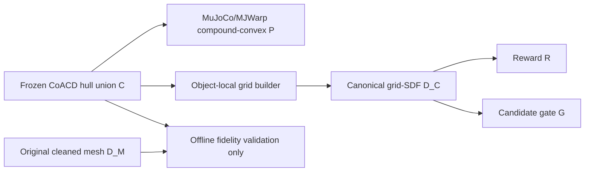

# E186 实验计划：22-case object-specific CoACD P/R/G 与 Full CEM

_Core4D Phase 49 · 2026-08-01 · E178 paired subset · execution authorized_

## Context 与最终决策

E183–E185 已在 E178 Full27 的 reference 与 E178-final 真实接触姿态上完成
static-P 审计。用户明确决定：production 不要求一个物体的全部 case 都通过；每个
object 固定一个 CoACD collider，只保留该 collider 通过 P gate 的 case，失败 case
可以丢弃。

E186 因而冻结如下路线：

```text
E178 Full27 authority
  + 3 个 object-specific CoACD hull union C_object
  + zero-aware static-P precision/recall >= 0.70
  -> keep22 / drop5（此处一次冻结）
  -> C_object 同源构建 P compound-convex 与 D_C canonical grid-SDF
  -> keep22 R/G query audit
  -> bounded canary
  -> keep22 Full CEM 1024 x 32 seed0
  -> 与 E178 同22行 paired comparison
```

E186 不把 E178 的 box-union backend 重跑冒充 CoACD 结果。当前 production runtime
只实现 box-union SDF，因此必须先补齐 compound-convex physics 与 canonical grid-SDF
backend，完成 parity 后才能进入 Full。

## Claims

| Claim | 最低证据 |
|---|---|
| C0 authority | E178 manifest SHA exact；keep/drop 恰为22/5且无交集、并集为27；输入、顺序、seed、budget逐行闭合 |
| C1 collider freeze | 三个 candidate manifest、candidate asset SHA、ordered part path/SHA、参数和实际 hull count 全部冻结且启动时 fail-closed |
| C2 P selection | keep22 每行 zero-aware precision/recall 均不低于0.70；drop5明确记录失败计数；0.65/0.60不会改变这套22行选择 |
| C3 canonical D_C | 每个 grid 只由同物体 frozen hull union 烘焙；manifest source SHA与P parts完全一致；sign、surface、exact-C error、CPU/CUDA parity通过 |
| C4 compound physics | CPU MuJoCo 与 MJWarp 均加载；每个 case robot-object pair恰为`18 x K_actual`；mass/inertia/friction/freejoint/solver与E178一致 |
| C5 R audit | keep22真实reference、E178-final及bounded CEM query上的reward component误差满足预注册门，排序相关性与finite检查通过 |
| C6 G audit | keep22 false accept/reject、selected-valid一致性、combined-valid率和fallback使用率满足预注册门；grid误差预算以保守下界进入gate |
| C7 canary | 三物体至少各一条keep case完成`64 x 4` recorder-off canary，无OOM/NaN/覆盖，runtime validator通过 |
| C8 Full closure | 22行满足`completed + terminal_failed = 22`且missing=0；正常目标22/22 completed |
| C9 paired result | 只在同22行上与E178 join；六门、十二门、连续指标、迁移、bootstrap CI、效率和视频审查完整 |
| C10 isolation | 不修改E178/E181/E182/E183–E185结果；不kill/暂停/抢占本地或远程已有进程；不使用A100 |

C0–C8 是可运行性与实验闭合条件，不预设 E186 一定优于 E178。只有 C9 的 paired
结果才能回答轨迹可用度是否改善。

## Frozen authority

唯一上游 Full authority：

```text
workspace/core4d/results/E178/s6_downstream/manifests/
  semantic_bucket_full_manifest.tsv
sha256 = de9a3d165301318049da208aad52b1f5bc4d3ed671631f0097958734a0f022a8
```

### Object-specific collider

| Object | Frozen candidate | Max hull budget | Actual hull count | P coverage |
|---|---|---:|---:|---:|
| bucket003 | `E181__bucket003__t020_k16_v032` | 16 | 从manifest冻结 | 5/9 |
| bucket004 | `E181__bucket004__t005_k08_v064` | 8 | 8 | 4/4 |
| bucket007 | `E181__bucket007__t020_k08_v064` | 8 | 8 | 13/14 |
| Total | 3个object-specific C | — | — | 22/27 |

`max hull budget` 是 CoACD 允许的上限，runtime 以 manifest 的 `hull_count` 和 parts
为准，不能假设上限必等于实际part数。E186不测试K4，也不在Full后重选K。

### P gate 与case selection

对 oracle-contact 为正的 case：

```text
precision = TP / (TP + phantom) >= 0.70
recall    = TP / (TP + missed)  >= 0.70
```

对 oracle-contact 为0的 case，只有 `phantom == 0` 才通过。冻结使用E183的原始
TP/phantom/missed计数重算，不从图或四舍五入小数反推。

永久丢弃：

```text
bucket003_20231018_001_p1
bucket003_20231018_005_p1
bucket003_20231020_068_p1
bucket003_20231018_003_p2
bucket007_20231003_2_021_p2
```

keep22 是 E178 Full27 按原物理行序删除上述5行的投影。E186后续R/G、canary、Full、
paired evaluation和S6 export只能消费keep22 manifest。任何脚本发现drop case、未知case、
重复case或顺序变化必须拒绝运行。

### 控制变量

| Axis | Frozen value |
|---|---|
| retarget / target / hand | `omnirt_v1 / ref_fk / rubber_hull` |
| CEM | `seed=0, samples=1024, opt_steps=32` |
| reward / gate / target / mask | 与对应E178行一致；不调权重、不换公式 |
| physics | timestep、mass/inertia、friction、joint、solver与E178一致 |
| P geometry | object-matched frozen compound-convex C |
| R/G geometry | 由同一C烘焙的object-local grid-SDF D_C |
| production recorder | off |
| Full resources | local GPU0 + `spider-remote` RTX 6000 Ada GPU0/1 |
| coexistence | 允许与已有程序叠加；禁止kill、暂停、抢占或修改已有进程 |

允许变化只有：22-case投影、object collider、同源R/G backend、E186 method/output、
worker owner及运行时间戳。

## P/R/G 架构合同



P必须有真实碰撞体，因为它决定仿真接触与动力学。R/G不需要再建立第二套MuJoCo
collision geom，但需要可批量查询的距离表示；这里D_C就是C的派生查询结构，而不是
另一套可独立调形状的碰撞体。D_M只用于离线验证C，不进入CEM reward或gate。

### D_C manifest

每个object至少冻结：

- candidate manifest path/SHA、candidate asset SHA；
- ordered part path/SHA与canonical ordered-part SHA；
- object-local grid origin、shape、voxel size、padding；
- negative-inside sign convention；
- trilinear interpolation与outside-grid规则；
- exact-C query sample定义、max/p99 error和`epsilon_grid`；
- grid payload SHA、builder source SHA和schema version。

Gate使用：

```text
D_lower = D_C - epsilon_grid
```

名义threshold保持E178 exact；reward连续使用D_C，不做hard clipping。若查询落在grid
外，必须使用可证明保守的outside rule，禁止返回常数正无穷绕过collision gate。

## Stages 与stop/go gates

### S0：freeze authority与环境

1. 生成keep22、drop5、collider lock、protocol manifest及SHA；
2. 逐行核对E178输入路径/SHA、variant、budget与顺序；
3. 快照git、依赖、GPU、已有process和远程独立snapshot能力；
4. 生成S5 handoff seed与case-state registry，`target_variant_id=ref_fk`；
5. `spider_method_id`固定为E186方法，禁止把collider名写进target variant。

Gate 0：22/5/27计数、三collider所有part SHA、E178 SHA、输入closure任一失败即停止。

### S1：canonical grid-SDF D_C

建议先用`voxel_size=5mm`，padding至少覆盖所有E178 robot-object nominal gate阈值加
插值误差；grid参数一旦通过S1并冻结，不能按R/G或Full结果调整。

验证点包括uniform bbox、near-surface、inside、outside、hull vertices/face samples、
22-case真实query。exact authority是convex-parts union的signed distance，不是D_M。

初始硬门：finite=100%；known sign=100%；surface vertices绝对值p99不超过一个voxel
对角线；CPU/CUDA same-query max abs error<=1e-5m；trilinear相对exact-C的p99误差
<=1 voxel且max误差被`epsilon_grid`覆盖。失败时只允许提高grid fidelity或修runtime bug，
不得改C或case set。

### S2：compound-convex physics sidecar

为22行生成不覆盖源scene的E186 sidecar：object body下加载K个convex mesh geoms，删除
E178 object boxes的active collision作用，显式生成18 x K robot-object pairs。visual mesh、
object freejoint、mass/inertia、friction、solref/solimp/condim保持E178 exact。

Gate 2：22/22 CPU MuJoCo compile、22/22 MJWarp compile；pair数exact；无duplicate active
object collider；静态姿态P confusion回归E183计数；短rollout finite且无初始爆炸。

### S3：keep22真实R/G audit

先使用reference与E178-final，随后每个object一条bounded `64 x 4` shadow query；不需要
把全部Full recorder-on。比较exact-C与D_C下的：

- 每个reward component绝对/相对误差及total reward rank相关性；
- gate false accept/false reject、valid candidate count、selected index；
- combined-valid与least-violation fallback；
- query吞吐、峰值显存和grid cache成本。

预注册门：finite=100%；名义gate使用D_lower后false-safe-accept=0；reward component
p99误差不超过由`epsilon_grid`传播的解析上界；selected-valid重算一致=100%；Spearman
rho>=0.999。若grid误差合格但combined-valid仍为0，记录为G/优化器问题，不归咎CoACD。

#### S1b：Minkowski-support grid v4修订（2026-08-02）

v3在首条真实tape暴露production-domain缺口：grid padding约50mm，但sphere/capsule
查询会在中心/轴线SDF后减最多90mm radius；E178 active reward support又延伸到20mm。
因此grid外AABB lower bound虽对hard gate保守，却会在减radius后制造phantom reward。

保持keep22、C、ordered parts与voxel resolution map不变，仅新建不可覆盖的v4 grid：

```text
required padding = max production query radius 90mm + max active reward support 20mm
                   = 110mm
frozen requested padding = 120mm
```

v4新增`minkowski_reward_support_covered`硬门，要求六个方向的实际最小padding不低于
110mm；仍执行v3全部exact-C、sign、CPU/CUDA parity与SHA门。先50k/object smoke，再
1M/object formal；只有首casephantom-active归零且原G false-safe仍为0，才允许重建S2
manifest/override指向v4并执行44-tape正式S3。v3保留为失败诊断证据，不覆盖、不删除。

### S4：三物体canary与效率

每个object从keep22取一条（优先复用E182已有代表case；若代表被drop则取该object物理
行序第一条keep case），运行recorder-off `64 x 4 seed0`。同机交错E178/E186以分离共存
负载；记录wall、record median/p90、GPU memory、P step和R/G query breakdown。

Gate 4：3/3 runtime validator PASS、无OOM/NaN/覆盖；每条有combined-valid candidate；
E186/E178同机runtime ratio先报告。若预计22-case makespan不可接受，允许优化kernel/grid
cache，但不允许降低已冻结C；若要减少hulls必须新开实验号，不能在E186内重选。

#### S3b：低预算 false-negative 消歧（2026-08-02）

正式 `64 x 4` shadow 已证明 bucket003/007 从首个CEM起持续posture fallback，但同状态
E178 Full 的 bucket003 要到iteration 15才首次出现valid，bucket007首tick 32轮仍fallback、
到后续control tick才恢复；两边首tick iteration0 的posture mean/terminal/drop基本一致。
因此 `64 x 4` 的“必须combined-valid”不能单独区分低预算不足与compound physics失败。

在不改变keep22、C、D_C、reward、gate、seed或Full budget的前提下，先做两个bounded
full-budget feasibility probe：

- bucket003：`1024 x 32 seed0`，从production初态运行到首个post-warmup CEM并停止；
- bucket007：`1024 x 32 seed0`，运行到冻结sim step 22的CEM并停止，以保留E178已知的
  多tick恢复路径；
- recorder只保存final-iteration sample gate/posture/reward摘要，不保存全量geometry
  transforms；probe不作为D_C/D_M fidelity authority，也不覆盖v7 shadow；
- 先跑bucket003并记录单query wall/峰值显存，据此决定bucket007是否在本机继续，期间
  不kill/暂停/抢占其他任务。

判定：若正式budget仍combined-valid=0，则确认optimizer/compound-physics feasibility
阻塞，S4/Full继续禁止；若恢复valid，则把`64 x 4`结果记录为canary预算false-negative，
但是否修订Gate 4并进入Full仍需单独记录决策，不能用probe偷换R/G fidelity门。

#### S3c：正式预算非平凡R/G shadow（S3b恢复后触发）

S3b若在003/007均恢复combined-valid，则按原冻结record时点16/22各重跑一次
`1024 x 32 seed0`，这次保存reward实际使用的MJWarp geom/body transforms，并以64 samples
为batch离线计算exact-C，避免一次性exact查询内存膨胀。该shadow必须同时满足S3原门：
component reproduction、false-safe=0、selected-valid=100%、rho>=0.999，并要求
geometry-active>0；结果放新不可覆盖root，不覆盖64x4 v7或feasibility probe。

只有三object都获得非平凡R/G evidence，才允许把Gate 4的`64 x 4 combined-valid`
解释修订为“runtime/finite validator + formal-budget feasibility”，随后进入recorder-off效率
canary。若任一object在正式预算R/G shadow仍无active或fidelity失败，Full继续禁止。

### S5：Full CEM 22-case

仅S0–S4全过后生成三张互斥shard，按实测cost做LPT平衡：

```text
local GPU0
spider-remote Ada GPU0
spider-remote Ada GPU1
```

远程使用独立immutable source snapshot和独立run root，不在远程脏worktree中
merge/reset/checkout。启动前后记录GPU/process snapshot；现有process无论利用率如何都
不kill。每个worker串行跑自己的rows，三个worker并行；正式Full recorder-off。

正常目标22/22 completed。单case失败先分类并允许一次有依据的recover；不得静默改C、
grid、reward、gate、seed或budget。最终必须达到`completed + terminal_failed = 22`。

### S6：paired evaluation、visual与handoff

仅join keep22的E178/E186：

- 六门、十二门、tracking/object/contact连续指标和逐object迁移；
- paired bootstrap CI与win/tie/loss；
- per-case、per-record、per-worker wall与总GPU-hours；
- 22/22视频和固定关键帧，实际检查异常、穿透、phantom contact及动作可用度；
- 记录S6 downstream evidence，再由显式evidence生成RL export input。

Full结果不能通过扫描目录隐式发现。S5/S6必须保留scene_act、trajectory、contact_mask、
result_npz、source_exp_id和spider_method_id。`DOWNSTREAM_CEM_PASS`不能写成RL成功。

## Artifacts 与脚本

正式root：

```text
workspace/core4d/results/E186/
  s0_environment/
  s1_canonical_grid_sdf/
  s2_compound_physics/
  s3_prg_audit/
  s4_canary/
  s5_handoff/
  s6_downstream/
  registries/
```

代码与入口：

```text
workspace/core4d/scripts/experiments/E186/
workspace/core4d/scripts/eval/runners/eval_E186_*.py
workspace/core4d/scripts/eval/wrappers/eval_E186_*.sh
workspace/core4d/scripts/launch/active/run_E186_local.sh
workspace/core4d/scripts/launch/active/run_E186_remote_a6000.sh
workspace/core4d/scripts/launch/active/pull_E186_remote_a6000_results.sh
```

results不进入git；plan、runner、tests、launchers、log、Tracker和progress进入git。

## 执行顺序

1. freeze authority与collider lock；
2. D_C builder/runtime与单元/parity测试；
3. compound-convex sidecar、pair与compile测试；
4. keep22 R/G audit；
5. 三物体canary与同机效率probe；
6. 通过后才部署独立remote snapshot并启动三卡Full；
7. pull、22行closure、paired eval、视频审查、S6 evidence与实验日志；
8. 更新Tracker并提交代码，不提交results。
