# E189 实验计划：box004/box024/box001 E167A no-PRG Full CEM 与 E172/E173 配对对比

_Core4D Phase 52 · 2026-08-06 · planning only · 本机 8×L20Y 全本地_

---

## 📋 Context

E172（box004）与 E173（box024/box023/box001）四个物体的 Full CEM 全部使用
`E167A_zOnlyBody base + E170 PRG`（下肢 physics pair + repulsion 软惩罚 +
candidate gate，`p_enabled=r_enabled=g_enabled=true`）。这四个物体从未与
纯 `E167A_zOnlyBody`（关闭 PRG）做过同 case 配对对比——**除了 box023**：
box023 已在 E179 完成 16/16 配对消融，正式结论为 `PRG_BETTER`，box023
默认保留 PRG，不再纳入本轮计算。

E173 自身报告了一个关键线索：**PRG numeric pass 率随物体体积单调退化**
（box004 0.041m³ 83% → box023 0.036m³ 81% → box021 0.059m³ 64% →
box026 0.116m³ 42% → box024 0.253m³ 33% → box001 0.256m³ 36%），且大箱
（box024/box001）在 PRG scene-contract 阶段就出现 3 条 `runtime_initial_overlap`
拒绝。E179 在小箱 box023 上验证了移除 PRG 会让 lower-body 更差、object
tracking 略好；本实验要回答的问题是：**这个 trade-off 在大箱
（box024/box001，体积 6-7 倍于 box023）和另一小箱（box004）上是否成立，
还是随尺寸出现方向反转**。

本实验只回答一个问题：

> 在完全相同的 box004/box024/box001 target、contact mask、retarget
> variant、rubber hand 和 Full CEM budget 下，移除 E170 PRG，改用纯
> `E167A_zOnlyBody` 后，逐 case 十二门指标和可用率相对 E172/E173 如何
> 变化？三个物体（尤其两个大箱）是否得到与 box023 (`PRG_BETTER`) 一致
> 的结论，还是出现方向反转或 mixed？

### 历史事实

| 事实 | 冻结值 |
|---|---|
| E172 box004 CEM set | `6` rows（v1=5、v2=1），Full `6/6` complete |
| E173 box024 CEM set | `9` rows（v1=5、v2=4），Full `9/9` complete |
| E173 box001 CEM set | `28` rows（v1=21、v2=7），Full `28/28` complete |
| E189 paired 总量 | `43` rows（v1=31、v2=12） |
| box023 处理方式 | **跳过**，直接引用 E179 结论（16/16 配对，`PRG_BETTER`），不消耗新计算 |
| E172/E173 历史六门 pass | box004 `5/6`(83%)、box024 `3/9`(33%)、box001 `10/28`(36%) |
| PRG scene-contract reject | box004=0、box024=1（大箱专属）、box001=2（大箱专属）——这些行不在 43 条 CEM_ELIGIBLE 集合内，本轮不涉及 |
| Tracking 阈值（沿用 E178/E179） | root `≤20cm/≤20°`、EEF `≤20cm/≤20°`、object `≤20cm/≤10°` |
| E172/E173 metric standard | `core4d-e154-physics-contact-v1`（六门，无 tracking gate） |
| E167A profile SHA（E168/E179 冻结） | `666c302dcf549e517ff02b50c139551cf98635b7b951872284d6a39766548c17` |
| box023 E179 结论（引用，不重跑） | `PRG_BETTER`；十二门 `E173 7/16 → E179(no-PRG) 4/16`；lower-body 净损失 4、leg penetration 显著上升、object position 略有改善 |

### "全量三物体"的定义

- 数据漏斗分母保持 E172/E173 各自的 raw move-only authority（box004 见
  E172 funnel，box024/box001 见 E173 194-row 三物体 funnel）
- Full CEM population 冻结为 E172 box004 全部 `6` 行 + E173 box024 全部
  `9` 行 + E173 box001 全部 `28` 行 `CEM_ELIGIBLE` row，**不含 box023**
- E189 必须对这 `43` 条全部 fresh 跑 Full CEM（关闭 PRG）
- E189 与 E172/E173 的 paired denominator 按物体分别固定为 `6`/`9`/`28`，
  总计 `43`
- 任何缺行都记为 pipeline incomplete，不能只比较完成子集
- PRG scene-contract reject 的 3 行（box024×1、box001×2）本来就没有
  PRG Full 结果，因此也不纳入 E189 no-PRG 集合——两边比较的是同一个
  `CEM_ELIGIBLE` 交集，不是把 reject 行也塞进 no-PRG 单边跑

### 实验边界

| 项目 | E172/E173（PRG） | E189（no-PRG） |
|---|---|---|
| Case set | box004=6、box024=9、box001=28，共43 S5-ready | 同一 43 条 |
| Retarget | box004 `v1=5/v2=1`；box024 `v1=5/v2=4`；box001 `v1=21/v2=7` | 逐 case 相同 |
| Target route | `ref_fk` | 相同 |
| Contact mask | raw 3cm | 路径与 SHA 相同 |
| Hand collision | `rubber_hull` | 相同 patch 逻辑 |
| Base method | `E167A_zOnlyBody` | `E167A_zOnlyBody` |
| Lower-body PRG | 开启 | 关闭 |
| CEM budget | seed `0`、`1024×32` | 相同 |
| 执行环境 | box004 本机8卡、box024/box001 本机8×L20Y | 本机8×L20Y（同机器，纯本地，不用远程 A100） |

与 E179 相同：这是对完整 PRG 方法包的 paired ablation，只能解释为
"E167A no-PRG vs E172/E173 PRG"的系统级差异，不能把因果单独归给 P/R/G
中的某一个子组件。

## 🎯 Claims

| Claim | 最低证据 |
|---|---|
| C0-authority | E189 case set 精确等于 E172 box004(6) + E173 box024(9) + E173 box001(28)，不含 box023；case/retarget/trajectory/contact-mask SHA 逐条相等 |
| C1-method-fidelity | 43/43 effective config 匹配 E167A immutable profile（SHA 与上表一致）；B1/B2 未启用 |
| C2-no-prg | `p/r/g=false`；无 PRG 下肢 physics pair、leg penalty、leg candidate gate 或 PRG fallback 泄漏 |
| C3-full-closure | 每个物体 `expected=completed+terminal_failed`，missing=`0`；正式目标为 `43/43` complete |
| C4-paired-metrics | 43/43 case 均有 E189/E172/E173 同口径十二门、`43×12=516` 个明确 gate cells、按物体分组的 pass 迁移与连续指标 delta |
| C5-visual | 43/43 有 E189 Full 视频与对应 E172/E173 paired 对照；所有 fail/边界行完整复核 |
| C6-reproducibility | config、scene、trajectory、mask、manifest、GPU、命令与 SHA 可恢复 |

C0–C6 是执行完成标准，不要求 E189 必须优于 E172/E173，也不要求三个物体
得到统一结论。科学结论允许三个物体分别是
`NO_PRG_BETTER` / `NO_PRG_NONINFERIOR` / `PRG_BETTER` / `MIXED` 中的
任意组合。

## ⚙️ 冻结配置

### E167A method contract

复用 E168/E179 保存的 immutable E167A profile，不启用 `E167A+B1`
或 `E167A+B2`：

| 字段 | 值 |
|---|---:|
| `spider_method_id` | `E189_E167A_zOnlyBody_noPRG` |
| `e167_body_z_enabled` | `true` |
| `e167_body_z_weight` | `2.0` |
| `e167_body_z_threshold_m` | `0.25` |
| `e167_ground_z_enabled` | `true` |
| `e167_ground_z_weight` | `2.0` |
| `foot_slip_enabled` | `false` |
| `foot_ground_enabled` | `false` |
| `local_frame_ankle_weight` | `1.0` |
| `cem_smooth_enabled` | `false` |
| `cem_hand_gate_enabled` | `true` |
| `cem_hand_gate_min_sdf_m` | `-0.01` |
| `cem_hand_gate_max_violation_pct` | `0.10` |
| `cem_hand_gate_hard_floor_m` | `-0.02` |
| `surface_band_rew_scale` | `1.5` |
| `surface_band_width_m` | `0.003` |
| `surface_band_min_sdf_m` | `-0.001` |
| `surface_band_sigma` | `0.0015` |
| `surface_band_score_mode` | `symmetric_abs` |
| `cem_posture_gate_enabled` | `true` |

"不要 PRG"只关闭 E170/E171/E172/E173 的 P/R/G 组件，不关闭 E167A 原生的
hand gate、posture gate、surface band 或 z-only body tracking。

### no-PRG 负向审计

每条 resolved config 和 scene 必须同时满足（与 E179 一致）：

```text
cell_id                    = E167A_noPRG
p_enabled                  = false
r_enabled                  = false
g_enabled                  = false
leg_object_penalty_scale   = 0.0 or absent
cem_leg_gate_enabled       = false or absent
cem_leg_gate_geom_names    = empty or absent
cem_leg_gate_fallback      = absent
PRG lower-body pair count  = 0 newly added pairs
```

禁止直接复用 `scene_act_E172_rubberHull_PRG.xml` / `scene_act_E173_..._PRG.xml`。
E189 从每条 case 各自的原始 `scene_act.xml` fresh 生成
`scene_act_E189_rubberHull_E167A.xml`，semantic diff 只允许 rubber-hand
mesh collision patch。E189 hand geom fingerprint 还需与 E172/E173 对应
case 的中间 `scene_act_{E172,E173}_rubberHull.xml` 一致。

### CEM budget

| 模式 | Samples | Opt steps | Seed | 用途 |
|---|---:|---:|---:|---|
| Canary | 64 | 4 | 0 | runtime/config/artifact contract |
| Full | 1024 | 32 | 0 | 正式 paired comparison |

Canary 质量差不阻断 Full；只有配置污染、scene load、输入错配、非有限值、
产物覆盖或公共 runtime contract 失败才阻断。

## 🔄 工作流

```mermaid
flowchart LR
    accTitle: E189 Paired Experiment Workflow
    accDescr: E189 freezes 43 box004/box024/box001 inputs from E172/E173, rebuilds rubber-hull scenes without PRG, runs full CEM on eight local GPUs, then performs paired twelve-gate metrics and visual review.

    freeze_inputs[📥 Freeze 43 inputs] --> audit_hashes[🔍 Audit input hashes]
    audit_hashes --> build_scenes[🔧 Build no-PRG scenes]
    build_scenes --> audit_method{🛡️ Method audit passes?}
    audit_method -->|No| stop_run[❌ Stop launch]
    audit_method -->|Yes| free_gpu[🔓 Pause GPU-filler, verify 8 free]
    free_gpu --> run_canary[🧪 Run 9-case local canary]
    run_canary --> run_full[⚙️ Run 8-GPU Full 43 rows]
    run_full --> pair_metrics[📊 Pair per-object E172/E173 metrics]
    pair_metrics --> review_video[🔍 Review paired videos]
    review_video --> close_audit([✅ Close completion audit])

    classDef process fill:#dbeafe,stroke:#2563eb,stroke-width:2px,color:#1e3a5f
    classDef decision fill:#fef9c3,stroke:#ca8a04,stroke-width:2px,color:#713f12
    classDef danger fill:#fee2e2,stroke:#dc2626,stroke-width:2px,color:#7f1d1d
    classDef success fill:#dcfce7,stroke:#16a34a,stroke-width:2px,color:#14532d

    class freeze_inputs,audit_hashes,build_scenes,run_canary,run_full,pair_metrics,review_video process
    class audit_method,free_gpu decision
    class stop_run danger
    class close_audit success
```



### Phase 0：冻结 paired authority

1. 从 E172 `cem_full_manifest.tsv` 过滤 `object_key=box004`（6 行）；从
   E173 `cem_full_manifest.tsv` 过滤 `object_key in {box024,box001}`
   （9+28=37 行），**显式排除 box023**
2. 断言总行数为 `43`（6+9+28）、case ID 全局唯一、状态均为 completed
3. 复制必要字段到 E189 `input_authority.tsv/json`，按物体分组
4. 记录 E172/E173 manifest、metrics、trajectory、mask、scene 的 SHA
5. 断言 v1/v2 分布：box004 `5/1`、box024 `5/4`、box001 `21/7`
6. 保留 E172/E173 历史六门 `5/6`、`3/9`、`10/28` 作为 secondary baseline
7. 用与 E179 同一 scoring adapter，对 43 条 E172/E173 结果只读重算十二门
   （新增 root/EEF/object tracking 六门），冻结按物体分组的十二门 baseline
   （复用 `results/E188/s6_downstream/eval/object_tracking_audit/case_level_audit.tsv`
   中已有的 object position/orientation 数值作为交叉核验，不重新渲染）
8. 写出 `e172_box004_baseline_12gate.tsv` / `e173_box024_box001_baseline_12gate.tsv`，
   不回写 E172/E173 结果目录

E172/E173 结果、registry、metrics 和人工字段全部只读，不回写。box023
只读引用 E179 已发布的 `7/16` 十二门 baseline 与 `PRG_BETTER` 结论，
不重新计算。

### Phase 1：生成 E167A no-PRG handoff

1. 复用 E168/E179 rubber-hull builder 的 hand mesh patch
2. 对 43 条 case 各自从其 pristine `scene_act.xml` 生成 E189 sidecar
3. 生成逐 case Hydra override，绑定 E167A profile
4. 执行 E167A parity/axis audit（43/43）
5. 执行 PRG negative audit（43/43）
6. 保存 scene/config semantic diff 与 SHA snapshot

所有 43 个 target task 的 source scene、原始 `scene_act.xml` 和 E189
sidecar 在启动前复制到 `workspace/core4d/results/E189/scene_snapshot/`。
真实 launch 的第一步调用 `snapshot_scenes.sh`，不能依赖 mtime
（experiment.md 安全网2强制要求）。

### Phase 2：本地 9-case canary

覆盖三个物体各自的 v1-pass / v1-fail(lower_body 相关) / v2 三种情形：

| Case | Object | Variant | E172/E173 六门状态 | 覆盖目的 |
|---|---|---|---|---|
| `box004_20231003_2_082_p1` | box004 | v1 | pass | 普通成功行 |
| `box004_20231003_2_086_p2` | box004 | v1 | fail (fall,body_z,release,lower_body) | 唯一失败行诊断 |
| `box004_20231003_2_082_p2` | box004 | v2 | pass | 唯一 v2 rescue |
| `box024_20231011_027_p1` | box024 | v1 | pass | 普通成功行 |
| `box024_20231011_028_p1` | box024 | v1 | fail (hand_penetration,lower_body) | no-PRG 关键诊断 |
| `box024_20231011_027_p2` | box024 | v2 | pass | v2 rescue 成功样本 |
| `box001_20231003_1_039_p1` | box001 | v1 | pass | 普通成功行 |
| `box001_20231020_010_p1` | box001 | v1 | fail (lower_body) | no-PRG 关键诊断 |
| `box001_20231003_1_041_p1` | box001 | v2 | pass | v2 rescue 成功样本 |

Canary 只要求 root NPZ、outdir NPZ、`config_act.yaml`、finite qpos、
scene/config SHA 与日志完整。Full 阶段 fresh 重跑这九条，不复用 64×4
结果。

### Phase 3：8×本地 GPU Full CEM

与 E172/E173 相同机器（本机 8×L20Y），不使用远程 A100。启动前必须：

1. `pkill -f "/mnt/ali-sh-1/usr/xiayibo/.cache/run.py"` 释放 GPU-filler
   （E171/E172/E173/E174/E186 等历史实验中已记录为 user-authorized 操作，
   只针对该 filler 进程，不触碰其它任务）
2. 二次 `nvidia-smi` 确认 8 张卡显存 `<5000MB`、compute process 为空
3. 若 8 卡未能全部释放，只用已释放的卡数分片，不等比缩小 canary/Full
   budget、不替换成其它未授权设备

Full 43 行按 `object_key, case_id` 字典序排序后以 `index % 8` 分片，
保证分片确定且可复现：

| GPU | box004 | box024 | box001 | 合计 |
|---|---:|---:|---:|---:|
| 0 | 1 | 1 | 4 | 6 |
| 1 | 1 | 1 | 4 | 6 |
| 2 | 0 | 2 | 4 | 6 |
| 3 | 0 | 1 | 4 | 5 |
| 4 | 1 | 1 | 3 | 5 |
| 5 | 1 | 1 | 3 | 5 |
| 6 | 1 | 1 | 3 | 5 |
| 7 | 1 | 1 | 3 | 5 |
| **合计** | **6** | **9** | **28** | **43** |

builder 必须断言：

```text
unique cases = 43
per-GPU rows = 6,6,6,5,5,5,5,5（合计43）
missing = 0
duplicate = 0
```

精确的 case→GPU 映射由 manifest builder 按上述确定性排序算法生成并写入
`cem_full_manifest.tsv` 的 `assigned_gpu` 列，不在计划文档中手工枚举
43 行。`MUJOCO_GL` 显式 `unset`（既不用 `osmesa` 也不用 `egl`，见下方
「已知风险与坑」——两者在本机都曾让 `import mujoco` 直接崩溃，且崩溃与否
随调用 shell 的环境而变，unset 让 mujoco 落回可被其自身 `except
ImportError` 吞掉的 `glfw` 失败路径，canary/Full 均不渲染视频，无需真实
GL 上下文）。

### Phase 4：统一评测与 paired comparison

Evaluator 必须直接导入：

```python
from eval.core.core_metrics import EvalConfig, METRIC_FIELDS, evaluate_sequence
```

不动态加载 E172/E173 evaluator。E189 自己读取 Phase 0 生成的
`e172_box004_baseline_12gate.tsv` / `e173_box024_box001_baseline_12gate.tsv`，
并对 `case_id` 做一对一 join。E172/E173 与 E189 的 raw metric values
必须通过同一 E189 scoring adapter 生成十二门；不能直接拿 E172/E173
历史六门 `numeric_release_pass` 与 E189 十二门结果比较。

每条 row 必须写出以下十二个独立 gate columns（与 E179 完全一致）：

```text
fall_gate_pass
body_z_gate_pass
contact_gate_pass
release_gate_pass
hand_penetration_gate_pass
lower_body_gate_pass
root_pos_gate_pass
root_ori_gate_pass
hand_pos_gate_pass
hand_ori_gate_pass
object_pos_gate_pass
object_ori_gate_pass
```

summary 必须记录：

```text
scoring_contract_id = core4d-e189-12gate-tracking-v1
tracking_gates_enabled = true
paired_expected_by_object = {box004: 6, box024: 9, box001: 28}
paired_evaluated_by_object = {box004: 6, box024: 9, box001: 28}
```

若 wrapper 未启用 tracking gates，评测 hard fail，不能回退到六门报告。
结果**必须**同时输出：(a) 三个物体各自的 paired 结果表，(b) 43 条合并
总表——但结论文本以 (a) 为准，不允许把三个体积/失败模式差异巨大的
物体合并成一个单一数字后下结论。

### Phase 5：可视化与 completion audit

1. 渲染 E189 `43/43` Full MP4
2. 生成 E189 vs E172/E173 左右对照视频（按物体分组）
3. 全量检查 43 条时间序列
4. 对所有 numeric fail、pass 迁移与边界值提取关键帧（`/video-frames`）
5. 写 `codex_verification.tsv`
6. 保留用户 review template，但本轮不代填用户标签
7. 执行 artifact、row-set、SHA 与 paired coverage audit

如产出 MP4，视觉分析阶段使用 `video-frames` 提取关键帧，并将实际观察写入
E189 结果 log（experiment.md 强制视觉复核要求）。

## 📊 指标与对比

### 十二门 numeric gate contract

与 E179 使用同一阈值：

| Failure mode | Metric | Unit | Pass |
|---|---|---:|---:|
| `fall` | `fall_flag` | bool | `false` |
| `body_z` | `body_z_err_p95_m` | m | `≤0.20` |
| `contact` | `hand_object_physics_contact_in_mask_frac` | fraction | `≥0.50` |
| `release` | `hand_object_release_false_contact_3mm_frac` | fraction | `≤0.30` |
| `hand_penetration` | `hand_object_physics_penetration_3mm_frame_frac` | fraction | `≤0.30` |
| `lower_body` | `leg_penetration_frac` | fraction | `≤0.10` |
| `root_pos` | `track_root_pos_err_cm_mean` | cm | `≤20` |
| `root_ori` | `track_root_ori_err_deg_mean` | degree | `≤20` |
| `hand_pos` | `track_eef_pos_err_cm_mean` | cm | `≤20` |
| `hand_ori` | `track_eef_ori_err_deg_mean` | degree | `≤20` |
| `object_pos` | `track_obj_pos_err_cm_mean` | cm | `≤20` |
| `object_ori` | `track_obj_ori_err_deg_mean` | degree | `≤10` |

### E172/E173 十二门 baseline（Phase 0 已执行，只读重算完成）

| 物体 | n | 历史六门 pass | 十二门 baseline | 主要六门失败模式 |
|---|---:|---:|---:|---|
| box004 | 6 | `5/6` (83%) | `2/6` (33%) | fall/body_z/release/lower_body ×1 (`086_p2`) |
| box024 | 9 | `3/9` (33%) | `2/9` (22%) | hand_penetration×6, lower_body×2, body_z×1 |
| box001 | 28 | `10/28` (36%) | `5/28` (18%) | lower_body×9, hand_penetration×7, release×3, fall×1, body_z×1, contact×1 |

与 box023 先例一致（六门 `13/16`→十二门 `7/16`，净损失 6 条），加入
tracking 门后三个物体的十二门 pass 数**全部低于**六门 pass 数，且降幅
比例上比 box023 更大（box004 60%→33%的相对降幅、box024 33%→22%、
box001 36%→18%）——大箱在十二门标准下的可用率已经很低，这是 E189 no-PRG
必须超越的真实基线。产物：
`workspace/core4d/results/E189/input_authority/e172_e173_baseline_12gate.tsv`，
E172 manifest SHA=`c53d0619efd985b843ad31996a3c607a2b58918419fb5c1d6ddc7365073bda07`，
E173 manifest SHA=`2128deb8403a0efddb7578a46b2ef466811f91ba183d955b0230776de2ae889d`
（与 E179 记录的 E173 SHA 一致）。

### 必报指标

| 维度 | 指标 |
|---|---|
| Primary | 十二门 numeric pass、十二个单门 pass、failure taxonomy（按物体分组） |
| Secondary | 历史六门 pass，便于与 E172/E173 原始数字对照 |
| Tracking | root/EEF/object pos+ori mean、六个 tracking gate、body-z p95、terminal pelvis-z |
| Contact | raw in-mask contact、3mm contact、release false contact |
| Hand safety | 3mm/5mm penetration、deep penetration |
| Body safety | leg penetration、leg near/contact、fall |
| Dynamics | qpos accel/jerk、trackbody/ankle jerk、foot slip |
| Completeness | 按物体的 expected/completed/failed/missing、artifact errors |
| 跨物体 | PRG pass 率是否仍随尺寸单调退化；no-PRG 是否在大箱上出现方向反转 |

### Paired 统计（按物体分别计算，另附 43 条合并表）

对每个指标、每个物体输出：

- E189 与 E172/E173 原值
- `delta = E189 - E172/E173`
- mean、median、IQR
- 固定 seed `0` 的 paired bootstrap 95% CI（各物体分别 resample，
  box004 n=6 时 bootstrap CI 仅供参考，不作为决策唯一依据）
- 十二门 numeric pass 的 `pass→pass / pass→fail / fail→pass / fail→fail`
- 十二个单门各自的 paired transition table
- 十二门 binary pass 的 exact McNemar 结果（box004 n=6 样本量过小，
  仅报告不作为独立判据）

box004 样本量小（n=6），任何单条 case 的迁移都会大幅摆动比例；结论必须
结合 leg penetration 连续指标和视频证据，不能只看 pass 计数。

### 结果分级（按物体分别判定，禁止合并成单一跨物体结论）

| 结论 | 预注册判定 |
|---|---|
| `NO_PRG_BETTER` | 该物体 E189 十二门 pass 数比 E172/E173 baseline 至少多 1；无新 fall；物理安全（leg penetration、hand penetration）与 tracking 无系统性净回归 |
| `NO_PRG_NONINFERIOR` | 该物体 E189 十二门 pass 数较 baseline 最多少 1；无新 fall；十二门净回归不超过净改善 1 条 |
| `PRG_BETTER` | 该物体 E189 十二门 pass 数明显低于 baseline，或出现新 fall、≥2 条净 pass→fail、系统性 lower-body/tracking 回归 |
| `MIXED` | 其余情况；逐 case 保留 positives，不升级默认 |

三个物体各自独立套用上表，最终报告必须分别给出 box004/box024/box001
三个结论标签，并与 box023 的 `PRG_BETTER`（E179，引用不重跑）并列比较，
形成五物体（box004/box021/box023/box024/box026/box001，实际六物体）
尺寸-结论关系表，直接回答"PRG 随尺寸退化"假设在 no-PRG 侧是否成立。
即使某物体 `NO_PRG_BETTER`，也只支持该物体范围内继续采用 E167A
no-PRG，不能自动推广到其它物体或进入 RL export。

## 🛡️ 成功标准与 stop-loss

### Pipeline completion

| 检查 | 通过标准 |
|---|---|
| Authority | box004(6)+box024(9)+box001(28)=43，不含 box023；三个物体分别有 v1/v2 闭合说明 |
| Input parity | 43/43 trajectory、mask、retarget、target route 与 E172/E173 对应行相同 |
| Method parity | 43/43 E167A profile audit pass |
| no-PRG | 43/43 config/scene negative audit pass |
| Full | 每个物体 `expected=completed+terminal_failed`、missing=`0`；总计 `43/43` |
| Metrics | paired join=`43/43`；E172/E173/E189 各有 `43×12=516` 个明确 gate cells；三个物体 baseline 均已从"待重算"落实为数字 |
| Visual | E189 MP4=`43/43`、paired review=`43/43` |
| Reproducibility | manifest/config/scene/input/GPU/log SHA 完整 |

### Stop-loss

| 问题 | 动作 |
|---|---|
| Authority 或 hash mismatch | 全局停止，修复 paired input contract |
| E167A profile mismatch | 全局停止，不允许带污染配置开跑 |
| 任一 PRG 字段/pair 泄漏 | 全局停止，重建 sidecar/override |
| 单 case scene/runtime fail | 记录 terminal failure，其余继续；修复后仅重跑该 case |
| 8 卡未能全部释放 | 用已释放卡数分片继续，不等比例缩小 CEM budget、不使用未授权设备 |
| CUDA OOM | 先诊断并降低并发；不改 Full `1024×32` budget |
| `import mujoco` 崩溃 | `unset MUJOCO_GL`，不强制 egl/osmesa（见下方风险表） |
| 同 signature 连续失败 | 按三次失败协议改变策略并记录，不原样重复 |
| 三物体结论冲突（如 box004 vs box024/box001 方向相反） | 如实分别报告，不强行统一叙事；补充体积-结论关系表辅助解释 |

## ⚠️ 已知风险与坑（参考 E179 执行记录）

| 风险 | 说明 | 应对 |
|---|---|---|
| PRG 运行时诊断字段污染 | E179 曾发现关闭 PRG 后 runtime 仍序列化 PRG 专属 diagnostics keys | 复用 E179 已修复的"仅在组件激活时才序列化"逻辑，Phase 1 审计需覆盖 |
| `MUJOCO_GL` 强制取值反而更脆弱 | 本机上 `MUJOCO_GL=osmesa` 会因缺 libOSMesa 让 `import mujoco` 直接抛 `AttributeError`（不是 `ImportError`，绕过了 mujoco 自身的 try/except）；`MUJOCO_GL=egl` 在 Claude Code 工具的 shell 里可用，但在用户交互式 root shell 里同样以 `AttributeError: 'NoneType' object has no attribute 'eglQueryString'` 崩溃——即崩溃与否取决于调用它的 shell 环境，不是稳定的机器属性 | 全部脚本 `unset MUJOCO_GL`，让 mujoco 落回 `glfw` 分支；glfw 缺失/初始化失败是干净的 `ImportError`，会被 `mujoco/__init__.py` 自身的 `try/except ImportError: pass` 吞掉，`import mujoco` 因此在任何 shell 下都能成功。canary/Full 全程 `save_video=false`、viewer disabled，不需要真实 GL 上下文，只有未来 Phase 5 渲染步骤才需要重新解决这个问题 |
| GPU-filler 与真实任务混跑 | 8 卡目前 7 张被 filler 占满(34-55GB/81GB, 98-100%利用率)，1 张(GPU3)空闲 | 启动前 `pkill` filler 并二次 `nvidia-smi` 确认，若未清干净则用实际可用卡数分片 |
| box004 小样本(n=6)统计噪声 | 单条 case 迁移即可让 pass 比例摆动 ±17% | 结论以 leg penetration 连续指标+视频证据为主，不单独依赖 pass 计数或 McNemar p 值 |
| 十二门 baseline 未提前算出 | 本计划仅记录已知六门，十二门需 Phase 0 只读重算 | 严格按 Phase 0 步骤 7 执行，重算完成前不得进入 Phase 1 |
| 大箱 PRG scene-contract reject 行混入 | box024×1、box001×2 行在 PRG 侧从未进 Full CEM | Phase 0 authority 断言必须排除这些行，manifest 交集校验 |
| 跨物体结论被误读为单一结论 | 三物体体积、失败模式差异巨大 | Phase 4/5 强制分物体报告，合并表仅作辅助 |

## 🔧 拟新增文件

### 计划阶段

| 文件 | 改动 |
|---|---|
| `plan/215_E189_box004_box024_box001_e167a_no_prg_full_cem_plan.md` | 新建本计划 |
| `EXPERIMENT_TRACKER.md` | 新增 E189 Phase 52 planning-only 索引 |
| `progress.md` | 记录范围、配置、对照和资源合同 |

### 执行前（用户批准计划后才创建/运行）

| 文件 | 作用 |
|---|---|
| `scripts/experiments/E189/e189_common.py` | 路径、schema、hash、43-row authority |
| `scripts/experiments/E189/build_paired_authority.py` | 冻结 E172(box004)+E173(box024,box001) 输入与 baseline |
| `scripts/experiments/E189/build_e167a_no_prg_manifest.py` | 生成 rubber sidecar、override、canary/full manifest |
| `scripts/experiments/E189/audit_e167a_no_prg.py` | E167A parity + PRG negative audit |
| `scripts/experiments/E189/run_cem_queue.py` | 单 GPU worker 串行执行与 resume |
| `scripts/experiments/E189/render_paired_results.py` | E189 Full 与 E172/E173 paired 视频 |
| `scripts/experiments/E189/audit_completion.py` | 43-row Full/metrics/video/SHA 闭合 |
| `scripts/launch/active/run_E189_local_8gpu.sh` | 本地 8 卡 canary/full queue（含 filler pkill） |
| `scripts/launch/active/watch_E189_full.sh` | 本地监控、补渲染、eval |
| `scripts/eval/runners/eval_E189_boxes_e167a_vs_prg.py` | 公共指标与按物体 paired delta |
| `scripts/eval/wrappers/eval_E189_boxes_e167a_vs_prg.sh` | 固化评测入口 |
| `scripts/eval/reports/gen_E189_boxes_comparison.py` | TSV/JSON/Markdown/XLSX-ready report（含体积-结论关系表） |

真实 launch/pull 实现只放 `scripts/launch/active/`，不在 `scripts/`
根目录新增实现。本实验全程本地，不需要 `pull_*_remote_*.sh`。

## 🚀 执行入口与结果路径

以下命令是执行阶段拟固化入口，**本轮 planning-only 不运行**。

### 构建与审计

```bash
python3 workspace/core4d/scripts/experiments/E189/build_paired_authority.py

python3 workspace/core4d/scripts/experiments/E189/build_e167a_no_prg_manifest.py \
  --dry-run

python3 workspace/core4d/scripts/experiments/E189/build_e167a_no_prg_manifest.py \
  --apply --snapshot

python3 workspace/core4d/scripts/experiments/E189/audit_e167a_no_prg.py \
  --require-all
```

### Canary 与 Full

```bash
MODE=canary \
  bash workspace/core4d/scripts/launch/active/run_E189_local_8gpu.sh

MODE=full \
  bash workspace/core4d/scripts/launch/active/run_E189_local_8gpu.sh
```

`run_E189_local_8gpu.sh` 必须在启动前 `pkill` GPU-filler、二次
`nvidia-smi` 确认 8 卡可用显存与 compute process 快照，并把结果写入
execution manifest（与 E171/E172/E173/E174/E186 本地 8 卡脚本同规范）。

### 渲染与评测

```bash
bash workspace/core4d/scripts/launch/active/watch_E189_full.sh

bash workspace/core4d/scripts/eval/wrappers/eval_E189_boxes_e167a_vs_prg.sh \
  full --require-all --baseline-e172-e173 --enable-tracking-gates

python3 workspace/core4d/scripts/eval/reports/gen_E189_boxes_comparison.py

python3 workspace/core4d/scripts/experiments/E189/audit_completion.py \
  --require-all
```

### 结果路径

```text
workspace/core4d/results/E189/
├── s0_environment/
│   ├── environment_manifest.json
│   └── local_8gpu_selection.tsv
├── input_authority/
│   ├── input_authority.tsv
│   ├── e172_box004_baseline.tsv
│   ├── e173_box024_box001_baseline.tsv
│   └── hash_audit.json
├── scene_snapshot/
│   ├── source_scenes/
│   └── e189_rubber_hull_sidecars/
├── s5_handoff/
│   ├── overrides/
│   └── config_scene_audit/
├── s6_downstream/
│   ├── manifests/
│   ├── cem/canary/
│   ├── cem/full/
│   ├── render/full/
│   ├── render/paired_e172_e173/
│   └── eval/full/
└── completion_audit/
```

CEM NPZ、config、视频和指标归入 `results/E189/`；执行日志归入
`logs/E189/`。结果 log 使用执行时下一个可用编号，当前预期为
`log/265_E189_box004_box024_box001_e167a_no_prg_vs_prg_results.md`
（若届时 265 已被占用，以实际下一个空闲编号为准）。

## 🚫 Non-goals

- 不重跑 box023（直接引用 E179 结论）
- 不重跑 raw contact、template 或 OmniRetarget
- 不改变 E172/E173/E179 的任何结果、指标或人工标签
- 不启用 E167A+B1/B2
- 不做 reward、hand gate、surface band 或 CEM budget sweep
- 不把 E189 失败行换 seed 重跑后挑最好结果
- 不启动 RL、SUGAR、Holosoma 或 partner export
- 不修改 E167A/E172/E173/E179 历史 log
- 不因单一 p-value 或合并的跨物体数字宣称全物体算法优劣
- 不使用远程 A100（本轮明确改为纯本机 8 卡）

## ✅ 执行前 checklist

- [ ] E172/E173 manifest SHA 与计划记录一致
- [ ] box004/box024/box001 paired set 分别为 6/9/28，v1/v2 分布匹配
- [ ] E172/E173 十二门只读 baseline 已从"待重算"落实为具体数字
- [ ] box023 引用的是 E179 已发布结论，未重新计算
- [ ] E167A profile SHA 与计划记录一致
- [ ] E189 sidecar 无 PRG 下肢 pair patch
- [ ] 43/43 resolved config 通过 E167A/no-PRG 审计
- [ ] GPU-filler 已 pkill，8 卡显存/compute process 二次确认
- [ ] 8-GPU worker queue（6,6,6,5,5,5,5,5）无重复、无漏项
- [ ] scene snapshot 与 manifest SHA 已生成
- [ ] canary（9 条）contract 通过
- [ ] Full、render、eval、audit 入口均已 code review

本文件完成后，E189 状态为 `📋 计划完成`。只有用户确认执行后，才进入脚本
实现、canary 与 Full CEM。
