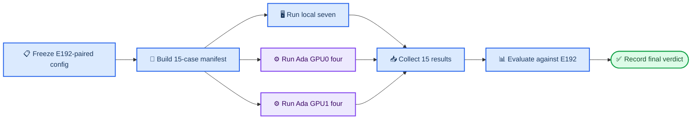

# E195 实验计划：继续收紧 CEM hand gate 的穿透控制

_Core4D · Phase 58 · 实验完成，最终判决 `SAFETY_REGRESSION` · 结果见 [log272](../log/272_E195_stricter_hand_gate_results.md) · 直接承接 [E192 A2 Full](../log/271_E192_A2_full_diagnostic_results.md)_

---

## 📋 Context

E192 A2 在 15 条 Full CEM 上证明 gate 确实按设定执行，但没有形成稳定的物理改善：

- box024 的 3 mm 穿透帧占比从历史基线 `0.3776` 降至 `0.3082`，仅 `5/9` case 改善；
- box024 固定 15 mm 口径仅 `4/9` case 改善；
- non-fallback hard-floor violation 为 `0/1152`，说明实现正确，但所选阈值仍未稳定约束最终 rollout；
- box004 出现 4 个 case×gate 的 PASS→FAIL，box024 也出现 lower-body 回退；
- Full gate health 通过，但 box024 fallback 距 E192 上限仅 `0.0034`，可行域裕度较窄。

E195 不再重复 E192 A2，也不做参数 sweep。它只沿同一方向再收紧一步，检验更浅的违规定义与硬地板能否把 E192 的不稳定改善变成多数 case 上一致的穿透下降，同时保住接触、下肢安全和 gate 可行性。

### 关键 estimand

E195 的直接配对基线是 **E192 A2**，不是更早的历史 A0：

```text
improvement(object) = mean_case(E192 A2 penetration - E195 penetration)
signed DiD = improvement(box024) - improvement(box004)
```

本实验最多回答“相对 E192 再收紧是否产生额外收益，以及收益是否更偏向 box024”。box024 与 box004 仍同时混有尺寸、几何、动作和抓取拓扑差异，因此不把 signed DiD 解释为尺寸因果。

---

## 🎯 Claims

| # | Claim | 最低证据 |
|---|---|---|
| C1 | 再收紧能稳定降低 box024 穿透 | box024 `hand_object_physics_penetration_3mm_frame_frac` 相比 E192 的 `0.3082` 至少再下降 `0.03`，且至少 `6/9` case 改善 |
| C2 | 穿透改善不是以丢失承重接触换来 | box024 `hand_object_physics_contact_3mm_in_mask_frac` 不低于 E192 超过 `0.05`，`hand_object_physics_contact_in_mask_frac ≥ 0.75`；视觉不得确认承重接触丢失 |
| C3 | 更浅的 12 mm 物理口径与新硬地板方向一致 | box024 `hand_gate_fixed_depth_12mm_frame_frac` 至少 `6/9` case 低于 E192；所有 non-fallback selected candidate 的最低 hand SDF 不越过 `-0.012 m` |
| C4 | 收紧后仍有可用候选 | Full 结果中，每个物体 `cem_hand_gate_valid_frac ≥ 0.60`，且 `cem_gate_fallback_used ≤ E192 + 0.15`；只作结果判读，不作启动门 |
| C5 | 不引入新的安全回退 | box004 不新增 12 门 PASS→FAIL；box024 任一 case 的 `leg_penetration_frac` 相比 E192 增量不超过 `0.05` |
| C6 | 报清两物体的配对效应差 | 分别报告 box024、box004 的 improvement、signed DiD 和物体内 paired bootstrap 95% CI；不为 C6 单设因果通过门槛 |
| C7 | 数值与视觉证据闭合 | 15/15 评测完成；生成 15 条 E195 self 视频与 15 条 E192/E195 paired 视频，并复核必看 case 与全部 migration case |

---

## ⚙️ 实验设计

### 单一实验臂

| 臂 | hand-gate 参数 | 新跑 Full | 作用 |
|---|---|---:|---|
| E192 A2 | `-0.010 / 0.05 / -0.015` | 0，只读 | 直接 paired baseline |
| E195 A3 | `-0.008 / 0.05 / -0.012` | 15 | 更紧 hand gate |

三项依次表示 `cem_hand_gate_min_sdf_m / cem_hand_gate_max_violation_pct / cem_hand_gate_hard_floor_m`。相对 E192，E195 只改变：

```yaml
cem_hand_gate_min_sdf_m: -0.008
cem_hand_gate_max_violation_pct: 0.05
cem_hand_gate_hard_floor_m: -0.012
```

对 100 帧候选，最多允许 5 帧低于 `-0.008 m`，且任何一帧都不得低于 `-0.012 m`。`max_violation_pct` 与 E192 相同；真正继续收紧的是违规深度起点与绝对硬地板。本轮把三项作为一个冻结策略包，不拆分各参数贡献。

### 严格冻结项

除上述三个 hand-gate 字段外，E195 与 E192 A2 保持一致：

- 同一 15 case、同一逐 case 输入、scene、trajectory、contact mask 与 retarget variant；
- CEM `1024 samples × 32 iterations`，`seed=0`；
- PRG 开启、E167A_zOnlyBody profile、`rubber_hull`、抓握目标 `ref_fk`；
- `gravcomp=0`、`partner_force_scale=0`、object actuator gain `500/50`；
- reward、surface band、leg/posture/safety gate 与其余 resolved config 字段全部不变；
- E192 的评测口径、12 门定义和 support diagnostics 全部沿用，仅追加固定 12 mm observation-only 指标。

### Case 集合

- box024 × 9：`026_p1`、`026_p2`、`027_p1`、`027_p2`、`028_p1`、`028_p2`、`030_p1`、`031_p1`、`031_p2`
- box004 × 6：`082_p1`、`082_p2`、`083_p1`、`083_p2`、`086_p1`、`086_p2`

完整 case ID 继续使用 `box024_20231011_*` 与 `box004_20231003_2_*` 前缀。总预算固定为 **15 条 Full CEM**；不增加 A0 sentinel、低预算 canary 或额外 seed。

---

## 🧩 三卡固定分片

分片原样复用 E192 最终完成映射，使每条 E195 尽可能与 E192 保持同设备配对。

| Worker | 设备 | 数量 | Case |
|---|---|---:|---|
| `local-gpu0` | 本机 GPU0 | 7 | `box024_027_p1`、`box024_027_p2`、`box024_028_p1`、`box024_028_p2`、`box024_031_p2`、`box004_083_p1`、`box004_086_p2` |
| `ada-gpu0` | 远程 RTX 6000 Ada GPU0 | 4 | `box024_026_p1`、`box024_030_p1`、`box004_082_p1`、`box004_086_p1` |
| `ada-gpu1` | 远程 RTX 6000 Ada GPU1 | 4 | `box024_026_p2`、`box024_031_p1`、`box004_082_p2`、`box004_083_p2` |

表中短名均对应上一节的完整 case ID。三个 worker 各自串行，三卡并行；不做运行中动态重分配。

本轮采用叠加式启动：不等待 GPU 空闲，不停止、暂停、迁移或抢占已有程序。E195 launcher 只管理自己的 session、日志、manifest row 与结果目录；若 E195 自身某 row 失败，记录失败并保留其余 worker 的自然执行状态，是否补跑在结果回收后单独决定。



---

## 📊 评测与统计

### 直接 paired baseline

E192 A2 已完成 15/15，核心参考值为：

| 指标 | box024 | 备注 |
|---|---:|---|
| 3 mm penetration | `0.3082` | E195 C1 的直接基线 |
| 3 mm in-mask contact | `0.3864` | E195 C2 的直接基线 |
| in-mask physics contact | `0.8037` | E195 C2 的直接基线 |
| fixed 15 mm 改善 case | `4/9` | 说明 E192 的物理改善不稳定 |
| Full fallback | `0.2987` | gate 可行域裕度较窄 |

### 必报指标

- E192 的 12 门、完整 hand/overall/leg/posture gate diagnostics 与 22 个 support diagnostics；
- `hand_object_physics_penetration_3mm_frame_frac`；
- `hand_object_physics_contact_3mm_in_mask_frac` 与 `hand_object_physics_contact_in_mask_frac`；
- `hand_gate_fixed_depth_{8,10,12,15,20}mm_frame_frac`；
- `cem_hand_gate_selected_min_sdf_m`、selected mean/p05、valid 与 fallback；
- `leg_penetration_frac`、tracking、fall 与 release/contact 指标。

所有连续指标以 case 为单位，分别对 box024 与 box004 做 paired 汇总；bootstrap 使用 seed 0、10,000 次，报告 95% CI。12 门按每个 gate 分别报告 `PASS→PASS / PASS→FAIL / FAIL→PASS / FAIL→FAIL`，不把语义不同的门合并成一个总检验。

---

## 🛡️ 判决规则

| 优先级 | 条件 | 判定 |
|---:|---|---|
| 1 | 15 条结果或必要评测未闭合 | `INCOMPLETE` |
| 2 | C5 失败 | `SAFETY_REGRESSION` |
| 3 | C1/C3 改善但 C2 失败 | `PENETRATION_CONTACT_TRADEOFF` |
| 4 | C4 失败 | `GATE_LIMITED` |
| 5 | C1/C2/C3/C4/C5/C7 全通过 | `STRICTER_GATE_EFFECTIVE` |
| 6 | 其余完整结果 | `NO_ADDITIONAL_BENEFIT` |

C4 只在 15 条 Full 完成后解释效果，不阻止 Full 启动。C6 是效应结构诊断，不单独改变主判决。即使 E195 通过，也只说明它优于 E192 A2，不自动升级为 production 默认；后续是否升级需结合本轮视觉与安全结果另行决定。

---

## 🔧 拟新增或修改文件

以下文件只列入实现范围，本次计划阶段不创建：

| 文件 | 用途 |
|---|---|
| `workspace/core4d/scripts/experiments/E195/e195_common.py` | 冻结 A3 参数、15 case、7/4/4 分片与 CEM 预算 |
| `workspace/core4d/scripts/experiments/E195/build_manifest.py` | 从 E192 A2 构建 E195 manifest，只替换三项 hand-gate 值 |
| `workspace/core4d/scripts/experiments/E195/run_cem_queue.py` | 逐 worker 串行执行本 worker 的 manifest rows |
| `workspace/core4d/scripts/launch/active/run_E195_local_gpu0.sh` | 本机 GPU0 七例入口 |
| `workspace/core4d/scripts/launch/active/run_E195_remote_Ada6000.sh` | 远程 Ada 双卡 4/4 入口 |
| `workspace/core4d/scripts/launch/active/run_E195_hybrid_3gpu.sh` | 本机一卡 + 远程两卡总入口 |
| `workspace/core4d/scripts/launch/active/pull_E195_remote_Ada6000_results.sh` | 回收远程结果并合并本地 manifest 状态 |
| `workspace/core4d/scripts/eval/runners/eval_E195_stricter_hand_gate.py` | 统一评测 E195 并加载 E192 paired baseline |
| `workspace/core4d/scripts/eval/reports/gen_E195_comparison.py` | 生成 claims、两物体汇总、paired delta 与最终判决 |
| `workspace/core4d/scripts/eval/wrappers/eval_E195_stricter_hand_gate.sh` | 评测入口 |
| `workspace/core4d/scripts/experiments/E195/render_paired_results.py` | 生成 self 与 E192/E195 paired 视频 |
| `workspace/core4d/scripts/launch/active/run_E195_render_all.sh` | 15 case 离线渲染入口 |
| `workspace/core4d/scripts/eval/core/core_metrics.py` | 仅追加固定 12 mm observation-only 指标，不改变既有指标 |

---

## ✅ 必要校验与执行顺序

计划批准后的实现只做以下必要校验：

1. manifest 恰为 15 个唯一 case，分片恰为 7/4/4；
2. 三项 hand-gate 值分别为 `-0.008 / 0.05 / -0.012`；
3. seed 为 0、预算为 `1024 × 32`，其余 resolved config 字段与 E192 A2 相同；
4. 15 条输入存在；完成后 qpos finite，且必要 diagnostics 齐全。

执行顺序固定为：构建并校验 manifest → 三卡叠加启动 15 条 Full → 回收远程结果 → 统一评测 → self/paired 渲染 → 写 E195 实验日志与结论。校验不扩展为环境普查，也不阻塞已有程序。

---

## 👁️ 视觉复核

- 生成 15 条 E195 self MP4 与 15 条 E192/E195 paired MP4；
- box024 `026_p1` 与 `027_p2` 必看，覆盖 E192 的高穿透端与低穿透端；
- 所有 12 门 migration、C1 反向 case、leg penetration 增量 case 必看；
- 每条重点 case 检查首次接触、抬起峰值、搬运中段和放下四阶段；
- 视觉重点区分贴面承重、沿面滑动、失去接触以及 lower-body 代偿。

---

## 🚫 Non-goals

- 不做阈值 sweep，不增加独立参数臂；
- 不重复 E192 A0，不运行 sentinel 或 canary；
- 不增加 seed，不扩展 box001/box023/bucket/desk；
- 不叠加 gravcomp、partner/support proxy 或 E193 抓取拓扑；
- 不改变 reward、PRG、actuator、leg/posture/safety gate；
- 不等待空卡，不干预已有程序，不做自动重分配；
- 不直接下 RL、Holosoma 或 production 升级结论。
