# E194 G1 扩展计划：box001、box023、box021 全 case 重力补偿

_Core4D · Phase 57 expansion · 2026-08-10 · 计划态；保持实验 ID `E194`，本轮只扩物体和 case，不启动执行_

---

## 📋 Context

原 [E194 计划](220_E194_object_gravity_compensation_plan.md) 在 box024 9 例与
box004 6 例上比较 A0/G1/G2/G3。结果见
[E194 log268](../log/268_E194_object_gravity_compensation_results.md)：

- G1（object body `gravcomp="1"`，平移 `kp=500`、旋转 `kp=50`）15/15
  数值稳定，改善 object tracking，保留 3 mm 承重接触并降低穿透
- G2/G3（平移 `kp=2500`）15/15 发散，不能作为扩展臂
- G1 在 box024 的 `track_obj_z_abs_err_cm_mean` 从 `5.5738` 降至
  `3.2290 cm`（`-42.1%`），在 box004 从 `4.8922` 降至
  `4.4825 cm`（`-8.4%`）
- 既有证据只覆盖两个物体，尚不能回答 G1 对大箱 box001、小箱 box023 与
  中箱 box021 是否稳定泛化

本计划保持 `E194` 命名，只新增 G1 的 72 个 case。旧 15-case 三臂 manifest、
CEM、评测与报告均为只读历史证据，不覆盖、不重写。

### 目标 case authority

| Object | 新增 G1 | A0 authority | Retarget variant | A0 z MAE |
| --- | ---: | --- | --- | ---: |
| box001 | 28 | E173 Full manifest | v1 21 / v2 7 | 4.8456 cm |
| box023 | 16 | E173 Full manifest | v1 15 / v2 1 | 5.8169 cm |
| box021 | 28 | E170 `variants.tsv` | v1 25 / v2 3 | Stage 0 冻结 |

box021 的 PRG baseline provenance 必须逐行保留：24 条来自 E170 production，
4 条来自 E169 audited reuse。不得只写成模糊的 “E170 baseline”。三物体 72/72
source row 已确认均含 result、override、scene、trajectory 与 contact mask 路径。

### 冻结假设

G1 去掉 `m·g/kp` 导致的伺服下垂，但不改变 target、reward、PRG、手部碰撞体或
CEM budget。预期收益以 z tracking 为主，3D position 的改善较小；不同物体的
收益允许异质，禁止用一个 72-case micro mean 掩盖逐物体回退。

## 🎯 Scope 与 Claims

### 冻结范围

| 轴 | 冻结值 |
| --- | --- |
| Experiment ID | `E194` |
| 新运行 arm | 仅 `G1` |
| Object | `box001`、`box023`、`box021` |
| Full case | 28 + 16 + 28 = 72 个唯一 case |
| Base profile | `E167A_zOnlyBody` |
| PRG | 开启，逐 case 复用 canonical A0 override |
| Target route | `ref_fk` |
| Retarget variant | 逐 case 保留 v1/v2，不重新选择 |
| Hand collision | `rubber_hull` |
| Object gravcomp | `1` |
| Translation / rotation gain | `500 / 50` |
| CEM | seed 0，`1024 × 32`；canary `64 × 4` |
| 主指标 | `track_obj_z_abs_err_cm_mean` |

### Claims

| Claim | 最低证据 |
| --- | --- |
| C0：scope/provenance 闭合 | 72 个唯一 case；box001=28、box023=16、box021=28；source、variant、override、scene SHA 全部可追溯 |
| C1：G1 intervention 单变量成立 | 72 个 sidecar 仅 object body 新增 `gravcomp="1"`；平移/旋转 gain 为 `500/50`；其余编译后 model 字段与 A0 一致 |
| C2：执行与数值闭合 | 72/72 Full 有 finite NPZ、resolved config、diagnostics 和 terminal status；missing=0 |
| C3：z tracking 跨物体安全泛化 | 三个物体各自 `Δz = G1-A0 ≤ +0.50 cm`，且 paired bootstrap 95% CI 上界 `≤ +1.00 cm`；至少 2/3 物体 `Δz ≤ -0.50 cm` 才支持 “有效泛化” |
| C4：3D object tracking 不以 xy 回退换 z 改善 | 三个物体各自 `track_obj_pos_err_cm_mean` 的 `Δ ≤ +1.00 cm`；至少 2/3 物体均值改善 |
| C5：承重接触保留 | 每个物体 G1 的 `hand_object_physics_contact_3mm_in_mask_frac ≥ A0-0.05` |
| C6：物理安全不回退 | 每个物体 3 mm hand penetration 与 leg penetration 的宏平均升幅均 `≤0.05`；无新增 `fall_flag`；无 non-finite/diverged case |
| C7：跨门质量不回退 | 每个物体 12 门 pass rate 相对 A0 下降 `≤10` 个百分点；所有 PASS→FAIL case 必须逐例视频复核 |
| C8：结论不受 worker/device 混淆 | 每个 worker 均覆盖三个物体；报告 `execution_profile` 分层结果；方向冲突时不得给统一推广结论 |
| C9：证据与文档闭合 | 72/72 MP4；所有 mandatory regression/outlier case 有四阶段观察；by-case/by-object/report/summary SHA 一致 |

`track_obj_z_abs_err_cm_mean` 冻结定义：

```text
mean_t(abs(z_sim(t) - z_ref(t))) * 100
```

单位为 cm，越低越好；使用公共 evaluator 的固定运动学参考与共同帧截断。主报告
逐 case 后按 object 做等权 case macro mean；跨物体汇总仅作等权 object macro
secondary summary，不使用 28/16/28 不等样本数的 micro mean 作为主结论。

## ⚙️ 实验设计

### Stage 0：零 GPU baseline 与 authority 冻结

1. 从 E173 Full manifest 精确选择 box001 28 + box023 16
2. 从 E170 `variants.tsv` 精确选择 box021 28，保留 E169 reuse provenance
3. 使用公共 `eval.core.core_metrics` 重算 72 条 A0 metrics
4. 与已冻结的 box001/box023 3D 与 z 表做 `1e-4 cm` 一致性检查
5. 输出 `g1_expansion_source_authority.tsv/json`，记录文件存在性与 SHA256

任何 row 缺 source artifact、override、scene、trajectory、contact mask 或稳定
variant identity 时，必须在构建 G1 sidecar 前停止，不能静默 skip。

### Stage 1：sidecar 构建与双重快照

为每个 case 从其 canonical PRG scene 生成独立 sidecar：

```text
scene_act_E194_G1_expansion_rubberHull_PRG_gravcomp.xml
```

构建器必须执行 XML tree signature diff，确保唯一语义差异是 object body 的
`gravcomp: 0/absent → 1`。MuJoCo load 后再做 compiled-model parity：object
`body_gravcomp=1`，其余 body/geom/mass/inertia/contact pair/actuator 字段与 A0
一致；resolved config 强制 `kp_pos=500`、`kp_rot=50`。

72 个 active case 的 source scene/既有 PRG sidecar/G1 sidecar 必须：

- 用 `git add -f` 精确纳入 active scene XML，不添加整个 ignored 目录
- 写入 `workspace/core4d/results/E194/scene_snapshot/g1_expansion/`
- manifest 记录 git state、dirty state、base/effective SHA 与构建命令

### Stage 2：三 worker canary

先用 Stage 0 的 A0 z MAE 为每个 object 选出最大误差 case；tie 按 `case_id`
字典序。三个代表 case 在 `local-gpu0`、`Ada6000-gpu0`、`Ada6000-gpu1`
各跑一次 `64 × 4`，共 9 条 canary。

canary 只验证环境、sidecar、config、路径隔离与数值稳定，不进入 Full 科学指标。
同一代表 case 的三设备输出允许优化数值不同，但 intervention/config/shape/finite
合同必须一致。

### Stage 3：Full sentinel 与 72-case Full

每个 object 选择 A0 z MAE 最大 case与最接近中位数 case，形成 6 个唯一 Full
sentinel。先以 `1024 × 32` 完整运行 sentinel；技术 stop-loss 通过后再运行剩余
66 个 case。sentinel 是 72-case Full 的一部分，不重复计数。

72 行 manifest 以 object、date/seq、person 和 retarget variant 分层分配到三个
worker。初始配额为 local/Ada0/Ada1 = `36/18/18`；canary 记录的 wall time 可在
Full 启动前调整数量，但必须满足：

- 每个 worker 都包含 box001、box023、box021
- 每个 object 不完全绑定单一设备
- 分片在启动前冻结并写 execution manifest，运行中不动态迁移
- 同一 GPU 严格串行，不抢占、不 kill 非本实验进程
- 每条 NPZ、outdir、config、log、video 路径带唯一 case/worker identity

### 工作流

```mermaid
flowchart LR
    accTitle: E194 G1 Expansion Workflow
    accDescr: Frozen source rows flow through G1 sidecar auditing, staged execution, paired evaluation, visual review, and persistent experiment records without overwriting the original E194 evidence.

    freeze_source[📋 Freeze 72 sources] --> build_sidecar[⚙️ Build G1 sidecars]
    build_sidecar --> audit_scene{🔍 Audit passed?}
    audit_scene -->|No| stop_run([❌ Stop before GPU])
    audit_scene -->|Yes| run_canary[🧪 Run 9 canaries]
    run_canary --> run_full[🚀 Run 72 Full]
    run_full --> evaluate[📊 Evaluate paired metrics]
    evaluate --> review_video[🔍 Review regressions]
    review_video --> record_result([📝 Log and tracker])

    classDef action fill:#dbeafe,stroke:#2563eb,stroke-width:2px,color:#1e3a5f
    classDef decision fill:#fef9c3,stroke:#ca8a04,stroke-width:2px,color:#713f12
    classDef terminal fill:#dcfce7,stroke:#16a34a,stroke-width:2px,color:#14532d
    classDef danger fill:#fee2e2,stroke:#dc2626,stroke-width:2px,color:#7f1d1d

    class freeze_source,build_sidecar,run_canary,run_full,evaluate,review_video action
    class audit_scene decision
    class record_result terminal
    class stop_run danger
```



## 🔧 需要修改或新增的文件

不得原地扩写旧 `e194_common.py` 的 15-case/三臂冻结合同。扩展使用独立文件和
独立 manifest 名称，避免重建时覆盖原 E194 45-row 证据。

| # | 文件 | 计划改动 |
| ---: | --- | --- |
| 1 | `scripts/experiments/E194/e194_g1_expansion_common.py` | 冻结 72-case authority、单一 G1 arm、预算、输出合同 |
| 2 | `scripts/experiments/E194/build_g1_expansion_manifest.py` | 读取 E173/E170 authority，构建 sidecar、A0 pointer、canary/Full manifests 与快照 |
| 3 | `scripts/experiments/E194/audit_g1_expansion.py` | 72-row XML/compiled-model/config/SHA/variant 审计 |
| 4 | `scripts/experiments/E194/run_g1_expansion_queue.py` | resume-safe 串行 worker；仅消费 expansion manifest |
| 5 | `scripts/experiments/E194/render_g1_expansion.py` | 72 条 self replay 与 mandatory paired replay |
| 6 | `scripts/launch/active/run_E194_G1_expansion_local.sh` | 本地 worker 真实入口 |
| 7 | `scripts/launch/active/run_E194_G1_expansion_remote_Ada6000.sh` | 远程双 worker + tmux 真实入口 |
| 8 | `scripts/launch/active/run_E194_G1_expansion_hybrid_3gpu.sh` | canary/sentinel/Full 总入口 |
| 9 | `scripts/launch/active/pull_E194_G1_expansion_remote_Ada6000_results.sh` | 仅按 execution manifest 回收本轮产物并核验 SHA |
| 10 | `scripts/launch/active/watch_E194_G1_expansion_and_finalize.sh` | 双端完成确认、pull、72-row audit、eval/render/report |
| 11 | `scripts/eval/runners/eval_E194_G1_expansion.py` | 公共 metrics 的 A0/G1 paired eval；记录 worker/device |
| 12 | `scripts/eval/wrappers/eval_E194_G1_expansion.sh` | `.venv` + MuJoCo headless shell 入口 |
| 13 | `scripts/eval/reports/gen_E194_G1_expansion_report.py` | by-case/by-object、bootstrap、claims、decision、SHA 报告 |
| 14 | `scripts/eval/reports/gen_E173_object_z_tracking_report.py` | 追加 E194 G1 的 box001/box023/box021 三组，不合并 variant/object |
| 15 | `scripts/launch/active/run_E194_G1_expansion_render_all.sh` | 72 条 self replay 与 mandatory paired replay 的 shell 入口 |

所有新 evaluator 直接 import `eval.core.core_metrics`；禁止 import
`eval.lib.core_metrics`，禁止通过 `importlib` 动态加载其他实验 evaluator。

## 🚀 固化执行入口

以下命令是计划中的本地脚本合同；脚本在 Implement 阶段创建后才可执行。本轮写
计划时不运行这些命令。

```bash
# 0. authority + A0 baseline + sidecar/snapshot
MUJOCO_GL=osmesa .venv/bin/python \
  workspace/core4d/scripts/experiments/E194/build_g1_expansion_manifest.py \
  --apply --snapshot
MUJOCO_GL=osmesa .venv/bin/python \
  workspace/core4d/scripts/experiments/E194/audit_g1_expansion.py --require-all

# 1. local + Ada6000 三 worker canary
MODE=canary bash \
  workspace/core4d/scripts/launch/active/run_E194_G1_expansion_hybrid_3gpu.sh

# 2. 六条 Full sentinel
MODE=full SENTINEL_ONLY=1 bash \
  workspace/core4d/scripts/launch/active/run_E194_G1_expansion_hybrid_3gpu.sh

# 3. resume-safe 72-case Full
MODE=full bash \
  workspace/core4d/scripts/launch/active/run_E194_G1_expansion_hybrid_3gpu.sh

# 4. 回收、评测、渲染、报告
bash workspace/core4d/scripts/launch/active/pull_E194_G1_expansion_remote_Ada6000_results.sh full
bash workspace/core4d/scripts/eval/wrappers/eval_E194_G1_expansion.sh full
bash workspace/core4d/scripts/launch/active/run_E194_G1_expansion_render_all.sh
MUJOCO_GL=egl .venv/bin/python \
  workspace/core4d/scripts/eval/reports/gen_E173_object_z_tracking_report.py
```

远程启动前必须形成只包含 E194 expansion 代码、config 与 72 个 sidecar 的 scoped
同步点并核对 SHA；不得把当前工作树的 E192/E195/optimizer 等无关改动混入同步。
没有远程资源或同步授权时不启动，不自动切换到未登记机器。

## 📊 评测与报告

### 必报层级

| 层级 | 主键 | 内容 |
| --- | --- | --- |
| By-case | source exp + case + arm | A0/G1 值、paired delta、12 门、worker/device、artifact SHA |
| By-object | object + arm | case count、case macro mean/median/range、paired bootstrap CI |
| Cross-object | arm | 等权 object macro；仅 secondary，不替代逐物体结论 |
| Device sensitivity | object + execution profile | 方向与异常 case；检查分片混淆 |

必报指标包括：

- `track_obj_z_abs_err_cm_mean`
- `track_obj_pos_err_cm_mean`
- `track_obj_z_err_m_lifted_mean`、xy/lifted 与 z-share diagnostics
- 3 mm hand contact / penetration
- leg penetration、fall、body tracking、release 与全部 12 门
- `qpos_jerk_l2_p95` 与 divergence guard

连续量按 case paired bootstrap（seed 0，10000 次）；门级报告 paired pass/flip
计数与 McNemar。n 很小时不夸大 p-value，优先报告 effect size、CI 与逐 case 表。

### 可视化

生成 72/72 G1 self MP4。以下 case 必须生成 A0/G1 paired 视频，并用
`video-frames` 抽取 grasp/lift/carry/place 四阶段关键帧：

- 所有新增 fall、non-finite、diverged case
- 所有 12 门 PASS→FAIL case
- 所有 z MAE 增加 `>1.0 cm` 或 3D position 增加 `>2.0 cm` 的 case
- 每个 object 至少 A0 z MAE 最大、最接近中位数各一例
- 每个 execution profile 至少一例

视觉记录必须写具体观察，不得留空或写“待补充”。视频显示的隐藏回退可否决统一
推广结论，但不得反向改写 S1-S5 数据构建事实。

## 🛡️ 成功标准与 stop-loss

### 技术 stop-loss

| 阶段 | Stop-loss | 动作 |
| --- | --- | --- |
| Preflight | source/variant/SHA 缺失，或 sidecar/model/config 任一 drift | GPU 运行数保持 0；修复 builder/audit 后重做 |
| Canary | 任一 non-finite、路径覆盖、错误 GPU、config/scene identity 不一致 | 停止 Full；记录错误，不以同配置盲目重跑 |
| Full sentinel | 任一物体误差 `>50 cm`、non-finite，或 2/6 新增 fall | 停止剩余 66 条；先诊断 scene/config/设备差异 |
| Full | worker 失败或 SSH 不通 | 保留已完成 row；不视为完成，不跨 worker 静默迁移 |
| Eval | A0 重算与冻结表差 `>1e-4 cm`，或 z error > 3D L2 error | 停止报告；修复 metric/provenance |

### 最终判决

| Decision | 条件 |
| --- | --- |
| `G1_EXPANSION_PASS` | C0-C2、C5-C9 全过；C3/C4 三物体均非劣，且至少 2/3 明确改善；视觉无隐藏安全回退 |
| `G1_EXPANSION_SAFE_MIXED` | 技术与安全 claim 全过，但 C3/C4 只在部分物体改善；只给 object-specific 结论 |
| `G1_EXPANSION_REGRESSION` | 任一物体 C3/C4 非劣门失败，或 C5/C6/C7 安全门失败；不推广 G1 到该物体 |
| `INCOMPLETE` | 72-row closure、评测、SHA 或 mandatory visual review 任一未闭合 |

“72/72 完成”只证明 execution complete，不等于科学 claim 通过。若结果为 mixed 或
regression，仍写完整 log 与逐物体结论，不通过更换阈值把结果改判。

## 💾 产物与复现合同

Canonical 结果全部写入 `workspace/core4d/results/E194/`：

```text
workspace/core4d/results/E194/
├── scene_snapshot/g1_expansion/
├── s6_downstream/manifests/g1_expansion_*.tsv
├── s6_downstream/execution/g1_expansion_*.json
├── s6_downstream/cem/canary_g1_expansion/
├── s6_downstream/cem/full_g1_expansion/
├── s6_downstream/eval/full_g1_expansion/
├── s6_downstream/render/full_g1_expansion/
└── s6_downstream/evidence/g1_expansion/
```

E194 canonical eval 目录至少包含：

- `e194_g1_expansion_by_case.tsv`
- `e194_g1_expansion_by_object.tsv`
- `e194_g1_expansion_summary.json`
- `E194_G1_box001_box023_box021_expansion_report.md`

同时增量更新已有跨实验 z 指标文档：

```text
workspace/core4d/results/E173/s6_downstream/eval/full/
E173_object_tracking_position_error_z_report.md
```

该跨实验文档追加 E194/G1/box001、box023、box021 三组；不得合并旧 E194 G1
box024/box004，也不得覆盖 E173/E172 A0 行。三份 TSV/JSON/Markdown 的 SHA256
写入 summary。`results/` 保持 gitignored，不 `git add -f`；只有 active scene XML、
代码、plan、最终 log、Tracker/INDEX 进入 git。

S6 evidence 只在 E194-local manifest 中追加，不修改 E168/E170/E173 的 raw contact、
template、Stage2b、target gate 或 visual QC 事实。不得把 CEM pass 宣称为 RL 成功。

## 🚫 Non-goals

- 不重跑 G2/G3，不尝试 `kp=1000/2500` sweep
- 不重跑 A0，不更换 seed、budget、reward、gate、target 或 PRG 参数
- 不重新选择 OmniRetarget v1/v2，不覆盖 source artifacts
- 不引入 partner、偏心支撑或 support proxy
- 不改公共 release gate；z 指标仍是 diagnostic
- 不生成 RL export，不下 RL/Holosoma 训练成功结论
- 不新建实验编号，不改分支，不提交或推送无关工作树变化

## 📋 执行完成后的记录

实验闭合后新建结果日志：

```text
workspace/core4d/log/273_E194_G1_box001_box023_box021_expansion_results.md
```

日志必须包含训练/CEM 计数、逐物体指标、Claims 判定、视觉实际观察、错误与恢复、
完整结果路径和下一步。随后重建 `log/INDEX.md`，将 Tracker 的 E194 同一行更新为
最终 expansion decision；不得新增伪 E196 行。只有 Claims 达成后才按 scoped files
提交与推送，建议提交信息：

```text
exp(core4d): E194 G1 object expansion — {一句话结论}
```

本计划获得执行批准前，只创建计划与状态记录，不创建脚本、不占 GPU、不修改 scene。
