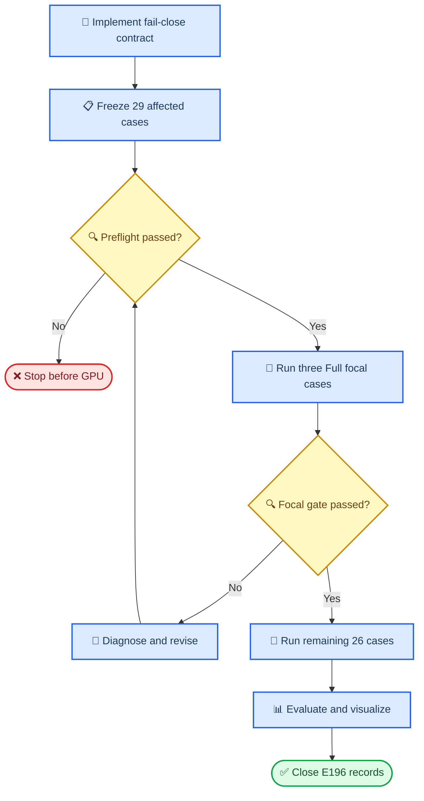

# E196 实验计划：Euler reference metadata 完整性修复与 29-case 受控重跑

_Core4D · Phase 59 · 2026-08-12 · 已完成；29/29 Full、eval、render、provenance 通过；保留1例时序人审 follow-up_

---

## 📋 Context

[E194 orientation 诊断](../log/276_E194_G1_object_orientation_outlier_diagnosis.md)
已把 expansion 中的 object orientation 长尾定位到 Euler reference metadata
完整性漏洞，而不是单一的 gravcomp 物理效应。关键证据已冻结为：

- E194 G1 expansion `72` 条中有 `29` 条 runtime convention 与 compiled
  XML hinge axis sequence 不一致
- mismatch/match 组的 PRG→G1 orientation delta mean 分别为
  `+4.399°/-0.338°`；`delta>5°` 的 `8/8` 条全在 mismatch 组
- wrong-target conversion error 与 PRG→G1 delta 的 Pearson 相关为
  `0.937`；axis-correct world quaternion round-trip max error 为 `2.96e-6°`
- mismatch 分布为 `box001=21`、`box023=8`、`box021=0`；原 E194 worker
  分布为 local/Ada0/Ada1=`7/11/11`
- 29 条中当前本地 `scene_act_meta.json` 存在/缺失=`16/13`

代码层有四个已确认漏洞：

| 层 | 已确认漏洞 | 导致的风险 |
| --- | --- | --- |
| Runtime | `run_mjwp.py` 缺 meta 时静默使用 `XYZ` | 错误 target 继续运行且不报错 |
| Loader | `hdmi.py` 加载 scene-act 时也有 `XYZ` fallback | 另一调用路径仍可静默退化 |
| Local build | E194 `runtime_complete` 只检查 scene+trajectory | 缺 meta 的 task 被误判为完整 |
| Ada deploy | 精确 rsync allowlist 未包含 `scene_act_meta.json` | 远端是否有旧 meta 决定 runtime 行为 |

E195 已用于 stricter hand gate，因此修复实验使用新 ID
`E196`。E196 不覆盖 E194 的 NPZ、log、video、eval 或人审记录；
E194 保留为 contaminated G1 authority。

### 核心 insight

compiled object hinge axis/order 是使当前 `scene_act` 模型可正确执行的
Euler convention ground truth。Runtime 应直接从 compiled model 推导并使用该
sequence，同时强制要求 sibling metadata 存在且与之一致。这样既消除
静默 fallback，也能把错误 metadata 在 GPU 启动前暴露。

## 🎯 Scope 与 claims

### 冻结范围

| 轴 | E196 冻结值 |
| --- | --- |
| Experiment / Phase | `E196` / Phase 59 |
| 重跑 authority | E194 reference conversion audit 中 `runtime_convention_matches_xml_axes=false` |
| Full case | `29` 个唯一 case；`box001=21`、`box023=8`、`box021=0` |
| Case-set SHA256 | `b7255fbb0bc67dde9fb8fd0c19cd5b2285a3aee8e74ddc0b8de4f392b2941dac` |
| SHA 定义 | 对 case ID 字典序排序，以 `\n` 连接并保留末尾 `\n` |
| Arm | 仅 corrected `G1` |
| 物理/优化 | object `gravcomp=1`，`kp_pos=500`，`kp_rot=50` |
| CEM | seed `0`，Full `1024 × 32` |
| 资源 | 本地 1 GPU + Ada6000 GPU0/GPU1；同 GPU 串行、三 GPU 并行；Ada 仅在显式门控下允许与 SUGAR 叠加 |
| 执行次数 | 每 case 仅一次 Full；不另跑 `64×4` canary |
| 结果 namespace | `workspace/core4d/results/E196/` 与 `logs/E196/` |

唯一 case-set authority 为：

```text
workspace/core4d/results/E194/s6_downstream/eval/full_g1_expansion/
e194_g1_object_orientation_reference_conversion_audit.tsv
```

`box001_20231023_110_p1` 仍属于 29 条受污染运行，所以必须重跑以
闭合 bug；但延续先前用户的人审口径，它只进入 all-29 技术补充表，
不进入 box001 primary promotion aggregate。box001 primary 因此为 `20`
条，all-affected 补充口径为 `21`条。

### Claims

| Claim | 最低证据 |
| --- | --- |
| C0：case 集合精确 | manifest `29/29`，object=`21/8/0`，case-set SHA 精确匹配，good 43 条混入=`0` |
| C1：runtime fail-close | meta 缺失、JSON 错误、convention 非法或 meta≠compiled axes 均 hard fail；无 `XYZ` fallback |
| C2：本地输入闭合 | 29/29 meta 存在且 SHA 固结；13 条缺 meta 仅生成最小 metadata，不改 scene/trajectory |
| C3：Ada 同步闭合 | 远端 19/19 row 的 meta/scene/trajectory/config/code SHA 与 execution manifest 一致，post-rsync audit 通过后才起 tmux |
| C4：单变量成立 | E196 与 E194 G1 的 raw reference、scene、physical arrays、reward、PRG、seed、budget、gain 一致；只修正 reference contract/输出路径 |
| C5：首波错 target 消失 | 3/3 focal 的 runtime-target vs raw world quaternion max error `<1e-4°`，且 public metric 重算差 `<1e-6°` |
| C6：Full 执行闭合 | 仅 29/29 corrected Full landed；NPZ/config/log/video/terminal status 齐全，non-finite=`0` |
| C7：污染长尾可被重新解释 | 报告 E196 vs contaminated G1 与 E196 vs PRG 的 by-case/by-object 结果；不预设 orientation 必须改善 |
| C8：可视化闭合 | 29/29 MP4；cluster7 7 条、至少 3 条正常修正样本及所有新长尾完成实际观察 |
| C9：artifact 可审计 | execution manifest、eval TSV/JSON/XLSX/Markdown、快照和文档 SHA 闭合，E194 artifact 零覆盖 |

## ⚙️ 修复设计

### Runtime 共享 resolver

新增单一 resolver，由 `examples/run_mjwp.py` 与
`spider/simulators/hdmi.py` 共用，避免两处各自解析 metadata：

```python
reference = resolve_scene_act_reference(model_path, compiled_model)
# reference.convention 实际取 compiled object hinge axis sequence
# sibling meta 必须存在且 convention == reference.convention
```

resolver 必须：

1. 定位 sibling `scene_act_meta.json`，缺失立即报错
2. 验证 JSON 可解析且 `euler_convention` 是 `XYZ` 六种排列之一
3. 从 compiled object body 的 3 个 positive unit hinge axes、joint order/qpos order
   推导 `xml_axis_sequence`
4. 若 metadata convention 与 compiled sequence 不同，hard fail，不覆盖
5. 使用 compiled sequence 转换 raw quaternion，不使用默认值
6. 每个 runtime 明确记录 convention、source path、meta SHA256、XML axis
   sequence 与 `parity=pass`

单测覆盖 correct `XZY/ZYX/XYZ`、missing meta、invalid JSON、invalid
permutation、wrong-but-valid convention、non-unit/negative/duplicate hinge axes。由于当前
`.venv` 未安装 `pytest`，测试同时提供零额外依赖 `main()` 入口，
不把 `pytest` 缺失误判为代码失败。

### 本地 builder 与输入修复

E196 builder 只从冻结 audit TSV 抽取 29 条 mismatch，不通过 glob
重建 case 集合。对每条 row：

- `scene_act_meta.json` 已存在时：验证 JSON、convention、compiled axes；
  不一致时停止，绝不静默覆盖
- meta 缺失时：从 E194 G1 sidecar 的 compiled hinge axes 导出最小
  `{"euler_convention": "<AXES>"}`，原子写入后重新 compile 并做
  raw world quaternion round-trip parity
- 保留修复前状态、修复动作、生成依据、meta 前/后 SHA；
  将 meta 和实际 E194 G1 scene 一起写入 E196 snapshot
- 验证 29/29 scene、trajectory、contact mask、override 与 E194 G1
  authority 的 SHA；比较 scientific config projection，只允许 experiment ID、
  output/log/video 路径不同
- 编译模型后逐数组核对 body mass/inertia/gravcomp、geom/contact、
  joint range/damping、actuator gain/bias 与 E194 G1 一致

同时修复历史 E194 builder 的 completeness 合同：
`PRIMARY_ARTIFACTS` 中任意一项缺失都不得返回 runtime complete。
该修改只防止未来重用历史入口再制造 bug，不重建、不改写
E194 artifact。

### Ada 同步与启动修复

E196 manifest 每行新增：

- `scene_act_meta_path`
- `scene_act_meta_sha256`
- `resolved_euler_convention`
- `compiled_xml_axis_sequence`
- `reference_contract_version`

Ada launcher 的 rsync allowlist 显式包含 metadata，并对远端所有
`19` 条 row 在启动 tmux 前执行 post-rsync audit。审计检查存在性、
SHA、meta↔compiled axes parity、code SHA 与输出路径冲突。任一行失败
则整个 Ada batch 不启动，不接受“远端已有同名文件”作为通过依据。

历史 `run_E194_G1_expansion_remote_Ada6000.sh` 也增加 metadata 同步与
fail-close preflight，但禁止用它启动 E196。E196 只使用独立 launcher、
tmux session、logs 和 results namespace。

2026-08-12 执行修订：用户明确允许 E196 与 Ada 上既有 SUGAR 进程
叠加。该授权不放宽为任意共享；launcher 只有在显式
`ALLOW_SUGAR_OVERLAP=1`、现有 compute app 全部命中 `sugar`
进程名 allowlist、且每卡剩余显存至少 `24 GiB` 时才放行。未知进程、
显存不足、metadata/SHA/preflight 失败仍 hard fail；不 kill、不暂停
SUGAR。该修订只影响吞吐，不改变 seed、budget、输入或科学 config。

### E196 单变量合同

E196 与原 E194 G1 每行必须满足：

```text
same(raw reference, scene XML bytes, contact mask, PRG override,
     reward, seed, samples, steps, gravcomp, kp_pos, kp_rot,
     compiled physical arrays)
different(reference contract integrity, result/log/video namespace)
```

resolved config 全文 SHA 可因输出路径不同而变，因此不做虚假的 byte-equal
要求。审计同时保存 full config SHA 和排除路径/实验标识后的
scientific projection SHA；后者必须与 E194 G1 一致。

## 🚀 执行计划

### 分阶段工作流



### Stage 0：实现与零 GPU 测试

1. 实现共享 resolver，替换 runtime/loader fallback
2. 修复 E194 builder completeness 与历史 Ada allowlist
3. 创建 E196 builder/auditor/queue/launch/pull/eval/render/report 入口
4. 运行 direct-entry unit tests、Python compile、shell syntax 和 E194 match-case
   regression，确保正确 metadata 的43条历史路径不被修复改变

### Stage 1：29-row preflight 与快照

1. 按冻结 authority 构建 29-row manifest
2. 补齐13条缺失 meta，对29/29 执行 compiled axes 和 raw quaternion parity
3. 快照 29 条 scene/meta，记录 git HEAD、dirty state、所有 SHA
4. 生成 wave0 与 remaining 的三 worker shard，检查路径冲突=`0`
5. 检查本地 1 卡与 Ada GPU0/1 的显存/进程状态；不 kill、
   不抢占其他任务；仅按上述显式 SUGAR allowlist/headroom 门叠加

### Stage 2：首波 3 条 Full

首波不是低 budget canary，而是三条最严重 box001 case 的正式 Full；
通过后直接计入 29 条，不重复跑。

| Worker | GPU | Focal case | E194 wrong-target max |
| --- | ---: | --- | ---: |
| local | `${LOCAL_GPU_ID:-0}` | `box001_20231003_2_041_p1` | `70.783°` |
| Ada0 | `0` | `box001_20231020_014_p1` | `45.203°` |
| Ada1 | `1` | `box001_20231020_014_p2` | `45.158°` |

三条全部通过 runtime/meta/reference/result gate 后才释放 Stage 3。性能未改善
不单独阻断；该门检查的是 target 确实修正且结果可评测。

### Stage 3：剩余 26 条 Full

每张卡先完成自己的全部 box001，再进入 box023。包含首波后的
最终 Full 配额为 local/Ada0/Ada1=`10/10/9`；剩余队列为
`9/9/8`。

```text
local remaining (9):
  box001_20231003_1_039_p1
  box001_20231003_1_041_p1
  box001_20231003_2_037_p1
  box001_20231003_2_039_p1
  box001_20231023_107_p2
  box001_20231023_109_p2
  box023_20231008_046_p1
  box023_20231011_021_p1
  box023_20231020_042_p1

Ada0 remaining (9):
  box001_20231003_1_040_p1
  box001_20231003_1_042_p1
  box001_20231003_2_037_p2
  box001_20231020_010_p1
  box001_20231023_108_p1
  box001_20231023_110_p1
  box023_20231008_046_p2
  box023_20231020_040_p1
  box023_20231020_042_p2

Ada1 remaining (8):
  box001_20231003_1_040_p2
  box001_20231003_1_042_p2
  box001_20231003_2_038_p1
  box001_20231020_011_p1
  box001_20231023_108_p2
  box001_20231023_110_p2
  box023_20231011_019_p2
  box023_20231020_040_p2
```

worker 中断时保留已完成 row，只允许同 worker resume-safe 继续未完成
row。不跨 worker 静默迁移，不重跑已有 terminal-pass artifact。

## 🔧 需要修改或新增的文件

| # | 文件 | 计划改动 |
| ---: | --- | --- |
| 1 | `spider/simulators/scene_act_reference.py` | 共享 fail-close resolver、compiled hinge axis 推导、meta SHA/校验 |
| 2 | `examples/run_mjwp.py` | 移除静默 `XYZ` fallback，使用 resolver 并打印可审计 runtime 记录 |
| 3 | `spider/simulators/hdmi.py` | `_load_scene_act_for_hdmi()` 改用同一 resolver，不留第二 fallback |
| 4 | `scripts/experiments/E194/build_g1_expansion_manifest.py` | completeness 覆盖全部 primary artifacts，不重建 E194 |
| 5 | `scripts/launch/active/run_E194_G1_expansion_remote_Ada6000.sh` | 历史入口补 meta sync 与远端 fail-close audit |
| 5a | `scripts/experiments/E194/audit_g1_expansion.py` | 增加 metadata parity 检查与 remote shard subset 模式 |
| 6 | `scripts/experiments/E196/e196_reference_fix_common.py` | 冻结 29-case、budget、worker、路径与 SHA 合同 |
| 7 | `scripts/experiments/E196/build_reference_fix_manifest.py` | 从 audit authority 取集、修复缺 meta、生成快照/队列 |
| 8 | `scripts/experiments/E196/audit_reference_fix.py` | local/remote preflight、single-variable、case-set、artifact audit |
| 9 | `scripts/experiments/E196/run_reference_fix_queue.py` | 每 GPU 串行、resume-safe、仅消费 E196 execution manifest |
| 10 | `scripts/experiments/E196/test_reference_contract.py` | resolver 负向测试与3条 focal 回归 |
| 11 | `scripts/experiments/E196/test_manifest_contract.py` | 29-case SHA、队列、路径、不混入 good case 的 direct-entry 测试 |
| 12 | `scripts/launch/active/run_E196_reference_fix_local.sh` | 本地单卡 wave0/remaining 真实入口 |
| 13 | `scripts/launch/active/run_E196_reference_fix_remote_Ada6000.sh` | Ada 双卡 sync/audit/tmux 真实入口 |
| 14 | `scripts/launch/active/run_E196_reference_fix_hybrid_3gpu.sh` | 本地 1 + Ada 2 并行编排与阶段门 |
| 15 | `scripts/launch/active/pull_E196_reference_fix_remote_results.sh` | 只回收 manifest 登记的 Ada artifact，核数量/SHA |
| 16 | `scripts/launch/active/watch_E196_reference_fix_and_finalize.sh` | 双端完成确认、pull、29-row audit、eval/render/report |
| 17 | `scripts/eval/runners/eval_E196_reference_fix.py` | 直接 import `eval.core.core_metrics`，比较 PRG/E194 G1/E196 G1 |
| 18 | `scripts/eval/wrappers/eval_E196_reference_fix.sh` | headless 评测固化入口 |
| 19 | `scripts/eval/reports/gen_E196_reference_fix_report.py` | by-case/by-object、direction-aware delta、XLSX/Markdown/JSON |
| 20 | `scripts/experiments/E196/render_reference_fix.py` | 29 条 self replay 和 mandatory paired replay |
| 21 | `scripts/launch/active/run_E196_reference_fix_render_all.sh` | 离线渲染固化入口 |

以上 `scripts/...` 均相对 `workspace/core4d/`。不在根 `scripts/` 新增真实
launcher，不通过 `importlib` 动态加载 E194 evaluator。

## 💻 固化执行入口

以下是 Implement 阶段必须创建后才可执行的命令合同。本轮写计划
时不运行。

```bash
# 0. Runtime/manifest regression tests
.venv/bin/python \
  workspace/core4d/scripts/experiments/E196/test_reference_contract.py
.venv/bin/python \
  workspace/core4d/scripts/experiments/E196/test_manifest_contract.py

# 1. Freeze 29 rows, repair missing metadata, and snapshot inputs
.venv/bin/python \
  workspace/core4d/scripts/experiments/E196/build_reference_fix_manifest.py \
  --apply --snapshot
.venv/bin/python \
  workspace/core4d/scripts/experiments/E196/audit_reference_fix.py \
  --scope prelaunch --require-all

# 2. Three formal Full focal cases; all three GPUs launch in parallel
MODE=wave0 LOCAL_GPU_ID=0 ALLOW_SUGAR_OVERLAP=1 bash \
  workspace/core4d/scripts/launch/active/run_E196_reference_fix_hybrid_3gpu.sh

# 3. Must pass before the remaining queue is released
bash workspace/core4d/scripts/launch/active/pull_E196_reference_fix_remote_results.sh wave0
.venv/bin/python \
  workspace/core4d/scripts/experiments/E196/audit_reference_fix.py \
  --scope wave0 --require-all

# 4. Resume-safe remaining 26 Full cases
MODE=remaining LOCAL_GPU_ID=0 ALLOW_SUGAR_OVERLAP=1 bash \
  workspace/core4d/scripts/launch/active/run_E196_reference_fix_hybrid_3gpu.sh

# 5. Recover, evaluate, render, and report
bash workspace/core4d/scripts/launch/active/pull_E196_reference_fix_remote_results.sh full
bash workspace/core4d/scripts/eval/wrappers/eval_E196_reference_fix.sh full
bash workspace/core4d/scripts/launch/active/run_E196_reference_fix_render_all.sh
```

hybrid launcher 在真正启动前还必须：

- 检查本地目标 GPU 无冲突；Ada 若共享，只允许 SUGAR allowlist 且每卡
  空闲显存 `>=24 GiB`
- 检查同名 tmux session 不存在，禁止覆盖运行中 session
- 使用显式 scoped deployment manifest 同步代码与 ignored dataset
  artifact，不 rsync 整个 dirty worktree
- 保存 local/remote code SHA、GPU snapshot、session、worker shard 和启动时间

## 📊 评测与可视化

### 对比臂与 delta 方向

| 对比 | 用途 |
| --- | --- |
| E196 corrected G1 vs E194 contaminated G1 | 直接测量 reference fix 对已污染结果的影响 |
| E196 corrected G1 vs E173 PRG | 在 target 合同修复后重新评估 G1/gravcomp |
| E194 contaminated G1 vs E173 PRG | 作为已知污染历史列，不再作物理因果依据 |

XLSX 同时保留 raw delta `candidate-baseline` 和 direction-aware
`improvement`。对 body/hand/object tracking error、penetration、orientation error
等 lower-is-better 指标，`improvement=baseline-candidate`；对 contact fraction、
pass rate 等 higher-is-better 指标，`improvement=candidate-baseline`。渐变色按
`improvement` 着色，正值绿、负值红，不再让指标方向颠倒。

### 必报指标

- `track_obj_ori_err_deg_mean`
- `track_obj_z_abs_err_cm_mean`、`track_obj_pos_err_cm_mean`
- body/left-hand/right-hand tracking errors
- 3 mm hand-object contact/penetration、leg penetration、fall/divergence
- 12-gate pass/fail 与 paired flip
- runtime-target vs raw orientation mean/max
- axis-target vs raw orientation mean/max
- runtime convention/meta/XML axis parity、artifact completeness

by-case 报告 29 条；by-object 同时报告 box001 primary20、box001
all-affected21 和 box023 8。连续量报 mean/median/range 与 paired bootstrap
95% CI；小样本不以 p-value 替代 effect size。

### 可视化

生成 E196 `29/29` self MP4。必须做 corrected G1 vs contaminated G1 vs
PRG 对照观察的 case 包括：

- cluster7 全部 7 条
- 每个 object 至少 1 条修正后正常样本，三 worker 均覆盖
- 所有 corrected G1 vs PRG orientation 回退 `>5°` 的新长尾
- 所有新 fall、non-finite、12-gate PASS→FAIL 或 object position 回退
  `>2 cm` 的 case

用现有 renderer/viser 检查 grasp/lift/carry/place；如产生 MP4，执行
`video-frames` 抽取数值 onset/peak 帧。实际观察写入 E196 log，不得留空。

## 🛡️ 成功标准与 stop-loss

### Pre-launch 强制门

| 检查 | 通过标准 |
| --- | --- |
| Case-set | `29/29`，`21/8/0`，SHA 精确，extra=`0` |
| Metadata | local 29/29 exists+SHA；remote 19/19 SHA exact |
| Convention | 29/29 meta convention == compiled XML axis sequence |
| World pose parity | axis-correct raw world quaternion max `<1e-4°`；position max `<1e-9 cm` |
| Runtime tests | missing/wrong/invalid meta 全部 hard fail，不存在 fallback |
| Scientific inputs | scene/trajectory/contact/override SHA 与 E194 G1 authority 29/29 一致 |
| Physical model | compiled physical arrays 与 E194 G1 29/29 一致 |
| Config | scientific projection SHA 29/29 一致，只允许 namespace 差异 |
| Remote deploy | post-rsync audit pass 才启动；SSH 失联时不猜测已完成 |
| Namespace | E194 collision=`0`，29 条 NPZ/outdir/config/log/video 路径两两唯一 |

任意一项失败，GPU 运行数保持 `0`。

### 首波 3-case 强制门

| 检查 | 通过标准 |
| --- | --- |
| Runtime log | 3/3 记录正确 axes、meta SHA、`parity=pass`，无 fallback 字样 |
| Target parity | 3/3 runtime-target vs raw orientation max `<1e-4°` |
| Result | 3/3 Full budget、finite NPZ、config/log/video/terminal status 完整 |
| Metric replay | public orientation metric 重算误差 `<1e-6°` |
| Isolation | scene/trajectory/physical/config projection 与 E194 G1 一致 |

任意一条失败，停止剩余 26 条，记录错误并根据三次失败协议
调整方案。不允许用同一失败配置盲目重跑。

### Full closure 与科学判决

| Decision | 条件 |
| --- | --- |
| `REFERENCE_FIX_VALIDATED` | C0-C6、C8-C9 全部通过；29/29 target/runtime/artifact 闭合 |
| `REFERENCE_FIX_VALIDATED_G1_IMPROVES` | 技术修复通过，且 corrected G1 vs PRG 的 orientation/object 结果支持改善 |
| `REFERENCE_FIX_VALIDATED_G1_MIXED` | 技术修复通过，但 G1 性能按 object/case 混合 |
| `REFERENCE_FIX_VALIDATED_G1_REGRESSION` | 技术修复通过，但 corrected G1 仍对 PRG 明确回退 |
| `INCOMPLETE` | 29-row closure、SHA、eval 或 mandatory visual review 任一未闭合 |

不把“29/29 跑完”写成“G1 全面提升”。主要硬 claim 是 reference
contract 修复；orientation 长尾是否消失、gravcomp 是否仍改善追踪，
必须由 corrected E196 vs PRG 的实测数据决定。

## 💾 产物、记录与可推进信心

### Canonical 产物

```text
workspace/core4d/results/E196/
├── scene_snapshot/reference_fix/
└── s6_downstream/
    ├── manifests/reference_fix_*.tsv
    ├── execution/reference_fix_*.json
    ├── cem/full_reference_fix/
    ├── eval/full_reference_fix/
    ├── render/full_reference_fix/
    └── evidence/reference_fix/

logs/E196/
├── launch/
├── cem/full_reference_fix/
└── monitor/

workspace/core4d/report/E196/provenance/
├── scene_snapshot/reference_fix/      # lightweight tracked mirror
├── manifests/
├── eval/
└── SHA256SUMS
```

本机 `workspace/core4d/results` 是外置盘目录 symlink，Git 不能跟踪 symlink
内部路径。因此正式运行与用户交付仍以 `results/E196` 为 canonical；Claims
闭合后只把 scene/meta snapshot、manifest、eval TSV/JSON/XLSX/Markdown 和
SHA 清单镜像到上述 repo 内 provenance 路径并提交。NPZ、MP4、CEM outdir
和运行日志不复制到 Git。

eval 至少产出：

- `e196_reference_fix_by_case.tsv`
- `e196_reference_fix_by_object.tsv`
- `e196_reference_integrity_audit.tsv`
- `e196_reference_fix_summary.json`
- `E196_reference_fix_comparison.xlsx`
- `E196_reference_metadata_integrity_fix_report.md`

完成后新建
`log/277_E196_reference_metadata_integrity_fix_results.md`，重建
`log/INDEX.md`，再将 Tracker 的 E196 计划行更新为实际 decision。
本轮不创建空结果 log、不提交、不推送。

### 风险与对应门

| 残余风险 | 预防措施 |
| --- | --- |
| 再次跑到 good case | authority boolean + count + case-set SHA 三重门 |
| Ada 残留旧 meta | 显式 rsync + remote SHA + compiled parity，不信任远端现状 |
| 只修 `run_mjwp` 却留 loader fallback | 单一 resolver 同时替换两个调用点 |
| 输出覆盖 E194 | E196 独立 namespace + collision audit |
| 外置 `results` symlink 无法入 Git | canonical 留在外置盘；轻量证据镜像到 repo 内 provenance 并校验 SHA |
| 修复同时引入物理/config drift | SHA + scientific config projection + compiled arrays 三层对照 |
| 三卡中任一失败 | 首波阻断门、worker-local resume、manifest-scoped pull |
| 远端 SSH/GPU 不可用 | 不启动、不抢占；保留队列等待原资源恢复 |

| Ada SUGAR overlap | 仅显式 allowlist + 每卡 `>=24 GiB` headroom 时共享；未知进程或显存不足则停在启动前 |

### 99% 可推进信心

本计划对“能否安全进入实现和受控跑实验”的就绪信心为
`99%`，这不是对 G1 最终指标提升概率的声称。信心来自：

- 根因已精确定位到 2 个 runtime fallback + 1 个 local completeness +
  1 个 Ada sync 漏洞
- 受影响 case 已机械冻结为29条，数量、object 分布、worker
  分布和 SHA 全部重算一致
- 29 条的 meta 现状 `16/13` 已知，且正确 axes 回放误差已有
  `<1e-4°` 级别的已验证实现可复用
- 本地/Ada 修复、队列、pull、eval、render、artifact 路径和 stop-loss
  已逐项固结
- 三个最严重 case 作为正式 Full 首波，可在消耗剩26条 GPU
  成本前验证端到端合同

剩余 `1%` 仅是外部运行时不确定性：Ada SSH/GPU 可用性、运行中
硬件/网络故障。这些不通过扩大权限或转移未登记设备规避，而是由
启动前资源检查、watcher 与 resume-safe queue 吸收。

## 🚫 Non-goals

- 不重跑 convention-match 的 43 条 good case
- 不重跑 PRG、noPRG、G2/G3，不改 seed、budget、reward、gain 或 gate
- 不把 E194 污染 NPZ/log/video 删除或替换
- 不在修复前继续解释 gravcomp 的独立 orientation 效应
- 不因 corrected G1 性能未改善而改写技术修复标准
- 不修改 E173/E194 的 raw contact、Stage2b、target gate 或人审事实
- 不创建新分支，不清理/覆盖当前 dirty worktree，不启动未登记远端
