# E198 G1×A2 因子 + E192 A2 扩展计划：box004/021/023/024 完整 2×2 交互项

_Core4D · Phase 61 · 2026-08-13 · 计划态；未获执行批准前只创建 plan 与状态记录，不写脚本、不占 GPU、不改 scene_

---

## 📋 Context

本计划把三个已完成的正交机制实验补齐成一个**完整的 2×2 因子设计**，回答一个此前被
显式推迟的问题：**object gravity compensation（G1）与 moderate hand-gate（A2）叠加时，
两者是否存在交互效应**。

前置证据：

- **G1（E194）**：object body 注入 `gravcomp="1"`，`kp_pos/kp_rot=500/50`，PRG 开启。
  判决 `PROMOTE_G1_WITH_CASE_LEVEL_EXCEPTIONS`
  （[log268](../log/268_E194_object_gravity_compensation_results.md) 原始 box024/box004；
  [log273](../log/273_E194_G1_box001_box023_box021_expansion_results.md) 扩展 box001/023/021）。
  机制：去掉 `m·g/kp` 静态下垂 → z-tracking 与 lower_body 显著改善（+18.1pp），
  但 object_ori 显著回退（−13.9pp）。
- **A2（E192）**：hand-gate 策略包 `min_sdf=-0.010 / max_violation=0.05 / hard_floor=-0.015`，
  no-gravcomp。判决 `INCONCLUSIVE_GATE_COLLAPSE`（canary 3/3 collapse，用户 waiver 后仅诊断性
  Full；C1/C3/C4/C6 FAIL），**未升级**
  （[log271](../log/271_E192_A2_full_diagnostic_results.md)）。只跑过 box024×9 + box004×6，
  box021/box023 从未跑过 A2。
- **E192 log 下一步 #4 明确要求**：「组合 E192/E194/E193 前另写新 plan；不得把 gravcomp、
  阈值与抓握目标直接叠加后声称单机制归因」。**本计划即该新 plan。**

### 用户决策（2026-08-13 澄清）

| 决策项 | 选择 |
| --- | --- |
| box021/box023 补臂 | **A2 + G1+A2（完整 2×2）** |
| G1+A2 是否含 box004 | **含**（box024×9 + box004×6） |
| 实验编号 | **E198（G1+A2 组合） + E192 扩展（A2-only 补 box021/023）** |
| 核心目标 | **纯因子探索（估计 G1×A2 交互项）**；A2 governance 仍冻结为诊断性 |

### 数据格局与 2×2 单元（母集 = box001/004/021/023/024 = 28/6/28/16/9）

box001 不涉及本轮。四个物体各自 2×2：

| Object | none = A0/PRG | G1 (gravcomp) | A2 (hand-gate) | G1+A2 |
| --- | --- | --- | --- | --- |
| box004 (6) | E172 PRG（已有） | E194 log268（已有） | E192（已有） | **E198 新** |
| box024 (9) | E173 PRG（已有） | E194 log268（已有） | E192（已有） | **E198 新** |
| box021 (28) | E170/E169 audited（已有） | E194 扩展 log273（已有） | **E192-ext 新** | **E198 新** |
| box023 (16) | E173/E179（已有） | E194 扩展 log273（已有） | **E192-ext 新** | **E198 新** |

**新增 GPU 运行（合计 103 条 Full CEM）**：

| 实验 ID | 臂 | Cases | 计数 |
| --- | --- | --- | ---: |
| E192-ext | A2 | box021(28) + box023(16) | 44 |
| E198 | G1+A2 | box004(6) + box024(9) + box021(28) + box023(16) | 59 |

### 执行优先级（本地 8 卡统一队列，跨两实验按序调度）

103 条在**本机 8× A100-80GB** 上并行，**与其他程序叠加共跑**（不 kill 非本实验进程、
不抢占、按空闲显存动态派发）。统一 priority 队列跨 E198 + E192-ext，严格按下表 tier
顺序出队：高 tier 未派完不派低 tier（同 tier 内按 `object,case_id` 字典序）。

| Tier | 内容 | 实验 | Cases | 计数 |
| :---: | --- | --- | --- | ---: |
| **P0（最高）** | box024 G1+A2 | E198 | 9 | 9 |
| **P1** | box021 + box023 **A2** | E192-ext | 28 + 16 | 44 |
| **P2** | box021 + box023 **G1+A2** | E198 | 28 + 16 | 44 |
| **P3（最后）** | box004 G1+A2 | E198 | 6 | 6 |

### 干预定义（全部相对 A0/PRG 单变量可验证）

| 因子 | A0 值 | 干预值 | 施加方式 |
| --- | --- | --- | --- |
| **G**（gravcomp） | object body 无 `gravcomp`（=0），`kp 500/50` | object body `gravcomp="1"`，`kp 500/50` 不变 | scene sidecar（`scene_name=scene_act_E194_G1_expansion_rubberHull_PRG_gravcomp`） |
| **A**（hand-gate） | `min_sdf=-0.010 / max_violation=0.10 / hard_floor=-0.020` | `min_sdf=-0.010 / max_violation=0.05 / hard_floor=-0.015` | config override（`e192_common.a2_overrides()`） |

- A0 = (G=0, A=0)；G1 = (G=1, A=0)；A2 = (G=0, A=1)；**G1+A2 = (G=1, A=1)**。
- G1+A2 在 CLI 上 = G1 gravcomp sidecar `scene_name` + A2 三字段 hand-gate override，
  是纯 config/scene 组合，不改 reward、target(`ref_fk`)、PRG、CEM budget、hand collision(`rubber_hull`)。

### 冻结不变量（四个单元共享，否则因子不可比）

`E167A_zOnlyBody` profile · PRG 开启 · `rubber_hull` · CEM `seed=0 / 1024×32` · target `ref_fk` ·
`partner_force_scale=0` · 逐 case 保留 v1/v2 retarget variant · `kp_pos/kp_rot=500/50`。

## 🎯 Scope 与 Claims

### 主分析量：G1×A2 交互项

对每个物体、每个连续指标 M，2×2 完成后：

```text
主效应 A|G=0 = M(A2)    − M(A0)
主效应 A|G=1 = M(G1+A2) − M(G1)
主效应 G|A=0 = M(G1)    − M(A0)
主效应 G|A=1 = M(G1+A2) − M(A2)
交互项 INT   = M(G1+A2) − M(A2) − M(G1) + M(A0)
```

交互项按 case 做 paired bootstrap（seed 0，10000 次），逐物体报告点估计 + 95% CI。
`INT≈0` ⇒ 两机制近似可加；`INT<0`（对越低越好的指标）⇒ 协同（组合优于叠加预期）；
`INT>0` ⇒ 相互抵消/冗余。**不做任何升级判决**——A2 的 `INCONCLUSIVE_GATE_COLLAPSE`
governance 不被本轮推翻。

主指标（每个都报交互项）：`hand_object_physics_penetration_3mm_frame_frac`（A2 目标）、
`track_obj_z_abs_err_cm_mean`（G1 目标）、`track_obj_pos_err_cm_mean`、
`leg penetration`、`hand_object_physics_contact_3mm_in_mask_frac`，
以及 12-gate 中的 `lower_body`、`object_ori`、`hand_penetration`。

### Claims

| Claim | 最低证据 |
| --- | --- |
| **C0 scope/provenance 闭合** | 103 条新 run + 四物体 4 单元的 authority 全部可追溯；每个 case 的 source、variant、override、scene SHA 记录；box021 PRG provenance 逐行保留（24 条 E170 production + 4 条 E169 audited reuse） |
| **C1 单变量 intervention 完整** | G 因子仅改 object `gravcomp`（sidecar tree-signature diff）；A 因子仅改 2 个 hand-gate 字段（config diff）；G1+A2 = 两者且**仅**两者（compiled-model 除 `body_gravcomp[object]` 外全等 A0，resolved config 除 3 个 gate 字段外全等），59 + 44 行全审计通过 |
| **C2 执行与数值闭合** | 103/103 Full 有 finite NPZ、resolved config、diagnostics、terminal status；missing=0；eval errors/non-finite/diverged=0 |
| **C3 baseline authority parity** | 复用的 A0/G1/A2 rollout 用公共 `eval.core.core_metrics` 重打分，与已冻结 E194/E197 表比对：z 指标 `≤1e-4 cm`；若 parity 失败（GPU/CUDA 非确定性漂移），交互项判为 `CONFOUNDED`，不做协同/冗余归因 |
| **C4 交互项估计闭合** | 四物体各自 2×2 完整；每物体每主指标报告 INT 点估计 + paired bootstrap 95% CI + 四个主效应；仅 object-specific，不外推全物体 |
| **C5 承重接触保留** | G1+A2 每物体 `contact_3mm_in_mask_frac ≥ A0−0.05`（安全底线，非升级门） |
| **C6 物理安全无灾难回退** | G1+A2 无新增 `fall_flag`、non-finite、diverged；逐物体报告 leg/hand penetration delta（探索量，不设硬门） |
| **C7 gate migration 透明** | 四个臂转换（A0→A2、A0→G1、G1→G1+A2、A2→G1+A2）全部报告逐 case P→F/F→P + exact McNemar；box023 strict-12 逐 case 保留 |
| **C8 device confound 受控** | priority 队列按空闲卡 round-robin 派发，object×GPU 近随机、无物体绑定单卡；execution manifest 记录每 case 落卡 GPU id，报告按 GPU 分层；方向冲突时不给统一结论 |
| **C9 证据闭合** | 103/103 MP4；所有新增 fall/non-finite/PASS→FAIL/`Δz>1cm`/`Δ3D>2cm` case 生成 A0/G1/A2/G1+A2 四单元 paired 视频 + grasp/lift/carry/place 四阶段帧；report/TSV/workbook SHA 一致 |

## ⚙️ 实验设计（分阶段）

### Stage 0：零 GPU authority 冻结与 baseline 重打分

1. 从 E170 `variants.tsv`（+E169 reuse provenance）冻结 box021×28、从 E173/E179 冻结
   box023×16 的 A0/G1 authority pointer 与 variant identity（复用 E194 扩展 authority，
   不重选 variant）。
2. 从 E172/E173 冻结 box004×6、box024×9 的 A0/G1/A2 authority pointer（G1=E194 log268，
   A2=E192）。
3. 用公共 `eval.core.core_metrics` 重算所有**已有** A0/G1/A2 单元 metrics，与已冻结
   E194/E197 表做 `1e-4 cm` 一致性检查（**C3 baseline parity**）。
4. 输出 `e198_factorial_authority.tsv/json`，记录文件存在性、SHA256、variant identity。

任一 row 缺 source artifact / override / scene / trajectory / contact mask / variant identity
→ 在构建新 sidecar 前停止，不静默 skip。

### Stage 1：sidecar / config 构建与双重快照

- **A2-only（E192-ext，box021/023）**：scene = base PRG scene_act（与 A0 同），
  仅 config override `a2_overrides()`。快照 base PRG scene 到
  `results/E192/scene_snapshot/a2_expansion/`。
- **G1+A2（E198，四物体）**：复用 E194 gravcomp sidecar builder 生成
  `scene_act_E198_G1A2_rubberHull_PRG_gravcomp.xml`（object `gravcomp:0→1`，其余全等），
  叠加 A2 config override。快照 gravcomp sidecar 到 `results/E198/scene_snapshot/g1a2/`。
- 构建器执行 XML tree-signature diff + compiled-model parity；manifest 记录 git HEAD、
  dirty state、base/effective SHA、构建命令。
- 活跃 scene XML 用 `git add -f` 精确纳入（不 add 整个 ignored 目录）。

### Stage 2：canary（诊断性，不进科学指标）

按 tier 各选 P0 / P1 / P2 / P3 的 A0 主指标最坏 case（tie 按 `case_id` 字典序）各 1 例，
在 3 张空闲 GPU 上各跑 `64×4`。只验证 plumbing、sidecar、config、路径隔离、数值稳定。
**A2 canary 若再现 gate collapse，记录但不阻断**（A2 governance 已冻结为诊断性，本轮为因子
探索；与 E192 一致地不重复失败，但按用户此前 waiver 精神继续诊断性 Full）。

### Stage 3：Full sentinel + 103-case 本地 8 卡 priority 队列

- 每 tier 内每物体每臂选「A0 主指标最坏 + 最接近中位数」共 8 例 sentinel，先 `1024×32` 跑，
  技术 stop-loss 通过后放开队列。sentinel 属于 Full，不重复计数。
- **调度器 = 本地 8 卡统一 priority 队列（跨 E198 + E192-ext）**：
  - 出队顺序严格 `P0 → P1 → P2 → P3`；高 tier 未派完不派低 tier，同 tier 内 `object,case_id` 字典序。
  - **叠加共跑**：派发前 `nvidia-smi` 查每卡 free memory，仅当 free ≥ 预留阈值（canary 实测
    单 run 峰值 + 安全裕量，preflight 冻结）才派；**不 kill、不抢占**其他程序（GPU0/2/4 现有 job
    照常运行）。
  - 每卡默认 1 个本实验 run（`num_envs` 保持 CEM 冻结值）；某卡被其他程序占满则跳过、待其释放。
  - resume-safe：完成的 case 有 terminal status，重启只补未完成 row。
  - 每条 NPZ/outdir/config/log/video 带唯一 `case/arm/gpu` identity；execution manifest 记录每
    case 实际落卡的 GPU id（供 C8 device-confound 分层）。
  - 全程 local，无远程 worker、无跨机迁移。

```mermaid
flowchart LR
    accTitle: E198 G1xA2 Factorial Workflow
    accDescr: Freeze four-object authority, re-score existing cells for baseline parity, build G1A2 sidecars and A2 config overrides, run staged CEM on a local 8-GPU priority queue coexisting with other jobs, then estimate the interaction term with paired bootstrap and mandatory visual review before recording results.

    freeze[📋 Freeze 4-object 2x2 authority] --> rescore{🔍 Baseline parity ≤1e-4?}
    rescore -->|No| confound[⚠️ Mark CONFOUNDED]
    rescore -->|Yes| build[⚙️ Build G1A2 sidecar + A2 override]
    build --> audit{🔍 Single-variable audit?}
    audit -->|No| stop([❌ Stop before GPU])
    audit -->|Yes| canary[🧪 canary per tier]
    canary --> full[🚀 103 Full · local 8-GPU priority queue P0→P3]
    full --> factorial[📊 Interaction term + bootstrap]
    confound --> factorial
    factorial --> review[🔍 Mandatory paired video]
    review --> record([📝 log283 + log284 + tracker])

    classDef action fill:#dbeafe,stroke:#2563eb,stroke-width:2px,color:#1e3a5f
    classDef decision fill:#fef9c3,stroke:#ca8a04,stroke-width:2px,color:#713f12
    classDef terminal fill:#dcfce7,stroke:#16a34a,stroke-width:2px,color:#14532d
    classDef danger fill:#fee2e2,stroke:#dc2626,stroke-width:2px,color:#7f1d1d

    class freeze,build,canary,full,factorial,review action
    class rescore,audit decision
    class record terminal
    class stop,confound danger
```



## 🔧 需要新增的文件

不得原地扩写 E192 的 15-case `e192_common.py` 或 E194 的 72-case
`e194_g1_expansion_common.py`；使用独立文件与独立 manifest 名。所有新 evaluator 直接
`import eval.core.core_metrics`，禁止 `importlib` 动态加载其他实验 evaluator，禁止
import `eval.lib.core_metrics`。

### E192 扩展（A2-only，box021/023）

| # | 文件 | 计划改动 |
| ---: | --- | --- |
| 1 | `scripts/experiments/E192/e192_a2_expansion_common.py` | 冻结 44-case A2 authority、单臂、budget、输出合同 |
| 2 | `scripts/experiments/E192/build_a2_expansion_manifest.py` | 读 E170/E169 + E173/E179 authority，构建 A2 config manifest、A0/G1 pointer、canary/full manifest、快照 |
| 3 | `scripts/experiments/E192/audit_a2_expansion.py` | 44-row config-only diff（仅 2 gate 字段）+ no-gravcomp + 其余全等 A0 |
| 4 | `scripts/eval/runners/eval_E192_a2_expansion.py` | A0/A2 paired eval（box021/023），记录落卡 GPU id |
| 5 | `scripts/eval/reports/gen_E192_a2_expansion_report.py` | A2 跨物体（含原 box024/004）by-object/gate 报告 |

> E192-ext 的 44 条 Full 不单独起 launch 脚本，由 E198 的本地 priority 调度器统一按 tier 派发。

### E198（G1+A2 组合 + 联合因子分析）

| # | 文件 | 计划改动 |
| ---: | --- | --- |
| 8 | `scripts/experiments/E198/e198_common.py` | 冻结四物体 2×2 authority、四臂 pointer、G1+A2=sidecar+A2、budget、输出合同 |
| 9 | `scripts/experiments/E198/build_g1a2_manifest.py` | 复用 E194 gravcomp sidecar builder + A2 override，构建 59-row manifest；**联合 E192-ext 44 行生成 103-row tiered priority manifest**（P0-P3）、canary/sentinel、快照 |
| 10 | `scripts/experiments/E198/audit_g1a2.py` | 59-row：scene=gravcomp-only diff **且** config=A2-two-field-only diff + compiled-model parity |
| 11 | `scripts/experiments/E198/run_local_priority_queue.py` | **本地 8 卡 priority 调度器**：按 P0→P3 出队；派发前查每卡 free memory，仅共跑不 kill/不抢占；resume-safe；记录落卡 GPU id；跨 E198 + E192-ext 统一消费 |
| 12 | `scripts/experiments/E198/render_g1a2.py` | 103 条 self replay + mandatory 四单元 paired replay |
| 13 | `scripts/launch/active/run_E198_local_8gpu.sh` | canary/sentinel/full 本地总入口（调用 priority 调度器，`GPUS`、`PER_GPU_MEM_MIB` 可配） |
| 14 | `scripts/launch/active/watch_E198_and_finalize.sh` | 队列完成确认、audit、eval/render/report |
| 15 | `scripts/eval/runners/eval_E198_factorial.py` | 四物体 2×2 联合 eval；交互项 + paired bootstrap；消费 A0/G1/A2/G1+A2 全部单元 |
| 16 | `scripts/eval/wrappers/eval_E198_factorial.sh` | `.venv` + MuJoCo headless 入口 |
| 17 | `scripts/eval/reports/gen_E198_factorial_report.py` | by-case/by-object/interaction/gate-migration/decision/SHA 报告 + XLSX |

## 🚀 固化执行入口（Implement 阶段创建脚本后才可运行）

```bash
# 0. authority 冻结 + baseline 重打分 parity（C3）+ 构建 103-row tiered manifest
MUJOCO_GL=osmesa .venv/bin/python \
  workspace/core4d/scripts/experiments/E192/build_a2_expansion_manifest.py --apply --snapshot
MUJOCO_GL=osmesa .venv/bin/python \
  workspace/core4d/scripts/experiments/E198/build_g1a2_manifest.py --apply --snapshot   # 生成 P0-P3 队列
MUJOCO_GL=osmesa .venv/bin/python \
  workspace/core4d/scripts/experiments/E192/audit_a2_expansion.py --require-all
MUJOCO_GL=osmesa .venv/bin/python \
  workspace/core4d/scripts/experiments/E198/audit_g1a2.py --require-all

# 1. canary（每 tier 1 例，占 3 张空闲卡）
MODE=canary bash workspace/core4d/scripts/launch/active/run_E198_local_8gpu.sh

# 2. sentinel（每 tier 每物体每臂 最坏+中位数）
MODE=full SENTINEL_ONLY=1 bash workspace/core4d/scripts/launch/active/run_E198_local_8gpu.sh

# 3. resume-safe 103-case 本地 8 卡 priority Full（跨 E198 + E192-ext，P0→P3）
#    与其他程序叠加共跑；GPUS 默认全 8 卡，PER_GPU_MEM_MIB 为单 run 预留阈值（canary 实测后冻结）
MODE=full GPUS=0,1,2,3,4,5,6,7 PER_GPU_MEM_MIB=40000 \
  bash workspace/core4d/scripts/launch/active/run_E198_local_8gpu.sh

# 4. 评测、渲染、报告（全 local，无 pull）
bash workspace/core4d/scripts/eval/wrappers/eval_E192_a2_expansion.sh full
bash workspace/core4d/scripts/eval/wrappers/eval_E198_factorial.sh full
bash workspace/core4d/scripts/experiments/E198/render_g1a2.py --full
```

**本地共跑纪律**：调度器只在目标 GPU free memory ≥ `PER_GPU_MEM_MIB` 时派发本实验 run，
**绝不 kill 或抢占** GPU0/2/4 等已有 job；某卡被占满则跳过、待释放后再补。`PER_GPU_MEM_MIB`
由 canary 实测单 run 峰值 + 安全裕量确定并在 Full 启动前冻结。

## 📊 评测与报告

| 层级 | 主键 | 内容 |
| --- | --- | --- |
| By-case | object + case + arm | 四单元值、四主效应、交互项、12 门、worker/device、SHA |
| By-object | object | 2×2 cell means、交互项 + bootstrap CI、strict-12 |
| Interaction | object + metric | INT 点估计 + 95% CI + 四主效应；可加性判读 |
| Gate migration | object + arm-transition | 12 门 P→F/F→P + exact McNemar |
| Device sensitivity | object + execution_profile | 方向与异常 case |

连续量按 case paired bootstrap（seed 0，10000 次）；门级报告 pass/flip + McNemar；
n 小时优先 effect size / CI / 逐 case 表，不夸大 p-value。

### 可视化（强制，rule 9）

生成 103/103 新臂 self MP4。以下 case 生成 A0/G1/A2/G1+A2 四单元 paired 视频 +
`video-frames` 抽 grasp/lift/carry/place 四阶段帧，逐例写具体观察（禁止留空 / 「待补充」）：

- 所有新增 fall / non-finite / diverged case
- 所有 12 门 PASS→FAIL case（任一 arm 转换）
- 所有 `Δz>1.0cm` 或 `Δ3D>2.0cm`（G1+A2 相对任一单干预）case
- 每物体 A0 主指标最坏 + 中位数各一例
- 每 execution_profile 至少一例

## 🛡️ 成功标准与 stop-loss

### 技术 stop-loss

| 阶段 | Stop-loss | 动作 |
| --- | --- | --- |
| Baseline parity | 复用单元重打分与冻结表差 `>1e-4 cm` | 交互项判 `CONFOUNDED`；不做协同/冗余归因，记录漂移根因 |
| Preflight | source/variant/SHA 缺失，或 sidecar/model/config drift | GPU 运行数保持 0；修 builder/audit 后重做 |
| Canary | non-finite / 路径覆盖 / 错误 GPU / config-scene identity 不一致 | 停止 Full；不以同配置盲目重跑（A2 gate collapse 记录但不阻断） |
| Full sentinel | 任一 arm 误差 `>50cm`、non-finite、或 2/N 新增 fall | 停剩余 Full；先诊断 scene/config/设备差异 |
| Full | 某 GPU 被其他程序占满 / 本实验 run OOM | 该 case 跳过待释放后重派；**不 kill 他人进程**；保留已完成 row，不静默丢弃 |
| Eval | 重算与冻结表差 `>1e-4 cm`，或 z error > 3D L2 error | 停报告；修 metric/provenance |

### 最终判决（因子探索，无升级）

| Decision | 条件 |
| --- | --- |
| `FACTORIAL_CHARACTERIZED` | C0-C4、C7-C9 通过；四物体交互项均有 CI；C5/C6 安全底线守住；结论 object-specific，不升级 A2/G1+A2 |
| `FACTORIAL_MIXED_WITH_SAFETY_FLAGS` | 技术闭合，但 C5/C6 在部分物体触发安全 flag → object-specific 警示 |
| `CONFOUNDED` | C3 baseline parity 失败 → 交互项不可干净归因；报告为 limitation，不宣称协同/冗余 |
| `INCOMPLETE` | closure / eval / SHA / mandatory visual review 任一未闭合 |

「103/103 完成」只证明 execution complete，不等于科学结论；A2 的
`INCONCLUSIVE_GATE_COLLAPSE` governance 不被推翻，本轮不生成任何 promotion / RL export 结论。

## 💾 产物与复现合同

```text
workspace/core4d/results/E192/
├── scene_snapshot/a2_expansion/
└── s6_downstream/{manifests,execution,cem,eval,render}/a2_expansion/

workspace/core4d/results/E198/
├── scene_snapshot/g1a2/
└── s6_downstream/
    ├── manifests/g1a2_*.tsv
    ├── execution/g1a2_*.json
    ├── cem/{canary_g1a2,full_g1a2}/
    ├── eval/full_factorial/
    │   ├── e198_factorial_by_case.tsv
    │   ├── e198_factorial_by_object.tsv
    │   ├── e198_interaction_terms.tsv
    │   ├── e198_gate_migrations.tsv
    │   ├── e198_factorial_summary.json
    │   ├── E198_G1xA2_factorial_report.md
    │   └── E198_factorial_comparison.xlsx
    └── render/full_g1a2/
```

`results/` 保持 gitignored，不 `git add -f`；只有 active scene XML、代码、plan、最终 log、
Tracker/INDEX 进入 git。不修改 E168/E170/E172/E173/E179/E189/E192/E194 的 raw contact、
template、target gate 或 visual QC 事实。

## 🚫 Non-goals

- 不重跑已有 A0/G1/A2 rollout（复用历史产物 + 公共 evaluator 重打分；与 E194 扩展一致）
- 不搜索最优 gate 阈值，不拆分 A2 两参数各自贡献，不尝试 kp sweep（E194 已证 kp=2500 发散）
- 不升级 A2 或 G1+A2 为 production 默认；不推翻 A2 governance
- 不重新选 v1/v2 variant，不覆盖 source artifact
- 不引入 partner / 偏心支撑 / support proxy / 抓握拓扑重定位（那是 E193）
- 不改公共 release gate；z 与交互项仍是 diagnostic
- 不生成 RL export，不下 RL/Holosoma 训练成功结论
- 不改分支（core4d 方向内的参数变体，沿用当前分支）；不提交无关工作树变化
- box001 不涉及本轮

## 📋 执行完成后的记录

- E192-ext 结果日志：`log/283_E192_a2_expansion_box021_box023_results.md`
- E198 结果日志：`log/284_E198_g1xa2_factorial_results.md`（含四物体 2×2 交互项、逐物体判决、
  视觉实际观察、错误与恢复、完整结果路径、下一步）
- 重建 `log/INDEX.md`；Tracker 新增两行：`E192-ext`（A2 跨物体扩展）与 `E198`（G1×A2 因子），
  描述列 ≤80 字符 + log 链接。
- Claims 达成后按 scoped files 提交推送，建议：
  - `exp(core4d): R283 E192-ext A2 box021/023 — {一句话结论}`
  - `exp(core4d): R284 E198 G1×A2 factorial — {一句话结论}`

本计划获执行批准前，只创建 plan 与状态记录，不创建脚本、不占 GPU、不修改 scene。
