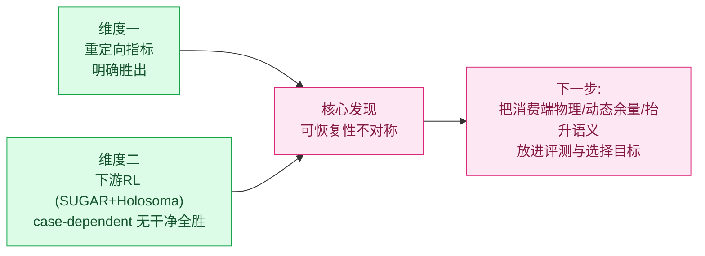

# 面向人机协作的动力学重定向 · 阶段汇报（精简版）

> CORE4D 人机协作重定向 · 2026-06-23 · 汇报给老师/同行
> 基线：OmniRetarget（运动学重定向）｜方法：SPIDER（动力学重定向）+ 下游 RL

---

## 一句话

我们在 OmniRetarget 运动学结果之上做 SPIDER 动力学优化，核心是两维对比：**(1) 重定向数值指标——明确胜出；(2) 下游 RL 指标——出现 SPIDER 决定性胜例，但 case-dependent**。最有价值的发现是揭示了"上游赢≠下游赢"的结构性原因：**可恢复性不对称**。

---

## 背景与动机

- **目标场景**：人机物理协作（协作搬运/装配/递物）——持续、高频、动态接触，要求物理合规的参考运动。
- **上游瓶颈**：OmniRetarget 是纯运动学方法，接触丰富场景下**穿模、脚滑、接触失真**严重，且 G1 比人矮臂短，按比例压缩拓扑后手只够到箱底（0% 侧面夹持）——运动学可达性极限。
- **本方法**：用 SPIDER 在物理仿真里把运动学参考优化成动力学可行轨迹，再接 SUGAR/Holosoma 下游 RL 闭环。

---

## 评测前提：公平协议

弃用"自己评自己"的指标（OmniRetarget 的 tracking 误差天然≈0）。**共同参考只能来自 CORE4D raw**（raw object / contact mask / scene），各方法只交 qpos，分层报告 reference-level（物理/几何）与 rollout-level（下游 RL）。

---

## 亮点

### ① 维度一 · 重定向数值指标显著超越 OmniRetarget

clean8 统一基准（同一物理口径，E156）：

| method | in-mask 物理接触↑ | 手-物物理穿透↓ | fall | tracking |
|---|---:|---:|:--:|:--:|
| OmniRetarget | 0.034 | **0.576** | 0 | 8/8 |
| **SPIDER (+gateA)** | **0.153** | **0.202** | 0 | 8/8 |

- 相对 OmniRetarget：**穿透 −0.375、真实接触 +0.119**，0 fall、tracking 不退化。
- OmniRetarget 的"接触"大半是**压入式穿透**；SPIDER 把穿透压低一个量级，同时把真实接触提高 4-5 倍。
- 接触回退也已修复（E163 narrowSurfaceBand）：box023 raw 接触 `0.75→0.88`，穿透仍远低于基线。

### ② 维度二 · 下游 RL（两个独立消费端项目，case-dependent，无干净全胜）

下游有**两个独立 RL 项目**，reward/eval 口径不同，分开报告：

**SUGAR**（refiner RL，staggered-phase eval，Holosoma-like success 均值）：

| 上游 | box004 | box021_029 | box021_035 | box023 | 均值 |
|---|:--:|:--:|:--:|:--:|:--:|
| E163 | 0.00 | **0.73** | 0.06 | 0.00 | 0.133 |
| E167A | 0.16-0.31 | 0.05 | 0.27 | 0.00 | 0.130 |

→ 上游 E163→E167A 提质在 SUGAR 上是**重分布而非整体提升**（box004 升、box021_029 跌、均值持平）。box021_029_p2 在 E163 下 SPIDER 决定性胜（≈0.73，OmniRetarget 同 case 0）。

**Holosoma**（WBT RL，E167A 四 case）：box004_083_p1 force-gate `0.172`；box021_035_p1 force-gate `0.000` 但 handbox 正控 `0.250`；box021_029_p2 `0.000`。

**跨项目关键发现**：同一条 box021_035_p1 参考，SUGAR≈0.33 / Holosoma force-gate 0.00 / Holosoma handbox 0.25——**下游成败被消费端 reward/termination 设计支配，不是上游数据质量**。→ 用下游 binary success 给上游方法排名统计上不成立。

### ③ 最具价值的发现 · 可恢复性不对称

> SPIDER 把"接触/穿透/tracking"刷到最好，但这恰是 **RL 最能自我修复**的维度；真正决定下游成败的三件事——**接触能否在消费端物理被复现、离硬终止门的动态余量、抬升高度语义**——SPIDER 一个都没度量。所以上下游脱钩是结构性的。

直接证据（box004 一例同时印证）：参考接触 0.036 → RL 自学到 0.54（接触可恢复，预测力弱）；final error 0.041 比 OmniRetarget 还好，却 height 0/64（抬升语义未进选择目标）。

配套诊断结论：
- 下游 binary success 是**悬崖型 + 近确定性（N≈1）**——失败都是擦边越门（差 1.7-3cm），64 env 行为几乎一致 → 不适合做上游方法 ranker。已用 **staggered-phase eval** 拉开分辨率：`box021 0.67 > box004 0.48 > box023 0.00`。
- 接触是**三种相反的病**：box021 健康 / box004 接触太少（embodiment gap）/ box023 接触太多（手贴髋自碰撞，且**继承自源人体姿态、非 CEM 引入**）——单一标量必然误导修复方向。

### ④ 工程化与可复现

data_construction_v3 六阶段管线（release audit 65/65）；RL handoff 全链路打通（E161 8/8、E163 3/3 export ready，partner OmniRetarget 7/8、3/3 pass）；scene XML 双保险快照。**重大数据修复**：E103 发现 87/198 scene 存在 inertial 污染，推翻 E082-E094 全部失败归因。

---

## 不足与后续规划

**不足**
1. 两个下游项目（SUGAR、Holosoma）均非对 OmniRetarget 的干净全胜；上游 E167A 提质在 SUGAR 上是重分布、Holosoma 上 case-dependent。
2. 下游成败被消费端 reward/termination 设计支配（同一参考 SUGAR 0.33 / Holosoma force-gate 0.00 / handbox 0.25）→ binary success 不适合给上游排名（再叠加悬崖型+近确定性）。
3. SPIDER eval 缺三类 downstream-critical 信号（消费端接触可见性 / 动态余量 / 抬升语义）。
4. 两个工程 bug：box023 初始自碰撞穿透、box004 接触标签与 proxy 几何不一致。

**后续（按杠杆排序）**
1. **接触放到消费端物理打分**：Isaac on-rails 探针做 handoff 必跑闸，报 recall/phantom/init-net 三正交标量（不合成单一 gap）。
2. **选择目标加"离硬门动态余量"**：CEM rerank 从均值误差改为最坏帧离门余量。
3. **抬升语义进 RL reward**（不进 CEM——CEM 里物体是 GT，恒满分）。
4. **固定消费端做公平对照**：要比 SPIDER vs OmniRetarget 下游，必须同一项目/reward/termination/eval 只换 upstream；Holosoma 先做 R172 termination 诊断 + R174 velocity shaping，SUGAR 把 staggered eval 推广到 OmniRetarget partner。
5. 修两个工程 bug；用连续/分布式成功率 eval 复测后再对下游优劣下定论。

---

## 核心 takeaway

**维度一（重定向指标）是稳的强结论；维度二（下游 RL）有亮点但需更好的评测才能定论。本阶段最大的学术贡献不是又涨了一个指标，而是定位了"上游赢≠下游赢"的结构性原因——这把下一步从"继续刷接触"重定向为"把消费端物理、动态余量、抬升语义放进评测与选择目标"。**
