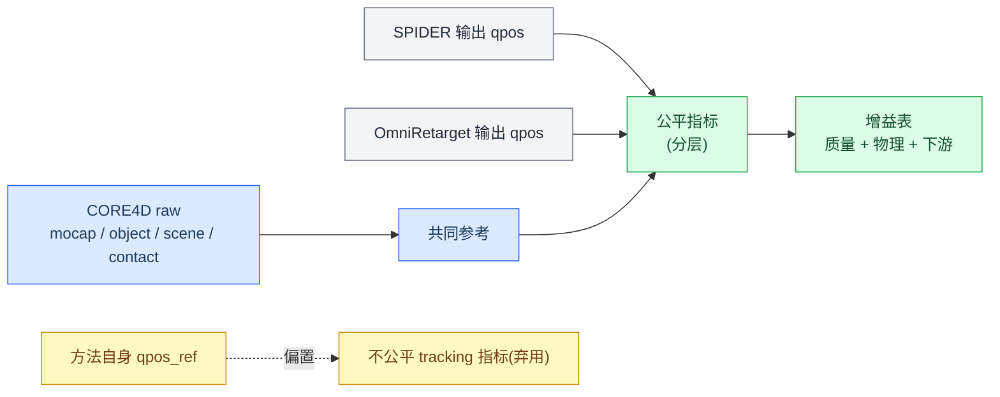
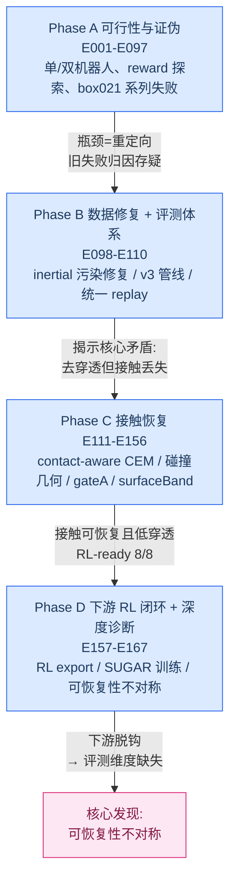

# 面向人机协作的动力学重定向：基于 SPIDER 在 CORE4D 上的研究进展（全面完整版）

> 撰写日期：2026-06-23
> 覆盖范围：E001–E167（重点 E109 之后的 OmniRetarget 对比与下游 RL 阶段）
> 数据集：CORE4D 人-物-人协作动捕
> 上游基线：OmniRetarget（运动学重定向）；本方法：SPIDER（动力学重定向）+ SUGAR/Holosoma 下游 RL
> 阅读对象：作者本人（含完整证据链、路径、纠错记录）

---

## 0. 一页纸结论（TL;DR）

我们做的事，本质是**在 OmniRetarget 运动学重定向结果之上做动力学优化**，因此全部价值落在与 OmniRetarget 的两维对比：

**维度一 · 重定向数值指标（SPIDER 在自己/统一物理口径下 vs OmniRetarget）— 明确胜出**
- clean8 统一评测（E156）：OmniRetarget 手-物物理穿透 `physPen3=0.576`，SPIDER（+gateA）降到 `0.202`（**绝对 -0.375**），同时 in-mask 物理接触 `0.034→0.153`（**+0.119**），0 fall、tracking 8/8。
- 接触回退被修复（E163 narrowSurfaceBand）：在保持低穿透的前提下，三 case raw in-mask 接触均值恢复到 `0.75`，`box023` 从 E161 的 `0.7538` 回升到 `0.8769`。

**维度二 · 下游 RL 指标 — 有两个独立消费端项目（SUGAR、Holosoma），结果 case-dependent，无干净全胜**
- 下游有**两个独立 RL 项目**，reward/termination/eval 口径不同，必须分开报告：**SUGAR**（refiner RL，staggered-phase eval，Holosoma-like success）与 **Holosoma**（WBT RL，R 系列 run）。
- SUGAR（E167A 6-case Holosoma-like success 均值）：`e163=0.133`、`e166A_B2=0.013`、`e167A=0.130`——上游 E167A 相对 E163 **没有整体提升下游，而是重分布**（box004 从 0 升到 0.16-0.31，但 box021_029_p2 从 0.73 跌到 0.05）。
- Holosoma（E167A 四 case，force-gate 主线）：box004_083_p1 `0.172`、box021_029_p2 `0.000`、box021_035_p1 force-gate `0.000` 但 handbox 正控 `0.250`。
- **跨项目关键发现**：同一条 `box021_035_p1` E167A 参考，SUGAR 能 rollout 出正确搬运（~0.27-0.33）而 Holosoma force-gate `0.000`——差异主因是**消费端 reward/termination 设计**（force-gate 过窄 + early termination 过严），**不是上游数据质量**。这进一步坐实"上游指标不决定下游"。
- 重要口径更正：早期 SUGAR "binary 64/64" 是 frame-0 确定性 eval（信息量极低，见 §6.2），已被 **staggered-phase 连续成功率**取代；本报告维度二一律用 staggered/连续口径。

**最有论文价值的发现 · 可恢复性不对称（recoverability asymmetry）**
> SPIDER 把"接触/穿透/tracking"刷到最好，但这恰恰是 **RL 最能自我修复**的维度；真正决定下游成败的三件事——接触能否在消费端物理被复现、参考轨迹离硬终止门的动态余量、任务语义（抬升高度）是否进入选择目标——**SPIDER 当前一个都没度量**。所以"上游赢"与"下游赢"脱钩，是结构性的，不是偶然。

---

## 1. 研究背景与动机

### 1.1 问题：人机物理协作（pHRC）需要物理合规的参考运动

具身智能的核心价值不仅在于独立完成任务，更在于在家庭服务、康复护理、工业制造中与人**并肩工作**。人机交互按接触强度递进为社会交互（非接触）、直接交互（短暂低频接触，如握手）、**间接交互即人机协作**（持续、高频、动态接触，如协作搬运/装配/递物）。协作是高度不确定的动态交互过程：机器人既要在各种地形保持稳定鲁棒控制，又要对人的动态变化做适应性响应。

低层运动控制的研究前提是**基于人类动捕数据进行动作重定向（Retarget）**。

### 1.2 上游瓶颈：OmniRetarget 是纯运动学方法

OmniRetarget 通过 Interaction Mesh 保持"相对空间拓扑"把人体动捕迁移到人形机器人全身控制，效果可观。但在接触丰富的人机协作场景下它有两类硬伤：

1. **物理合规性差**：没有显式维护空间与接触关系，导致接触关系失真、脚滑（foot skating）、穿模（penetration）等物理伪影。
2. **形态可达性极限**：G1（1.32m）比人矮、臂更短，按比例压缩拓扑后手只能触及箱子底边（z≈-0.5），0% 侧面夹持——这是运动学可达性极限，不是参数问题。

→ 需要**动力学重定向**：在物理仿真里把运动学参考变成动力学可行的机器人轨迹。

### 1.3 技术路线：SPIDER 动力学重定向

SPIDER（Scalable Physics-Informed Dexterous Retargeting，Meta/FAIR）用 GPU 加速 MuJoCo-Warp + 采样式 MPC（CEM）把 kinematic-only 的人类示范变成动力学可行的机器人轨迹。我们已复现其 HDMI/OMOMO workflow，本项目把它**迁移到 CORE4D 人-物-人协作**，并接 SUGAR/Holosoma 下游 RL 形成闭环。

### 1.4 核心命题（贯穿全篇）

> 在 OmniRetarget 运动学结果之上做 SPIDER 动力学优化，能否在 **(1) 重定向数值指标** 和 **(2) 下游 RL 指标** 两个维度上超越 OmniRetarget？

---

## 2. 公平评测协议（避免"自己评自己"）

早期评测的致命缺陷：很多 `paper_*` 指标把每条方法自己的 retarget reference 当作 `qpos_ref`，OmniRetarget adapter 里甚至 `qpos_ref=qpos`，导致它的 body/object tracking 误差天然≈0。这类指标只能诊断"是否贴近某条 reference"，**不能横向证明谁更好**。

确立的公平协议（详见 `report/spider_vs_omniretarget_eval/metric_research_and_protocol.md`）：

- **共同参考只能来自 CORE4D raw**：raw object pose、raw contact mask（3cm/5cm）、scene geometry、raw foot stance。
- 各方法只提供 `qpos/trajectory`，**不提供 GT**。
- **分层报告**：
  - Reference-level（物理/几何）：penetration、physics contact、foot skating、pelvis/fall、leg/body-object 干涉、object SE(3) error、joint limit。
  - Rollout-level（下游）：同一 simulator/controller/reward/超参/预算下的 RL 成功率、object progress/height、contact group。
- **物体/接触/姿态分桶**报告（box/bucket/desk × carry/push/pull），避免 aggregate 掩盖 failure mode。

---

## 3. 实验脉络总览

整个工作分为四个大阶段，逻辑是"先把数据/评测做对 → 再公平对比 → 再修接触 → 再打通并验证下游"。

各阶段关键里程碑：

| 阶段 | 实验 | 关键结论 |
|---|---|---|
| A 可行性/证伪 | E010 / E016-E031 / E035-E052 | G1 运动学可达性确认；双机器人 connect 方案被证伪；body tracking 与 contact 是 tradeoff |
| B 数据修复 | **E103** | **87/198 scene 存在 robot inertial 污染（mass 被错设为物体质量 29.632kg）**，推翻 E082-E094 所有 box021/box026 失败归因 |
| B 评测 | E109-E110 | 统一 replay 揭示核心矛盾：SPIDER 去穿透成功（29.4%→3.1%）但物理接触下降（54.4%→43.1%）|
| C 接触恢复 | E112 / E152-E153 / E156 / E161 / E163 | contact-aware 原理可行；hand safety gate（gateA）成为稳定默认；surfaceBand+releaseDecay 修 release 误接触；narrowSurfaceBand 修接触回退 |
| D 下游闭环 | E157 / E161 / E163 / E166 / E167 | RL export 8/8 ready，partner OmniRetarget 7/8 pass；SUGAR 训练出现 SPIDER 决定性胜例；揭示可恢复性不对称 |

---

## 4. 亮点一：重定向数值指标显著超越 OmniRetarget（维度一）

### 4.1 clean8 统一基准（E156，最干净的横向对比）

8 个 clean case，4 种方法在 **同一 `core4d-e154-physics-contact-v1` 口径**下评测（OmniRetarget 读各 case `trajectory_kinematic.npz` 转 `scene_act.xml` 后同口径评测）：

| method | tracked | fall | rel_false3↓ | inmaskC3↑ | physPen3↓ | geomPen2↓ | legPen↓ |
|---|:--:|:--:|---:|---:|---:|---:|---:|
| **OmniRetarget** | 8/8 | 0 | 0.000 | 0.034 | **0.576** | 0.586 | 0.021 |
| spider-rubberhand | 8/8 | 0 | 0.013 | 0.145 | 0.210 | 0.217 | 0.095 |
| **+gateA (SPIDER 默认)** | 8/8 | 0 | 0.013 | 0.153 | **0.202** | 0.211 | 0.094 |
| E155_decay | 8/8 | 0 | 0.128 | 0.314 | 0.313 | 0.374 | 0.130 |

**相对 OmniRetarget（+gateA）**：in-mask 物理接触 **+0.119**、手-物物理穿透 **−0.375**、手-物几何穿透 **−0.375**。

**解读**：
- OmniRetarget 的"接触"很大一部分是**压入式穿透接触**（physPen3=0.576 极高，inmaskC3=0.034 极低）——它看起来"贴着"，实则是穿模。
- SPIDER 的安全堆栈（gateA hand safety gate）**把穿透压低 1/3 量级**，同时把真实 in-mask 接触提高 4-5 倍，且 0 fall、tracking 不退化。
- `E155_decay`（扩大接触窗口/尾段衰减）虽接触最高但把穿透和 release 误接触重新拉高，不升级为默认——**说明"接触越多越好"是错的，必须接触/穿透/release 联合权衡**。

### 4.2 接触回退的修复（E161 → E162 → E163）

E161 用 `surfaceBandReleaseDecay` 把放手段 false contact 从 `0.188→0.030`（解决"放手放不掉"），但 E162 RL-safe 重评抓到副作用：`box023` raw in-mask 接触从 `0.9077` 退化到 `0.7538`。

E163 `narrowSurfaceBand`（surface band 收窄到 `[-1mm,+3mm]` 且用 `exp(-|sdf|/σ)` 对称评分）修复该回退：

| case | rubberhand raw | E161 releaseDecay raw | **E163 raw** | tracked | fall |
|---|---:|---:|---:|:--:|:--:|
| box023_person2 | 0.9077 | 0.7538 | **0.8769** | true | false |
| box021_029_p2 | 0.3818 | 0.7818 | **0.7455** | true | false |
| box004_083_p2 | 0.5323 | 0.6129 | **0.6290** | true | false |

方法级：E163 mean raw 接触 `0.7505`（> rubberhand `0.6073`、> releaseDecay `0.7162`），mean 物理穿透 `0.1234`（≈ releaseDecay、远低于 rubberhand `0.2828`），release 误接触 `0.0000`，**3/3 pass**。

**维度一小结**：在统一物理口径下，SPIDER 相对 OmniRetarget 在**穿透、release 干净度、真实 in-mask 接触**上全面占优，且不牺牲 tracking/fall。这是本工作最稳的结论。

---

## 5. 亮点二 & 关键边界：下游 RL（维度二，两个独立消费端项目）

下游有**两个独立的 RL 项目**，必须分开报告——它们 reward / termination / eval 口径不同，对同一条上游 handoff 会给出不同结论：

| 项目 | 类型 | eval 口径 | 路径 |
|---|---|---|---|
| **SUGAR** | refiner RL（在参考轨迹上做 residual refine）| staggered-phase rollout，64 attempts，Holosoma-like success | `Loco-Manipulation/SUGAR/outputs/core4d/` |
| **Holosoma** | WBT（whole-body tracking）RL，从头训 | single-policy eval，R 系列 run | `holosoma/workspace/v3/` |

### 5.1 SUGAR 下游：staggered-phase eval（E163 / E166 / E167A）

> 口径更正：早期 "binary 64/64" 是 frame-0 确定性 eval，信息量极低（§6.2）。下面一律用 **staggered-phase 连续成功率**（最新重跑）。

**E163 三 case（首个 SPIDER vs OmniRetarget 下游对照）**：`box021_029_p2` SPIDER staggered ≈ **0.67-0.73**（contact 0.717 全场最高、`trajectory_complete≈0.924`，OmniRetarget 同 case 0/64），是 E163 的核心正例——上游接触改善**真正转化成了下游可执行性**；`box004` SPIDER 到位但抬升高度失败（低位推/滑）；`box023` 双败。

**E167A 6-case（最新上游 vs E163 / E166 SUGAR 对比）**——Holosoma-like success：

| case | e163 | e166A_B2 | **e167A** |
|---|---:|---:|---:|
| box004_082_p1 | 0.000 | 0.000 | **0.156** |
| box004_083_p1 | 0.000 | 0.000 | **0.312** |
| box021_029_p2 | **0.734** | 0.078 | 0.047 |
| box021_035_p1 | 0.062 | 0.000 | **0.266** |
| box021_035_p2 | 0.000 | 0.000 | 0.000 |
| box023_person2 | 0.000 | 0.000 | 0.000 |
| **均值** | **0.133** | **0.013** | **0.130** |

**诚实解读（关键）**：
- 上游从 E163→E167A，SUGAR 下游**均值几乎不变（0.133→0.130），是重分布而非整体提升**：box004 从 0 升到 0.16-0.31（明显改善），但 box021_029_p2 从 **0.734 跌到 0.047**（明显回退）。
- `e166A_B2`（CEM foot + 后平滑）下游均值 **0.013 最差**——后平滑改善了上游平滑性/接触，却没转化成下游 completion/height/progress。这是"上游指标↑ ≠ 下游↑"的又一直接证据。
- box021_035_p2、box023_person2 三版本全 0：pathology（box023 自碰撞）和该 clean8 子例未被任何上游版本解决。

### 5.2 Holosoma 下游：R 系列 WBT RL（E167A 四 case）

Holosoma 用不同的 reward 家族（force-gate vs handbox/R135-style），结果（best success）：

| case | force-gate 主线（R170/R167）| handbox 正控（R171/R135）| 历史最好 |
|---|---:|---:|---:|
| box004_083_p1 | **0.172**（R170A）| — | — |
| box004_082_p1 | 低（弱上游指标）| — | R127/R128 ≈ 0.17 |
| box021_029_p2 | **0.000**（R170B，负对照）| — | 多版本全 0 |
| box021_035_p1 | **0.000**（R170C force-gate）| **0.250**（R171 handbox）| R135 0.516 / R155 0.484 |
| box023 | — | — | R166B 0.438（E163_narrow 数据，从 0 拉回）|

要点：Holosoma 侧 box021_035_p1 在 **force-gate 下 0.000、handbox 正控下 0.250**；版本选择报告明确把 `R166B/R167 的 1.0N force-only two-hand gate` 作为唯一主线，其余历史版本判为重复失败或 shortcut（lower/torso 支撑）不复跑。

### 5.3 跨项目关键发现：同一参考、不同消费端 → 差异来自下游设计

`box021_035_p1` 是最有说服力的对照：

| 消费端 | 该 case 表现 | 最长存活 frame | 仿真 xy 位移 |
|---|---:|---:|---:|
| SUGAR E167A | ≈ 0.27-0.33 | 跑到末尾（complete xy ≈ 1.068m）| 1.068m |
| Holosoma R170C（force-gate）| **0.000** | **69 / 213** | 0.046m |
| Holosoma R171（handbox 正控）| 0.250 | 213 / 213 | 1.132m |

参考本身有 1.530m xy 位移、0.328m z 抬升——**上游数据是能搬运的**。R170C 失败的根因（审查结论）是**消费端 reward/termination 设计**：
1. force-gate reward 过窄——只把 lift/carry 乘双手 filtered force gate，缺少 SUGAR/R171 的 object velocity tracking、obj2body、contact persistence 等连续搬运 shaping；
2. Holosoma early termination 更严（object/body pos 阈值 0.25 vs SUGAR 0.30），在参考真正进入搬运段（frame 83+）之前就反复 reset → 学到"接触箱子但不搬运"。

> **这条发现把维度二的结论钉死**：上游 handoff 相同，下游成败可以从 0.00 翻到 0.33，仅因消费端 reward/termination 不同。所以**用下游 binary success 给上游重定向方法排名，统计上不成立**——这正是 §6 可恢复性不对称与"悬崖型+近确定性"信号的实证支撑。

**维度二小结**：SUGAR 与 Holosoma 都出现 SPIDER handoff 的正向信号（SUGAR box021/box004、Holosoma box004/box021 handbox），但**两个项目都不是对 OmniRetarget 的干净全胜**；上游 E167A 提质在 SUGAR 上是重分布、在 Holosoma 上 case-dependent。下游成败显著受**消费端 RL 设计**支配，因此当前不能用下游成功率单独裁定上游方法优劣。

---

## 6. 亮点三：方法论与诊断深度（最具论文价值）

### 6.1 可恢复性不对称（recoverability asymmetry）—— 解释"上游赢≠下游赢"

把六组结果按"RL 能否自我修复该维度误差"重排，主线浮现：

| 上游误差维度 | RL 能否自我修复 | 证据 | 对下游预测力 |
|---|:--:|---|:--:|
| 接触标签/接触量 | ✅ 能 | box004/spider 参考接触仅 0.036，RL rollout 自学到 **0.54** 并推到目标 | **弱**（SPIDER 一直在刷）|
| 动态可行性 vs 硬门余量 | ❌ 不能 | box021/omni 接触好（IoU 0.63），仍因 obj_pos 越门 **1.7cm** 而 0/64 | **强**（SPIDER 没测）|
| 本体可执行性（末端/身体）| ❌ 不能 | box023/spider 接触不差，被 ee_body 越门 **3cm** 击穿 | **强**（SPIDER 没测）|
| 任务语义（抬升高度）| ❌ 不能（不在 reward 梯度）| box004/spider xy 进度 0.98、final err 0.041，但 z_max 0.19 < 0.34 | **强**（SPIDER 没测）|

> **结论**：SPIDER 从 E161→E163 一路优化、并用 hard gate 死卡的是 RL **最能原谅**的维度（接触清洁、穿透）；真正翻转下游成败的三个维度（**离硬门动态余量、本体可执行性、抬升语义**）一个都没进评测。这就是上下游脱钩的结构性原因。

### 6.2 下游 binary success 是"悬崖型 + 近确定性"信号，不适合做上游 ranker

- **悬崖型**：所有 0/64 都是**贴着硬门擦边失败**——box021/omni 物体只差 **1.7cm**、box023/spider ee_body 只差 **3cm**。参考轨迹动态上"激进 5%"就能让结果从 64/64 翻到 0/64。用悬崖信号给上游方法排名**统计上极脆弱**。
- **近确定性（N≈1）**：64 个 env 行为几乎完全一致（std≈0.003，duration 完全相同）。根因是 SUGAR rollout eval 设计（单条 motion、全部从 frame 0 起、确定性策略、eval 关掉扰动），真正有效样本量 = **case 数（3）**。
- **可改**：Holosoma WBT 同范式但 eval 跑法不同（2000 步、撞门 reset 续跑、循环重放）→ 因 startup DR 去同步 → 成功率呈**连续谱**。证明同范式能产出有判别力信号。
- **已落地 staggered-phase eval**（64 env 铺到不同参考起始相位）实测三 spider case：`box021 0.67 > box004 0.48 > box023 0.00`——二值指标把 box021/box004 都判成"64/64 完成"并列，staggered 一拉开就分出 0.67 vs 0.48。**二值指标分辨率为零。**

### 6.3 接触不是一个问题，是三种相反的病（纠正"单一 net-filter gap"）

复算逐帧力后，三个 spider case 是三种**互相矛盾**、需要**相反修法**的病：

| case | 病症 | 逐帧证据 | 修法 |
|---|---|---|---|
| box021/spider ✓ | 健康 | filtered recall 0.615；幻象力 0.000 | 不用修 |
| box004/spider | 源接触**未被复现**（embodiment gap）| Isaac filtered recall 仅 **0.058**，接触帧 mean 力 1.08N | 修 retarget 手部贴合 / proxy 容错 |
| box023/spider | 接触力**虚假**（自碰撞）| frame0 net 1679→2357N，手↔同侧髋仅 0.069m | 改 proxy 半径/collision filter（**非 CEM**）|

→ box004 是 Isaac 里接触**太少**，box023 是接触**太多**（但来自自碰撞）。**一个标量 gap 把两种反向病混成一种，必然误导修复方向**——这是对旧报告的关键纠错（旧报告说 box023 是"reward 漏看接触"，复算后事实相反：传感器是对的，多看的是自碰撞）。

**溯源（E165-C 实测）**：box023 手贴髋自碰撞 **spider 0.069m vs omni 0.073m**，两者几乎一致 → **继承自源人体姿态（站立手垂胯边），不是 SPIDER CEM 引入**。修复落在 g1 rubber-hand proxy 几何 / 源姿态处理，**确认不动 CEM**。

### 6.4 on-rails Isaac 探针：训练-free 的下游预测闸（E165-E1 实测）

唯一**真正预测下游成败**的接触信号是 policy-free 的 Isaac 运动学回放探针（物体 on-rails，只量接触几何）：

| case | filtered recall | phantom force rate | max init net force | 病型 | 下游 staggered |
|---|---:|---:|---:|---|---:|
| box021 | 0.615 | 0.00 | 0 N | 干净迁移 | 0.67 |
| box004 | 0.058 | 0.197 | 0 N | 源接触未复现 | 0.48 |
| box023 | 0.667 | 0.614 | **2459 N** | 自碰撞穿透 | 0.00 |

**关键纠正**：**单标量不预测下游**——box023 recall 高达 0.667 却 0/64（败在自碰撞）。必须 **三标量联合分病**（recall / phantom / init-net），不能合成单一 gap。这是个便宜（无需训练）、用消费端物理、且 RL 之前就能把三 case 分开的 preflight 闸。

### 6.5 其他方法论贡献

- **数据污染发现（E103）**：建立 scene inertial+geometry+collision audit 框架 + "validity reset"机制（不删旧数据，标记结论不可信），证明"看似算法失败实为数据污染"的可能性。
- **统一 replay 评测（E109）**：消除"自己评自己"偏置，确认旧 `contact_frac_either` 实为 `max(L,R)` 而非 union。
- **CEM 物体是 GT 的认知（E165 代码核实 `config.py:153-162`）**：CEM 里 `object_pd_override`/`object_kinematic_override`/软 weld 三选一恒成立，物体始终 follow GT → **CEM selection 永远看不到"抬不起来"**，在 CEM 里加 z_max 约束是恒满分空操作。→ 抬升语义必须进 **RL reward**，不能进 CEM selection。

---

## 7. 亮点四：工程化数据管线 + 全链路 RL 桥接

### 7.1 data_construction_v3 六阶段管线

`S0 环境检查 → S1 Inventory+Raw Contact → S2 Template Audit/Build → S3 Stage2b Retarget → S4 Target Gate+Visual QC → S5 Handoff Export → S6 Downstream Evidence`

设计原则：双轴分叉（retarget_variant × target_variant）、机器 gate 为硬门 + visual QC 为 release checklist、**下游失败不污染上游数据判定**、legacy 隔离不删不改。release audit 65/65 pass。

### 7.2 RL handoff 全链路打通

- E161 releaseDecay clean8：`RL_EXPORT_READY=8/8`，partner OmniRetarget `7/8 pass`（唯一失败 `box004_082_p2` 是 Holosoma `robot_retarget.py` CVXPY infeasible，历史一致，已显式记录而非掩盖）。
- E163 narrowSurfaceBand 三 case：`RL_EXPORT_READY=3/3`，partner OmniRetarget `3/3 pass`。
- 方法版本字段规范化：`source_exp_id` + `spider_method_id`（如 `gateA_surfaceBandA2_postureRerankA_narrowSurfaceBandReleaseDecay`）+ `target_variant_id`，CEM/reward 方法不写入 target route。
- E167 同时把 SPIDER S6（21 rows RL_EXPORT_READY）、Holosoma export、SUGAR 转换（21 folders）全链路跑通。

### 7.3 可复现性双保险（已制度化）

- 活跃 case scene XML 强制入 git（`git add -f`）。
- 每次物理实验前 snapshot `scene_snapshot/` + `manifest.txt`（git HEAD + sha256），train 脚本第一步调用 snapshot。

---

## 8. 关键纠错记录（诚实记账，避免重蹈覆辙）

| 被纠正的旧结论 | 纠正后 | 触发实验 |
|---|---|---|
| E082-E094 box021/box026 失败 = SPIDER 算法失败 | = scene inertial 数据污染 | E103 |
| box023 net-filter gap = reward 漏看真接触 | = 手贴髋**自碰撞**虚假力，传感器是对的 | E163 深度分析 / E165-C |
| box023 自碰撞是 SPIDER CEM 引入 | = 继承自源人体姿态（omni 同样存在）| E165-C |
| box004 标签虚高判据 = 手-箱距离 > proxy 半径 | 距离判据**被证伪**（box004/box021 都 ~5cm）；真判据是 Isaac filtered recall（0.058 vs 0.615）| E165-A |
| 单一 net-filter gap 可描述接触异常 | 必须拆 recall（漏看）/ phantom（多看）两正交量 | E163 深度分析 |
| 下游 64/64 = 64 个独立成功 | = N≈1 近确定性，有效样本 = case 数 | E163 深度分析 |
| 抬升约束可加进 CEM selection | CEM 里物体是 GT，恒满分空操作；必须进 RL reward | E165 代码核实 |

---

## 9. 不足、未解决问题与后续规划

### 9.1 当前不足与未解决问题

1. **下游不是对 OmniRetarget 的干净全胜（两个项目均如此）**：SUGAR 上 E167A 相对 E163 是重分布（均值 0.133→0.130）而非整体提升；Holosoma 上 box021_035_p1 force-gate 0.000、handbox 才 0.250。无法支撑"SPIDER 全面优于 OmniRetarget 的下游"的论文级主张。
2. **下游成败显著受消费端 RL 设计支配**：同一条 box021_035_p1 上游 handoff，SUGAR ≈0.33、Holosoma force-gate 0.00、Holosoma handbox 0.25。reward/termination 选择能把结果从 0 翻到 0.33，**这使下游 binary success 不适合做上游方法 ranker**（叠加悬崖型+近确定性，n≈case 数）。
3. **两套下游 eval 口径不统一**：SUGAR 用 staggered-phase rollout + Holosoma-like success；Holosoma 用 single-policy eval + 更严 termination。跨项目数字不能直接相加，OmniRetarget 侧也未在两个项目同口径补齐。
4. **SPIDER 评测缺三类 downstream-critical 信号**：接触能否被 SUGAR/Isaac filtered reward 看见、离硬门的动态余量、抬升/高度语义——这三者决定下游却未进 SPIDER eval 表。
5. **两个工程 bug 仍在**：box023 初始帧 ~1400-2459N 自碰撞穿透；box004 接触标签与消费端 rubber-hand proxy 几何不一致（5-10× recall 落差）。
6. **CEM 框架结构性限制（历史结论仍部分成立）**：在纯 CEM 框架内"接触↑ ↔ 穿透↑ ↔ 稳定性↓"三元 tradeoff 难解；gateA/surfaceBand 是缓解而非根除。
7. **case 覆盖与统计功效不足**：clean8 + remaining4 + 三 case probe 规模有限，OmniRetarget partner 偶发 CVXPY infeasible，泛化性证据不够强。

### 9.2 后续规划（按杠杆排序）

**杠杆 1（最高）· 把接触放到消费端物理打分**
- 把 policy-free 的 Isaac on-rails 运动学探针做成 handoff 前**必跑闸**，报三个正交标量（`filtered_contact_recall` / `phantom_force_rate` / `max_init_net_force`），**不合成单一 gap**。
- 范围界定：探针只量接触几何（物体 on-rails），不释放物体、不管承重；"抓握能否托住/抬起"交给杠杆 3 在 RL 侧。

**杠杆 2 · 选择目标加入"离硬门动态余量"**
- CEM rerank 目标从"均值误差小"改成"**最坏帧离门余量大**"：对 obj_pos/obj_ori/ee_body/anchor 各算参考轨迹自身 peak deviation，惩罚接近下游阈值的峰值。离线参考诊断即可近似，无需 Isaac。直接预防 box021/box023 擦边失败。

**杠杆 3 · 抬升语义进 RL reward（不进 CEM selection）**
- 在 RL 加 z-tracking / lift bonus；CEM 侧唯一动作是**不要只用 final target error 选 winner**（避免选出"低位滑到位"的解）。

**杠杆 4 · 修两个工程 bug**
- box023：缩小 g1 rubber-hand proxy 半径 / 对手↔髋加 collision filter / 预抓取窗口不计接触；**不动 CEM**。
- box004：统一接触定义，或至少在 eval 强制报告 `filtered_contact_recall`。

**小而精的可证伪实验（别扩量）**
| 实验 | 假设 | 成功判据 | 预测 |
|---|---|---|---|
| A box004 标签审计 | 标签虚高源于手够不到箱 | 接触帧手-面距离 > proxy 半径 | 大概率坐实 |
| B height reward 进 RL | narrowSurfaceBand 用低位换接触清洁 | height 0/64 → >0 且 contact/pen 不退化 | 验证 §6.1 因果 |
| C box023 初始穿透修复 | 失败含初始帧穿透 | 首帧 net 力 → ~0；ee_body 越门缓解 | net 力可消，RL 翻正需叠加杠杆 2 |
| D 动态余量 rerank | 擦边失败可由 peak-margin 预防 | 擦边 case 拉开离门距离，RL 翻正 | box021/omni 仅差 1.7cm 最可能先翻正 |

**杠杆 5 · 统一两个下游项目的对照口径，剥离消费端设计混淆**
- 关键认知：box021_035_p1 在 SUGAR≈0.33 / Holosoma force-gate 0.00 / Holosoma handbox 0.25，证明**下游成败被消费端 reward/termination 支配**。要公平比 SPIDER vs OmniRetarget，必须**固定消费端**（同一项目、同一 reward family、同一 termination、同一 eval），只换 upstream handoff。
- Holosoma 侧待办：先做 R172 eval-only termination 诊断（放宽 object pos 阈值 0.25→0.3/0.4，看 box021_035_p1 是否仅被 early termination 卡死）；R174 给 force-gate 补最小 object xy velocity shaping；R173 拆 handbox vs rubber-hand 单变量。
- SUGAR 侧待办：把 staggered-phase eval 推广到 OmniRetarget partner 同口径，补齐 6-case × 两来源连续成功率。

**评测制度化**
- downstream-readiness 分四层报告：L1 Geometry（penetration/release）、L2 Contact Semantics（raw/clean/mask contact）、L3 Isaac/SUGAR Compatibility（filtered any/both contact、IoU、net-filter gap）、L4 Dynamic Feasibility（termination-risk、velocity/accel/height）。
- 用能产出**连续/分布式成功率**的 eval（staggered-phase 或 Holosoma-style desync）复测后再对下游优劣下结论；对 Box021 类不要用 `carry_progress_ratio` 单独判断（短窗口会放大 ratio，实测 R170C ratio 0.454 但绝对 xy 仅 0.043m）。
- S6 evidence 字段强制区分 `completion / sugar_target_success / progress_success / height_success / holosoma_like_success`，禁止把任一项单独写成"RL 成功"。

---

## 10. 附录

### 10.1 关键结果路径

| 内容 | 路径 |
|---|---|
| clean8 gate/decay benchmark | `results/E156/clean8_gate_decay/eval/full/E156_clean8_gate_decay_benchmark.xlsx` |
| surfaceBand release ablation | `results/E161/surface_release_ablation/eval/full/E161_surface_release_ablation_clean8.xlsx` |
| narrowSurfaceBand 三 case | `results/E163/narrow_surface_band/eval/full/E163_narrow_surface_band_three_case_eval.xlsx` |
| E163 RL export | `results/E163/narrow_surface_band_rl_export/s6_downstream/rl_export/rl_export_input.tsv` |
| E163 下游 RL 分析 | `docs/E163_RL_DOWNSTREAM_ANALYSIS_AND_SPIDER_IMPLICATIONS_CN.md` |
| E163 RL 深度洞察 | `docs/E163_RL_DEEP_INSIGHTS_CN.md` |
| E165 离线审计 | `results/E165/{A_box004_contact_audit, C_box023_penetration, E1_onrails_probe}/` |
| E166 foot/smooth + SUGAR | `results/E166/foot_smooth_retarget/` |
| E167 vs E166 vs E163 对比 | `results/E167/holosoma_zonly/eval/comparison/E167_vs_E166_vs_E163_cem_offline_eval.xlsx` |
| 公平评测协议 | `report/spider_vs_omniretarget_eval/metric_research_and_protocol.md` |
| 历史 E098-E152 报告 | `report/E098-E152/{detailed,concise}_report.md` |
| **下游 SUGAR** · E167A 6-case 对比 | `SUGAR-private/docs/log/CORE4D_E167A_6CASE_HOLOSOMA_LIKE_COMPARISON_CN.md`；输出 `SUGAR/outputs/core4d/e167_zonly_refiner_rl/comparison/` |
| **下游 SUGAR** · E163 refiner RL | `SUGAR/outputs/core4d/e163_refiner_rl/`（含 staggered + failed_windows） |
| **下游 Holosoma** · v3 工作区 | `holosoma/workspace/v3/`（`EXPERIMENT_TRACKER.md` R 系列） |
| **下游 Holosoma** · E167A 版本选择 | `holosoma/workspace/v3/report/20260621_e167a_four_case_rl_version_selection.md` |
| **下游 Holosoma** · R170/R171 失败审查 | `holosoma/workspace/v3/report/20260621_r170_r171_vs_sugar_e167a_box021_failure_audit.md` |

### 10.2 指标口径速查

- `physPen3/5`：手-物 3mm/5mm 物理穿透时长占比（↓）
- `geomPen2`：手-物 2cm 几何穿透（↓）
- `inmaskC3`：源接触窗口内 3mm 物理接触占比（↑）
- `rel_false3`：放手段 3mm 误接触占比（↓）
- `raw in-mask contact`：源接触 mask 内 raw 物理接触（↑），E162/E163 RL-safe hard gate
- `H-like success`：Holosoma-like 严格成功 = progress + height
- staggered-phase 完成率：64 env 铺不同参考相位的连续成功率（替代二值 64/64）

---

*覆盖实验：E001–E167 · 核心阶段 E109–E167 · 撰写日期 2026-06-23*
