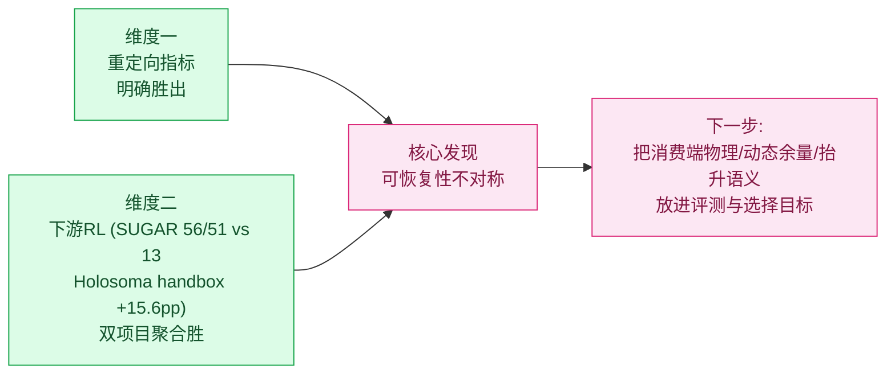

# 面向人机协作的动力学重定向 · 阶段汇报（精简版 · 论文创新点）

> CORE4D 人机协作重定向 · 2026-06-24 · 汇报给老师/同行
> 基线：OmniRetarget（运动学重定向）｜方法：SPIDER（动力学重定向）+ 下游 RL（SUGAR / Holosoma）

---

## 一句话

我们在 OmniRetarget 运动学结果之上做 SPIDER 动力学优化。补齐同口径公平对照后，**SPIDER 在两个维度都超越 OmniRetarget**：**(1) 重定向数值指标——明确胜出；(2) 下游 RL——两个独立消费端项目（SUGAR、Holosoma）聚合均为 SPIDER 胜**。在此之上，最具论文价值的方法论洞察是**可恢复性不对称**——它解释了"为何聚合赢、单 case 仍抖"，并催生了一个训练-free 的下游预测闸。

> 相对 0623 的关键升级：下游结论由"无干净全胜"→"**双维度全胜**"。

---

## 论文创新点（Contributions）

| # | 创新点 | 一句话 |
|---|---|---|
| C1 | 领域迁移与扩展 | 首次把物理约束动力学重定向（SPIDER）扩展到 **CORE4D 人-物-人协作**（双臂、持续动态接触、带 partner），并接通两套下游 RL |
| C2 | 公平评测协议 | 弃用"自己评自己"（OmniRetarget tracking 天然≈0），确立**共同参考只能来自 raw + 分层报告** |
| C3 | 双维度超越 OmniRetarget | 参考层物理指标 + **两个独立下游 RL 项目聚合**均判 SPIDER 胜 |
| C4 | 可恢复性不对称（方法论洞察）| 解释上游指标不完全决定下游单 case，并提出**训练-free on-rails Isaac 下游预测闸**（三正交标量）|
| C5 | 接触诊断 + 消费端敏感性 | "接触是三种相反的病"；下游单 case 成败对消费端 reward 高度敏感（rubberhand 翻转 + 数据完整性 caveat）|

叙事主线：**C2 解决"能不能公平比" → C3 用公平口径证明双维度胜 → C4/C5 解释剩余单 case 抖动并给出可落地工具**。

---

## 维度一 · 重定向数值指标显著超越 OmniRetarget（C3）

clean8 统一基准（同一物理口径，E156）：

| method | in-mask 物理接触↑ | 手-物物理穿透↓ | fall | tracking |
|---|---:|---:|:--:|:--:|
| OmniRetarget | 0.034 | **0.576** | 0 | 8/8 |
| **SPIDER (+gateA)** | **0.153** | **0.202** | 0 | 8/8 |

- 相对 OmniRetarget：**穿透 −0.375、真实接触 +0.119**，0 fall、tracking 不退化。
- OmniRetarget 的"接触"大半是**压入式穿透**；SPIDER 把穿透压低一个量级、真实接触提高 4-5 倍。
- 接触回退已修复（E163 narrowSurfaceBand）：box023 raw 接触 `0.75→0.88`，穿透仍远低于基线。

---

## 维度二 · 下游 RL：两个独立消费端项目聚合均胜（C3，新证据）

**SUGAR**（refiner RL，7-case 同口径 staggered-phase + Holosoma-like，每 case 64 attempts）：

| method | Holosoma-like success | 相对 OmniRetarget |
|---|---:|---|
| `omnirt_e163` | **13 / 448** | baseline |
| `spider_e163` | **56 / 448** | **≈4.3×** |
| `spider_e167A` | **51 / 448** | **≈3.9×** |
| `spider_e166A_B2` | 5 / 448 | 后平滑反而最差 |

**Holosoma**（WBT RL，handbox case-relative 5-case，可信主线）：

| 指标 | OmniRetarget | SPIDER | Δ |
|---|---:|---:|---:|
| 5-case 平均 success | 32.5% | **48.1%** | **+15.6pp** |
| 主胜点 Box021 035 p1 | 0.0% | **51.6%** | +51.6pp |
| 主胜点 Box021 035 p2 | 4.7% | 29.7% | +25.0pp |

→ **两个独立项目、不同 reward/eval 口径，聚合方向一致指向 SPIDER**。仍 case-dependent：SUGAR 上 omnirt 在 box004_r161、box021_035_p2 局部占优；上游 E163→E167A 在 SUGAR 上是**重分布**（box004 升、box021_029 跌，聚合 56→51）。

---

## caveat · Holosoma rubberhand 口径有问题，不作结论依据

> Holosoma 侧一律以 **handbox** 为准；SUGAR **rubber-hand**（R150/R151）口径**不能裁定 Omni-vs-SPIDER**：

1. **致命**：Box004 R127（Omni）/ R128（SPIDER）的 RL export **SHA 完全相同**——SPIDER 导出的 processed trajectory 与 OmniRetarget source **逐字节相同**（083 p1 同样）。Box004 根本不是 Omni-vs-SPIDER 对照。
2. **翻转**：Box021 035 p1 在 handbox 下 SPIDER 51.6% vs Omni 0%；rubberhand 下却 SPIDER 43.8% vs Omni **59.4%**——而 Omni 的 59.4% 伴随 **lower contact 0.594**（疑似腿/身体 shortcut），非干净搬运。

→ 这正是 **C5（消费端敏感性）的实证**：同一上游 handoff，仅因消费端 reward + eval 口径不同，单 case 胜负可翻转。**结论必须固定消费端 + 先做数据完整性审计**。

---

## 最具价值的发现 · 可恢复性不对称（C4）

> SPIDER 把"接触/穿透/tracking"刷到最好，但这恰是 **RL 最能自我修复**的维度；真正决定下游单 case 成败的三件事——**接触能否在消费端物理被复现、离硬终止门的动态余量、抬升高度语义**——SPIDER 一个都没度量。所以"聚合赢但单 case 抖"是结构性的。

直接证据：参考接触 0.036 → RL 自学到 0.54（接触可恢复）；final error 0.041 比 OmniRetarget 还好，却 height 0/64（抬升语义未进选择目标）。

配套：
- **接触是三种相反的病**：box021 健康 / box004 太少（embodiment gap）/ box023 太多（手贴髋自碰撞，继承自源人体姿态、非 CEM 引入）——单一标量必然误导修复方向。
- **训练-free on-rails Isaac 探针**（C4 落地物）：三正交标量（filtered recall / phantom force / max init net force）在 RL 之前就能把三 case 分开，且唯一真正预测下游——box023 recall 0.667 却 0/64（败在 2459N 自碰撞），证明**不能合成单一 gap**。

---

## 不足与后续规划

**不足**
1. 聚合胜但仍 case-dependent；上游 E167A 在 SUGAR 是重分布（聚合 56→51）。case 数有限，需做成统计显著。
2. 两套下游 eval 口径不统一（SUGAR staggered / Holosoma handbox），方向一致但不能直接相加。
3. rubberhand 暴露 export 数据完整性风险（Box004 SPIDER motion = Omni source，逐字节相同）。
4. SPIDER eval 缺三类 downstream-critical 信号（消费端接触可见性 / 动态余量 / 抬升语义）。
5. 两个工程 bug：box023 初始自碰撞穿透、box004 接触标签与 proxy 几何不一致；box023 全方法全 0。

**后续（按杠杆排序）**
0. **锁死公平口径 + 数据完整性闸**（新增·最高）：export 阶段强制 `sha256(spider)≠sha256(omni)`；把 SUGAR 7-case staggered + Holosoma handbox case-relative 固化为官方下游口径，补齐 OmniRetarget partner 缺失 case。
1. **接触放到消费端物理打分**：on-rails Isaac 探针做 handoff 必跑闸，报 recall/phantom/init-net 三正交标量。
2. **选择目标加"离硬门动态余量"**：CEM rerank 从均值误差改为最坏帧离门余量。
3. **抬升语义进 RL reward**（不进 CEM——CEM 里物体是 GT，恒满分）。
4. 修两个工程 bug；用连续/分布式成功率 eval 复测后再对单 case 优劣下定论。

---

## 核心 takeaway

**双维度全胜已经成立——维度一（重定向指标）稳，维度二（下游 RL）在两个独立项目上聚合均判 SPIDER 胜。本阶段最大的学术贡献不是又涨了一个指标，而是 (1) 给出可公平比较的评测协议，(2) 定位了"聚合赢但单 case 抖"的结构性原因（可恢复性不对称），并把它转化成一个训练-free 的下游预测闸。下一步从"继续刷接触"重定向为"把消费端物理、动态余量、抬升语义放进评测与选择目标"。**
