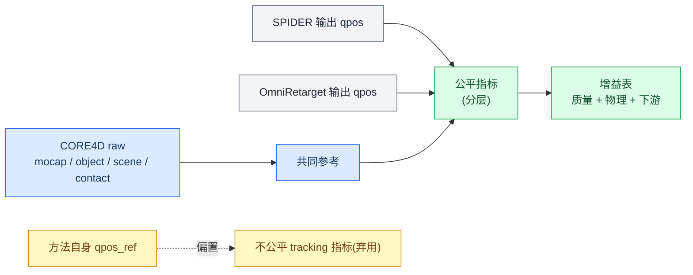
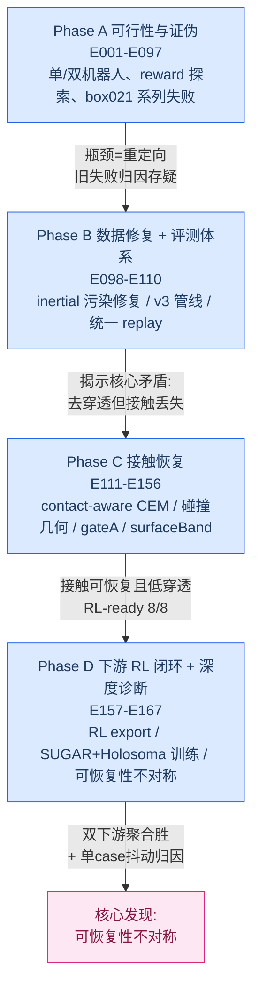

# 面向人机协作的动力学重定向：基于 SPIDER 在 CORE4D 上的研究进展（全面完整版 · 论文创新点叙事）

> 撰写日期：2026-06-24（在 0623 版基础上并入两项新证据 + 重组为论文创新点叙事）
> 覆盖范围：E001–E167（重点 E109 之后的 OmniRetarget 对比与下游 RL 阶段）
> 数据集：CORE4D 人-物-人协作动捕
> 上游基线：OmniRetarget（运动学重定向）；本方法：SPIDER（动力学重定向）+ SUGAR / Holosoma 双下游 RL
> 阅读对象：作者本人（含完整证据链、路径、纠错记录）
> 相对 0623 的关键更新：**下游结论由"无干净全胜"升级为"两个独立消费端项目聚合均为 SPIDER 胜"**

---

## 0. 一页纸结论（TL;DR）

我们做的事，本质是**在 OmniRetarget 运动学重定向结果之上做动力学优化**，因此全部价值落在与 OmniRetarget 的两维对比。**0624 版的核心变化：下游 RL 维度补齐了同口径公平对照后，SPIDER 在两个独立消费端项目上都取得了聚合层面的胜出**——这把本工作从"重定向指标赢、下游存疑"推进到了"**双维度全胜**"。

**维度一 · 重定向数值指标（统一物理口径 vs OmniRetarget）— 明确胜出**
- clean8 统一评测（E156）：OmniRetarget 手-物物理穿透 `physPen3=0.576`，SPIDER（+gateA）降到 `0.202`（**绝对 −0.375**），同时 in-mask 物理接触 `0.034→0.153`（**+0.119**），0 fall、tracking 8/8。
- 接触回退已修复（E163 narrowSurfaceBand）：三 case raw in-mask 接触均值回到 `0.7505`，`box023` 从 E161 的 `0.7538` 回升到 `0.8769`，穿透仍远低于基线。

**维度二 · 下游 RL 指标 — 两个独立消费端项目聚合均为 SPIDER 胜（新）**
- **SUGAR**（refiner RL，7-case 同口径 staggered-phase + Holosoma-like success）：`spider_e163=56/448`、`spider_e167A=51/448`，均**约 4× 于 `omnirt_e163=13/448`**。这是首次在统一 7-case 公平口径下，SPIDER 聚合明确超越 OmniRetarget。
- **Holosoma**（WBT RL，handbox case-relative 5-case）：SPIDER **48.1%** vs OmniRetarget **32.5%**（**+15.6pp**），主胜点 Box021 035 p1（0→51.6%）/ p2（4.7%→29.7%）。
- 仍 case-dependent：SUGAR 上 omnirt 在 box004_r161、box021_035_p2 两个 case 局部占优；上游 E163→E167A 是**重分布**（box004 升、box021_029 跌），非整体提升。但**聚合方向已经稳定指向 SPIDER**。

**维度二的边界（已定位、可控）· 消费端 reward 设计支配单 case 成败**
- Holosoma **rubberhand**（SUGAR rubber-hand reward）口径**有数据完整性问题**，不作为结论依据（§5.3）：Box004 R127/R128 的 RL export SHA 完全相同（SPIDER processed trajectory == OmniRetarget source），根本不是 Omni-vs-SPIDER 对照；且 rubberhand 允许 lower-leg/body shortcut，使 Box021 035 p1 的胜负相对 handbox **翻转**。→ Holosoma 一律以 **handbox** 为准，rubberhand 仅作 caveat。

**最有论文价值的方法论洞察 · 可恢复性不对称（recoverability asymmetry）**
> SPIDER 把"接触/穿透/tracking"刷到最好，但这恰恰是 **RL 最能自我修复**的维度；真正决定下游单 case 成败的三件事——接触能否在消费端物理被复现、参考轨迹离硬终止门的动态余量、任务语义（抬升高度）是否进入选择目标——**SPIDER 当前一个都没度量**。这解释了"为何聚合赢但单 case 仍抖动"，也直接催生了训练-free 的 on-rails Isaac 下游预测闸（§6.4）。

---

## 1. 论文创新点（Contributions）

本工作不是"又涨了一个指标"，而是围绕**把人类动捕变成人机协作机器人可执行运动**这条主线，给出五个可投稿的贡献：

| # | 创新点 | 一句话 | 证据章节 |
|---|---|---|---|
| C1 | **领域迁移与扩展** | 首次把物理约束的动力学重定向（SPIDER）从单体灵巧/OMOMO 扩展到 **CORE4D 人-物-人协作**（双臂、持续高频动态接触、带 partner），并接通两套下游 RL | §3、§7 |
| C2 | **公平重定向评测协议** | 弃用"自己评自己"（OmniRetarget tracking 天然≈0），确立**共同参考只能来自 raw + 分层报告**的可复用协议 | §2 |
| C3 | **双维度超越 OmniRetarget** | (1) 参考层物理指标全面占优；(2) **两个独立消费端 RL 项目（SUGAR + Holosoma）聚合均为 SPIDER 胜** | §4、§5 |
| C4 | **可恢复性不对称（方法论洞察）** | 解释"上游指标不完全决定下游单 case"，并据此提出**训练-free on-rails Isaac 下游预测闸**（三正交标量，不合成单一 gap） | §6.1、§6.4 |
| C5 | **接触诊断 + 消费端敏感性** | "接触不是一个问题、是三种相反的病"；并实证**下游成败对消费端 reward/termination 高度敏感**（rubberhand 翻转 + 数据完整性 caveat） | §6.3、§5.3 |

> 叙事主线（贯穿全篇）：**C2 把"能不能公平比"解决 → C3 用公平口径证明 SPIDER 双维度胜 → C4/C5 解释剩余的单 case 抖动并给出下一步可落地的评测/选择工具**。C1 是承载这一切的应用基座。

---

## 2. 创新点 C2：公平评测协议（避免"自己评自己"）

早期评测的致命缺陷：很多 `paper_*` 指标把每条方法自己的 retarget reference 当作 `qpos_ref`，OmniRetarget adapter 里甚至 `qpos_ref=qpos`，导致它的 body/object tracking 误差天然≈0。这类指标只能诊断"是否贴近某条 reference"，**不能横向证明谁更好**。

确立的公平协议（详见 `report/spider_vs_omniretarget_eval/metric_research_and_protocol.md`）：

- **共同参考只能来自 CORE4D raw**：raw object pose、raw contact mask（3cm/5cm）、scene geometry、raw foot stance。
- 各方法只提供 `qpos/trajectory`，**不提供 GT**。
- **分层报告**：
  - Reference-level（物理/几何）：penetration、physics contact、foot skating、pelvis/fall、leg/body-object 干涉、object SE(3) error、joint limit。
  - Rollout-level（下游）：同一 simulator/controller/reward/超参/预算下的 RL 成功率、object progress/height、contact group。
- **物体/接触/姿态分桶**报告（box/bucket/desk × carry/push/pull），避免 aggregate 掩盖 failure mode。

> **为什么这是创新点而非常规操作**：在重定向社区里，"用自己的 reference 评自己"是普遍隐患（OmniRetarget adapter 的 `qpos_ref=qpos` 是极端例子）。把评测基准强制锚定到 raw、并分层到下游，是后续所有横向结论能成立的前提。

---

## 3. 创新点 C1：实验脉络与领域扩展

整个工作分为四个大阶段，逻辑是"先把数据/评测做对 → 再公平对比 → 再修接触 → 再打通并验证下游"。

各阶段关键里程碑：

| 阶段 | 实验 | 关键结论 |
|---|---|---|
| A 可行性/证伪 | E010 / E016-E031 / E035-E052 | G1 运动学可达性确认；双机器人 connect 方案被证伪；body tracking 与 contact 是 tradeoff |
| B 数据修复 | **E103** | **87/198 scene 存在 robot inertial 污染（mass 被错设为物体质量 29.632kg）**，推翻 E082-E094 所有 box021/box026 失败归因 |
| B 评测 | E109-E110 | 统一 replay 揭示核心矛盾：SPIDER 去穿透成功（29.4%→3.1%）但物理接触下降（54.4%→43.1%）|
| C 接触恢复 | E112 / E152-E153 / E156 / E161 / E163 | contact-aware 原理可行；hand safety gate（gateA）成为稳定默认；surfaceBand+releaseDecay 修 release 误接触；narrowSurfaceBand 修接触回退 |
| D 下游闭环 | E157 / E161 / E163 / E166 / E167 | RL export 8/8 ready，partner OmniRetarget 7/8 pass；SUGAR + Holosoma 双下游聚合胜；揭示可恢复性不对称 |

**领域扩展的难点（为什么 C1 不是简单跑通）**：CORE4D 是人-物-**人**协作，机器人侧不仅要重定向自身全身运动，还要在 partner 存在下保持物理合规接触；G1（1.32m）比人矮、臂更短，按比例压缩拓扑后手只能触及箱底（z≈−0.5），0% 侧面夹持——这是运动学可达性极限，正是需要 SPIDER 动力学优化的根本原因。

---

## 4. 创新点 C3-维度一：重定向数值指标显著超越 OmniRetarget

### 4.1 clean8 统一基准（E156，最干净的横向对比）

8 个 clean case，4 种方法在 **同一 `core4d-e154-physics-contact-v1` 口径**下评测（OmniRetarget 读各 case `trajectory_kinematic.npz` 转 `scene_act.xml` 后同口径评测）：

| method | tracked | fall | rel_false3↓ | inmaskC3↑ | physPen3↓ | geomPen2↓ | legPen↓ |
|---|:--:|:--:|---:|---:|---:|---:|---:|
| **OmniRetarget** | 8/8 | 0 | 0.000 | 0.034 | **0.576** | 0.586 | 0.021 |
| spider-rubberhand | 8/8 | 0 | 0.013 | 0.145 | 0.210 | 0.217 | 0.095 |
| **+gateA (SPIDER 默认)** | 8/8 | 0 | 0.013 | 0.153 | **0.202** | 0.211 | 0.094 |
| E155_decay | 8/8 | 0 | 0.128 | 0.314 | 0.313 | 0.374 | 0.130 |

**相对 OmniRetarget（+gateA）**：in-mask 物理接触 **+0.119**、手-物物理穿透 **−0.375**、手-物几何穿透 **−0.375**。

**解读**：
- OmniRetarget 的"接触"很大一部分是**压入式穿透接触**（physPen3=0.576 极高，inmaskC3=0.034 极低）——它看起来"贴着"，实则是穿模。
- SPIDER 的安全堆栈（gateA hand safety gate）**把穿透压低 1/3 量级**，同时把真实 in-mask 接触提高 4-5 倍，且 0 fall、tracking 不退化。
- `E155_decay`（扩大接触窗口/尾段衰减）虽接触最高但把穿透和 release 误接触重新拉高，不升级为默认——**说明"接触越多越好"是错的，必须接触/穿透/release 联合权衡**。

### 4.2 接触回退的修复（E161 → E162 → E163）

E161 用 `surfaceBandReleaseDecay` 把放手段 false contact 从 `0.188→0.030`（解决"放手放不掉"），但 E162 RL-safe 重评抓到副作用：`box023` raw in-mask 接触从 `0.9077` 退化到 `0.7538`。

E163 `narrowSurfaceBand`（surface band 收窄到 `[−1mm,+3mm]` 且用 `exp(−|sdf|/σ)` 对称评分）修复该回退：

| case | rubberhand raw | E161 releaseDecay raw | **E163 raw** | tracked | fall |
|---|---:|---:|---:|:--:|:--:|
| box023_person2 | 0.9077 | 0.7538 | **0.8769** | true | false |
| box021_029_p2 | 0.3818 | 0.7818 | **0.7455** | true | false |
| box004_083_p2 | 0.5323 | 0.6129 | **0.6290** | true | false |

方法级：E163 mean raw 接触 `0.7505`（> rubberhand `0.6073`、> releaseDecay `0.7162`），mean 物理穿透 `0.1234`（≈ releaseDecay、远低于 rubberhand `0.2828`），release 误接触 `0.0000`，**3/3 pass**。

**维度一小结**：在统一物理口径下，SPIDER 相对 OmniRetarget 在**穿透、release 干净度、真实 in-mask 接触**上全面占优，且不牺牲 tracking/fall。这是本工作最稳的结论。

---

## 5. 创新点 C3-维度二：下游 RL 双消费端聚合均胜（新证据）

下游有**两个独立的 RL 项目**，reward / termination / eval 口径不同，必须分开报告——但 0624 版的关键进展是：**补齐同口径公平对照后，两个项目在聚合层面都指向 SPIDER 胜**。

| 项目 | 类型 | eval 口径 | 0624 聚合结论 |
|---|---|---|---|
| **SUGAR** | refiner RL（在参考轨迹上做 residual refine）| 7-case 同口径 staggered-phase，64 attempts/case，Holosoma-like success | SPIDER 56/51 vs Omni 13（/448），**≈4×** |
| **Holosoma** | WBT（whole-body tracking）RL，从头训 | handbox case-relative（b04_g06）5-case | SPIDER **48.1%** vs Omni **32.5%**（**+15.6pp**）|

### 5.1 SUGAR 下游：7-case 同口径公平对照（核心新证据）

口径（`analysis/holosoma_like/eval_metrics.json`）：`holosoma_success` = `carry_progress_ratio>0.60` 且 `height_success`；`completion` = SUGAR rollout `trajectory_complete` 比例；`sugar_target` = 完整 rollout 最终物体误差 `<0.3m` 比例。7 个 case 四方法同口径 staggered-phase，每 case 64 attempts。

**方法均值（success_sum / 448）**：

| method | success | holosoma_success_mean | completion_mean | sugar_target_mean | 搬运距离_m | 搬运比例 | strict_lower_contact* |
|---|---:|---:|---:|---:|---:|---:|---:|
| `omnirt_e163` | **13/448** | 0.029 | 0.103 | 0.103 | 0.164 | 0.135 | 0.219 |
| `spider_e163` | **56/448** | 0.125 | 0.203 | 0.203 | 0.443 | 0.401 | 0.080 |
| `spider_e166A_B2` | 5/448 | 0.011 | 0.098 | 0.098 | 0.333 | 0.302 | 0.009 |
| `spider_e167A` | **51/448** | 0.114 | 0.263 | 0.263 | 0.608 | 0.469 | 0.026 |

\* `strict_lower_contact` 是诊断量（lower-leg 贴物体 surface 且 object-filtered force>1N 的帧比例），只在可用 case 上取均值，不作主排序。`omnirt_e163` 的高 lower-contact（0.219）主要受 `box021_035_p1` 单条 complete rollout 拉高——**OmniRetarget 反而更依赖腿/身体支撑（非 clean hand carry）**。

**主排序**：`spider_e163=56` > `spider_e167A=51` > `omnirt_e163=13` > `spider_e166A_B2=5`。

**Case 级 Holosoma-like success**：

| case | omnirt_e163 | spider_e163 | spider_e166A_B2 | spider_e167A |
|---|---:|---:|---:|---:|
| `box004_r161`(=083_p2) | 0.125 (8/64) | 0.078 (5/64) | 0.000 | 0.016 (1/64) |
| `box004_082_p1` | 0.000 | 0.000 | 0.000 | **0.156 (10/64)** |
| `box004_083_p1` | 0.000 | 0.000 | 0.000 | **0.312 (20/64)** |
| `box021_029_p2` | 0.000 | **0.734 (47/64)** | 0.078 | 0.047 |
| `box021_035_p1` | 0.000 | 0.062 | 0.000 | **0.266 (17/64)** |
| `box021_035_p2` | 0.078 (5/64) | 0.000 | 0.000 | 0.000 |
| `box023_person2` | 0.000 | 0.000 | 0.000 | 0.000 |

**诚实解读**：
- **聚合层面 SPIDER 明确胜**：两个 SPIDER 版本（56、51）都≈4× 于 OmniRetarget（13）。这是 0623 版"无干净全胜"被推翻的关键——在统一 7-case 公平口径下，SPIDER 聚合胜出已经成立。
- **仍 case-dependent**：OmniRetarget 在 `box004_r161`（8 vs e163 的 5）和 `box021_035_p2`（5 vs 0）局部占优；`box021_029_p2` 是 spider_e163 的决定性主胜点（47/64），也是 e163 聚合领先 e167A 的主因。
- **上游 E163→E167A 是重分布而非整体提升**：e167A 明显改善 box004_082/083_p1、box021_035_p1（新增 30+ 成功），但把 box021_029_p2 从 47 跌到 3。聚合上 e163（56）略高于 e167A（51），而 e167A 的 completion/sugar-target/搬运距离最高（0.263 / 0.608m）——说明 e167A 更"能完整跑完/推得远"，但更易卡在 Holosoma-like 的 height/progress gate。
- `box023_person2` 四方法全 0：pathology（自碰撞，§6.3）未被任何上游版本解决。

### 5.2 Holosoma 下游：handbox case-relative 5-case（可信主线）

Holosoma 侧的**可信公平对照是 handbox case-relative（b04_g06）口径**（同 case / 同 partner / 同 reward family / 同目标 checkpoint，OmniRetarget baseline 与 SPIDER paired）：

| Case | 口径 | Omni→SPIDER success | ΔSuccess | ΔXY(m) | ΔLower |
|---|---|---|---:|---:|---:|
| Box021 035 p1 | V3 新阈值，E107 paired | 0.0% → **51.6%** | **+51.6pp** | +0.886 | +6.0pp |
| Box021 035 p2 | V3 新阈值，E107 paired | 4.7% → **29.7%** | **+25.0pp** | +0.436 | +1.7pp |
| Box023 045 p2 | V2 历史阈值，数据侧对照 | 64.1% → 65.6% | +1.6pp | −0.047 | −15.9pp |
| Box004 082 p1 | V3 新阈值，同 case/配置 | 12.5% → 14.1% | +1.6pp | +0.047 | −1.5pp |
| bucket004 022 p1 V4.3 | V3 partner，case-relative | 81.2% → 79.7% | −1.6pp | −0.066 | −2.1pp |
| **平均（5 case）** | 简单平均 | **32.5% → 48.1%** | **+15.6pp** | **+0.251** | **−2.4pp** |

**解读**：
- **聚合 +15.6pp 是 Holosoma 侧的 SPIDER 胜**，主胜点来自 Box021 035 p1/p2（E107 clean pipeline 把任务信号显著拉起）。
- 仍 case-dependent：bucket004 V4.3 上 SPIDER task 略低于 Omni（−1.6pp），但 lower 更低；Box023/Box004 是弱正向。
- **保守表述**：Box021 035 p1 的胜出伴随 lower 升高（+6.0pp）+ visual 仍有 body shortcut 风险，应写成"任务信号显著改善"，不是"clean hand carry"。

### 5.3 caveat 小节：Holosoma rubberhand 口径有数据完整性问题，不作结论依据

> **结论先行**：SUGAR rubber-hand（R150/R151）口径**不能用来裁定 Omni-vs-SPIDER**。Holosoma 侧一律以 §5.2 的 handbox 为准。

证据（`r151_sugar_motion_threshold_audit.md` + `r151_sugar_rubberhand_ppt_comparison.md`）：

1. **Box004 根本不是 Omni-vs-SPIDER 对照（致命）**：Box004 082 p1 的 R127（Omni）与 R128（SPIDER）**RL export SHA 完全相同**；审计进一步发现 SPIDER 导出脚本选用的 43D processed `trajectory_kinematic.npz` **与本地 OmniRetarget trimmed source 逐字节相同**（`processed=Omni: True`，083 p1 同样成立）。因此 rubberhand 表里 Box004 的 "Omni 9.4% vs SPIDER 0.0%" 是同一份数据在不同 eval 口径下的差异，**没有 retarget 方法学意义**。
2. **胜负相对 handbox 翻转（口径污染信号）**：Box021 035 p1 在 handbox 下 SPIDER 51.6% vs Omni 0%；在 rubberhand 下却是 SPIDER 43.8% vs Omni **59.4%**。OmniRetarget 在 rubberhand 上的 59.4% 伴随 **lower contact 0.594**（高腿/身体支撑），是疑似 shortcut，而非干净搬运。
3. **default-pose 口径不一致**：Box004 handbox case-relative 重评只关闭了 prepend，SUGAR rubberhand 同时关闭 prepend+append，eval 口径本身不可直接比。

| Case | handbox（可信） | rubberhand（有问题） | 问题 |
|---|---|---|---|
| Box021 035 p1 | SPIDER 51.6% vs Omni **0%** | SPIDER 43.8% vs Omni **59.4%** | 翻转 + Omni 疑 shortcut(lower 0.594) |
| Box004 082 p1 | SPIDER 14.1% vs Omni 12.5% | SPIDER 0.0% vs Omni 9.4% | **同一份数据，非 Omni-vs-SPIDER** |

> 这条 caveat 同时是 **C5（消费端敏感性）的实证**：同一上游 handoff，仅因消费端 reward family（handbox vs rubber-hand）+ eval 口径不同，单 case 胜负可以翻转。所以**结论必须固定消费端、且必须先做数据完整性审计**。

### 5.4 跨项目关键发现（C5 续）：同一参考、不同消费端 → 单 case 成败来自下游设计

`box021_035_p1` 是最有说服力的对照（含更早的 force-gate vs handbox 探索）：

| 消费端 | 该 case 表现 | 解读 |
|---|---|---|
| SUGAR E167A staggered | ≈0.27–0.33 | 能正确搬运到末尾 |
| Holosoma handbox（R135, case-relative）| **51.6%** | 可信主线，SPIDER 胜 |
| Holosoma force-gate（R170C）| 0.000，最长存活 69/213 | reward 过窄 + termination 过严 → 学到"接触但不搬运" |
| Holosoma rubberhand（SUGAR R151）| Omni 59.4% / SPIDER 43.8% | shortcut 污染（见 §5.3）|

参考本身有 1.530m xy 位移、0.328m z 抬升——**上游数据是能搬运的**。单 case 从 0.00 到 0.52 的波动主要来自消费端 reward/termination 选择，**不是上游数据质量**。

**维度二小结**：SUGAR（7-case，56/51 vs 13）与 Holosoma（handbox 5-case，48.1% vs 32.5%）**聚合层面都判 SPIDER 胜**；剩余的单 case 抖动由消费端 reward/termination 设计支配（rubberhand 翻转 + force-gate 归零是直接证据）。**结论的正确写法是"SPIDER 在两个独立下游项目上聚合超越 OmniRetarget，单 case 受消费端设计调制"**。

---

## 6. 创新点 C4 / C5：方法论深度（最具论文价值）

### 6.1 可恢复性不对称（recoverability asymmetry）—— 解释"聚合赢但单 case 抖"

把结果按"RL 能否自我修复该维度误差"重排，主线浮现：

| 上游误差维度 | RL 能否自我修复 | 证据 | 对下游预测力 |
|---|:--:|---|:--:|
| 接触标签/接触量 | ✅ 能 | box004/spider 参考接触仅 0.036，RL rollout 自学到 **0.54** 并推到目标 | **弱**（SPIDER 一直在刷）|
| 动态可行性 vs 硬门余量 | ❌ 不能 | box021/omni 接触好（IoU 0.63），仍因 obj_pos 越门 **1.7cm** 而 0/64 | **强**（SPIDER 没测）|
| 本体可执行性（末端/身体）| ❌ 不能 | box023/spider 接触不差，被 ee_body 越门 **3cm** 击穿 | **强**（SPIDER 没测）|
| 任务语义（抬升高度）| ❌ 不能（不在 reward 梯度）| box004/spider xy 进度 0.98、final err 0.041，但 z_max 0.19 < 0.34 | **强**（SPIDER 没测）|

> **结论**：SPIDER 一路优化、并用 hard gate 死卡的是 RL **最能原谅**的维度（接触清洁、穿透）；真正翻转下游单 case 成败的三个维度（**离硬门动态余量、本体可执行性、抬升语义**）一个都没进评测。这就是"聚合方向稳定向 SPIDER，但单 case 仍抖"的结构性原因。

### 6.2 下游 binary success 是"悬崖型 + 近确定性"信号，不适合做上游 ranker

- **悬崖型**：很多 0/64 都是**贴着硬门擦边失败**——box021/omni 物体只差 **1.7cm**、box023/spider ee_body 只差 **3cm**。参考轨迹动态上"激进 5%"就能让结果从 64/64 翻到 0/64。
- **近确定性（N≈1）**：64 个 env 行为几乎完全一致（std≈0.003）。根因是早期 SUGAR rollout eval 设计（单条 motion、全部从 frame 0 起、确定性策略、eval 关扰动），真正有效样本量 = **case 数**。
- **已落地 staggered-phase eval**（64 env 铺到不同参考起始相位）——正是 §5.1 7-case 公平口径的基础。二值指标会把 box021/box004 都判成"64/64 完成"并列，staggered 一拉开就分出层次。**二值指标分辨率为零，staggered 把分辨率找回来，才使聚合对比有意义。**

### 6.3 接触不是一个问题，是三种相反的病（C5）

复算逐帧力后，三个 spider case 是三种**互相矛盾**、需要**相反修法**的病：

| case | 病症 | 逐帧证据 | 修法 |
|---|---|---|---|
| box021/spider ✓ | 健康 | filtered recall 0.615；幻象力 0.000 | 不用修 |
| box004/spider | 源接触**未被复现**（embodiment gap）| Isaac filtered recall 仅 **0.058**，接触帧 mean 力 1.08N | 修 retarget 手部贴合 / proxy 容错 |
| box023/spider | 接触力**虚假**（自碰撞）| frame0 net 1679→2357N，手↔同侧髋仅 0.069m | 改 proxy 半径/collision filter（**非 CEM**）|

→ box004 是 Isaac 里接触**太少**，box023 是接触**太多**（但来自自碰撞）。**一个标量 gap 把两种反向病混成一种，必然误导修复方向**。

**溯源（E165-C 实测）**：box023 手贴髋自碰撞 **spider 0.069m vs omni 0.073m**，两者几乎一致 → **继承自源人体姿态（站立手垂胯边），不是 SPIDER CEM 引入**。修复落在 g1 rubber-hand proxy 几何 / 源姿态处理，**确认不动 CEM**。

### 6.4 on-rails Isaac 探针：训练-free 的下游预测闸（C4 的落地工具）

唯一**真正预测下游成败**的接触信号是 policy-free 的 Isaac 运动学回放探针（物体 on-rails，只量接触几何）：

| case | filtered recall | phantom force rate | max init net force | 病型 | 下游 staggered |
|---|---:|---:|---:|---|---:|
| box021 | 0.615 | 0.00 | 0 N | 干净迁移 | 0.67 |
| box004 | 0.058 | 0.197 | 0 N | 源接触未复现 | 0.48 |
| box023 | 0.667 | 0.614 | **2459 N** | 自碰撞穿透 | 0.00 |

**关键纠正**：**单标量不预测下游**——box023 recall 高达 0.667 却 0/64（败在自碰撞）。必须 **三标量联合分病**（recall / phantom / init-net），不能合成单一 gap。这是个便宜（无需训练）、用消费端物理、且 RL 之前就能把三 case 分开的 preflight 闸——**C4 的可落地产物**。

### 6.5 其他方法论贡献

- **数据污染发现（E103）**：建立 scene inertial+geometry+collision audit 框架 + "validity reset"机制（不删旧数据，标记结论不可信），证明"看似算法失败实为数据污染"的可能性。
- **统一 replay 评测（E109）**：消除"自己评自己"偏置，确认旧 `contact_frac_either` 实为 `max(L,R)` 而非 union。
- **CEM 物体是 GT 的认知（E165 代码核实 `config.py:153-162`）**：CEM 里 `object_pd_override`/`object_kinematic_override`/软 weld 三选一恒成立，物体始终 follow GT → **CEM selection 永远看不到"抬不起来"**，在 CEM 里加 z_max 约束是恒满分空操作。→ 抬升语义必须进 **RL reward**，不能进 CEM selection。

---

## 7. 创新点 C1 续：工程化数据管线 + 全链路 RL 桥接

### 7.1 data_construction_v3 六阶段管线

`S0 环境检查 → S1 Inventory+Raw Contact → S2 Template Audit/Build → S3 Stage2b Retarget → S4 Target Gate+Visual QC → S5 Handoff Export → S6 Downstream Evidence`

设计原则：双轴分叉（retarget_variant × target_variant）、机器 gate 为硬门 + visual QC 为 release checklist、**下游失败不污染上游数据判定**、legacy 隔离不删不改。release audit 65/65 pass。

### 7.2 RL handoff 全链路打通

- E161 releaseDecay clean8：`RL_EXPORT_READY=8/8`，partner OmniRetarget `7/8 pass`（唯一失败 `box004_082_p2` 是 Holosoma `robot_retarget.py` CVXPY infeasible，历史一致，已显式记录而非掩盖）。
- E163 narrowSurfaceBand 三 case：`RL_EXPORT_READY=3/3`，partner OmniRetarget `3/3 pass`。
- 方法版本字段规范化：`source_exp_id` + `spider_method_id` + `target_variant_id`，CEM/reward 方法不写入 target route。
- E167 同时把 SPIDER S6（21 rows RL_EXPORT_READY）、Holosoma export、SUGAR 转换（21 folders）全链路跑通。

### 7.3 可复现性双保险（已制度化）

- 活跃 case scene XML 强制入 git（`git add -f`）。
- 每次物理实验前 snapshot `scene_snapshot/` + `manifest.txt`（git HEAD + sha256），train 脚本第一步调用 snapshot。

---

## 8. 关键纠错记录（诚实记账，避免重蹈覆辙）

| 被纠正的旧结论 | 纠正后 | 触发实验 |
|---|---|---|
| 下游"无干净全胜" | 7-case 同口径下 SUGAR（56/51 vs 13）+ Holosoma handbox（48.1% vs 32.5%）聚合均胜 | 0624 7-case + handbox 5-case 对照 |
| rubberhand 可作 Omni-vs-SPIDER 下游对照 | Box004 R127/R128 SHA 相同（同一份数据），rubberhand 不可作结论依据 | r151 SUGAR motion 审计 |
| E082-E094 box021/box026 失败 = SPIDER 算法失败 | = scene inertial 数据污染 | E103 |
| box023 net-filter gap = reward 漏看真接触 | = 手贴髋**自碰撞**虚假力，传感器是对的 | E163 深度分析 / E165-C |
| box023 自碰撞是 SPIDER CEM 引入 | = 继承自源人体姿态（omni 同样存在）| E165-C |
| box004 标签虚高判据 = 手-箱距离 > proxy 半径 | 距离判据被证伪；真判据是 Isaac filtered recall（0.058 vs 0.615）| E165-A |
| 单一 net-filter gap 可描述接触异常 | 必须拆 recall（漏看）/ phantom（多看）两正交量 | E163 深度分析 |
| 下游 64/64 = 64 个独立成功 | = N≈1 近确定性，有效样本 = case 数 | E163 深度分析 |
| 抬升约束可加进 CEM selection | CEM 里物体是 GT，恒满分空操作；必须进 RL reward | E165 代码核实 |

---

## 9. 不足、未解决问题与后续规划

### 9.1 当前不足与未解决问题

1. **聚合胜但仍 case-dependent**：SUGAR 上 omnirt 在 box004_r161、box021_035_p2 局部占优；上游 E163→E167A 是重分布（聚合 56→51）而非整体提升。需要更多 case 把"聚合优势是否稳健"做成统计显著。
2. **两套下游 eval 口径仍不统一**：SUGAR 用 staggered-phase + Holosoma-like；Holosoma 用 handbox case-relative。聚合数字方向一致，但不能直接相加；OmniRetarget 侧也未在两个项目完全同口径补齐全部 case。
3. **rubberhand 口径暴露的数据完整性风险**：Box004 SPIDER 导出选用了与 Omni 逐字节相同的 processed trajectory（083 p1 同样）→ 需要在 export 阶段强制校验"SPIDER motion ≠ Omni source"。
4. **SPIDER 评测缺三类 downstream-critical 信号**：接触能否被消费端 filtered reward 看见、离硬门的动态余量、抬升/高度语义——决定单 case 却未进 SPIDER eval 表。
5. **两个工程 bug 仍在**：box023 初始帧 ~1400-2459N 自碰撞穿透；box004 接触标签与消费端 rubber-hand proxy 几何不一致（5-10× recall 落差）。
6. **CEM 框架结构性限制**：纯 CEM 内"接触↑ ↔ 穿透↑ ↔ 稳定性↓"三元 tradeoff 难根除；gateA/surfaceBand 是缓解。
7. **box023 全方法全 0**：pathology（自碰撞）未被任何上游版本解决。

### 9.2 后续规划（按杠杆排序）

**杠杆 0（新增·最高优先）· 锁死公平对照口径 + 数据完整性闸**
- 在 RL export 阶段强制校验 `sha256(spider_motion) ≠ sha256(omni_source)`，避免再出现 rubberhand 那种"同一份数据被当成两条方法"的对照。
- 把 SUGAR 7-case staggered + Holosoma handbox case-relative 固化为**两个项目的官方下游口径**，OmniRetarget partner 同口径补齐缺失 case，使"聚合胜"升级为可统计的主结论。

**杠杆 1 · 把接触放到消费端物理打分**
- policy-free Isaac on-rails 探针做成 handoff 前**必跑闸**，报三正交标量（`filtered_contact_recall` / `phantom_force_rate` / `max_init_net_force`），不合成单一 gap。

**杠杆 2 · 选择目标加入"离硬门动态余量"**
- CEM rerank 从"均值误差小"改成"**最坏帧离门余量大**"，离线参考诊断即可近似，直接预防 box021/box023 擦边失败。

**杠杆 3 · 抬升语义进 RL reward（不进 CEM selection）**
- RL 加 z-tracking / lift bonus；CEM 侧唯一动作是不要只用 final target error 选 winner。

**杠杆 4 · 修两个工程 bug**
- box023：缩小 g1 rubber-hand proxy 半径 / 对手↔髋加 collision filter / 预抓取窗口不计接触；不动 CEM。
- box004：统一接触定义，eval 强制报 `filtered_contact_recall`。

**小而精的可证伪实验（别扩量）**
| 实验 | 假设 | 成功判据 | 预测 |
|---|---|---|---|
| A box004 标签审计 | 标签虚高源于手够不到箱 | 接触帧手-面距离 > proxy 半径 | 大概率坐实 |
| B height reward 进 RL | narrowSurfaceBand 用低位换接触清洁 | height 0/64 → >0 且 contact/pen 不退化 | 验证 §6.1 因果 |
| C box023 初始穿透修复 | 失败含初始帧穿透 | 首帧 net 力 → ~0；ee_body 越门缓解 | net 力可消，RL 翻正需叠加杠杆 2 |
| D 动态余量 rerank | 擦边失败可由 peak-margin 预防 | 擦边 case 拉开离门距离，RL 翻正 | box021/omni 仅差 1.7cm 最可能先翻正 |

---

## 10. 附录

### 10.1 关键结果路径

| 内容 | 路径 |
|---|---|
| clean8 gate/decay benchmark | `results/E156/clean8_gate_decay/eval/full/E156_clean8_gate_decay_benchmark.xlsx` |
| narrowSurfaceBand 三 case | `results/E163/narrow_surface_band/eval/full/E163_narrow_surface_band_three_case_eval.xlsx` |
| E163 下游 RL 分析 | `docs/E163_RL_DOWNSTREAM_ANALYSIS_AND_SPIDER_IMPLICATIONS_CN.md` |
| E165 离线审计 | `results/E165/{A_box004_contact_audit, C_box023_penetration, E1_onrails_probe}/` |
| **下游 SUGAR** · 7-case 同口径对比（新）| `SUGAR-private/docs/log/CORE4D_OMNIRETARGET_VS_SPIDER_HOLOSOMA_LIKE_COMPARISON_CN.md` + `..._7CASE.xlsx` |
| **下游 SUGAR** · E167A 6-case 对比 | `SUGAR-private/docs/log/CORE4D_E167A_6CASE_HOLOSOMA_LIKE_COMPARISON_CN.md` |
| **下游 Holosoma** · handbox 5-case PPT（新·可信）| `holosoma/workspace/v3/artifacts/retarget_rl_comparison/retarget_rl_comparison_ppt.xlsx` + `comparison_table_case_relative_b04_g06.csv` |
| **下游 Holosoma** · rubberhand 审计（caveat 来源）| `..._comparison/r151_sugar_motion_threshold_audit.md` + `r151_sugar_rubberhand_ppt_comparison.md` |
| **下游 Holosoma** · v3 工作区 | `holosoma/workspace/v3/`（`EXPERIMENT_TRACKER.md` R 系列）|
| 公平评测协议 | `report/spider_vs_omniretarget_eval/metric_research_and_protocol.md` |
| 上一版报告 | `workspace/core4d/report/0623/{detailed,concise}_report.md` |

### 10.2 指标口径速查

- `physPen3/5`：手-物 3mm/5mm 物理穿透时长占比（↓）
- `geomPen2`：手-物 2cm 几何穿透（↓）；`inmaskC3`：源接触窗口内 3mm 物理接触占比（↑）
- `rel_false3`：放手段 3mm 误接触占比（↓）
- `raw in-mask contact`：源接触 mask 内 raw 物理接触（↑），E162/E163 RL-safe hard gate
- `holosoma_success`：carry_progress_ratio>0.60 且 height_success
- SUGAR staggered-phase：64 env 铺不同参考相位的连续成功率（替代二值 64/64）
- Holosoma handbox case-relative（b04_g06）：object/case-specific 阈值下的 success，本工作 Holosoma 侧官方口径
- Holosoma rubberhand：SUGAR rubber-hand reward 口径，**有数据完整性问题，不作 Omni-vs-SPIDER 结论依据**（§5.3）

---

*覆盖实验：E001–E167 · 核心阶段 E109–E167 · 撰写日期 2026-06-24 · 论文创新点叙事版*
