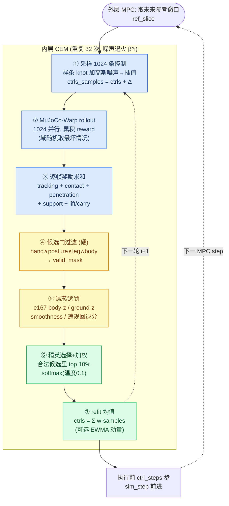
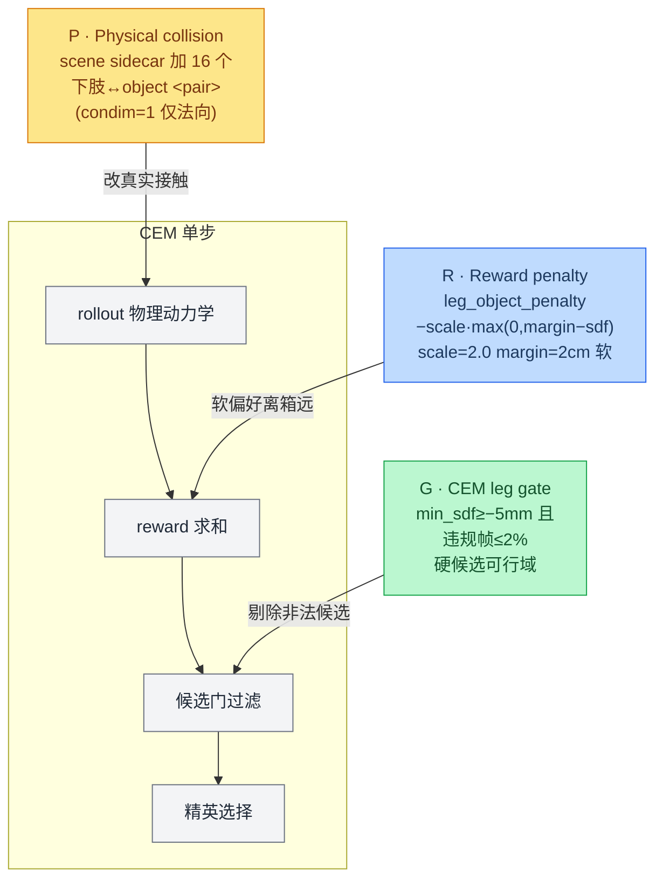

# 面向人机协作的动力学重定向 · E167A + PRG 阶段总结（含算法流程）

> CORE4D 人-物-人协作重定向 · 2026-08-14 · 在 0624（E167A）总结基础上并入 PRG
> 基线：OmniRetarget（运动学重定向）｜方法：SPIDER（动力学重定向，MPC+CEM）
> 覆盖：E167A（0624 结论） + PRG（E169-E170）+ 5 类 box 批量（E171-E178）+ no-PRG 消融（E179/E189）+ G1/A2 探索（E192-E198）+ 同口径大对比（E197）
> 上一版：`workspace/core4d/report/0624/{concise,detailed}_report.md`

---

## 0. 一句话 & 相对 0624 的变化

**0624 结论**：在 OmniRetarget 运动学结果之上做 SPIDER 动力学优化，E167A 在「重定向数值指标」与「下游 RL 聚合」两个维度都胜过 OmniRetarget；但遗留三个结构性问题——**下肢/腿部 shortcut（腿穿箱、借腿支撑）**、**box023 手贴髋自碰撞**、**可恢复性不对称**。

**本阶段做的事**：把 0624 里「下肢干涉」这个最突出的遗留问题工程化为一个独立的、可开关的机制 **PRG（下肢-物体干涉三轴控制）**，把 **E167A + PRG** 冻结为默认方法，批量跑到 **5 类 box × 87 个 Full-CEM case**，并完成：

| 维度 | 0624（E167A） | 现在（E167A + PRG） |
|---|---|---|
| 方法 | E167A_zOnlyBody（body-z + gateA + surfaceBand + posture gate + rubber_hull） | **+ PRG（P 物理对 / R 软奖励 / G 硬候选门）**，专治下肢-物体穿透 |
| 同口径对比规模 | clean8（8 case，单物体为主） | **E197：5 类 box、87 case、7 指标**，OmniRetarget vs PRG 逐 case 配对（最大规模） |
| PRG 该不该留 | —（当时还没有 PRG） | **消融确认**：E179 box023 `PRG_BETTER`；E189 box024 `PRG_BETTER`、box004/box001 `NONINFERIOR`；**下肢门三物体一致退化** |
| 新的模型侧探索 | — | **G1 物体重力补偿**（E194，改善物体 tracking，但 object_ori 退化）；**A2/A3 更紧 hand gate**（E192/E195，均因门崩/安全回退**不升级**） |
| 诚实边界 | 单 case 抖动 | **整体可用率不高**（按十二门过滤）；PRG 有 **raw 接触 trade-off**；退化程度依赖物体几何而非体积 |

> 核心信息：PRG 让动作在**穿透、平滑性（脚滑/物速/踝 jerk）、真实物理接触**上相对 OmniRetarget 大幅、干净地胜出，代价是 raw 接触覆盖率下降；下肢保护的**因果头**在多物体上稳固，但「是否值得保留」逐物体不同。

---

## 1. 算法全景与流程（本次总结的核心）

### 1.1 三段式总管线：OmniRetarget → SPIDER(CEM) → 下游 RL

```mermaid
flowchart LR
    accTitle: 人机协作动力学重定向三段式管线
    accDescr: OmniRetarget 提供运动学参考，SPIDER 用 MPC+CEM 做动力学优化，产物交给下游 RL

    raw["CORE4D raw<br/>人-物-人动捕<br/>object pose / contact mask / scene"] --> omni["① OmniRetarget<br/>运动学重定向<br/>(人→G1, 无动力学)"]
    omni --> ref["运动学参考轨迹<br/>trajectory_kinematic.npz<br/>(qpos_ref / object / contact)"]
    ref --> spider["② SPIDER 动力学优化<br/>MPC + CEM (1024×32)<br/>E167A + PRG"]
    spider --> out["动力学可行轨迹<br/>trajectory_mjwp_act.npz<br/>(物理接触/低穿透/带 partner)"]
    out --> gate["十二门 + 人工 QC<br/>(physics 6 门 + tracking 6 门)"]
    gate --> rl["③ 下游 RL<br/>SUGAR (refiner) / Holosoma (WBT)"]

    classDef src fill:#dbeafe,stroke:#2563eb,color:#1e3a5f
    classDef proc fill:#dcfce7,stroke:#16a34a,color:#14532d
    classDef data fill:#f3f4f6,stroke:#6b7280,color:#1f2937
    class raw src
    class omni,spider,rl proc
    class ref,out,gate data
```

**关键定位**：SPIDER 不重新生成动作，而是**在 OmniRetarget 运动学参考之上做动力学优化**——所以全部价值都落在「相对 OmniRetarget 的增量」。物体的 6-DOF 由 `contact_guidance` 的**物体 PD 执行器**驱动去跟 GT（这也是 0624「CEM 里物体是 GT」洞察的来源）。

### 1.2 SPIDER 核心：MPC + CEM 采样优化（Full = 1024 samples × 32 iters）

SPIDER 本质是一个**采样式 MPC**：外层 receding-horizon 逐 sim step 前进，内层用 **CEM（交叉熵/MPPI 家族）** 在一个 horizon 窗口里优化**控制序列 `ctrls`**（机器人执行器 + 物体 PD 执行器），而非直接优化 qpos——qpos 是把 `ctrls` 在 MuJoCo-Warp 里 rollout 出来的。

**要点**：
- **门（gate）在精英选择「之前」过滤候选**——把不满足硬可行域的样本从精英池里剔除；若合法候选不足 `min_valid_frac`，退回「按违规最小」的 least-violation fallback，不会全丢。
- **软惩罚只是把标量从每条样本的 reward 里减掉**——差样本若 tracking 收益足够高仍可能当选。**门 = 谁有资格；软惩罚 = 谁分高**。这条区分是理解 PRG 三轴的关键。
- Full CEM `1024×32`（`examples/config/default.yaml`）；elite 比例 0.1、温度 0.1。

### 1.3 奖励项与门（软 vs 硬 两条通道）

逐帧 reward 是**一大堆加性项的和**（`spider/simulators/mjwp.py: get_reward`），按作用归类：

| 类别 | 主要项 | 作用 |
|---|---|---|
| **跟踪** | `qpos_rew`/`local_frame_rew`、`task_body_rew`、`task_obj_rew` | 关节/根相对姿态、世界系身体位、**物体 6-DOF pose**（高权重） |
| **接触** | `contact_rew`、`contact_mask_rew`、`contact_hdmi_rew`、`surface_band_rew` | mask 内手-物接近、HDMI 目标点接触、**surfaceBand**（薄 SDF 带里贴合得分） |
| **穿透惩罚** | `robot_object_penalty`、`hand_object_deep_penalty`、**`leg_object_penalty`** | 机器人/手/**腿** 对物体的 SDF hinge 惩罚（`clamp(margin−sdf,0)`）|
| **支撑分解** | `hand_support_rew`、`surface_band_penalty`、`nonhand_support_penalty` | 奖励手在物体表面承重、惩罚穿透与**非手（借腿/身）支撑 shortcut** |
| **抬升/搬运** | `object_lift_rew`、`object_floor_penalty`、`carry_corridor_rew` | 物体底面高度、离地间隙、搬运走廊 |
| **样本级软惩罚** | `e167 body-z`、`e167 ground-z`、smoothness、foot | 在优化器里 rollout 后从 reward 减去（非上表求和内）|

门（硬候选可行域，逻辑 AND 组合，带 least-violation fallback）：

| 门 | 监控量 | 语义 |
|---|---|---|
| **hand gate（gateA）** | 手 `lh/rh` 对物体保守 SDF | 允许轻接触（手-物接触是有意的），阈值最松 |
| **posture gate** | 仿真 root-z vs **参考 root-z** | 拒绝根高偏离参考的样本（蹲姿参考不会被误杀）|
| **leg gate（= PRG 的 G）** | 16 个下肢 geom 对物体 SDF | 下肢-物体接触**语义非法**，单独设门，最严 |
| body/safety gate、peak-margin rerank | 身体安全 / 离硬门余量 | 同机制的其它候选过滤 |

### 1.4 E167A_zOnlyBody profile（配置继承链）

E167A 由 override 继承链拼成：`E167A → E163_narrowSurfaceBand → E156_gateA → E147_rubber_hull → E096b_mask_cem`：

- **body-z / ground-z**（E167A）：Holosoma 风格**只跟踪身体 z 分量**（踝+腕，权重 2.0，阈值 0.25m）；ground-z 只对**着地帧**的踝跟 z，保持脚不飘。
- **gateA**（E156）：CEM hand feasibility gate（`min_sdf −10mm / hard_floor −20mm / 违规≤10%`）。
- **surfaceBand narrow**（E163）：物体表面 `[−1mm,+3mm]` 对称薄带贴合奖励，修「放手放不掉」的误接触。
- **posture gate**（E163）：root-z 相对参考的姿态门。
- **rubber_hull / rubberHull**（E147）：把 G1 手 `lh/rh` 碰撞体换成 rubber-hand mesh 的凸包（`maxhullvert=64`），只改机器人手侧碰撞几何，不改算法/奖励。
- **contact_guidance**：加载 `scene_act.xml`，给物体加 **PD 执行器**（单臂 6-DOF / 双臂 12-DOF），使物体在 CEM 中被引导跟 GT。

### 1.5 PRG：下肢-物体干涉三轴机制（本次新增的核心）

PRG 是一个 **2³ 因子** 里 `P=1,R=1,G=1` 的全开 cell，专治下肢/腿部穿箱与借腿支撑。三轴用**同一组 16 个下肢 collision geom**（左右 hip/thigh/shin/linkage brace + 双脚 lf0-3/rf0-3），但作用在算法的**三个不同位置**：

| 轴 | 名称 | 插入位置 | 机制 | 关键参数 |
|---|---|---|---|---|
| **P** | Physical collision | rollout 动力学 | scene sidecar 新增 16 个 `下肢↔object_collision` `<pair>`，让腿碰箱产生**真实法向接触**而非无代价互穿 | `solref=0.008 1, condim=1` |
| **R** | Reward penalty | reward 求和 | `leg_object_penalty = −scale·max(0, margin−min_leg_sdf)·gate`，**软**偏好 2cm clearance | `scale=2.0, margin=0.02, always` |
| **G** | CEM candidate gate | 精英选择前 | 整段 rollout `min_sdf≥−5mm` 且 `SDF<+5mm` 帧 ≤2% 才判 leg-valid，与 hand/body 门 **AND** | `min_sdf=0.005, hard_floor=−0.005, ≤2%` |

> **E169 因子结论**：降下肢穿透的主效应 **G > R > P**（G 最强）；P 单独可能把「几何互穿」变成「真实踩箱接触」，需与 R/G 配合。**「不要 PRG」≠「不要 E167A 原生的下肢/姿态约束」**——no-PRG 只关这三轴，body-z/ground-z/gateA/posture gate 全部保留。

### 1.6 后续探索的模型侧改动（均为 scene sidecar，非 reward）

- **G1 · 物体重力补偿**（E194）：在 `scene_act` 上只给**物体 body** 注入 `gravcomp="1"`（kp 保持 500）。修物体平移下沉、改善物体 tracking/承重接触/降穿透；硬伺服替代方案 G2(kp=2500)/G3 发散被弃。**代价：object_ori 门退化**（E194 `98.6%→84.7%`）。
- **A2/A3 · 更紧 hand gate**（E192/E195）：收紧 hand gate 三字段。A2 `INCONCLUSIVE_GATE_COLLAPSE`、A3 `SAFETY_REGRESSION`（穿透反增+跨门安全回退），**均不升级**。
- **E198 · G1×A2 因子**：非可加、相互救援，价值是「方差收缩而非均值提升」，判 `FACTORIAL_CHARACTERIZED`，**不升级**。

---

## 2. 结果更新（PRG 时代的新证据）

### 2.1 E197 · 5 类 box × 87 case，OmniRetarget vs PRG 七指标（最大规模同口径对比，新主证据）

87 个进入 Full CEM 的唯一 case（box001/004/021/023/024 = `28/6/28/16/9`）；OmniRetarget kinematic replay 与 **PRG（=E167A+PRG）** CEM rollout 用**同一 scene_act、3cm raw mask、person index、帧域**，由公共评测模块统一重算，逐 case 配对。**正 improvement 一律代表 PRG 更好**。

**Object-balanced macro average（跨物体主口径）**：

| 指标 | 方向 | OmniRetarget | PRG | Improvement | W/T/L |
|---|:--:|---:|---:|---:|---:|
| 3mm in-mask 接触（真实干净接触）| ↑ | 11.2% | **42.9%** | **+31.7 pp** | 74/1/12 |
| raw in-mask 接触（任意接触覆盖）| ↑ | 91.8% | 73.7% | **−18.1 pp** | 8/0/79 |
| 手-物 >3mm 穿透 | ↓ | 54.2% | **21.2%** | **+33.0 pp** | 84/0/3 |
| lower-body 穿透 | ↓ | 9.1% | **6.4%** | +2.7 pp | 34/27/26 |
| foot slip max | ↓ | 1.235 m | **0.821 m** | +0.414 m | 72/0/15 |
| object speed max | ↓ | 3.151 m/s | **1.568 m/s** | +1.583 m/s | 84/0/3 |
| ankle jerk P95 | ↓ | 2166.6 | **765.8** | +1400.8 m/s³ | **87/0/0** |

**解读**：
- **PRG 在物理/平滑性上是干净的大胜**：手-物穿透 **−33pp**（84/0/3）、脚滑、物体最大速度、踝 jerk（**87/0/0 全胜**）全部大幅改善——动作更物理、更稳、更不抖。
- **真实接触大幅提升**：3mm in-mask（**低穿透的干净接触**）**+31.7pp**（74/1/12）。这印证 0624 的判断：OmniRetarget 的「接触」大半是**压入式穿透**（raw 92% 但 3mm 仅 11%）。
- **代价 = raw 接触 trade-off**：PRG 的 raw in-mask 接触 **−18.1pp**（8/0/79）。即 PRG 为了低穿透，牺牲了「任意接触帧」的覆盖率——这是 PRG 最主要的 trade-off，也是可用率不高的一个来源。
- lower-body 穿透只 +2.7pp（34/27/26 大量打平）：因为 E167A 原生 + PRG 都已把下肢压住，OmniRetarget 在这项上没那么糟。
- OmniRetarget 宽 gate 预筛（只读 Omni 指标）通过 `52/87`。
- **边界**：E197 只衡量「结果差异」，**不分离 P/R/G 各自的因果贡献**；CEM 单 seed。

### 2.2 no-PRG vs PRG 消融（E179 / E189）：PRG 该不该保留

在**同 case 配对、关掉 P/R/G 三轴**（其余 E167A 原生约束不动）下问：移除 PRG 会更好还是更差？

| 物体 | n | 十二门（PRG → no-PRG） | 结论 |
|---|---:|---|---|
| box023（E179）| 16 | 7/16 → 4/16 | **`PRG_BETTER`** |
| box004（E189）| 6 | 2/6 → 2/6 | `NO_PRG_NONINFERIOR` |
| box024（E189）| 9 | 2/9 → 0/9 | **`PRG_BETTER`**（视频有清晰小腿穿箱证据）|
| box001（E189）| 28 | 5/28 → 6/28 | `NO_PRG_NONINFERIOR` |

**结论**：
- **下肢门在四个物体上无一例外地退化**（如 box024 `7/9→1/9`）——「PRG 移除 → 下肢约束消失」的**因果头稳固、物理可信**，box024 有直接可见的腿穿箱证据。
- 但「**PRG 随物体体积单调退化**」的假设被**证伪**：体积最大的 box001 反而 non-inferior，体积第二大的 box024 却是唯一明显回归。**决定 PRG 依赖程度的是物体几何/抓取拓扑，不是体积标量**。
- 因此 **PRG 维持为默认**；box024 明确保留，box004/box001 打平（保守保留）。E190 已固化 38-case 的 noPRG 对照导出以备后续统计。

### 2.3 与 0624 下游 RL 结论的衔接

0624 已确立 SUGAR（56/51 vs 13）+ Holosoma handbox（48.1% vs 32.5%）**双下游聚合胜 OmniRetarget**。本阶段把 E167A+PRG 批量铺开后：box021 的 11 个下游 case RL **都能训出来**；box001/box024/box004 各有个别 case 训不出（多为末段摔倒或抬升语义问题）——与 0624 的**可恢复性不对称**（接触可恢复、离硬门余量/抬升语义不可恢复）一致，PRG 主要补的是**穿透/下肢**这一「上游能修」的维度。

---

## 3. 不足与后续规划

**不足**
1. **整体可用率不高**（E171-E178 按十二门过滤）：这是 PRG 时代最诚实的问题，也是做 E197/消融的动机。
2. **PRG 的 raw 接触 trade-off**（−18pp）：降穿透与保接触覆盖此消彼长，纯 CEM 内难根除。
3. **G1 的 object_ori 退化**：物体重力补偿改善平移 tracking，但朝向门退化，尚未全面升级。
4. **退化程度依赖物体几何而非体积**：缺跨物体几何特征（宽高比、抓取面到地距）→ PRG 依赖度的预测模型。
5. 单 seed CEM；E197 只比结果差异不分离 P/R/G 因果；A2/A3 更紧 hand gate 已证伪。

**后续（按杠杆）**
0. 把 **E197 87-case 同口径 + no-PRG 配对**固化为官方对比口径，补足统计显著性（多 seed）。
1. 针对 **raw 接触 trade-off**：把 surfaceBand/接触奖励与 leg gate 联合调参，或按物体几何自适应 PRG 强度，而非全局固定 `scale=2.0`。
2. 用物体几何特征回归 PRG 依赖度，替代「体积」这个粗代理，指导逐物体是否开 PRG。
3. G1 object_ori 退化的定位（Euler 参考错配 vs gravcomp 因果，E196 已修 29 条 meta）后再决定是否升级。
4. 承接 0624 未落地的三个下游杠杆：消费端物理接触打分、离硬门动态余量 rerank、抬升语义进 RL reward。

---

## 4. 附录

### 4.1 关键路径

| 内容 | 路径 |
|---|---|
| 上一版 E167A 总结 | `workspace/core4d/report/0624/{concise,detailed}_report.md` |
| PRG 三轴因子定义（E169）| `workspace/core4d/log/228_E169_lowerbody_object_factorial_results.md` |
| E197 Omni-vs-PRG 87-case 七指标 | `workspace/core4d/analysis/E197_full_cem_omnirt_vs_prg_metrics/E197_full_cem_omnirt_vs_prg_metrics.md`(+`.xlsx`) |
| no-PRG vs PRG 消融（box023）| `workspace/core4d/log/242_E179_box023_e167a_no_prg_vs_e173_results.md` |
| no-PRG vs PRG 消融（box004/024/001）| `workspace/core4d/log/265_E189_..._e167a_no_prg_vs_prg_results.md` |
| G1 物体重力补偿 | `workspace/core4d/log/268_E194_object_gravity_compensation_results.md` |
| 可用率不高的诊断动机 | `workspace/core4d/exp_analysis_0726.md` |
| 实验总表 | `workspace/core4d/EXPERIMENT_TRACKER.md`（E167→E198）|
| CEM 算法源码 | `spider/optimizers/sampling.py`（循环/门/精英）、`spider/simulators/mjwp.py`（reward/门 SDF）、`spider/config.py`（全部 flag）、`examples/run_maniptrans.py`（外层 MPC）|

### 4.2 术语速查

- **SPIDER**：采样式 MPC + CEM 的动力学重定向；优化控制序列 `ctrls`，Full = `1024 samples × 32 iters`。
- **门（gate）** vs **软惩罚**：门在精英选择前剔除非法候选（带 least-violation fallback）；软惩罚只减 reward，不剔除。
- **E167A_zOnlyBody**：body-z + ground-z + gateA(hand gate) + surfaceBand + posture gate + rubber_hull + contact_guidance。
- **PRG**：下肢-物体干涉三轴——**P** 物理碰撞对（改动力学）/ **R** 软奖励惩罚（`leg_object_penalty`）/ **G** 硬候选门（`cem_leg_gate`）。
- **G1**：物体重力补偿（scene sidecar `gravcomp=1`）；**A2/A3**：更紧 hand gate（已证伪）。
- **raw in-mask 接触**：源 mask 内任意物理接触占比；**3mm in-mask 接触**：其中 ≤3mm 穿透的干净接触占比。

---

*覆盖：E167A（0624）+ PRG（E169-E170）+ 批量（E171-E178）+ 消融（E179/E189）+ G1/A2（E192-E198）+ E197 同口径对比 · 2026-08-14*
