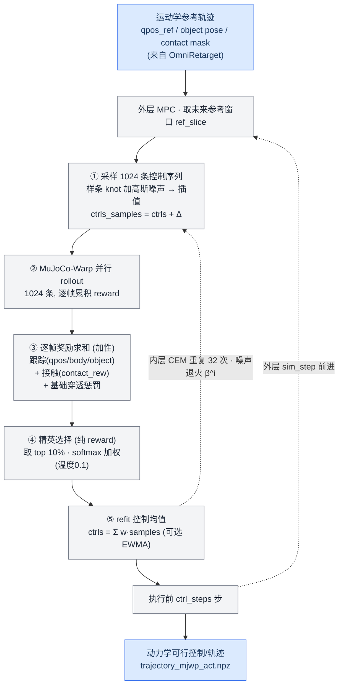
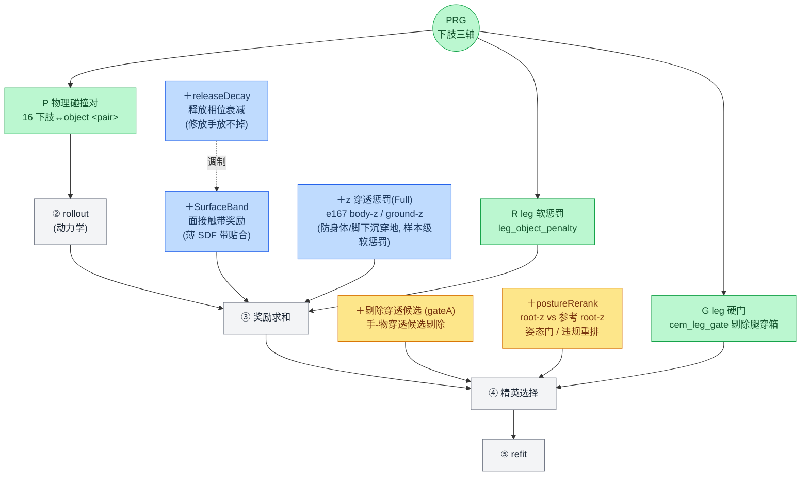

# SPIDER 算法流程图：原始算法 + 我们的增量

> CORE4D 人机协作重定向 · 2026-08-14 · 配合 `E167A_PRG_summary.md`
> 两张图：① 原始（vanilla）SPIDER 算法流程；② 我们在其之上叠加的组件（附插入位置映射表）

---

## 图 ① · 原始 SPIDER 算法流程（vanilla）

原始 SPIDER = **采样式 MPC + CEM**：外层 receding-horizon 逐 sim step 前进；内层 CEM 在一个 horizon 窗口里优化**控制序列 `ctrls`**（机器人执行器 + `contact_guidance` 的物体 PD 执行器）。qpos 由 `ctrls` 在 MuJoCo-Warp 里 rollout 得到。精英选择是**纯 reward 排序**（无门）。

---

## 图 ② · 我们在原始 SPIDER 之上叠加的组件

同一条 CEM 主干（灰），我们的增量按颜色分三类挂到对应阶段：
**🟦 奖励求和阶段的软项**、**🟨 精英选择前的硬候选门/重排**、**🟩 PRG 下肢三轴**。

---

## 增量 → 插入位置 映射表

| 我们加的东西 | 插入阶段 | 类型 | 作用 | 来源 |
|---|---|---|---|---|
| **＋剔除穿透候选（gateA）** | ④ 精英选择前 | 🟨 硬候选门 | 手-物保守 SDF 违规的候选**不进精英池**（不足则 least-violation 回退），把「压入式穿透」挡在采样阶段 | E156 |
| **＋postureRerank** | ④ 精英选择前 | 🟨 硬门 + 违规重排 | 比较**仿真 root-z vs 参考 root-z**，剔除塌姿/借身支撑的候选；蹲姿参考不会被误杀 | E163 |
| **＋SurfaceBand（面接触带奖励）** | ③ 奖励求和 | 🟦 软奖励 | 物体表面 `[−1mm,+3mm]` 薄 SDF 带里贴合得分，鼓励**真实面接触**而非穿模接触 | E152 / E163 |
| **＋releaseDecay（释放相位衰减）** | ③ 奖励求和（调制 SurfaceBand） | 🟦 软奖励调制 | 在释放相位衰减接触奖励（`decay_frac≈0.15`），修「放手放不掉」的误接触（release false contact `0.188→0.030`） | E161 |
| **＋z 穿透惩罚(Full)** | 优化器样本级软惩罚（rollout 后减） | 🟦 样本级软惩罚 | e167 **body-z + ground-z**：只跟身体/脚的 z 分量，防止身体/脚在 z 向下沉穿地（着地帧尤其），是「zOnlyBody」的定义特征 | E167A |
| **PRG · P（物理碰撞）** | ② rollout 动力学 | 🟩 改动力学 | scene 加 16 个下肢↔物体 `<pair>`，腿碰箱产生真实法向接触而非无代价互穿 | E169 / E170 |
| **PRG · R（软奖励）** | ③ 奖励求和 | 🟩 软惩罚 | `leg_object_penalty = −scale·max(0, margin−sdf)`，软偏好下肢离箱 2cm | E169 / E170 |
| **PRG · G（硬门）** | ④ 精英选择前 | 🟩 硬候选门 | `cem_leg_gate`：整段 `min_sdf≥−5mm` 且违规帧≤2% 才判 leg-valid，与 hand/body 门 AND | E169 / E170 |

> **两条通道再强调一次**：🟦 软项只把标量从每条样本的 reward 里减/加，差样本 tracking 够高仍可能当选；🟨🟩G 是硬门，在精英选择「之前」直接剔除非法候选（带 least-violation fallback）。**门 = 谁有资格；软项 = 谁分高。**

---

*配合阅读：`E167A_PRG_summary.md`（完整总结）· 源码：`spider/optimizers/sampling.py`（CEM 循环/门/精英）、`spider/simulators/mjwp.py`（reward/门 SDF）*
