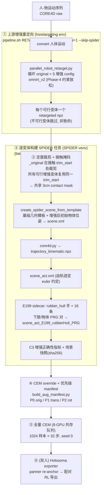

# 物体增强重定向链路（Object-Augmentation Retargeting Pipeline）

> 定位：说明我们如何在**一条人-物交互序列**上，通过扰动物体的接近段位姿，自动派生出多条**物理可行、接触锚点一致**的增强轨迹，并全程走完 `重定向 → SPIDER 转换 → PRG 场景 → 全量 CEM` 的链路。对应实验 **E199**（`workspace/core4d/scripts/experiments/E199/`）。
> 一句话：**增强只发生在上游重定向的“物体接近段”，指数衰减回原始终点**；下游 SPIDER/CEM 把每个可行增强变体当作**独立任务**处理，从不覆盖历史基线场景。

---

## 0. 增强的本质：接近段位姿扰动 + 终点锚定

增强来自上游 OmniRetarget / holosoma 的 `object_interaction` 模块。它对**物体的接近段（approach segment）位姿**施加平移 + 偏航扰动，并在物体开始被操作后按**指数衰减**回归原始轨迹（`translation_tau=50`、`rotation_tau=25` 帧），使得**抓取/操作的终点保持锚定不变**。

- 原生固定变体集合 = `original` + 5 个增强：

  | E199 名 | 上游 config | 扰动 | 说明 |
  |---|---|---|---|
  | `orig` | `original` | 0 | 同条件基线（在 E199 冻结契约下重跑，保证单变量对比）|
  | `trans0` | `trans_0` | 平移 `[+0.2, 0, 0]` | 前 |
  | `trans1` | `trans_1` | 平移 `[0, +0.2, 0]` | 左 |
  | `trans2` | `trans_2` | 平移 `[0, −0.2, 0]` | 右 |
  | `rot0` | `rot_0` | 偏航 `+45°` + 侧移 `+0.2` | |
  | `rot1` | `rot_1` | 偏航 `−45°` + 侧移 `−0.2` | |

- 扰动定义在**每个人自身朝向相对系**（facing-relative）。因此双人共享物体时，两人对**同一物体**的世界系扰动方向不同（这是预期行为，一致性由下游 Holosoma exporter 的 partner re-anchor 保证，见 §6）。
- 已验证（box024）：接近段位移 = 0.200m，终点残差 = 0.027m（衰减生效）。

---

## 1. 完整链路总览



---

## 2. ① 上游增强重定向

由 `pipeline.sh` 的增强分支驱动（`RETARGET_AUGMENTATION=1` + `--skip-spider`），运行在 hsretargeting conda 环境；`build_augmented_tasks.py::run_upstream` 负责组装环境变量并调用：

1. **convert**：人体运动格式转换。
2. **parallel_robot_retarget.py**：一次性循环 `original` + 5 个原生增强 config（单跑版 `robot_retarget.py --augmentation` 只写死一个 config，故增强必须走 parallel 版）。
3. 产物：每个**可行**变体一个 `retargeted/{holo}_{variant}.npz`；不可行变体缺 npz，**跳过而非报错**。

### 冻结重定向契约：`omnirt_v2`（Phase-4 约束放松）

物体被平移后会移出机器人可达包络，`omnirt_v1`（无约束放松）下 IK 常不可行。E199 对**全部 6 个变体（含 orig）统一**使用 `omnirt_v2`，保证 orig-vs-aug 是单变量对比：

```
RETARGET_ENABLE_CONSTRAINT_RELAXATION=1
RETARGET_ENABLE_FOOT_Z_CONSTRAINT=1
RETARGET_ENABLE_CONTACT_PRESERVATION=1
RETARGET_FOOT_SLIDE_PENALTY_WEIGHT=1.0
RETARGET_OBJECT_PENETRATION_TOLERANCE_SCALE=0.8
```

**可行性事实**：box024 在 v1 下仅 2/5 增强可行；切到 v2 后 3/5（所有平移恢复；±45° 偏航仍不可行）。因此全量 box 规模（`box_fullscale`）**只做 3 个平移变体**，rotation 系统性不可行。

> 注：该增强路径在 E199 前从未被跑通，上游 `parallel_robot_retarget.py` 修复了两个 bug——(1) 增强循环把 retargeter *config* 参数覆盖成了 retargeter *实例*；(2) 一个不可行变体会中断其后所有变体（现 `k==0` 致命、`k>0` 跳过）。两者均已在上游分支修复并入库。

---

## 3. ② 定窗裁剪 + 接触掩码

`fixed_window_trim`：因为增强把操作**终点锚定到原始**，接触触发的裁剪窗口按构造与 `_original` 相同。

1. 由 `_original` 的 retargeted 与 trimmed 帧数之差算出 `trim_start`；
2. **所有可行增强变体在同一 `trim_start` 处裁剪**（缺 npz 的变体记为 infeasible 并跳过）；
3. 3cm 接触掩码（一个时间轴量）由 `_original` 产出，**被全部 6 个变体复用**。

---

## 4. ③ 逐变体构建 SPIDER 任务

`build_variant_task`：对每个可行变体生成独立任务 `{base}__aug_{variant}`（任务名把 `omnirt_v1` 重标为 `omnirt_v2`；基线任务 pin 仅作元数据/几何模板权威，**从不覆盖历史场景**）。四步：

1. `create_spider_scene_from_template`：以**基础任务几何为模板** + **增强后的初始物体位姿**，生成标准 `scene.xml`；
2. `spider/process_datasets/core4d.py`：生成 `0/trajectory_kinematic.npz`；
3. 再跑一次 `--generate-scene-act`：`scene_act.xml`（euler 约定从轨迹检测，写入 `scene_act_meta.json`）；
4. `build_prg_scene`：标准 scene_act → **rubber_hull 手部 sidecar** → 追加 **16 条下肢/物体接触对** → `scene_act_E199_rubberHull_PRG.xml`（数值契约逐字复用 E173，作为单一真值来源）。构建时校验：pair 数=16、语义 diff 仅限 pair、手为 mesh、参考前 5 帧下肢-物体净空 ≥ 硬地板阈（否则判 `runtime_initial_overlap` 丢弃该变体）。

**C3 增强正确性指标**（`pose_diff`，从 trimmed npz 计算，供离线校验）：接近段（前 10 帧）相对 original 的平移/偏航偏移（max/mean）、终点偏移、`endpoint_frac_of_approach`（终点残差占接近段峰值的比例，衡量锚定回归质量）。

**可复现性**：每个 sidecar 被快照到 `results/E199/scene_snapshot/cem_sidecars/<task>/`，`train_E199.sh` 汇总写 `manifest.txt`（git HEAD + 各文件 sha256），作为 XML 复现的第二道保险。

---

## 5. ④⑤ CEM override + 优先级 manifest + 全量 CEM

- `build_aug_manifest.py`：为每个变体写基础任务 yaml（`core4d_{aug_task}.yaml`，复制历史基线 yaml 并换 task+mask）+ PRG override yaml（`prg_override_payload`，gate 与 E173 一致）+ 8-GPU 优先级 manifest。
- **优先级分层**：P0 `orig` → P1 `trans*` → P2 `rot*`（`TIER_OF_VARIANT`）。
- 冻结 CEM 预算（full）：`samples=1024`、`opt_steps=32`、`seed=0`。
- `run_E199_local_8gpu.sh` → `run_local_priority_queue.py`：**共存式**调度，仅在显存空闲 ≥ 阈值时派发，不抢占外部进程，resume-safe。

---

## 6. ⑥ 双人配对导出的一致性（downstream re-anchor）

per-person 增强在**各自朝向系**扰动同一物体，两人的原始物体轨迹在世界系可发散 ~0.4m（这是预期）。自一致性**在下游 Holosoma exporter 强制**（`export_rl_motion_from_spider_tsv.py` 的 partner re-anchor，默认开）：partner 手 → partner-object-local → **source-object-world**，使 partner 手锚定到 source 的单一物体。

> **不要**用两次重定向的原始物体通道 parity 去 gate 双人增强导出——那测的是 re-anchor 前的量，永远“失败”（~0.4m）。正确检查是 re-anchor 后抓取窗口的一致性。

---

## 7. 入口速查

| 步骤 | 命令 |
|---|---|
| 数据构建（pilot：8 对象 × 6 变体）| `bash workspace/core4d/scripts/train/train_E199.sh` |
| 数据构建（全量 box：仅平移）| `SCOPE=box_fullscale bash workspace/core4d/scripts/train/train_E199.sh` |
| 单子集 | `CASES=box024 bash workspace/core4d/scripts/train/train_E199.sh` |
| 全量 CEM（8-GPU 共存队列）| `bash workspace/core4d/scripts/launch/active/run_E199_local_8gpu.sh` |
| 评估 | `bash workspace/core4d/scripts/eval/wrappers/eval_E199_augmentation.sh` |

**关键文件**

- `e199_common.py` — 单一契约（8-case 注册表、变体集、`omnirt_v2` 环境、PRG 场景构建、优先级分层）
- `build_augmented_tasks.py` — 上游增强 → 裁剪 → 逐变体 SPIDER 任务 + C3 指标
- `build_aug_manifest.py` — override yaml + 优先级 manifest
- `run_local_priority_queue.py` — 8-GPU 共存 CEM 调度器
- `pipeline.sh`（`RETARGET_AUGMENTATION` 默认关的增强分支）

---

## 8. 设计要点小结

1. **增强只碰接近段**：终点指数衰减锚定 → 接触语义、裁剪窗口、接触掩码在所有变体间天然一致。
2. **单变量对比**：orig 与所有 aug 都在 `omnirt_v2` 冻结契约下重跑。
3. **可行性驱动的规模**：平移可行、±45° 偏航系统性不可行 → 全量 box 只做平移。
4. **绝不覆盖历史**：增强产物全部落在新的 `__aug_*` 任务目录，历史 scene/override 只读。
5. **双人一致性下沉**：不在重定向层强求两人物体 parity，交由 exporter re-anchor。
</content>
</invoke>
