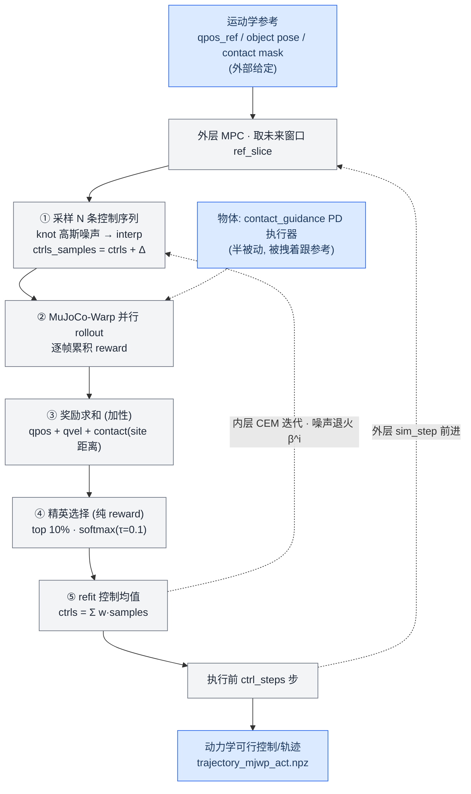
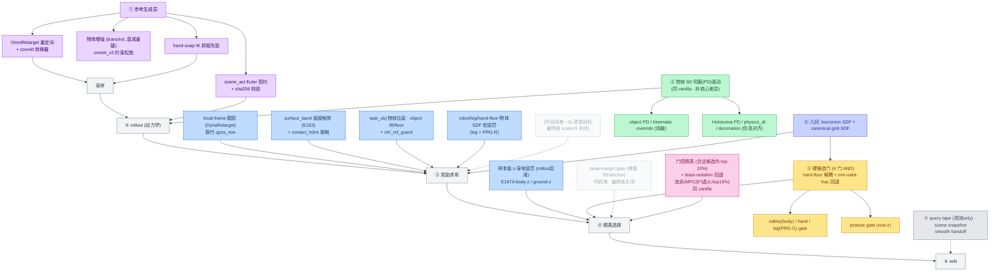

# SPIDER 算法全面对比：上游原始 (facebookresearch/spider) vs 本分支

> 视角：**算法 / 学术研究**（代码只是工具，不是结果）。逐项列出「不变的部分（相同）」与「我们改动的部分（不同）」。
> 基线：`origin/main` 与本分支 `HEAD` 的 **merge-base = `ab43df0`**（真正的 vanilla 分叉点）。
> **权威版本**：以**最终算法 = E167A + PRG + G1（E199 线，`core4d_E199_*_PRG.yaml` 继承 `dcv3_omnirt_v2` 基座）**为准。凡「代码库里存在但该最终线未启用」的机制（如 SBTO / 可配 elite_fraction），本报告明确标注为**非最终线所用**，不计入「我们的算法」。
> **范围声明**：本报告只讨论**单主体 人-物 重定向 + 物体增强（E199 / core4d 线）**。`workspace/core4d_collab_retarget` 对应的**双人/协作重定向**工作线**不在本次讨论范围内**，因此本报告不涉及双人 partner 重锚、Gibbs 双机器人坐标采样、`dual_humanoid_object`、partner force / mocap partner、support proxy、freejoint 自由体物体等协作专属机制。**本算法本质仍是单人重定向，物体为 6D 伺服(PD)驱动。**
> 规模指纹（仅作改动量参考，不作为结论）：`sampling.py` 428→1274 行、`mjwp.py` 1227→5004 行、`config.py` 527→1580 行，新增算法模块 11 个（grid_sdf / surface_distance / scene_act_reference / mjwp_object_distance / hand_snap_ik / smooth_handoff / core4d 转换器 / query_tape 等）。
> 前一版：`../0814/spider_algorithm_flow.md`（覆盖 E152–E170 的 reward/gate/PRG 增量）。本版在其基础上补齐：**参考生成层（数据增强/OmniRetarget）、DynaRetarget 局部系跟踪、门控精英选择的精确化、几何后端、可复现性工具链**，并**更正**了优化层与物体动力学层（最终线未用 SBTO，物体仍为 6D 伺服驱动），构成完整的算法差异地图。

---

## 0. 阅读方式：把差异挂到「重定向问题」的五个层

原始 SPIDER 是一句话能说清的算法：**给定运动学参考，用采样式 MPC（CEM/DIAL-MPC）在物理仿真里搜一条动力学可行的控制序列**。我们的所有改动，本质上都落在下面五个层里。后文严格按此结构展开。

| 层 | 原始 SPIDER | 本分支的改动定位（单主体 人-物 线） |
|---|---|---|
| **① 参考生成层** (reference) | 外部给定 `qpos_ref / object pose / contact mask`，算法本身不管来源 | 引入 **OmniRetarget/holosoma 运动学重定向 + 物体增强 + hand-snap IK + scene_act Euler 契约** 作为参考的一等公民 |
| **② 目标层** (objective/reward) | 3 项加性 reward：`qpos + qvel + 接触` | 代码有 ~23 项，**最终线实际只启用 ~10 项 + 2 样本级 z-穿地**；核心是 **局部系跟踪 (DynaRetarget)** 取代 qpos，且 qvel/contact-site 反而关闭 |
| **③ 约束层** (hard constraints) | 无硬约束，仅 reward 排序 | **硬候选门**（代码 5 类；最终线启用 4 类 safety/hand/leg/posture，peak-margin 关闭），带 hard-floor + 违规帧比例 + least-violation 回退 |
| **④ 优化层** (optimizer) | CEM 纯 reward 精英 + 噪声退火 β^i | **仅** 加了 **门控精英选择**（合法候选内 top-10% + least-violation 回退）；receding-horizon MPC、β^i 退火、top-10% 精英**与 vanilla 相同**（最终线 `use_sbto=False`） |
| **⑤ 动力学层** (dynamics/actuation) | 物体靠 `contact_guidance` 的 6D PD 伺服执行器驱动跟踪参考 | **本质不变**：物体仍为 **6D 伺服(PD)驱动**；仅新增 PD/运动学 override（消融用）与 Holosoma PD/decimation 仿真对齐 |

外加两个横切层：**⑥ 几何后端**（canonical object-local grid-SDF）与 **⑦ 可复现性/仪表**（query tape、scene snapshot、smooth handoff）。

---

## 1. 原始 SPIDER 算法（vanilla，精确复述）

来源：`ab43df0:spider/optimizers/sampling.py` 与 `ab43df0:spider/simulators/mjwp.py`。

### 1.1 优化范式
- **外层 receding-horizon MPC**：逐 sim step 前进，每步取未来窗口 `ref_slice`。
- **内层 CEM / DIAL-MPC**（`make_optimize_fn`）：
  1. **采样**：在样条 knot 上加高斯噪声 `knot_samples = randn·noise_scale·global_noise_scale`，`interp` 到 horizon，`ctrls_samples = ctrls + Δ`。
  2. **rollout**：MuJoCo-Warp 并行 N 条，逐帧累积 reward，`mean_rew = cum_rew/H`。
  3. **精英**（`_compute_weights_impl`）：取 **top 10%**（固定 `0.1·N`），对精英做标准化后 `softmax(·/temperature)`（`temperature=0.1`）得权重，其余为 0。**纯 reward 排序，无门。**
  4. **refit**：`ctrls_mean = Σ w·samples`。
  5. **噪声退火**：第 i 次迭代 `global_noise_scale = beta_traj^i`；早停看 `improvement` 阈值。
- **域随机化 (DR)**：多组 env_param 取 **最坏 reward**（`min_rew`）。

### 1.2 目标函数（`get_reward`）
```
reward = qpos_rew + qvel_rew + contact_rew
  qpos_rew   = -‖(qpos_sim − qpos_ref)·W‖₂        # 加权关节空间跟踪
  qvel_rew   = -vel_rew_scale·‖qvel_sim − qvel_ref‖₂
  contact_rew= -Σ mask·‖contact_site − contact_pos_ref‖₂   # site 距离，被 contact mask 选通
terminal_rew = terminal_rew_scale · get_reward(...)          # 终端只是整体缩放
```
`W` 由 `_weight_diff_qpos` 按 base_pos/base_rot/joint/object 分块赋权。

### 1.3 重采样与终止（`get_terminate`）
- 判据：**物体 pos/rot 误差**超阈 (`object_pos_threshold` / `object_rot_threshold`)。
- rollout 中途，把 terminate 的坏样本用好样本的**仿真状态 + 控制前缀 + 累积 reward** 替换（`copy_sample_state`）。

### 1.4 物体动力学
- 物体由 **6D 伺服(PD)执行器**驱动去跟参考（`contact_guidance` + `object_actuator_ids`），把物体位姿当作**额外的控制通道**；机器人与物体之间不是被动接触力闭环，而是「物体被伺服拽着走」。
- **本分支单人重定向线沿用这一物体驱动方式**（物体仍是 6D 伺服驱动，见 §3 相同点）；freejoint 真自由体 + 外力支撑属于协作线，不在本报告范围。

### 1.5 支持的 embodiment
`bimanual / right / left / humanoid / humanoid_object`（灵巧手 + 人形）。

> **一句话**：原始 SPIDER = 关节空间跟踪 + 接触 site 距离，纯 reward 排序的 CEM，物体被 PD 拽着走。干净、通用、但对「接触真实性、下肢-箱穿透、放手、塌姿」这些 CORE4D 人-物场景里的物理病态**没有任何专门机制**。

---

## 2. 本分支算法（按五层 + 两横切层展开）

### 层① 参考生成层 —— 从「外部给定」变成「算法的一部分」

原始 SPIDER 把参考当黑箱。我们把**参考如何被生成/增强/对齐**纳入方法本体，这是最大的学术性扩展之一。

| 组件 | 内容 | 学术意义 |
|---|---|---|
| **OmniRetarget/holosoma 运动学重定向** | 用 holosoma 的 `robot_retarget` 产出 G1 `qpos(T,43)`，经 `spider/process_datasets/core4d.py` 转成 SPIDER 的 `trajectory_kinematic.npz`（FK 补 qvel/ctrl/contact/contact_pos） | 参考质量从「原始 mocap 手位」升级为「几何-接触一致的可执行 seed」 |
| **物体交互增强 (CORE4D object augmentation)** | 在**接近段**扰动物体位姿（平移+yaw），按 `translation_tau=50 / rotation_tau=25` 帧指数衰减回原轨迹，使操作终点锚定不变。原生 6 变体：`original + trans_0/1/2 + rot_0/1`。`omnirt_v2`（Phase-4 约束松弛：constraint_relaxation + foot_z + contact_preservation）显著提升 IK 可行率（box024：v1 仅 2/5 → v2 3/5，平移全恢复） | 用**数据增强**扩充轨迹分布，是把单条 demo 变多条可行 demo 的生成式思路（而非改优化器） |
| **hand-snap IK** (`preprocess/hand_snap_ik.py`) | 在 intent 窗口内把 G1 手掌 site 阻尼最小二乘 IK **投影到物体表面**（仅改手臂 7DoF，pelvis/腿/躯干/物体不动），替换不可靠的 mocap 手位，作为 CEM warmstart 的抓取先验 | 把「几何抓取先验」注入初值，缓解采样式优化对好初值的强依赖 |
| **scene_act Euler 契约** (`simulators/scene_act_reference.py`) | 对预编译 scene-act 模型做 **fail-closed 的 Euler 约定 + sha256 校验**（`euler_convention`、object_body_id 一致性） | 保证参考几何/物体位姿在不同 XML 版本间**可复现、不静默漂移**（配合 §7 快照） |

> 与 0814 版相比，这一整层是**新补充**的：之前只讲了 reward/gate/PRG，没有系统写清「参考本身怎么被造出来、增强、对齐」。

---

### 层② 目标层 —— 代码 ~23 项 / 最终线实启 ~12 项，并把关节空间跟踪换成局部系跟踪

**重要更正（对照 override 链核实）**：`get_reward` 里**代码存在约 23 个加性项**，但**最终 E167A+PRG 线只启用约 10 个**（其余 `scale=0` / `enabled=false`，挂着没开）；外加优化器侧 2 个**样本级 z-穿地惩罚**。所以「3 项 → 23 项」是**代码菜单**，不是最终算法；最终算法实际是「**3 项 → ~12 项**」，且连 vanilla 的 qvel、contact-site 两项在最终线也已关闭、qpos 被 local-frame 取代。

**最终 E167A+PRG 线实际生效的 reward 项**（scale 来自共享祖先 yaml，全线一致；数值以 box001_039_p1 为代表）：

| 生效项 | scale/开关 | 含义 | 来源 |
|---|---|---|---|
| `local_frame_rew`（取代 `qpos_rew`） | `use_local_frame_reward=true` | **DynaRetarget** root-relative body 跟踪 | e041c |
| `task_obj_rew` | pos 0.5 (+rot) | 物体世界位姿跟踪 | E084C |
| `contact_hdmi_rew` | gain 5.0, mask `core4d_3cm` | HDMI 式接触（含双手 gate/朝向） | E084C |
| `ctrl_ref_guard_rew` | 0.5 | 控制不过度偏离参考 | e074a |
| `robot_object_penalty` | 2.0 | 机器人-物体 SDF 软惩罚 | E084C |
| `leg_object_penalty` | 2.0 | 下肢-物体 SDF 软惩罚（**PRG-R**） | E199-PRG |
| `hand_floor_penalty` | 2.0 | 手穿地惩罚 | E084C |
| `object_lift_rew` | 2.0 | 物体抬起奖励 | E084C |
| `object_floor_penalty` | 2.0 | 物体触地惩罚 | E084C |
| `surface_band_rew` | 1.5 | 面接触带贴合（**E163**，penalty 项=0 关） | E163 |
| `sample_e167_z_penalty`（样本级，rollout 后减） | body-z + ground-z `enabled` | **E167A** 身体/脚 z-穿地惩罚（本线定义特征） | E167A |

**代码里存在但最终线关闭（scale=0 / false）**：`qvel_rew`、`contact_rew`(site)、`task_body_rew`、`interact_rew`、`hand_approach_rew`、`contact_mask_rew`、`hold_contact_rew`、`hand_object_deep_penalty`、`object_clearance_rew/penalty`、`carry_corridor_rew`、`hand_support_rew`、`surface_band_penalty`、`nonhand_support_penalty`、`stability_penalty`、`cem_smooth`、`foot_slip`、`foot_ground`。这些是历史实验（E098–E170 系列）留下的可选项，最终线未采用。

**关键的范式性替换：局部系跟踪取代关节空间跟踪（`use_local_frame_reward`，E035）**
- 原始的 `qpos_rew` 直接在 **qpos（关节角）空间** 做加权 L2。
- 本分支用 `local_frame_rew` **替换** `qpos_rew`：把上肢/下肢/腕/踝 body 转到 **root-yaw 局部系**，分别做 `pos/ori` 的 `exp(−err/σ)` 跟踪，再加 root_pos/root_ori/joint 项。这正是 **DynaRetarget** 的 root-relative body tracking 思路 —— 跟踪的是**世界几何/相对姿态**而非关节读数，对腿长/比例差异和漂移更鲁棒。
- 另有 `use_bounded_qpos_reward`（`exp(-d/σ)` 有界跟踪）、`use_local_contact_reward` 等可选目标形态。

**接触真实性专门化（相对原始的单一 site 距离）**
- `surface_band`（面接触带）：只在物体表面 `[min_sdf, +width]` 的**薄 SDF 带**里给贴合分（`surface_distance.py` 的 `one_sided/symmetric_abs/distance_continuation` 三种 score mode），并有 `release_decay`（释放相位衰减，修「放手放不掉」）、`bimanual_required`（双手都在带内才给分）等调制。**目的：奖励真实面接触，而不是穿模式接触。**
- `contact_hdmi`：HDMI 风格 `mask=1 → gain·exp(-dist/σ)`、`mask=0 → 1.0` 的接触分，含 palm-normal 朝向项与双手门。

> 学术意义：目标从「跟得像不像」单目标，扩成**多目标物理合理性**——最终线实际启用的维度是 **局部系跟踪 + 物体位姿跟踪 + 接触真实(surface_band/contact_hdmi) + 不穿透(robot/leg/hand-floor SDF + E167A z-穿地) + 物体离地(lift/floor)**；每一项 config 驱动、可独立开关消融（上表「关闭」列即历史消融留存），符合本仓 `experiment.md` 的可证伪/可消融原则。

---

### 层③ 约束层 —— 从「无硬约束」到「硬候选门」（代码 5 类，最终线启用 4 类）

原始 SPIDER 只有软 reward 排序：一个差样本只要 tracking 够高仍可能当选（这在物理上会选出「压穿物体/借身支撑/塌姿」的作弊解）。本分支引入**硬候选门**：在**精英选择之前**直接把非法候选**剔出精英池**（`_compute_sample_gate_info` + `_compute_weights_with_gate_impl`）。

**统一门机制**（每类门共享）：
- 判据：`min_sdf ≥ floor` **且** `violation_pct ≤ max_violation_pct`。
- **E153 hard-floor 解耦**：`hard_floor_m` 与 per-frame `min_sdf_m` 分离 —— 深 floor 允许少数帧落在 `[floor, min_sdf_m)`，但任何帧低于绝对 floor 一律否决。
- **least-violation 回退**：若合法样本数 `< min_valid_frac·N`，退化为按 `-violation_depth - violation_pct + 1e-3·rew_norm`（或 posture/peak 的 `rew - λ·violation`）排序，保证永远选得出精英。
- 多门 **AND** 组合；每门输出独立的 valid_frac / selected_valid_frac 诊断。

**门（代码 5 类；最终 E167A+PRG 线核实：启用 4 类，peak-margin 关闭）：**

| 门 | 判据对象 | 作用 | 最终线状态 | 来源 |
|---|---|---|---|---|
| `cem_safety_gate` (body) | 身体 geom-物体 SDF | 剔除身体压穿物体 | ✅ 启用 (E088A) | E156 系 |
| `cem_hand_gate` | 手 geom-物体 SDF | 剔除「压入式」手-物穿透 | ✅ 启用 (E163) | E156 |
| `cem_leg_gate` | 下肢 geom-物体 SDF | 剔除腿穿箱（**PRG-G**） | ✅ 启用 (E199-PRG) | E169/E170 |
| `cem_posture_gate` | 仿真 root-z vs 参考 root-z（mean/terminal/max-drop 三判据） | 剔除塌姿/借身支撑，蹲姿参考不误杀 | ✅ 启用 (E163) | E163 |
| `cem_peak_margin_gate` | EE-body / anchor 位姿的**峰值**误差 margin | 剔除瞬时崩坏（峰值越界） | ❌ 关闭 (default) | 新增（0814 后） |

> 与 0814 版相比：0814 有 gateA(手穿)/postureRerank/legGate 三个；本版把它们**统一成可组合的门框架**，并明确了 hard-floor 解耦、min-valid-frac 回退、posture 的 λ-fallback 评分。最终线实际组合的是 **body + hand + leg + posture 四门 AND**；peak-margin 门代码存在但未启用。

---

### 层④ 优化层 —— 唯一改动是「门控精英选择」

**最终线 (E167A+PRG) 的优化器与 vanilla 几乎相同**：仍是 receding-horizon MPC + 内层 CEM，噪声退火 `β^i`，精英取 **top 10%**（`elite_fraction=0.1`，最终线未改），softmax(τ=0.1) refit。**唯一的结构性改动**是精英**如何选**：

- **门控精英选择**（`_compute_weights_with_gate_impl`）：精英不再是「全体样本里 top-10% by reward」，而是「**合法候选**（通过 §层③ 各硬门）里 top-10% by reward」，合法样本不足 `min_valid_frac·N` 时退化为 **least-violation 回退**（按 `-violation_depth - violation_pct + 1e-3·rew_norm`，或 posture/peak 的 `rew - λ·violation` 排序）。
- 软惩罚（smooth/e167-z/foot）在 DR 聚合后**从 reward 里减**再排序——**门决定资格，软项决定分数**（这条二分法与 0814 一致，只是项目更多）。

> **关于 SBTO（务必澄清，避免误导）**：代码库里确实有一套 **SBTO / DynaRetarget Algorithm 2** 的替代外层（`use_sbto`：增量地平线 + 协方差 EWMA + `elite_fraction=0.03`，`run_mjwp.py::sbto_optimize`），但它**只在探索线 E019/E047/E124 启用，最终 E167A+PRG 线 `use_sbto=False`、`elite_fraction=0.1`**。因此 SBTO 与「可配 elite_fraction」**不属于最终算法**，本报告不将其计入优化层差异。
>
> 与 0814 版相比：0814 已写「门在精英前剔除」。本版把它精确化为「合法候选内 top-10% + least-violation 回退」，并**更正**了上一版误把 SBTO / 可配 elite_fraction 当作最终算法的写法。

---

### 层⑤ 动力学层 —— 物体仍是 6D 伺服驱动（本质不变）

**这是本分支相对 vanilla 基本未改的一层。** 本算法本质仍是**单人重定向**：物体由 **6D 伺服(PD)执行器**驱动去跟参考（`contact_guidance` + `object_actuator_ids`），与原始 SPIDER 相同 —— 物体不是自由体，不引入外力支撑/重力补偿/自由坠落。（freejoint 真自由体 + partner force + support proxy 属协作线，不在范围。）

在「6D 伺服物体」这一不变范式内，本分支只提供两类**次要**的辅助机制：

| 机制 | 作用 | 性质 |
|---|---|---|
| **Object PD / kinematic override** (`object_pd_*` / `object_kinematic_*`) | 调物体伺服 PD 增益，或直接把物体 qpos 按参考逐帧覆盖（= 无限刚伺服），用于**消融**「物体理想运动」 | 伺服范式内的调参/消融，非算法主张 |
| **仿真对齐**（`apply_holosoma_pd` / `physics_dt` / `sim_decimation` / `wrist_dof_damping`） | 对齐 Holosoma 的 G1 **机器人** PD 增益、物理步长、控制步 vs 物理步分离、腕 DoF 阻尼 | 仿真保真度工程，非物体动力学改动 |

> 结论：从算法/研究角度，物体驱动方式**与 vanilla 相同（6D 伺服）**，因此本层不构成核心差异；上面两类只是伺服范式内的调参/消融与仿真对齐工程。0814 版未涉及这些工程项，但它们不改变「物体被伺服驱动」这一本质。

---

### 层⑥（横切）几何后端 —— canonical object-local grid-SDF

- 原始：接触只用 **site 到参考 site 的欧氏距离**，没有物体几何 SDF。
- 本分支：
  - 近端有**精确 box/union-box SDF**（`_geom_box_sdf_min` / `_geom_box_union_sdf_*`，支持多 box union、逐 geom、单 tick 缓存、mesh 顶点采样 800 点）。
  - 生产路径是 **canonical object-local grid-SDF**（`geometry/grid_sdf.py` + `simulators/mjwp_object_distance.py`，E186）：物体局部规范网格 + 三线性插值 + sha256 清单校验，`object_distance_backend` 可切 `box`/`grid_sdf`，带 `error_bound_m`。
- 所有 SDF 被 §②（surface_band、各类 penalty）与 §③（各门）共用。

---

### 层⑦（横切）可复现性 / 仪表

| 工具 | 作用 |
|---|---|
| **Query tape** (`query_tape.py`, `query_tape_enabled`) | 观测-only 地录制每个 CEM chunk 的 qpos / geometry-qpos / rewards / selected_indices / reward-trace（surface_band、robot/leg penalty 等），供离线精确回放与审计。**保证不影响门/排序/控制选择**（helper 明确在权重与输出控制算完之后才读）。 |
| **Scene snapshot**（`experiment.md` §7） | 每次物理仿真前把 scene XML + manifest(sha256+git HEAD) 快照到 `results/E0NN/scene_snapshot/`，双保险防 XML 静默漂移。 |
| **Smooth handoff** (`postprocess/smooth_handoff*.py`, E166-B2) | CPU-only 对 handoff NPZ 沿时间轴平滑浮点数组（跳过 mask/contact/time），不改输入。 |
| **CORE4D 转换器** | `process_datasets/core4d.py`（holosoma→SPIDER，FK 补 qvel/ctrl/contact）。 |

---

## 3. 相同点（明确保留的原始设计）

从算法角度，以下是**未改变**的核心，说明本分支是**在原范式上叠加**而非另起炉灶：

1. **采样式 MPC / CEM 主干**：knot 高斯采样 → interp → rollout → softmax 精英 → refit，一字未动（`_sample_ctrls_impl` 与 vanilla 完全相同）。**最终 E167A+PRG 线用的就是这套默认 receding-horizon MPC**（`use_sbto=False`），未启用 SBTO。
2. **噪声退火 β^i**、**top-10% 精英（`elite_fraction=0.1`）**、**improvement 早停**（最终线均沿用 vanilla 设定）。
3. **域随机化取最坏 reward**（`min_rew`）。
4. **rollout 内坏样本重采样**（`copy_sample_state` + 控制前缀替换 + reward 替换）逻辑完全保留。
5. **`get_terminate` 的物体位姿超阈判据**（bimanual/right/left/humanoid 分支）保留为基础。
6. **加性 reward + softmax 精英的框架**不变，跟踪仍是主目标。⚠️ 但 vanilla 的具体三项在最终线**大多未沿用**：`qpos_rew` 被 **local-frame** 取代，`qvel_rew` 与 `contact_rew`(site) 在最终线 `scale=0` **已关闭**（被 SDF 接触/穿透机制取代，非保留）。
7. **MuJoCo-Warp 批量仿真后端**、config-driven（Hydra/OmniConf）、`torch.compile` 加速路径。
8. **softmax 精英 + temperature=0.1** 的权重形态（门控版仍用同一 softmax，只是候选集变了）。
9. **物体驱动方式：6D 伺服(PD)驱动**（`contact_guidance` + `object_actuator_ids`）—— 本单人重定向算法沿用 vanilla 范式，物体仍被伺服拽着跟参考，未改为自由体。这是本层不构成核心差异的原因。

---

## 4. 差异总表（算法角度，一屏速查）

| 维度 | 原始 SPIDER (vanilla) | 本分支（单主体 人-物 线） | 性质 |
|---|---|---|---|
| 参考来源 | 外部黑箱 | OmniRetarget 重定向 + 物体增强 + hand-snap IK + Euler 契约 | **新层** |
| 关节跟踪 | qpos 加权 L2 | 可替换为 **local-frame (DynaRetarget)** root-relative body 跟踪 | 范式替换 |
| reward 项数 | 3（qpos/qvel/contact） | 代码 ~23；**最终线实际启用 ~10 + 2 样本级 z-穿地**（qvel/contact-site 关闭，qpos→local-frame） | 目标重构 |
| 接触建模 | site 欧氏距离 | **SDF 面接触带 (surface_band)** + HDMI 接触（最终线启用；release decay/hold/support 代码有但关闭） | 专门化 |
| 硬约束 | 无 | **4 类启用门**(safety/hand/leg/posture) AND，hard-floor 解耦 + min-valid-frac 回退（peak-margin 代码有但关闭） | **新机制** |
| 精英选择 | top10% by reward | **合法候选**内 top-10% + least-violation 回退（`elite_fraction` 仍 0.1） | 结构改动 |
| 外层优化 | receding-horizon MPC + β^i 退火 | **相同**（最终线 `use_sbto=False`）；SBTO/DynaRetarget Alg.2 仅存在于探索线 E019/E047/E124 | **不变** |
| 物体动力学 | 6D 伺服(PD)驱动 (contact_guidance) | **相同**（6D 伺服驱动）；仅伺服内 PD/运动学 override 做消融 + Holosoma PD/decimation 仿真对齐 | **基本不变** |
| 几何 | 无 SDF | box/union-box 精确 SDF + **canonical grid-SDF** 后端 | **新后端** |
| 平滑/脚 | 无 | 样本级 accel/jerk p95、foot-slip/ground、e167 z 穿地 | 新软惩罚 |
| 稳定/塌姿 | 无 | stability_penalty + posture gate | 新 |
| 可复现/仪表 | 基础 log | query tape + scene snapshot + smooth handoff + sha256 契约 | 新工具链 |

---

## 5. 学术叙事：这条分支到底改了什么「研究命题」

- **原始 SPIDER 回答的问题**：给定一条运动学参考，能否用采样式物理优化得到**动力学可行**的机器人控制？（通用、单主体、物体半被动。）
- **本分支实际研究的问题**：**单主体 人-物操作/搬运**场景下，如何得到**既跟踪、又物理合理（真实面接触/不穿透/不塌姿/稳定搬运）、且数据可扩充（物体增强）**的重定向？

由此产生的方法论主张（可作为论文/报告的 claim）：
1. **约束应显式化为硬门**，而非全靠软 reward——软 reward 会被 tracking 高的作弊解淹没；门 + least-violation 回退在保证可行性的同时不牺牲可解性。（§层③）
2. **接触真实性需要几何 SDF 面带**，site 距离不足以区分「贴合」与「穿模」。（§层②/⑥）
3. **跟踪应在 root-relative 局部系**（DynaRetarget），而非关节读数，以对形态差异鲁棒。（§层②）
4. **单条 demo 可经物体增强扩成多条可行轨迹**（接近段扰动 + 衰减重锚保持操作终点不变；omnirt_v2 约束松弛提升 IK 可行率）。（§层①）

（① 优化器本体保持 vanilla 的 receding-horizon MPC + top-10% CEM，最终线未用 SBTO；② 物体驱动方式保持 6D 伺服；二者均与 vanilla 相同，故不列为研究主张——见 §3 相同点。）

---

## 6. 图 ①：原始 SPIDER 算法流程（vanilla，未变主干）



## 7. 图 ②：本分支的完整增量（五层 + 两横切）



---

## 8. 与 0814 版的差异清单（这一版补了什么）

0814 版 (`../0814/spider_algorithm_flow.md`) 覆盖：软 reward（surface_band / release decay / z 穿透）+ 硬门（gateA 手穿 / postureRerank / leg gate）+ PRG 三轴（碰撞对/软/硬门）。**本版新增/补全的算法维度：**

1. **参考生成层（整层）**：OmniRetarget 重定向、物体增强、hand-snap IK、scene_act Euler 契约。
2. **DynaRetarget 局部系跟踪**（`use_local_frame_reward`）取代关节空间跟踪——0814 完全没提。
3. **优化器的唯一改动 = 门控精英选择**（合法候选内 top-10% + least-violation 回退）；receding-horizon MPC / β^i 退火 / top-10% 与 vanilla 相同。SBTO/DynaRetarget Alg.2 与可配 elite_fraction 仅存在于探索线（E019/E047/E124），**最终 E167A+PRG 线未启用**（上一版误写，已更正）。
4. **门框架的抽象升级**：统一 `_compute_sample_gate_info`，新增 **body safety gate**（peak-margin gate 也已实现但最终线关闭），且明确 **hard-floor 解耦（E153）**、**min-valid-frac / λ-fallback 回退**。最终线实启 **body+hand+leg+posture 四门 AND**。
5. **物体动力学：本质不变**（仍为 **6D 伺服(PD)驱动**，同 vanilla）——仅补充伺服范式内的 PD/运动学 override（消融）与 Holosoma PD/decimation 仿真对齐；**不**引入 freejoint 自由体 / 外力支撑（那属协作线）。0814 未涉及这些工程项，但它们不改变物体驱动本质。
6. **几何后端**：canonical object-local **grid-SDF**（E186）与 union-box 精确 SDF。
7. **可复现性/仪表**：query tape、scene snapshot、smooth handoff、sha256 契约。
8. **目标项的「实际启用集」核实**（最终线，非全部代码项）：启用 = local-frame 跟踪、task_obj、contact_hdmi、ctrl_ref_guard、robot/leg/hand-floor SDF 惩罚、object lift/floor、surface_band、E167A z-穿地（~10 项 + 2 样本级）；关闭 = clearance/carry/hand-support/hold/nonhand/stability/foot/smooth 等 ~11 项（代码存在，历史消融留存）。**更正**上一版「23 项全启用」的暗示。

---

*来源交叉核对：`ab43df0`(vanilla) vs `HEAD` 的 `spider/optimizers/sampling.py`、`spider/optimizers/sampling_fast.py`、`spider/simulators/mjwp.py`、`spider/config.py`、`examples/run_mjwp.py`；新模块 `spider/{geometry/grid_sdf, rewards/surface_distance, simulators/scene_act_reference, simulators/mjwp_object_distance, preprocess/hand_snap_ik, postprocess/smooth_handoff, process_datasets/core4d, query_tape}`；记忆卡 `omniretarget-object-augmentation / e199-augmentation-pipeline / core4d-v2-synthetic-formats`。配合阅读 `../0814/spider_algorithm_flow.md`、`../0814/E167A_PRG_summary.md`。*
*范围外：`workspace/core4d_collab_retarget`（双人/协作重定向）——本报告不涉及其 partner 重锚、Gibbs 双机器人采样、`dual_humanoid_object`、partner force / mocap partner、support proxy、freejoint 自由体物体等协作专属机制。本单人重定向算法中物体为 6D 伺服(PD)驱动。*
