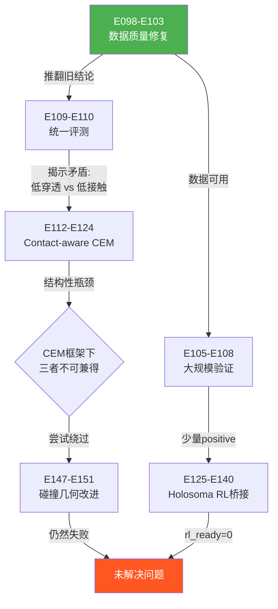
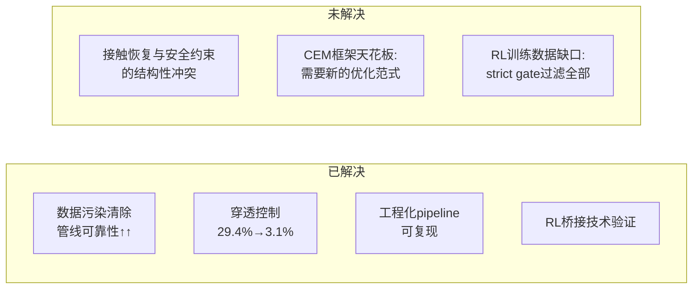

# SPIDER动力学重定向 E098-E152 阶段报告

> CORE4D人机协作重定向项目 | 2024年阶段性总结 | 精简版

---

## 🔧 数据质量修复（E098-E103）—— 最高价值单项贡献

**动机**：E082-E094阶段Box021/Box026持续失败，怀疑算法缺陷，但未排查数据本身。

**方法**：系统审计预处理管线，逐层验证数据完整性。

**结论**：
- E098修复5个预处理bug（坐标系、插值、时间对齐等），新增replay gate确保输入物理一致
- E099发现raw fingertip信息流缺失，27%的手面朝向不一致，导致接触引导方向错误
- E103发现**87/198个scene存在robot inertial污染**（mass=29.632kg错误值），重建6个canonical templates彻底修复

**影响**：旧E082-E094全部失败结论被推翻，不能作为"SPIDER算法在协作场景失败"的证据。

---

## 📊 统一评测揭示核心矛盾（E109-E110）

**动机**：数据修复后需公平对比SPIDER与OmniRetarget基线。

**方法**：24个case统一评测，同时计算deep penetration率和physics contact率。

**结论**：

| 指标 | OmniRetarget | SPIDER |
|------|:---:|:---:|
| Deep Penetration | 29.4% | **3.1%** |
| Physics Contact | **54.4%** | 43.1% |

- 18/24 case呈现"penetration_removed_contact_not_recovered"模式
- **本质**：CEM安全堆栈将OmniRetarget的压入式穿模修正为浅接近，但缺少contact维持目标，导致接触一并丢失

---

## ⚠️ Contact-aware CEM的正-负结果（E112-E124）

**动机**：尝试在CEM框架内恢复接触，同时保持低穿透。

**方法**：hold_band reward、adaptive margin、contact switching、multi-phase schedule等10+变体。

**结论**：
- E112验证hold_band**可恢复接触**（box004: 10%→55%，box021: 8.5%→77.5%）
- 但所有后续实验均为**负结果**：手接触提升必然伴随腿干涉增加或姿态不稳定

> CEM框架下 **接触↑ ↔ 穿透↑ ↔ 稳定性↓** 三者不可兼得，是结构性瓶颈而非调参问题。

---

## 🤖 碰撞几何改进尝试（E147-E151）

**动机**：默认5cm球形碰撞几何与真实手形差异大，可能是接触失真根源。

**方法**：rubber hand mesh替换、eef_offset前移、surface contact reward。

**结论**：
- Rubber mesh降低穿透（-0.03）但physics contact也下降（-0.02）
- eef_offset前移和surface reward均失败
- **接触提升总是伴随穿透提升**，无法获得clean contact-quality win

---

## ✅ 大规模验证中的少量Positive（E105-E108）

**动机**：数据修复后重新跑全量验证，确认管线可用性。

**方法**：Box026 28case + Box021 4case全量CEM + RL strict gate。

**结论**：
- Box026: 4/28 RL strict positive
- Box021: 1/4 strict positive
- bucket004: 首个非box物体完成RL smoke test
- 数据管线v3工程化完成（6阶段pipeline + release audit + reproducibility）

---

## 🔗 Holosoma RL桥接（E125-E140）

**动机**：将CEM输出接入RL训练环境，实现sim2real闭环。

**方法**：semantic contact从raw→export→converter→env runtime全链路打通。

**结论**：技术链路验证完成，但rl_ready_rows=0——源CEM outputs未满足strict gate，RL训练尚无合格数据输入。

---

## 逻辑总览

## 价值与未解决问题

---

**核心takeaway**：本阶段最大贡献是数据质量修复（使实验结论可信）和问题定位（CEM框架的结构性瓶颈）。下一步需突破CEM框架限制——或放松strict gate让RL端获得训练数据并在RL阶段学习接触恢复，或引入新的优化范式（如RL-based retargeting）替代sampling-based CEM。
