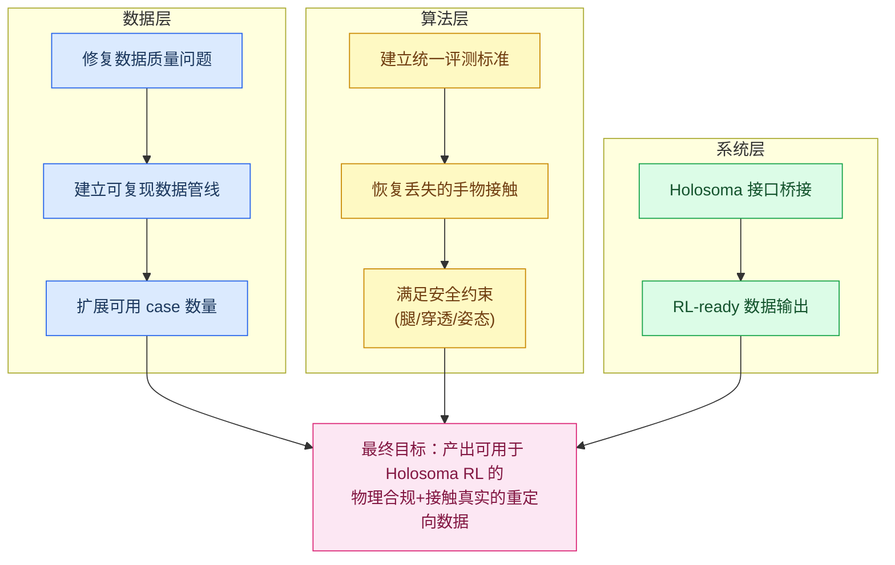
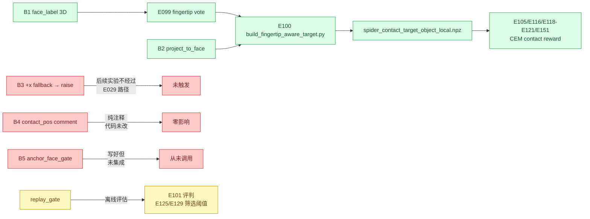
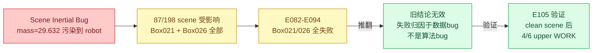
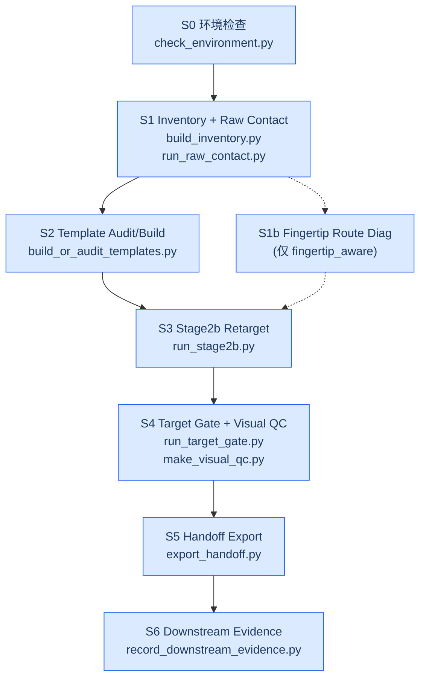
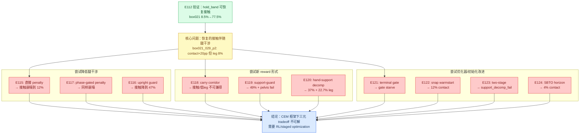
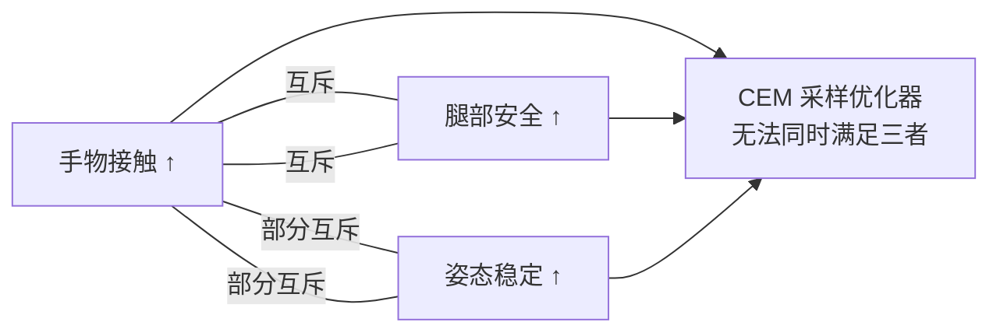

# E098-E152 实验进展详细报告：基于SPIDER的人机协作动力学重定向

## 📋 摘要

本报告覆盖 2026年5月30日至6月10日期间的 E098-E152 共55个实验，围绕"如何让SPIDER动力学重定向在CORE4D人-人-物协作场景下产生物理合规且接触真实的机器人运动"这一核心问题展开。

**核心贡献**：
1. 发现并修复了严重的数据质量问题（scene inertial 污染），推翻了此前所有 Box021/Box026 的失败归因
2. 建立了工程化的 v3 数据构建管线（6阶段、双轴分叉、完整 audit）
3. 通过统一评测揭示了 Spider 的核心矛盾：去穿透成功但接触未恢复
4. 系统性探索了接触恢复策略，确立了 CEM 框架下"手接触-腿干涉-姿态稳定"三元 tradeoff
5. 完成了 Holosoma RL 桥接的全链路技术验证

**关键数据**：RL strict positive 累计 6 条（Box026 4 + Box021 1 + bucket004 1），接触恢复在 CEM 框架下未达到超越 OmniRetarget 的目标。

---

## 🔬 研究问题与目标

### 出发点

E098 之前（E001-E097）已经完成的工作：
- SPIDER 在 CORE4D 单人场景验证可行（box023/box004 部分成功）
- 双机器人 connect 方案被证伪（E016-E031）
- body tracking 和 contact 是 tradeoff（E035-E052）
- HDMI-style contact reward 首次生效（E039b-E041c）
- box021 系列全部失败（E082-E088），原因未明

### E098-E152 的核心目标

---

## 🔧 数据基础修复 (E098-E103)

### 动机

E082-E088 期间 Box021 全部失败，原因不明。E098 的出发点是系统性审计预处理管线，排查是否存在"不是算法问题而是数据问题"的可能性。

### E098：诊断基础设施（5 bug + 1 gate）

**假设**：Box021 D003 系列失败可能源于预处理中的隐性 bug，而非 CEM 算法本身。

**发现的 5 个 bug**：

| Bug | 问题 | 影响 |
|-----|------|------|
| B1 | `face_label` 只用 xy argmax，忽略 ±z | 4/6 case 至少 1 hand 翻面 |
| B2 | `_project_to_face` 不通用 | 历史遗留硬编码 |
| B3 | silent `+x` fallback | 错误被静默掩盖 |
| B4 | `contact_pos` 是 IK wrist 不是 raw mocap | contact target 偏差~27cm |
| B5 | `anchor_face_gate` 未强制执行 | 缺少安全检查 |

**新增 replay gate**：pelvis_end_z < 0.55 / pelvis_tilt_end > 75° / lie_on_box_frac > 0.30 三信号组合，back-test 12 case 召回率 100%（4 WORK + 8 FAIL 全部正确分类）。

**结论**：预处理管线确实存在多个影响实验结论的 bug。

### E098 修复在后续实验中的实际传播

并非所有 E098 修复都改变了后续 CEM 的物理仿真行为。追踪实际代码引用后，分类如下：

| 修复 | 类型 | 是否改变 CEM 运行时行为 | 传播路径 |
|------|------|------------------------|----------|
| **B1** face_label 3D | 核心算法修复 | **是** ✓ | →E099 vote→E100 target NPZ→E105-E151 CEM |
| **B2** project_to_face | 核心算法修复 | **是** ✓ | →E100 重实现正确逻辑→同上 |
| **B3** +x fallback→raise | 防御性修复 | **否** | 后续实验不经过 E029 代码路径 |
| **B4** contact_pos comment | 纯注释标注 | **否** | 代码行为零改动；承诺的 `contact_pos_fk` 从未实现 |
| **B5** anchor_face_gate | 安全 gate 库 | **否** | 文档声称"全 route 必选"，但从未被后续管线调用 |
| **replay_gate** | 离线诊断工具 | **间接** | 定义阈值 pelvis≥0.55m，被 E125/E129 内化为筛选标准 |

**关键结论**：
- **真正改变物理仿真结果的只有 B1+B2**，它们通过 E100 生成的 contact target NPZ 间接传播到后续十余个 CEM 实验
- **B4 是"标注了问题但未修代码"** — 后续靠 E099/E100 的 fingertip vote 绕开了 `contact_pos` 的数据质量问题（等价于用新方案替代了修复）
- **B5 存在文档与代码脱节** — 已写好的安全检查从未被 pipeline 集成
- **replay_gate 的影响是间接的** — 不在 CEM 在线循环中，但其阈值成为后续评判的事实标准

### E099：Raw fingertip 信息流补全

**假设**：OmniRetarget IK 使用 wrist 关节而非 fingertip，可能导致接触面错位。

**方法**：直接读 CORE4D raw SMPL-X fingertip（L 27/30/33/36/39, R 42/45/48/51/54）做 face vote。

**关键发现**：
- **9/33 hand palm vote ≠ fingertip vote**（27% 不匹配），8/9 在右手
- **全部 17 case disable_world_up=True**（mean deviation 84°-178°），整个 CORE4D box family 都不能用 world-up 投影
- 2 个 case palm 说 contact 但 fingertip 说 no_contact → IK 过拟合直接证据

**结论**：E099 是 E100 target 重做的理论依据——fingertip vote 比 palm vote 更准确地反映真实接触面。

### E100-E101：Fingertip-aware target + 验证

**E100**：基于 E099 fingertip vote 重做 contact target，7/16 case target 位移 1.5-5cm。

**E101**：验证新 target 效果：
- box004 guard 2/2 PASS（不破坏已有 positive）
- box021 D003 0/4 PASS（不足以救回失败 case）
- **触发 stop-loss**：fingertip target 修复是必要的但非充分的

### E103：**最重要的单项发现** — Scene Inertial 污染

**假设**：Box021 失败的根因可能不在 reward/target/contact，而在 scene 物理属性本身。

**发现**：
- 198 个现有 scene 中 **87 个存在 robot inertial 污染**
- 具体表现：robot link 的 mass 全部被设为 29.632kg（Box021 物体的质量），应为各自真实质量
- 污染集中在 `box021`、`d003_box021`、`box026`、`e091_box026` 派生目录
- `box023_person1`、`box004_person1/2` 当前正常

**修复**：
- 从 clean `box023_person1` base 重建 6 个 canonical source templates
- 旧污染 dynamics 结论全部降级为 `quarantine_invalidated`
- **E082-E094 期间所有 Box021/Box026 失败不能再作为算法失败证据**

**创新点**：
- 建立了完整的 scene 质量 audit 框架（inertial + geometry + collision）
- 引入了"validity reset"机制——不删旧数据，而是标记其结论不可信
- 证明了"看似算法失败实为数据污染"的可能性，对同类项目有警示意义

---

## ⚙️ 数据管线工程化 (Data Construction v3)

### 动机

E098-E103 暴露了一个系统性问题：整个数据构建流程缺乏规范化管理。旧管线存在路径硬编码、阈值不可追溯、中间产物散落各处、无法复现等问题。

### 架构设计

### 关键设计决策

| 决策 | 内容 | 理由 |
|------|------|------|
| 双轴分叉 | retarget_variant × target_variant | 支持 ref_fk / adaptive / fingertip_aware 独立演进 |
| 机器 gate vs 人工 review | 机器检查为硬 gate，visual QC 为 release checklist | 避免漏网，同时保留人类判断 |
| 下游不污染上游 | S6 CEM/RL 失败不改变 S1-S5 数据判定 | 数据质量和算法效果是正交的 |
| Legacy 隔离 | 旧目录不删不改，新流程不读旧目录 | 保留历史可追溯，避免破坏旧环境 |

### 验证体系

- `run_release_checks.sh`：新机器统一入口（py_compile + release audit + optional smoke）
- `verify_reproducibility.py`：run 级可复现性自检（config hash + registry evidence + manifest schema）
- `run_smoke_suite.py`：compact smoke 覆盖所有关键路径
- 最终 release audit：65/65 checks pass

### 结论

v3 管线是这个阶段最重要的工程贡献，使后续的大规模实验（E104-E108）成为可能。管线设计的"显式状态管理 + 不可变证据链"思路可复用于其他数据驱动的机器人学习项目。

---

## 📊 大规模 CEM 验证与数据扩展 (E104-E108)

### E104：多阈值原始接触重挖掘

**动机**：E103 修复后，大量 case 的 raw contact 状态为 `not_run`，需要重新评估。

**方法**：对 box004/box022/box026 共 80 case-person 全量跑 D002 raw-contact proxy，同时输出 3cm/5cm 两套阈值。

**结果**：
- 3cm：46 pass / 5 review / 29 fail
- 5cm：48 pass / 5 review / 27 fail
- 移除 Box026 volume-ratio hard holdout 后：3cm 得到 39 executable（box004=11, box026=30）

**结论**：数据池从"几乎无候选"扩展到"39+ 可执行"，为后续 E105-E106 提供了充足的输入。

### E105：Box026 Clean Scene Rerun

**动机**：验证 E103 修复后，旧 Box026 失败 case 是否能变成 WORK。

**关键结果**：

| Variant | Contact | Pelvis | Leg Interference | Upper WORK | Lower Strict |
|---------|---------|--------|-----------------|------------|-------------|
| R1 ref-fk 039_p2 | 76.4% | 0.704m | 25.2% | ✓ | ✗ |
| R2 ref-fk 135_p2 | 62.2% | 0.655m | 15.9% | ✓ | ✗ |
| A1 adaptive 039_p2 | 78.0% | 0.703m | 60.2% | ✓ | ✗ |
| F1 fingertip 039_p2 | 82.1% | 0.709m | 27.6% | ✓ | ✗ |

**结论**：
- 旧 Box026 全失败确实是数据 bug 导致，clean scene 后 4/6 upper-body WORK
- 但 0/6 通过 lower-body strict（leg interference 9.8%-60.2%）
- E105 验证了 E103 修复的有效性，但也确立了"腿干涉"为新的核心瓶颈

### E106：Box026 30-Candidate Batch

**动机**：大规模验证 Box026 在 clean scene 下的整体表现。

**方法**：固定 ref_fk_clean 单路线，28 条可运行 case（2 条 OmniRetarget infeasible），本地+远程 3 卡并行。

**结果**：
- Upper-body WORK：15/28（53.6%）
- Lower-body strict pass：7/28（25%）
- **RL strict positive：4/28（14.3%）** — E106B05、B15、B22、B27

**结论**：大规模验证表明，Box026 有~14% 的 case 可以满足最严格的 RL 标准。这是一个重要的正面信号。

### E107-E108：Box021 + 非 box 扩展

**E107**：Box021 13 条 rebuilt target → 4 条 selected CEM → 1 条 strict positive（`035_p1`）

**E108**：bucket004（非 box 物体）首次完成从 raw contact → template → Stage2b → CEM → RL smoke 的完整流程：
- 1 条 `DOWNSTREAM_RL_PASS`（012_p1，Holosoma 2 iterations/64 envs）
- 1 条 `DOWNSTREAM_CEM_PASS`（022_p1）

**创新点**：建立了从数据挖掘到 RL smoke 的端到端自动化流程，适用于任意新物体类型。

---

## 📏 统一评测体系建立 (E109-E110)

### E109：Spider vs OmniRetarget 统一 Replay 评测

**动机**：此前 Spider 评测指标的 GT 来自 OmniRetarget reference，存在"自己评自己"的问题。需要建立同口径、同 case 的公平对比。

**方法**：对 24-case work set 中的 OmniRetarget 和 Spider CEM qpos 分别做 MuJoCo replay，重算统一指标（pelvis/fall、EEF 多阈值、hand geom near/penetration、physics contact）。

**关键贡献**：
- 确认旧 `contact_frac_either` 实际是 `max(L,R)` 而非 union
- Spider CEM 特有的 `obj_err` 不给 OmniRetarget 硬填
- 建立了可复用的评测框架（`scripts/eval_omni_vs_spider/`）

### E110：Contact Band Diagnostic

**核心发现**：

| 指标 | OmniRetarget | Spider ref_fk | 方向 |
|------|-------------|--------------|------|
| Deep penetration (2cm) | 29.4% | 3.1% | ✓ 大幅改善 |
| Physics contact | 54.4% | 43.1% | ✗ 下降 |
| Hand geom 12cm | 67.1% | 65.7% | ≈ 持平 |
| Far > 5cm | 35.4% | 38.2% | ✗ 略升 |

**24 case 分类**：
- 18 个：`penetration_removed_contact_not_recovered`（去穿透但接触未恢复）
- 2 个：`safe_gap_near_contact`
- 8 个：`safety_regression_flag=true`（二级安全回归）

**结论**：Spider 的安全堆栈成功消除了 OmniRetarget 的压入式穿模接触，但没有用真实物理接触来替代。核心问题变为"如何在保持安全性的同时恢复接触"。

---

## 🤝 接触恢复策略探索 (E111-E124)

### E111-E112：Contact-Aware CEM 验证

**假设**：如果给 CEM 提供 raw contact mask/hold-band 作为额外 reward，可以恢复丢失的接触。

**E112 验证结果**（最正面的结果）：

| Case | Baseline | raw_mask | hold_band |
|------|----------|----------|-----------|
| box004 | 10.1% | 54.1% | 55.0% |
| box021 | 8.5% | 77.5% | 77.5% |
| box026 | 8.5% | 17.1% | 26.8% |

**结论**：contact-aware CEM **原理上可行**（box004/box021 接触恢复 5-8 倍），但 box026 效果有限。默认推进 `hold_band` 方案。

### E113-E114：扩展验证与 RL Gate

**E113**（6 case 扩展）：0 release candidates。`box021_029_p2` 是最强诊断 — physics contact +20pp 且 deep penetration 不增，但 lower-body interference 8.0%，不允许进 RL。

**E114**（RL handoff gate）：0 rl_ready_rows，全部 blocked。队列分为：
- `strict_contact_margin=3`
- `lowerbody_repair=2`
- `lowerbody_aware_contact=1`

### E115-E124：系统性诊断（全负结果）

这是 E098-E152 期间最大的实验群组，10 个诊断实验系统性地验证了各种策略：

| 实验 | 策略 | 结果 | 失败原因 |
|------|------|------|---------|
| E115 | naive leg_object_penalty | ✗ | 接触 65%→12%，penalty 太强 |
| E116 | surface target + upright guard | ✗ | 接触 65%→47%，deep pen +4pp |
| E117 | phase/state-gated penalty | ✗ | 接触 12%，penalty 无法精准化 |
| E118 | carry-corridor soft reward | ✗ | lower-body 0% 时接触仅 9.3% |
| E119 | upright carry support-guard | ✗ | 主 case 49% contact + pelvis fail |
| E120 | hand-support decomposition | ✗ | 主 case 37% contact + 22.7% leg |
| E121 | terminal carry gate | ✗ | hard gate starve，valid 0% |
| E122 | snap warmstart | ✗ | 主 case 12% contact |
| E123 | two-stage curriculum | ✗ | Stage2 support_decomp_fail |
| E124 | SBTO carry-horizon | ✗ | 主 case 4% contact |

### 核心结论

CEM（Cross-Entropy Method）作为一种采样优化器，在每个时间步独立选择最优 action。它无法：
1. 维持跨时间步的接触状态（contact 是瞬时 reward 无法转为持续约束）
2. 在高维约束空间（接触+安全+姿态）中找到可行解（约束越多，可行样本越稀疏）
3. 学习"先站稳再接触"的时序策略（缺乏 curriculum/staged 能力）

**这是一个结构性限制，不是参数调优问题。**

---

## 🔗 Holosoma RL 桥接 (E125-E140)

### 动机

既然 CEM 无法同时满足所有约束，需要把部分 positive CEM 输出传给 Holosoma RL 训练。E125-E140 的目标是验证这条链路的技术可行性。

### 链路验证进程

| 实验 | 验证环节 | 结果 |
|------|---------|------|
| E125 | RL hand-support preflight | 0 rl_ready，main BLOCK |
| E126 | Fragment adapter export | 2 paired exports，结构正确 |
| E127 | Training contract check | 2/2 structural pass |
| E128 | IsaacSim runtime startup | 2/2 startup pass |
| E129 | Main carry-state audit | 0 strict gate row |
| E130 | Reward-side inspection | object_contact 缺失 |
| E131 | object_contact proxy | 2/2 proxy exports |
| E132 | MotionLoader probe | E131 has_object_contact=true |
| E133 | Env ref_object_contact | ref_contact_total=74 |
| E134 | Semantic bridge audit | v3_semantic_ready=0 |
| E135 | v3 S1 raw-contact remine | 4/4 pass |
| E136 | Bridge audit (E107) | 16 candidates |
| E137 | Semantic export | 8 NPZ |
| E138 | Converter preflight | 4/4 convert+inject pass |
| E139 | Partner env probe | 4/4 ref_contact positive |
| E140 | Reward readiness audit | needs ref-mask config |

### 结论

Holosoma RL 桥接的全链路技术上已打通：
- semantic contact mask 可以从 raw data → export → convert → runtime
- MotionLoader 可以正确加载 object_contact
- IsaacSim env 可以读到 ref_object_contact

但 **rl_ready_rows 始终 = 0**，因为源 CEM outputs 未满足 strict gate。技术链路 ready，但缺数据来喂。

---

## 🧱 碰撞几何改进 (E142-E151)

### 动机

E110 揭示 Spider 接触下降的一个可能原因：SPIDER 使用 5cm sphere 作为手碰撞几何，与实际 rubber hand mesh 形状差异大（E146 可视化确认）。如果用更贴合的 rubber mesh，是否能改善接触？

### E142-E143：OmniRetarget Contact Exceedance

**E142 审计**：0/12 candidate 超过 OmniRetarget physics contact。contact-aware 提升了 Spider 内部比较，但绝对值仍低于 OmniRetarget。

**E143 24-case sweep**（raw_mask_ref_fk）：
- OmniRetarget：54.4%
- ref_fk：43.1%
- raw_mask_ref_fk：33.0%（更低！）

**关键洞察**：E143 raw_mask 反而更低，是因为 raw mask 在 contact window 外强制 zero gain，导致 CEM 在非接触段更消极。这不是 raw mask 的方向错误，而是 gain schedule 需要调整。

### E147：Rubber Hand Collision Variant

**假设**：用 rubber mesh 替代 5cm sphere 可以减少穿透同时保持接触。

**方法**：10 case A/B 对比，sphere 复用旧 NPZ，rubber_hull 重跑 full CEM。

**结果**：
- Hand penetration：显著降低 ✓
- Deep penetration：显著降低 ✓
- Physics contact：下降 ✗
- Historical fail 被救回：0 个

### E148-E149：大样本验证

**E148（24-case）**：rubber-sphere 差异为 5cm +0.009，手物穿透 -0.034，手物物理接触 -0.020。

**E149（clean 6/8 benchmark）**：clean6 rubber-sphere 手物穿透 -0.229（显著），但物理接触 -0.198。

**解读**：rubber mesh 的物理效果是"让碰撞发生在正确位置（mesh 表面而非 sphere 远端）"，但由于 mesh 几何更精确，很多原来 sphere 误判的"接触"不再成立。

### E150-E151：锚点与 Reward 改进（Route A/B）

**E150（Route A：eef_offset 前移）**：
- off08 vs off05：5cm +0.002，手物穿透 +0.007（微小差异）
- off11 vs off05：5cm +0.001，手物穿透 +0.035（穿透升高）
- **结论**：单点锚点前移无效

**E151（Route B：hand surface contact reward）**：
- B2-sup：5cm +0.096，hand_pen +0.177
- B2-tip：5cm +0.099，hand_pen +0.269
- B1-mesh：5cm +0.079，hand_pen +0.207
- **结论**：接触提升总伴随穿透提升，不是 clean win

### 碰撞几何改进总结

| 方案 | Near Contact Δ | Penetration Δ | 判定 |
|------|---------------|---------------|------|
| Rubber mesh | +0.009 | -0.034 | 保留为 variant |
| eef_offset 0.08 | +0.002 | +0.007 | 不成立 |
| eef_offset 0.11 | +0.001 | +0.035 | 不成立 |
| B2-sup reward | +0.096 | +0.177 | 不成立 |
| B1-mesh reward | +0.079 | +0.207 | 不成立 |

**结论**：碰撞几何改进方向的核心困境 — 现有 CEM 框架下，要增加近场接触就不可避免地增加穿透。这与 E115-E124 的"接触-安全 tradeoff"本质相同，只是表现形式不同。

---

## 🎯 总结与关键发现

### 已解决的问题

1. **数据质量**：inertial 污染发现并修复，旧错误结论被正确推翻
2. **数据管线**：v3 pipeline 工程化，支持大规模可复现实验
3. **评测体系**：统一 replay 框架，消除自评估偏差
4. **技术链路**：Holosoma RL 桥接全链路技术 ready
5. **正样本积累**：6 条 RL strict positive（虽少但真实）

### 未解决的核心问题

**CEM 框架下的三元 tradeoff**：

### 创新点总结

| 创新点 | 类型 | 贡献 |
|--------|------|------|
| Scene inertial audit + validity reset | 方法论 | 发现隐性数据 bug 的系统方法 |
| Dual-axis pipeline (retarget × target variant) | 工程 | 可复现数据管线设计模式 |
| Unified replay evaluation | 方法论 | 消除方法间自评估偏差 |
| Contact-safety tradeoff characterization | 理论 | 明确了 CEM 的结构性限制 |
| End-to-end nonbox data flow | 工程 | raw → CEM → RL 自动化 |

---

## 🔮 未解决问题与后续方向

### 方向 1：RL-based Contact Recovery

CEM 的结构性限制表明，接触恢复需要能学习时序策略的方法：
- 在 Holosoma 端直接做 contact-conditioned RL
- 用现有 6 条 positive 作为 curriculum 起点
- ref-mask reward 已在 E139-E140 验证可用

### 方向 2：Staged/Hierarchical Optimization

分阶段优化可能打破三元 tradeoff：
- Stage 1：先保证姿态和安全（已有 15/28 upper WORK）
- Stage 2：在安全轨迹基础上 fine-tune 接触（需要新方法）

### 方向 3：Other-Side Force Augmentation

在 SPIDER 仿真中加入协作伙伴的力：
- 物理上合理（两人协作本质上是力耦合）
- 但有 hard blockers（需要 servo 机制控制物体跟踪）

### 方向 4：碰撞几何与 Reward 的联合设计

E147-E151 表明单独改几何或 reward 不够：
- Rubber mesh 几何 + contact-aware reward 联合
- 但需解决"近场接触 ≠ 穿透"的区分问题

---

*报告撰写日期：2026-06-10*
*覆盖实验范围：E098-E152*
*实验总数：55 个*
*RL Strict Positive：6 条*
