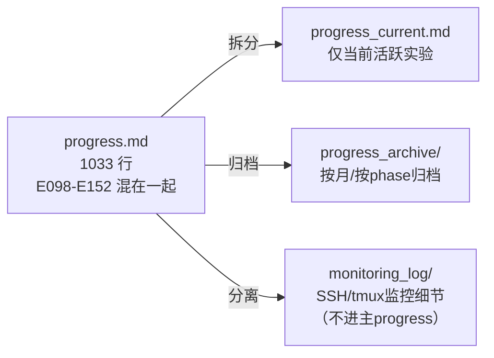
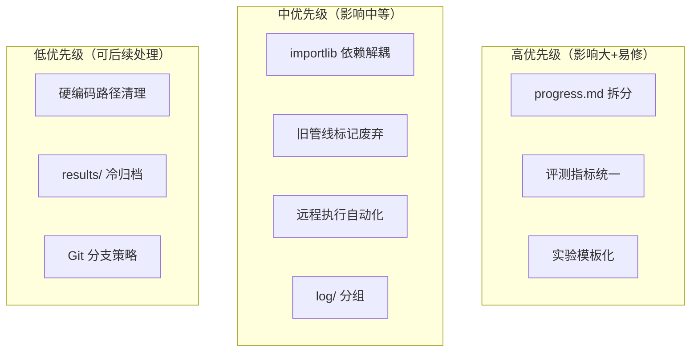

# E098-E152 工作区/代码/管线问题分析与优化建议

## 📋 概述

本文档基于对 `workspace/core4d/` 的系统分析，识别出潜在 bug、效率瓶颈和可优化点。按严重程度分为 HIGH/MEDIUM/LOW。

---

## 🐛 代码/数据潜在问题

### HIGH: 评测指标口径漂移

**问题**：不同实验的 evaluator 使用不同的 `SUMMARY_METRICS` 集合。例如：
- E150 evaluator 使用 11 个核心指标
- E151 evaluator 使用 19+ 指标
- E147/E148 evaluator 有独立的 mesh-aware 指标

**风险**：跨实验比较时，如果直接对比 summary 文件，可能遗漏部分指标不一致。

**建议**：
1. 建立一个 `core_metrics.py` 定义所有公共指标的计算口径
2. 每个 evaluator import 公共指标后可增加实验专属指标
3. summary 文件中标注使用的指标版本

### HIGH: importlib 链式依赖

**问题**：E148/E150/E151 的 evaluator 都动态 import E147 的评测函数。如果修改 E147 evaluator，会静默影响后续实验的评测结果。

**建议**：
- 将共用的评测逻辑提取到 `scripts/eval/lib/` 公共模块
- evaluator 引用公共模块而非其他实验的脚本
- 冻结后的实验 eval 脚本不再修改

### MEDIUM: 硬编码路径残留

**问题**：部分脚本仍硬编码 `/mnt/a0ccc676-9496-49f8-a861-f8a1797dec52/` 路径（旧数据盘）。

**影响**：换机器后这些脚本会静默失败。

**建议**：统一使用环境变量 `CORE4D_RAW_ROOT`，v3 pipeline 已做到但旧脚本未迁移。

### LOW: contact_pos deprecation 未清理

**问题**：E098 已标注 `spider/process_datasets/core4d.py:128` 的 `contact_pos` 为 deprecated（是 IK wrist 不是 raw mocap），但代码未移除。

**建议**：加 `warnings.warn()` 并在 v3 pipeline 中显式禁用。

---

## 📁 工作区框架问题

### HIGH: progress.md 过长（1033行）

**问题**：
- 每次 SSH 监控轮询都记录一行（如 E150 有 14 条 "remote full 进度 X/16"）
- 单个 progress.md 已难以导航
- 最新信息在文件开头（倒序），但未分文件

**建议**：



### MEDIUM: 实验脚本目录重复度高

**问题**：`scripts/` 下有 75+ 实验目录（E098-E151），每个目录含 5-7 个结构近似的文件：
- `build_*_manifest.py`
- `scripts/train/train_E***.sh`
- `scripts/run_E***_remote.sh`
- `scripts/pull_E***_remote_results.sh`
- `scripts/eval/eval_E***.py`
- `scripts/eval/eval_E***.sh`

估计 ~80% 是模板代码。

**建议**：
1. 创建通用模板 `scripts/templates/{manifest,train,remote,pull,eval}.template`
2. 每个实验只需一个 `E***_config.yaml` 差异文件
3. 通过 `scripts/gen_experiment.py E151 --config E151_config.yaml` 生成

### MEDIUM: EXPERIMENT_TRACKER.md 信息量过载

**问题**：tracker 每行描述字段达 500-1000 字符（包含方法细节、artifacts 路径、数值结果），表格已不可读。

**建议**：
- tracker 只保留：Run / 日期 / 一句话描述 / 状态符号 / log 链接
- 详细内容统一在 `log/` 文件中
- tracker 是索引而非内容

---

## 🔄 数据管线问题

### MEDIUM: 新旧管线共存混淆

**问题**：
- `workspace/core4d/data_preprocess/` — 旧 Stage2b 入口（功能性死代码但仍 tracked）
- `workspace/core4d/scripts/data_construction_v3/` — v3 新管线
- `workspace/core4d/data_construction_v3/` — v3 产物（existing_cases.tsv）

三个与 "data construction" 相关的目录容易混淆。

**建议**：
- `data_preprocess/` 顶部加 `DEPRECATED.md` 明确声明已废弃
- 或将其移到 `archive/data_preprocess_legacy/`

### MEDIUM: 远程执行无自动化回收

**问题**：当前远程执行流程为：
1. 手动 `run_E***_remote.sh` 启动
2. 周期性 SSH 检查 tmux 是否结束
3. 手动 `pull_E***_remote_results.sh` 回收
4. 手动跑 eval

E106 虽有 `wait_pull_eval_E106.sh`，但这是一次性脚本，不是通用机制。

**建议**：建立通用 `scripts/infra/watch_and_pull.sh --experiment E151 --remote spider-remote`

### LOW: results/ 无清理策略

**问题**：`results/` 约 17GB+，从 E020 到 E151 的所有产物都保留。早期实验（E020-E040）的结果已无参考价值（碰撞盒 bug 时代）。

**建议**：
- 对已废弃实验的大文件（NPZ/MP4）做 cold archive
- 保留评测 summary 和 log
- 在 results/ 下加 `RETENTION_POLICY.md`

---

## 📂 文件管理问题

### HIGH: log/ 目录 191 个文件无结构

**问题**：`log/` 下有 `001_E001_*.md` 到 `191_E151_*.md`，191 个扁平文件。寻找特定实验的日志需要 grep。

**建议**：按阶段分组：
```
log/
├── phase_18_box021_failures/ (E082-E088)
├── phase_20_data_mining/ (E089-E097)
├── phase_21_diagnostic_v2/ (E098-E108)
├── phase_24_contact_recovery/ (E109-E151)
└── INDEX.md (自动生成索引)
```

### MEDIUM: plan/ 目录编号与实验编号不对应

**问题**：`plan/159_E151_*.md` 中 `159` 是 plan 序号不是实验号。plan 号/log 号/实验号三套编号互不对应。

**建议**：
- plan 文件直接用实验号命名：`plan/E151_route_b_hand_surface_contact_reward_plan.md`
- 或在文件头 frontmatter 中明确映射

---

## 🌿 Git 管理问题

### MEDIUM: 单分支开发

**问题**：所有工作在 `exp/core4d-collab-retarget` 单分支进行，commit message 格式为 `exp(core4d): E152`。无 feature branch，无 PR review。

**影响**：
- 难以回滚单个实验的代码变更
- 核心 spider 代码修改与实验配置混在同一分支

**建议**：
- 核心代码修改（如 `spider/simulators/mjwp.py`）走 PR 到 main
- 实验配置/脚本保持在实验分支
- 至少对 critical fix（如 E103 inertial 修复）做正式 PR

### LOW: .gitignore 覆盖度

当前 `.gitignore` 已覆盖 `results/`、`__pycache__/`、run roots。可改进点：
- 添加 `*.npz` 和 `*.mp4` 的 global ignore（除非 force-add）
- 添加 `.vscode/` ignore

---

## 🚀 效率优化建议

### 建议 1: 实验模板生成器

```bash
# 一键生成实验骨架
python scripts/gen_experiment.py E153 \
  --type cem_sweep \
  --cases "box021_029_p2,box021_035_p1" \
  --variants "baseline,new_method" \
  --remote-split 3
```

自动生成：manifest builder、train script、remote/pull/eval、override YAMLs。

### 建议 2: 统一监控看板

替代 progress.md 中的 SSH 轮询记录：
- tmux hook 在 CEM 完成时写 `results/E***/completion_signal`
- 统一 watcher 脚本每 5min 汇总所有活跃实验状态
- 状态写入 `status_dashboard.md`（自动刷新）

### 建议 3: 评测结果自动索引

每次 eval 完成后，自动将 summary 追加到 `results/EVAL_INDEX.tsv`：
```
experiment  case  variant  contact  penetration  leg_interference  status  date
E151       box021  B2-sup   0.096    0.177        -                ❌      2026-06-10
```

便于快速查询历史结果而无需打开单个 eval summary。

### 建议 4: 减少认知负荷

| 当前痛点 | 优化方案 |
|----------|---------|
| 切换实验需读长 progress | 加 `scripts/resume_context.sh E151` 打印当前状态 |
| 远程结果需手动确认 | `pull_and_verify.sh` 统一入口 |
| 新实验启动 5-7 文件 | 模板生成器 |
| 评测口径不确定 | 公共 `core_metrics.py` |

---

## 📊 总结



| 类别 | HIGH | MEDIUM | LOW |
|------|------|--------|-----|
| 代码/数据 | 2 | 1 | 1 |
| 工作区框架 | 1 | 2 | 0 |
| 数据管线 | 0 | 2 | 1 |
| 文件管理 | 1 | 1 | 0 |
| Git 管理 | 0 | 1 | 1 |

**最高 ROI 的三项优化**：
1. ✅ 拆分 progress.md（即时改善日常效率）
2. ✅ 建立实验模板生成器（减少每次新实验 2-3 小时重复工作）
3. ✅ 统一评测指标模块（确保跨实验对比可信）

---

*分析日期：2026-06-10*
