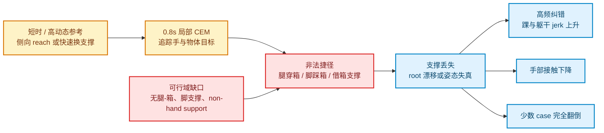

# E168 Box021 CEM 失败机制分析

日期：2026-07-17  
范围：E168 Box021 已完成人工审查的 28 条 CEM 轨迹  
人工口径：`USE=13`，`DO_NOT_USE=15`

## 摘要

Box021 当前人工失败率为 **15/28（53.6%）**。这些失败不是由一个阈值过严造成的假象：视频中存在站上箱体、腿穿过箱体、借箱体支撑、双脚交叉失稳、根姿态大幅漂移以及末段翻倒等明显错误。

核心结论是：

1. **主失败不是手部穿透，而是下肢/支撑可行域缺失。** 15 条失败中，14 条的离线指标包含 lower-body failure；逐视频重标后，14/15 至少出现下肢/箱体非法接触或非法支撑症状，9/15 以此为首要失败类型。
2. **高动态短序列是主要触发器。** 失败组中位时长 `2.93s`，可用组为 `3.67s`；失败组物体最大速度中位数 `2.05m/s`，可用组为 `1.36m/s`。`20231018` 批次可用结果为 `0/12`，说明存在显著 motion-cohort shift。
3. **但“CEM 搜索不够”不是充分解释。** 9/15 失败 case 的 gate fallback 均值不高于 `0.10`；`033_p1`、`033_p2` 等明显站箱 case 的 fallback 接近 0。优化器不是找不到合法解，而是把任务上明显非法的动作判成了合法解。
4. **最优先的算法改动应是硬可行性，而非先加 smooth 或增加算力。** 先加入下肢/箱体碰撞与 non-hand support hard gate，再加入 stance-foot/root 支撑约束；最后叠加时序平滑和困难参考处理。

一句话概括当前主因：**E167A z-only 能约束竖直方向不塌，但不能阻止脚横向交叉、踩箱、腿穿箱、躯干借箱支撑；现有 hand/object objective 会利用这个漏洞。**

## 1. 数据与方法

本报告使用四类证据：

- 人工结论：用户逐条视频核验后的 `13 USE / 15 DO_NOT_USE`，作为最终质量真值。
- E167A 对齐指标：tracking、body-z、contact、penetration、lower-body、motion health。
- CEM 根 NPZ：逐时刻、逐 CEM iteration 的 gate valid fraction、fallback 和 violation。
- 视频：15 条失败轨迹的 12 帧 timeline，以及 5 条代表 case 的 ref/sim 对照 timeline。

指标表中的 `failure AUC` 是一个排序统计量：随机抽一条失败和一条可用轨迹，该指标把失败排得更差的概率。`0.5` 约等于无区分力，越接近 `1.0` 越能区分本批人工失败。它用于识别模式，不在这 28 条样本上直接拟合新的生产阈值。

完整可复现资产见[分析脚本](../../scripts/experiments/E168/analyze_box021_failures.py)、[分组对比](assets/box021_failure_analysis/group_comparison.tsv)、[CEM 健康度](assets/box021_failure_analysis/cem_health.tsv)和[逐 case taxonomy](assets/box021_failure_analysis/manual_failure_taxonomy.tsv)。

## 2. 失败不是随机散点

### 2.1 Capture date 集中失效

| capture date | USE | DO_NOT_USE | 失败率 |
|---|---:|---:|---:|
| `20231011` | 7 | 1 | 12.5% |
| `20231018` | 0 | 12 | 100.0% |
| `20231020` | 6 | 2 | 25.0% |
| **合计** | **13** | **15** | **53.6%** |

`20231018` 的 12/12 全部失败，是本报告最强的 cohort 证据。它更符合“某类动作难度集中出现并触发同一个算法缺口”，而不是 15 次互相独立的随机坏解。

### 2.2 失败组更短、更快

| 属性 | 失败组中位数 | 可用组中位数 | failure AUC |
|---|---:|---:|---:|
| 时长 | 2.93s | 3.67s | 0.882 |
| qpos 帧数 | 88 | 110 | 0.882 |
| 物体最大速度 | 2.05m/s | 1.36m/s | 0.851 |
| tracked body 最大速度 | 4.25m/s | 3.71m/s | 0.692 |

因此短时、高速、快速换支撑是困难参考的可观测特征。不过这仍是相关性：capture date、动作内容和 retarget 难度相互混杂，需要通过后续消融验证具体贡献。

## 3. 核心失败类型

以下类型会重叠。`首要`只用于给 15 条 case 建索引，`覆盖`包含首要和次要症状。

| 失败类型 | 首要 case | 覆盖 | 典型表现 | 核心缺口 |
|---|---:|---:|---|---|
| 下肢/箱体碰撞与非法支撑 | 9/15 | 14/15 | 腿穿箱、脚踩箱、站上箱体、箱体托住骨盆/躯干 | lower-body 与 non-hand support 未进入 hard feasibility |
| 支撑丢失与 root 漂移/倒地 | 3/15 | 14/15（含 drift） | 单脚失稳、双脚交叉、root 旋转/平移失真、末段翻倒 | 无 stance foot、support polygon、roll/pitch、terminal upright 约束 |
| 高频抖动/激烈恢复 | 1/15 | 6/15 | 踝/躯干高 jerk、高加速度、快速反向纠错 | CEM smooth 关闭，局部规划未惩罚控制不连续 |
| 接触丢失 | 非独立首要 | 8/15 | 为追 root/物体或维持非法支撑而脱手 | 支撑不可行后的次生结果，不能只靠加 contact reward 修复 |
| 困难参考/可达性不足 | 2/15 | 4/15 | 极端侧向伸手、快速单支撑、短序列内大幅换姿 | 0.8s 局部 horizon 与 reference feasibility 未匹配 |

主因链条如下。困难参考会放大问题，但配置缺口决定了优化器可以选择什么样的“捷径”。

## 4. 定量证据

### 4.1 最能区分人工失败的指标

| 指标 | 失败中位数 | 可用中位数 | failure AUC | 解释 |
|---|---:|---:|---:|---|
| `trackbody_jerk_p95` | 837.4 | 522.9 | 0.918 | 全身轨迹出现高频纠错 |
| `ankle_jerk_p95` | 1054.1 | 653.7 | 0.918 | 支撑脚/换脚最明显的抖动信号 |
| `track_eef_pos_err_cm_mean` | 26.37 | 15.37 | 0.892 | 手部目标与整体可行性冲突 |
| `track_eef_ori_err_deg_mean` | 31.57 | 19.30 | 0.882 | 抓取姿态随 root/support 失真 |
| `ankle_acc_max` | 65.81 | 49.26 | 0.877 | 激烈支撑修正 |
| `track_root_pos_err_cm_mean` | 28.20 | 16.30 | 0.872 | 平衡失败后的 root 漂移 |
| `track_root_ori_err_deg_mean` | 19.54 | 8.74 | 0.862 | 躯干倾斜/旋转失真 |
| `leg_penetration_frac` | 0.378 | 0.048 | 0.856 | 直接命中主要视觉失败 |
| `obj_speed_max` | 2.049 | 1.361 | 0.851 | 高动态参考/结果的难度代理 |
| hand contact in mask | 0.621 | 0.814 | 0.800 | 接触丢失多为支撑失败的次生结果 |

这里最重要的不是某一个最佳分类器，而是信号组合：**下肢 penetration + root/EEF tracking divergence + jerk** 同时升高，符合“支撑不可行后反复纠错”的机制，而不是单纯手部接触问题。

### 4.2 当前 release gate 的能力边界

当前组合 numeric gate 抓住了全部 15 条人工失败，但也把 6/13 条人工可用轨迹判为 numeric fail：

- failure recall：`15/15 = 100%`
- failure precision：`15/21 = 71.4%`
- usable specificity：`7/13 = 53.8%`

分项结果：

| 分项规则 | 抓住失败 | 误伤可用 | failure precision |
|---|---:|---:|---:|
| `body_z_err_p95_m > 0.2` | 4/15 | 0/13 | 100% |
| raw contact `< 0.5` | 6/15 | 0/13 | 100% |
| hand penetration `> 0.3` | 1/15 | 3/13 | 25% |
| `leg_penetration_frac > 0.1` | 14/15 | 4/13 | 77.8% |

结论：

- body-z 和 raw contact 是高精度但低召回的失败证据。
- lower-body 指标召回最高，和视频主失败类型一致，但阈值仍会拒绝部分人工可接受 case。
- hand penetration 不是本批主因，继续加严只会增加误伤。
- `foot_slip_max_m` 的 failure AUC 只有 `0.328`，不能单独作为失败判据。它混合了正常行走位移、相位识别误差和真实打滑，需要 stance-aware 定义后才适合作 gate。

### 4.3 CEM gate 健康度揭示两种不同失败

失败组的最后一轮 body/posture candidate valid fraction 略低，但区分力较强：

| CEM health | 失败中位数 | 可用中位数 | failure AUC |
|---|---:|---:|---:|
| body gate valid frac，last iteration | 0.932 | 0.945 | 0.895 |
| posture gate valid frac，last iteration | 0.930 | 0.944 | 0.882 |
| body gate valid frac，all iterations | 0.919 | 0.944 | 0.851 |
| posture gate valid frac，all iterations | 0.899 | 0.936 | 0.836 |

这说明失败 cohort 确实更难，候选更容易触碰当前已有的上身/body-z gate。但 fallback 本身只有弱区分力：

- fallback 均值 `>0.15`：失败 `6/15`，可用 `3/13`。
- fallback 均值 `<=0.10`：失败仍有 `9/15`。
- fallback mean 的 failure AUC 仅 `0.549`。

因此存在两类机制：

1. **搜索/参考困难型**：如 `028_p1`、`030_p2`，大量候选不满足现有 gate，频繁 fallback，并伴随高动态、root divergence 或倒地。
2. **reward/feasibility 漏洞型**：如 `030_p1`、`032_p2`、`033_p1`、`033_p2`，fallback 接近 0，却产生站箱/穿箱。对这类 case 增大 sample 数或 iteration 数，只会更稳定地优化错误目标。

## 5. 代表性视觉证据

### 5.1 `033_p1`：最清楚的 reward-valid 非法捷径

参考轨迹保持在箱体侧面；仿真轨迹跨到箱体上方并最终站上箱体。其 CEM fallback mean 约 `0.001`，说明当前 gate 基本把这一过程视为合法。

### 5.2 `030_p2`：完整 collapse

这是 15 条失败中唯一明确 `fall_flag=true` 的 case。参考保持直立，仿真末段向后翻倒；`body_z_err_p95=0.619m`、`trackbody_jerk_p95=1189.9`，同时 fallback mean 约 `0.320`。

### 5.3 `028_p2`：困难 reach 放大支撑问题

参考本身包含极端侧向 reach；仿真进一步扩大分腿与脚交叉，root/EEF 误差上升并丢失接触。这类 case 需要在 hard feasibility 之后再处理 reference feasibility。

### 5.4 `034_p2`：稀疏 pose 不夸张，但时间健康度很差

该 case 的 root/EEF 均值误差不高，单看少数静态帧容易漏掉；但 `trackbody_jerk_p95=784.6`、`ankle_jerk_p95=1092.8`、`ankle_acc_max=75.5`，显示支撑切换存在明显时间不连续。

### 5.5 `019_p1`：单支撑与 root orientation 失稳

轨迹反复出现单脚承重、躯干大幅旋转和支撑丢失；`root orientation error=59.7deg`、`leg penetration=0.423`。

全部 15 条失败 timeline 可在[contact sheets 目录](assets/box021_failure_analysis/contact_sheets/)查看；[总览图](assets/box021_failure_analysis/all_failed_contact_sheets.jpg)用于快速扫描，不替代原分辨率 timeline。

## 6. 配置审计：为什么明显错误能成为最优解

28 条 Box021 的下列关键配置完全一致，因此不是某一条 override 偶发漏配。

| 机制 | 当前配置 | 后果 |
|---|---|---|
| 下肢/箱体排斥 | `leg_object_penalty_scale=0.0`，geom list 为空 | 大腿、膝、胫、踝、脚可穿过或踩上箱体 |
| 非手部支撑 | `nonhand_support_penalty_scale=0.0`，geom list 为空 | 箱体可成为腿、骨盆或躯干的支撑面 |
| safety gate | 只含 head/torso/pelvis/shoulder/elbow | 整个 lower body 不在 hard gate 中 |
| stance foot | `foot_slip_enabled=false`，`foot_ground_enabled=false` | grounded phase 的脚 XY/yaw/高度不受约束 |
| balance | `stability_penalty_scale=0.0`，terminal carry gate 关闭 | 无 support polygon、COM、root roll/pitch、terminal upright |
| posture gate | 只约束 mean/terminal z error 和最大 z drop | 能防竖直塌陷，不能防横向劈叉、脚交叉或借箱支撑 |
| E167 body | 只对踝/腕的 z 方向加 reward | XY 支撑几何和 root orientation 不可见 |
| smooth | `cem_smooth_enabled=false` | 控制/轨迹高频变化不付出代价 |
| 局部规划 | `horizon=0.8s`，1024 samples，32 iterations | 快速换支撑时只能看到有限未来 |

同时，`qpos_reward_scale=5.0`、object position/rotation reward、object lift、local contact 和 surface-band reward 均在工作。于是优化器可以通过以下方式降低主要 objective：

1. 追随手和物体目标；
2. 当正常支撑难以维持时，让脚跨过箱体或直接踩上箱体；
3. 用箱体物理接触暂时托住身体；
4. 在后续局部窗口中继续从这个非法状态优化。

这解释了为什么结果会“明显且剧烈”：非法支撑不是一个小的末端误差，而是改变了后续动力学初态；一旦被 receding-horizon CEM 接受，错误会自我累积。

## 7. 逐 case 诊断

| case | 首要类型 | 关键证据 | 机制判断 |
|---|---|---|---|
| `036_p1` | 下肢非法支撑 | leg pen `0.378`，窄步/交叉步 | 无腿-箱与 stance-foot 约束 |
| `028_p1` | 困难参考 | 2.47s，root pos `40.8cm`，jerk `1359`，fallback `0.355` | 高动态参考使局部搜索频繁不可行 |
| `028_p2` | 困难参考 | 极端侧 reach，contact `0.481`，leg pen `0.301` | reach 超出可保支撑的 envelope |
| `029_p1` | 下肢非法支撑 | 脚绕过/穿过箱体并站上箱，fallback `0.385` | 困难搜索最终利用无惩罚支撑 |
| `030_p1` | 下肢非法支撑 | root pos `45.4cm`，双脚交叉并站箱 | object/hand tracking 压过支撑可行性 |
| `030_p2` | balance collapse | 唯一 fall，z p95 `0.619m`，jerk `1190` | z posture fallback 无法保证 terminal upright |
| `031_p2` | 下肢非法支撑 | contact `0.309`，leg pen `0.477`，站箱 | 箱体替代合法支撑并导致脱手 |
| `032_p1` | 下肢非法支撑 | leg pen `0.427`，jerk `1329`，ankle acc `108.4` | collision hole 与激进局部纠错叠加 |
| `032_p2` | 下肢非法支撑 | contact `0.432`，脚踩/穿箱，fallback `0` | 当前 gate 直接把非法支撑判合法 |
| `033_p1` | 下肢非法支撑 | root pos `41.4cm`，contact `0.222`，站箱，fallback `0.001` | 最明确的 reward loophole |
| `033_p2` | 下肢非法支撑 | root ori `66.6deg`，EEF ori `78.7deg`，leg pen `0.598` | 借箱支撑掩盖整体平衡丢失 |
| `034_p2` | temporal chatter | pose error 较小，但 ankle jerk `1092.8` | smooth 缺失，静态 gate 难以捕获 |
| `035_p2` | balance collapse | root ori `97.8deg`，EEF ori `103.4deg`，leg pen `0.511` | 无 roll/pitch 与 non-hand support 约束 |
| `019_p1` | balance collapse | root ori `59.7deg`，leg pen `0.423`，单脚失稳 | support phase 未进入 objective/gate |
| `020_p2` | 下肢非法支撑 | leg pen `0.419`，脚放到箱上，contact 仍有 `0.814` | 好 contact 不能弥补非法支撑 |

## 8. 算法改进优先级

### P0-A：先补 lower-body / non-hand support hard feasibility

建议把“不能穿、不能踩、不能借箱支撑”作为候选有效性的前置条件，而不是只加一个较小 soft penalty：

- 建立 dedicated lower-body geom set：thigh、knee、shin、ankle、foot。
- 对深 penetration 和新增 lower-body/object contact 直接判 invalid。
- 加 non-hand support gate：手以外的 body-object 持续接触、支撑力或负 SDF 超阈值时判 invalid。
- 使用 reference-aware/phase-aware 容差处理初始不可避免的轻微重叠，但不允许错误随着 rollout 加深。
- 当有效候选不足时，fallback 应优先保持上一合法支撑状态，而不是只按当前 violation 最小值继续前进。

优先 hard gate 的原因：soft penalty 仍允许 optimizer 在手/物体 reward 足够大时购买非法支撑；当前失败是任务语义无效，不只是质量偏低。

### P0-B：加入 support-aware foot/root 约束

- 从 reference ankle height/velocity 或接触状态推断 stance phase。
- stance phase 保持支撑脚 XY、yaw 和地面高度；允许 swing foot 正常移动。
- 加 root roll/pitch、COM-support polygon 或等价的可平衡约束。
- 加 terminal upright/no-fall gate，避免 `030_p2` 的末段翻倒。
- 支撑约束应与 lower-body gate 组合验证，单独锁脚可能把不可达误差转移到手或 root。

### P1-A：可行性之后再加 smooth

- 对 ankle/root 的 acceleration 与 jerk 加 CEM penalty。
- 叠加 contact-preserving 的 B2-style postprocess，避免平滑后脱手。
- 不建议先做 smooth-only：它能让错误轨迹更平滑，但不能阻止站箱/穿箱。

E166 提供了有限但有方向性的先验：3 条 case 上，`A_B2_postSmooth` 将 trackbody jerk 从约 `579` 降至 `299`、ankle acceleration 从 `46.0` 降至 `31.5`，同时改善 contact；B2-only 则出现过 contact regression。因此顺序应是 **foot/support feasibility -> contact-preserving smooth**，而不是只平滑。

### P1-B：对困难 reference 做 feasibility-aware 处理

- 在 CEM 前计算 lateral reach、单支撑时长、root/物体速度、短时大角速度等 difficulty features。
- 对超出机器人支撑 envelope 的片段做 retiming、可达性投影或 reference 局部修正。
- 对高速换支撑片段使用 phase-adaptive/更长 horizon，而不是全局无差别增加计算量。
- `20231018` cohort 应单独作为 hard split；不能只在同批 case 上调参后宣称泛化。

该项排在 hard feasibility 之后。否则更长 horizon 或更多 samples 可能只是更充分地搜索到站箱捷径。

### P2：改造 release/export 诊断

保留现有 z/contact/penetration/lower-body 指标，同时新增：

- invalid support/contact：脚/腿/骨盆/躯干对箱体的接触与支撑占比；
- motion health：trackbody/ankle jerk、ankle acceleration；
- whole-body tracking：root position/orientation、EEF position/orientation；
- stance-aware foot slip，而不是当前整段最大位移定义；
- CEM health 作为难度/诊断信号，不单独决定 release。

不建议直接用这 28 条数据选择最终阈值。应在 leave-one-sequence/date split 上定阈值，并在 Box004/Bucket 上验证误伤率。

## 9. 推荐消融

### 9.1 最小代表集

| 目的 | case |
|---|---|
| 完整 collapse | `box021_20231018_030_p2` |
| 站箱 reward loophole | `box021_20231018_033_p1` |
| 困难 lateral reach | `box021_20231018_028_p2` |
| temporal chatter | `box021_20231018_034_p2` |
| root orientation/单支撑 | `box021_20231020_019_p1` |
| 可用 control | `box021_20231020_023_p1`、`box021_20231020_023_p2` |

### 9.2 因子化 arms

| arm | lower-body + nonhand hard gate | stance-foot + root gate | smooth/postprocess | adaptive reference |
|---|:---:|:---:|:---:|:---:|
| A |  |  |  |  |
| B | yes |  |  |  |
| C |  | yes |  |  |
| D | yes | yes |  |  |
| E | yes | yes | yes |  |
| F | yes | yes | yes | yes |

关键可证伪判断：

1. 若 B/D 不能消除 `033_p1` 的站箱，lower-body/nonhand gate 定义仍有漏项。
2. 若 D 消除站箱但 `030_p2` 仍倒地，需补 terminal balance 或扩大支撑状态建模。
3. 若 E 显著降 jerk 但 contact 下降，smooth 必须改为 contact-preserving，而不是增大权重。
4. 只有 D/E 已稳定后，F 对 `028_p2` 的增益才能归因于 reference/horizon，而不是掩盖可行域错误。

### 9.3 建议验收口径

- 代表失败 case 不再出现脚踩箱、腿穿箱、非手部借箱支撑或 fall。
- 现有 z/contact/lower-body gate 通过：`body_z_err_p95<=0.2`、raw contact `>=0.5`、leg penetration `<=0.10`。
- 相对各自 baseline，jerk/ankle acceleration 明显下降，且 contact regression 不超过 `0.05`。
- 两条人工可用 control 不发生 root/EEF/contact 回归。
- 小集通过后再跑 `20231018` 全 cohort，最后用 Box004/Bucket 做跨物体回归。

## 10. 证据边界

| 结论 | 证据强度 | 边界 |
|---|---|---|
| 下肢/非法支撑是主失败 | 强 | 视频、14/15 lower-body、config 缺口三者一致 |
| 单纯增加 CEM 预算不够 | 强 | 多条明显失败 fallback 近 0，当前 objective 会接受非法解 |
| 20231018 是困难 cohort | 强相关 | 12/12 失败且更短/更快，但 date 与动作内容混杂 |
| stance/root hard gate 能修复 | 高可信机制假设 | 尚未在这些 15 条 case 上做因子化消融 |
| 更长 horizon/retiming 能改善困难 reach | 待验证假设 | 必须在补齐 hard feasibility 后再测试 |
| 某个 jerk 阈值可自动替代人工审查 | 当前不支持 | 样本仅 28 条，且存在 selection/date bias |

## 11. 可复现资产

- [分析脚本](../../scripts/experiments/E168/analyze_box021_failures.py)
- [机器可读摘要](assets/box021_failure_analysis/analysis_summary.json)
- [全部指标分组对比](assets/box021_failure_analysis/group_comparison.tsv)
- [现有 gate 诊断](assets/box021_failure_analysis/gate_diagnostics.tsv)
- [CEM health 逐 case](assets/box021_failure_analysis/cem_health.tsv)
- [CEM health 分组对比](assets/box021_failure_analysis/cem_health_comparison.tsv)
- [15 条失败 taxonomy](assets/box021_failure_analysis/manual_failure_taxonomy.tsv)
- [选择后的逐 case 指标](assets/box021_failure_analysis/case_metrics_selected.tsv)
- [失败视频 timelines](assets/box021_failure_analysis/contact_sheets/)
- [代表 case ref/sim timelines](assets/box021_failure_analysis/ref_sim_sheets/)

本报告没有重跑 CEM，也没有改动 E168 生产任务。所有结论均来自已经完成的 Box021 结果、用户人工标签和离线诊断。
