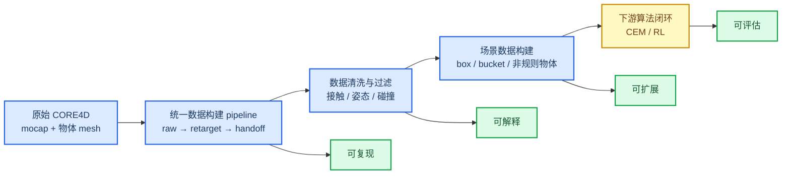

# Core4D 数据构建侧科研贡献：让下游学习建立在可信数据上

_半页 PPT 口径 · 面向项目汇报_

---

## 一句话

我们围绕 Core4D 人-物交互数据，建立了一套从原始 mocap 到下游 CEM/RL 的数据构建方法：既能自动筛选高质量样本，也能构建可扩展的物体场景，并把数据质量证据传递给下游算法。

## 一张图

## 核心贡献

- **完整数据构建 pipeline**：从原始 mocap、物体 mesh、OmniRetarget、SPIDER 输入到 CEM/RL handoff，形成可复现的数据链路。
- **数据清洗/过滤方法**：用接触距离、多阈值候选、姿态安全、下肢-物体干涉和视觉审查过滤低质量样本，避免把数据问题传给算法。
- **场景数据构建能力**：重建可信 source scene template，并支持不同物体形态的场景变种；box 可自动构建，bucket/非规则物体可生成可审查 proxy。
- **下游算法闭环**：为 CEM/RL 提供带证据的候选库和统一 handoff，使下游结果能反向用于分析数据质量和样本可用性。

## 可以汇报的结论

当前最重要的进展不是“多跑了多少 case”，而是把 Core4D 数据构建变成了一个可复现、可解释、可扩展的研究基础设施：后续可以系统扩充物体类型和样本规模，并开展更公平的 retargeting / RL 算法比较。
