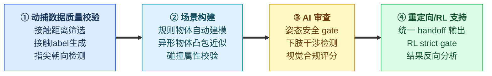

# Core4D 数据构建流程

_半页 PPT · 横幅四阶段_

---

```mermaid
flowchart LR
    accTitle: Core4D 数据构建流程
    accDescr: 四阶段横幅

    A["<b>① 动捕数据质量校验</b><br/>接触距离筛选<br/>接触label生成<br/>指尖朝向检测"]
    B["<b>② 场景构建</b><br/>规则物体自动建模<br/>异形物体凸包近似<br/>碰撞属性校验"]
    C["<b>③ AI 审查</b><br/>姿态安全 gate<br/>下肢干涉检测<br/>视觉合规评分"]
    D["<b>④ 重定向/RL 支持</b><br/>统一 handoff 输出<br/>RL strict gate<br/>结果反向分析"]

    A ==> B ==> C ==> D

    style A fill:#dbeafe,stroke:#2563eb,color:#1e3a5f
    style B fill:#e0f2fe,stroke:#0891b2,color:#164e63
    style C fill:#fef9c3,stroke:#ca8a04,color:#713f12
    style D fill:#dcfce7,stroke:#16a34a,color:#14532d
```
