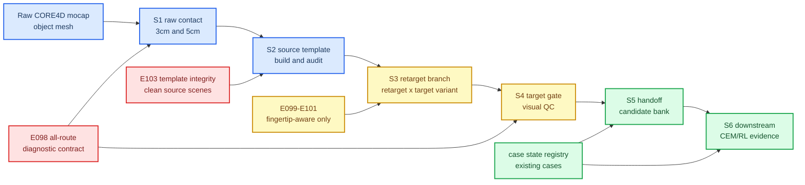
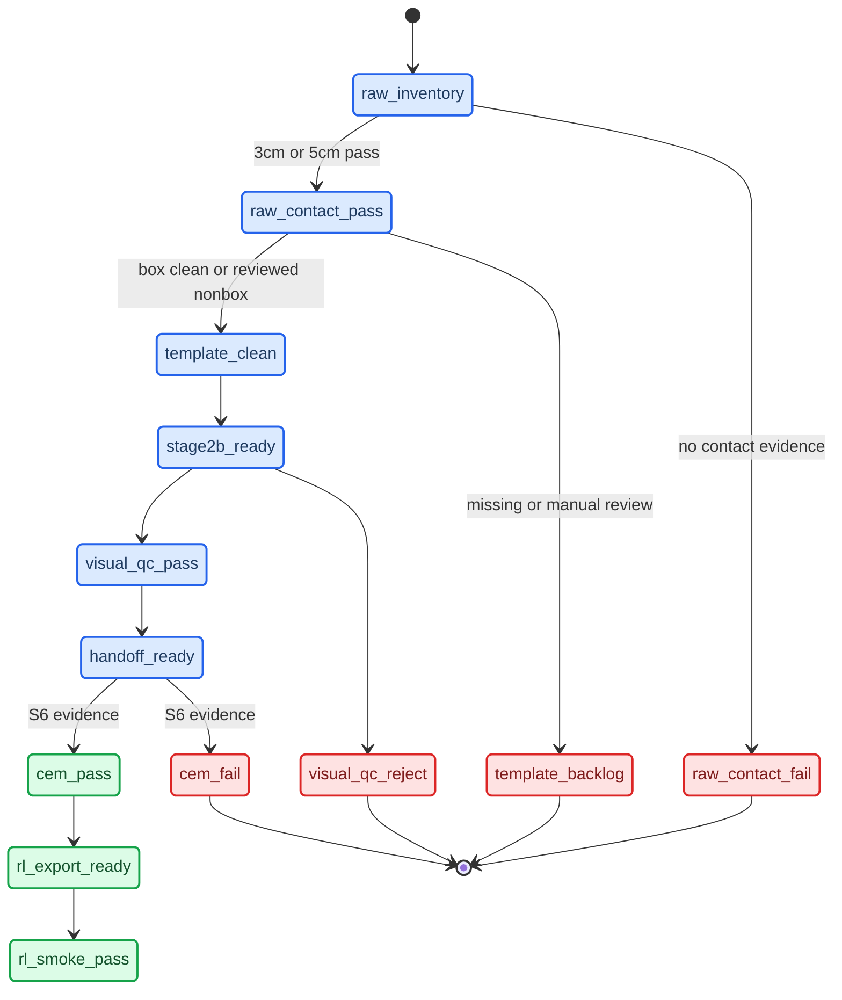
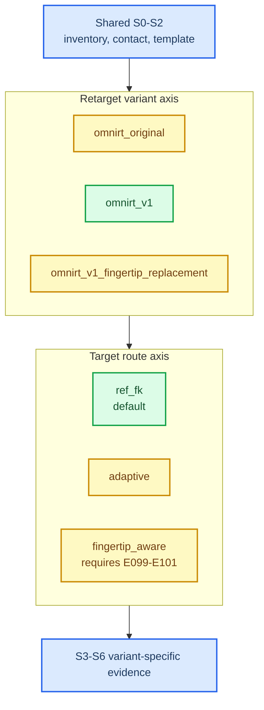
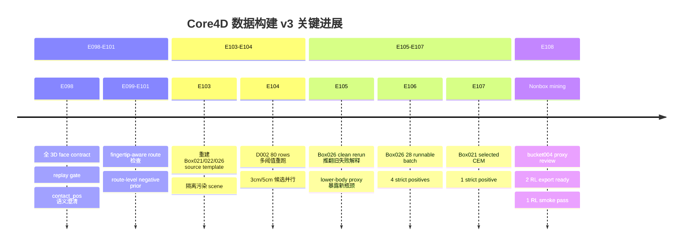

# Core4D 数据构建 v3 科研进展汇报

_Core4D contact-rich human-object manipulation 数据构建侧阶段性总结 · 2026-06-02_

---

## 📌 摘要

本轮工作的核心不是把旧数据处理流程工程化重写，而是把“一个 mocap case 是否能作为 SPIDER/CEM/RL 的有效研究样本”拆成可审计、可复现、可反驳的证据链。E098-E108 的主要结论是：此前一部分算法失败结论混入了数据侧污染，特别是 source scene template 的 robot inertial 污染、raw-contact 覆盖不足、box-era 下游指标误用于 bucket 非 box 物体等问题。修复这些基础数据变量后，Box026 和 Box021 都出现了 clean-scene strict positive，非 box bucket004 也已经从 raw CORE4D 候选进入 CEM/RL handoff，并完成 1 条 RL smoke。

当前 v3 数据管线已经形成初步科研闭环：先用全路线几何/接触 contract 控制输入有效性，再显式版本化 retarget 与 target route，随后通过 visual QC、CEM、lower-body strict proxy 和 RL smoke 分层记录后验表现。该闭环的意义在于把“算法不行”与“数据构建不可信”分离开来，使后续算法优化能基于可复现的数据样本而不是被污染的历史结果。

**关键词：** Core4D，数据有效性，接触重定向，scene template，CEM/RL handoff，非 box 泛化

## 🔬 研究问题

本阶段围绕三个问题展开：

1. **数据有效性问题**：从 raw mocap 到 target scene 的每一步，哪些变量会改变下游 CEM/RL 结论？
2. **泛化问题**：数据构建流程能否从 box 类物体扩展到 bucket 等非 box 物体，同时避免未经审查的 proxy template 污染下游？
3. **可复现问题**：如何把候选、失败、CEM、RL smoke 统一成可恢复的状态证据，而不是散落在历史目录里的人工判断？

这三个问题共同决定后续 RL 实验的科学有效性。数据错误时，CEM/RL 的失败不能直接归因于控制策略；数据门过严时，又会把潜在可用 case 过早排除。

## 🧭 方法概览

v3 的方法是把数据构建拆成 S0-S6，并让每一阶段回答一个明确的科学问题，而不是只产出下一个脚本输入。

| 阶段 | 科学问题 | 主要证据 |
|---|---|---|
| S1 raw contact | 原始 motion 是否存在足够的手-物几何接近关系？ | 3cm/5cm 双阈值候选、per-sequence mask |
| S2 template | source scene 的几何、惯量、collision 是否可信？ | MuJoCo load、robot inertial audit、template visual review |
| S3 retarget | 重定向算法和 target route 改变了什么？ | `retarget_variant_id` × `target_variant_id` manifest |
| S4 visual QC | target scene 是否存在明显物体跳变、初始错位、不可执行现象？ | replay/video/sheet 和人工或 subagent review |
| S5 handoff | 哪些 row 可以被 CEM 消费？ | candidate bank、handoff manifest |
| S6 downstream | CEM/RL 结果是否支持进入 RL positive？ | CEM evidence、lower-body proxy、RL export input、RL smoke |

## 🧪 关键发现

### E098 把基础几何错误变成全路线 contract

E098 的发现是：历史 face selection 使用 xy-only 逻辑，导致顶面/底面接触被错误投到侧面；`contact_pos` 也需要明确是 G1 FK palm site，而不是 raw mocap fingertip。E098 修复后，在 6 个典型 box021 D003 case 中有 5/12 hand 主面翻到 `±z`，并用 replay gate 对 12 个历史 case 做到 12/12 expected verdict 匹配。

这说明数据构建的第一层必须是全路线几何 contract。v3 因此把 E098 纳入默认路径：`ref_fk`、`adaptive`、`fingertip_aware` 都继承这一层检查。相反，E099-E101 不是默认路线的硬门槛，而是 `fingertip_aware` 目标路线的专属 contract。

### E103 证明 template 是下游结论的控制变量

E103 的最重要发现是 Box021/Box026 等 source template 曾继承污染 base，出现 robot link inertial 被 object mass/inertia 污染的问题。重建前后，6 个 canonical source template 被统一从 clean `box023_person1/scene.xml` skeleton 重建，6/6 MuJoCo load 成功，robot inertial 与 clean skeleton 对齐，旧派生污染 scene 保持 quarantine。

这个发现改变了后续科研解释：旧 Box026 full CEM 失败不能继续作为算法失败证据。E105 在 clean scene 下重跑历史 Box026 case，4 条历史 primary rerun 中 3 条从旧 FAIL 变为 upper-body/replay 口径 WORK；E106 又在 28 条 runnable Box026 candidate 中得到 4 条 strict RL-ready positive。也就是说，template 不是工程细节，而是会改变正负样本标签的实验变量。

### 多阈值 raw contact 修正了候选覆盖偏差

E104 重新跑 medium-box D002，并同时输出 3cm/5cm 两套 raw-contact 候选。80 个 case-person 中，3cm 得到 46 pass / 5 review / 29 fail，5cm 得到 48 pass / 5 review / 27 fail。删除错误的 `size_vs_box023_volume_ratio > 3.0` hard reject 后，Box026 不再被尺寸比错误排除，而是进入后续 visual/dynamics gate 排序。

该结果说明 raw-contact 阈值是 recall/precision 的研究变量，不能被隐藏成单一人工阈值。v3 因此固定输出 3cm 和 5cm 两档候选，并显式记录后续使用哪一档进入 S2/S3。

### lower-body strict proxy 改变了 RL positive 的定义

E105、E106、E107 共同显示，只看手部 contact 和物体轨迹误差会过于乐观。E105 的 6 条 Box026 clean rerun 在 upper-body/replay 口径里有多条 WORK，但 6/6 都超过 lower-body strict proxy；E106 的 15 条 upper-body WORK 中有 11 条被 lower-body strict 拦下；E107 的 4 条 Box021 selected CEM 中只有 1 条 strict positive。

因此 v3 的下游候选不能把“CEM 物体跟踪好”直接等价为“RL positive”。更合理的定义是同时满足 replay/upper-body safety、lower-body/object interference proxy 和可定位的 scene_act/trajectory/contact_mask 证据。

### 非 box bucket004 初步打通了从 raw 到 RL smoke

E108 验证了 v3 可以从 raw CORE4D 自动筛出非 box 候选，并用 reviewable proxy template 保护下游。40 个非 box 抽样中，5cm 阈值得到 34 pass / 1 review / 5 fail；bucket004_person1 经 high subagent template review 后，4 条 row 完成 Stage2b 和 target gate，3 条进入 CEM，2 条 CEM-pass 成为 `RL_EXPORT_READY`，其中 1 条完成 Holosoma RL smoke。

更重要的是，E108 发现 box-era `lie_on_box` strict 规则会把 bucket 上沿/桶壁 proximity 误报为失败。因此非 box 不是简单复用 box 指标，而需要保留原始 strict 数值，同时记录 bucket-aware visual CEM override 和 failure mode。

## 📊 证据矩阵

| 科研主张 | 关键数字 | 证据位置 | 当前结论 |
|---|---:|---|---|
| E098 几何 contract 能捕获历史 face bug | 5/12 hand 主面翻到 `±z`；12/12 replay back-test 匹配 | `workspace/core4d/log/122_E098_diagnostic_infrastructure_results.md` | 应作为所有 route 的基础检查 |
| E103 template 修复改变下游结论 | 6/6 source template clean；84 个历史派生污染 scene quarantine | `workspace/core4d/log/128_E103_source_template_rebuild_results.md` | 旧 polluted-template CEM 结论不能硬用 |
| E104 多阈值 raw contact 提升候选覆盖 | 80 rows；3cm 46 pass；5cm 48 pass | `workspace/core4d/log/131_E104_d002_multithreshold_remine_results.md` | 3cm/5cm 应并行输出，不互相覆盖 |
| E106 Box026 clean batch 产生 strict positive | 28 runnable；4/28 RL strict positive | `workspace/core4d/log/133_E106_box026_30candidate_ref_fk_batch_results.md` | Box026 不是整体不可用，需 lower-body 过滤 |
| E107 Box021 clean selected CEM 产生窄正例 | 1/4 selected strict positive | `workspace/core4d/log/135_E107_box021_selected4_full_cem_results.md` | Box021 可用性低但不是零 |
| E108 非 box bucket004 打通到 RL smoke | 4 Stage2b；3 CEM；2 RL export ready；1 RL smoke pass | `workspace/core4d/log/138_E108_nonbox_cem_and_rl_handoff.md` | 非 box 泛化具备初步可行性 |
| 状态管理支持复现与跳过 | `existing_cases.tsv` 为 1931 rows；E108 RL export ready 为 2 rows | `workspace/core4d/data_construction_v3/existing_cases.tsv`；`workspace/core4d/results/E108/s6_downstream/rl_export/rl_export_input.tsv` | 可从已验证状态恢复，也可从 raw 重跑 |

## 🧱 数据状态与下游证据分离

v3 的重要设计是：S1-S5 记录数据事实，S6 记录 CEM/RL 后验表现。CEM 失败或 RL smoke 成功不会反向改写 raw contact、template、Stage2b 或 visual QC 的事实状态。

这种分离直接解决两个科研风险：

- 下游 RL 训练不应该扫描 CEM 目录猜输入，而应消费 join 后的 `rl_export_input.tsv`，其中必须带 `scene_act`、trajectory、contact mask 和 CEM result。
- 失败 case 也必须进入状态表，否则 resume 时会重复跑已经证明失败的 row，导致结果不可解释。

## 🧬 retarget 与 target route 的控制变量

v3 把 OmniRetarget/input rewrite 和 SPIDER target route 分成两个独立轴。`omnirt_v1_fingertip_replacement` 是 input rewrite 参数，`fingertip_aware` 是 target route；二者可以组合，但不能互相冒充。

该设计让 E098-E101 的结论落点更清楚：E098 是所有路线的基础 contract；E099-E101 是 `fingertip_aware` route 的进入条件，不应该阻塞默认 `omnirt_v1/ref_fk`。

## 🕒 实验演进

_时间线概括 E098-E108 如何从诊断 bug 修复，推进到 clean template、box strict positive 和非 box RL handoff：_

## 📈 当前可报告结果

| 对象/路线 | 候选来源 | CEM 规模 | strict positive / RL-ready | 主要科学解释 |
|---|---:|---:|---:|---|
| Box026 `ref_fk_clean` | E104 3cm Box026 候选 | 28 runnable | 4 strict positive | clean template 后可用，但 lower-body 干涉是主要瓶颈 |
| Box021 `ref_fk_clean` | E107 selected clean rows | 4 selected | 1 strict positive | 不是完全不可用，但 strict-positive 产率低 |
| bucket004 `omnirt_v1/ref_fk` | E108 5cm nonbox bucket004 | 3 CEM | 2 RL export ready；1 RL smoke pass | 非 box 可行，但需要 bucket-aware 下游解释 |

这些结果支持一个更谨慎的结论：v3 当前不是已经获得大规模 RL-ready 数据集，而是建立了能持续扩展、能区分数据失败和算法失败的实验筛选机制。

## ⚠️ 局限与风险

| 风险 | 当前处理 | 后续需要 |
|---|---|---|
| 非 box proxy template 不等于真实物理 | proxy 默认 `manual_review_required`，bucket004 经 review 后才 `clean_reviewed` | 扩展到更多非 box 类别时需要人工或 subagent review 证据 |
| lower-body proxy 仍是几何代理，不是人工 GT | 作为 RL-ready hard filter 使用，记录 min SDF 和 interference frac | 与真实视频/物理成功标准建立更系统的一致性检查 |
| bucket-aware override 有人工判断成分 | 保留 box-era strict 原始数值，同时写 failure mode 和 override notes | 为 bucket/board/stick 分别建立对象类型特异指标 |
| `fingertip_aware` 真实执行 adapter 尚未完备 | E099-E101 只作为 route diagnostics，不冒充 `ref_fk` 输出 | 后续实现专门 target adapter 后再做公平对照 |
| RL smoke 不等价于完整 RL 收敛 | S6 明确区分 `DOWNSTREAM_CEM_PASS`、`DOWNSTREAM_RL_PASS`、checkpoint evidence | 后续需要多 case 完整训练和泛化评估 |

## 🎯 下一步科研计划

1. **扩展 strict-positive bank**：优先从 E106 的 4 条 Box026 strict positive、E107 的 1 条 Box021 strict positive、E108 的 2 条 bucket004 RL export ready 进入 RL 训练池。
2. **对象类型指标分层**：为 box、bucket、board/stick 分别定义下游 safety/contact proxy，避免 box-era `lie_on_box` 误伤非 box。
3. **非 box 扩展实验**：在 bucket004 之外，继续筛 bucket/board/stick 的可 review template 和可进入 CEM 的 case，验证 E108 不是单一对象偶然成功。
4. **route 对照实验**：在 `ref_fk` 默认路线稳定后，再补 `adaptive` 和 `fingertip_aware` 的专门 adapter 与 E099-E101 证据，避免把 target route 变化混入 retarget solver 变化。
5. **状态注册表常态化**：把成功、失败、未跑、manual review required 都写入 `existing_cases.tsv` / run registry，使后续机器可以从 raw 重跑，也可以从已验证状态恢复。

## 📚 附：主要本地证据索引

| 类型 | 路径 |
|---|---|
| v3 规范入口 | `workspace/core4d/docs/data_construction_v3/README.md` |
| 管线阶段定义 | `workspace/core4d/docs/data_construction_v3/02_pipeline_stages.md` |
| 诊断 contract | `workspace/core4d/docs/data_construction_v3/10_diagnostic_contracts.md` |
| retarget variant 管理 | `workspace/core4d/docs/data_construction_v3/08_retarget_variants.md` |
| E098 几何诊断 | `workspace/core4d/log/122_E098_diagnostic_infrastructure_results.md` |
| E103 template 重建 | `workspace/core4d/log/128_E103_source_template_rebuild_results.md` |
| E104 多阈值候选 | `workspace/core4d/log/131_E104_d002_multithreshold_remine_results.md` |
| E105 Box026 clean rerun | `workspace/core4d/log/132_E105_box026_clean_scene_full_cem_rerun_results.md` |
| E106 Box026 batch | `workspace/core4d/log/133_E106_box026_30candidate_ref_fk_batch_results.md` |
| E107 Box021 selected CEM | `workspace/core4d/log/135_E107_box021_selected4_full_cem_results.md` |
| E108 非 box handoff | `workspace/core4d/log/136_E108_nonbox_candidate_mining.md`；`workspace/core4d/log/138_E108_nonbox_cem_and_rl_handoff.md` |
| E108 canonical results | `workspace/core4d/results/E108/00_README.md` |
| E108 RL export input | `workspace/core4d/results/E108/s6_downstream/rl_export/rl_export_input.tsv` |
| 历史 case seed | `workspace/core4d/data_construction_v3/existing_cases.tsv` |
