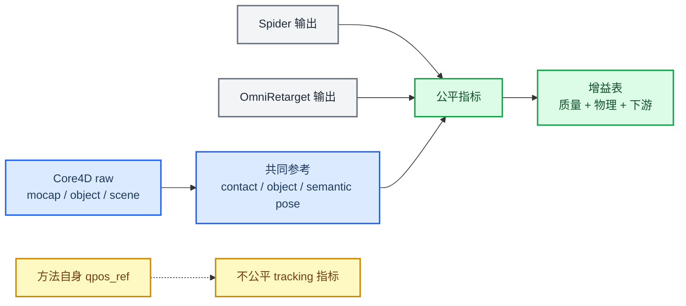

# Spider vs OmniRetarget 公平评测指标调研与协议

_面向 Core4D / SPIDER / OmniRetarget 结果对比，2026-06-02_

---

## 结论

可以评测 Spider 相对 OmniRetarget 的增益，但现有历史表不能直接作为最终公平结论。核心原因是：当前不少 `paper_*` 指标把每条方法自己的 retarget reference 当作 `qpos_ref`；OmniRetarget kinematic 结果在 adapter 里甚至是 `qpos_ref=qpos`，所以 body/object tracking 误差天然接近 0。这类指标适合诊断 Spider 是否贴近某条 reference，不适合横向证明 Spider 比 OmniRetarget 更好。

公平评测应把 **Core4D 原始 mocap、原始 object trajectory、scene geometry、raw contact label** 作为共同参考，只在这些共同参考或物理几何上定义指标。推荐主表使用：raw object trajectory error、raw contact mask overlap、penetration/collision、foot skating、pelvis/fall、腿/身体-物体干涉、carry progress、下游 RL/WBT success。



## 历史结果

最接近现成对比的是 `workspace/core4d_collab_retarget/log/26_E026_full_eval_results.md`。它已经把 `omniretarget_kinematic`、`spider_E081_full_rerun`、`spider_E018b`、`spider_best_E018b_E022_E025` 放在同一批 13 case 账上，但里面的 object/body tracking 对 OmniRetarget 是 self-ref 口径，因此只能作为历史诊断，不应直接作为最终公平增益。

| 方法 | 覆盖 | 可用结论 | 不宜直接解读的列 |
|---|---:|---|---|
| `omniretarget_kinematic` | 12/13 | kinematic baseline 覆盖较高；28cm contact mean 约 `53.6%`；MJ penetration 为 `0%` | object pos/ori 为 `0` 是 self-ref，不代表比 Spider 更准 |
| `spider_E081_full_rerun` | 13/13 | object error 约 `27.1cm`，contact proxy 约 `36.2%`，fall `4/13`，strict `4/13` | E081 是 scene-actuator baseline，不等于当前 best dynamic |
| `spider_E018b` | 13/13 | object error 约 `5.45cm`，contact proxy 约 `54.4%`，fall `4/13`，strict `1/13` | object error 是对 retarget reference，不是 raw object GT |
| `spider_best_E018b_E022_E025` | 13/13 | object error 约 `5.33cm`，contact proxy 约 `55.9%`，fall `3/13`，strict `1/13` | best selection 是后验选择，不是单一算法版本 |

`workspace/core4d/log/114_E092_three_case_spider_dynamic_and_omniretarget_rl_results.md` 提供了更新的 3 case route 对照。Stage A full 中 C1 `box004` Spider dynamic 为 `WORK`，C2/C3 Box026 失败；direct Omni smoke 三条均失败。这个结果说明 Spider dynamic 在部分 case 上能明显改善姿态和接触，但 E092 的 `rl_from_omni` 当前仍接 MJWP 栈，不能当作完整 PPO/RL 收敛对比。

## 指标分级

### 不推荐作为横向胜负

这些指标在本地 `workspace/core4d_collab_retarget/scripts/eval/paper_metrics.py` 中主要计算 `qpos` vs `qpos_ref`。当 `qpos_ref` 来自某个方法自身，或 OmniRetarget adapter 设置 `qpos_ref=qpos` 时，横向比较会偏置。

| 指标 | 问题 |
|---|---|
| `paper_spider_joint_err_deg` | 对 robot joint ref，不是 raw mocap GT |
| `paper_spider_pos_err_cm` / `paper_spider_ori_err_deg` | 对 FK body ref；OmniRetarget self-ref 会接近 0 |
| `paper_spider_root_*` / `paper_spider_eef_*` | 同上，适合诊断 reference tracking，不适合方法公平性 |
| `paper_object_Epos_case_m` / `paper_object_Erot_case_deg` | 当前 Spider 多数是对 retarget object ref，OmniRetarget kinematic 是 self-ref |
| `paper_dynaretarget_relative_smoothness` | 分母是自身 reference smoothness，跨方法含义不稳定 |

### 可用但必须带 caveat

| 指标 | caveat |
|---|---|
| `paper_omniretarget_contact_preservation_local_*` | 复现 OmniRetarget 28cm object-local 口径，但大物体上可能退化；公平版应显式传入 Core4D raw object pose |
| `paper_omniretarget_foot_skating_*` | stance/contact 判定应来自 raw mocap 或统一规则，不能来自方法自己的 ref |
| `paper_omniretarget_contact_preservation_5cm_pct` | 只有 desired contact 来自 raw contact mask 时才公平；fallback ref contact count 不够干净 |

### 推荐进入公平主表

| 类别 | 指标 | 方向 | 共同 GT / 依据 |
|---|---|:-:|---|
| Raw object tracking | object SE(3) error、final displacement error、carry progress ratio | ↓ / ↑ | `smooth_objposes.npy` 或 v3 inventory 记录的 raw object pose |
| Raw contact consistency | hand-object contact precision/recall/F1、duration overlap、timing offset | ↑ / ↓ | S1 raw contact 3cm/5cm mask |
| Collision / penetration | MJ penetration duration、max depth、robot-object deep penetration | ↓ | MuJoCo geometry / object mesh，不依赖 retarget GT |
| Body safety | pelvis min、fall rate、head/upper-body penetration、hand-floor shortcut | ↑ / ↓ | robot rollout geometry |
| Lower-body interference | leg-object contact/interference fraction、min SDF、object-floor contact | ↓ | E081/E105 style leg/body-object proxy |
| Foot skating | stance foot xy speed、skating duration、max velocity | ↓ | stance frames from raw foot contact or unified velocity-height rule |
| Kinematic feasibility | joint limit violation、velocity/acceleration/jerk、temporal spike | ↓ | robot limits and output trajectory |
| Downstream | RL/WBT success、object progress、object z height、contact group fractions | ↑ / ↓ | same simulator, controller, reward and hyperparameters |

## 论文和项目依据

OmniRetarget 论文把 retarget 质量主要定义为 penetration、foot skating、contact preservation，并报告 downstream RL success；论文动机也明确指出传统 retargeting 会产生 foot-skating 与 penetration 这类物理 artifact。[^1] SPIDER 论文强调从 kinematic-only human demo 生成 dynamically feasible robot trajectories，因此 Spider 的优势应通过物理可行性、接触序列和下游学习效果体现，而不是只看对某条 kinematic ref 的误差。[^2]

DynaRetarget 和 KDMR 这类新近方法也把 dynamic feasibility、smoothness、contact/GRF、downstream policy efficiency 作为评估维度，支持我们把 reference-level 和 rollout-level 指标分层。[^3][^4] OMOMO 对 human-object interaction 使用 MPJPE/MPVPE/HandJPE、contact precision/recall/F1、collision 等指标，说明 raw human-object contact 可以作为共同参考，而不需要把某个 retarget 方法当 GT。[^5]

Holosoma 本地代码也支持这个拆分：`workspace/v1/scripts/eval_paper_metrics.py` 对齐 OmniRetarget Table II，`src/holosoma/holosoma/utils/eval_metrics.py` 计算下游 WBT 的 object progress、object height、object tracking 和 body-group contact。后续公平评测可以复用这些定义，但需要把 raw object/contact 显式接入。

## 建议评测协议

1. 固定 case set：先用 E026 13 case 与 E092/E105-E108 中已验证的 case，后续再扩展 v3 candidate bank。
2. 固定模型：同一 G1 MJCF、同一 object mesh/proxy、同一 collision group、同一 timebase。
3. 构建 raw-GT 包：每个 case 保存 `raw_object_pose`、`raw_contact_mask_3cm/5cm`、raw foot stance、case window、scene mesh。
4. 对每个方法输出独立评估：Spider 与 OmniRetarget 都只提供 `qpos/trajectory`，不提供 GT。
5. 先做 reference-level 表：raw object、raw contact、penetration、foot skating、joint limits、smoothness。
6. 再做 rollout-level 表：同一 MuJoCo/Isaac/Holosoma 控制器，统计 fall、transport、contact groups、lower-body shortcut、RL/WBT success。
7. 报告分层：box / bucket / desk 等物体分开，carry / push / pull / low pose 分开，避免 aggregate 掩盖 failure mode。

## 需要新补的实现

建议新增一个独立评测入口，而不是继续复用当前 E026 表：

```text
workspace/core4d/scripts/eval/compare_spider_omniretarget_fair.py
workspace/core4d/results/E###/fair_eval/
  inputs/
    case_set.tsv
    raw_gt_manifest.tsv
  outputs/
    method_case_metrics.tsv
    method_summary.tsv
    figures/
```

输入列建议：

| 字段 | 说明 |
|---|---|
| `case_id` | 统一 case id |
| `method` | `spider_*` 或 `omniretarget_*` |
| `trajectory_npz` | 方法输出 qpos |
| `scene_xml` | 对应 scene |
| `raw_object_pose` | Core4D raw object pose |
| `raw_contact_mask` | raw contact 3cm/5cm mask |
| `raw_human_joints_or_vertices` | raw SMPL-X joints/vertices |
| `case_window_start/end` | 统一评估窗口 |

首版先做 reference-level 公平表，不等 RL：

| 输出指标 | 首版可实现性 |
|---|---|
| raw object pos/ori error | 高 |
| raw contact P/R/F1 | 高 |
| penetration duration/max depth | 高 |
| pelvis min/fall | 高 |
| leg/body-object interference | 中，需要统一 geom groups |
| foot skating | 中，需要统一 stance label |
| downstream RL success | 后续，成本高 |

## 风险

- 28cm contact preservation 不能单独作为强证据。E026 已经做过 threshold sweep，说明 28cm 是 Holosoma/OmniRetarget 复现口径，但在大物体上会阈值敏感或退化。
- Raw mocap 不能直接等价为 robot joint GT。人体和 G1 形态不同，公平 pose 指标应比较 semantic keypoints、relative geometry、contact timing，而不是逐关节角。
- Object tracking 必须明确 GT 来源。若用方法自己的 object ref，OmniRetarget kinematic 会天然 0 error；公平版必须回到 Core4D `smooth_objposes.npy`。
- 下游 RL 指标必须固定 reward、controller、超参和训练预算。否则路线差异会和训练配置混在一起。

## 下一步

建议先开一个小实验：用 E026 13 case 中 OmniRetarget 覆盖的 12 case，加 E092 的 3 case，重算一张不含 self-ref 的 `fair_eval` 表。第一版只做 raw object、raw contact、penetration、pelvis/fall、leg/body interference，不先跑 RL。等这张表稳定后，再把可用 case 接入 Holosoma WBT/RL 指标做 downstream comparison。

[^1]: Yang et al. (2025). "OmniRetarget: Interaction-Preserving Data Generation for Humanoid Whole-Body Loco-Manipulation and Scene Interaction." arXiv. https://arxiv.org/abs/2509.26633

[^2]: Pan et al. (2025). "SPIDER: Scalable Physics-Informed Dexterous Retargeting." arXiv. https://arxiv.org/abs/2511.09484

[^3]: Dhedin et al. (2026). "DynaRetarget: Dynamically-Feasible Retargeting using Sampling-Based Trajectory Optimization." arXiv. https://arxiv.org/abs/2602.06827

[^4]: Zhang et al. (2026). "Kinodynamic Motion Retargeting for Humanoid Locomotion via Multi-Contact Whole-Body Trajectory Optimization." arXiv. https://arxiv.org/abs/2603.09956

[^5]: Li et al. (2023). "Object Motion Guided Human Motion Synthesis." arXiv. https://arxiv.org/abs/2309.16237
